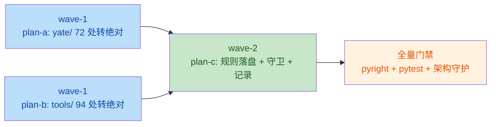

# abs-import-api-style 主计划（issue IKKS4C）

> Enhance - 包一律使用绝对导入，检查其他 python 代码规范。
> 本计划为总纲；实施细节拆入 `abs-import-api-style-plans/`（见 §五）。

## 一、目标与非目标

### 目标

1. **规则落盘**：`../rules/python-coding-style.md` §1.3 由「绝对导入优先……相对导入仅在子包内部使用」改为「包内一律使用绝对导入」，附正反例；§1.2 增补「开放 API 公共成员禁止下划线前缀」命名条款（议题 2 的规则化）。
2. **存量整改（议题 1）**：`yate/` 包 72 处、`tools/` 包 94 处相对导入全部转绝对导入（`tests/` 已 0 处，无需整改）。
3. **开放 API 审查（议题 2）**：交叉核对「叶包 `__init__.py` re-export 面 / `services/extensions.py` ExtensionAPI 面 / 插件手册 `yate/docs/extensions.*.md` 引用面」三处，确认公共成员无下划线前缀；例外逐条登记。
4. **其他规范审查（议题 3）**：对照 `../rules/python-coding-style.md` 抽查 10+ 模块，修正明确错误/过时表述与低成本对齐项，争议项列观察项不动手。
5. **架构守卫**：`tests/test_architecture.py` 新增相对导入拦截用例，防止回归。

### 非目标

- 不做全仓导入字母序大清洗（churn 无行为收益；仅对齐本任务触碰的导入区）。
- 不改 `tools/probes/**`（pyright exclude 区，legacy 一次性探针，无相对导入命中）。
- 不改 `pack/*.spec`（PyInstaller spec 由 `tests/test_pack_spec.py` AST 守卫覆盖，与导入风格无关）。
- 不重命名任何带下划线的内部成员（议题 2 审查结论为零整改，见 §三.2）。
- 不改 `tests/` 现有导入（已全部绝对形态）。

## 二、调研事实清单（文件:行号）

### 议题 1：相对导入分布（`^\s*from\s+\.+` 全量扫描）

- **`yate/` 72 处、46 个文件**：
  - `yate/editor_view/` 16 文件 40 处（形态 `from . import theme` / `from .icons import ...` / `from .scrollbars import ...`），如 `yate/editor_view/editor.py:33-36`、`yate/editor_view/statusbar.py:28-30`、`yate/editor_view/explorer.py:26-29`、`yate/editor_view/theme.py:32,40,45`（多行括号形态）、`yate/editor_view/welcome.py:17`；
  - `yate/editor_lsp/` 3 文件 5 处：`yate/editor_lsp/parsing.py:24`、`yate/editor_lsp/client.py:30`、`yate/editor_lsp/manager.py:32,33,41,42`（41-42 是 `from .parsing import _from_utf16 as _from_utf16` 显式 re-import 形态）；
  - `yate/editor_term/` 2 文件 6 处：`yate/editor_term/__init__.py:13-16`（包根 re-export）、`yate/editor_term/emulator.py:26-27`（26 行 `as key_to_terminal` 显式 re-import）；
  - `yate/editor_sprites/` 25 文件 25 处：`chars/` 下 24 个精灵数据文件各 1 处 `from ._shared import SHARED`（如 `yate/editor_sprites/chars/star.py:7`）、`yate/editor_sprites/characters.py:25`（多行 `from .chars import (`）。
- **`tools/` 94 处、37 个文件**：`tools/release/`（2 文件）、`tools/smoke_test/`（5 文件）+ `tools/smoke_test/scenarios/`（19 文件）、`tools/changelog/`（6 文件）、`tools/pack/`（5 文件）；跨子包形态 `from .._util import repo_root`（`tools/pack/icon.py:23` 等 5 处）、`from ..harness import ...`（scenarios 全部 18 文件）。
- **`tests/` 0 处**：全量 `^\s*(from\s+\.+|import\s+\.+)` 扫描无命中；`tests/conftest.py:37-41` 与全部测试均为 `from yate.xxx import` / `from tools.xxx import` 绝对形态。
- **运行形态证据（绝对导入可行性）**：tools 一律以 `python -m tools.<pkg>` 从仓库根运行（`.workflow/test.yml:65`、`README.md:361-404`、`CHANGELOG.md:3`）；pyproject `packages = ["yate"]`（`pyproject.toml:161`）；tests 已按包绝对导入 tools（`tests/test_changelog_tool.py:19` 等 18 处）。
- **规则现状**：`../rules/python-coding-style.md:55`（§1.3）「绝对导入优先……相对导入仅在子包内部使用」——与 issue「一律绝对导入」冲突，需重写。

### 议题 2：开放 API 三源交叉核对

- **源 ① 叶包 `__init__.py` re-export 面**：`yate/editor_core/__init__.py:24-31`、`yate/editor_lsp/__init__.py:33-40`、`yate/editor_syntax/__init__.py:42-54`、`yate/editor_term/__init__.py:18-26`、`yate/keymaps/__init__.py:25-33`、`yate/editor_syntax/ts_backend/__init__.py:28-36`——`__all__` 全部成员**无下划线**；`yate/editor_sprites/__init__.py:10-12` 明示不 re-export；`yate/__init__.py:15-17` 仅版本元数据。
- **源 ② ExtensionAPI 面**：`yate/services/extensions.py:300-526`——`ExtensionAPI` 公共成员（`app`/`buffer`/`doc`/`workspace`/`keymaps`/`lsp`/`highlight`/`syntax`/`sprites` 属性、`register_action`/`bind_key`/`command`/`register_command`/`message`/`shell`/`open_path`/`save`、`start_scope`/`end_scope`/`rollback_scope`）与四个 bridge（`LspExtensionBridge`/`HighlightExtensionBridge`/`SyntaxExtensionBridge`/`SpriteExtensionBridge`）公共方法**全部无下划线**；`_ctx`/`_lsp`/`_scope` 等为实现私有，合规。
- **源 ③ 插件手册引用面**：`yate/docs/extensions.en.md` / `extensions.zh.md` 的 `api.*` 成员表（208-273、335-360、490-492 行区段）**全部无下划线**。
- **下划线成员甄别（预期例外）**：
  - `_TsPoint` / `_TsNode`（`yate/editor_syntax/ts_backend/backend.py`，R2 冻结白名单 `tests/test_architecture.py:104-108`）：叶包内部私有结构化类型，不进 `__all__`、手册不引用 → **非开放 API，保留下划线**；
  - `_from_utf16` / `_to_utf16`（`yate/editor_lsp/parsing.py`，经 `yate/editor_lsp/manager.py:41-42` 模块内 re-import）：包内解析辅助，manager 不在包根 `__all__` 面 → **非开放 API，保留**；
  - `_WelcomeRow`（`yate/editor_view/welcome.py`，经 `yate/editor_view/editor.py:36` 导入）：L2 组件内部，插件禁入 `editor_view`（R3）→ **非开放 API，保留**。
- **反向核查（无下划线但实为内部被误暴露）**：`api.app` 可达对象的公共面——`LspManager`（`yate/editor_lsp/manager.py:98-650`，`set_client_factory`/`register_server`/`states`/`diagnostics_for` 等全公共名）、`TextBuffer`（`yate/editor_core/buffer.py:89-632`，私有 `_ensure_writable`/`_commit` 等均带下划线）、`EditorSession` / 注册表——**无误暴露**；`start_scope`/`end_scope`/`rollback_scope` 的 docstring 已注明 loader 驱动语义（`extensions.py:316-346`），属有意公开。
- **结论：议题 2 零代码整改**，产物是规则落盘（§1.2 新条款）+ 例外登记。

### 议题 3：规则与代码抽查（10+ 模块）

抽查覆盖：`extensions.py`、`editor_syntax/__init__.py`、`editor_core/__init__.py`、`editor_lsp/{__init__,manager}.py`、`keymaps/__init__.py`、`keyproto/__init__.py`、`editor_term/__init__.py`、`editor_sprites/chars/_shared.py`、`editor_view/editor.py`（导入区）、`tools/smoke_test/harness.py`、`tools/changelog/model.py`、`tests/conftest.py`、`tests/test_architecture.py`、`pyproject.toml`。

横向探针结果：

- `Optional[` / `Union[` / `TypeVar(` / `Generic[` / `# type: ignore`：全仓 **0 处**（§3.2 / §3.5 / §4.2 合规）；
- 裸 `except:`：全仓 **0 处**（§4.5 合规）；
- `from __future__ import annotations`：`yate/` 全部 100+ 模块、`tools/` 全部、`tests/` 全部（§4.1 合规）；
- yate/ 内 `print(` 调试输出：**0 处**（§4.6 合规）；tools CLI 的 print 输出属工具结果输出，非调试，不在禁止语义内。

发现与处置（修正项落入 plan-c / plan-a；观察项不动手）：

| # | 发现 | 证据 | 处置 |
|---|---|---|---|
| 1 | §1.3「相对导入仅在子包内部使用」与 issue「一律绝对导入」冲突 | `../rules/python-coding-style.md:55` | **plan-c 修正**（议题 1 落盘） |
| 2 | §1.2 命名表「包 \| `snake_case`（单下划线或无前缀）」表述含混 | `../rules/python-coding-style.md:37` | **plan-c 修正**为明确表述 |
| 3 | 缺「开放 API 公共成员禁下划线」成文条款（issue 第 2 点） | 同上文件 §1.2 | **plan-c 增补**（议题 2 落盘） |
| 4 | `extensions.py` 导入组内字母序违规（`editor_lsp.manager` 排在 `editor_lsp.client` 前） | `yate/services/extensions.py:42-43` | **plan-a 顺手修正**（该文件不涉相对导入，但属导入区对齐主题） |
| 5 | `tools/smoke_test/harness.py:32-37` env 注入先于导入 + `# noqa: E402` | 同文件（与 `tests/conftest.py:35` 同模式） | **观察项**：防 python_lsp 扩展探针的既有惯例，规则未成文化，记录不改 |
| 6 | `tests/test_smoke_cli.py:27` 白盒导入私有 `_worse`/`_write_json` | 同文件 | **观察项**：测试白盒惯例，不动 |
| 7 | §1.3「组内字母序」未全仓严格执行 | 各模块普遍现象 | **观察项**：不做全仓清洗；仅对齐本任务触碰的导入区 |
| 8 | §1.2 TypeVar 行已标注「遗留，见 §3.5」 | `../rules/python-coding-style.md:44` | **观察项**：已有交叉引用，保留 |

## 三、三项议题裁定

### 1. 绝对导入：`yate/` 与 `tools/` 全部转绝对，`tests/` 天然合规

- **裁定**：`yate/`（72 处 46 文件）与 `tools/`（94 处 37 文件）的相对导入全部转为绝对导入；`tests/` 已合规不动。
- **理由**：issue 原文「包一律使用绝对导入」；`yate/` 是发布包（wheel）、`tools/` 是仓库内包（`tools/__init__.py` 存在、tests 以 `from tools.xxx import` 消费、CI 以 `python -m tools.changelog` 运行），两者都是"包"，相对导入只存在于包内部互引——正是 issue 要收敛的形态。绝对化后导入意图（`from yate.editor_view import theme`）自解释，且与 tests/tools 对 yate 的既有绝对风格统一。
- **守卫**：plan-c 在 `tests/test_architecture.py` 新增 `test_no_relative_imports`（AST 扫 `ast.ImportFrom.level > 0`，范围 `yate/` + `tests/` + `tools/`）。

### 2. 开放 API 公共成员：零整改，规则化 + 例外登记

- **裁定**：三源交叉核对确认现有开放 API 无带下划线的公共成员（证据见 §二 议题 2）；`_TsPoint` / `_TsNode` / `_from_utf16` / `_to_utf16` / `_WelcomeRow` 登记为「内部私有，非开放 API」例外，不重命名。
- **理由**：重命名无收益——它们不被 `__all__`、不被 ExtensionAPI、不被插件手册三处任一引用；`_TsPoint`/`_TsNode` 还在 R2 冻结白名单（动它要同步架构规则与守卫，纯属无意义 churn）。
- **落盘**：`python-coding-style.md` §1.2 新增「开放 API 命名」条款：开放 API 成员（叶包 re-export 面、`ExtensionAPI`/`ExtensionContext` 面、插件手册引用面）禁下划线前缀；私有实现必须带下划线；例外在该条款内登记。

### 3. 其他规范：两处规则文本修正 + 一处代码对齐，其余列观察项

见 §二 议题 3 表格 #1/#2/#3（plan-c）与 #4（plan-a）；#5-#8 观察项不动手。

## 四、备选方案与否决理由

| 备选 | 内容 | 否决理由 |
|---|---|---|
| A1 只改 `yate/`，`tools/` 保留相对导入 | issue 只说"包"；tools 非 pip 发布物 | 否决：`tools/` 同样是包（tests 绝对导入、CI `-m` 运行、pyright strict 覆盖），规则适用范围明文含 tools；半改会让守卫测试只能覆盖一半，规则与代码再漂移 |
| A2 规则保留"子包内部允许相对导入"例外 | 改动最小（不碰代码） | 否决：这就是现状，issue 明确要求收紧为"一律"；且 `_Ts*` 类例子说明例外面会持续膨胀，不如一次收敛 |
| A3 用 ruff/isort 自动化全仓导入排序 + 绝对化 | 工具化省事 | 否决：引入新工具链超出本 issue 范围；`force_absolute` 类配置同样会重排未触碰文件的导入，churn 不可控；手工改动 + AST 守卫已足够 |
| B1 重命名 `_from_utf16`/`_to_utf16` 等下划线成员 | "公共成员不带下划线"字面执行 | 否决：三源核对证明它们不是开放 API（见 §三.2）；`_TsPoint`/`_TsNode` 在 R2 白名单，重命名要动架构规则与守卫，收益为零 |
| C1 全仓字母序大清洗 | 顺手把 §1.3 字母序做实 | 否决：无关 diff 淹没本 issue 的语义变更；列为观察项 |

## 五、子计划与执行波次

改动 ≥ 3 文件（yate 47 + tools 37 + 规则 + 测试）、跨 yate/tools/tests 三域 → **大任务**，拆分落盘 `abs-import-api-style-plans/`：

```
abs-import-api-style-plans/
├── overview.md                                        # 总纲：索引 + 波次表 + 依赖图
├── abs-import-api-style-yate-abs-import-plan-a.md     # wave-1：yate/ 72 处转绝对（46+1 文件）
├── abs-import-api-style-tools-abs-import-plan-b.md    # wave-1：tools/ 94 处转绝对（37 文件）
└── abs-import-api-style-rules-and-guards-plan-c.md    # wave-2：规则落盘 + 架构守卫 + 审查记录
```

| 波次 | 子计划 | 独占文件 | 说明 |
|---|---|---|---|
| wave-1 | plan-a ∥ plan-b（文件零重叠，可并行） | plan-a: `yate/**`（47 文件）；plan-b: `tools/**`（37 文件） | 纯导入形态改写，零行为变化 |
| wave-2 | plan-c（串行，依赖 wave-1 全绿） | `.trae/rules/python-coding-style.md`、`tests/test_architecture.py` | 守卫覆盖 yate+tests+tools，必须等两包转完才加入，避免中途红 |



## 六、风险清单与回滚

| # | 风险 | 缓解 | 回滚 |
|---|---|---|---|
| 1 | 相对转绝对引入循环导入 | 两者解析结果完全等价（同一模块对象、同一导入图），仅拼写变化；pyright + pytest 双门禁兜底 | revert 对应波次 commit |
| 2 | tools 以非 `-m` 方式直跑脚本导致绝对导入失败 | 已证全仓文档/CI 均为 `python -m tools.<pkg>` 形态（`.workflow/test.yml:65`、`README.md:361-404`）；plan-b 验收命令含 `-m` 冒烟 | revert plan-b commit |
| 3 | 守卫误伤（tests 未来需要相对导入的合法场景） | 不存在合法场景：`tests/` 非 `__init__.py` 包（无包语义），`from .` 在 tests 下本就 ImportError；规则与守卫一致 | 调整守卫范围需先改规则文本（两处同步） |
| 4 | 规则文本与守卫漂移（改规则忘改守卫） | plan-c 单波次内同时改两处（同 commit）；守卫 docstring 引用规则条款号 | 同 commit 一并 revert |
| 5 | wave-1 并行改写撞车 | plan-a/plan-b 文件清单零交集（`yate/**` vs `tools/**`），子代理按 subagent-workflow 并行下发 | 各自独立 revert，互不影响 |

## 七、总验收门禁（收尾执行）

```
.venv\Scripts\python.exe -m pyright yate/ tests/ tools/
.venv\Scripts\python.exe -m pytest tests/ -q
.venv\Scripts\python.exe -m pytest tests/test_architecture.py -q
```

通过标准：pyright 零诊断；pytest 全绿（含新增 `test_no_relative_imports` 与既有 28 个架构守卫）。

## 八、执行结果回填（2026-10-11 收尾）

### 8.1 执行记录

| 环节 | 执行方 | 结果 |
|---|---|---|
| wave-1 plan-a（`yate/**`） | plan-executor | 47 文件 72 处 ✅ → `dd68645` |
| wave-1 plan-b（`tools/**`） | plan-executor（与 plan-a 并行） | 37 文件 94 处 ✅ → `b44dd86` |
| wave-2 plan-c（规则 + 守卫） | plan-executor（串行） | 规则落盘 + `test_no_relative_imports` ✅ → `6abd1db` |
| 评审 | code-review-expert | 有条件通过：无 blocker/major，放行条件 SUGGESTION-1（计划回填，本节即兑现） |

### 8.2 全量门禁实测（主代理亲跑，含退出码）

| 门禁 | 结果 | 退出码 |
|---|---|---|
| `pyright yate/ tests/ tools/` | 0 errors / 0 warnings / 0 informations | 0 |
| `pytest tests/ -q`（junitxml 权威计数） | **2124 tests / 0 errors / 0 failures / 9 skipped** | 0 |
| `pytest tests/test_architecture.py -q` | **29 passed**（28 既有 + 新守卫） | 0 |
| 覆盖率 `--cov=yate --cov=tools --cov-fail-under=75` | **Total 81.00%**（门槛 75% 通过） | 0 |
| 覆盖率分支口径（评审代理实测） | Total 91.55% | 0 |
| 冒烟 `python -m tools.changelog check` | exit 0（unreleased lag 为 release 前常态） | 0 |
| 冒烟 `python -m tools.pack icon --help` | 正常输出用法 | 0 |
| 负向演练 | 执行代理：注入 `from . import os`（paths.py）→ `--noconftest` 断言红 `[('yate/paths.py', 29)]` → 还原绿；评审代理独立二次演练（临时文件）红 `[('yate/_tmp_guard_drill.py', 1)]` → 绿 | 拦截有效 |

残留扫描：`yate/`、`tools/`、`tests/` 三目录相对导入正则 **0 命中**（改前 72 + 94 + 0）。

### 8.3 三项议题最终结论

1. **包一律绝对导入**：166 处存量整改完成；规则 §1.3 重写落盘；`test_no_relative_imports` 守卫（29 用例）拦截回归；
2. **开放 API 公共成员无下划线**：三源交叉核对**零整改**（叶包 `__all__`、ExtensionAPI 面、插件手册均无违规）；6 个下划线成员甄别为内部私有并登记例外于规则 §1.2；
3. **审查其他规范**：修正 3 项（§1.3 条款本体、§1.2 包名行、extensions.py 导入序）；4 条观察项登记不动手（主计划 §二）。

### 8.4 偏离记录

- **批准环节**：用户显式声明无人值守 bypass，plan-before-execute §二.3 的用户批准以预授权放行（流程偏离，非内容偏离）；
- **wave-1 全量 pytest 集中跑**：双执行代理并行，为避免 pytest 并发互相干扰（subagent-workflow §三.3），全量由主代理汇合后统一跑一次；
- **负向演练 `--noconftest` 适配**：conftest 导入链先于断言炸出 ImportError（exit 4），改用 `--noconftest` 取得断言级红（执行方式偏离，非设计偏离）；
- **plan-a 分组处数笔误修正**：editor_view 实为 35 处（计划误写 40）、editor_lsp 实为 6 处（误写 5），总数 72 不变；
- **pytest 汇总行不回显**：本工作区终端环境特性，计数经 `--junitxml` 权威取证。

### 8.5 提交清单（本分支，仅提交不推送）

`199e3d0` docs(plan) → `dd68645` refactor(yate) → `b44dd86` refactor(tools) → `6abd1db` chore(rules) → `docs(plan)` 本回填。

### 8.6 待办登记（非静默遗漏）

- architecture-boundaries.md §六 用例对照表补行（28 → 29）与「28 个用例」计数同步：按 plan-c §四.4c 留待下次触碰该文件时一并处理。
