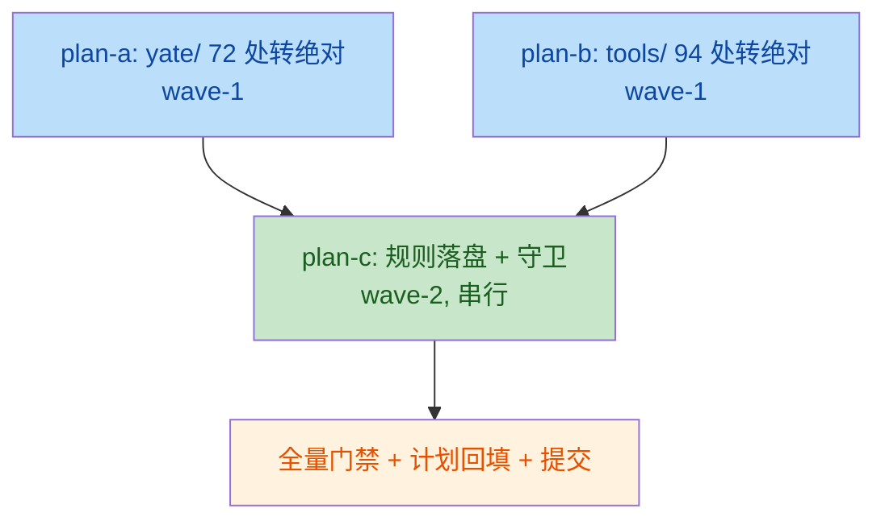

# abs-import-api-style 子计划总纲

> issue IKKS4C：包一律使用绝对导入，检查其他 python 代码规范。
> 总纲见 [../abs-import-api-style-plan.md](../abs-import-api-style-plan.md)（目标 / 非目标、备选方案、风险与回滚、三项议题裁定）。

## 子计划索引

| 子计划 | 波次 | 独占文件域 | 规模 |
|---|---|---|---|
| [yate-abs-import-plan-a](abs-import-api-style-yate-abs-import-plan-a.md) | wave-1 | `yate/**`（47 文件：46 个含相对导入 + extensions.py 排序对齐） | 72 处改写 |
| [tools-abs-import-plan-b](abs-import-api-style-tools-abs-import-plan-b.md) | wave-1 | `tools/**`（37 文件） | 94 处改写 |
| [rules-and-guards-plan-c](abs-import-api-style-rules-and-guards-plan-c.md) | wave-2 | `../../rules/python-coding-style.md` + `tests/test_architecture.py` | 规则落盘 + 新守卫 + 审查记录 |

## 执行波次表（调度唯一依据）

| 波次 | 并行组 | 前置条件 | 验收 |
|---|---|---|---|
| wave-1 | plan-a ∥ plan-b（文件零重叠，按 subagent-workflow 可同批下发） | 无 | 各自验收命令退出码 0（rg 归零 + pyright + pytest） |
| wave-2 | plan-c（串行） | wave-1 **全部**子计划验收通过 | pyright 零诊断 + `pytest tests/test_architecture.py -q` 29 绿 + 负向演练 + 全量 pytest |

波次一经批准不得在执行中临时重排；确需调整须回填本文档并说明实测依据。

## 依赖关系

- plan-a 与 plan-b 无共享文件、无语义依赖（各自独立可验收），唯一共同点是不触碰 plan-c 的文件。
- plan-c 的守卫扫描 `yate/` + `tests/` + `tools/` 全域，必须在两包相对导入归零后加入，避免守卫中途红。

## 三项议题与子计划的映射

| 议题 | 产物 | 落位 |
|---|---|---|
| 1. 包一律绝对导入 | 规则 §1.3 重写 + 166 处存量整改 + `test_no_relative_imports` 守卫 | plan-a + plan-b（代码）、plan-c（规则与守卫） |
| 2. 开放 API 公共成员无下划线 | 三源交叉核对（零整改）+ §1.2 开放 API 命名条款 + 例外登记 | plan-c（审查结论见主计划 §二/§三.2） |
| 3. 审查其他规范 | §1.2 包名行修正 + extensions.py 导入序对齐 + 4 条观察项 | plan-c（规则）、plan-a（代码 #4）、主计划 §二 表格（记录） |

## 执行结果回填（2026-10-10 收尾）

| 波次 | 结果 | 提交 |
|---|---|---|
| wave-1 | plan-a：47 文件 72 处 ✅；plan-b：37 文件 94 处 ✅（相对导入三目录归零） | `dd68645` / `b44dd86` |
| wave-2 | plan-c：规则落盘 + `test_no_relative_imports`（29 绿）+ 负向演练红→绿 ✅ | `6abd1db` |

全量门禁终值（pyright / pytest / 覆盖率 / 冒烟）单一来源记录于
[主计划 §八](../abs-import-api-style-plan.md)；各子计划细节回填见各自 §八/§七「执行结果回填」。
调度偏离两项：wave-1 全量 pytest 由主代理汇合后统一跑（防并发干扰）；
批准环节以用户无人值守预授权放行（plan-before-execute §二.3 的流程偏离，非内容偏离）。
