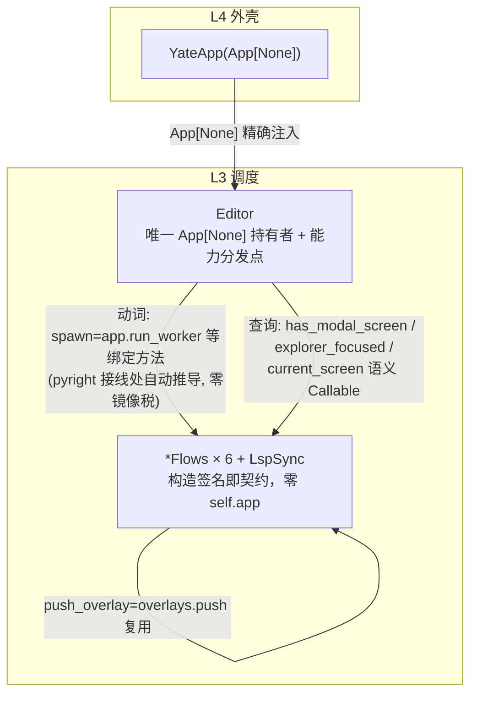

# app-capability-injection-plan（消除 App[Any]/App[object] 与流程模块 self.app）

来源：gitee issue `IKJB0Q`（ENH - 消除App[object], App[Any] 及 模块见self.app的乱象，考虑重构）。
issue 两轮评论已收敛出最终设计——**语义能力注入（Semantic Capability Injection）**：
`App[None]` 精确化 + 动词用绑定方法注入 + 查询用 `Callable` 上浮 + AST 守卫。
本方案按 plan-before-execute 落盘，执行分支 `ref/app-capability-injection`。

## 〇、与 issue 评论 note_51414622（终版建议）的逐条对照

该评论 §5.5 给出 Stage 0-5 落地路径，本方案与其映射如下：

| 评论 Stage | 内容 | 本方案落点 |
|---|---|---|
| Stage 0 | 方案文档落盘并批准 | 本文档（`.trae/documents/app-capability-injection-plan.md`） |
| Stage 1 | 7 处 `App[Any]/App[object]` → `App[None]` | §五 Stage 1（逐字一致） |
| Stage 2 | `has_modal_screen` 三处统一上浮 Editor | §五 Stage 2 中 CompletionFlows 行：删 `_modal`，注入 `has_modal_screen: Callable[[], bool]`（接线 `ed.has_modal_screen`）；window_flows 原本已收该 Callable，Editor 为唯一所有者 |
| Stage 3 | 逐模块能力化，**每模块一个 commit**，顺序 document_flows → shell_flows → lsp_sync → completion → window_flows → overlays | §五 Stage 2 的 6 模块表格；执行时严格按该顺序、每模块独立 commit（本方案 Stage 2 即评论 Stage 3） |
| Stage 4 | 决策点：Editor 保留 `App[None]`（默认）或全切片 | 采纳默认项：Editor 保留 `App[None]` 唯一持有者（§一非目标 + §四架构图已声明，ADR 记于本文档，无需独立文档） |
| Stage 5 | 新守卫 2 条 + `architecture-boundaries.md` §四交互表/§六 + `overview.md` 同步 + CHANGELOG | §五 Stage 3（守卫与文档同步）、Stage 4（门禁与收尾） |
| 守卫 3（评论标注"可选"） | Editor 内 `self.app.<attr>` 白名单 | **本轮不做**：评论明标可选，且守卫 2（L3 除 editor.py 禁 `self.app`）已把 Editor 变成唯一可写点，白名单的边际收益仅剩"Editor 内部新增越位 API 面"；若 Editor 的 `self.app` 用法后续扩张再启用 |
| 验证命令 | pyright strict 0 诊断 / `pytest tests/ -q` 全绿 / 冒烟 `--fail-only` | §五 Stage 4 + §七验收命令汇总（一致） |

评论 §5.1 事实基础（run_worker 12 处、屏幕栈 7 处、focused 5 处、主题桥/exit 4 处）
与 §二调研事实清单 #2/#3 相符；D1-D4 四条设计规则分别落在 Stage 2（D1/D2/D3）
与 Stage 3（D4）。

## 一、目标与非目标

### 目标

1. 全仓消除 `App[Any]` / `App[object]` 标注：7 处注入点与 `YateApp(App[None])` 对齐。
2. 6 个 L3 流程类彻底不持有 `app` 句柄（`self.app` 消失）：动词收**绑定方法**
   （`spawn` 等，pyright 在接线处从 Textual 定义自动推导完整签名，零镜像税），
   状态查询收**语义 `Callable`**（由 Editor——状态所有者——提供，复用既有
   `has_modal_screen` / `push_overlay` 注入模式，零新类型、零 Protocol、零规则翻案）。
3. `Editor` 成为 L3 唯一的 `App[None]` 持有者与能力分发点。
4. 守卫固化：2 条新架构测试（禁 `App[Any]`/`App[object]`；L3 除 `editor.py` 外禁
   `self.app`），架构测试 20 → 22。
5. 规则与文档同步：`architecture-boundaries.md`（§四交互表 + §六守卫清单）、
   分层总纲 `overview.md`、CHANGELOG。

### 非目标

- 不动 `Editor` 自身的 `self.app` 用法（屏幕栈/focused/主题桥/run_worker/exit——
  Editor 是设计上的唯一持有点）。
- 不做方案 B（限域 Protocol）、不做能力下沉 L1（见备选否决）。
- 不改任何运行时行为；不新增 `*Ui` 打包记录（实测参数增量最大 +2，未超
  `window_flows` 现有 12 参数先例）。
- 不处理 `editor_view/*`（L2 零 `self.app` 用法，R3 已覆盖）。

## 二、调研事实清单（全部实测核对）

| # | 事实 | 位置 |
|---|---|---|
| 1 | `YateApp(App[None])`，真身精确 | `yate/app.py:79` |
| 2 | 7 处注入点：`App[Any]`×4（editor/overlays/lsp_sync/shell_flows）+ `App[object]`×3（completion/document_flows/window_flows） | `yate/editor.py:339`、`yate/completion.py:46`、`yate/document_flows.py:50`、`yate/overlays.py:37`、`yate/lsp_sync.py:33`、`yate/window_flows.py:46`、`yate/shell_flows.py:34` |
| 3 | `self.app` 用法共 29 处：Editor 自身 10 处（保留），6 个流程模块 19 处（消除） | grep 实测 |
| 4 | `has_modal_screen` 查询重复 3 处；window_flows 已以 `Callable[[], bool]` 注入（`ed.has_modal_screen` 普通方法直传） | `yate/editor.py:462`、`yate/completion.py:84-85`、`yate/editor.py:275` |
| 5 | `focused is explorer_tree` 查询重复 2 处（Editor 一处、window_flows 两处） | `yate/editor.py:616`、`yate/window_flows.py:187,191` |
| 6 | lsp_sync 的 `prompt.idle() + app.push_screen` 与 `overlays.push` 语义完全相同（注释自证 "Same pre-clear as the editor's push_overlay"） | `yate/lsp_sync.py:117-122` |
| 7 | shell_flows 已收 `push_overlay: Callable[[Screen[Any]], None]`（接线 `ed.overlays.push`）——绑定方法/语义注入先例 | `yate/shell_flows.py:42`、`yate/editor.py:248` |
| 8 | Textual 8.2.8 签名：`DOMNode.run_worker(...) -> Worker[ResultType]`（无重载，参数 work/name/group/description/exit_on_error/start/exclusive/thread）；`App.push_screen` 带 `TYPE_CHECKING` 重载返回 `AwaitMount \| Future`；`pop_screen() -> AwaitComplete` | `.venv/Lib/site-packages/textual/dom.py:496`、`textual/app.py:2895,3096` |
| 9 | 构造接线全部集中在 `editor.py` 的 `_build_widgets` / `_build_pane_stack` | `yate/editor.py:152-281` |
| 10 | 测试直接构造流程类的仅 1 处（OverlayFlows + `_FakeApp`）；其余走 `run_test` 真 App | `tests/test_changelog_view.py:63` |
| 11 | `app.py:152` 是全仓唯一 `Editor(` 构造点 | grep 实测 |
| 12 | 无本任务 worktree；master `919ec4d` | `git worktree list` |

## 三、备选方案与否决理由

| 方案 | 内容 | 否决/采纳理由 |
|---|---|---|
| 上帝协议 v0（`AppProtocol` 88 成员） | 单一共享接口 | **否决**：v0 死因，`app_features/` 已被删除，必然复辟 |
| 窄 Protocol / 限域 Protocol（方案 B） | 每消费者镜像框架面协议 | **否决（本轮）**：R2 准入条件（第二外壳 / FakeApp 大规模单测 / Textual 破坏性变更）当前一个都不成立；付镜像税买不到东西。触发条件出现时再按 issue 方案 B 启动 |
| 全回调 | 一切经 `Callable` | **否决**：`run_worker` 长签名镜像税；能力切片用绑定方法免费拿到同样的类型期契约 |
| 能力下沉 L1（方案 D） | 拆调度/导航/主题三协作者 | **否决**：`run_worker`/屏幕栈与 App 生命周期强绑定，下沉必造薄包装 = 重走 `app_features/` 老路；用户明确拒绝薄委托 |
| 只改标注不动结构 | 7 处 `App[None]`，保留 `self.app` | **否决（不彻底）**：只消掉"类型洞"，"语义错觉"（参数叫 app、实为外壳句柄）仍在；issue 主诉求是消除乱象 |
| **能力切片注入（采纳）** | 动词=绑定方法、查询=语义 Callable、Editor 唯一持有点 | issue 两轮评论收敛的终版；零新类型、零规则翻案、零镜像税，且顺手消除 `has_modal_screen` ×3 与 `explorer_focused` ×2 的重复 |

## 四、目标架构



## 五、分步实施计划

每步独立 commit、独立门禁：`python -m pyright yate/ tests/ tools/` 零诊断 +
`python -m pytest tests/ -q` 全绿（解释器一律 `.venv\Scripts\python.exe`，
在 worktree 内执行）。

### Stage 1 — 7 处标注精确化 `App[None]`（机械）

- 输入：事实 #1/#2。
- 改动：`yate/editor.py`、`yate/completion.py`、`yate/document_flows.py`、
  `yate/overlays.py`、`yate/lsp_sync.py`、`yate/window_flows.py`、`yate/shell_flows.py`
  —— `App[Any]`/`App[object]` → `App[None]`（此步仅改标注）。
- 输出：`App[Any]`/`App[object]` 全仓 0 处。
- 验收：pyright + pytest 全绿。

### Stage 2 — 逐模块能力切片（只改接线，不改逻辑）

构造签名变化（`app` 参数移除，按模块接入能力；接线均在 `yate/editor.py`）：

| 模块 | 移除 | 注入能力 | 替换的 self.app 用法 |
|---|---|---|---|
| `document_flows.py` DocumentFlows | `app` | `spawn: Callable[..., Worker[object]]` | run_worker ×2 |
| `shell_flows.py` ShellFlows | `app` | `spawn` | run_worker ×2 |
| `lsp_sync.py` LspSync | `app`, 以及 `prompt.idle()+push_screen` 段 | `spawn` + `push_overlay: Callable[[Screen[Any]], None]]`（接线 `ed.overlays.push`，复用既有模式；同时删除与 overlays.push 重复的 `prompt.idle()` 预清场） | run_worker ×2, push_screen ×1 |
| `completion.py` CompletionFlows | `app`, 删 `_modal` property | `spawn` + `has_modal_screen: Callable[[], bool]`（接线 `ed.has_modal_screen`） | run_worker ×1, screen_stack ×1 |
| `window_flows.py` WindowFlows | `app` | `spawn` + `explorer_focused: Callable[[], bool]` | run_worker ×4, focused ×2 |
| `overlays.py` OverlayFlows | `app` | `push_screen: Callable[..., object]`、`pop_screen: Callable[[], object]`、`current_screen: Callable[[], Screen[Any]]` | push_screen ×1, pop_screen ×1, screen ×2 |

Editor 侧新增（状态所有者上浮，事实 #4/#5）：

```python
def explorer_focused(self) -> bool:
    """True while the explorer tree widget holds focus."""
    return self.app.focused is self.explorer_tree

def current_screen(self) -> Screen[Any]:
    """The screen currently on top of the shell's screen stack."""
    return self.app.screen
```

`editor.py` 自身 `handle_key:616` 改用 `self.explorer_focused()`；其余 Editor
`self.app` 用法保持不动。接线处一律关键字传参（`spawn=app.run_worker` 等），
接线行即契约文档。

- 输出：6 个流程模块 `self.app` 0 处、`App` import 仅剩类型面（`Worker`/`Screen`）。
- 验收：pyright + pytest 全绿 + `tools` 冒烟（见 Stage 4 门禁）。
- 测试同步：`tests/test_changelog_view.py::_make_editor` 的 OverlayFlows 构造改为
  传 `push_screen=app.push_screen` / `pop_screen=lambda: None` /
  `current_screen=lambda: app.screen`（`_FakeApp` 不再需要 cast 成 App）。

### Stage 3 — 架构守卫 2 条（20 → 22）

`tests/test_architecture.py` 新增：

1. `test_app_annotations_are_precise`：AST 扫描 `yate/**`，禁止
   `App[Any]` / `App[object]` 下标（只许 `App[None]`）。
2. `test_flow_modules_hold_no_app_handle`：AST 扫描 `yate/*.py` 顶层模块
   （排除 `editor.py`），禁止 `self.app` 属性链。

同步守卫登记：`architecture-boundaries.md` §四交互表加"L3 需要外壳能力"行
（动词=绑定方法注入 / 查询=Editor 语义 Callable），§六补 2 条用例对照；
`app-layering-refactoring-plans/overview.md` 补执行记录；`CHANGELOG.md` +
`CHANGELOG.zh.md` 双语同步。

- 验收：`python -m pytest tests/test_architecture.py -q` → 22 passed；
  负向演练（临时改回一处 `App[Any]` / `self.app`，确认用例拦截）后还原。

### Stage 4 — 全量门禁 + 收尾

- `python -m pyright yate/ tests/ tools/` 零诊断
- `python -m pytest tests/ -q` 全绿
- 冒烟：`tools` 冒烟入口（`--fail-only`）验证 UI 行为不变
- 方案文档回填实测数字与偏离记录；按 `git-commit-message.md` 分步提交
  （`ref(editor)`/`ref(flows)`/`test(architecture)`/`docs(rules)`…），只提交不推送。

## 六、风险清单与回滚

| 风险 | 措施 |
|---|---|
| 行为回归 | 只改接线不改逻辑；Stage 2 每模块独立 commit 可单独 revert；冒烟 932 checks 兜底 |
| `Callable[..., Worker[object]]` 丢失 call-site 关键字检查（`group=`/`exclusive=`/`exit_on_error=` 拼错不报错） | 全仓仅 5 种 kwargs 用法且全部被冒烟路径覆盖；接线处（`spawn=app.run_worker`）仍受 pyright 全签名校验 |
| `push_screen` 返回值（AwaitMount）被注解吞为 `object` | 6 处调用全部 fire-and-forget（实测无一处使用返回值）；如未来需要 await，届时按真实类型收窄注解 |
| 绑定方法生命周期 | `app.run_worker` 等绑定 App 实例；App 与 Editor 同生命周期（app.py 持有 editor），流程类由 Editor 构造、随 Editor 存亡，无悬垂 |
| 测试 `_FakeApp` 面 | 仅 `test_changelog_view.py` 一处直接构造流程类，同步改造 |
| 规则与代码脱节 | Stage 3 强制 rules + overview.md + CHANGELOG 与代码同批提交 |

回滚路径：任一 Stage 出现不可收敛问题，`git revert` 该 Stage 的 commit 即可；
分支独立于 master，不影响主仓。

## 七、验收命令汇总（worktree 内）

```powershell
.\.venv\Scripts\python.exe -m pyright yate/ tests/ tools/
.\.venv\Scripts\python.exe -m pytest tests/ -q
.\.venv\Scripts\python.exe -m pytest tests/test_architecture.py -q   # 22 passed
.\.venv\Scripts\python.exe -m tools.smoke_test run --fail-only
```

## 八、执行记录（2026-09-30 回填）

### 8.1 实施产物（分支 `ref/app-capability-injection`，worktree
`../yate-app-capability-injection`，基于 master `919ec4d`）

| Stage | Commit | 内容 |
|---|---|---|
| Stage 1 | `993c9c3` `ref(editor)` | 7 处 `App[Any]`/`App[object]` → `App[None]` |
| Stage 2a | `ae2c6ec` `ref(flows)` | DocumentFlows：`spawn` 注入，`run_worker` ×2 消除 |
| Stage 2b | `7d7b6cf` `ref(flows)` | ShellFlows：`spawn` 注入，`run_worker` ×2 消除 |
| Stage 2c | `51a5af2` `ref(lsp)` | LspSync：`spawn` + `push_overlay`（复用 `overlays.push`，消重 `prompt.idle()` 预清场） |
| Stage 2c-fix | `98a1128` `test(explorer)` | `test_explorer.py` 的 `SimpleNamespace` 宿主补 `_spawn`（见偏离 #1） |
| Stage 2d | `6b03fca` `ref(completion)` | CompletionFlows：`spawn` + `has_modal_screen`（删 `_modal` property） |
| Stage 2e | `2ebcdf4` `ref(window)` | WindowFlows：`spawn` + `explorer_focused`（`run_worker` ×4、`focused` ×2 消除） |
| Stage 2f | `6f6baee` `ref(overlay)` | OverlayFlows：`push_screen` / `pop_screen` / `current_screen` 注入 |
| Stage 3 | `de33c2b` `test(architecture)` | 守卫 2 条 + 负向演练（均确认拦截后还原） |
| Stage 3-docs | `cb6a43d` `docs(rules)` | rules §四/§六 + overview.md + 双语 CHANGELOG 同步 |

### 8.2 实测门禁数字（全部 `.venv\Scripts\python.exe`，worktree 内）

| 门禁 | 计划目标 | 实测 |
|---|---|---|
| `pyright yate/ tests/ tools/` | 0 诊断 | **0 errors, 0 warnings, 0 informations**（exit 0） |
| `pytest tests/test_architecture.py -q` | 22 passed | **22 passed**（exit 0） |
| `pytest tests/ -q` | 全绿 | **全绿（exit 0，收集 1460 用例）** |
| `tools.smoke_test run --fail-only` | 全部场景通过 | **89/89 场景、932/932 checks（exit 0，95.67s）** |

终态取证：`App[Any]` / `App[object]` 全仓 **0** 处；`self.app` 仅存
`editor.py`（设计保留：11 行 12 处引用，含 `self.app = app` 持有点）与
`keyproto/driver_windows.py` docstring 提及（AST 不匹配，无碍守卫）；
架构测试守卫负向演练两处均被拦截
（`app.py:42` `App[object]`、`shell_flows.py` `self.app` 探针）。

### 8.3 偏离记录（相对本方案）

1. **`tests/test_explorer.py` 也需同步**（方案 §风险表只登记了
   `test_changelog_view.py` 一处测试宿主）。Stage 2c 后
   `test_close_documents_under_notifies_lsp_did_close` 以未绑定方法驱动
   `LspSync.documents_closed`，宿主 `SimpleNamespace` 缺 `_spawn`。补
   `_spawn=app.run_worker` 修复（commit `98a1128`）。
2. **构造接线全部关键字传参**：方案未显式承诺；实施中一次位置/关键字混排
   写出语法错误后，统一改为全关键字（如
   `OverlayFlows(push_screen=..., pop_screen=..., current_screen=..., config=...)`），
   防错且自文档。
3. **OverlayFlows 构造上移至 LspSync 之前**：`LspSync` 需要
   `push_overlay=ed.overlays.push` 直连，原构造顺序（lsp 在前）不成立；
   editor.py 构造段加注释说明 "Overlays is built before its consumers"。
4. **CHANGELOG 全量重生成带出 master 上未入账的历史条目**：`tools.changelog`
   按 git 历史全量生成，CHANGELOG 上次生成时点早于 master `919ec4d` 等提交，
   属工具正常补全；本轮 9 个 commit 的中文 override 已逐条登记
   （`tools/changelog/zh_overrides.json`），存量历史 `[缺中文]` 不在本轮范围。

### 8.4 代码审核（2026-09-30，双审查员交叉验证）

两位独立审查员并行审查全部改动（各自独立重跑门禁），一致结论：
**0 blocker / 0 major**；语义等价性逐点对照 master（含 lsp_sync `prompt.idle()`
预清场经 `OverlayFlows.push` 完整保留、`run_worker` ×12 kwargs 逐一保留）、
构造顺序、测试宿主、AST 守卫正反例探针均无问题。3 条 minor 全部修复：

| # | 问题 | 修复 commit |
|---|---|---|
| 1 | `WindowFlows.explorer_tree` 死参数（原读取点已被 `explorer_focused` 注入取代） | `2632a19` `ref(window)` |
| 2 | App 句柄守卫 docstring 格式（§2.3）与扫描面措辞修正 | `f264058` `test(architecture)` |
| 3 | App 注解守卫补强：qualified 形态（`textual.app.App[Any]`）与三个位置的字符串化注解（变量/参数/返回值），9 例正反探针验证 | `f264058` `test(architecture)` |

修复后复测：pyright 0 诊断、架构测试 22 passed、全量 pytest exit 0。
