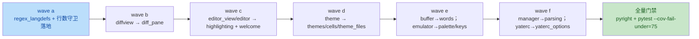

# big-module-split 子计划总纲

主计划：[`../big-module-split-plan.md`](../big-module-split-plan.md)（issue IKK5F7）。

行数口径：含空行（PowerShell `Get-Content ... .Count`，2026-10-08，worktree
HEAD ab820d4）；issue 原文为不含空行口径，两套数字不可混用。

## 一、波次总表

| 波次 | 子计划 | 新增模块 | 移出对象 |
|---|---|---|---|
| a | [big-module-split-regex-langdefs-plan-a.md](big-module-split-regex-langdefs-plan-a.md) | `editor_syntax/regex_langdefs.py` | regex_backend 语言定义段 |
| b | [big-module-split-diff-pane-plan-b.md](big-module-split-diff-pane-plan-b.md) | `editor_view/diff_pane.py` | diffview 的 Pane 侧 |
| c | [big-module-split-view-highlight-plan-c.md](big-module-split-view-highlight-plan-c.md) | `editor_view/highlighting.py`、`editor_view/welcome.py` | editor_view/editor 的高亮与欢迎页 |
| d | [big-module-split-theme-registry-plan-d.md](big-module-split-theme-registry-plan-d.md) | `editor_view/themes.py`、`cells.py`、`theme_files.py` | theme.py 数据/桥接/文件加载/几何 |
| e | [big-module-split-leaf-extracts-plan-e.md](big-module-split-leaf-extracts-plan-e.md) | `editor_core/words.py`、`editor_term/palette.py`、`editor_term/keys.py` | buffer 词运动；emulator 调色板/按键表 |
| f | [big-module-split-lsp-yaterc-plan-f.md](big-module-split-lsp-yaterc-plan-f.md) | `editor_lsp/parsing.py`、`yaterc_options.py` | manager 线格式解析；yaterc 选项校验 |

维持豁免（不拆，理由见主计划 §二）：`keymaps/vim.py`、`yate/editor.py`。

## 二、波次依赖与串行要求（硬性）

1. **a 波先行**：a 波落地 `test_source_files_within_size_threshold` 行数守卫与
   全量豁免名单，并校准 `.trae/rules/architecture-boundaries.md` §三.7——
   b–f 依赖该守卫存在才能"移除豁免"，故 a 未验收通过前 b–f 不得启动。
2. **b–f 必须串行，不得并行**：产品源码文件波次间确实互不重叠，但每波都要改
   两个**共享文件**：
   - `tests/test_architecture.py`——行数守卫豁免集合逐波收缩
     （b 移除 diffview、c 移除 editor_view/editor.py、d 移除 theme.py、
     e 移除 emulator.py 并更新 buffer.py 行数、f 移除 manager.py/yaterc.py
     并追加 yaterc_options.py）；
   - `.trae/rules/architecture-boundaries.md` §三.7——豁免名单同步收缩。
   同一文件被多波修改即构成文件重叠，按 subagent-workflow 的文件独占纪律，
   只能串行执行；上一波验收命令全部退出码 0 后才允许进入下一波。
3. **每波收尾验收** = 该波子计划所列验收命令 + 全量门禁前置项
   `python -m pyright yate/ tests/ tools/` 零诊断；全部波次结束后统一跑
   全量门禁（`python -m pytest tests/ -q --cov=yate --cov-fail-under=75`，
   命令见 plan f 末节）。

## 三、执行状态追踪表（与主计划 §五 执行记录区同构，逐波回填）

| 波次 | 子计划 | 状态 | 验收命令退出码 | 提交（hash/说明） | 偏离记录 |
|---|---|---|---|---|---|
| a | regex-langdefs-plan-a | 已完成 | 4/4 退出码 0（pyright 零诊断；pytest 5 文件通过，1 既有 skip；filetypes 探针 72 = HEAD 基线；行数实测 794/500） | `074ed7d` extract regex_langdefs | 行数 794/500 略超预估 ~780/~490；私有注册表再导出另需声明模块 `regex_langdefs.__all__` 登记以消 `reportPrivateUsage` |
| b | diff-pane-plan-b | 已完成 | 3/3 退出码 0（pyright `yate/editor_view/` 零诊断；pytest 4 文件 96 passed；行数实测 475/581；另测全仓 `pyright yate/ tests/ tools/` 零诊断） | `966a686` extract diff_pane | 行数 475/581 与预估相符；diff_pane 无日志调用故未引入 `yate.logs`，依赖面与子计划清单一致 |
| c | view-highlight-plan-c | 已完成 | 3/3 退出码 0（pyright `yate/editor_view/` 零诊断；pytest 4 文件 41 passed；行数实测 416/128/599；另测全仓 `pyright yate/ tests/ tools/` 零诊断） | `7e32bcc` extract highlighting and welcome | HighlightMixin 落成纯 mixin + 宿主面声明桩（双基类会触发 Textual `scroll_to` 签名分裂的 pyright 冲突），highlighting.py 416 行高于预估 ~300；editor.py 599 低于预估 |
| d | theme-registry-plan-d | 已完成 | 4/4 退出码 0（pyright `yate/editor_view/` 零诊断；pytest `test_theme_palettes.py`+`test_config.py` `-q` 134 项全过；门面探针 `len(THEMES)=8`；行数实测 themes 575 / cells 98 / theme_files 102 / theme 182；另测全仓 `pyright yate/ tests/ tools/` 零诊断） | `ece4f89` split theme into themes, cells and theme_files | 行数高于预估 ~500/~80/~75/~140（docstring、`__all__` 与门面再导出段开销，均低于阈值）；`tests/test_theme_palettes.py` 经 `theme._theme_namespace()` 访问加载器命名空间而该测试不在 d 波独占清单，按 a 波私有再导出先例在 `theme_files.__all__` / `theme.__all__` 登记以保门面（外部 import 零改动） |
| e | leaf-extracts-plan-e | 已完成 | 3/3 退出码 0（pyright `yate/editor_core/` + `yate/editor_term/` 零诊断；pytest 6 文件 398 passed / 1 既有 skip；行数实测 words 82 / buffer 820 / palette 47 / keys 74 / emulator 757） | `67e9d9a` extract words, palette and keys | plan-e「零调用」断言实测为假（buffer.py 4 个词函数调用点），按裁决采纳方案 X：照常拆出 words.py 并新增 buffer→words import，判据修正（详见主计划 §五）；emulator.py 的 `key_to_terminal` 再导出经 `import as` 显式写法消 `reportUnusedImport`；buffer.py 820 仍 >800 维持豁免并更新登记 |
| f | lsp-yaterc-plan-f | 已完成 | 3/3 退出码 0（pyright `yate/editor_lsp/` + `yate/` 零诊断；pytest 6 文件 239 passed；行数实测 parsing 243 / manager 652 / yaterc_options 669 / yaterc 189；另测全仓 `pyright yate/ tests/ tools/` 零诊断） | `c9d2b6f` extract parsing and yaterc_options | `tests/test_lsp.py:668/684/873` 经 `LspManager` 类属性引用 `_parse_diagnostics` / monkeypatch `_unwrap_completion`（plan-f 仅登记 :646 转发 import 面），tests 不在本波独占清单，按主计划 §四「保留薄委托」预案：实现全部迁入 parsing.py，manager 保留两个转发 staticmethod、调用点经 `self`（monkeypatch 可拦截），无钉点的 `_parse_completion_item` 改 `parsing.*`，零测试改动；行数略高于预估（docstring + `__all__` 私有再导出登记，a/e 波先例），四文件均低于阈值 |
| 全量门禁 | （主代理收尾） | 已完成 | 主代理亲测全绿：全仓 pyright 零诊断（退出码 0）；架构测试 27 passed；`pytest tests/ -q --cov=yate --cov-fail-under=75` 退出码 0（2045 passed / 9 skipped，覆盖率 91.44% ≥ 75）；冒烟 107/107 场景全过 | — | 审核结论：无 blocker / major；2 个 minor 文档同步项已修正 |

回填纪律：状态只允许 `待执行 → 执行中 → 已完成`；"已完成"必须附验收命令
实际退出码与提交 hash；偏离计划（行数预估、豁免名单、拆分范围）须在
"偏离记录"列写明实测依据。
