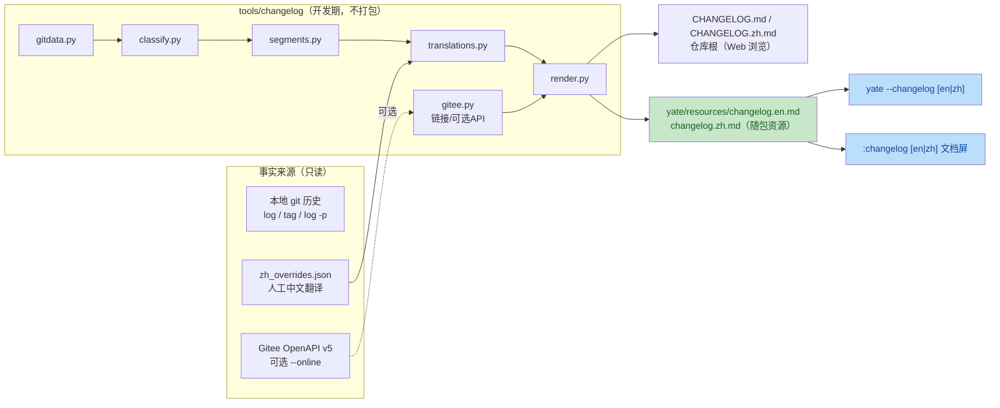
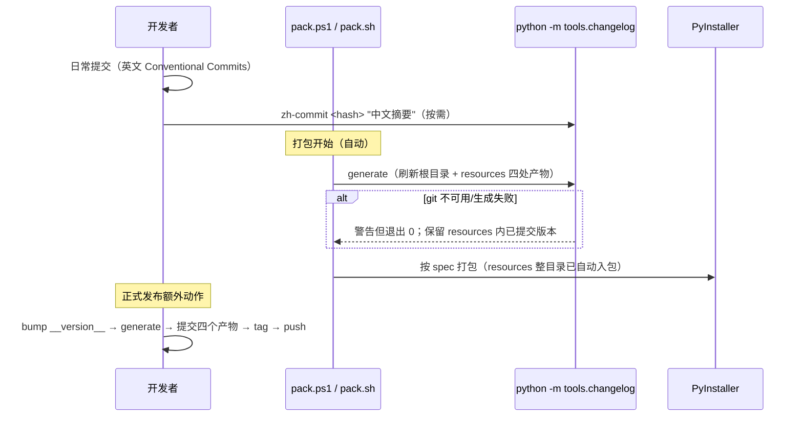

# 双语 Changelog 自动维护与运行时展示实施计划

> 基于 Gitee 仓库（`https://gitee.com/jermaine/yate.git`）的 Git 历史，
> 自动生成并长期维护**双语 CHANGELOG**，并在三个入口可见：
>
> - 仓库根 `CHANGELOG.md` / `CHANGELOG.zh.md`（Gitee Web 浏览）；
> - 随包资源 `yate/resources/changelog.en.md` / `changelog.zh.md`
>   （wheel / PyInstaller 包内）；
> - 运行时展示：CLI `yate --changelog [en|zh]` 直接打印退出，
>   TUI 内 `:changelog [en|zh]` 用 Markdown 文档屏浏览。
>
> 生成流程集成进 `pack/` 打包脚本；**任何构建中缺失 changelog 资源时，
> 运行时只显示"不可用"提示，绝不 crash。**

---

## 1. 现状（基于代码/仓库事实）

| 事实 | 证据 |
|------|------|
| 远程仓库在 Gitee | `git remote -v` → `https://gitee.com/jermaine/yate.git` |
| 目前**没有任何 tag、没有 CHANGELOG** | `git tag` 为空；根目录无 `CHANGELOG*` |
| 提交信息已是 Conventional Commits 风格 | `feat:` / `fix(scope):` / `refactor:` / `chore:` |
| 版本号**双写、有漂移风险** | [pyproject.toml](pyproject.toml#L7) 与 [yate/__init__.py](yate/__init__.py#L11) 均为 `0.1.0` |
| 双语文档成对约定 | `README.md`/`README.zh.md`；`yate/docs/*.en.md`/`*.zh.md`；`resources/manual.en.md`/`manual.zh.md` |
| 已有成熟的 Markdown 文档屏 | [manual.py](yate/editor_view/manual.py)：worker 线程加载、Markdown 渲染、屏内搜索（约 300 行，**不可复制第二份**） |
| `:manual zh|en` 命令范式 | [commands.py:186](yate/app_features/commands.py#L186) `reg("manual", lambda args: app.show_manual(args or "en"), ...)` |
| 手册打开方式 | [app.py:1408](yate/app.py#L1408) `show_manual(lang)`：推入 ManualScreen 前临时切换 catppuccin-mocha 主题，关闭后恢复 |
| 资源读取方式 | `importlib.resources.files("yate.resources")`，缺失时目前回退 `manual.en.md` |
| PyInstaller 已整目录打包 resources | [yate.spec:59-63](pack/yate.spec#L59-L63) 与 yate-onefile.spec 均有 `(pkg_path("resources"), "yate/resources")`——**新增 md 无需改 spec** |
| wheel 同样自动包含 resources | pyproject.toml 注释明确：resources 下非代码文件由 hatchling 自动入包 |
| 打包脚本 | [pack.ps1](pack/pack.ps1) / [pack.sh](pack/pack.sh) 负责选解释器、装 build extra、调 PyInstaller；pack.bat 仅透传 ps1 |
| 质量门禁 | pyright strict 零诊断；pytest；CI 在 `.github/workflows/test.yml`、`.workflow/test.yml` |
| 手册附录已有发布章节占位 | `manual.zh.md:1196`「附录：发布与双语 Changelog 维护」（需在实现后同步刷新） |

---

## 2. 口径冻结（先定规则，避免后续返工）

1. **版本段边界**：首选 git tag（`vX.Y.Z`，附注标签）；过渡期回退解析
   `git log -p -- yate/__init__.py` 新增行 `__version__ = "X.Y.Z"`；
   **bump 提交属于新版本**，区间 `[bump, 下一个 bump)`。
2. **同版本号重复 bump**：合并为同一段，不拆段。
3. **冷启动**（当前无 tag）：全历史归入当前 `__version__`（0.1.0），
   标注 "Initial release / 首个版本"。
4. **未发布段**：最后边界之后的提交归入顶部 `[Unreleased]/[未发布]`。
5. **顺序**：版本新→旧；版本内按 `--topo-order`（**不用日期排序切段**，
   作者日期仅展示），避免合并历史下边界漂移。
6. **合并提交**默认忽略（`--no-merges`）；`feat!:` 与 `BREAKING CHANGE`
   footer 归入版本段顶部破坏性变更分组。
7. **双语来源**：英文由 Conventional Commits subject 自动生成；中文来自
   人工覆盖表 `tools/changelog/zh_overrides.json`（按短 hash 索引）；
   缺翻译回退英文并加 `[缺中文]` 内联标记。
8. **生成文件禁止手改**：四个产物文件头均声明自动生成，人工信息只进
   覆盖表。
9. **零新依赖**：仅标准库。
10. **资源缺失即降级**：`changelog.*.md` 未随构建存在时，CLI/TUI 只显示
    固定的"不可用"提示，退出码 0，不抛异常、不 crash。
11. **check 门禁只校验已发布段**：`[Unreleased]/[未发布]` 是移动窗口，
    其内容允许任意滞后——否则生成产物的提交自身就让文件"过期"，门禁
    永久红灯（自举回归）。门禁只断言**已发布版本段不可变且完整**；
    Unreleased 在发布时由 `generate` 统一刷新（见 4.1）。

---

## 3. 总体架构



发布/打包链路：



---

## 4. 生成器模块设计（`tools/changelog/`）

```
tools/
  __init__.py
  changelog/
    __init__.py
    __main__.py
    cli.py            # generate / check / zh-commit
    model.py          # Commit / ReleaseSegment
    gitdata.py        # git CLI 唯一边界（subprocess，UTF-8 显式编码）
    classify.py       # Conventional Commits 解析与分组
    segments.py       # 版本切段（纯函数）
    translations.py   # zh_overrides.json 读写合并
    gitee.py          # remote 解析、commit/compare 链接、可选 API
    render.py         # 双语 Markdown 渲染（根目录版 / 随包版两种文件头）
    zh_overrides.json
```

要点（实现细节约束）：

- **gitdata**：`git log --topo-order --no-merges
  --pretty=format:%H%x1f%h%x1f%ad%x1f%s%x1f%b%x1e --date=short`，
  Windows 下 `subprocess.run(..., encoding="utf-8")` 防 GBK 代码页；
  bump 从 `git log -p -- yate/__init__.py` 新增行提取，不维护手工版本点。
- **classify 分组**：feat→Features/新功能；fix→Bug Fixes/问题修复；
  perf→Performance/性能；refactor→Refactors/重构；docs→Documentation/文档；
  test→Tests/测试；build/ci/chore→Tooling/构建与工程；其余→Other/其他；
  `chore(release)` 与纯版本 bump 自身不进条目。
- **gitee**：解析 HTTPS/SSH 两种 remote；离线生成
  `{web}/commit/{sha}` 与 `{web}/compare/vA...vB` 链接；
  `--online` 用标准库 urllib（5s 超时）校验推送状态，失败只警告不中断；
  token 只从 `GITEE_TOKEN` 环境变量读。
- **双渲染目标**：
  - 根目录版文件头：`> Generated by ... do not edit by hand` +
    中英互链；
  - 随包版（resources）文件头改为面向最终用户：
    `# Changelog`/`# 变更日志` + 一行生成版本与日期，**不出现**
    "do not edit"开发措辞（资源包内文件本就不可编辑）。
- **CLI**：
  - `generate [--online] [--root-only|--bundle-only] [--check]`
    （默认四处全写；`--check` 不写文件，复用 4.1 的已发布段比对）；
  - `check`：已发布段门禁（算法见 4.1），不一致退出 1；
  - `zh-commit <hash> <摘要> [详情]`：覆盖表去重写入
    （`ensure_ascii=False`、键排序、缩进 2）。

### 4.1 `check` 比对口径（自举回归修正）

**问题**：`generate` 产物的提交自身不在被提交的文件中，此后每一个普通
提交都会让新鲜渲染的 `[Unreleased]` 与磁盘不一致——全量文本比对会让
门禁永远红灯。

**修正**：按 `^## ` 标题把"新鲜渲染结果"与"磁盘文件"切成版本段，
**只对已发布段做单向存在性 + 逐字一致性校验**：

1. 切片：从每个 `## [X.Y.Z] …` 标题到下一个 `## ` 之前为一个版本段；
   标题前的文件头（generated 说明/互链）不参与比对；
   `## [Unreleased]`（中文 `## [未发布]`）整段跳过；
2. **方向：新鲜渲染 → 磁盘**。新鲜结果中的**每个**已发布段，必须在对应
   磁盘文件（同名目标：根目录版/随包版 × en/zh 四个）中逐字出现，
   比对前对每段做 CRLF→LF 与行尾空白归一化；
3. 磁盘上多出的已发布段（如浅克隆缺历史时）不判失败——只查"新鲜的
   不可变历史是否都已落盘"，反向不查；
4. Unreleased 段存在性与内容均不校验，仅打印信息行
   （如 `unreleased: 磁盘落后 N 个提交（发布时统一刷新）`），退出码 0；
5. **失败场景**（退出码 1，输出目标文件 + 版本标题）：
   - 磁盘缺少新鲜结果中的某个已发布段（典型：bump 提交后忘记
     `generate`）；
   - 同版本段内容漂移（hash、链接、分组被手改）；
   - 事后给已发布提交补了中文翻译但未重新 generate（zh 文件的已发布
     段随之改变，属正确失败）；
6. **无 `.git` 历史**（sdist 解包、源码归档）：无法渲染历史，打印
   `SKIP: no git history` 并退出 0，不阻塞；CI 必须用完整历史检出
   （第 8 节步骤 9），避免浅克隆把门禁变成无意义的 SKIP。

实现位置：切片与比对为 `render.py` 内纯函数
（`split_sections()` / `released_sections_diff(on_disk, fresh)`），
`check` 与 `generate --check` 共用，合成数据可直接单测。

---

## 5. 版本号单一事实源改造

`pyproject.toml` 删除静态 `version = "0.1.0"`，改为：

```toml
[project]
dynamic = ["version"]

[tool.hatch.version]
source = "regex"
path = "yate/__init__.py"
regex = '__version__\\s*=\\s*"(?P<version>[^"]+)"'
```

此后发布只改 `yate/__init__.py` 一处，wheel 版本、`--version` 输出、
changelog 切段全部同源。需验证 `pip install -e .` 与 hatchling 构建取到
正确版本号。

---

## 6. pack 脚本集成

**spec 文件零改动**：两个 spec 已把整个 `yate/resources` 目录打入
bundle，新文件自动随包（实施时仍需实际构建后核对包内路径）。

### 6.1 `pack/pack.ps1`

在选定 spec 之后、调用 PyInstaller 之前插入：

```powershell
# Refresh bundled bilingual changelogs (best-effort: a checkout without
# git history keeps the last committed resources/changelog.*.md).
if (-not $SkipChangelog) {
    Write-Host "Refreshing changelogs ..." -ForegroundColor Cyan
    & $pythonExe -m tools.changelog generate --bundle-only
    if ($LASTEXITCODE -ne 0) {
        Write-Host "WARNING: changelog generation failed; continuing with shipped files." -ForegroundColor Yellow
    }
}
```

- 新增参数 `[switch]$SkipChangelog`（透传开关，帮助文本补一行）；
- 生成失败**只警告不阻断打包**（与运行时降级策略一致）；
- pack.bat 透传 `%*`，无需改动，帮助注释补 `--skip-changelog`。

### 6.2 `pack/pack.sh`

参数解析增加 `--skip-changelog`；PyInstaller 前对称执行：

```bash
if [ "$skip_changelog" -eq 0 ]; then
    echo "Refreshing changelogs ..."
    if ! "$py" -m tools.changelog generate --bundle-only; then
        echo "WARNING: changelog generation failed; continuing with shipped files." >&2
    fi
fi
```

### 6.3 工作区污染口径

`resources/changelog.*.md` 作为**发布产物提交入库**（正式发布时由
generate 刷新并提交），因此：

- 普通源码运行 / wheel 安装：始终能看到最近一次发布的日志；
- 打包前自动刷新仅让包内包含比上次发布更新的条目，打包结束后若工作区
  出现差异，脚本输出一行明确提示，**不自动 checkout、不自动提交**
  （是否提交属于发布决策，避免工具擅动 git 状态）。

---

## 7. 运行时展示

### 7.1 资源访问层：泛化 manual.py 的加载函数

[manual.py](yate/editor_view/manual.py) 中新增
通用函数（保留 `load_manual_markdown` 为薄封装，调用面不破坏）：

```python
_DOC_LANGS = ("en", "zh")
_UNAVAILABLE = {
    "en": "# Changelog\n\nNo changelog is shipped with this build.",
    "zh": "# 变更日志\n\n此构建未包含变更日志。",
}

def load_doc_markdown(kind: str, lang: str = "en") -> str:
    """Read resources/<kind>.<lang>.md; fall back to en, then to a
    fixed 'unavailable' notice. Never raises for a missing resource."""
    lang = lang.strip().lower()
    if lang not in _DOC_LANGS:
        lang = "en"
    root = files("yate.resources")
    resource = root.joinpath(f"{kind}.{lang}.md")
    if not resource.is_file() and lang != "en":
        resource = root.joinpath(f"{kind}.en.md")
    if not resource.is_file():
        return _UNAVAILABLE[lang]
    return resource.read_text(encoding="utf-8")

def load_manual_markdown(lang: str = "en") -> str:
    return load_doc_markdown("manual", lang)

def load_changelog_markdown(lang: str = "en") -> str:
    return load_doc_markdown("changelog", lang)
```

注意现有 manual 的回退是"缺语言时回退 en"，新函数对**两个文件都缺失**
的情况新增了占位返回（manual 保持原行为：manual 是必备资源，缺失仍按
现有 `OSError` worker 兜底，不改变其语义——实现时让 manual 继续允许
OSError 冒泡给 worker 的现有 try/except；changelog 走占位路径）。

### 7.2 文档屏泛化（避免复制 300 行搜索逻辑）

view 层组件放在 [manual.py](yate/editor_view/manual.py)
（模块名保留，减少 import 面改动），将 `ManualScreen` 参数化为通用
Markdown 文档屏，**类名保留 `ManualScreen` 会误导**，因此：

- 重命名为 `MarkdownDocScreen`，构造签名
  `__init__(self, yate, *, kind: str, lang: str, title: str)`；
  CSS 选择器 / DOM id / hit class 一并从 `manual-*` 重命名为 `doc-*`
  （完整对照见下，一次性改完，pyright strict + Textual 测试兜底）；
- worker 改调 `load_doc_markdown(kind, lang)`；loading 文案由 title
  参数化（`f" loading {title}…"`，如 `loading changelog…` /
  `loading manual…`）；
- 资源加载函数 `load_doc_markdown` / `load_changelog_markdown` 也留在
  manual.py（view 层读取自身资源，与现有布局一致）；
- `_SearchInput` 内部对 `self.screen` 的两处 cast 同步改类型名。

**重命名对照（manual.py 内部 + 测试引用，禁止新旧混用）**：

| 旧名 | 新名 |
|------|------|
| `ManualScreen`（类） | `MarkdownDocScreen` |
| `#manual-box` | `#doc-box` |
| `#manual-search-bar` | `#doc-search-bar` |
| `#manual-search-input` | `#doc-search-input` |
| `#manual-search-status` | `#doc-search-status` |
| `#manual-scroll` | `#doc-scroll` |
| `#manual-loading` | `#doc-loading` |
| `#manual-md` | `#doc-md` |
| `#manual-footer` | `#doc-footer` |
| `.manual-hit` | `.doc-hit` |
| `.manual-hit-current` | `.doc-hit-current` |
| CSS 选择器前缀 `ManualScreen ...` | `MarkdownDocScreen ...` |
| `on_input_*` 中事件 id 判断 `"manual-search-input"` | `"doc-search-input"` |
| `_prev_manual_theme`（app 状态） | `_prev_doc_theme` |

保持不变：模块文件名 `editor_view/manual.py`（减少 import 面改动）、
`_SearchInput` 类名、`_FOOTER_SEARCH/_FOOTER_BROWSE` 常量、
`.hint` class、`load_manual_markdown` 函数名（薄封装保留）。

**测试同步**：[test_app_textual.py](tests/test_app_textual.py)
中 998–1246 行的文档屏用例约 20 处引用旧名（import、
`assertIsInstance(..., ManualScreen)`、所有 `query_one("#manual-*")`、
`query(".manual-hit*")`），全部替换；1760 行参数化表
`("manual", "ManualScreen")` 改为 `("manual", "MarkdownDocScreen")`，
并追加一行 `("changelog", "MarkdownDocScreen")` 覆盖新命令的 overlay
清消息行为。

### 7.3 feature 接线层：新增 `yate/app_features/docs.py`

文档查看（manual + changelog）是同一个应用 feature，遵循 app_features
既定契约（参考 [terminal.py](yate/app_features/terminal.py)
的函数式协作者形态：模块级函数接收 `app`，文件头
`# pyright: reportPrivateUsage=false`），**不为 changelog 单建模块**，
把 `show_manual` 一并迁入，避免对称功能两处安家：

```python
# yate/app_features/docs.py
"""Bundled markdown doc viewer lifecycle: manual + changelog."""

def show_doc(app: "YateApp", *, kind: str, lang: str, title: str) -> None:
    """Push the MarkdownDocScreen, switching theme for the duration."""
    if not app.mounted or isinstance(app.screen, MarkdownDocScreen):
        return
    app._prev_doc_theme = app.theme
    app.theme = "catppuccin-mocha"
    app._push_overlay(
        MarkdownDocScreen(app, kind=kind, lang=lang, title=title),
        callback=lambda _r: _restore_theme(app),
    )

def show_manual(app: "YateApp", lang: str = "en") -> None:
    show_doc(app, kind="manual", lang=lang, title="user manual")

def show_changelog(app: "YateApp", lang: str = "en") -> None:
    show_doc(app, kind="changelog", lang=lang, title="changelog")

def _restore_theme(app: "YateApp") -> None:
    if app._prev_doc_theme is not None:
        app.theme = app._prev_doc_theme
        app._prev_doc_theme = None
```

状态归属遵循 terminal.py 先例（"lifecycle flags stay on the app because
the key handlers, commands and tests read them directly"）：
`_prev_manual_theme` 重命名为通用的 `_prev_doc_theme`，仍声明在
YateApp 上，docs.py 按私有契约访问。

app.py 只保留**薄门面**（与 explorer/terminal 委托方式一致，保证
commands、keymaps、扩展 API 的调用面零改动）：

```python
def show_manual(self, lang: str = "en") -> None:
    docs.show_manual(self, lang)

def show_changelog(self, lang: str = "en") -> None:
    docs.show_changelog(self, lang)
```

分层落点一览：

| 层 | 位置 | 职责 |
|----|------|------|
| view 组件 | `editor_view/manual.py` | `MarkdownDocScreen` 渲染/搜索 + `load_doc_markdown` 资源读取 |
| feature 接线 | `app_features/docs.py`（新增） | 推屏时机、主题切换/恢复 |
| 门面/状态 | `app.py` | 两个薄委托方法 + `_prev_doc_theme` |
| 命令 | `app_features/commands.py` | 注册 `:manual` / `:changelog` |

### 7.4 `:changelog` ex 命令

[commands.py](yate/app_features/commands.py)
仿照 `:manual` 注册：

```python
reg("changelog", lambda args: app.show_changelog(args or "en"),
    "open the changelog (:changelog zh|en, default en)")
```

命令面板自动收录（现有 reg 机制无需额外接线）。资源缺失时屏幕正常
推入，展示占位 Markdown，esc/q 照常关闭。

### 7.5 CLI `--changelog` 选项

[cli.py](yate/cli.py) 新增参数：

```python
parser.add_argument(
    "--changelog",
    nargs="?",
    const="en",
    choices=["en", "zh"],
    default=None,
    metavar="LANG",
    help="print the changelog (en|zh, default en) and exit",
)
```

`main()` 中与 `--version` 同层、在配置加载与 YateApp 构造**之前**处理
（只读 importlib.resources，零副作用）：

```python
if args.changelog is not None:
    from yate.editor_view.manual import load_changelog_markdown
    print(load_changelog_markdown(args.changelog))
    return 0
```

资源缺失时打印固定提示（en/zh 随所选语言），**退出码 0**、不构造
YateApp、不读 yaterc。

### 7.6 不做的事

- 不自动联网拉取最新 changelog（离线优先，打包什么看什么）；
- 不增加快捷键绑定（`:changelog` 与命令面板足够，避免占用键位）；
- `tools/` 不进入运行时（spec 只 collect `yate` 包，天然隔离）。

---

## 8. 实施步骤

1. **版本源统一**：pyproject 改 dynamic version，验证可编辑安装与构建。
2. **生成器**：按第 4 节实现 `tools/changelog/`（gitdata→classify→
   segments→gitee→translations→render→cli）。
3. **冷启动生成**：在当前仓库实跑，产出四个文件并人工核对 hash 链接。
4. **pack 集成**：改 pack.ps1 / pack.sh（开关、警告不中断、结束提示）。
5. **资源层与展示层**：
   - manual.py 增 `load_doc_markdown` / `load_changelog_markdown`，
     文档屏泛化为 `MarkdownDocScreen`（id 改 `doc-*`）；
   - 新增 `app_features/docs.py`：迁入 `show_manual` 生命周期逻辑、
     新增 `show_changelog`，共用 `show_doc`；
   - app.py 的 `show_manual` 改为薄委托、新增 `show_changelog` 薄委托，
     `_prev_manual_theme` 更名 `_prev_doc_theme`；
   - commands.py 注册 `:changelog`（`:manual` 调用面不变）。
6. **CLI**：`--changelog` 参数与早返回分支。
7. **测试**（第 9 节）。
8. **文档**：
   - 刷新 `manual.zh.md:1196` / `manual.en.md` 对应附录（pack 集成、
     `:changelog`、`--changelog`、降级行为）；
   - 手册命令参考表与 CLI 示例补 `:changelog` / `--changelog`；
   - README 两份加 changelog 链接与 CLI 示例一行。
9. **CI**：两个 workflow 增加 changelog 门禁：
   - `.github/workflows/test.yml`：`actions/checkout@v4` 默认是
     `fetch-depth: 1` 浅克隆，必须显式改为 `with: fetch-depth: 0`，
     否则 tag/bump 历史缺失，check 只能 SKIP；随后增加一步
     `python -m tools.changelog check`；
   - `.workflow/test.yml`（Gitee Go）：流水线自身完整克隆仓库，直接在
     pytest 步骤旁加 `python -m tools.changelog check`。
   门禁只比对已发布段（4.1），日常 feat/fix 提交不会把它打红。
10. **翻译**：为近期核心 feature/fix 补 `zh_overrides.json`，其余允许
    `[缺中文]` 渐进补齐。

### 发布操作流（写入手册附录）

```
1. 改 yate/__init__.py: __version__ = "0.2.0"
2. git commit -m "chore(release): v0.2.0"
3. python -m tools.changelog zh-commit <hash> "中文摘要"   # 按需
4. python -m tools.changelog generate --online            # 刷新四个文件
5. git add CHANGELOG.md CHANGELOG.zh.md yate/resources/changelog.*.md \
           tools/changelog/zh_overrides.json
6. git commit -m "docs: changelog for v0.2.0"
7. git tag -a v0.2.0 -m "v0.2.0"; git push --follow-tags
8. pack/pack.ps1（打包时会再次刷新；正式发布应先完成 4-7）
```

---

## 9. 测试方案

新增 `tests/test_changelog_tool.py`（生成器，合成数据为主，IO 边界只在
gitdata 打桩）：

- classify 各类 type/scope/`!:`/BREAKING footer/无前缀归类；release
  bump 过滤；
- segments：tag 边界、bump 回退、重复 bump 合并、冷启动单段、
  Unreleased、乱序日期不影响 topo 切段；
- render：双语标题/分组/hash/Gitee 链接/compare 链接；缺翻译回退标记；
  根目录版与随包版文件头差异；
- gitee.parse_remote：HTTPS/SSH；
- zh-commit：JSON 键排序、中文不转义、去重；
- `generate --bundle-only` 精确写 resources 两处、`--root-only` 精确写
  根目录两处、默认四处全写；
- `check` 门禁（核心防回归用例，用合成文本直接喂
  `released_sections_diff`，CLI 层再用 `git init` 端到端验证）：
  - **自举场景（必须绿）**：磁盘已发布段与新鲜结果一致，仅 Unreleased
    因新提交滞后（条目更多/更少/整段缺失）→ 退出 0；
  - **bump 未刷新（必须红）**：新鲜结果出现磁盘没有的新版本段 →
    退出 1，输出含缺失版本标题；
  - **已发布段被手改（必须红）**：同版本段内 hash/链接/分组与新鲜结果
    逐字不一致 → 退出 1；
  - **事后补翻译（必须红）**：zh 覆盖表新增已发布提交的翻译但未
    regenerate → zh 文件比对失败；
  - **单向容忍**：磁盘存在新鲜结果没有的更老已发布段（模拟浅克隆）→
    退出 0；
  - **换行归一化**：磁盘 CRLF、新鲜 LF → 退出 0；
  - **无历史**：`.git` 不存在时 `check` 打印 SKIP 并退出 0；
  - 四个目标文件独立报告差异位置（根/随包 × en/zh）；
  - `generate --check` 与 `check` 走同一比对函数，行为一致；
- git log 解析器用夹具字符串（含中文 subject、记录分隔符）；
- 端到端：有 git 时 TemporaryDirectory `git init` 造提交，否则 skip。

新增运行时用例（可并入 `tests/test_diagnostics.py` 同级新文件
`tests/test_changelog_view.py`，并扩展 `tests/test_cli.py`）：

- `load_changelog_markdown`：resources 有文件时返回内容；缺文件时返回
  占位文本（en/zh）且**不抛异常**；`lang="fr"` 回退 en；
- `load_doc_markdown("manual", ...)` 行为与原 `load_manual_markdown`
  一致（回归保护）；
- CLI `--changelog`：patch 资源读取，断言输出、退出码 0、
  YateApp 未构造、config 未加载；缺资源时输出"不可用"提示且退出码 0；
- `:changelog` 注册存在（命令注册表断言，参照现有命令测试）；
- `app_features/docs.py` 接线：`show_changelog`/`show_manual` 在未
  mount 时不推屏、当前已是文档屏时不重复推（守卫逻辑与现
  `show_manual` 等价，可用 fake app 断言 `_push_overlay` 调用次数与
  传入的 `kind`/`lang`，关闭回调恢复主题）；
- app 门面委托：`YateApp.show_changelog` / `show_manual` 调用
  `docs` 模块（patch docs 函数断言转发，保持调用面稳定）；
- 文档屏 headless 冒烟：实例化 `MarkdownDocScreen(kind="changelog")`，
  缺资源时 `_load` 协程不抛、内容为占位（参照现有 Textual screen 测试
  风格；若无 screen 测试基建则以加载函数级测试为准，不新造重型 harness）。

```powershell
python -m pytest tests/test_changelog_tool.py tests/test_changelog_view.py tests/test_cli.py -v
python -m pytest tests/ -v
```

---

## 10. 手动验证方案

```powershell
# 生成与门禁（自举场景）
python -m tools.changelog generate
git add CHANGELOG.md CHANGELOG.zh.md yate/resources/changelog.*.md
git commit -m "docs: changelog"
# 该提交自身让 Unreleased 滞后，但已发布段未变 → 门禁仍为绿：
python -m tools.changelog check                                 # 退出码 0
python -m tools.changelog generate --check                      # 同上，不写文件

# 发布红线：bump 版本后忘记刷新 → 新已发布段缺失，门禁变红
# （改 yate/__init__.py 的 __version__ 并提交后）
python -m tools.changelog check                                 # 退出码 1，列出缺失版本
python -m tools.changelog generate
python -m tools.changelog check                                 # 恢复 0

# 无 .git 历史（如源码归档目录）
python -m tools.changelog check                                 # SKIP，退出码 0

# CLI 展示
yate --changelog
yate --changelog zh
# 临时移走 resources/changelog.*.md 后：
yate --changelog                         # 打印"未包含变更日志"，退出码 0

# TUI
yate
:changelog
:changelog zh
# 屏内 / 搜索、esc/q 关闭行为与 :manual 一致

# 打包链路
.\pack\pack.ps1
# 构建日志含 "Refreshing changelogs ..."
# 核对 dist\yate\yate\resources\changelog.en.md / changelog.zh.md 存在
.\pack\pack.ps1 -SkipChangelog          # 跳过步骤也能成功
.\pack\pack.ps1 -OneFile
# 包内资源（onefile 解压临时目录）同样可被 --changelog 读到

# wheel
python -m hatchling build
# 检查 wheel 内 yate/resources/changelog.*.md 存在
```

人工检查点：Gitee Web 上根 CHANGELOG 链接可跳转；PowerShell 中文不乱码；
资源缺失三种入口（CLI、TUI、语言回退）均无 traceback。

---

## 11. 文件变更清单

| 文件 | 操作 | 说明 |
|------|------|------|
| `pyproject.toml` | 修改 | 版本改 dynamic，正则读 `__init__.py` |
| `tools/__init__.py`、`tools/changelog/`（9 模块 + 覆盖表） | 新增 | 生成器 |
| `CHANGELOG.md` / `CHANGELOG.zh.md` | 新增 | 根目录生成物（提交入库） |
| `yate/resources/changelog.en.md` / `changelog.zh.md` | 新增 | 随包生成物（提交入库，pack 时刷新） |
| `pack/pack.ps1` / `pack/pack.sh` | 修改 | 构建前 best-effort 刷新 + 跳过开关 |
| `yate/editor_view/manual.py` | 修改 | 泛化 `MarkdownDocScreen` 与 `load_doc_markdown`；changelog 加载函数与占位文案 |
| `yate/app_features/docs.py` | 新增 | 文档查看 feature 接线：`show_doc`/`show_manual`/`show_changelog`，主题切换恢复 |
| `yate/app.py` | 修改 | `show_manual`/`show_changelog` 薄委托；`_prev_manual_theme` 更名 `_prev_doc_theme` |
| `yate/app_features/commands.py` | 修改 | 注册 `:changelog`（`:manual` 调用面不变） |
| `yate/cli.py` | 修改 | `--changelog [en|zh]` 早返回分支 |
| `tests/test_changelog_tool.py` / `test_changelog_view.py` | 新增 | 生成器与运行时展示测试 |
| `tests/test_cli.py` | 修改 | `--changelog` 用例（含缺失降级） |
| `tests/test_app_textual.py` | 修改 | 998–1246 行文档屏用例同步 id/类名重命名（约 20 处）；1760 行参数化表改名并追加 `:changelog` 行 |
| `README.md` / `README.zh.md` | 修改 | Changelog 链接与 CLI 示例 |
| `yate/resources/manual.zh.md` / `manual.en.md` | 修改 | 刷新发布附录；命令表/CLI 示例补 changelog |
| `.github/workflows/test.yml` | 修改 | checkout 改 `fetch-depth: 0` + 增加 `changelog check` 门禁 |
| `.workflow/test.yml` | 修改 | 增加 `changelog check` 门禁（Gitee Go 完整克隆） |
| `.trae/documents/changelog_plan.md` | 修改 | 本文档（本次更新） |

---

## 12. 后续可扩展方向

- Gitee Release 联动：`publish` 子命令用版本段自动创建 Release
  （`GITEE_TOKEN` 鉴权）；
- 提交信息中 `#12` 自动展开为 Gitee issue 链接；
- `--diag` 报告增加"changelog 资源是否存在/版本"一行，与诊断体系联动；
- `generate --emoji` 可选图标，默认纯文本；
- 版本段附贡献者/提交数统计（`git shortlog` 数据已有）。
