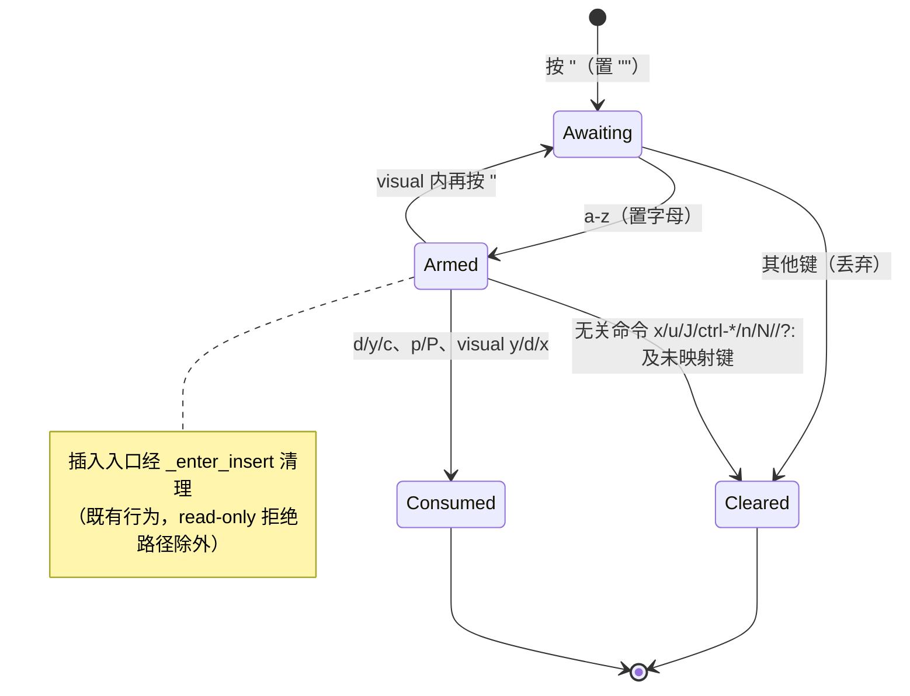

# system-clipboard PR #45 第二轮评审修复方案

> **实施状态**：✅ 已实施 —— 2026-10-05 全量核对：文档自述与代码产物一致。
结论：无阻断项，4 个改进建议。本方案逐项修复，TDD 先行。

## 一、目标与非目标

**目标**（对应评审 4 项）：

1. `pending_register` 在不消费寄存器的 normal-mode 命令分支后清理，
   `"ax` → `yy` 必须落 unnamed 寄存器并镜像剪贴板，`named_registers` 为空。
2. 「绝不把空串写入系统剪贴板」由代码保证：`_store_deleted`、
   `actions.cut`（两处调用点）、`actions.copy` 补真值守卫（`_mirror` 已有）。
3. vsc `paste` 将 `read_only` 检查提到剪贴板读取之前，与 vim `_prime_paste`
   完全对称（只读时零剪贴板系统调用）；同步调整回归用例断言。
4. 键位层钉住「后端不可用不抛异常」降级语义：`_FakeClip.copy_text` 可失败，
   `yy` 在 `copy_result=False` 时不抛异常且 unnamed 寄存器正常填充。

**非目标**：

- 不改 visual 模式 pending 语义（评审未涉及；v/V 进入 visual 保留 pending，
  visual 内 `y`/`d`/`x` 消费——既有设计，测试未锚定反向行为）。
- 不改 `""` 等待态（非字母跟随键丢弃并清零——已有行为，已测试）。
- 不动 `pyperclip` 服务层与类型桩。

## 二、备选方案与否决理由

**问题 1 的两种路线**：

- ✅ **选定：逐分支显式清理**（评审主建议）。在不消费寄存器的命令分支
  （`x` / `u` / ctrl-r / `J` / ctrl-d-u-f-b / `/` / `?` / `:` / `n` / `N` /
  extension 绑定 / 未映射吞没）加 `self.pending_register = None`。
  插入类入口（`i`/`I`/`a`/`A`/`o`/`O`）已被 `_enter_insert` 清理，不重复加。
- ❌ 否决：**分发顶部 `_take_named_register()` 一次取出再线程穿参**——
  会把 digits（`"a3yy`）、prefix（`"agd`）、motion、v/V 进入 visual 等
  「构建下一条操作符命令」的合法路径一并清掉，行为回归面大。

**问题 3**：评审建议即最优（检查前置），无备选。

## 三、`pending_register` 生命周期（问题 1 修复后）

## 四、分步实施

| 步骤 | 改动 | 验收 |
|---|---|---|
| S1 测试先行 | `tests/test_vim_keymap.py`：新增 `test_register_prefix_does_not_survive_an_unrelated_command`（`"ax`→`yy`→unnamed+mirror）、`test_yy_survives_unavailable_clipboard_backend`（`copy_result=False`）；`_FakeClip` 加 `copy_result: bool = True`；新增空串守卫钉用例（visual d 空选区不写剪贴板）。`tests/test_clipboard.py`：`test_paste_action_on_read_only_buffer_does_not_prime_register` 断言 `pastes == [1]` → `[]` | `pytest tests/test_vim_keymap.py tests/test_clipboard.py -q`：问题 1/3 相关新断言红，问题 4 钉用例绿 |
| S2 问题 1 | `yate/keymaps/vim.py` `_handle_normal`：在 x/u/ctrl-r/J/ctrl-d/u/f/b（导航页键）、`/`/`?`/`:`、`n`/`N`、extension fallthrough、未映射吞没分支加清理 | 同上，问题 1 用例转绿 |
| S3 问题 2 | `yate/keymaps/vim.py` `_store_deleted`：`copy_text` 外包 `if text:`；`yate/actions.py` `cut` 两处、`copy` 一处补真值守卫（`buf.register` / `text`） | 空选区用例绿 |
| S4 问题 3 | `yate/actions.py` `paste`：`if not buf.read_only:` 包住剪贴板读取+priming | 只读用例 `pastes == []` 绿 |
| S5 门禁 | 全量 | `pytest tests/ -q` 退出码 0；`pyright yate/ tests/ tools/` 0 诊断 |
| S6 收尾 | 删除临时文件 `_review_51428848.md`；提交 `fix(vim): ...` + 登记：评审文档追加第二轮章节、README 轮次表更新 | git log 两笔（fix + docs） |

## 五、风险与回滚

- 行为变化面：`"a` 后按 x/u/J/页键/搜索/扩展键 → pending 丢弃。真实 vim 同语义；
  现有测试无反向锚定（已核对 `test_vim_keymap.py` 全部 pending 相关用例）。
- 空串守卫不改变 unnamed 寄存器语义（空串仍写入内部寄存器，仅跳过剪贴板）。
- 回滚：两笔提交独立 revert 即可，无数据迁移。

## 六、边界核对

- 仅动 `keymaps/vim.py`（L1-L3 允许依赖 `services`）、`actions.py`（L3）、测试；
  无新 Protocol / TYPE_CHECKING / `Any`；日志沿用既有（无新增日志点）；
  架构守护测试不涉及。

## 七、执行结果与偏离记录（回填）

**结果**：全部 6 步完成。S1 红灯符合预期（问题 1/2/3 各 1 红、问题 4 钉用例
即绿）；S2-S4 后两文件 146 用例全绿；S5 全量 `pytest tests/ -q` 退出码 0、
`pyright yate/ tests/ tools/` 0 诊断。

**偏离 1（S1 空串守卫用例形态）**：原计划「visual d 空选区」直呼
`_store_deleted` 私有方法，被 pyright strict `reportPrivateUsage` 拦截
（规则禁止 ignore 注释）。改为公开键位路径 + 实例桩
（`monkeypatch.setattr(editor.buffer, "delete_selection", lambda: "")`），
即 `test_visual_delete_with_empty_result_never_touches_clipboard`。
依据：`has_selection()` 语义（anchor != cursor）使空串经真实按键路径
不可达（评审原文亦认定「近似不可达」），actions.cut/copy 守卫同此理由
不设直接用例——守卫属语义保证性质的防御，由 `_mirror` 既有用例与本钉
用例共同固化不变式。
