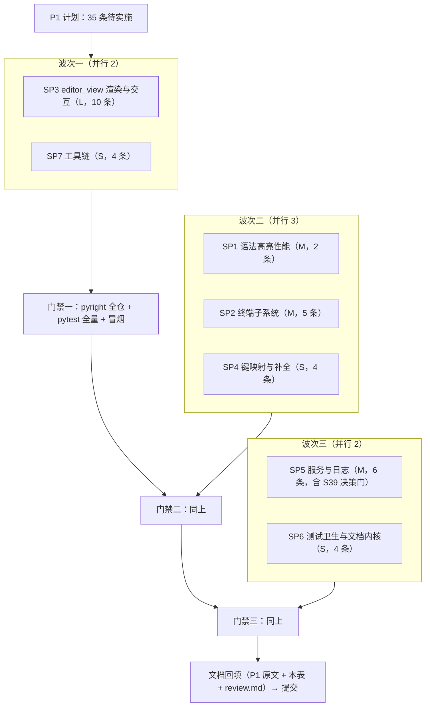

# P1 Suggestion 子计划拆分总纲

> 来源：[P1_suggestions_plan.md](../P1_suggestions_plan.md)（2026-09-24 复核版）。
> 现存 36 条，其中 S7 已随 PR #13 审查修复（原文存档），**待实施 35 条 → 拆为 7 个子计划**。
>
> **拆分原则**：① 文件独占——任意两个子计划的独占文件清单零交集，可安全并行；
> ② 域内聚——同文件 / 同子系统的条目归入同一子计划；③ 独立可验证——每个子计划
> 可单独跑 pyright + 各自 pytest 收尾。
>
> **规范来源层级**：条目级证据、策略、测试要点以 P1 原文为**唯一规范来源**（不要凭常识猜）；
> 本目录文件只定义打包、边界、顺序与验收。条目语义不得在本目录被改写。

## 一、子计划总览

| 子计划 | 条目 | 独占文件（只许改这些） | 规模 | 波次 |
|---|---|---|---|---|
| [SP1](SP1_syntax_highlight_perf.md) 语法高亮内核性能 | S1 S2 | `yate/editor_syntax/regex_backend.py`、`tests/test_highlight.py` | M | 2 |
| [SP2](SP2_terminal_subsystem.md) 终端子系统健壮性 | S6 S10 S16 S32 S43 | `yate/editor_term/emulator.py`、`yate/editor_term/pty_proc.py`、`yate/editor_view/terminal.py`、`tests/test_terminal_emulator.py`、`tests/test_pty_proc.py`、`tests/test_terminal.py` | M | 2 |
| [SP3](SP3_editor_view_rendering.md) editor_view 渲染与交互 | S4 S12 S13 S14 S15 S17 S28 S37 S40 S42 | `yate/editor_view/editor.py`、`yate/editor_view/explorer.py`、`yate/editor_view/panes.py`、`yate/editor_view/manual.py`、`tests/test_app_textual.py` | L | 1 |
| [SP4](SP4_keymaps_and_completion.md) 键映射与补全语义 | S30 S31 S35 S38 | `yate/completion.py`、`yate/keymaps/vim.py`、`yate/keymaps/registry.py`、`tests/test_completion_popup.py`、`tests/test_vim_keymap.py`、`tests/test_registries.py` | S | 2 |
| [SP5](SP5_services_and_logs.md) 服务与日志健壮性 | S5 S11 S33 S34 S36 S39（决策门） | `yate/logs.py`、`yate/services/workspace.py`、`yate/services/extensions.py`、`yate/services/trust.py`、`tests/test_crash.py`、`tests/test_tracing.py`、`tests/test_workspace_filter.py`、`tests/test_extensions.py`、`tests/test_trust.py` | M | 3 |
| [SP6](SP6_test_hygiene_and_document.md) 测试卫生与文档内核 | S20 S21 S29 S41 | `tests/test_lsp.py`、`tests/test_theme_palettes.py`、`tests/test_editor_core.py`、`yate/editor_core/document.py` | S | 3 |
| [SP7](SP7_toolchain.md) 工具链 | S22 S23 S25 S27 | `tools/changelog/cli.py`、`tools/changelog/segments.py`、`tools/release/cli.py`、`tests/test_changelog_tool.py`、`tests/test_release_tool.py` | S | 1 |

规模标定：S = 单文件局部改动；M = 跨方法/需新守卫；L = 多文件协调或含前置决策。

## 二、波次与依赖

子计划间**无硬依赖**（文件零交集），波次只为控制并发风险（Textual pilot / 冒烟类
测试并发易偶发失败，见 subagent-workflow §三.3）；批大小按 2~3 控制。



SP3 单独放在波次一并优先：条目最多、全部落在渲染热路径，尽早暴露回归；
SP7 无编辑器风险，随行作轻量并发伙伴。

## 三、执行约定

1. **第 0 步强制现状复核**：每个子计划动手前，按 P1 原文的证据行号逐条确认缺陷仍在
   （P0 教训：计划状态会滞后于代码）；结论（仍在 / 已修 / 形态变化）写入实施报告，
   形态变化时按 P1 原策略精神修订做法并回填 P1 原文。
2. **产品源码授权**：SP1–SP6 涉及 `yate/` 修改，按 subagent-workflow §一.3，
   由主代理在任务书中**显式授权独占清单内的 `yate/` 文件**；清单之外一律不动。
   SP7 仅涉及 `tools/` 与 `tests/`，可直接下发。
3. **验证分工**：子代理只跑 pyright（名下文件）+ 名下 pytest 文件；**全量 pytest 与
   冒烟由主代理在每波收尾统一执行**，冒烟不并发。
4. **报告纪律**：改动清单（文件:行号）+ 实测命令与退出码 + 未解决项；主代理复核落盘
   diff 后才算数，并重跑该成员名下测试与 pyright。
5. **状态回填**：每子计划完成即回填 P1 原文（按 P0 同款「✅ 已修复」标注格式）与本表；
   波次门禁不过则该波不算完成。

## 四、状态跟踪

| 子计划 | 状态 | 完成日期 | 守卫 / 提交 |
|---|---|---|---|
| SP1 | ✅ 已完成（S1 S2，新增 2 条守卫） | 2026-09-24 | pyright 0 诊断；test_highlight/syntax_engine 36 passed |
| SP2 | ✅ 已完成（S6 S10 S16 S32 S43，新增 8 条守卫；S10 调用点校准记录于 P1 原文；pty_proc.py:501 宽捕获注释观察项已随后续批处理补齐） | 2026-09-24 | pyright 0 诊断；test_terminal_emulator/pty_proc/terminal 141 passed 3 skipped |
| SP3 | ✅ 已完成（S4 复核为已修免实施；S12/S13/S14/S15/S17/S37/S40 专属守卫断言已全部补齐——新增 8 条；S17 守卫探明的 mount 期 scroll_to 丢弃缺口已于 2026-09-25 修复——`PaneHost.restore_scroll` 重试 + `capture_active` 防占位回写，端到端守卫升级） | 2026-09-24 | pyright 0 诊断；test_app_textual/explorer/panes 166 passed；冒烟 87/87 · 907 checks |
| SP4 | ✅ 已完成（S30 S31 S35 S38，新增 8 条守卫；S30 需差分检测覆盖 widget 级 Esc 直关，校准记录于 P1 原文） | 2026-09-24 | pyright 0 诊断；test_completion_popup/vim_keymap/registries 97 passed |
| SP5 | ✅ 已完成（S5 S11 S33 S34 S36 S39 最小加固——用户决策，新增 10 条守卫；S36 两处既有断言随缺陷修复同步改写、S11 深链用合成链；`:trust` 反馈误导观察项已随后续批处理修复——trust_workspace 返回 bool、被拒时报错并中止加载） | 2026-09-24 | pyright 0 诊断；test_crash/tracing/workspace_filter/extensions/trust 129 passed 1 skipped |
| SP6 | ✅ 已完成（S20 S21 S29 S41，新增 3 条守卫；S41 缓存失效边界已记录） | 2026-09-24 | pyright 0 诊断；test_lsp/theme_palettes/editor_core 153 passed 1 skipped |
| SP7 | ✅ 已完成（S22/S23/S25/S27，新增 6 条守卫） | 2026-09-24 | pyright 0 诊断；test_changelog/release 59 passed |

## 五、统一门禁（与 P0 相同）

```
python -m pyright yate/ tests/ tools/    # 零诊断
python -m pytest tests/ -q               # 全绿
python -m tools.smoke_test run --fail-only   # 全部场景通过（exit 0）
```

架构边界遵守 `architecture-boundaries.md` R1–R11（禁止新增 Protocol / TYPE_CHECKING；
S28 的探针用公开方法 + frozen dataclass，不引入协议类）。
