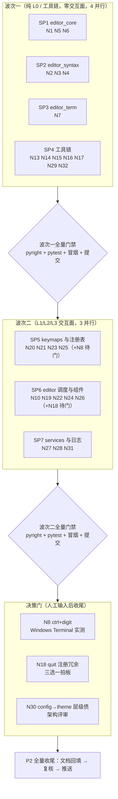

# P2 子计划总纲（P2_subplans）

> 来源：[P2_nice_to_have_plan.md](../P2_nice_to_have_plan.md)（2026-09-25 复核后 29 条待实施
> + 3 项决策门）。本目录把 P2 按**文件独占域**拆为 7 个可独立验证的子计划（SP1–SP7），
> 分两个实施波次并行落地；3 项需人工输入/评审的条目单列为决策门，不占波次。
>
> **唯一规范来源**：条目级证据、策略与测试要点以 P2 原文各行为准，子计划不复制细节、
> 只定义打包、文件边界、执行步骤与验收。**实施前每个子计划第 0 步强制现状复核**
> （P0/P1 的教训：计划状态会滞后于代码）。
>
> 统一门槛同 P0/P1：`python -m pyright yate/ tests/ tools/` 零诊断；
> `pytest tests/ -q` 全绿；`python -m tools.smoke_test run --fail-only` 全部场景通过
> （exit 0）——**每波收尾由主代理统一跑全量门禁 + 冒烟，冒烟不并发**。

## 波次与依赖

- 波次一改动全部在 L0 叶子与 tools/，无编辑器交互回归风险；SP4 改的正是冒烟工具自身，
  波次收尾的冒烟全绿即其端到端验证。
- 波次二涉及按键分发与 UI 组件，放波次一之后串行开波；三个子计划文件域互不重叠可并行。
- 决策门三项在波次收尾后处理：N8 并入 SP5、N18 并入 SP5 或 SP6（按拍板选项）、N30 单独立项。

## 子计划索引

| 子计划 | 条目 | 独占文件域（产品 + 测试） | 规模 | 波次 |
|---|---|---|---|---|
| [SP1](SP1_editor_core.md) editor_core 内核 | N1 N5 N6 | `yate/editor_core/{document,buffer,search}.py`；`tests/test_editor_core.py` | M | 1 |
| [SP2](SP2_editor_syntax.md) editor_syntax | N2 N3 N4 | `yate/editor_syntax/regex_backend.py`、`yate/editor_syntax/ts_backend/{languages,backend}.py`；`tests/{test_highlight,test_syntax_engine,test_ts_backend}.py` | M | 1 |
| [SP3](SP3_terminal.md) editor_term | N7 | `yate/editor_term/emulator.py`；`tests/test_terminal_emulator.py` | S | 1 |
| [SP4](SP4_toolchain.md) 工具链 | N13 N14 N15 N16 N17 N29 N32 | `tools/smoke_test/{harness,testsuite,cli}.py`、`tools/changelog/{gitee,render,gitdata}.py`；`tests/test_smoke_tool.py`（新）、`tests/test_changelog_tool.py` | L | 1 |
| [SP5](SP5_keymaps_registry.md) keymaps 与注册表 | N20 N21 N23 N25 | `yate/keymaps/{vim,base}.py`；`tests/test_vim_keymap.py`、`tests/test_registries.py` | M | 2 |
| [SP6](SP6_editor_dispatch_components.md) editor 调度与组件 | N10 N19 N22 N24 N26 | `yate/editor.py`、`yate/editor_view/{terminal,palette,commandline}.py`；`tests/test_app_textual.py` | M | 2 |
| [SP7](SP7_services_logs.md) services 与日志 | N27 N28 N31 | `yate/services/{extensions,trust}.py`、`yate/logs.py`；`tests/{test_extensions,test_trust,test_tracing}.py` | S | 2 |

文件独占已逐一核对零交集。两处跨子计划注意点：

- **test_app_textual.py 归 SP6 独占**：SP5 的 N23 守卫在 Keymap 层断言（`test_vim_keymap.py`），
  不触碰 app 级测试文件；SP5 若发现必须加 app 级断言，停下来上报主代理协调。
- **`Action` 别名波及面（N25，已核实）**：`keymaps/__init__.py` 不 re-export 该别名，
  `docs/` 全文零引用——改名波及面收敛在 `keymaps/base.py` 单文件；实施中发现任何外部引用
  即上报，不得擅自扩文件。

## 决策门（不占波次，收尾后处理）

| 门 | 条目 | 需要的输入 | 拍板后的并入路径 |
|---|---|---|---|
| G1 | **N8** ctrl+digit 走 kitty CSI-u | 在 Windows Terminal / cmd 实测 `ctrl+1..9` 是否可达（计划要求人工验证）；二选一：保留 kitty 绑定 + 文档标注终端要求，或改绑 `alt+digit` | 并入 SP5 补做（`keymaps/base.py`） |
| G2 | **N18** action `quit` 注册后 UI 不可达 | 三选一拍板（倾向 ①：`YateApp.action_quit` 改调 `editor.execute_action("quit")`，落点 `yate/app.py`；③ 删 vsc 冗余绑定，落点 `keymaps/vsc.py`） | ①→SP6（app.py 纳入其清单）；③→SP5 |
| G3 | **N30** L0 config 惰性 import L2 theme | 架构评审：下沉 / 注入回调二选一，同步 `architecture-boundaries.md` 登记（类似 R11 冻结） | 单独立项，评审通过后主代理实施 |

另：**N1（保存按原始 EOL 写回）属行为变更**——随 SP1 波次一实施 + 自动化 round-trip 守卫，
报告后请用户在真实 CRLF 文件上做一次人工确认，不满意可低成本回退。

## 执行约定（与 P1 波次相同）

1. **第 0 步现状复核**：每个子计划开工前先对照当前代码逐条核实锚点行号与「仍存在」，
   偏差记录进子计划并同步 P2 原文；已修/失效条目免实施、只回填。
2. **任务书显式授权**：子代理只允许改任务书列出的文件（本索引的独占域）；`yate/` 产品源码
   修改必须在任务书中逐文件显式授权。范围外发现（同类问题、相邻缺陷）一律上报登记，不顺手扩修。
3. **验证分层**：子代理只跑名下 `pyright <files>` + `pytest <test files>` 并附真实输出；
   主代理收尾统一跑全量门禁 + 冒烟（**冒烟不并发**，逐波单跑）。
4. **并发上限**：每波 4 / 3 个子代理，均低于规则上限 6；spawn 配置显式 `acceptEdits`。
5. **提交节奏**：每波一次提交（主代理复核全部 diff 后）；决策门项单独提交。
6. **文档回填**：每波收尾同步三处——P2 原文逐条 `✅` 注记、[review.md](../../../issues/review.md)
   对应条目勾选、本 README 状态表；偏离计划（锚点漂移、方案校准）必须显式记录。
