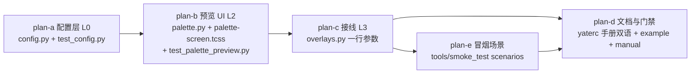

# ctrlp-preview 总纲（issue IKJRGP）

> 来源：`https://gitee.com/jermaine/yate/issues/IKJRGP`
> —— Ctrl+P 搜索文件时带 preview 功能（enhancement）。
> 分支 `feat/ctrlp-preview`，worktree `../yate-ctrlp-preview`（独立沙箱已重建，
> `python -c "import yate"` 自证指向该 worktree）。

Ctrl+P 文件搜索 palette 新增预览窗格：预览当前高亮文件内容、按 filetype 自动
语法高亮；yaterc 以 `file_preview` 字典项配置开关/方位/宽度/大文件上限；
读取与 tokenize 全程不阻塞 UI 线程。

## 一、目标与非目标

### 目标

1. 预览窗格：`PaletteScreen` 文件模式下，输入框 + 结果列表旁显示当前光标
   所指文件的只读内容，复用 `editor_syntax` token 管线与主题语法色板自动高亮。
2. 配置：yaterc 新增 `file_preview` 字典项
   （`enable` / `position` / `size` / `max_lines` / `max_size`），
   解析模式对齐既有 `screen_saver` 先例（frozen dataclass + 逐字段校验 +
   错误进 `config.errors` + 后声明整字典替换）。
3. 大文件与二进制保护：行数/字节上限截断、二进制嗅探跳过、
   tokenize 与文件读取都在 exclusive worker 线程、mtime/size 失效键缓存。

### 非目标

- 不支持 `up` / `down` 预览方位（palette 是居中窄高 modal，横分栏才有意义；
  `position` 取值预留扩展空间，本期只收 `right` / `left`）。
- 不做预览窗格内搜索/跳转（fzf 的 preview 也只是预览）。
- commands 模式（Alt+Shift+P）不涉及预览。
- 不引入 pygments / Textual `Syntax` widget（高亮必须走 yate 自己的语法层，
  与编辑器着色一致，见 §四）。
- `file_preview.enable = False` 时 palette 行为与现状**逐字节一致**
  （DOM、按键路径、渲染逻辑均不变）。

## 二、调研事实（设计依据；路径以仓库根为基准）

| 事实 | 位置 |
|---|---|
| Ctrl+P 入口：`OverlayFlows.open_file_palette()` → `_palette("files")` | `yate/overlays.py:108-116` |
| `_palette()` 构造 `PaletteScreen` 并注入协作对象 | `yate/overlays.py:170-182` |
| `OverlayFlows.__init__` 已持有 `self.config: YateConfig` | `yate/overlays.py:41,60` |
| `PaletteScreen(ModalScreen[None])`：`__init__` 注入 workspace/commands/actions/回调；entry payload 即 `Path` | `yate/editor_view/palette.py:74-146` |
| 文件索引在 worker 线程构建（`asyncio.to_thread` + `is_mounted` 竞态检查先例） | `yate/editor_view/palette.py:173-185` |
| `fuzzy_match` / `refilter()` / `MAX_VISIBLE = 12`；结果 Rich Text 渲染取 `theme.active()` | `yate/editor_view/palette.py:36-71,187-252` |
| 光标移动在 `on_key`（Screen 级）处理，上下分支只调 `_render_results()`；tab/ctrl+n/up/down 均已 `event.stop()` | `yate/editor_view/palette.py:299-317` |
| 布局：`#palette`（70% 宽、14 行）内 `#palette-input` + `#palette-results`；组件自有 tcss 经 `load_tcss` | `yate/resources/palette-screen.tcss` |
| 高亮入口 `tokenize_document(lines, filetype) -> list[list[Token]]`：tree-sitter 优先、regex 降级、未知类型零 token；线程安全纯函数（editor worker 在用） | `yate/editor_syntax/engine.py:86-97` |
| `Token(start, end, kind)`；`SYNTAX_KINDS` 是 kind → 主题属性契约 | `yate/editor_syntax/tokens.py:17-44` |
| `Theme.syntax_style(kind, bgcolor) -> rich.style.Style`（comment 附斜体） | `yate/editor_view/theme.py:110-126` |
| filetype 判定 = 路径后缀小写去点（`Document.filetype` 逻辑） | `yate/editor_core/document.py:168-180` |
| 「tokenize 在线程、Text 拼装在 UI 线程」分工先例 | `yate/editor_view/editor.py:500-579` |
| L2 组件 import `yate.config` 先例 | `yate/editor_view/terminal.py:23` |
| `screen_saver` 字典项先例：`ScreenSaverConfig` + `_extract_screen_saver` | `yate/config.py:97-134,446-561` |
| `YateConfig.screen_saver` 字段挂法 | `yate/config.py:184` |
| 大文件拒绝先例：`MAX_DIFF_LINES = 20000` | `yate/editor_view/diffview.py:70` |
| 二进制嗅探：`Workspace.is_text_file(path)`（后缀 + 前 2048 字节，staticmethod） | `yate/services/workspace.py:389+` |
| slim 滚动条 per-widget 注入先例（overlay 场景） | `yate/editor_view/manual.py:223` |
| yaterc 手册双语同步硬约束；`yaterc.example` 样例；manual §3.8 palette 段落 | `yate/docs/yaterc.en.md` / `yaterc.zh.md` / `yaterc.example` / `yate/resources/manual.en.md:304-309` |
| pilot 先例：`_Host(App)` + `push_screen` + `run_test(size=(100,30))` + `pilot.pause()`；`conftest.wait_until` | `tests/test_diffview.py:34-96` |
| config 字典项测试先例（`_load` helper） | `tests/test_config.py:18-30,824-865` |
| 无现存 `PaletteScreen` 专项测试（新测试文件不冲突） | `tests/` 全量 grep 无命中 |

## 三、架构边界对照（逐改动声明合规性）

| 改动 | 涉及规则 | 合规论证 |
|---|---|---|
| `config.py` 新增 `FilePreviewConfig` + 解析函数 | R4 / L0 职责表 | 纯数据 dataclass + 纯解析，无新 import，不触 UI；`YateConfig` 增字段属 L1 前的 L0 模型职责 |
| `palette.py` 新增 `from yate.config import FilePreviewConfig` | R3（L2 不向上） | `yate.config` 是 L0 叶子，向下依赖合法，且 `editor_view/terminal.py:23` 已有同向先例 |
| `palette.py` 新增 `from yate.editor_syntax.engine import tokenize_document` | R3 | `editor_syntax` 是 L0 叶子；`editor_view/editor.py:23` 已有同向先例 |
| `palette.py` 构造参数新增 `preview: FilePreviewConfig` | R8（传具体对象） | 不建协议、不建回调，直接传 frozen dataclass 实例 |
| 预览着色 `theme.active()` + `syntax_style` | R13 | 组件自持上色，未在 L3 直改 `.styles.*` 着色，未定义 `apply_theme` 转发 |
| `#palette-preview` 宽度运行时按配置设置 | R13 | L2 组件设置**自己 compose 的子 widget** 的几何尺寸属组件自持；禁改的是 L3 越层着色（T2 断言的是 `editor.py`） |
| 新增 `PreviewLog(RichLog)` 子类 `can_focus = False` | R10 | 不新增按键路径；防止鼠标点击把焦点从输入框抢走导致二次派发/失焦 |
| 滚动条 `apply_slim_scrollbars(preview)` | T1 | 仅 per-widget 实例注入（manual.py:223 同款），无类级 patch |
| `palette-screen.tcss` 新增 `#palette-body` / `#palette-preview` / `.with-preview` 选择器 | R9 | palette 的 id 不在 R9 冻结清单（#sidebar 等）；tcss 是组件自有资源（`load_tcss`），同步修改在同一文件内完成 |
| `overlays.py` `_palette()` 增传 `preview=self.config.file_preview` | R11 / 能力注入 | 零新增 import（`YateConfig` 已在 import 面），无白名单变更；流程模块不持 App 句柄的现状不破坏 |
| 新增测试 `tests/test_palette_preview.py` | — | 测试不在架构守卫面内，允许引用内部（test_diffview.py 先例带 `pyright: reportPrivateUsage=false`） |
| `tests/test_architecture.py` | — | **零改动**：无新增 Protocol / TYPE_CHECKING / editor_view 导入面变化 |

守卫预期：`tests/test_architecture.py` 22 用例全绿；`pyright` strict 零诊断。

## 四、备选方案与否决理由

| 备选 | 否决理由 |
|---|---|
| Textual 内置 `Syntax` widget（pygments） | 高亮与编辑器着色脱节且新增依赖；issue 要求"自动关联文件类型"应复用 yate 语法层（tree-sitter/regex 双后端 + 主题色板） |
| `Static` 只渲染首屏、不可滚动 | 实现最简但行数上限形同虚设；`RichLog` 自带滚动与 `max_lines` 兜底，成本相当 |
| 预览 Rich Text 拼装也放 worker 线程 | 破坏「tokenize 在线程、UI 线程拼装」的既有分工（editor.py:500-579）；`theme.active()` 契约属 UI 层 |
| 每次光标移动重新读文件 | 反复 IO + tokenize；mtime/size 失效键 + FIFO 16 条缓存仅十几行 |
| 配置用扁平顶层变量 | issue 明确要求"字典项"；仓库先例（`screen_saver`）即 dict + frozen dataclass |
| `size` 支持单元格绝对值 | palette 总宽本身是百分比，混两种单位徒增心智；百分比一项足够 |
| 额外 debounce 定时器 | `exclusive=True` worker 语义等价（旧任务取消、新任务独占），少一个定时器状态 |

## 五、波次划分与依赖

- 波次间**串行**（b 依赖 a 的 `FilePreviewConfig` 类型；c 依赖 b 的新构造参数；
  e 依赖 b+c 的端到端链路；d 的门禁收尾依赖 a-e 全部完成）。
- e（冒烟）与 d（文档）文件互不重叠，可在 c 完成后并行推进。
- 各子计划独占文件清单互斥，见各 plan 文档。

## 六、提交切分（git-commit-message.md，只提交不推送）

1. `feat(config): add file_preview dict option`（plan-a）
2. `feat(palette): syntax-highlighted file preview pane for ctrl+p`（plan-b + plan-c）
3. `test(smoke): add ctrl+p file preview scenarios`（plan-e）
4. `docs(manual): document the file_preview option`（plan-d）

## 七、风险清单与整体回滚

| 风险 | 缓解 |
|---|---|
| tree-sitter 对截断文本解析质量下降 | 预览是只读一瞥，精度损失可接受；regex 后端兜底 |
| `RichLog` 大文本写入卡顿 | 单次 `write` 整段 Text；`max_lines` 上限；冒烟含 2 万行文件实测 |
| worker 与 screen 关闭竞态 | `is_mounted` 检查先例（palette.py:180）+ exclusive worker；回调到达后重读当前光标 path，不匹配只写缓存不渲染 |
| Windows 宽字符错位 | `wrap=False` 保持源行完整，横向滚动兜底 |
| 新配置键拼错 | unknown keys 报错进 `config.errors`，启动消息行可见 |
| plan-b 触碰现有渲染路径引入回归 | `enable=False` 与 commands 模式的 DOM/逻辑零变化由测试钉住 |

回滚：分支整体不合并即无影响；各 wave 对应独立提交，`git revert` 单笔无残留；
plan-b 为唯一改动面较大提交，但 CSS 与方法均为纯增量。

## 八、执行记录（实施后回填）

- [x] plan-a：`pytest tests/test_config.py -q` → 98 passed（含新增 10 个
  `test_file_preview_*` 用例），退出码 0；`pyright yate/config.py
  tests/test_config.py` → 0 errors, 0 warnings, 0 informations，退出码 0
- [x] plan-b：`pytest tests/test_palette_preview.py tests/test_config.py -q`
  → 108 passed（含新增 10 个 palette 预览用例），退出码 0；
  `pyright yate/editor_view/palette.py yate/overlays.py
  tests/test_palette_preview.py` → 0 errors, 0 warnings, 0 informations，
  退出码 0
- [x] plan-c：`pytest tests/test_architecture.py tests/test_dispatch_guards.py
  -q` → 24 passed（22 架构 + 2 dispatch guards），退出码 0；
  `pytest tests/test_architecture.py -q` 单跑 → 22 passed，退出码 0
- [x] plan-e：`pytest tests/test_smoke_harness.py -q` → 25 passed（注册表
  守卫），退出码 0；`tools.smoke_test run`（--scenario 三条新场景）→
  renders 13/13、truncates 9/9、disabled 12/12，共 3/3 场景、34/34 checks，
  退出码 0（全量 107 场景冒烟由收尾门禁统一执行）
- [x] plan-d：5 个独占文件同步更新（yaterc 双语手册各 +1 表行 +1
  `file_preview` 小节、`yaterc.example` +15 行样例、manual 双语 §3.8 各 +1 句），
  diff +84/-2，无越界文件；纯文档变更按 misc-rules §三豁免测试，
  门禁由收尾环节统一执行
- [x] 偏离记录：
  - plan-b：`preview` 构造参数带默认值 `FilePreviewConfig()`（test_app_textual.py:4827
    以旧签名构造，且该文件不在本波独占清单）；计划笔误 `_preview_cache = ()`
    按上下文实现为 `dict`；note 载荷保留真实 mtime/size 使缓存可命中；
    `_update_preview()` 挂在 `on_key` 的 `if self._filtered:` 块内（空结果光标不变）；
  - plan-d：`yaterc.example` 实际路径为 `yate/yaterc.example`（仅路径修正）；
  - plan-e：无偏离。
