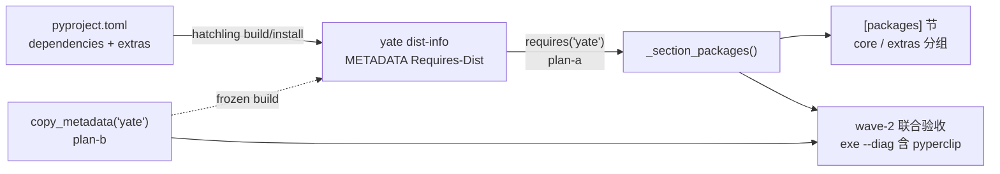

# diag-package-sync 子计划总纲（issue IKJJFI）

> 来源：<https://gitee.com/jermaine/yate/issues/IKJJFI>
> 「yate --diag 出来的包信息不全（缺 pyperclip）……pyproject.toml 和
> _section_packages 能否自动同步，不需要人为改两个地方」
> worktree / 分支：`../yate-diag-package-sync` @ `fix/diag-package-sync`
> （沙箱已重建，`.venv\Scripts\python.exe -c "import yate; print(yate.__file__)"`
> 指向 worktree，实测通过）

## 一、目标与非目标

**目标**

1. `yate --diag` 的 `[packages]` 节从 yate 自身已安装 dist 元数据
   （`importlib.metadata.requires("yate")`）自动派生全部依赖清单；
   pyproject.toml 成为唯一事实来源，新增/删除依赖零手工同步；
2. pyperclip（core 依赖）出现在报告中；not installed 降级语义保留；
3. 冻结构建（`pack/yate.spec` / `pack/yate-onefile.spec`）补带 yate 自身
   dist-info，exe 内 `[packages]` 节同样可用。

**非目标**

- 不动 `--version` 输出与 Windows tree-sitter 版本守卫（继续 `version()` 定点探测）；
- 不展示版本规格约束（只展示 dist 名 + 已装版本）；
- 不引入 `packaging` 依赖（stdlib `re` 解析 Requires-Dist 串）。

## 二、根因与选型（概要，细节见子计划）

- 根因：[yate/diagnostics.py](../../yate/diagnostics.py#L415-L428)
  `_section_packages()` 硬编码 4 个包名，与 pyproject.toml 双处维护；
- 选型：运行时读 yate 自身 dist 元数据 `requires("yate")`（hatchling 在
  build/install 期把 pyproject 的 dependencies + extras 烙进 dist-info
  METADATA 的 Requires-Dist 头），三安装形态（editable / wheel / 冻结）
  统一生效。被否决路线：运行时解析源码树 pyproject.toml（wheel/exe 不带
  该文件）、构建期生成清单资源（多一套生成物）、仅补一行硬编码（不根治）；
- 展示形态：按 extra 分组（`core` 恒最前，extra 组按名排序；组内按名排序、
  规范名去重）；**dev / build 两个工具链 extra 不进诊断清单**（用户决策：
  pyinstaller / pillow / pytest 等与运行诊断无关；按 extra 组名过滤属于展示
  策略，成员资格仍由元数据自动派生，未来新增功能 extra 默认显示）。
  tree-sitter 三包由 ts extra 声明，照常显示。

## 三、子计划索引与执行波次

大任务判据：产品文件改动 = diagnostics.py + 2 个 spec = **3 个**（≥3）。
波次表是执行调度唯一依据，批准后不得重排。

| wave | 子计划 | 独占文件 | 并行性 |
|---|---|---|---|
| wave-1 | [plan-a：diagnostics 派生逻辑 + 测试](diag-package-sync-diagnostics-plan-a.md) | `yate/diagnostics.py`、`tests/test_diagnostics.py` | ∥ plan-b（文件不重叠） |
| wave-1 | [plan-b：冻结构建补 yate dist-info](diag-package-sync-pack-metadata-plan-b.md) | `pack/yate.spec`、`pack/yate-onefile.spec` | ∥ plan-a（文件不重叠） |
| wave-2 | 联合验收（overview 收尾节） | 无新改动 | 串行于 wave-1 全部通过后 |

## 四、依赖关系图

## 五、架构边界标注

- **无新增跨层依赖边**：diagnostics.py 属既有 `--diag` 流程面（已 import
  `yate.editor.Editor`）；本次仅新增 stdlib `re` / `importlib.metadata` 用法，
  无向上导入、无 `editor_view` 新导入（不涉及 R11 白名单登记）；
- R2/R6/R12 不涉：无新 Protocol、无 `TYPE_CHECKING`、无日志调用（R12 惰性
  格式守卫对新增代码自然无违规）；
- 守卫：不新增 `tests/test_architecture.py` 用例；既有 22 用例必须全绿。

## 六、wave-2 联合验收与收尾（主代理执行）

1. 全量门禁（worktree 沙箱）：
   - `.venv\Scripts\python.exe -m pyright yate/ tests/ tools/` → 0 诊断；
   - `.venv\Scripts\python.exe -m pytest tests/ -q` → 全绿；
   - `python -m pytest tests/test_architecture.py -q` → 22 passed；
   - 覆盖率闸门：`python -m pytest tests --cov=yate --cov-branch
     --cov-report=term-missing --cov-fail-under=75` → ≥75%。
2. 冻结联合冒烟：`powershell -File pack\pack.ps1` →
   `dist\yate\yate.exe --diag` 的 `[packages]` 节含 pyperclip 与分组形态。
3. 方案文档回填真实数字与偏离记录；按 `git-commit-message.md` 分笔提交
   （`feat(diag)` / `fix(pack)` / `docs(plan)`），只提交不推送。

## 七、执行记录（收尾回填）

- [ ] wave-1 plan-a 实测结果
- [ ] wave-1 plan-b 实测结果
- [ ] wave-2 门禁数字与冻结冒烟
- [ ] 偏离记录
