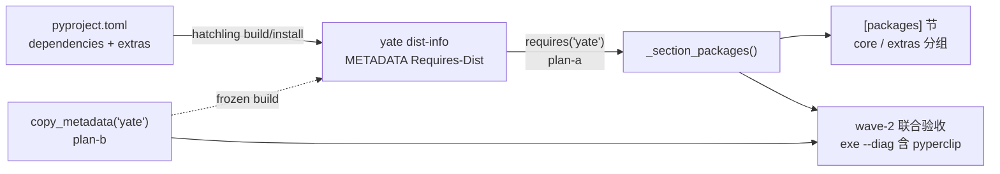

# diag-package-sync 子计划总纲（issue IKJJFI）

> 来源：<https://gitee.com/jermaine/yate/issues/IKJJFI>
> 「yate --diag 出来的包信息不全（缺 pyperclip）……pyproject.toml 和
> _section_packages 能否自动同步，不需要人为改两个地方」
> worktree / 分支：`../yate-diag-package-sync` @ `fix/diag-package-sync`
> （沙箱已重建，`.venv\Scripts\python.exe -c "import yate; print(yate.__file__)"`
> 指向 worktree，实测通过）

## 一、目标与非目标

**目标**

1. `yate --diag` 的 `[packages]` 节从 yate 自身已安装 dist 元数据
   （`importlib.metadata.requires("yate")`）自动派生全部依赖清单；
   pyproject.toml 成为唯一事实来源，新增/删除依赖零手工同步；
2. pyperclip（core 依赖）出现在报告中；not installed 降级语义保留；
3. 冻结构建（`pack/yate.spec` / `pack/yate-onefile.spec`）补带 yate 自身
   dist-info，exe 内 `[packages]` 节同样可用。

**非目标**

- 不动 `--version` 输出与 Windows tree-sitter 版本守卫（继续 `version()` 定点探测）；
- 不展示版本规格约束（只展示 dist 名 + 已装版本）；
- 不引入 `packaging` 依赖（stdlib `re` 解析 Requires-Dist 串）。

## 二、根因与选型（概要，细节见子计划）

- 根因：[yate/diagnostics.py](../../yate/diagnostics.py#L415-L428)
  `_section_packages()` 硬编码 4 个包名，与 pyproject.toml 双处维护；
- 选型：运行时读 yate 自身 dist 元数据 `requires("yate")`（hatchling 在
  build/install 期把 pyproject 的 dependencies + extras 烙进 dist-info
  METADATA 的 Requires-Dist 头），三安装形态（editable / wheel / 冻结）
  统一生效。被否决路线：运行时解析源码树 pyproject.toml（wheel/exe 不带
  该文件）、构建期生成清单资源（多一套生成物）、仅补一行硬编码（不根治）；
- 展示形态：按 extra 分组（`core` 恒最前，extra 组按名排序；组内按名排序、
  规范名去重）；**dev / build 两个工具链 extra 不进诊断清单**（用户决策：
  pyinstaller / pillow / pytest 等与运行诊断无关；按 extra 组名过滤属于展示
  策略，成员资格仍由元数据自动派生，未来新增功能 extra 默认显示）。
  tree-sitter 三包由 ts extra 声明，照常显示。

## 三、子计划索引与执行波次

大任务判据：产品文件改动 = diagnostics.py + 2 个 spec = **3 个**（≥3）。
波次表是执行调度唯一依据，批准后不得重排。

| wave | 子计划 | 独占文件 | 并行性 |
|---|---|---|---|
| wave-1 | [plan-a：diagnostics 派生逻辑 + 测试](diag-package-sync-diagnostics-plan-a.md) | `yate/diagnostics.py`、`tests/test_diagnostics.py` | ∥ plan-b（文件不重叠） |
| wave-1 | [plan-b：冻结构建补 yate dist-info](diag-package-sync-pack-metadata-plan-b.md) | `pack/yate.spec`、`pack/yate-onefile.spec` | ∥ plan-a（文件不重叠） |
| wave-2 | 联合验收（overview 收尾节） | 无新改动 | 串行于 wave-1 全部通过后 |

## 四、依赖关系图



## 五、架构边界标注

- **无新增跨层依赖边**：diagnostics.py 属既有 `--diag` 流程面（已 import
  `yate.editor.Editor`）；本次仅新增 stdlib `re` / `importlib.metadata` 用法，
  无向上导入、无 `editor_view` 新导入（不涉及 R11 白名单登记）；
- R2/R6/R12 不涉：无新 Protocol、无 `TYPE_CHECKING`、无日志调用（R12 惰性
  格式守卫对新增代码自然无违规）；
- 守卫：不新增 `tests/test_architecture.py` 用例；既有 22 用例必须全绿。

## 六、wave-2 联合验收与收尾（主代理执行）

1. 全量门禁（worktree 沙箱）：
   - `.venv\Scripts\python.exe -m pyright yate/ tests/ tools/` → 0 诊断；
   - `.venv\Scripts\python.exe -m pytest tests/ -q` → 全绿；
   - `python -m pytest tests/test_architecture.py -q` → 22 passed；
   - 覆盖率闸门：`python -m pytest tests --cov=yate --cov-branch
     --cov-report=term-missing --cov-fail-under=75` → ≥75%。
2. 冻结联合冒烟：`powershell -File pack\pack.ps1` →
   `dist\yate\yate.exe --diag` 的 `[packages]` 节含 pyperclip 与分组形态。
3. 方案文档回填真实数字与偏离记录；按 `git-commit-message.md` 分笔提交
   （`feat(diag)` / `fix(pack)` / `docs(plan)`），只提交不推送。

## 七、执行记录（收尾回填）

**wave-1（2026-10-02，两子计划并行派发 plan-executor 成员，主代理独立复核）**

- plan-a：`tests/test_diagnostics.py` 26→27 passed（含审核轮 1 追加的 T6）、
  `pyright yate/diagnostics.py tests/test_diagnostics.py` 0 诊断、
  `python -m yate --diag` 实测 `[packages]` 节为 core:（pyperclip 1.11.0 /
  textual 8.2.8）+ ts:（tree-sitter 0.25.2 / tree-sitter-bash 0.25.1 /
  tree-sitter-python 0.25.0），无 dev/build/工具链行；
- plan-b：两 spec 追加段与 datas 拼接逐字同构，`compile()` 语法冒烟 exit 0；
- 提交：`feat(diag)` 8d5ba7a、`fix(pack)` 79d41ac；迭代：`fix(diag)` 8ec8e92
  （审核轮 1 major）、`fix(pack)` eb8d8af（冻结冒烟迭代 2）；后续指派：
  `fix(pack)` pack.ps1 stderr 脆弱点修复 + `docs(plan)` 本条回填。

**wave-2（主代理执行）**

- 全量门禁：`pytest tests/ -q` → 1573 passed / 7 skipped，exit 0；
  `pyright yate/ tests/ tools/` → 0 errors 0 warnings 0 informations，exit 0；
  `tests/test_architecture.py` → 22 passed；
  覆盖率闸门 → 90.97%（≥75），exit 0；
- 冻结冒烟（`pack\pack.ps1` → `dist\yate\yate.exe --diag`，exit 0，
  无 `<probe failed>`）：

  ```ini
  [packages]
    core:
      pyperclip         : 1.11.0
      textual           : 8.2.8
    ts:
      tree-sitter       : 0.25.2
      tree-sitter-bash  : 0.25.1
      tree-sitter-python: 0.25.0
  ```

  首轮冒烟暴露迭代 2：exe 内 pyperclip 显示 "not installed"（代码已打入、
  dist-info 未带；textual 因 contrib hook 侥幸正确）→ plan-b 追加
  core 依赖 dist-info 循环（eb8d8af），复测通过（上表即复测结果）；
  其间一次冒烟误读旧产物（重建未完成即执行），已重跑纠正；
- 终态确认：`tests/test_diagnostics.py + tests/test_architecture.py`
  49 passed、`pyright yate/ tests/ tools/` 0 诊断（全 exit 0）；
- 构建副产物：pack.ps1 刷新了 `yate/resources/changelog.*.md`（含本次提交
  的条目），是否随发布提交属发布决策，按脚本指引保留为未提交改动并在此
  备案。

**审核（code-review-expert，轮 1）结论与处理**

- major：空 core 组 `KeyError`（`ordered` 无条件含 core，`groups` 可能无该
  键；评审探针实测复现）→ 已修（渲染前丢弃空组，8ec8e92）并同步 plan-a
  §3.2 片段、追加 T6 守卫用例；
- minor（`_group_slices` 首标签行前明细行"静默落入空组"）：核实为**非问题**
  ——该场景 `slices[""]` 从未播种，实际抛 `KeyError`（响式失败，测试会报
  错），不采纳建议的 `assert "" not in slices`（死代码）；
- nit（`_REQ_EXTRA_RE` 复合 marker 取首组）：hatchling 每 extra 单行输出，
  当前元数据不可达，接受现状；
- nit（偏离未回填）：已由本节补记。

**偏离记录**

1. plan-a 蓝本 `_kv()`（2 空格缩进明细行）与方案 T3「明细行缩进 4 空格」
   自相矛盾；实现取 4 空格 f-string，与本文件 paths/yaterc/extensions 节
   「2 空格标签 + 4 空格条目」惯例一致，`_KV_LINE_RE` docstring 明示该形态
   合法；
2. 测试经 `_private()` getattr 访问模块私有成员（直写 `diagnostics._...`
   触发 pyright strict `reportPrivateUsage`）；test_fonts.py /
   test_completion_popup.py 同款既有惯例，零 ignore 注释；
3. pack.ps1 在 Windows PowerShell 5.1 + `$ErrorActionPreference = "Stop"`
   下，PyInstaller 缺失时 `import PyInstaller` 的 stderr 触发
   NativeCommandError 提前退出（脚本既有脆弱点，与本 issue 无关）；
   初次以先 `pip install -e ".[build,ts]"` 后重跑规避，**后续用户指派修复**：
   脚本不再重定向原生命令 stderr（5.1 下被重定向的 stderr 即终止性错误，
   7.2 修复），PyInstaller 探测改用 `importlib.util.find_spec`（零输出），
   另两处 `2>&1` 一并移除，统一由 `$LASTEXITCODE` 判定；实测从
   PyInstaller 缺失态起步 → 自动装依赖 → 构建完成 exit 0
   （`fix(pack)` 提交，见 wave-2 提交清单）。

- [x] wave-1 plan-a 实测结果
- [x] wave-1 plan-b 实测结果
- [x] wave-2 门禁数字与冻结冒烟
- [x] 偏离记录
