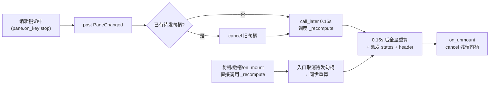

# diff-review-fixes-plan（diff-tool 二轮评审 issue 登记 + 修复）

来源：feat/diff-tool 分支二轮评审（python-code-review 六维框架，本轮产出 4 条，
此前 code-review-expert 一轮已修项 W1/S1/S4 与 backlog S2/S3/S5 不在本任务范围）。
本文件同时充当 issue 登记册：下表即本轮全部 issue 的登记与修复状态，收尾时回填实测结果。

## 一、目标与非目标

**目标**

1. 登记二轮评审 4 条 issue（本文件 §二登记表）。
2. 修复全部 4 条：
   - R1（WARNING）vim `a` 行尾跨行；
   - R2（WARNING）编辑每键全量重 diff 无防抖；
   - R3（SUGGESTION）`DiffPane.role` 死参数且 3way 赋值错误；
   - R4（SUGGESTION）`check_sizes` 生产零调用投机 helper。
3. 全量门禁过（pyright 零诊断 / pytest 全绿 / 架构 22 用例 / 覆盖率 ≥75）。

**非目标**

- backlog S2（键表常量化）、S3（vim e/q 透传）、S5（`:diff` 空格路径）——已在
  diff-tool-plan.md 遗留待办登记，S5 明确独立任务处理，本任务不动。
- 不改 L0 `yate/editor_core/diff.py`（本轮 4 条均在 L2/测试层）。
- 不新增功能、不改键位设计。

## 二、issue 登记表（收尾回填状态列）

| # | 级别 | 位置 | 问题 | 状态 |
|---|---|---|---|---|
| R1 | WARNING | yate/editor_view/diffview.py:154-156 | `append_at` 用 `move_right()`，行尾跨行（buffer.py:503-506），与主 vim keymap（keymaps/vim.py:517-519 `set_cursor` 钳制）语义不一致 | 待修 |
| R2 | WARNING | yate/editor_view/diffview.py:609-612 → 658-675 | 编辑模式每键 `PaneChanged` → `_recompute()` 全量重跑 difflib（最坏 O(n·m)）+ `_states_*` 全量重建；`MAX_DIFF_LINES=20000` 上限下连续打字可卡 UI 循环 | 待修 |
| R3 | SUGGESTION | yate/editor_view/diffview.py:251, 595 | `DiffPane.role` 存后生产/测试零引用（死参数），且 compose 3way 分支 `(_2WAY_ROLES + _3WAY_ROLES)[i]` 取到 "left"/"right"/"base" 而非 "base"/"local"/"remote" | 待修 |
| R4 | SUGGESTION | yate/editor_view/diffview.py:73-90 | `check_sizes` 仅 tests/test_diffview.py 引用，生产路径 overlays.py 直接比较 `MAX_DIFF_LINES`（为报文件名）；违反"不为假设性需求加抽象" | 待修 |

配套发现（本轮核实，随 R4 顺带处理）：`open_diff` 的 `>MAX_DIFF_LINES` 拒绝分支
在 test_diff_integration.py 无覆盖（grep 取证 0 命中），R4 删除 `check_sizes`
单测后该路径将彻底无测——必须补 1 条集成用例。

## 三、备选方案与否决理由

**R1（append_at）**

- 选定：`set_cursor((row, col + 1))` 依赖其行内钳制——与主 vim keymap 逐字同构，
  一行修复，语义由 keymaps/vim.py:517 注释与 buffer.py:319-327 契约锁定。
- 否决：改 `TextBuffer.move_right()` 增加不跨行参数——动 L0 公共 API，波及主编辑器
  全部调用方，为修 L2 语义问题不该碰 L0 契约。
- 否决：`append_at` 内手写 `if col < len(line): move_right()`——能修但绕过钳制契约，
  比 `set_cursor` 多一行且与主 keymap 实现不再同构。

**R2（防抖）**

- 选定：`asyncio.get_running_loop().call_later(0.15, _recompute)` 单句柄折叠——
  架构规则 §四 明文规定"防抖定时用 asyncio.get_running_loop().call_later"；
  `_recompute` 入口统一取消句柄，复制/撤销等直接调用路径保持同步重算不变。
- 否决：`self.set_timer(...)`（Textual Timer）——功能等价但与架构规则指定的
  call_later 形态不一致，且 Timer 生命周期由控件树管理，取消语义不如裸句柄直白。
- 否决：大文件禁编辑/降级提示——改变功能面，超出修复范围。
- 否决：只在内容变化时防抖、模式切换即时重算——模式切换本就无需重算
  （states 不依赖 editing），拆两路徒增分支。

**R3（role）**

- 选定：删除 `role` 形参与传参（YAGNI，全仓零引用）。
- 否决：修正为按模式取 `roles[i]`——为死参数恢复"正确"赋值是给不存在的消费者
  写代码；若未来需要语义角色，届时再按 `self._labels`/pane 顺序推导。

**R4（check_sizes）**

- 选定：删除函数 + 单测，补 1 条 `open_diff` 超大文件拒绝集成用例兜住真实路径。
- 否决：保留并标注"无生产调用方"——留死代码等未来调用方不如届时再加
  （届时加回成本 ≈ 现在保留的维护成本）。

## 四、分步实施计划

### Step 0 登记与方案（本文件 + 交叉引用）

- 输入：二轮评审报告（会话记录）。
- 改动文件：本文件新建；`.trae/documents/diff-tool-plan.md` 遗留待办节追加一行
  交叉引用（"二轮评审 4 条 → diff-review-fixes-plan.md"）。
- 输出：登记完成，提交 `docs(plans): register diff second-review findings`。
- 验收：文档可读、表格齐全（人工核对）。

### Step 1 wave-a：diffview.py 四项修复 + 测试（单波串行）

改动文件：

1. `yate/editor_view/diffview.py`
   - R1：`append_at` 改 `set_cursor` 钳制式（含注释说明与主 keymap 同构）；
   - R2：模块常量 `RECOMPUTE_DEBOUNCE_SECONDS: float = 0.15`；`import asyncio`；
     `__init__` 增 `self._recompute_handle: asyncio.TimerHandle | None = None`；
     `_pane_changed` 改为取消旧句柄 + `call_later` 调度 `_recompute`；
     `_recompute` 入口取消并清空句柄（复制/撤销直接调用自动吞掉待发防抖）；
     新增 `DiffScreen.on_unmount` 取消残留句柄（docstring 注明屏幕弹出时防泄漏）；
   - R3：`DiffPane.__init__` 删 `role` 形参与 `self.role`；`compose()` 删 `role=` 实参；
   - R4：删 `check_sizes`；`MAX_DIFF_LINES` 注释块改写（去掉 `check_sizes` 引用，
     保留 open_diff 直查语义说明）。
2. `tests/test_diffview.py`
   - 删 `check_sizes` 导入与 `test_oversized_file_rejected_constant`；
   - `test_edit_mode_types_into_focused_buffer` 的 `await pilot.pause()` 改
     `await asyncio.sleep(0.2)`（跨越 0.15s 防抖窗）；
   - 新增 `test_vim_append_at_eol_stays_on_line`：vim 键表 `$` 到行尾 → `a` →
     打字，断言字符落在当前行、光标行不变（R1 守卫）；
   - 新增 `test_debounced_recompute_applies_burst`：编辑模式连按两键后
     `await asyncio.sleep(0.3)`，断言两键均落盘且 regions 一致（R2 行为守卫）。
3. `tests/test_diff_integration.py`
   - 新增超大文件拒绝用例：tmp 写入 `MAX_DIFF_LINES + 1` 行，走 `open_diff` 入口，
     断言 message 提示 "too large" 且未推屏（R4 配套覆盖）。

验收命令（worktree 内，沙箱 `.venv`）：

```text
python -m pyright yate/ tests/ tools/          # 0 errors, 0 warnings
python -m pytest tests/test_diffview.py tests/test_diff_integration.py tests/test_editor_core_diff.py -q
python -m pytest tests/test_architecture.py -q  # 22 passed
```

### Step 2 收尾

- 主代理亲跑全量门禁：`python -m pyright yate/ tests/ tools/`（0 诊断）；
  `python -m pytest tests/ -q`（全绿，预期 1613 passed 基础上 -1 删 +3 增）；
  覆盖率 `--cov-fail-under=75`。
- 回填本文件：登记表状态列、执行记录（真实数字/退出码/偏离）。
- 按 `git-commit-message.md` 提交：`fix(diffview): ...`（Step 1 产物）与
  `docs(plans): ...`（回填）分笔提交；只提交不推送。

## 五、风险清单与回滚路径

| 风险 | 缓解 | 回滚 |
|---|---|---|
| 防抖改动破坏既有时序用例（pilot.pause 不再等够） | 仅 1 处用例涉重算时序（test_edit_mode_types…），改 sleep(0.2)；其余用例走复制/撤销同步路径不受影响 | 还原 `_pane_changed` 直调 `_recompute`，单笔 revert |
| 屏幕弹出后残留 `call_later` 句柄在已卸载控件上跑 `_recompute` | `on_unmount` 取消 + `_recompute` 入口幂等（只读 buffers 重算无副作用，query_one 在已卸载屏会抛——靠取消兜住） | 同上 |
| 删 `check_sizes` 后超大路径回归无守卫 | 配套集成用例补齐（§四 Step 1.3） | revert |
| 删 `role` 波及未知构造点 | grep 取证仅 compose 一处构造 + 零 `.role` 读取；pyright 全仓零诊断兜底 | revert |

回滚整体路径：各步独立提交，`git revert` 对应单笔即可，无数据/格式迁移。

## 六、防抖交互图（R2 改动后的键事件流）



## 七、执行记录（收尾回填）

- 待回填：各步验收命令实测输出与退出码、偏离记录、登记表状态列。
