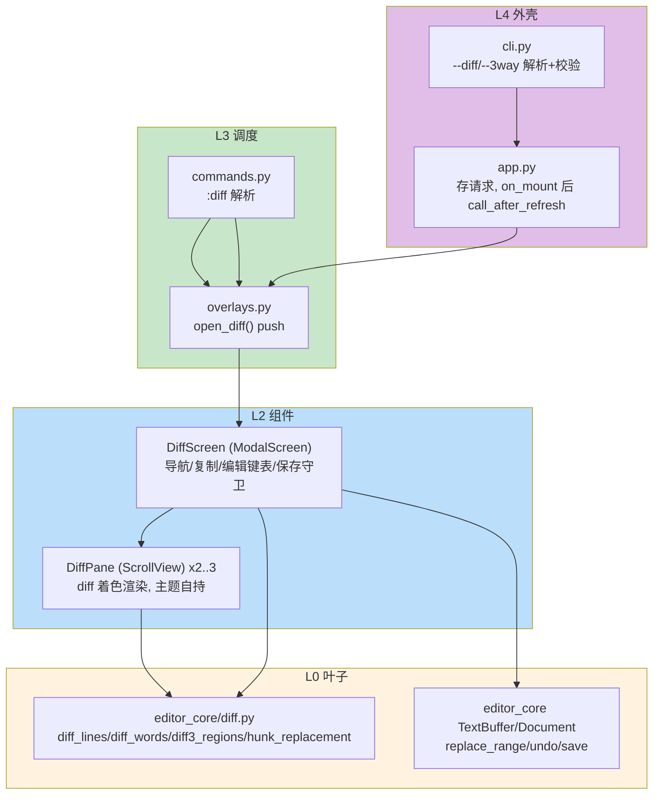
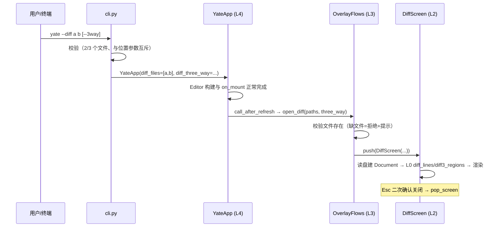

# diff-tool-plan（Gitee issue IKJC88：FEAT — diff 工具的实现和集成）

> 大任务，已拆分子计划：[`diff-tool-plans/overview.md`](diff-tool-plans/overview.md)。
> 本文件是主计划：目标 / 非目标、设计决策、备选与否决、波次表、风险与回滚。
> 各波次的具体改动定位、测试三要素与验收命令在各子计划内自包含。

## 一、调研结论（事实清单，均已复核）

| # | 事实 | 位置 |
|---|---|---|
| F1 | argparse 入口：`build_parser()` 定义全部参数，`main()` 先处理侧命令再懒加载 `YateApp` | [cli.py:38-174](../../yate/cli.py#L38-L174)、[cli.py:177-220](../../yate/cli.py#L177-L220) |
| F2 | 全屏 overlay 统一经 `OverlayFlows.push`（先清 prompt 再 push）；已有 help/manual/changelog/palette/screensaver 五类 | [overlays.py:72-85](../../yate/overlays.py#L72-L85)、[overlays.py:87-167](../../yate/overlays.py#L87-L167) |
| F3 | overlay 基类 `_OverlayScreen(ModalScreen[None])`：esc/q/ctrl+c 关闭、`DEFAULT_CSS = load_tcss(...)` | [modals.py:22-41](../../yate/editor_view/modals.py#L22-L41) |
| F4 | modal screen 期间 `Editor.handle_key` 直接返回 False（modal 拥有输入，无二次派发） | [editor.py:549-550](../../yate/editor.py#L549-L550) |
| F5 | `EditorView` 是绑定 `PaneRegistry`+leaf 的渲染器：主题自持（`theme.subscribe`）、`apply_slim_scrollbars` 实例注入、on_key 处理后 `event.stop()` | [editor_view/editor.py:252-259](../../yate/editor_view/editor.py#L252-L259)、[editor_view/editor.py:302-311](../../yate/editor_view/editor.py#L302-L311) |
| F6 | `TextBuffer.replace_range(start, end, text)` 支持行级替换，snapshot/undo 免费（`undo()`） | [buffer.py:384](../../yate/editor_core/buffer.py#L384)、[buffer.py:260](../../yate/editor_core/buffer.py#L260) |
| F7 | `Document.open`/`save`/`modified`：路径+缓冲+落盘三位一体；session.open 对不存在文件建空缓冲 | [document.py:63-76](../../yate/editor_core/document.py#L63-L76)、[session.py:97-116](../../yate/session.py#L97-L116) |
| F8 | 键位记法 `<alt-up>/<alt-down>/<alt-left>/<alt-right>` 已在 `KEY_ALIASES`/`SPECIAL_KEYS` 支持 | [keymaps/base.py:79-82](../../yate/keymaps/base.py#L79-L82) |
| F9 | `:命令` 注册于 `register_commands(registry, editor)`，允许 import editor（R5 方向） | [commands.py:37-38](../../yate/commands.py#L37-L38) |
| F10 | 架构守卫：`UI_FROZEN_FILES`（R11 白名单）与 `UI_FREE_PACKAGES/FILES`（R4）均为测试内数据表 | [test_architecture.py:98-154](../../tests/test_architecture.py#L98-L154) |
| F11 | R13：组件自持主题（订阅 `theme.subscribe`）、滚动条 per-widget 注入；L3 禁改 `.styles.*` | rules §一 R13 |
| F12 | 能力注入（IKJB0Q）：动词=绑定方法注入、状态查询=语义 Callable；流程模块禁持 `self.app` | [test_architecture.py:678-688](../../tests/test_architecture.py#L678-L688) |

## 二、目标与非目标

### 目标

1. L0 纯 diff 引擎：行级 2way hunk、行内字符级配对高亮范围、3way merge 区域分类，stdlib difflib 实现，零新依赖。
2. L2 diff view：全屏 `DiffScreen`（2way 双栏 / 3way 三栏），每栏 `DiffPane` 渲染一侧文件，diff 着色 + 行内高亮 + 同步导航。
3. 快捷键：Alt+Up/Down 上/下一个差异；Alt+Left/Right 复制到左/右（WinMerge 语义，目标侧方向）；Enter/e 进入编辑模式（3way 必需）；编辑模式基础键位跟随当前 keymap（vsc/vim 两套有界子表）；Ctrl+S 保存焦点侧；Ctrl+Z 撤销；Tab/Shift+Tab 切焦点；Esc/q 关闭（有未保存改动需二次确认）。
4. `:diff [--3way] f1 f2 [f3]` 命令；CLI `yate --diff f1 f2 [f3] [--3way]`。
5. 架构守卫同步：R11 白名单登记、R4 守卫面扩到 `editor_core`。

### 非目标

- 不做编辑器内核级 diff（不进 pane/tab 体系，不改 `session.py` 的 Leaf/Split 模型）。
- 不做完整 keymap 平价（vim operators/寄存器/marks、vsc 多光标不在 diff 编辑模式内）。
- 不做行内自由滚动的持续对齐跟随（导航跳转对齐；鼠标滚轮仅滚本侧）。
- 不做 diff 结果导出/patch 文件、不做目录递归对比（WinMerge 目录树功能）。
- 不在本计划内新增双语手册章节（可后续独立任务，遵守 `doc-conventions.md` §三）。
- 超大文件（> 20000 行/侧）拒绝进入并提示（防 UI 线程阻塞；异步 tokenize 化留待后续）。

## 三、设计决策

### D1 diff 算法：stdlib difflib（否决外部库与 git 子进程）

- **选型**：`difflib.SequenceMatcher(a, b, autojunk=False)` 行级 opcodes → hunk；对 replace 型 hunk 的两侧行再用字符级 `SequenceMatcher` 求 intra-line 高亮范围。3way = 两次 2way（base↔local、base↔remote）按 base 行区间合并分类。
- **否决 diff-match-patch**：新增第三方依赖，且其 patch 模型与"行级 hunk 导航 + 整块复制"需求错位；difflib 纯 stdlib、行为可测。
- **否决 `git diff --no-index` 子进程**：引入外部进程依赖与输出解析脆弱性，Windows 环境无 git 时直接失效。
- **autojunk 陷阱**：默认 `autojunk=True` 在序列 >200 元素时把高频行当垃圾导致错误 hunk——构造函数显式传 `autojunk=False`，并以 300+ 行单处修改的守卫用例锁死（plan-a 测试 T5）。

### D2 diff view 形态：独立 ModalScreen + 专用 DiffPane（否决嵌 pane、否决复用 EditorView）

- **选型**：`DiffScreen(ModalScreen[None])`（落 `yate/editor_view/diffview.py`），由 `OverlayFlows.open_diff` push（F2 模式）。每栏是专用 `DiffPane(ScrollView)`：只读渲染 + 编辑模式下受控写入。
- **否决嵌入 tab/pane 体系**：pane 树的 Leaf 是"单文档槽位"（session.py L1 模型），diff 需要跨栏锁定滚动与 hunk 绑定，得改 L1 模型 + PaneManager + WindowFlows，爆炸半径远超收益；overlay screen 是既定全屏工具模式（help/manual/palette 同类）。
- **否决复用 EditorView**：EditorView 硬绑定 `PaneRegistry`/leaf_id/LSP/高亮 worker（F5），构造假 leaf 违反"窗格模型归 L1"守卫精神；diff 栏渲染（± 徽标、行内高亮、无光标态）与其差异过大。专用 DiffPane 反而更小。
- **编辑模式**：DiffScreen 持有 `KeymapSet`（OverlayFlows 已注入），按 `keymaps.name` 选 vsc/vim 两套**有界键表**（模块级函数表，非新类）：vsc=方向键/Home/End/Backspace/Delete/Enter/直接输入/Ctrl+Z；vim=normal（h j k l 0 $ x dd i a o）+ insert（输入/Enter/Backspace/Esc）。所有写入走 `TextBuffer` 既有方法（F6），undo 免费。

### D3 数据模型与导航

- L0 数据（`yate/editor_core/diff.py`，全部 frozen dataclass）：
  - `DiffHunk(kind: "replace"|"insert"|"delete", a_start, a_end, b_start, b_end)`——0 基半开区间；
  - `DiffResult(hunks, a_lines, b_lines)` + `align(row) -> int`（左行→右行锚点映射，同步滚动用）；
  - `MergeRegion(kind: "same"|"local"|"remote"|"both"|"conflict", base_start/end, local_start/end, remote_start/end)`；
  - 纯函数 `diff_lines` / `diff_words` / `diff3_regions` / `hunk_replacement(target, hunk, source, copy_into) -> tuple[Pos, Pos, str]`（返回 `replace_range` 三元组）。
- 导航：`DiffScreen._current: int` 为 hunk/region 索引，Alt+Up/Down 步进并 **clamp 不回绕**（底部/顶部提示），两侧（三方为三侧）滚动到该差异起始行（`align` 映射），当前差异行加亮。

### D4 复制到左/右语义（否决"选中区复制"）

- **WinMerge 语义（方向=目标侧）**：Alt+Right = 把当前差异中**左侧内容**整块应用到右侧；Alt+Left = 反向。3way 下作用于 local↔remote 对（base 不作复制目标，编辑模式覆盖它）。
- 实现：L0 `hunk_replacement` 算出目标侧 `(start, end, text)` → `TextBuffer.replace_range`（F6，snapshot 自动入 undo 栈）→ 全量重算 diff、按行号就近锚定 `_current`。若目标侧 `buffer.read_only` → 拒绝并提示（R 式反馈）。
- **否决"选中区复制"**：diff 工具的操作单位是差异块，选择区语义引入两侧光标状态同步复杂度，v1 不做。

### D5 3way 角色：base / local / remote（git merge 惯例）

- CLI 与 `:diff` 均按 `base local remote` 顺序解释 3 个文件（`--help` 与页头注明）。
- 无冲突区：`local`/`remote` 单侧变更按普通差异呈现；两侧相同变更 → `both`；都改且不同 → `conflict`（专属底色 + `!` 徽标）。
- 编辑模式按 Enter/e 进入焦点栏，Tab 切栏（Ctrl+1/2/3 直达 base/local/remote）。

### D6 保存策略

- Ctrl+S 保存焦点侧 `Document.save()`（F7，EOL/编码沿用 Document 机制）；页头每栏显示 modified 标记（`●`）。
- Esc/q 关闭：任一侧 modified → 首次按只提示"unsaved changes — press esc again"，二次才 pop（防 diff 屏文档不在主 session、关闭即丢失）。

### D7 架构落位（触碰条款逐条标注）

| 新/改 | 层 | 文件 | 条款 |
|---|---|---|---|
| 新 | L0 | `yate/editor_core/diff.py`（纯 stdlib，不碰 Textual） | R4（守卫面扩入 `editor_core`，见 plan-c）；R6/R12/R2 |
| 新 | L2 | `yate/editor_view/diffview.py`（DiffScreen + DiffPane） | R3（不 import 上层）；R13（theme.subscribe 自绘 + `apply_slim_scrollbars(self)`）；R10（编辑模式消费后 stop；nav 模式冒泡到 screen BINDINGS） |
| 新 | 资源 | `yate/resources/diff-view.tcss`（`load_tcss` 装载为 `DiffScreen.DEFAULT_CSS`） | R9：screen 非外壳 compose 树成员，内部 id（`#diff-header`/`#diff-body`/`#diff-hint`）screen 自有（先例 `#overlay`），**不改 app.tcss** |
| 改 | L3 | `yate/overlays.py` 增 `open_diff()` | **R11**：新增 import `yate.editor_view.diffview` 须登记 `UI_FROZEN_FILES["overlays.py"]`（plan-c T1）；不持 App 句柄（R12 能力注入已满足：push_screen 等均已是注入回调） |
| 改 | L3 | `yate/commands.py` 增 `:diff` | R5（commands→editor 单向）；R7 不受影响（仍只有 app.py 装表） |
| 改 | L4 | `yate/cli.py` 增 `--diff`/`--3way`/`--2way` | R1 不变（仅 cli import app） |
| 改 | L4 | `yate/app.py` 存 CLI diff 请求并于 `on_mount` 经 `call_after_refresh` 触发 | L4 只做生命周期编排 |
| 改 | 守卫 | `tests/test_architecture.py`：`UI_FROZEN_FILES` 登记 + `UI_FREE_PACKAGES` 增 `"editor_core"` | R11/R4 |



### D8 启动时序（CLI 与 :diff 同路）



editor 内路径 `:diff f1 f2`：commands.py 解析后调 `editor.overlays.open_diff(...)`，与 CLI 汇合同一入口（避免双实现漂移）。

## 四、备选方案与否决理由（汇总）

1. **嵌入 tab/pane 体系**（Leaf 双栏 + 锁定滚动）——否决：需改 L1 窗格模型与 PaneManager/WindowFlows，违反"窗格模型归 L1"最小改动原则，且 tab 语义（单文档）与 diff（2-3 文档联动）冲突。
2. **复用 EditorView 作 diff 栏**——否决：PaneRegistry/leaf/LSP/高亮 worker 强耦合，假 leaf 违反窗格模型归属；渲染需求不同。
3. **外部库 diff-match-patch / git 子进程**——否决：见 D1。
4. **独立 `diff_flows.py` 流程模块**——否决（轻量理由）：OverlayFlows 就是全屏 overlay 的家（模块 docstring 自述），open_diff 仅 ~15 行，独立模块徒增一个 UI_FROZEN_FILES 登记面与 Editor 装配点。

## 五、波次表（task-coordinator 调度唯一依据）

| wave | 子计划 | 独占文件 | 依赖 |
|---|---|---|---|
| wave-1 | [plan-a（L0 diff 引擎）](diff-tool-plans/diff-tool-diff-engine-plan-a.md) | `yate/editor_core/diff.py`、`tests/test_editor_core_diff.py` | 无 |
| wave-2 | [plan-b（L2 diff view）](diff-tool-plans/diff-tool-diffview-plan-b.md) | `yate/editor_view/diffview.py`、`yate/resources/diff-view.tcss`、`tests/test_diffview.py` | wave-1 全部验收通过 |
| wave-3 | [plan-c（L3/L4 集成 + 守卫）](diff-tool-plans/diff-tool-integration-plan-c.md) | `yate/overlays.py`、`yate/commands.py`、`yate/cli.py`、`yate/app.py`、`tests/test_architecture.py`、`tests/test_cli.py`、`tests/test_diff_integration.py` | wave-2 验收通过 |

- 同波内文件互不重叠，可并行（每波实际单计划，串行推进无并行冲突面）。
- 每波验收命令退出码 0 才进下一波；最终全量门禁：`python -m pyright yate/ tests/ tools/` 零诊断 + `.venv\Scripts\python.exe -m pytest tests/ -q` 全绿。

## 六、风险清单与回滚

| # | 风险 | 缓解 | 回滚 |
|---|---|---|---|
| R-1 | difflib autojunk 对 >200 行文件产生错误 hunk | 构造显式 `autojunk=False` + plan-a 守卫用例 | plan-a 独立 revert |
| R-2 | 大文件 O(n²) 阻塞 UI 线程 | 20000 行/侧软上限拒绝并提示（plan-b 校验） | 上限为常量，可调/可去 |
| R-3 | Windows 终端 alt+方向键被吞 | keyproto 已支持 alt 弦（F8）；另加 ctrl+up/ctrl+down 导航冗余绑定 | 键表即数据，改动零结构 |
| R-4 | R10 二次派发回归（编辑模式吞键/漏键） | 编辑模式 DiffPane 消费即 `stop()`；nav 模式键冒泡一次到 screen；modal 期间 `Editor.handle_key` 直返 False（F4）；plan-c 集成用例验证关闭后按键回落编辑器 | plan-c revert 不影响 L0/L2 |
| R-5 | diff 屏文档不在主 session，关闭丢改动 | 二次 Esc 确认 + 页头 modified 徽标（plan-b 用例） | 行为为 screen 内状态机 |
| R-6 | `--diff` 与位置参数/nargs 解析歧义 | 位置参数与 --diff 并存即 parser.error；plan-c CLI 用例锁定 | cli 校验为纯前置，失败即退出码 2 |
| R-7 | R11/R4 守卫面扩大误伤存量 | plan-c 执行时先全量跑架构测试确认 `editor_core` 现状干净再登记 | 数据表回退一行 |
| R-8 | 复制到 read_only 侧静默失败 | `BufferReadOnlyError` 捕获 → 提示（沿用 editor.py:649 模式） | — |

## 七、验收总门禁（收尾）

```
python -m pyright yate/ tests/ tools/
.venv\Scripts\python.exe -m pytest tests/ -q
```

两者零诊断/全绿后，回填各子计划"执行记录"并按 `git-commit-message.md` 提交（建议每波一提交：`feat(diff): ...`）。
