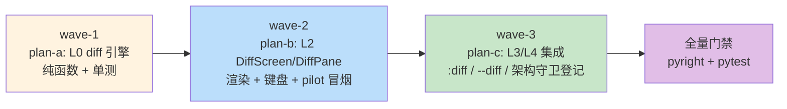

# diff-tool-plans 总纲（issue IKJC88）

主计划：[`../diff-tool-plan.md`](../diff-tool-plan.md)（目标/非目标、设计决策 D1-D8、
备选与否决、风险与回滚）。本目录只承载按波次切分的可执行子计划。

## 子计划索引

| 子计划 | 波次 | 独占文件（不与他人重叠） |
|---|---|---|
| [diff-tool-diff-engine-plan-a.md](diff-tool-diff-engine-plan-a.md) | wave-1 | `yate/editor_core/diff.py`、`tests/test_editor_core_diff.py` |
| [diff-tool-diffview-plan-b.md](diff-tool-diffview-plan-b.md) | wave-2 | `yate/editor_view/diffview.py`、`yate/resources/diff-view.tcss`、`tests/test_diffview.py` |
| [diff-tool-integration-plan-c.md](diff-tool-integration-plan-c.md) | wave-3 | `yate/overlays.py`、`yate/commands.py`、`yate/cli.py`、`yate/app.py`、`tests/test_architecture.py`、`tests/test_cli.py`、`tests/test_diff_integration.py` |

## 执行波次表



- wave-1 → wave-2 → wave-3 **严格串行**：上一波全部验收命令退出码 0 才进下一波。
- 波次一经批准不得执行中重排；确需调整须回填本文档并附实测依据。

## 统一验收门禁

```powershell
python -m pyright yate/ tests/ tools/
.venv\Scripts\python.exe -m pytest tests/ -q
```

## 边界条款触发汇总（详见各子计划）

- plan-a：R4 守卫面（`editor_core` 纳入 UI-free 扫描由 plan-c 落表）、R2/R6/R12（无 Protocol / 无 TYPE_CHECKING / tracing 惰性 %）。
- plan-b：R3（不 import 上层）、R13（theme.subscribe 自绘 + `apply_slim_scrollbars`）、R10（编辑模式 stop / nav 冒泡）、R9（screen 内部 id，不改 app.tcss）。
- plan-c：R11（`UI_FROZEN_FILES["overlays.py"]` 登记 `yate.editor_view.diffview`）、R5/R7（commands→editor 单向、装表仍归 app.py）、R1（CLI 改动不引入新的 app importer）。
