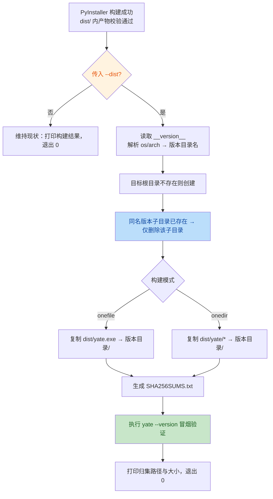

# pack 脚本 `--dist` 产物归集选项实施计划

> 给三个 pack 脚本（pack.ps1 / pack.bat / pack.sh）增加统一的
> `--dist <目录>` 选项：PyInstaller 构建成功后，把产物按
> **版本 + 平台 + 架构** 归集到指定目录的版本化子目录中，方便直接取包
> 分发或上传 Gitee Release。仅本地复制，不上传、不 push。
>
> 顺带修复一个独立缺陷：pack 脚本在 `.venv` 缺失时会**静默回退到系统
> Python**，随后 `pip install -e ".[build,ts]"` 把 `yate` 入口脚本装到
> 全局 `Scripts/`。本计划同步把回退改为"找不到 .venv 就报错退出"，
> 从机制上杜绝全局污染。

---

## 1. 现状（基于代码事实）

| 事实 | 证据 |
|------|------|
| 构建产物两处 | onedir：`dist/yate/`（整目录，含 yate.exe + 运行时）；onefile：`dist/yate.exe` |
| 主逻辑在 ps1 | [pack.ps1](file:///d:/Programming/yate/pack/pack.ps1)：选解释器→装 build extra→按 `-OneFile` 选 spec→PyInstaller→校验 artifact 存在→打印大小 |
| bat 是纯透传包装 | [pack.bat](file:///d:/Programming/yate/pack/pack.bat)：`powershell ... %*`，加参数只需改帮助注释 |
| Linux 脚本对称 | [pack.sh](file:///d:/Programming/yate/pack/pack.sh)：bash 实现同样流程，参数 `--onefile/-1/-h` |
| 脚本始终在仓库根执行 | ps1 `Push-Location $root`；sh `cd "$root"`，相对路径以根为准 |
| 版本号可读 | `yate/__init__.py` 的 `__version__`（changelog 计划后为唯一事实源；当前 0.1.0）；build extra 安装时已 `pip install -e .`，构建用 python 可直接 import |
| `dist/` 已被 git 忽略 | [.gitignore:13](file:///d:/Programming/yate/.gitignore#L13)；尚无独立的发布归集目录 |
| 打包前已有 changelog 刷新 | changelog 计划中的 `generate --bundle-only`（best-effort），本选项在其之后执行 |
| 解释器回退缺陷 | [pack.ps1:54-57](file:///d:/Programming/yate/pack/pack.ps1#L54-L57)：`.venv\Scripts\python.exe` 不存在时回退到全局 `python`；[pack.sh:55-59](file:///d:/Programming/yate/pack/pack.sh#L55-L59) 同理回退到 `python3`。随后的 `pip install -e ".[build,ts]"` 会把 `yate` 入口脚本（pyproject `[project.scripts] yate = "yate.cli:main"`）写到**全局** `Scripts/`，造成全局污染 |
| 全局污染已发生 | 用户环境中全局 Python `Scripts/yate.exe` 已存在（由某次 `.venv` 缺失时的打包或手动 `pip install -e .` 写入），需提供清理指引 |

---

## 2. 口径冻结

1. **选项命名**：统一 `--dist <目录>`（PowerShell 形参 `-Dist`，bat 透传
   原样）。不用 `--publish`：publish 暗示上传/发布到远端，本功能**只做
   本地复制**，不发起任何网络操作。
2. **取值方式**：显式传目录，不提供默认目录——不传 `--dist` 时行为与
   现在完全一致（只构建到 `dist/`，零影响）。
3. **相对路径基准**：相对目录一律相对**仓库根**解析（脚本已 cd 到根）。
4. **归集布局**：产物复制为目标目录下的版本化子目录，**一次构建一个
   自包含文件夹**：

   ```text
   <dist目录>/
     yate-0.1.0-windows-x64/
       yate.exe                 # onefile：单个 exe
       SHA256SUMS.txt           # 对 yate.exe 的校验值
     yate-0.1.0-windows-x64/    # onedir：整目录内容平铺
       yate.exe
       _internal/ ...
       SHA256SUMS.txt           # 对 yate.exe 的校验值（不含内部 DLL，
                                #  onedir 完整性以整目录拷贝为准）
   ```

   命名规则：`yate-<version>-<os>-<arch>`
   - os：`windows` / `linux`（macOS 暂不支持构建，不预设）
   - arch：x64 / arm64（Windows 取 `PROCESSOR_ARCHITECTURE`，
     AMD64→x64、ARM64→arm64；Linux 取 `uname -m`，
     x86_64→x64、aarch64→arm64，其余原样保留）
5. **覆盖策略**：目标版本化子目录已存在时，先删除该子目录再复制
   （保证内容与本次构建严格一致，无残留旧文件）；**绝不删除目标根目录
   及其他版本子目录**。
6. **失败处理**：复制失败（磁盘满、权限、路径非法）→ 报错退出码 1，
   但 `dist/` 内原始构建产物保留不动。
7. **校验文件**：复制完成后在版本目录内生成 `SHA256SUMS.txt`
   （一行 `<sha256>  yate.exe`），供 Gitee Release 附件校验；平台各自用
   原生命令算哈希（PowerShell `Get-FileHash`，Linux `sha256sum`）。
8. **冒烟验证**：复制后执行一次 `<版本目录>/yate.exe --version`
   （Linux 为 `./yate --version`），输出含当前版本号才算成功；失败则
   退出码 1 并提示。
9. **onedir 复制方式**：Windows 用 `Copy-Item -Recurse` 整目录复制即可；
   不引入 robocopy/rsync 等环境差异依赖。
10. **解释器必须来自 `.venv`（修复全局污染）**：pack 脚本**不再**回退到
    系统 Python。若 `.venv\Scripts\python.exe`（Windows）或
    `.venv/bin/python`（Linux）不存在，立即报错退出码 1，提示用户先
    执行 `python -m venv .venv`。这从机制上保证 `pip install -e` 只把
    `yate` 入口脚本写入 `.venv`，绝不污染全局 `Scripts/`。
11. **已存在的全局污染清理**：不在脚本中自动执行全局卸载（误伤风险
    高），改为在报错信息和本计划附录中给出手动清理命令（删除全局
    `Scripts/yate.exe` / `yate-script.py`，或用全局 `pip uninstall yate`）。

---

## 3. 执行流程



---

## 4. 实施细节

### 4.1 `pack/pack.ps1`

**A. 修复全局回退（必做，先于 `--dist`）**

把现有 [pack.ps1:54-57](file:///d:/Programming/yate/pack/pack.ps1#L54-L57) 的回退逻辑：

```powershell
$pythonExe = Join-Path $root ".venv\Scripts\python.exe"
if (-not (Test-Path $pythonExe)) {
    $pythonExe = "python"   # ← 删除此回退
}
```

改为找不到 `.venv` 就直接报错退出：

```powershell
$pythonExe = Join-Path $root ".venv\Scripts\python.exe"
if (-not (Test-Path $pythonExe)) {
    Stop-WithMessage (
        ".venv not found at '$pythonExe'. " +
        "Run 'python -m venv .venv' and '.\.venv\Scripts\Activate.ps1; pip install -e `"[build,ts]`"' first. " +
        "Falling back to system python is disabled to avoid installing the yate entry script into the global Scripts/ directory."
    )
}
```

**B. 新增 `--dist` 参数与归集段**

param 块新增：

```powershell
[Alias("d")]
[string]$Dist = ""
```

构建成功、现有产物大小打印之后插入归集段（仅当 `$Dist -ne ""`）：

1. `$distRoot = [System.IO.Path]::GetFullPath((Join-Path $root $Dist))`
   ——相对路径锚定仓库根（不用 `Resolve-Path`，目录此时允许不存在）；
2. 版本：`$version = (& $pythonExe -c "from yate import __version__; print(__version__)").Trim()`，
   取不到值则 Stop-WithMessage；
3. 平台三元组：`$arch = if ($env:PROCESSOR_ARCHITECTURE -eq 'ARM64') {'arm64'} else {'x64'}`，
   `$name = "yate-$version-windows-$arch"`，
   `$stage = Join-Path $distRoot $name`；
4. `New-Item -ItemType Directory -Force $distRoot`；若 `$stage` 存在则
   `Remove-Item -Recurse -Force $stage`；
5. onefile：`Copy-Item $artifact $stage\yate.exe`
   （$artifact 已是 dist\yate.exe）；
   onedir：`Copy-Item -Recurse dist\yate\* $stage\`（先建 $stage）；
6. 校验值：

   ```powershell
   $hash = (Get-FileHash $stage\yate.exe -Algorithm SHA256).Hash.ToLower()
   "$hash  yate.exe" | Set-Content -Encoding ascii $stage\SHA256SUMS.txt
   ```

7. 冒烟：`& $stage\yate.exe --version`，检查输出含 `$version`；
8. 打印归集结果（绝对路径、文件夹大小 MB），帮助文本（`.SYNOPSIS`/
   `.EXAMPLE`）补：

   ```text
   .\pack\pack.ps1 -OneFile -Dist release
   .\pack\pack.ps1 --dist D:\releases\yate
   ```

### 4.2 `pack/pack.bat`

逻辑零改动（`%*` 已透传），仅头部注释补示例：

```bat
rem    pack\pack.bat --onefile --dist release
```

### 4.3 `pack/pack.sh`

**A. 修复全局回退（必做，先于 `--dist`）**

把现有 [pack.sh:55-59](file:///d:/Programming/yate/pack/pack.sh#L55-L59) 的回退逻辑：

```bash
if [ -x "$root/.venv/bin/python" ]; then
    py="$root/.venv/bin/python"
else
    py="python3"   # ← 删除此回退
fi
```

改为找不到 `.venv` 就直接报错退出：

```bash
py="$root/.venv/bin/python"
if [ ! -x "$py" ]; then
    echo "error: .venv not found at '$py'." >&2
    echo "       Run 'python3 -m venv .venv && . .venv/bin/activate && pip install -e '.[build,ts]' first." >&2
    echo "       Falling back to system python is disabled to avoid installing the yate" >&2
    echo "       entry script into the global bin/ directory." >&2
    exit 1
fi
```

**B. 新增 `--dist` 参数与归集段**

参数解析循环增加 `--dist|-d`（其下一参数为目录，`--dist=DIR` 也接受），
未知参数处理保持现有报错。构建成功后对称实现：

1. `dist_root="$(cd "$root" && realpath -m -- "$dist_arg")"`
   （`realpath -m` 允许目标不存在）；
2. `version="$("$py" -c 'from yate import __version__; print(__version__)')"`；
3. `arch="$(uname -m)"`：x86_64→x64、aarch64→arm64；
   `stage="$dist_root/yate-$version-linux-$arch"`；
4. `mkdir -p`；`[ -e "$stage" ] && rm -rf "$stage"`；
5. onefile 复制 `dist/yate` → `$stage/yate`（注意 Linux 产物无扩展名，
   冒烟时 `chmod +x` 属性随 Copy 保留，显式 `chmod 0755` 兜底）；
   onedir `cp -a dist/yate/. "$stage/"`；
6. `(cd "$stage" && sha256sum yate > SHA256SUMS.txt)`；
7. `"$stage/yate" --version | grep -q "$version"` 冒烟；
8. help 文本（show_help 注释块）补 `--dist DIR` 用法与示例。

### 4.4 `.gitignore`

新增一行：

```gitignore
# Local release staging (pack --dist)
release/
```

`release/` 作为文档示例目录；用户传任意其他目录不受影响。

---

## 5. 边界与错误场景

| 场景 | 行为 |
|------|------|
| 不传 `--dist` | 与现状完全一致，不创建任何额外目录 |
| 目标根目录不存在 | 自动创建（含多级父目录） |
| 版本子目录已存在 | 仅删除/重建该子目录；其他版本目录原样保留 |
| 目标是文件而非目录 | New-Item/mkdir 失败 → 退出 1，报错信息含路径 |
| 版本号读取失败（环境异常） | 退出 1，明确提示无法读取 `__version__`；dist 产物保留 |
| 复制后 `--version` 冒烟失败 | 退出 1，保留 stage 目录便于排查，并打印其路径 |
| `--dist` 与 `-Help` 同时 | 现有帮助优先（exit 0） |
| 目标在其他盘符/UNC 路径 | Copy-Item / cp 支持；冒烟用绝对路径执行 |
| 路径含空格/中文 | 全部变量加引号；ps1 用 `Join-Path`/`GetFullPath` |
| `.venv` 不存在 | 直接退出码 1，提示创建 venv 的命令；**绝不**回退到系统 python，避免全局 `Scripts/` 污染 |
| 已存在全局污染 | 脚本不自动卸载全局 yate；报错信息给出手动清理命令（见附录 A） |

---

## 6. 测试与验证

脚本测试以手动 + 可重复命令为主（仓库无 shell 测试基建）：

```powershell
# 1. 无选项回归：行为不变
.\pack\pack.ps1
# 仅出现 dist\yate\，不产生 release\

# 2. onedir 归集（相对目录）
.\pack\pack.ps1 --dist release
# 期望 release\yate-<version>-windows-x64\ 存在
#   - yate.exe 可执行：.\release\yate-*\yate.exe --version 含版本号
#   - SHA256SUMS.txt 存在且哈希校验通过：
cd (Get-ChildItem release\yate-* | Select-Object -First 1).FullName
(Get-Content SHA256SUMS.txt).Split(' ')[0]
(Get-FileHash yate.exe).Hash.ToLower()   # 两者一致

# 3. onefile 归集（绝对路径 + 重复执行覆盖）
.\pack\pack.ps1 -OneFile -Dist D:\tmp\yate-releases
.\pack\pack.ps1 -OneFile -Dist D:\tmp\yate-releases
# 同名版本目录被干净替换，无旧文件残留；同级其他版本目录保留

# 4. bat 透传
.\pack\pack.bat --onefile --dist release

# 5. 冒烟失败可见（可选人为验证：复制后手工破坏再观察报错口径）
```

```bash
# Linux（有环境时）
./pack/pack.sh --onefile --dist release
release/yate-*-linux-x64/yate --version
( cd release/yate-*-linux-x64 && sha256sum -c SHA256SUMS.txt )
```

人工检查点：

- 退出码：成功 0、复制失败/冒烟失败 1；
- 重复构建同名目录内容严格等于本次产物（可对 onedir 做文件数对比）；
- 含空格路径（`--dist "D:\my releases"`）正常；
- `git status` 不出现 `release/`（gitignore 生效）。

**全局回退修复验证（Windows）**：

```powershell
# 1. 把 .venv 临时改名，确认脚本直接报错而不是用全局 python
Rename-Item .venv .venv.bak
.\pack\pack.ps1
# 期望：退出码 1，错误信息含 ".venv not found"，且全局 Scripts\yate.exe 没有被重新生成
Rename-Item .venv.bak .venv

# 2. 确认 .venv\Scripts\yate.exe 存在，全局 Scripts\yate.exe 不存在
Test-Path .venv\Scripts\yate.exe     # True
where.exe yate                        # 不应列出全局 Python 路径
```

**全局污染手动清理（若 where.exe yate 仍显示全局路径）**：

```powershell
# 找到全局 Python 安装目录后，删除其 Scripts 下的 yate 入口
# 例如全局 Python 在 C:\Python311：
del "C:\Python311\Scripts\yate.exe"
del "C:\Python311\Scripts\yate-script.py"
# 或用全局 pip 卸载（注意不要用 .venv 的 pip）：
py -3.11 -m pip uninstall yate
```

---

## 7. 文件变更清单

| 文件 | 操作 | 说明 |
|------|------|------|
| `pack/pack.ps1` | 修改 | (1) 删除 `.venv`→系统 python 回退，找不到则报错退出；(2) 新增 `-Dist/--dist/-d` 参数、归集段（版本目录、覆盖、哈希、冒烟）、帮助文本 |
| `pack/pack.sh` | 修改 | (1) 删除 `.venv`→系统 python3 回退，找不到则报错退出；(2) 新增 `--dist/-d` 参数解析与对称归集逻辑、help 注释 |
| `pack/pack.bat` | 修改 | 仅头部注释补示例（逻辑仍为透传） |
| `.gitignore` | 修改 | 忽略 `release/` 示例归集目录 |
| `yate/resources/manual.zh.md` / `manual.en.md` | 修改 | 发布附录补 `--dist` 用法与归集目录布局说明；并提醒"必须在 .venv 中打包" |
| `.trae/documents/dist_copy_plan.md` | 新增 | 本文档 |

> 本计划与 changelog 计划独立，可单独实施；若两者同时落地，执行顺序为
> changelog 刷新 → PyInstaller 构建 → `--dist` 归集，互不耦合。

---

## 8. 后续可扩展方向

- `--zip`：归集后额外压缩为 `yate-<version>-<os>-<arch>.zip`
  （Compress-Archive / zip -r），直接作为 Gitee Release 附件；
- 版本号含 `dev`/本地构建后缀时（如 `0.2.0.dev3+g<hash>`）自动附加短
  hash，避免多次开发构建互相覆盖；
- `--publish` 作为真正的上传动作（Gitee Release API + `GITEE_TOKEN`），
  与本地 `--dist` 分层，届时本选项是其第一步；
- 归集时同步写入一份 `BUILDINFO.txt`（python 版本、构建时间、commit
  hash、spec 模式），与 `--diag` 信息呼应。

---

## 附录 A：已存在的全局污染清理指引

症状：`where.exe yate`（Windows）或 `which yate`（Linux）列出的路径指向
**全局** Python 的 `Scripts/`（或 `bin/`），而非 `.venv`。

根因：某次打包时 `.venv` 不存在，pack 脚本回退到系统 python 并执行了
`pip install -e ".[build,ts]"`，`pyproject.toml` 的
`[project.scripts] yate = "yate.cli:main"` 把入口脚本写到了全局目录。

**清理步骤（Windows）**：

```powershell
# 1. 定位全局 Python（where.exe 输出中排除 .venv 的那条）
where.exe yate

# 2a. 直接删除全局入口脚本（假设全局 Python 为 C:\Python311）
del "C:\Python311\Scripts\yate.exe"
del "C:\Python311\Scripts\yate-script.py"

# 2b. 或用全局 pip 卸载（用 py 启动器指定版本，避免误用 .venv 的 pip）
py -3.11 -m pip uninstall yate

# 3. 确认已清理干净
where.exe yate      # 应只剩 .venv 路径或无输出
```

**清理步骤（Linux）**：

```bash
# 1. 确认 which yate 指向全局
which yate          # 例如 /usr/local/bin/yate

# 2. 用全局 pip 卸载（不要用 .venv 的 pip）
/usr/bin/python3 -m pip uninstall yate
# 或直接删除
sudo rm -f /usr/local/bin/yate /usr/local/bin/yate-script.py

# 3. 确认
which yate          # 应只剩 .venv 路径或无输出
```

清理后重新激活 `.venv` 并安装：

```powershell
.\.venv\Scripts\Activate.ps1
pip install -e ".[build,ts]"
# 此时 yate 只在 .venv\Scripts\ 下
```
