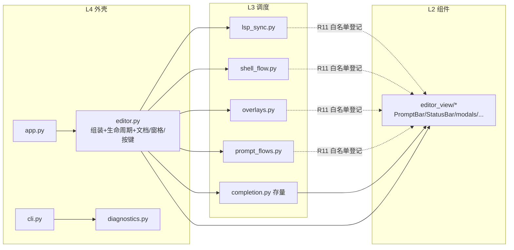

# Editor 重构拆分总纲（issue IKIPP2）

> 依据：`.trae/issues/review_20260926.md` 问题 5（editor.py 组装职责过载）+ §六-4（Editor 瘦身持续机制）。
> 分支 `ref/editor-refactoring`，worktree `D:/Programming/yate-editor-refactoring`（已 fast-forward 合并 master `30d7909`）。
> 基线：editor.py **1600 物理行**（pyright strict 0 诊断 / pytest 全绿 / 架构测试 20 用例）。

## 一、目标

1. 把 `yate/editor.py` 中**单一职责的流程**外移为独立 L3 流程模块（参照 `completion.py` 的
   `CompletionController` 模式），editor.py 回归「生命周期 + 组装 + 横跨多协作者的操作」。
2. 构造函数组装逻辑拆为模块级工厂函数（review 问题 5 的明确建议）。
3. **行为零变更**：actions.py / commands.py / app.py / cli.py / tests / widgets 的调用面
   （`editor.*`）原样保留——新流程模块经 Editor 上的**薄委托**暴露。
4. editor.py 净减约 370 行（1600 → 约 1230，−23%），新增 4 个各 ≤ ~180 行的内聚模块。

## 二、非目标

- **不**外移 documents（open/save/tab）与 panes/window-chords 流程——它们是「横跨
  session/panes/explorer/completion/message」的核心操作，正是架构 §二 规定 Editor 保留的职责。
- **不**改任何外部调用点（actions/commands/app/tests 零 diff）。
- **不**新增 Protocol / TYPE_CHECKING / 类型层；不把 editor.py 转为包。
- 不动 keymap/theme setter、explorer、refresh 等小节（外移收益低于委托成本）。

## 三、调研事实（文件:行号）

| 事实 | 证据 |
|---|---|
| editor.py 1600 行，构造函数 88-207 集中组装 models/widgets/panes/completion | `yate/editor.py:88-207` |
| 外部调用面：actions 28 处、commands 48 处、app.py 9 处直接调 `editor.*` | grep 实测 |
| 流程模块先例：CompletionController 9 个构造参数，Editor 留 3 个薄委托 | `yate/completion.py`、`editor.py:1307-1323` |
| L3 模块 import Editor 有先例（diagnostics，仅 cli 用、无环）；**新模块被 editor import，故禁止反向 import editor**（会成环）→ 一律显式传具体协作者 | `yate/diagnostics.py:24` |
| R11 白名单是 `UI_FROZEN_FILES: dict[文件名, set[允许的 editor_view 导入]]`，规则原文允许新模块登记 | `tests/test_architecture.py:94-113` |
| LspManager(on_event=…) / EditorSession(on_closed=…) 均为**延迟回调**，可用 lambda 指向晚创建的流程对象，构造顺序不成环 | `editor.py:113,122-125` |

## 四、备选方案与否决理由

| 方案 | 否决理由 |
|---|---|
| A. Mixin 把 Editor 类拆到多文件 | 类碎片化，违背「能函数不造类」与组件自持风格；review 建议的是流程模块；测试与 pyright 对半初始化实例更难推断 |
| B. `yate/editor/` 包转换 | 违反「包 `__init__.py` 保持惰性」（`from yate.editor import Editor` 需要 re-export）；波及全部 import 与架构测试路径守卫 |
| C. 无委托、直接改 ~90 处调用点到子控制器 | 行为回归风险大面积扩散（含 4000 行 test_app_textual），收益仅省几十行委托 |
| D. 仅组装工厂化（review P2 最小步） | 不减文件行数，无法回应 issue「拆分更细」；作为 Wave A 纳入 |

**采用**：组装工厂化 + 4 个流程模块外移 + Editor 薄委托门面（CompletionController 既有模式）。

## 五、波次表（严格串行——所有波次都改 editor.py，文件不独占，无法并行）

| 波次 | 子计划 | 产出模块 | editor.py 变化 | 提交 |
|---|---|---|---|---|
| W1 | [plan_A](plan_A_assembly.md) 组装工厂化 | （无新文件） | `__init__` 120→~25 行，模块级 `_build_*` 工厂 | `refactor(editor): extract assembly factories` |
| W2 | [plan_B](plan_B_lsp_sync.md) LSP 胶水 | `yate/lsp_sync.py`（LspSync） | −75 外移 / +15 委托与重接 | `refactor(editor): extract lsp_sync flow` |
| W3 | [plan_C](plan_C_shell.md) shell+font | `yate/shell_flow.py`（ShellFlow） | −100 / +12 | `refactor(editor): extract shell flow` |
| W4 | [plan_D](plan_D_overlays.md) 覆盖层 | `yate/overlays.py`（OverlayController） | −100 / +35 | `refactor(editor): extract overlays flow` |
| W5 | [plan_E](plan_E_prompt_flows.md) 查找/替换/跳转 | `yate/prompt_flows.py`（PromptFlows） | −150 / +24 | `refactor(editor): extract prompt flows` |

每波独立验收、独立提交（单波回滚 = revert 单个提交）；任一波失败即停，不带病前进。

## 六、目标模块图



新流程模块与 completion.py 同构：**只被 editor.py 构造，绝不 import yate.editor /
yate.app / actions / commands**；`editor_view` 导入按 R11 规则登记进
`UI_FROZEN_FILES` 白名单（规则原文允许的扩充程序，架构测试同步更新）。

## 七、统一验收门禁（每波相同，退出码必须全 0）

```powershell
.venv\Scripts\python.exe -m pyright yate/ tests/ tools/      # 0 诊断
.venv\Scripts\python.exe -m pytest tests/ -q                 # 全绿（基线 1400+）
.venv\Scripts\python.exe -m pytest tests/test_architecture.py -q   # 20+ 用例
.venv\Scripts\python.exe -m tools.smoke_test run             # UI 冒烟 5 场景
# 收尾波次追加：coverage --cov-fail-under=75
```

## 八、风险清单与回滚

| 风险 | 缓解 |
|---|---|
| 构造顺序成环（on_event/on_closed 指向晚创建的流程对象） | lambda 延迟解析（证据：现有回调本就延迟触发）；pyright strict + 全量测试兜底 |
| 工厂函数内赋值的属性 pyright 无法推断 | Editor 类体补**类级注解声明**（无赋值、无 TYPE_CHECKING，合规） |
| 新模块 import editor_view 触发 R11 守卫 | 每波同步登记 `UI_FROZEN_FILES`（规则原文授权程序）；负向语义不变 |
| 行为漂移 | 委托门面 + 外部调用点零 diff + 1400+ 测试与 smoke 全程绿 |
| 命名守卫误伤 | 类名避开 `*Feature/*Host/*Ops/*Delegate`；`*Controller` 为流程类合法后缀 |
| 回滚 | 每波单独提交，`git revert <wave-commit>` 即回到上一波；文档随收尾波回填真实数字 |
