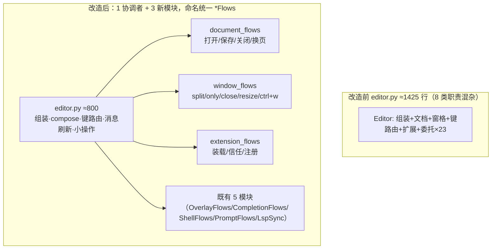

# editor 拆分总纲（editor-split）

> 续作任务：复用 worktree `D:\Programming\yate-editor-refactoring`（分支
> `ref/editor-refactoring`，HEAD `c04d202` 已合并 master：文档命名迁移为连字符 +
> 规则重读完成）。基线 editor.py 1425 行（HEAD `07004a0` 侧五波产物，master 从未
> 含这些模块；合并自动取我方版本，工作区干净）。
> 用户裁定：editor.py 太大难维护——去掉所有薄委托转发/薄壳，按职责拆分，职责单一、
> 扩展性好，不破坏边界与现有架构；**流程模块命名统一 `*Flows`（Controller 不好，
> lsp_sync 语义准确保留）**；架构规则文本随决策同步更新。

## 一、目标

1. **流程模块命名统一**：`OverlayController`→`OverlayFlows`、`CompletionController`→
   `CompletionFlows`、`ShellFlow`→`ShellFlows`（文件 shell_flow.py→shell_flows.py）；
   `prompt_flows.py::PromptFlows`、`lsp_sync.py::LspSync` 已合规范不动；成员名
   ed.overlays/ed.completion/ed.shell/ed.prompt_flows 不变。命名守卫收紧：全仓
   禁 `*Controller`。
2. **删除 Editor 上全部薄委托/薄壳（23 个）**，调用方按架构 §四第 1 行
   「1:1 直调具体协作者的方法」直调流程模块（R8 合规）。
3. **editor.py 按职责拆出 3 个单一职责 L3 流程模块**（`*Flows` 形态，构造注入、
   不向上依赖）：document_flows（文档生命周期 ~250 行）、window_flows（窗格命令与
   ctrl+w 弦 ~139 行）、extension_flows（扩展装载/信任/注册 ~76 行）。
4. editor.py 1425 → ~800 行，只保留：组装工厂、compose/on_mount 生命周期、
   键派发核心（handle_key/handle_raw_key/execute_action）、消息与刷新、
   真跨协作者小操作（quit/page/theme/set_filetype/focus 等）。
5. **规则同步**（architecture-boundaries §七）：每个架构决策波同步更新规则文本与
   `tests/test_architecture.py` 守卫。
6. 行为零变更；每波独立提交、门禁全绿才进下一波。

## 二、非目标

- 不动 handle_key（外移需注入 15+ 协作者，内聚更差）；不动组装工厂 `_build_*`
  （`ed: Editor` 注解跨模块成环）；不动 command_prompt/run_command（`:` 派发枢纽）、
  theme 簇（R13 钦定 Editor 触发）、keymap 切换、set_filetype、cancel_prompt、
  focus 簇、open_document（公共实现入口，非转发）。
- 不新增 Protocol / TYPE_CHECKING / EventBus；不建公共类型层。

## 三、editor.py 职责清点（HEAD `07004a0` 实测；改名波不改行号结构）

| 区块 | 行号 | 行数 | 去向 |
|---|---|---|---|
| 组装工厂 ×4 | 82-247 | ~166 | 保留（plan-d/e/f 更新接线） |
| 生命周期 compose/on_mount/… | 340-405 | ~66 | 保留 |
| 消息与刷新 | 407-453 | ~47 | 保留 |
| **文档生命周期 ×19 方法** | 455-705 | ~250 | **→ plan-d document_flows** |
| 键路由 handle_key 等 | 707-860 | ~154 | 保留（核心） |
| **窗格命令与 ctrl+w 弦 ×10** | 862-1000 | ~139 | **→ plan-e window_flows** |
| focus 簇 | 1002-1026 | ~25 | 保留 |
| prompt_open/_submit_open（`:e`） | 1035-1046 | ~12 | → plan-d |
| **薄委托 23 个** | 散布 | ~120 | **→ plan-c 删除/迁移** |
| page/keymap/theme/set_readonly/set_filetype | 1088-1205 | ~130 | 保留 |
| run_command/quit/install_font(删) | 1219-1254 | ~36 | 前两者保留 |
| explorer 小操作 | 1316-1345 | ~30 | 保留 |
| **扩展装载/信任/注册** | 1347-1422 | ~76 | **→ plan-f extension_flows** |

薄委托 23 个证据：editor.py:1064-1086（prompt_flows 6）、1056-1062（shell_prompt→
ShellFlows.open_prompt）、1209-1217（shell 2）、1242-1244（install_font）、1258-1274
（completion 3，仅内部调用 :546/566/588/615/635/1025/746/760）、1278-1280（lsp 1）、
1284-1314（overlays 7）、1318-1320（refresh_explorer，唯一调用方 :1325）、1100-1108
（prompt_completions 组装壳→partial 直绑）。外部调用：actions.py 12 处、commands.py
8 处、tests 19 处（test_app_textual 14、test_changelog_view 4、test_action_table
recorder）。

## 四、关键时序约束（plan-c 选型）

`extension_api` 在 `_build_models` 期构造（:117），`extension_context()` 于 :324 取
`self.run_shell_command`；`self.shell` 到 `_build_pane_stack` 才存在，StatusBar
（:153-156）依赖 `extension_loader`，构成构造环。**采纳**：
`run_shell=lambda command, show_output=True: self.shell.run(...)`——与 `_build_models`
现行前向引用惯例一致（:93/:107），构造注入不是委托方法。**否决**零 lambda 直绑：
需连锁重排 4 个构造步骤，打乱 W1 工厂职责划分。

## 五、波次表（子计划索引；c-f 均改 editor.py，串行）

| 波次 | 子计划 | 独占文件 | 提交 |
|---|---|---|---|
| wave-1（并行） | [plan-a](editor-split-docs-plan-a.md) 旧方案文档改名迁移 | `.trae/documents/editor-refactoring_plans/` 6 份 | `docs(plans): rename editor refactoring plans to the naming convention` |
| wave-1（并行） | [plan-b](editor-split-flows-rename-plan-b.md) 流程模块统一 *Flows | shell_flow.py、completion.py、overlays.py、editor.py、tests/×2、test_architecture.py、architecture-boundaries.md | `refactor: unify flow module naming to *Flows` |
| wave-2（串行） | [plan-c](editor-split-delegates-plan-c.md) 删全部薄委托/薄壳 | editor.py、shell_flows.py、completion.py、actions.py、commands.py、tests/×3、architecture-boundaries.md | `refactor(editor): drop thin delegates and shells, call owners directly` |
| wave-3（串行） | [plan-d](editor-split-documents-plan-d.md) 抽 DocumentFlows | editor.py、document_flows.py(新)、actions.py、commands.py、tests/×n、test_architecture.py、architecture-boundaries.md | `refactor(editor): extract document lifecycle flows` |
| wave-4（串行） | [plan-e](editor-split-windows-plan-e.md) 抽 WindowFlows | editor.py、window_flows.py(新)、editor_view/explorer.py、commands.py、tests/×n、tools/smoke_test/scenarios/panes.py、test_architecture.py、architecture-boundaries.md | `refactor(editor): extract window pane flows` |
| wave-5（串行） | [plan-f](editor-split-extension-flows-plan-f.md) 抽 ExtensionFlows | editor.py、extension_flows.py(新)、cli.py、commands.py、tests/×n、architecture-boundaries.md | `refactor(editor): extract extension startup flows` |
| wave-6（串行） | 评审：code-review-expert 剧本，记录落 `.trae/review/2026-09-29-editor-split.md` 与总纲互链；blocker/major → 回到本总纲迭代 | 评审记录 | `docs(review): record the editor split review` |
| wave-6（串行） | 收尾：主代理全量门禁 → 回填真实数字与偏离 → docs 提交 | overview/plan-* | `docs(plans): backfill editor split results` |

- wave-1 两子计划文件零重叠可并行（2 个一批）；派发失败/零产出时主代理亲自串行
  执行并如实标注。**提交纪律**：每步单独提交，只提交、不推送。

## 六、规则同步矩阵（用户裁定：架构没破坏也要更新规则文本）

| 波 | architecture-boundaries.md | tests/test_architecture.py |
|---|---|---|
| plan-b | 自检清单与 §六命名守卫：`*Controller 仅限流程类` → `流程模块按职责命名（编排 *Flows / 同步 LspSync），禁新增 *Controller`；§四示例若引 shell_flow 更正 | 命名守卫收紧 *Controller 进禁用列表；UI_FROZEN_FILES `shell_flow`→`shell_flows` |
| plan-c | :149 删 run_shell_command_later 示例 | 无（20 用例继续把关） |
| plan-d | §一 L3 清单补 document_flows；R11 白名单文本同步 | UI_FROZEN_FILES 增 document_flows 条目（panes/explorer/commandline） |
| plan-e | §一 L3 清单补 window_flows；R11 同步 | UI_FROZEN_FILES 增 window_flows 条目（panes/commandline/explorer） |
| plan-f | §一 L3 清单补 extension_flows | 无需（无 editor_view 依赖） |

## 七、拆分前后结构

调用方直调形态：`editor.document_flows.save_document()`、
`editor.window_flows.split_with_path(...)`、`editor.extension_flows.load_startup_services()`、
`editor.prompt_flows.find_prompt(True)`、`editor.overlays.show_help()`、
`editor.shell.open_prompt()`、`editor.completion.request(...)`。

## 八、风险清单与回滚

| 风险 | 缓解 |
|---|---|
| 构造顺序（新模块依赖 panes/prompt_bar/completion） | 各 plan 明确插入点；pyright strict 兜底 |
| 键派发回归（R10） | handle_key 不动只换目标对象；textual-pilot-smoke 全量 |
| 大量测试调用点改写 | 每 plan 附 grep 探针清单；断言语义不变 |
| 架构白名单遗漏 | §六矩阵逐波登记；架构测试拦截 |
| DocumentFlows↔WindowFlows 依赖环 | 单向：WindowFlows 注入 DocumentFlows 具体对象（R8） |
| 改名波漏 patch 字符串 | grep `shell_flow|OverlayController|CompletionController` 兜底 |
| 回滚 | 每波一笔独立提交 `git revert`；波间串行 |
