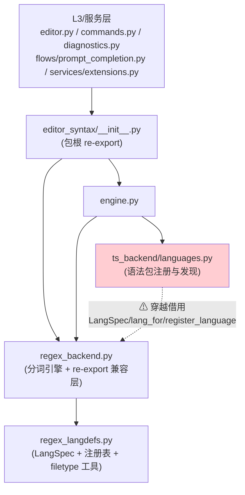
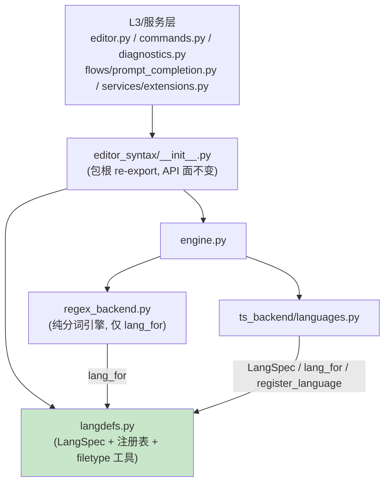

# editor_syntax 语言注册表上提 — 实施方案

- 分支：`ref/editor-syntax-langdefs`（worktree 沙箱，仓库根即 worktree 根）
- 方案路径：`.trae/documents/editor-syntax-langdefs-plan.md`（主计划，单文件，用户已定不需子计划目录）
- 触发判据（plan-before-execute §一）：改动 ≥ 3 个文件（本文共 9 个，见 §六）；跨模块（editor_syntax 包内 4 个模块联动）；多方案选型（命名、兼容层、git mv）。→ 必须方案先行。
- 判定说明：本改动全部发生在 **L0 叶包 `editor_syntax` 内部**（自包内模块上提为包顶层模块），不新增跨层依赖边，不触碰 L1–L4；按大任务判据（底层多处修改）本应拆子计划目录，主代理已明确指示单文件主计划，方案内以执行波次表（§六）承担波次约束。

## 一、调研取证清单（file:line 级事实）

1. `yate/editor_syntax/regex_langdefs.py`（794 行，`splitlines` 口径）持有完整注册表：`LangSpec`（:42）、`_LANGUAGES`（:239）、`_NAME_TO_KEY`（:244）、`register_language`（:247）、`lang_for`（:747）、`resolve_filetype`（:755）、`language_name`（:770）、`available_filetypes`（:776）、`format_filetype_candidates`（:781）；纯 stdlib 依赖（仅 `dataclasses`），`__all__`（:20–34）显式导出含两个私有 dict。
2. `yate/editor_syntax/regex_backend.py`（500 行）:
   - :35–45 从 `regex_langdefs` 导入 9 个符号（`lang_for` + 8 个纯转发符号）；
   - :48–61 `__all__` 把 8 个注册表符号再导出（re-export 兼容层）；
   - 模块内部**唯一**实际调用是 `lang_for`（:442 与 :493，两条 tokenize 路径取 spec）；`available_filetypes` / `format_filetype_candidates` / `language_name` / `resolve_filetype` / `register_language` / `_LANGUAGES` / `_NAME_TO_KEY` 在模块体内**零调用**——只在 import 块与 `__all__` 里出现（grep 全文取证）。
3. `yate/editor_syntax/ts_backend/languages.py:31`：`from yate.editor_syntax.regex_backend import LangSpec, lang_for, register_language` —— ts 后端穿越 regex 分词引擎借注册表，**本次要消除的依赖异味**；ts_backend 包内其余模块（backend.py:25–33）不碰 regex_backend。
4. filetype 工具函数的消费者全部经**包根** `from yate.editor_syntax import ...` 导入，且全部在语法层之外：
   - `available_filetypes`：`yate/services/extensions.py:49–54`（:192 使用）、`yate/flows/prompt_completion.py:14`（:76、:92 使用）；
   - `format_filetype_candidates`：`yate/commands.py:17`（:317）、`yate/editor.py:35`（:853）、`yate/diagnostics.py:313`（函数内惰性导入，:335 使用）；
   - `resolve_filetype`：`yate/editor.py:37`（:848）、`yate/diagnostics.py:313`（:321）；
   - `language_name`：`yate/commands.py:17`（:313）、`yate/editor.py:36`（:858）；
   - `lang_for` / `register_language` / `LangSpec`：`ts_backend/languages.py:31`、`services/extensions.py:49–54`（api.highlight.register 桥，:169/:181/:187）。
   - `tools/` 目录 grep 零命中（无脚本消费方）。
5. 测试绑定面（全部引用 `regex_backend` 模块属性）：
   - `tests/test_highlight.py`：:10 `from yate.editor_syntax import regex_backend as hl`；经 `hl.*` 访问 `lang_for`（:125/:148/:196/:210/:215/:219）、`resolve_filetype`（:132–156/:197/:228–229）、`language_name`（:160–162）、`available_filetypes`（:166/:198/:230）、`LangSpec`（:14/:189/:213）、`register_language`（:195/:214/:217），以及 `tokenize_document`（分词断言，约 20 处）与 `hl.Token`（:14）；
   - `tests/test_ts_backend.py`：:24 导入 regex_backend；`regex_backend._LANGUAGES`（:450/:895，`mock.patch.dict`）、`_NAME_TO_KEY`（:451/:772/:896）、`regex_backend.lang_for`（:784/:920）；`regex_backend.tokenize_document`（:378/:418，分词器归 regex_backend，不动）；
   - `tests/test_extension_examples.py`：:29 导入；`regex_backend._LANGUAGES`（:79/:86/:87）、`_NAME_TO_KEY`（:80/:88/:89）、`regex_backend.lang_for`（:159/:162/:191）；
   - `tests/test_syntax_engine.py`：仅用 `regex_backend.tokenize_document` 与内部状态机 `_S_TRIPLE_DQ` 等（:312–331），**不绑注册表符号，零改动**。
6. 包根 `yate/editor_syntax/__init__.py`：:28–36 从 `regex_backend` re-export 7 个注册表符号；模块 docstring :17–22 声明这是 architecture-boundaries §三.5 的叶包公共 API 例外（守卫 `test_leaf_package_reexports_carry_exception_note` 断言 docstring 含 "architecture-boundaries" 字样，`tests/test_architecture.py:888–900`）。
7. 文档面（grep 全仓 `*.md`）：
   - `yate/docs/` 双语手册**零命中** `regex_langdefs` / `regex_backend`；`extensions.en.md:307` / `extensions.zh.md:281` 教插件 `from yate.editor_syntax import LangSpec`（包根导入，迁移后不变）；两手册提及 `yate/editor_syntax/ts_backend/languages.py`（en:421 / zh:386）仅作路径描述，不涉本次符号归属；
   - `README.md:236` / `README.zh.md:254` 对 `editor_syntax/` 的目录描述为泛述（"regex tokenizer backend"），不列模块名，无需改；
   - `CHANGELOG.md:3` / `CHANGELOG.zh.md` 头部注明由 `python -m tools.changelog` 生成、"do not edit by hand"；grep 零命中 `regex_langdefs`。
8. 体量阈值：`tests/test_architecture.py:213` `MAX_SOURCE_LINES = 800`，:528–546 守卫。`regex_langdefs.py` 现为 **794 行**，上提改名后 docstring 改写净增预算仅 **≤ 6 行**。
9. 架构测试现役 **27 例**（architecture-boundaries §六），其中与本改动相关的守卫：`test_source_files_within_size_threshold`（A11）、`test_leaf_package_reexports_carry_exception_note`（包根 docstring 关键词）、`test_no_type_checking`（R6）、`test_no_banned_identifier_names`（命名守卫）。

## 二、目标与非目标

### 目标

1. 语言注册表上提为包顶层共享模块 `yate/editor_syntax/langdefs.py`：`LangSpec`、`_LANGUAGES`、`_NAME_TO_KEY`、`register_language`、`lang_for`、`resolve_filetype`、`language_name`、`available_filetypes`、`format_filetype_candidates`（含全部词表常量与 `_spec` / `_css_family` 私有构造器）随 `git mv` 整体迁移，文件历史保留。
2. 消除 `ts_backend/languages.py:31` 穿越 `regex_backend` 借注册表的依赖边：ts_backend 与 regex_backend **平行**依赖 `langdefs`。
3. `regex_backend.py` 收敛为纯分词引擎：对注册表只保留 `lang_for` 一条依赖边，删除 :35–45 的 8 符号转发导入与 `__all__` 中的对应 re-export 条目。
4. 包根 `yate/editor_syntax/__init__.py` 的公共 API 面逐符号不变（`from yate.editor_syntax import LangSpec` 等继续成立，导入源改指 `langdefs`）。
5. 测试绑定同步指向 `langdefs`；在 `tests/test_architecture.py` 新增守卫，固化"ts_backend 禁止 import regex_backend"。
6. 全量门禁维持：pyright strict 零诊断、pytest 全绿、架构测试 28 例全绿、覆盖率 `--cov-fail-under=75`。

### 非目标

1. 不把 `regex_backend` 打成子包、不做 ts/regex 双目录镜像（用户已否决，见 §四.A）。
2. 不改任何分词行为、注册表数据、`register_language` 语义或 engine 的后端选择逻辑；纯移动 + 导线重接。
3. 不新增 `Protocol` / `TYPE_CHECKING` / `Any` / 兼容 shim；不改 `services/extensions.py`（它只依赖包根）。
4. 不动 `editor_view/highlighting.py`（仅在注释里提及 LangSpec，无导入）。
5. 不改 `yate/docs/` 双语手册与 CHANGELOG（取证结论见 §四.E）。

## 三、两个分析问题的结论

### Q1 公开函数是否全部上提 —— 结论：**全部上提**（`available_filetypes` / `format_filetype_candidates` / `language_name` / `resolve_filetype` 随注册表一起迁入 `langdefs.py`）

理由（全部来自 §一取证）：

1. **regex_backend 内部零调用**：regex_backend.py 体内对这四个函数没有任何调用点（grep 全文仅 import 块 :39–44 与 `__all__` :52–57 两处出现）；分词引擎真正消费的只有 `lang_for`（:442/:493）。"留在 regex_backend"唯一的支撑是 re-export 兼容层，而兼容层正是本次要拆除的对象。
2. **消费者语义不属于分词引擎**：四个函数的全部调用方在 L3 / 服务层（`editor.py` :set filetype 路径、`commands.py` :filetype 报告、`diagnostics.py` 语法段报告、`flows/prompt_completion.py` 补全候选、`services/extensions.py` api.highlight 桥），它们消费的是"注册表查询"能力而非"逐行分词"能力。注册表查询归注册表模块所有，与 `lang_for` 同源同表（`resolve_filetype` 直接读 `_LANGUAGES`/`_NAME_TO_KEY`，`language_name`/`format_filetype_candidates`/`available_filetypes` 又建在 `lang_for`/`resolve_filetype` 之上）——拆开只会制造第二处跨模块借用。
3. **平行依赖要求**：用户方向是两后端平行依赖注册表。若四函数留 regex_backend，未来 ts_backend 或新后端需要 `resolve_filetype` 时会复活同款异味（ts_backend 已实际借用了 `lang_for`，即前车之鉴）。
4. **公共 API 零变化**：四函数本来就经包根导出，上提后包根 re-export 源从 `regex_backend` 改指 `langdefs`，`from yate.editor_syntax import ...` 的插件面与 L3 导入面逐符号不变，消费者代码零改动。

### Q2 模块命名 —— 结论：**`langdefs.py`**

| 候选 | 裁决 | 理由 |
|---|---|---|
| `langdefs.py` | **采纳** | 与来源 `regex_langdefs.py` 一脉相承（git mv 后最小改名，blame/历史可追踪）；两音节短名，与同包 `tokens.py` / `engine.py` 命名风格一致（python-coding-style §1.2 模块 snake_case + 项目实测短名惯例）；"language definitions" 精确覆盖模块内容（LangSpec 定义 + 内置语言表 + 查询工具） |
| `langspec.py` | 落选 | 以单一数据类命名，但模块主体是 60+ 语言的注册表与四个查询函数，`LangSpec` 只是其中一个类型；名实不符 |
| `languages.py` | 落选 | 与 `ts_backend/languages.py` 语义撞车：后者是 **tree-sitter 语法包注册与发现**（BUILTIN_PACKS/load_language），前者是**词法规格注册表**，同层两模块同名异义必然误导导航与 grep；且 ts_backend/languages.py 的 docstring（:10–12）本身要引用"共享注册表"概念，同名会互相指代不清 |
| `lang_registry.py` | 落选 | 模块不止注册表 dict（还有 LangSpec 定义、词表常量、查询工具），"registry" 概括不全；三词长名背离 `tokens.py` / `engine.py` 短名风格 |

## 四、备选方案与否决理由

### A. 整包镜像子包方案（regex_backend 打成子包镜像 ts_backend 结构）—— 否决

用户已否决（上一轮讨论定案）。技术面补充否决理由：regex 后端是单模块职责（一个 500 行的 tokenizer + 一个 794 行的定义表），撑不起包结构；镜像化会新增 `regex_backend/` 目录与 `__init__` 门面层，改 9 处导入只为对称而对称，违反 Simple is better than complex。

### B. 保留 regex_backend re-export 兼容层方案（regex_backend 继续转发注册表符号，测试零改动）—— 否决

1. **兼容层就是异味本体**：`ts_backend/languages.py:31` 的问题不是"借了符号"，而是"经 regex 分词引擎中转借符号"。保留 re-export，依赖图的异味只是换了入口名，方案目标 2 直接落空。
2. **两条等价导入路径**违反 one obvious way：`from yate.editor_syntax.langdefs import lang_for` 与 `from yate.editor_syntax.regex_backend import lang_for` 并存，后续贡献者无法判断哪个是权威源。
3. **pyright strict 噪音**：regex_backend 将长期 import 8 个自用零个的符号并维护 `__all__` 声明（现状 :35–61 正是这段），纯负债。
4. **真正的外部契约在包根**：插件手册只记载 `from yate.editor_syntax import LangSpec`（`yate/docs/extensions.en.md:307`），regex_backend 的 re-export 是 a 波拆分时为存量测试面搭的临时桥（regex_backend.py:11–15 docstring 自述 "re-exported here for API compatibility"），拆桥后 `mock.patch.dict` 绑定改名会立即 AttributeError——**响亮失败优于静默兼容**，这正是要的暴露方式。
5. 改动成本可控：需同步的只有 3 个测试文件约 30 处属性前缀（§六 wave-2 精确列点），一次性还清。

### C. 直接改测试导入方案（上提 + 测试同步改绑 `langdefs`）—— **采纳**

即本方案 wave-2。理由：与 B 相反，它让测试绑定跟随所有权走（`mock.patch.dict` 打的 dict 对象从此只有一个真身 `langdefs._LANGUAGES`）；包根公共 API 面不动，外部插件与 L3 消费者零感知；改动一次到位，无中间态。

### D. 新建文件 vs `git mv` —— 结论：`git mv yate/editor_syntax/regex_langdefs.py yate/editor_syntax/langdefs.py`

内容 95% 不变（仅 docstring 与 `__all__` 注释微调），git mv 保留 blame 历史与 rename 检测；新建文件会把 794 行词表标成全量新增，永久丢失行级溯源。`git mv` 后跟一次 docstring 编辑，git 自动识别为 rename。

### E. 文档决策（docstring 与双语手册 / CHANGELOG）

- **必须同步的 docstring 清单**（4 处）：
  1. `yate/editor_syntax/langdefs.py:1–14` 模块头——由"the language registry of the regex backend"改写为"语法层共享语言注册表，regex 与 ts 两后端平行依赖"；:20–34 `__all__` 内注释（:22–25）由"re-exported by ``regex_backend`` for the existing test surface"改为"tests bind these very objects via ``mock.patch.dict`` / in-place clear-update"；
  2. `yate/editor_syntax/regex_backend.py:1–15` 模块头——:11–15 段落由"registry lives in regex_langdefs and is re-exported here"改为"registry lives in the package-top ``langdefs`` (shared with ts_backend); this module keeps only the tokenizer engine and consumes ``lang_for``"；
  3. `yate/editor_syntax/__init__.py:1–23` 模块头——:8–15 的后端描述与 :17–22 的 re-export 例外声明改写为"registry lives in ``langdefs``, both backends depend on it in parallel"；**硬约束**：改写后必须保留字面 "architecture-boundaries"（守卫 `test_leaf_package_reexports_carry_exception_note`，`tests/test_architecture.py:888–900`）；
  4. `yate/editor_syntax/ts_backend/languages.py:1–18` 模块头——:10–12 "the canonical language name from the regex registry"改为"from the shared language registry (``yate.editor_syntax.langdefs``)"。
- **双语手册**：无需改动。grep 全部 `*.md` 零命中 `regex_langdefs` / `regex_backend`；手册记载的插件导入是包根形态（`from yate.editor_syntax import LangSpec`），本次不动。双语同步硬约束未被触发（没有需要改的手册内容，不存在只改一半的风险面）。
- **CHANGELOG.md / CHANGELOG.zh.md**：由 `python -m tools.changelog` 生成（`CHANGELOG.md:3`），方案不手改；若需登记 refactor 条目，由 refactor 提交信息走生成流程，双语由工具保证。
- **README / README.zh**：目录描述为泛述，不点名模块文件，不改。

## 五、目标结构与依赖方向（Mermaid）

### 迁移前（异味：ts 穿越_regex_ 借注册表）



### 迁移后（两后端平行依赖 langdefs）



要点：`langdefs` 保持 stdlib-only（仅 `dataclasses`），是更深的叶子；`regex_backend → langdefs`（1 条边）、`ts_backend/languages → langdefs`（3 符号）完全平行，互不借道；无环。

## 六、分步实施计划（执行波次）

改动文件总表（独占清单，波次间无重叠）：

| 波次 | 文件 | 性质 |
|---|---|---|
| wave-1 | `yate/editor_syntax/langdefs.py`（自 `regex_langdefs.py` git mv） | 源码 |
| wave-1 | `yate/editor_syntax/regex_backend.py` | 源码 |
| wave-1 | `yate/editor_syntax/__init__.py` | 源码 |
| wave-1 | `yate/editor_syntax/ts_backend/languages.py` | 源码 |
| wave-2 | `tests/test_highlight.py` | 测试 |
| wave-2 | `tests/test_ts_backend.py` | 测试 |
| wave-2 | `tests/test_extension_examples.py` | 测试 |
| wave-3 | `tests/test_architecture.py` | 测试（新增守卫） |
| wave-3 | `.trae/rules/architecture-boundaries.md` | 规则文档同步 |

波次约束：三波**串行**执行（同一执行者、同一提交单元；wave-1 中途 pytest 必红是预期态，波次是验证检查点而非独立提交）。每波验收命令统一用 worktree 沙箱解释器（下文以 worktree 根相对路径书写，按 doc-conventions §五不落盘符绝对路径，语义等价于 `d:\Programming\yate-editor-syntax-langdefs\.venv\Scripts\python.exe`）。

### wave-1：源码原子切换（git mv + 三处导入源重接）

**输入**：§一取证 1–3、6；§四.D/E 决策。

**改动 1 — git mv**：
```
git mv yate/editor_syntax/regex_langdefs.py yate/editor_syntax/langdefs.py
```

**改动 2 — `yate/editor_syntax/langdefs.py`（迁移后）**：
- 改写模块 docstring :1–14（措辞见 §四.E.1，说明两后端平行依赖、import 方向仍单向、stdlib-only 不变）；
- 改写 `__all__` 内注释 :22–25（见 §四.E.1）；
- **其余 780 行一字不改**（词表、`_spec`、`_css_family`、注册调用、`__all__` 条目原样）；
- **行数硬约束**：落地后 ≤ 800 行（现 794，docstring 净增 ≤ 6 行；超限时压缩 docstring 行文，**禁止**登记 SIZE_EXEMPT_FILES 豁免）。

**改动 3 — `yate/editor_syntax/regex_backend.py`**：
- :35–45 导入块收敛为 `from yate.editor_syntax.langdefs import lang_for`（删除其余 8 符号）；
- :48–61 `__all__` 删除 `LangSpec`、`_LANGUAGES`、`_NAME_TO_KEY`、`available_filetypes`、`format_filetype_candidates`、`language_name`、`register_language`、`resolve_filetype` 八条，保留 `tokenize_document` / `tokenize_document_with_states` / `tokenize_line`；
- :1–15 模块头 docstring 按 §四.E.2 改写；
- :442/:493 的 `lang_for` 调用与全部分词逻辑零改动。

**改动 4 — `yate/editor_syntax/__init__.py`**：
- :28–36 导入源 `from yate.editor_syntax.regex_backend import (...)` 改为 `from yate.editor_syntax.langdefs import (...)`，七个符号逐一不变；
- :39–51 `__all__` 不变（API 面逐符号冻结）；
- :1–23 模块头按 §四.E.3 改写（保留 "architecture-boundaries" 字样）。

**改动 5 — `yate/editor_syntax/ts_backend/languages.py`**：
- :31 改为 `from yate.editor_syntax.langdefs import LangSpec, lang_for, register_language`；
- :1–18 模块头 :10–12 按 §四.E.4 改写；
- :272 的 `register_language(LangSpec(name=key), *extensions)` 与 :352 的 `lang_for(key)` 调用零改动。

**输出**：依赖图完成 §五"迁移后"形态；此时测试未同步，pytest 必红（`regex_backend._LANGUAGES` 等属性访问 AttributeError）——**预期态，不入库**。

**验收命令**（wave-1 出口判据）：
```
.venv/Scripts/python.exe -m pyright yate/ tests/ tools/
```
通过判定：退出码 0，零诊断。（pyright 对 re-export 删除后 regex_backend 只剩自用导入、包根与 ts_backend 指向 langdefs 的类型一致性给出静态证明；tests/ 仍引用 `regex_backend._LANGUAGES` 会在此暴露为诊断，属预期，wave-2 消除。）

### wave-2：测试绑定同步（3 个测试文件，约 30 处前缀改写）

**输入**：§一取证 5。

**改动 6 — `tests/test_highlight.py`**：
- :10 保留 `from yate.editor_syntax import regex_backend as hl`（分词断言用）；其后新增 `from yate.editor_syntax import langdefs as reg`（注册表断言用）——`hl` 从此只承担 tokenizer 行为，`reg` 只承担注册表行为，意图二分；
- :14 `_kinds` 签名 `list[hl.Token]` 改为 `list[Token]`，并在导入区新增 `from yate.editor_syntax.tokens import Token`（Token 不再借道 regex_backend 属性）；
- 注册表断言前缀改写（`hl.` → `reg.`，仅限这六个符号）：`hl.lang_for`（:125/:148/:196/:210/:215/:219）、`hl.resolve_filetype`（:132–156/:197/:228–229）、`hl.language_name`（:160–162）、`hl.available_filetypes`（:166/:198/:230）、`hl.LangSpec`（:189/:213）、`hl.register_language`（:195/:214/:217）；
- 全部 `hl.tokenize_document` 调用与分词断言零改动。

**改动 7 — `tests/test_ts_backend.py`**：
- :24 导入行加入 `langdefs`：`from yate.editor_syntax import available_filetypes, engine, langdefs, regex_backend, ts_backend`（regex_backend 保留，:378/:418 分词断言仍用）；
- 属性前缀改写：`regex_backend._LANGUAGES` → `langdefs._LANGUAGES`（:450/:895）、`regex_backend._NAME_TO_KEY` → `langdefs._NAME_TO_KEY`（:451/:772/:896）、`regex_backend.lang_for` → `langdefs.lang_for`（:784/:920）；
- `mock.patch.dict` 语义不变：patch 的就是 `langdefs` 模块上的 dict 对象，与生产代码 `register_language` 写入同一真身。

**改动 8 — `tests/test_extension_examples.py`**：
- :29 导入行改为 `from yate.editor_syntax import engine, langdefs, resolve_filetype, tokenize_document`（regex_backend 不再被引用，移除）；
- 属性前缀改写：`regex_backend._LANGUAGES` → `langdefs._LANGUAGES`（:79/:86/:87）、`_NAME_TO_KEY` → `langdefs._NAME_TO_KEY`（:80/:88/:89）、`regex_backend.lang_for` → `langdefs.lang_for`（:159/:162/:191）。

**输出**：全部测试绑定指向真身模块。

**验收命令**（wave-2 出口判据）：
```
.venv/Scripts/python.exe -m pytest tests/ -q
```
通过判定：退出码 0，全绿（含既有 test_highlight / test_ts_backend / test_extension_examples / test_syntax_engine 全部行为用例——本波是"迁移零行为变化"的行为学证明）。

### wave-3：架构守卫 + 规则文档同步 + 全量门禁

**改动 9 — `tests/test_architecture.py` 新增守卫用例**（详案见 §七.1）：
- 新增 `test_ts_backend_never_imports_regex_backend`（AST 静态取证，扫 `yate/editor_syntax/ts_backend/` 全部 `*.py`）；用例数 27 → 28。

**改动 10 — `.trae/rules/architecture-boundaries.md` 同步**：
- §六 用例计数三处 "27" → "28"（§六首句、对照表标题、负向演练尾注如有）；
- §六对照表新增第 28 行：`test_ts_backend_never_imports_regex_backend` | 注册表归属（langdefs 平行依赖，ts 禁借 regex）；
- §一（依赖方向清单）或 §六新增一条条款文字："`editor_syntax` 的语言注册表归包顶层 `langdefs.py` 所有；`regex_backend` 与 `ts_backend` 平行依赖它，`ts_backend/*` 禁止 import `regex_backend`（守卫：§六 #28）"。

**输出**：守卫固化 + 规则与代码一致。

**验收命令**（wave-3 = 收尾全量门禁，plan-before-execute §二.5）：
```
.venv/Scripts/python.exe -m pyright yate/ tests/ tools/
.venv/Scripts/python.exe -m pytest tests/test_architecture.py -q
.venv/Scripts/python.exe -m pytest tests/ -q
.venv/Scripts/python.exe -m pytest tests --cov=yate --cov-branch --cov-report=term-missing --cov-fail-under=75
```
通过判定：四条命令退出码全 0；架构测试 `28 passed`；覆盖率 ≥ 75。

**提交**：三波作为同一提交落库（提交信息建议 `refactor(editor-syntax): lift the language registry to package-top langdefs`）；提交后按需运行 `python -m tools.changelog` 走生成流程（§四.E）。

## 七、需要新增的测试与验证方案

### 1. `tests/test_architecture.py::test_ts_backend_never_imports_regex_backend`

- **验证目标**：固化本次重构的结构结论——两个后端平行依赖 `langdefs`，`ts_backend` 不得再穿越 `regex_backend` 借注册表（消除的正是 `ts_backend/languages.py:31` 这条边，防回归）。
- **前置条件与 fixture**：无（静态取证，与既有 R3/R4 AST 守卫同型；复用文件内既有的 import 解析辅助函数 `_module_imports` 或同款 `ast.walk` 遍历）。
- **操作步骤（arrange/act）**：遍历 `yate/editor_syntax/ts_backend/` 下全部 `*.py`，解析每文件的 import 语句（`ast.Import` 与 `ast.ImportFrom` 两形态，`ImportFrom.level > 0` 的相对导入一并展开检查）。
- **断言**：不存在任何解析到 `yate.editor_syntax.regex_backend`（或以其为前缀的子模块）的导入；违规时以 `(path, lineno)` 列表断言失败。守卫面为白名单式反断言：ts_backend 只允许依赖 `langdefs` / `tokens` / `ts_backend.*` / stdlib / `yate.logs`。
- **正反路径**：正向 = 现状代码全绿；反向（负向演练）= 临时在 `ts_backend/languages.py` 加回 `from yate.editor_syntax.regex_backend import lang_for` 一行，确认该用例变红，随后还原（演练不留痕）。
- **验证命令**：`.venv/Scripts/python.exe -m pytest tests/test_architecture.py -q`（需一并回归：全量 `pytest tests/ -q`）。
- **通过判定**：退出码 0，`28 passed`；负向演练中退出码非 0（拦截有效）。
- **守卫归属**：非 R1–R13 既有条款，属本次新增的结构条款，登记入 architecture-boundaries §六（改动 10）。

### 2. `tests/test_highlight.py::test_package_root_reexports_bind_langdefs_objects`（轻量身份守卫）

- **验证目标**：包根公共 API 面（架构 §三.5 叶包 re-export 例外）逐符号绑定到 `langdefs` 真身，防止未来有人把包根导入源改回 regex_backend 或别的中间层而 API 面静默漂移。
- **前置条件与 fixture**：无。
- **操作步骤**：`from yate.editor_syntax import LangSpec, available_filetypes, format_filetype_candidates, lang_for, language_name, register_language, resolve_filetype` 与 `from yate.editor_syntax import langdefs` 同场，逐一 `is` 身份比对。
- **断言**：七个符号全部 `root is langdefs.<同名>`（对象身份，非仅相等）。
- **验证命令**：`.venv/Scripts/python.exe -m pytest tests/test_highlight.py -q`（需一并回归：wave-2 全量命令）。
- **通过判定**：退出码 0。

### 3. 不需要新增行为测试的说明

迁移是纯移动 + 导线重接：注册表行为（`register_language` 覆盖语义、`resolve_filetype` 边界输入 `.PY`/`c++`/`""`/`"."`、`mock.patch.dict` 隔离、扩展示例 end-to-end）已由存量用例全覆盖（`test_highlight.py` :132–230、`test_ts_backend.py` :450–920、`test_extension_examples.py` 全套），wave-2 的全量回归即行为不变性的证明；不重复造用例。

## 八、触碰的架构边界条款与守卫对照

| 条款/守卫 | 关系 |
|---|---|
| §三.5 叶包有限 re-export 例外 | 包根 API 面逐符号不变，例外注明 docstring 保留 "architecture-boundaries" 字样（守卫 #24 `test_leaf_package_reexports_carry_exception_note` 继续绿） |
| §三.7 / A11 文件体量 | `langdefs.py` ≤ 800 行硬约束（守卫 #27 `test_source_files_within_size_threshold`；不新增豁免） |
| R2 / R6 / R8 | 不新增 Protocol / TYPE_CHECKING / Any；零影响（守卫 #1/#3/#4 绿） |
| R1 / R3 / R4 / R5 / R7 / R11–R13 | 改动不涉（L0 包内部导线重接，无跨层边变化），全量架构回归覆盖 |
| 新增守卫 #28 | 见 §七.1 |

## 九、风险清单与回滚路径

| # | 风险 | 概率/影响 | 缓解 |
|---|---|---|---|
| 1 | `langdefs.py` docstring 改写超行数预算（794 + Δ > 800） | 低/低 | 预算 ≤ 6 行写入 wave-1 改动 2；验收命令加计行核查：`.venv/Scripts/python.exe -c "import pathlib; print(len(pathlib.Path('yate/editor_syntax/langdefs.py').read_text(encoding='utf-8').splitlines()))"`；超限则压缩 docstring 行文，禁止登记豁免 |
| 2 | 测试改绑遗漏某处 `regex_backend.<注册表符号>` | 低/中 | AttributeError 响亮失败（无静默兼容层）；wave-2 全量 pytest 兜底；本文 §六已逐文件逐行列点 |
| 3 | 第三方/存量插件直接 `from yate.editor_syntax.regex_backend import LangSpec` | 低/中 | 该路径从未被手册记载（手册只记载包根形态，`yate/docs/extensions.en.md:307`）；api.highlight 桥（`services/extensions.py`）不受影响；属未记载内部面，接受破坏并在 CHANGELOG 生成流程中随 refactor 提交留痕 |
| 4 | 循环导入 | 极低/高 | `langdefs` 仅依赖 stdlib，位于依赖图最深处；`regex_backend`/`ts_backend/languages` 单向下指；wave-1 pyright + import 冒烟（`pytest` 收集即全量导入）证明无环 |
| 5 | 相对导入/包发现问题（git mv 后） | 极低/中 | 同目录改名，无包边界变化；pytest 收集与 pyright 双重验证 |
| 6 | 架构测试计数漂移（27→28 未同步规则文档） | 低/低 | wave-3 改动 10 与守卫用例同波落地，对照表同步 |

**回滚路径**：整改动为单一提交（分支 `ref/editor-syntax-langdefs`），git 层面回滚即可——
- 未合入前：`git reset --hard <重构前提交>`（或删除分支重建 worktree 状态）；
- 已提交：`git revert <该提交>`；
- 文件级验证：`git mv` 的 rename 检测使 `git log --follow yate/editor_syntax/langdefs.py` 在回滚后仍指向 `regex_langdefs.py` 历史，无历史断裂风险。

## 十、收尾回填（2026-10-09 实测）

| 门禁 | 命令（worktree 根，`.venv\Scripts\python.exe`） | 实测结果 | 退出码 |
|---|---|---|---|
| wave-1 | `pyright yate/` | 0 errors, 0 warnings | 0 |
| wave-1 行数 | `python -c "...splitlines()"` | `langdefs.py` = 796 行 ≤ 800，未登记豁免 | — |
| wave-2 | `pytest tests/ -q` | 全绿（三文件改绑后全部行为用例通过） | 0 |
| wave-3 | `pytest tests/test_architecture.py -q` | **28 passed**（27→28） | 0 |
| 全量 | `pyright yate/ tests/ tools/` | 0 errors, 0 warnings, 0 informations | 0 |
| 全量 | `pytest tests/ -q` | 全绿 | 0 |
| 覆盖率 | `pytest tests --cov=yate --cov-branch --cov-report=term --cov-fail-under=75` | Total coverage: 91.43% ≥ 75 | 0 |
| 负向演练 | 临时向 `ts_backend/languages.py` 注入 `from yate.editor_syntax.regex_backend import lang_for` | 守卫 #28 FAILED（精确报出注入行），字节级还原后复绿，diff 无演练残留 | — |

评审与迭代记录：code-review-expert 评审结论**无 blocker / major**；4 条 minor 全部当场处理：
1. `tests/test_highlight.py` 双重别名（`langdefs` + `reg`）收敛为唯一 `reg`，身份守卫同步改用 `reg`；
2. 架构守卫 #28 补 `ImportFrom.level > 0` 相对导入展开，堵住 `from ..regex_backend import x` 的绕过面；
3. `architecture-boundaries.md` §三.7 历史叙事补 langdefs 上提括注（原 `regex_langdefs.py` 路径已不存在）；
4. 本节回填。

偏离记录：
- wave-1 的 pyright 以 `yate/` 范围执行（tests 当时预期红），全量范围在 wave-3 补跑（0 诊断）；
- 方案 wave-1 改动 3 原文"只保留 `lang_for` 一条依赖边"修正为 `LangSpec, lang_for` 两符号——分词引擎函数签名注解使用 `LangSpec`（`regex_backend.py` :104/:153），类型导入属必需；
- wave-3 的文件改动在等待 wave-2 子代理落盘期间由主代理提前写入（文件互不重叠），波次检查点顺序未变：pyright → pytest → 架构 → 覆盖率依次通过；
- 三波作为同一提交落库，提交信息 `refactor(editor-syntax): lift the language registry to package-top langdefs`。
