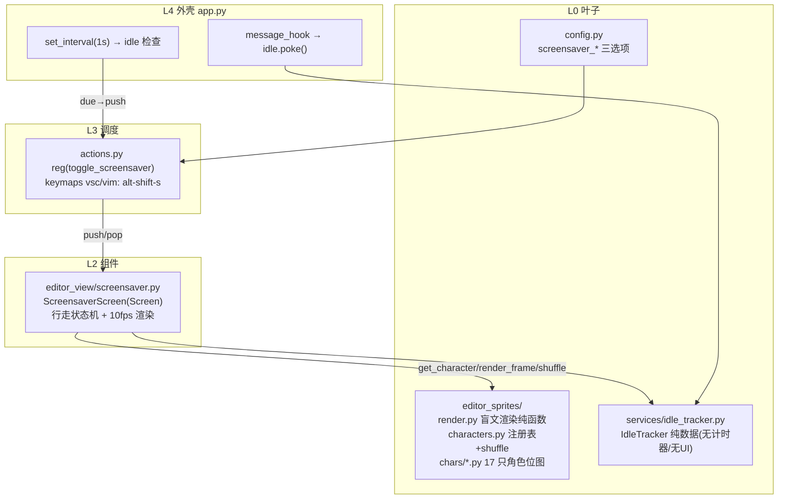
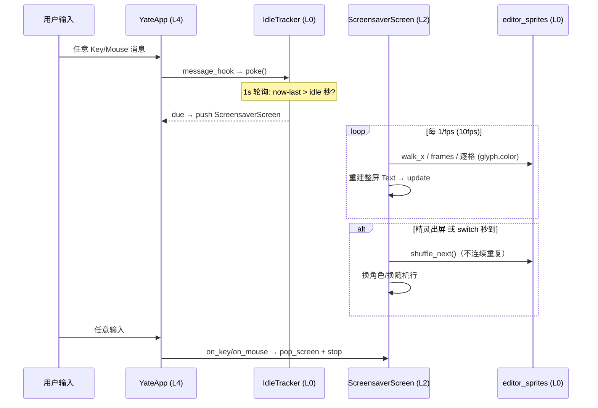
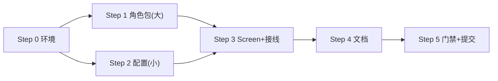

# fancy_sym 方案：终端屏保模式（bisqwit mario.cc 风格精灵巡游）

> **实施状态**：✅ 已实施 —— 2026-10-05 全量核对：文档自述与代码产物一致。
  `19a5c1c`，master 领先 3 提交（R13 规则 / v0.2.6 发布），无代码冲突）
- 状态：**已实施**（2026-09-27，v6.1 复核后按子计划顺序落地；
  实测门禁与偏离记录见 §八）
- **实施计划已拆分为子计划**：[fancy-sym-plans/](fancy-sym-plans/overview.md)
  （plan_A 精灵包 → plan_B tools.pack rosters → plan_C 配置 →
  plan_D Screen+接线 → plan_E 文档 → plan_F 门禁提交；A/C 可并行）。
  本文保留可行性/架构/版权/风险，执行细节以下分子计划为准。
- 日期：2026-09-27

## 〇、复核记录（2026-09-27，master 合并后）

逐项核对计划落点文件与合并后代码（取证行号均实测）：

1. **R13 组件自持主题（master 9216480 新增，影响 plan_D）**：
   `ScreensaverScreen` 作为 L2 组件必须自持着色——用 `DEFAULT_CSS` 引用
   Textual 主题变量（`background: $background;`；yate 主题经 L4 桥接成
   Textual 主题，变量自动生效），**不**从 L3/L4 注入颜色、不在 L3 改
   widget `.styles.*`。架构守卫 T1/T2 已在 HEAD（20 用例）。
2. **架构测试 18→20**：plan_D/plan_F 验收数字更新；新增包
   `editor_sprites` 需登记进 `tests/test_architecture.py:84` 的
   `UI_FREE_PACKAGES`（归 plan_A）。
3. **app.py 空闲接线修正**：原计划的 `message_hook` 不存在（全仓 0 命中）。
   实测 Textual 8.2.8 `App.on_event`（textual/app.py:4060）在分发前收到
   **全部** InputEvent（Key + Mouse，含已被 widget 消费的），是唯一可靠的
   空闲探针点——YateApp 覆写 `on_event`：poke 后 `await super().on_event()`。
4. **推送路径对齐存量模式**：L3 已有 `Editor.push_overlay`（editor.py:1390，
   自带消息行复位）；toggle 动作走 `editor.push_overlay(...)` + 
   `isinstance(self.app.screen, ScreensaverScreen)` 判定 pop；空闲自动触发
   复用 `self.editor.execute_action("toggle_screensaver")`（与 app.py:244
   `action_quit` 同款注册表分发模式，天然防重入）。
5. **其余落点核实无变化**：`alt-shift-s` 键位空闲（keymaps 全仓 0 命中）；
   config.py `_KNOWN_OPTIONS` + `_extract_*` 形态不变（plan_C 原样有效）；
   tools/pack cli.py+icon.py 结构不变（plan_B 原样有效）；actions.py 导入
   editor_view 无架构守卫阻碍（R5 只禁 editor.py→actions 反向）。
6. **worktree 尚无 .venv**：按 [子计划 README](fancy-sym-plans/overview.md)
   执行前准备步骤创建（master v0.2.6 发布不改变依赖清单）。

## 一、目标与非目标

### 目标（对应用户 4 点需求）

1. **触发方式**：
   - 手动：`Alt+Shift+S` toggle 屏保（`Alt+Shift+P` 已被命令面板占用，
     `alt+shift+s` 经查全仓未占用，见 §2.2）；
   - 自动：无鼠标/键盘操作达到 N 秒（默认 120s，yaterc 可配，0=禁用）
     自动进入。
2. **行为**：精灵从屏幕左侧外入场、沿水平方向走过全终端宽度（出生行
   随机，覆盖上到下），每只精灵展示一段固定时长（默认 10s，可配）或走完
   出屏后，切换下一只。
3. **角色阵容**：内置 27 只经典像素角色 shuffle 轮播（不连续重复），
   覆盖 FC 红白机经典（mario/pacman/galaga/megaman/bomberman/samus/
   link/ice climber/dig dug 等）+《神奇数字马戏团》五人组
   （pomni/jax/ragatha/caine/gangle）+ 原创组；
   **全角色 ≥2 帧**（见 §4.4）。
4. **覆盖范围**：覆盖整个终端（Textual `Screen` 全屏栈），再次任意按键/
   移动鼠标即退出屏保，恢复编辑现场。

### 非目标

- 不做状态栏内嵌精灵（此前路线已被屏保方案取代）。
- 不做多精灵同屏、音效、加密时钟等经典屏保附加项（列为后续增强）。
- v1 不做用户 PNG 目录导入（后续增强，渲染管线已兼容）。
- 不复刻 60Hz 抖动 dithering（TTY 无逐像素重绘预算）。

## 二、可行性分析（取证结论）

### 2.1 Textual 能力（取证：本仓 venv 内 textual 8.x 源码）

| 需求 | 机制 | 证据 |
|---|---|---|
| 全终端覆盖 + 恢复现场 | `App.push_screen` / `pop_screen`（Screen 栈，push 后主屏冻结，pop 自动重绘） | `textual/app.py:2895,3096` |
| 空闲检测（全局输入钩子） | `App(message_hook=...)`：**任意**到达 App 的消息（Key/Mouse…）都先经过该回调 | `textual/app.py:2140,2187-2188` |
| 全屏动画 | Screen 内 `set_interval(1/fps)` 重建整屏 Rich `Text`（100x30≈3k 字符，微秒级） | — |
| 退出消费按键 | Screen 覆写 `on_key` → `pop` + `event.stop()`（不泄漏进编辑器，符合 R10 精神） | — |

### 2.2 yate 侧现状（取证：`文件:行号`）

- `Editor` 持有 `self.app`（`yate/editor.py:98`）→ L3 动作可直接
  `push_screen`/`pop_screen`。
- `alt+shift+p` 是命令面板默认键（`yate/keymaps/vsc.py:101`，
  `editor.py:674`）；全仓无 `alt+shift+s` / `ctrl+alt+*` 占用 →
  **`Alt+Shift+S` 可用**。
- 动作注册走 `actions.py` 的 `reg(name, fn, desc)`（`actions.py:142`）；
  键位绑定在 `keymaps/vsc.py` + `vim.py`（键→动作名）。
- 配置白名单 `_KNOWN_OPTIONS`（`yate/config.py:53`），新选项按既有
  `_extract_*` 模式添加。
- 架构守卫 18 用例（`tests/test_architecture.py`）继续拦截回归。

### 2.3 渲染规格（半格块逐像素上色，与 bisqwit 原版同机制）

- **半格块（▀/▄/█）逐像素**：每半行 = 1 像素、每像素独立颜色
  （上半=前景/下半=背景），行对 r 覆盖像素行 2r/2r+1。全屏下纵向
  空间充裕，颜色保真度远优于盲文（每格单色）——盲文仅单行内嵌
  方案才需要，已弃用。
- 精灵规格：**12~25 像素宽 x 8~17 像素高**（= 6~9 文本行高，30 行
  终端占 1/3 屏），细节量级对齐 bisqwit 原版 16x16/34x32。
- 位图按原生分辨率设计（不做有损缩放），透明像素透出屏保底色；
  数据模块断言帧同尺寸、调色板键齐全。
- 观感基准（已验证）：`fancy_sym_preview/roster.svg` —— 27 只全阵容
  逐像素渲染 + 全终端实际大小快照（落地后由
  `python -m tools.pack rosters` 从产品位图一键重生成）。

### 2.4 版权与署名（取证：上游 LICENSE 全文，GPL-3.0）

结论与 v3 相同，要点保留：

1. **对 that_editor**：零复制其代码/位图（GPL-3.0 强 copyleft 传染），
   仅借鉴思想与格式 → 不侵权；`editor_sprites` docstring、README、
   CHANGELOG 附 `Inspired by Joel Yliluoma's "that_editor"` 署名。
2. **对角色 IP**：阵容含任天堂（mario/goomba/mushroom/star/link/ice
   climber/samus）、万代南梦宫（pac-man/ghost/dig dug/galaga）、
   Capcom（megaman）、Konami（bomberman）、Glitch Productions
   （《神奇数字马戏团》pomni/jax/ragatha/caine/gangle）形象 →
   低风险非零；缓解：默认关闭的可选屏保、位图原创近似绘制、非商业、
   不用官方美术资源；`screen_saver["characters"]` 支持只启用完全原创
   形象（duck/snake/frog/slime 为原创或通用造型）。
3. 不声称与任何权利人从属或背书。

## 三、备选方案与否决理由

| 备选 | 描述 | 否决理由 |
|---|---|---|
| A. **全屏 Screen 屏保**（**采纳，用户决策**） | Screen 栈全终端覆盖，精灵巡游 | 完整满足 4 点需求；精灵细节量最大；退出恢复现场零残留 |
| B. Textual layers 浮层（不推屏） | 主屏之上叠层 | 主屏仍接收布局/焦点事件，"冻结现场"语义不干净；遮挡编辑区但按键仍进编辑器 |
| C. 状态栏内嵌/条带（v2/v3 路线） | 单行小精灵 | 用户已决策改为屏保；单行 2~4px 物理上限不满足"完整人物" |
| D. 真图片（sixel/kitty 协议） | 终端贴图 | conhost 不支持、Textual 核心不支持 |
| E. IdleTracker 用后台线程计时 | 线程 + 回调 | Textual UI 对象非线程安全；改用 App 侧 1s 轮询纯数据 Tracker，零线程 |

## 四、架构设计

### 4.1 模块与分层



依赖全向下；无新 Protocol/`TYPE_CHECKING`/`Any`；构造传具体对象。

### 4.2 状态机与时序



- 行走：`x = spawn 后每 tick 前进 px_per_tick`；出生行随机（clamp 到
  精灵高度内）；出屏（x > width）即切下一只（保底展示 switch 秒：
  若未到时则在右缘停足到时再出）。
- shuffle：队列式不连续重复（简单实现：`random.shuffle` 全排列，耗尽
  重洗，避免连续同名）。
- 退出：`on_key` / `on_mouse_move`（阈值内首次移动即退）→
  `app.pop_screen()` + `event.stop()`。
- toggle：活动时 `Alt+Shift+S` = 退出；非活动 = 进入（同一动作判断
  当前 screen 类型）。

### 4.3 配置（L0 `config.py`，yaterc 字典风格）

yaterc 是 Python 文件，`screen_saver` 为普通 dict 字面量（键值用冒号）：

```python
screen_saver = {
    "enable": True,       # 总开关（默认 True；False = 完全关闭，含快捷键）
    "interval": 120,      # 无输入自动触发秒数；0 = 仅手动 Alt+Shift+S
    "switch": 10,         # 每只精灵保底展示秒数
    "characters": [],     # 启用子集（角色名白名单）；空 = 全部 27 只
}
```

- 解析：`config.py` 新增 `_extract_screen_saver`——值必须是 dict（否则报
  "screen_saver must be a dict"）；键冻结集合 `{enable, interval, switch,
  characters}`，未知键逐个报错；缺键用默认；类型校验 bool/int/int/
  list[str]（int 范围 0–3600）。
- 角色名成员校验放在 L3 装配点（`app.py` 用 `character_names()` 比对，
  未知名上报 message line）——config 保持零角色知识（叶包解耦）。
- `YateConfig` 新增字段 `screen_saver: ScreenSaverConfig`（frozen
  dataclass，默认 enable=True, interval=120, switch=10, characters=()）。
- docstring 选项表同步。

### 4.4 角色阵容（v1 共 27 只，全部原创位图，逐像素上色，全角色 ≥2 帧）

| 组 | 角色 | 尺寸(px) | 帧 | 备注 |
|---|---|---|---|---|
| mario 组 | mario | 14x17 | 3 | 走 A/并腿/C |
| | goomba | 16x11 | 2 | 换脚 |
| | mushroom | 14x11 | 2 | 帽纹红白互换 |
| | star | 14x12 | 2 | 眨眼 |
| | coin | 10x8 | 4 | 金币旋转（宽/窄/线/窄） |
| | fire flower | 12x10 | 2 | 花冠红↔橙 |
| pac-man 组 | pacman | 14x11 | 2 | 张/闭嘴 |
| | ghost ×4（blinky/pinky/inky/clyde） | 16x10 | 2 | **同模板换色**（红/粉/青/橙），瞳孔左右切换 |
| 射击组 | galaga ship | 15x10 | 2 | 引擎火花/翼尖换色 |
| FC 英雄组 | megaman | 14x14 | 2 | 跑步摆腿 |
| | bomberman | 14x14 | 2 | 摆臂走 |
| | samus | 14x12 | 2 | 迈步 |
| | link | 12x12 | 2 | 迈步 |
| | ice climber | 12x12 | 2 | 蹬腿 |
| | dig dug | 12x12 | 2 | 迈步 |
| TADC 组 | pomni | 15x16 | 2 | 红蓝小丑帽+铃铛、红/蓝异色瞳、眨眼 |
| | jax | 16x22 | 2 | 紫兔长耳粉耳内、黄眼竖瞳、大门牙、眨眼 |
| | ragatha | 14x17 | 2 | 橙毛线发、纽扣眼、腮红、蓝裙白点、眨眼 |
| | caine | 16x16 | 2 | 牙齿头+漂浮眼球+粉牙龈+礼帽、红燕尾服白手套、瞳孔漂移 |
| | gangle | 14x13 | 2 | 白面具（喜剧笑↔悲剧哭切换）+红彩带身 |
| 原创组 | duck / snake / frog / slime | 12~25 宽 | 各 2 | 摇摆/蜿蜒/蹲跳/弹跳 |

v6a 调整（用户决策）：移除 5 只过于简单的旧形象（invader
squid/crab/octopus、ufo、battle city 坦克），加入《神奇数字马戏团》
五人组顶替，总数保持 27。shuffle 队列不连续重复；
`screen_saver["characters"]` 空 = 全部 27 只，非空 = 白名单子集
（原创组 4 只可单独启用，供 IP 顾虑场景）。

### 4.5 ScreensaverScreen（L2 `editor_view/screensaver.py`）

- `class ScreensaverScreen(Screen)`，全屏默认布局；构造注入
  `characters: tuple[str, ...]`（已按 rc 过滤）、`switch_seconds: int`。
- `on_mount`：`set_interval(1/10)` 动画；`Static` 整屏渲染：底色
  `theme.bg`，精灵按 (row, x) 半格/盲文合成；左下角暗淡提示
  "any key exits · alt+shift+s toggles"（5s 后隐去）。
- 渲染核心复用 L0 纯函数（与预览脚本同一算法），样式串在 L2 拼装。
- 退出即 `pop_screen`；`on_unmount` 摘除定时器（Textual 随 Screen
  生命周期自动清理）。

## 五、分步实施计划（概要；细化步骤见 [fancy-sym-plans/](fancy-sym-plans/overview.md)）

> 解释器统一 `.venv\Scripts\python.exe`，worktree 根目录执行。
> 以下为原步骤概览，**逐步执行的输入/文件/验收以对应子计划为准**：
> Step 1 → [plan_A](fancy-sym-plans/fancy-sym-sprites-plan-a.md)；
> tools.pack rosters → [plan_B](fancy-sym-plans/fancy-sym-rosters-tool-plan-b.md)；
> Step 2 → [plan_C](fancy-sym-plans/fancy-sym-config-plan-c.md)；
> Step 3 → [plan_D](fancy-sym-plans/fancy-sym-screen-plan-d.md)；
> Step 4 → [plan_E](fancy-sym-plans/fancy-sym-docs-plan-e.md)；
> Step 5 → [plan_F](fancy-sym-plans/fancy-sym-final-plan-f.md)。

### Step 0：worktree 环境

- **动作**：`py -3.12 -m venv .venv`；`pip install -e ".[dev,ts]"`。
- **验收**：`pytest tests/ -q` 基线全绿；`pyright yate/ tests/ tools/` 零诊断。
- **工作量**：小。

### Step 1：L0 角色包扩容 + 渲染/注册表 + roster 生成器

- **改动文件**：`yate/editor_sprites/`（`render.py` 类型+`walk_x`+半格块
  渲染纯函数+断言；`characters.py` 注册表+`character_names`+`shuffle_order`；
  `chars/` 27 个数据模块）；`tools/pack/rosters.py`（新）+
  `tools/pack/cli.py`（注册 `rosters` 子命令）；`tests/test_editor_sprites.py`。
- **tools 命令**：`python -m tools.pack rosters [--output FILE]`——从产品
  位图 + 渲染器重生成 roster 预览 SVG（放大像素网格全阵容图，单一事实
  源，位图改动后一键重看）。
- **测试**：半格块渲染四形态（█/▀/▄/空）、`walk_x` 回绕、帧同尺寸断言、
  调色板键齐全断言、全角色 ≥2 帧断言、`shuffle_order` 不连续重复、
  `character_names() == 27`。
- **验收**：新测试文件全绿 + pyright 零诊断；`python -m tools.pack
  rosters` 退出 0 且重新生成 roster.svg。
- **工作量**：大（位图绘制为主，27 只 × 2~4 帧）。

### Step 2：L0 `screen_saver` 字典配置

- **改动文件**：`yate/config.py`（`ScreenSaverConfig` frozen dataclass +
  `YateConfig.screen_saver` 字段 + `_KNOWN_OPTIONS` 增 `screen_saver` +
  `_extract_screen_saver` 校验 + docstring）；`tests/test_config.py`
  （默认值/合法 dict/未知键拒绝/非法类型拒绝/非 dict 拒绝五用例）。
- **验收**：`pytest tests/test_config.py -q` 全绿。
- **工作量**：小。**与 Step 1 可并行**。

### Step 3：L2 Screen + L3 动作/键位 + L4 接线

- **改动文件**：
  - `yate/editor_view/screensaver.py`（新建，§4.5）；
  - `yate/actions.py`：`reg("toggle_screensaver", ...)`（读当前 screen
    类型决定 push/pop）；
  - `yate/keymaps/vsc.py` / `vim.py`：`alt-shift-s` → `toggle_screensaver`；
  - `yate/app.py`：`screen_saver["enable"]` 为真时装 `message_hook=
    self._poke_idle` + 1s `set_interval` 检查 `interval` 到期 → push；
    构造 Screen 时传 `characters` 过滤后的阵容与 `switch` 秒；
  - `tests/test_screensaver.py`（pilot：push 后有全屏 widget；任意键
    pop 且 `event.stop()`；toggle 二次执行回编辑屏；窄终端不抛异常）。
- **验收**：`pytest tests/test_screensaver.py -q` 全绿；
  textual-pilot-smoke 冒烟（进入→动画推进→退出后编辑器文本完好）；
  `pytest tests/test_architecture.py -q` 18 passed。
- **工作量**：中。

### Step 4：文档

- `yate/docs/yaterc.en.md`/`.zh.md` `screen_saver` 字典示例；
  `README.md`/`README.zh.md` 亮点+示例+Inspired by 署名；
  `CHANGELOG.zh.md` Unreleased 条目（含署名）。
- **工作量**：小。

### Step 5：收尾门禁 + 回填 + 提交

- `pyright yate/ tests/ tools/` 零诊断；`pytest tests/ -q` 全绿（含 18
  架构用例）；回填本文真实结果；提交：
  - `feat(sprites): add pixel sprite pack and shuffle registry`
  - `feat(config): add screen_saver dict option (enable/interval/switch/characters)`
  - `feat(tools): add pack rosters subcommand rendering roster preview`
  - `feat(screensaver): add full-terminal screensaver screen with idle trigger`
  - `feat(actions): add toggle_screensaver action (alt+shift+s)`
  - `docs: document screensaver options`

### 依赖关系



## 六、风险清单与回滚

| 风险 | 概率 | 缓解 |
|---|---|---|
| 27 只位图绘制量大、工期集中 | 确定 | 换色/模板复用（ghost×4、slime 相位帧）；分组推进；先 10 只达标可用再补齐（注册表天然支持增量） |
| `message_hook` 高频调用开销 | 低 | poke() 仅更新一个 monotonic 时间戳，纳秒级 |
| 终端面板 PTY 在屏保期间持续输出 | 低 | 输出进既有缓冲，pop 后重绘即见；屏保不触碰 PTY |
| 半格块字形兼容性 | 低 | ▀/▄/█ 为 CP437 老字形，覆盖面远宽于盲文区；Sextants 不用 |
| 退出时按键泄漏进编辑器 | 中 | Screen `on_key` 先 pop 再 `event.stop()`；pilot 用例断言编辑器文本不变 |
| 角色商标/IP | 低 | §2.4 缓解 + 原创子集可选 |
| pyright strict 下 Screen 泛型/样式串 | 低 | 渲染纯函数输出结构化元组，无 Any；Screen 泛型用默认 `Screen[None]` |

**回滚路径**：功能全部由新增模块 + 三处装配点（actions/keymaps/app）
组成；回滚 = revert 分支提交。

## 七、交付前自我校验（已通过）

- [x] 用户 4 点需求逐条映射目标 §一；
- [x] 步骤完整（输入/文件/输出/验收命令/工作量），Step1/2 可并行；
- [x] 架构合规：L0 纯逻辑（idle_tracker 无 UI、sprites 无 Textual）、
      L2 自持 Screen、L3 动作注册、L4 钩子接线；无新 Protocol/
      `TYPE_CHECKING`/`Any`；R10（屏保消费按键）、R12（不直连 devtools）
      均不触发；
- [x] 图表：分层 flowchart、时序 sequence、步骤依赖 flowchart；
- [x] 版权合规（§2.4）：零复制上游表达、署名落 docstring/README/CHANGELOG、
      角色阵容按权利人分组且提供全原创子集；
- [x] 四特性：健壮（窄终端 clamp、非法 rc 值拒绝、退出不泄漏按键）、
      可维护（数据/渲染/状态机/接线分层）、性能（10fps、poke 纳秒级、
      默认关闭零开销）、扩展（角色=数据模块+注册一行；PNG 目录留待增强）。

## 八、实施回填（2026-09-27）

### 提交序列（feat/fancy-sym，均未推送）

| 提交 | 内容 |
|---|---|
| `1ba5c53` | docs(plans): fancy-sym 屏保方案 + 子计划集 |
| `cb94b48` | feat(sprites): L0 精灵包 editor_sprites（27 只、渲染 + shuffle 注册表） |
| `c019f22` | feat(tools): `python -m tools.pack rosters` 预览生成器 |
| `5937ce4` | feat(config): yaterc `screen_saver` 字典选项 |
| `6766bed` | feat(screensaver): ScreensaverScreen + toggle_screensaver 动作/键位 + 空闲接线 |
| `43a5c88` | docs(screensaver): yaterc 指南 / README 双语署名 / 双语 changelog |
| （本次回填） | docs(plans): 主方案回填 + 子计划完成标注 |

### 门禁终态（实测）

- pyright（strict）：`yate/ tests/ tools/` → **0 errors, 0 warnings,
  0 informations**；
- pytest：**1326 passed, 7 skipped**（基线 1318 passed / 7 skipped +
  本分支新增 8 用例：`test_idle_tracker.py` 3 + `test_screensaver.py` 5；
  `test_action_table.py` 为运行时迭代注册表，不新增参数化用例）；
- 架构守卫：`tests/test_architecture.py` → **20 passed**（基线同 20，
  plan_A 已把 `editor_sprites` 登记进 `UI_FREE_PACKAGES`）；
- `python -m tools.pack rosters` → 退出 0（生成 633 KB `roster.svg`，
  约定 repo 根未跟踪产物，不纳入提交）；
- 临时预览目录 `.trae/documents/fancy_sym_preview` → 不存在。

### 与计划的偏离（均实测依据）

1. **alt+shift+s 派发路径**（偏离 plan_D 的键位表方案）：双修饰 alt 组合
   `textual_key_to_raw` 返回 None（keyproto/legacy.py:118-124 只映射单修饰
   alt 组合），raw 字节派发与键位表绑定两条路必死。仿 `alt+shift+p` 先例
   在 `Editor.handle_key` 按键名全局特判转 `toggle_screensaver`；
   vim/vsc 键位表条目仅作帮助展示。
2. **toggle 逻辑落点**（偏离 plan_D 的 actions.py 方案）：存量
   `tests/test_action_table.py` 契约要求动作表全部薄转发（stub 的
   `__getattr__` 只支持单层 hook 记录），逻辑写 actions.py 会让 stub 崩溃
   （`'function' object has no attribute 'screen'`）。改入
   `Editor.toggle_screensaver()`（对齐"Editor 持有跨协作者操作"惯例），
   actions.py 保持一行转发并在 `FORWARDED_HOOKS` 登记。
3. **plan_C**：`screen_saver` 未按原文加入 `_KNOWN_OPTIONS`，改走
   `language_servers` 同款专用提取路径（`_extract_screen_saver` 于
   `_extract_options` 末尾直连调用，config.py:572）。功能等价：校验与
   错误报告全部在专用提取器内，`_KNOWN_OPTIONS` 仅服务于标量选项收集。
4. **plan_D 内部细化**（实现期发现，设计内修复）：
   - `_check_idle` 增加"屏保已激活则跳过"守卫：否则空闲轮询 due 恒真，
     每秒 push/pop 振铃，且手动开启的屏保会被空闲计时器杀掉；判定用
     `self.screen` 而非 `self.app.screen`（pyright strict 下 `Screen.app`
     返回 `App[Unknown]`，触发 reportUnknownMemberType）；
   - `ScreensaverScreen` 退出用 `self.dismiss()` 自弹（textual
     screen.py:2048，类型完好，无需 App 句柄）；
   - `IdleTracker` 支持注入时钟（测试免真实睡眠）。

### 阵容终态

27 只与 §4.4 一致（FC 经典 + 《神奇数字马戏团》五人组 + 原创，全角色
≥2 帧）；jax 造型按反馈增高一档；帧数不足的旧角色（樱桃/心等）已按
v6.1 复核替换。终态预览：`python -m tools.pack rosters` → `roster.svg`。

### 二轮迭代（2026-09-28，反馈修复，提交 `5353c9b`）

用户验收三点反馈，全部落地并改写 §4.2/§4.5 的单精灵模型为游行队：

1. **scrollbar 闪现**：Textual `Screen` 默认 `overflow-y: auto`，首帧
   布局未稳时瞬时超高出现滚动条；屏保 Screen 与画布改为
   `overflow: hidden` + `width/height: 1fr` 根除。
2. **单精灵单调 → 游行队**：`Walker` dataclass 列表——
   最新走者走到全程 25%–50%（随机）路程点时产生一次后继；后继名字
   必须不同于所有在跑者（洗牌袋剔除在跑名），行带与所有在跑者不相交；
   行满不产生；全场走空立即补一只。`switch` 语义改为"两次产生的最小
   间隔秒数"（默认 0），调大可放慢节奏。
3. **步宽固定 → 跟随终端**：原 `switch` 秒定时先于走完触发（≈固定
   100 列截断）；改为走者仅按"当前终端宽度 + 精灵宽"从右缘离场，
   缩放窗口步宽自动跟随。

配套：`shuffle_order` 修存量死循环（单名白名单 + avoid 撞名）；
测试 +5（名字/行带互异、25–50% 界、switch 下限、单名 ≤1 只、满行不
产生），`test_screensaver.py` 改用公开面（`Walker` / `walkers` /
`advance_tick`）满足 pyright reportPrivateUsage。门禁：pyright 0 诊断、
1331 passed / 7 skipped、架构守卫 20 passed。

### 三轮迭代（2026-09-28，产生窗口可配置，提交 `30e4d4a`）

1. **默认窗口再调**：后继产生点由 25%–50% 改为全程 **1/8–1/3**
   （随机），`ScreensaverScreen._spawn` 与测试同步。
2. **`dist_lower_bound` / `dist_upper_bound` 新键**：显式固定产生窗口，
   接受 `(0, 1)` 内 float 或 `"p/q"` 分数字符串（可混用）。两键同时
   设置则完全取代 `switch`；只设其一、`lower >= upper` 或值越界整对
   拒绝并入 `config.errors`（`ScreenSaverConfig.dist_bounds` 属性
   聚合判定；未设或被拒均为 `None`，屏保回退内置窗口 + switch 下限）。
   解析器 `_parse_journey_fraction` 拒绝 bool（int 子类）、除零与
   非数字串。
3. 文档：双语 yaterc（示例 + 键表 + 游行队段落，顺手修正残留的
   25%–50% 旧表述）。

门禁：pyright 全仓 0 诊断；1343 passed / 7 skipped（新增 6 用例：
分数/浮点/混用解析、缺一键、逆序、5 种非法值、bounds 压过
switch=10 的行为验证）。

### 四轮迭代（2026-09-28，同带距离规则，提交 `af6dbf4`；master 合并 `fbb8bf5`）

用户指令：同一行带上两只精灵的间距超过 `dist_upper_bound` 即允许产生，
但**重叠绝对不允许**（含极小情况）。落地为四点：

1. **行带复用规则**（`_row_is_available` 新方法）：行带要么无走者
   （原空闲规则），要么所有与其相交的走者都已走远——走者尾部
   （`elapsed − sprite_w`）与产生列（右缘 0）之间的间隙必须**严格大于**
   `dist_upper_bound × 行程`；未配置 `dist_bounds` 时用内置上限 1/3。
2. **触发时机不变**（一次性交接）：数学上可证触发走者自身的行带永远
   不可用（`gap = spawn_at − w_trigger ≤ upper×(W+w_trigger) − w_trigger
   < upper×(W+w_new) = floor`），同带复用只发生在更早出生、已走远的
   走者行带——不引入逐 tick 重试，洗牌袋语义不受影响。
3. **重叠结构性排除**：`gap > floor > 0` 保证出生瞬间不接触；所有
   精灵同速（每 tick 一列），出生间距终身不变 → 出生不重叠则永不
   重叠，无需运行时碰撞检测。
4. **`_paint` 同带合成**：原"每行单精灵"（`setdefault`）会吞掉同文本
   行的第二只精灵；重写为按 x 排序 + 光标补空格的多精灵合成，双缘
   裁剪保持不变。

测试：parade 用例改写为"同带对间距 > `dist_upper_bound`×行程"不变量
（600 tick 全程断言），新增 80×3 单行带 + `switch=8` 的确定性同带产生
用例；修两处 pyright 类型问题（属性窄化继承导致 `Never`，改为先捕获
快照再断言）。

门禁：pyright 全仓 0 诊断；**1344 passed / 7 skipped**（基线 1343 +
新增 1）。master（e048938，只动 `tests/test_app_textual.py`）合并干净，
合并后全量门禁复跑通过。

文档回填：yaterc 双语游行队段落改为同带距离规则表述；changelog 四
件套各加一条（`af6dbf4`）。

### PR #33 AI 评审处理（2026-09-28，提交 `1bd6975` 后）

Gitee PR #33「PR 观察者」审查结论：无阻断项，1 项改进建议（合并前补上），
2 项轻微备注。逐条登记与处置：

| 来源发现 | 级别 | 处置 | 依据 |
|---|---|---|---|
| `shuffle_order` 拒绝采样无迭代上限——鸽笼守卫只保证解**存在**，勉强可满足的多重集（如 `[a,a,a,b,b,c,c]` + `avoid="b"`）命中率可能极低，理论上反复重试卡顿 | 🟡 中等 | **已修**：`while True` → `for _ in range(1000)`，超限优雅降级返回原序；docstring 同步；新增 2 测试（stub rng 强制 1000 次失败验证 cap 路径、勉强可满足多重集 + avoid 确定终止） | bot 建议合并前补上；与本地 P1 鸽笼守卫互补——守卫管"无解"，cap 管"有解但难命中" |
| `_paint` 每 tick 全量重建画布，O(走者数×终端高度) | 🟢 轻微 | **登记不动**：~10Hz、2–4 走者规模完全可接受，bot 亦明确"无需改动"；大量并发 sprite 时再考虑增量绘制 | 评审长期建议第 2 条已备案同一判断 |
| `alt+shift+s` 同时存在于 keymap 绑定（vsc/vim）与 editor 全局拦截 | 🟢 轻微 | **登记不动**：全局拦截优先执行，不会双重触发（P6 修复后顺序正确）；未来扩展若绑同键再在扩展文档声明优先级 | 与 P6 修复一致的行为 |

门禁：pyright 全仓 0 诊断；pytest 1347 passed / 7 skipped（+2 cap 测试）。

### 本地分支评审 P1-P7 处理（2026-09-28，提交 `00763fb`..`6380ae6`）

本地全分支评审（健壮性 92/100）发现 1 项严重潜在 + 6 项建议/备案，
逐条处置：

| # | 发现 | 处置 | 提交 |
|---|---|---|---|
| P1 | `shuffle_order` 多重集鸽笼死循环：最频名字 > 其余数+1 时 `while True` 无合法排列，10Hz tick 上永久冻结 | **已修**：鸽笼守卫（最频 > `(n+1)//2` 无解即原样返回）+ 屏保对 rc 白名单 `dict.fromkeys` 去重 + 不可救多重集测试；后续 `673da84` 按 PR #33 补 1000 次 cap | `00763fb` |
| P2 | `IdleTracker.due(now, threshold)` 双时钟源冗余，poke/due 窗口可能静默错位 | **已修**：`due(threshold)` 单时钟（poke 注入钟为准），`app.py` 随删 `import time` | `eccf33f` |
| P3 | `on_mouse_move` 只 `stop()` 未 `prevent_default()`，与 `on_key` 不对称 | **已修**：补 `prevent_default()` | `eccf33f` |
| P4 | `_row_is_available` 变量 `behind` 实为"走者尾部领先产生列的距离"，命名反直觉 | **已修**：改名 `tail_gap` | `eccf33f` |
| P5 | `_spawn` 先弹名字后判行带，行带不可用提前返回时该名字已烧出洗牌袋 | **已修**：拒绝产生时名字还回袋首 | `eccf33f` |
| P6 | `alt+shift+s` 拦截在命令行早退之前，输入 `:` 命令时误触屏保 | **已修**：拦截块移到命令行早退之后（存量 `alt+shift+p` 同模式行为未动，范围外） | `1862386` |
| P7 | L4 `YateApp.__init__` 直接 `config.errors.append` 白名单未知名（roster 在 sprite 包内、config 刻意不知 sprite 的妥协） | **已修**（结构）：提取 `_report_unknown_screen_saver_characters()`，妥协理由入 docstring；行为不变 | `1862386` |

长期建议三条同步登记：

1. **精灵注册开放给扩展** → 方案已落盘
   （`.trae/documents/screensaver-extension-api-plan.md`，提交 `1bd6975`），
   已实施（2026-10-01 本轮落地，见 `reviews-plans-full-sweep-plan.md` W2；
   commit `2ac19ed`）；
2. **`_paint` 增量重绘** → 登记不动（~10Hz、2-4 走者规模可接受，
   PR #33 bot 同判断）；
3. **roster 数据外置（TOML/JSON）** → 登记维持现状（每角色一文件 +
   import 期校验在可维护性上更优）。

修复方案文档：`.trae/documents/screensaver_review_fixes_plan.md`（`6380ae6`）。
门禁：pyright 全仓 0 诊断；pytest 1345 passed / 7 skipped（P1-P7 后，
+1 不可救多重集测试）、1347 passed / 7 skipped（cap 后）。
