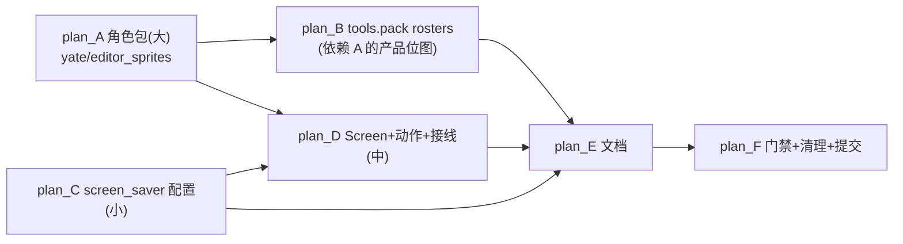
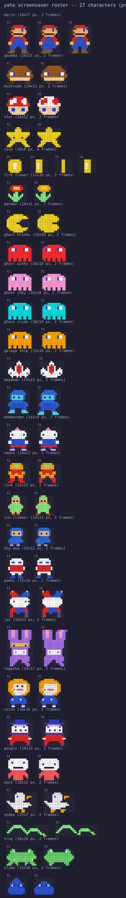

# fancy_sym 子计划总纲（v6）

> **实施状态**：✅ 已实施 —— 2026-10-05 全量核对：文档自述与代码产物一致。
  plan_B `c019f22` → plan_C `5937ce4` → plan_D `6766bed` →
  plan_E `43a5c88` → plan_F（回填提交）；实测门禁与偏离见
  [主方案 §八](../fancy-sym-plan.md)。

主方案（可行性/架构/版权/风险）：[../fancy-sym-plan.md](../fancy-sym-plan.md)。
本文件夹把其实施步骤拆为 6 份独立可执行的子计划，每份含输入、改动文件、
验收命令与工作量。

## 执行前准备（一次性）

```powershell
# worktree 根目录执行；解释器一律 .venv\Scripts\python.exe
.venv\Scripts\python.exe -m pip install -e ".[dev,ts]"
.venv\Scripts\python.exe -m pytest tests/ -q   # 基线全绿
.venv\Scripts\python.exe -m pyright yate/ tests/ tools/   # 零诊断
```

## 子计划清单与依赖



| 子计划 | 内容 | 主要交付物 | 工作量 | 依赖 |
|---|---|---|---|---|
| [plan_A](fancy-sym-sprites-plan-a.md) | L0 精灵包：半格块渲染纯函数、注册表+shuffle、27 只角色位图 | `yate/editor_sprites/*` + 测试 | 大 | 无 |
| [plan_B](fancy-sym-rosters-tool-plan-b.md) | `python -m tools.pack rosters` 预览生成器；临时预览目录退役 | `tools/pack/rosters.py` | 小 | A |
| [plan_C](fancy-sym-config-plan-c.md) | yaterc `screen_saver` 字典配置（enable/interval/switch/characters） | `yate/config.py` + 测试 | 小 | 无 |
| [plan_D](fancy-sym-screen-plan-d.md) | L2 ScreensaverScreen + L3 动作/键位 + L4 空闲接线 | `editor_view/screensaver.py` 等 + 测试 | 中 | A、C |
| [plan_E](fancy-sym-docs-plan-e.md) | yaterc 文档 / README / CHANGELOG（含 Inspired by 署名） | 文档四件套 | 小 | A–D |
| [plan_F](fancy-sym-final-plan-f.md) | 全量门禁 + 主方案回填 + 临时文件清理核验 + 提交 | 提交系列 | 小 | A–E |

A 与 C 可并行；B/C 完成后才进 D；顺序执行 E、F。

## 全局约定

- 架构边界以 `architecture-boundaries.md` 为准：L0 无 Textual、无新
  Protocol/`TYPE_CHECKING`/`Any`；日志走 tracing（R12）；**R13（master
  合并新增）组件自持主题**——新组件用 DEFAULT_CSS 主题变量自持着色，
  L3/L4 不碰 widget `.styles.*`；提交信息英文 conventional 风格。
- 基线（2026-09-27 master 合并后）：HEAD=`19a5c1c`，架构守卫 20 用例
  （含 T1/T2）；复核结论详见主方案 §0。
- 角色位图数据源：规划期设计稿 `.trae/documents/fancy_sym_preview/
  make_roster_preview.py`（27 只 ASCII 位图 + 调色板，plan_B 落地后该
  目录整体删除）。
- 每份子计划完成后跑各自验收命令；全部完成后再进 plan_F 统一门禁。

## 人物预览图


