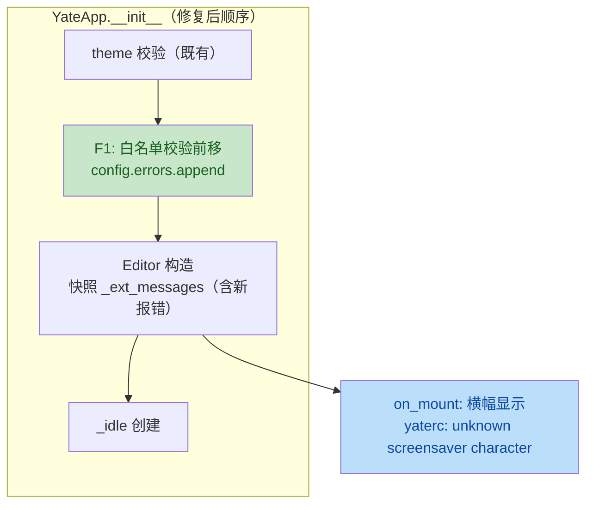

# fancy-sym 评审问题修复计划（review-fixes）

来源：feat/fancy-sym 分支代码评审（2026-09-28，worktree
`E:\Jermaine\yate-fancy-sym-review`）。三个问题均经双验证员交叉确认、
并核实为**本分支引入**（master 对照证据见评审报告）。

## 一、目标与非目标

**目标**

1. F1：未知 `screen_saver.characters` 角色名的报错进入启动警告横幅
   （恢复与未知 theme 一致的报错通道）。
2. F2：补齐 idle 自动触发链路的测试覆盖（on_event poke、_check_idle
   轮询自动开屏、防重复触发守卫、interval=0 / enable=False 跳过）。
3. F3：`toggle_screensaver` 区分"未配置白名单"与"白名单全无效"：
   后者报错提示并拒绝开屏，不再静默回退全量花名册。

**非目标**

- 不改动 `ScreensaverScreen` 游行机制、sprite 数据、渲染器；
- 不重构 `_ext_messages` 快照机制（存量语义维持原样）；
- 不处理评审排除项（`prevent_default`、渲染缓存等低价值噪声）。

## 二、备选方案与否决理由

### F1（报错时序）

| 方案 | 说明 | 结论 |
|---|---|---|
| A. 校验块前移 | 把 app.py:186-196 的白名单校验（连带 `_idle` 创建）移到 `self.editor = Editor(...)` 之前（theme 回退块之后），与未知 theme 的既有模式同位 | **采纳**：改动最小、错误自然进入快照 |
| B. Editor 挂载时重读 config.errors | 改 `Editor.on_mount` 为实时读取而非 init 快照 | 否决：触碰存量快照语义，影响面大，且 `_ext_messages` 还有后续 append 路径（editor.py:307/1521），语义纠缠 |
| C. app 直改 `editor._ext_messages` | L4 构造后向 Editor 私有列表 append | 否决：向下读写内部状态，违反分层精神 |

### F3（白名单回退语义）

| 方案 | 说明 | 结论 |
|---|---|---|
| A. 运行时区分两种空 | 配置了白名单但过滤后为空 → `message()` 报错不开屏；未配置（空元组）→ 全量花名册（现状语义） | **采纳**：语义精确、改动局部 |
| B. 保留回退 + 每次警告 | 静默回退但 message 提示 | 否决：每次开屏都刷警告，噪声大 |
| C. config 层校验时禁用屏保 | 在 `_extract_screen_saver` 里校验名单有效性 | 否决：config.py 刻意不依赖 sprite 包（现状设计，R4/文档已声明），不能引入反向知识 |

### F2（测试）

- 采纳：扩展 `tests/test_screensaver.py`（该功能测试的既有归宿），
  用 `IdleTracker(clock=lambda: 0.0)` 注入"永久到期"tracker +
  直接驱动公开方法 `app._check_idle()`，避免真实等待与 monkeypatch。

## 三、分步实施计划

### Step 1 — F1：校验块前移

- 输入：`yate/app.py` `YateApp.__init__`（当前 172-196 行）。
- 改动文件：`yate/app.py`。
- 具体改动：将

  ```python
  self._idle = IdleTracker() if self.config.screen_saver.enable else None
  known = set(character_names())
  for name in self.config.screen_saver.characters:
      if name not in known:
          self.config.errors.append(f"unknown screensaver character: {name!r}")
  ```

  整块（含注释）移到 theme 回退块（`self.theme = wanted_textual`，
  约 170 行）之后、`self.editor = Editor(...)`（172 行）之前；
  `register_commands` 之后的原位置删除。
- 输出：未知角色名报错先于 Editor 快照落盘，进入启动横幅。
- 验收：`python -m pytest tests/test_screensaver.py -q` 全绿；
  新增断言见 Step 3 用例 (f)。

### Step 2 — F3：白名单全无效守卫

- 输入：`yate/editor.py` `toggle_screensaver`（约 1454-1477 行）。
- 改动文件：`yate/editor.py`。
- 具体改动：

  ```python
  configured = self.config.screen_saver.characters
  known = set(character_names())
  if configured:
      wanted = tuple(name for name in configured if name in known)
      if not wanted:
          self.message("screensaver: no valid screen_saver.characters entry")
          return
  else:
      wanted = ()
  self.push_overlay(ScreensaverScreen(wanted or character_names(),
                                      self.config.screen_saver.switch))
  ```

  （docstring 同步更新：说明"全无效白名单拒绝开屏"。）
- 输出：全拼错的白名单不再静默回退全量；混合有效名单行为不变
  （无效名单已由 F1 在启动时报告）。
- 验收：Step 3 用例 (e)。

### Step 3 — F2：自动触发链路测试

- 输入：`tests/test_screensaver.py`（追加用例）。
- 改动文件：`tests/test_screensaver.py`。
- 新增用例：

  1. `test_idle_poll_auto_starts_screensaver`：默认 rc 开屏保，
     `app._idle = IdleTracker(clock=lambda: 0.0)`（永久到期），
     调 `app._check_idle()` → `isinstance(app.screen, ScreensaverScreen)`；
  2. `test_idle_poll_never_retriggers_while_active`：自动开屏后再调
     `app._check_idle()`，屏保仍在前且 screen 栈深度不变
     （docstring 明示的防 push/pop 一秒循环守卫）；
  3. `test_idle_poll_skips_when_interval_zero`：rc `interval = 0` +
     永久到期 tracker → 不开屏；
  4. `test_idle_poll_skips_when_disabled`：rc `enable = False` →
     `app._idle is None`，`_check_idle()` 不开屏；
  5. `test_on_event_pokes_idle_tracker`：以记录型子类替换
     `app._idle`，`pilot.press("x")` 后 poke 计数 ≥ 1；
  6. `test_all_invalid_whitelist_is_reported_and_refused`（对应 F3）：
     rc `characters = ["nope1", "nope2"]` → toggle 后
     `config.errors` 含两条 unknown 记录（F1 时序）且屏未推开。
- 输出：自动触发链路 5 条路径 + F3 守卫均有可回归断言。
- 验收：`python -m pytest tests/test_screensaver.py -q` 全绿。

### Step 4 — 文档核对

- 改动文件（仅当命中）：`yate/docs/yaterc.en.md`、
  `yate/docs/yaterc.zh.md`。
- 核对点：若文档描述了"无效名单回退/未配置即全量"的语义，
  补一句"全部无效将拒绝开屏并报错"；无命中则跳过本步。

### Step 5 — 全量门禁与收尾

- 验收命令（worktree 内执行）：

  ```text
  python -m pytest tests/ -q          # 全绿（含架构守护 20+ 用例）
  python -m tools.smoke_test run --fail-only   # 冒烟全过（exit 0）
  ```

- pyright 说明：worktree 受 venv editable 安装（`.pth` 指向主仓）
  影响无法权威复现，Step 5 以 pytest + 架构测试为准；合并前由
  作者在标准环境跑 `python -m pyright yate/ tests/ tools/` 确认。
- 提交：`fix(screensaver): surface unknown character errors and guard
  invalid whitelist`（或按拆分粒度 1-2 个 commit）。

## 四、风险清单与回滚

| 风险 | 缓解 |
|---|---|
| 校验块前移改变 `_idle` 创建时机（仍在任何事件循环启动前） | `_idle` 仅被 `on_event`/`_check_idle` 读取，二者均挂载后才可能触发 |
| F3 守卫误伤"合法空白名单" | 分支条件以 `configured` 是否为空区分，空元组保持全量语义；用例 (e)/(f) 双向覆盖 |
| 测试注入替换 `_idle` 与真实 set_interval 竞争 | 用例直接调 `_check_idle()` 同步驱动，不依赖真实 1s 定时器；pilot.pause 后断言 |
| 回滚路径 | 三个改动彼此独立、均为小 diff；`git revert` 单提交即可整体回退 |

## 五、交互示意（F1 修复后时序）


