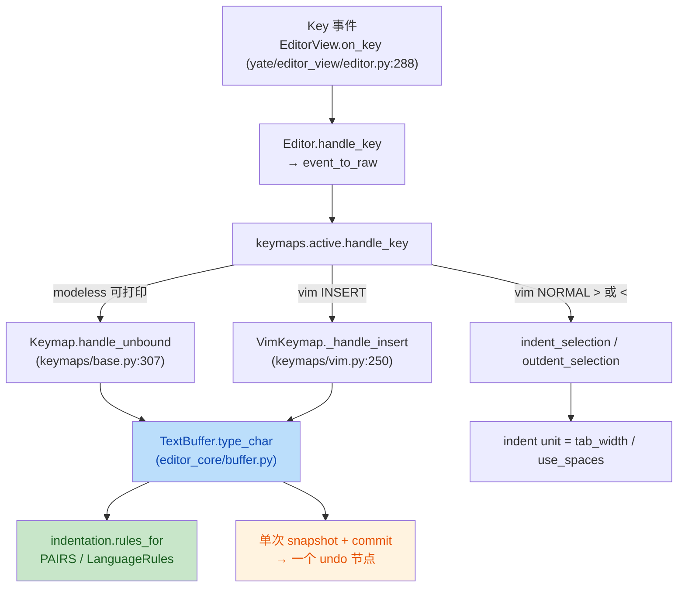

# input-assist 方案（issue IKJMQ2：输入辅助——成对符号自动补全 / 智能跳过 / 成对删除 / 选区包裹 / Python 自动缩进）

> **实施状态**：✅ 已实施 —— 2026-10-05 全量核对：原状态头「待用户批准（尚未写任何产品代码）」作废；`editor_core/indentation.py`、`tests/test_input_assist.py`、双语手册 §3.5 均已落地。
- **分支 / worktree**：`enh/input-assist` @ `../yate-input-assist`
- **状态**：待用户批准（尚未写任何产品代码）

## 一、目标与非目标

### 目标（issue 验收项逐条对应）

| # | issue 要求 | 落点 |
|---|---|---|
| G1 | `(`/`[`/`{`/`'`/`"` 自动补全右符号 | `TextBuffer.type_char` |
| G2 | 光标在右符号前继续输入对应右符号→只右移一格（不重复插入） | `TextBuffer.type_char` |
| G3 | 光标位于成对符号之间按 Backspace→同时删除两个 | `TextBuffer.delete_backward` |
| G4 | 有选区时输入左符号→包裹选区 | `TextBuffer.type_char` |
| G5 | Python：行尾 `:` 回车+1 级；空行保持；`return`/`break` 等不额外缩进 | `TextBuffer.insert_newline(language=…)` |
| G6 | VSC `Tab`/`Shift+Tab`、VIM `>`/`<` 增/减一级，多行统一，反缩进不低于 0 | `insert_tab` / `indent_selection` / `outdent_selection` + VIM 新绑定 |
| G7 | 粘贴不触发补全；只读禁用全部补全与缩进逻辑 | 改动只落在按键与 action 路径（见 §四） |
| G8 | 自动插入的左右符号 = 一个撤销节点 | 单次 `snapshot()`+`commit()` |
| G9 | 单次按键 < 5ms | 算法 O(1)，不新增 O(n) 扫描；专项基准测试 |
| G10 | 缩进单位可配 2/4/Tab | **已存在** `tab_width` + `use_spaces`（`yate/config.py:593-604`），本轮只补文档 |

### 非目标（明确不做）

- 不做词法状态屏蔽（issue 明确：字符串/注释内也生效）。
- 不做语法级回退缩进（`else:`/`elif:`/`except:`/`finally:`）——issue 允许 V1 暂不实现。
- 不新增 yaterc 选项（G10 已由 `tab_width` / `use_spaces` 覆盖），不动配置解析。
- 不做 JS/Go/C 的缩进规则（只留扩展点，见 §三 R3）。
- 不改 diffview / 只读手册视图的输入路径（其 buffer 只读，护栏天然拒绝）。

## 二、备选方案与否决理由

### R1 成对逻辑放在 L2 视图层（`editor_view/editor.py` 的 `on_key`）——**否决**

- 视图层拿不到"按键 → 动作"的统一入口：可打印字符在两处被消费
  （`keymaps/base.py:307-312` 的 `handle_unbound`、`keymaps/vim.py:278-280` 的 `_handle_insert`），
  在视图里做要么漏键要么重复实现。
- 违反 R11/R13 的分层职责（文本算法不属于渲染组件），且测试要起 Textual pilot，成本高。
- 结论：算法下沉 L0 `editor_core`，键层只做一行调用替换。

### R2 用 Textual 的 `Binding` / 自定义 widget 拦截字符——**否决**

- R10（一次按键只派发一次）与既有"按键归调度层"冲突；且 `EditorView` 已在
  `yate/editor_view/editor.py:288-297` 无条件 `stop()` + `prevent_default()`，再插一层会破防弹。

### R3 语言规则用 `if language == "python"` 散落在 `buffer.py`——**否决**

- issue 要求"预留扩展到 JS/Go/C"。散落 if 无法扩展，且 `buffer.py` 已 760 行。
- 采用独立叶子模块 `yate/editor_core/indentation.py`：符号对 + 语言规则表（dataclass），
  `buffer.py` 只查表。新增语言 = 加一条表项，不改 buffer。

### R4 自动补全时记录"自动插入的右符号"来源（跳过/删除只对自己插入的生效）——**本期否决**

- 需要在 buffer 上维护 provenance（按位置标记），与快照式撤销（`_Snapshot` 只存 lines/cursor/anchor）
  不兼容，改动面远大于收益。
- 取而代之：跳过/成对删除按**字符值**判定（当前光标后紧邻的字符就是要输入的右符号）。
  偏离说明：手打的 `)` 也会被跳过（VS Code 同款语义）。写入 §六 风险表。

### R5 自动缩进放在 keymap / action 层拼字符串——**否决**

- `insert_newline` 是 buffer 的既有 API（LSP、补全接受、vim 插入态都调它），把缩进计算留在
  buffer 才能对所有调用点一致生效；语言参数用**关键字参数带默认值**，不破坏既有调用点。

## 三、设计

### 3.1 新增 L0 模块 `yate/editor_core/indentation.py`

```python
#: 成对符号（左 → 右），V1 对所有语言生效。
PAIRS: dict[str, str] = {"(": ")", "[": "]", "{": "}", "'": "'", '"': '"'}

@dataclass(frozen=True)
class LanguageRules:
    """一行文本对"回车后缩进"的影响。"""
    block_openers: tuple[str, ...]      # 行尾出现即开块（Python: (":",)）
    dedent_keywords: frozenset[str]     # 行首关键字：块在此结束，不额外缩进

def rules_for(language: str) -> LanguageRules: ...   # "py"/"python" → PYTHON；其余 → DEFAULT
def indent_unit(tab_width: int, use_spaces: bool) -> str: ...
def leading_indent(line: str) -> str: ...
def opens_block(rules: LanguageRules, line: str) -> bool: ...
def closes_block(rules: LanguageRules, line: str) -> bool: ...
def is_blank(line: str) -> bool: ...
def pair_for(ch: str) -> str | None: ...          # PAIRS.get
def is_pair_of(left: str, right: str) -> bool: ... # PAIRS.get(left) == right
```

不放 `__init__.py`（§三.5 惰性），调用方 `from yate.editor_core.indentation import ...`。

### 3.2 `buffer.py` 新增 / 变更（全部在 `_ensure_writable()` 护栏内）

| 成员 | 变更 | 说明 |
|---|---|---|
| `type_char(ch, *, language="plaintext") -> None` | 新增 | issue 的 G1/G2/G4 唯一入口：选区包裹 → 否则配对补全 → 否则右符号跳过 → 否则原 `insert_text` |
| `delete_backward(word=False)` | 变更 | 非 word、无选区、光标左右为一对 → 一次删两字符（单次 commit，G8） |
| `insert_newline(*, language="plaintext") -> None` | 变更 | 保持"复制当前行缩进"；`opens_block` 再追加一级单位；`closes_block` 与空行不额外缩进 |
| `insert_tab()` | 变更 | 单行非空选区也按整行缩进（G6 的 VS Code 语义），多行选区行为不变 |

`type_char` 的分支顺序（顺序即优先级，flat 卫语句实现）：

1. `ch` 非单字符 / 不可打印 → 退化为 `insert_text`；
2. 有选区且 `ch` 是左符号 → `replace_range(sel, f"{ch}{text}{right}")`，光标停在 `right` 之前（G4；issue 写"末尾"，取"包裹内容末尾"= 闭合符前，与主流编辑器一致）；
3. 有选区但 `ch` 非左符号 → 常规替换插入；
4. 无选区、`ch` 是左符号 → 插入 `ch + right`，光标停在中间（G1）；
5. 无选区、`ch` 是右符号且光标后紧邻同一字符 → `move_right()`（G2）；
6. 其它 → `insert_text(ch)`。

### 3.3 按键 / action 接线（3 个文件的最小改动）

- `yate/keymaps/base.py::handle_unbound`：可打印分支改为
  `ctx.buffer.type_char(key, language=ctx.doc.filetype)`。
- `yate/keymaps/vim.py::_handle_insert`：可打印分支同样替换（插入态与 modeless 行为一致）。
- `yate/keymaps/vim.py::_handle_normal` / `_handle_visual`：新增 `>` / `<` 分支 →
  `indent_selection()` / `outdent_selection()`，支持 `3>` 计数（`_take_count()`），并在
  `build_bindings` 增两条帮助条目（EDT 类）。
- `yate/actions.py`：`newline` 动作改为 `lambda ctx: ctx.buffer.insert_newline(language=ctx.doc.filetype)`
  （`ActionContext.doc` 已存在，`keymaps/base.py:229-232`）。

### 3.4 数据流



## 四、issue 约束的落点证明

- **粘贴不触发（G7）**：本轮只改 `type_char`（按键路径）、`insert_newline`（按键/action 路径）、
  `insert_tab`/`indent`/`outdent`（按键路径）。粘贴走 `TextBuffer.paste()`
  （`buffer.py:727`，由 `actions.py:133-150` 的 `paste` 与 `keymaps/vim.py:484-495` 的 `p`/`P` 调用），
  与 `type_char` 无交集 → 结构性保证，附测试钉住。
- **只读禁用（G7）**：`type_char` / `delete_backward` / `insert_newline` / `insert_tab` 首行
  `self._ensure_writable()`（`buffer.py:150-153`）→ 抛 `BufferReadOnlyError`，由
  `Editor.handle_raw_key`（`editor.py:649-653`）转成提示。附测试钉住。

## 五、分步实施计划（波次内并行，波次间串行）

> 验收命令统一在 worktree `../yate-input-assist` 内、解释器 `.venv\Scripts\python.exe`。
> 每步产物按 `git-commit-message.md` 单独提交（**只提交、不推送**）。

### 波次 1（L0 算法，可并行）

**步骤 1.1 — `yate/editor_core/indentation.py`（新增）**

- 输入：issue §5 缩进规则、§1 符号对；`buffer.py` 现有 `tab_width` / `use_spaces`。
- 改动文件：`yate/editor_core/indentation.py`（独占）。
- 输出：模块级常量 + `LanguageRules` + 6 个纯函数，全量类型注解 + docstring（散文式）。
- 验收：
  ```powershell
  .venv\Scripts\python.exe -m pyright yate/editor_core/indentation.py
  .venv\Scripts\python.exe -m pytest tests/test_input_assist.py -q
  ```

**步骤 1.2 — `yate/editor_core/buffer.py`（改）**

- 输入：步骤 1.1 的 API。
- 改动文件：`yate/editor_core/buffer.py`（独占）。
- 输出：`type_char` 新增；`delete_backward` 成对删除；`insert_newline(language=)`；
  `insert_tab` 单行选区整行缩进。
- 验收：同上（两条命令）+ `tests/test_editor_core.py` 全绿。

### 波次 2（接线 + 测试，可并行）

**步骤 2.1 — 按键与 action 接线（改）**

- 输入：波次 1 的 buffer API。
- 改动文件：`yate/keymaps/base.py`、`yate/keymaps/vim.py`、`yate/actions.py`（独占）。
- 输出：两处可打印分支改走 `type_char`；vim `>`/`<`（normal + visual + 计数 + 帮助条目）；
  `newline` 动作透传 `language`。
- 验收：
  ```powershell
  .venv\Scripts\python.exe -m pyright yate/
  .venv\Scripts\python.exe -m pytest tests/test_vsc_keymap.py tests/test_vim_keymap.py tests/test_action_table.py -q
  ```

**步骤 2.2 — `tests/test_input_assist.py`（新增，依赖 2.1 的语义）**

- 输入：步骤 2.1 落地后的真实行为。
- 改动文件：`tests/test_input_assist.py`（独占）+ 必要时**仅**修正被行为变更打破的既有用例
  （`tests/test_editor_core.py` 的 `insert_tab` 系列）。
- 输出：issue §"复现步骤" 8 条验收场景逐条用例 + 只读禁用 + 粘贴不触发 + 撤销单节点 +
  性能基准（见步骤 3.2）。
- 验收：`.venv\Scripts\python.exe -m pytest tests/test_input_assist.py -q`

### 波次 3（文档 + 收尾门禁）

**步骤 3.1 — 双语文档同步（改）**

- 改动文件：`yate/resources/manual.zh.md` + `yate/resources/manual.en.md`（**必须成对**）、
  `yate/docs/yaterc.zh.md` + `yaterc.en.md`
  （`tab_width` / `use_spaces` 即缩进单位的说明，成对）。
- **偏离（2026-10-04，批准后执行前发现）**：原计划的 `CHANGELOG.md` /
  `CHANGELOG.zh.md` 编辑**取消**——两者由 `python -m tools.changelog generate` 从 git
  历史渲染，文件头明示 "do not edit by hand"（见 `tools/changelog/cli.py` 模块
  docstring），且 `render.unreleased_lag` 允许 `[Unreleased]` 滞后到发版统一刷新；
  本任务的条目由发版流程从本分支提交自动生成。
- 输出：各语言一份"输入辅助"小节（符号对表、跳过/成对删除/包裹、Python 缩进规则、
  VSC/VIM 缩进键、只读与粘贴例外）。
- 验收：`.venv\Scripts\python.exe -m pytest tests/test_isolation.py tests/test_pack_wiki.py -q`

**步骤 3.2 — 收尾门禁（主代理亲自跑，退出码必须为 0）**

```powershell
.venv\Scripts\python.exe -m pyright yate/ tests/ tools/
.venv\Scripts\python.exe -m pytest tests/ -q
.venv\Scripts\python.exe -m pytest tests/test_architecture.py -q
.venv\Scripts\python.exe -m pytest tests/ -q --cov=yate --cov-report=term-missing --cov-fail-under=75
```

性能项（G9）：在 `tests/test_input_assist.py` 内加一条**宽松阈值**基准
（1000 次 `type_char` 平均 < 5ms，即单次远低于 5ms 上限，阈值留 10 倍余量防 CI 抖动），
超标即失败而非跳过。

## 六、风险清单与回滚

| # | 风险 | 缓解 |
|---|---|---|
| Q1 | 撤销合并：`(` 与相邻字符输入合并成一个 `char` 步，Ctrl+Z 一次删掉整串 | 与主流编辑器一致；测试只钉"一次 Ctrl+Z 至少移除这一对且不留孤儿符号" |
| Q2 | 手打 `)` 被跳过（R4 偏离） | 写入手册"输入辅助"小节说明；如用户反馈再引入 provenance |
| Q3 | `insert_tab` 单行选区行为变更打破既有用例 | 只在波次 2 修正对应用例并在文档记录偏离 |
| Q4 | vim `>`/`<` 与既有"未绑定键静默吞掉"用例冲突 | 同上，逐条核对 `tests/test_vim_keymap.py` |
| Q5 | `filetype` 只有后缀（`py`），`:set filetype=python` 需一并识别 | `rules_for` 同时接受 `py` / `python` |
| Q6 | 性能：`_Snapshot` 每次按键复制整份 lines | 存量行为，本轮不新增快照；性能测试兜底 |
| 回滚 | — | 单分支单主题，`git revert` 波次提交即可；不涉及数据迁移、无配置项 |

## 七、执行记录（收尾回填，2026-10-04）

### 7.1 批准与范围

- 用户批准：**2026-10-04**（"继续执行"），issue <https://gitee.com/jermaine/yate/issues/IKJMQ2>。
- 分支 / worktree：`enh/input-assist` @ `../yate-input-assist`（worktree 内自建 `.venv`，
  `import yate` 实测指向该 worktree）。
- 执行方式：波次内按**文件不重叠**下发给子代理（`core-autopair` / `key-wiring` /
  `docs-input-assist`），门禁与回填由主代理亲自执行。

### 7.2 门禁实测（主代理亲自跑，退出码均为 0）

| 命令 | 结果 |
|---|---|
| `python -m pyright yate/ tests/ tools/` | `0 errors, 0 warnings, 0 informations` |
| `python -m pytest tests/test_architecture.py` | `22 passed` |
| `python -m pytest tests/ --cov=yate --cov-report=term-missing --cov-fail-under=75` | `1739 passed, 7 skipped`，覆盖率 **91.32%**（阈值 75） |

- 测试规模：基线 `1681 passed / 7 skipped` → 收尾 `1739 / 7`（新增 `tests/test_input_assist.py`
  **58** 条用例）。
- 性能（G9）：500 行 buffer 上 1000 次 `type_char` 实测 **≈ 0.008–0.010 ms/次**，
  约为 5 ms 预算的 1/500~1/600；基准用例阈值写死 5 ms（超标即失败，非 skip）。
- `pyproject.toml` 的 `addopts` 已含 `-q`：命令行再叠 `-q` 会变 `-qq` **吞掉统计行**，
  取数字时不要重复写 `-q`。

### 7.3 交付物（按波次分笔提交）

| 波次 | 提交 scope | 文件 |
|---|---|---|
| 1 | `feat(editor-core)` | `yate/editor_core/indentation.py`（新增）、`yate/editor_core/buffer.py` |
| 2 | `feat(keymaps)` | `yate/keymaps/base.py`、`yate/keymaps/vim.py`、`yate/actions.py` |
| 2 | `test(input-assist)` | `tests/test_input_assist.py`（新增） |
| 3 | `docs(input-assist)` | `yate/resources/manual.{zh,en}.md`、`yate/docs/yaterc.{zh,en}.md` |
| 收尾 | `docs(input-assist)` | 本文件（执行记录 + 偏离） |

### 7.4 偏离计划之处（含理由与实测依据）

| # | 偏离 | 理由与实测依据 |
|---|---|---|
| D1 | **取消**手改 `CHANGELOG.md` / `CHANGELOG.zh.md` | 两文件由 `python -m tools.changelog generate` 从 git 历史渲染，文件头明示 do not edit by hand（`tools/changelog/cli.py` docstring），`render.unreleased_lag` 允许 `[Unreleased]` 滞后到发版刷新；条目由发版流程从本分支提交自动生成 |
| D2 | `insert_newline` **不调用** `closes_block`（§3.2 那句"`closes_block` 与空行不额外缩进"是意图，不是实现调用图） | G5 的"`return`/`break` 不额外缩进"实际由 `opens_block` 返回 False 达成。接线会让 `else:` 回车变反缩进 = 语法级回退缩进，属 issue 明确列为"V1 可选、暂不实现"的非目标；删除该函数又砍掉 §3.1 要求的扩展点。故裁决：**保留为未接线的扩展点**，由 `test_closes_block_matches_the_python_dedent_keywords` 直接定契约，docstring 写明"本版未接线"；`else:` 行回车仍 +1 级由 `test_enter_after_else_colon_still_indents_in_v1` 钉住 |
| D3 | `closes_block` 判定放宽到"首个词去尾部冒号" | 实现与自身 docstring 不一致（`else:` 带冒号，首词比对必然落空）。改为 `words[0].rstrip(":") in dedent_keywords`，`else:` / `elif cond:` / `except ValueError:` / `finally:` 均命中（子代理实测 12 组）；`x = returned` / `a::b` / `::` / 空行不误命中 |
| D4 | `type_char` 分支顺序：**跳过判定前置于配对补全** | 评审实测发现：引号的 `pair_for` 返回自身，补全优先会让跳过分支对 `'` / `"` 永久不可达（`""` 中间再按 `"` 得 `""""`），且与手册「智能跳过」条目自相矛盾。调整后实测 `""` + `"` → `""`（col=2）；空 buffer 按 `'` 仍得 `''`、行尾仍补成对、选区仍优先包裹。已在 `buffer.py` 注释与手册（zh/en 各一句）写明 |
| D5 | vim `>` / `<` 在 `_handle_normal` 内**先造整行选区**再调 `indent_selection` | `indent_selection()` 无选区时回落 `insert_tab()` 按**光标处**补到下一 tab 站位（`["abc"]` @col2 → `["ab  c"]`），不满足 issue"当前行增/减一级"。不改 `indent_selection` 既有语义（vsc `<ctrl-]>` 依赖它），只在 vim 侧补；实测 `>` 从任意列都整行缩进、空行回落 `insert_tab`、`3>` = 3 级、`<` 到底为 0 |
| D6 | visual `>` / `<` 分支补 `self.count_str = ""` | 该分支早于 motions 收尾 return，`3v>` 会残留计数并与下一个数字键拼接。补清理后钉子用例判别（移除即失败） |
| D7 | `_shift_row` 造选区改走 `set_cursor` 两次调用 | 直接写 `anchor` / `cursor` 时 `_goal_col` 的清理只靠下游 `_commit` 副作用兜住；`set_cursor((row, 0))` + `set_cursor((row, len), select=True)` 由不变量自身保证（单次 `select=True` 锚点取当前光标，故须先落行首） |
| D8 | `>` / `<` 分支的 pending 清理用 `_clear_pending()`，但**计数必须先读** | 任务书前提写错：`_clear_pending()`（`vim.py` 第 240 行）会清 `count_str`。子代理纠正为 `count = _take_count()` → `_clear_pending()` → `_shift_row(buf, key, count)`，否则 `3>` 静默退化为 1 级。实测 `3>` = 12 空格、`>` = 4 空格 |
| D9 | `type_char` 的 `language` 形参保留但 V1 不读 | 评审判为 YAGNI。裁决保留：它是"按语言分派符号对"的唯一接缝（issue 要求为 JS/Go/C 预留扩展），docstring 已由"未使用"改写为接缝说明；键层照常透传 `Document.filetype` |
| D10 | `Tab` 有选区时选区会**扩展为整行**，本次不改 | `indent_selection` 的既有语义（多行选区一直如此）；只对单行选区加特例反而制造不一致。已在手册 3.5 节写明，并用 `test_tab_on_a_single_line_selection_widens_it_to_the_whole_row` 固化。评审称"vim 插入态 `Tab` 破坏文本"**不成立**：文本未丢，只是选区覆盖范围变大（后续输入替换选中段，与 VS Code 一致） |
| D11 | Q3 / Q4 两条风险的**预期破坏没有发生** | `insert_tab` 单行选区变更与 vim `>`/`<` 新绑定均未打破任何既有用例；`tests/test_editor_core.py` 等**原样通过，未行使修正权**（对比基线用例数不变） |
| D12 | 评审另一条 minor：恒真断言 `count("(") == count(")")` | 已改为断言确切文本（一次 Ctrl+Z 后为 `""`）；同批扫描 58 条用例无其它恒真断言 |
| D13 | 手册补VIM / VSC 缩进键差异（3 处，中英成对） | VISUAL 光标停在末行行尾、保留选区（vim 惯例）；NORMAL 光标落在首个非空白列；内置 `indent` / `outdent` action（vsc `<ctrl-]>`）无选区时按光标列补到下一 tab 站位；反缩进最低为 0 对三者均成立。**VISUAL 按 vim 惯例忽略计数前缀**——3.5 与 5.2 两处表格已同步拆分为 NORMAL / VISUAL 两行（此前合并写成"两者都支持计数"是事实错误，已改） |
| D14 | 收尾时观察到的疑似隔离污染（**未复现**） | 子代理在两次全量跑中各见 2 条失败：`test_app_textual.py::test_vsplit_with_file_and_only`（asyncio 报错）、`test_architecture.py::test_devtools_bridge_follows_app_lifecycle`（handler 计数 1 == 2）。单跑 2 passed、同组全绿、主代理收尾全量未复现，判为全量顺序下的偶发隔离问题，**未改任何断言** |

### 7.5 遗留项（如实登记，不粉饰）

1. **两个临时探针文件残留在 worktree**，均被 `.gitignore:152 /_*.py` 命中、
   `git status --untracked-files=all` 不显示、**不会进提交**：
   `_tmp_probe_input_assist.py`（core-autopair）、`_probe_old_order.py`（key-wiring）。
   子代理的 `delete_file` 因"worktree 在 workspace 之外"被拒，两次 `Remove-Item`
   审批请求均超时未获批 → 需人工执行一次
   `Remove-Item <worktree>\_tmp_probe_input_assist.py, <worktree>\_probe_old_order.py -Force`。
2. **本任务未推送**（按闭环纪律：只提交、不推送）。
3. 评审提出的两条major 处置结果：M2 **已修**（D4）；M1（`closes_block` 未接线）与
   M3（选区扩展）**不改代码**，改以"测试意图声明 + 文档说明 + 方案偏离记录"处置（D2 / D10）。
