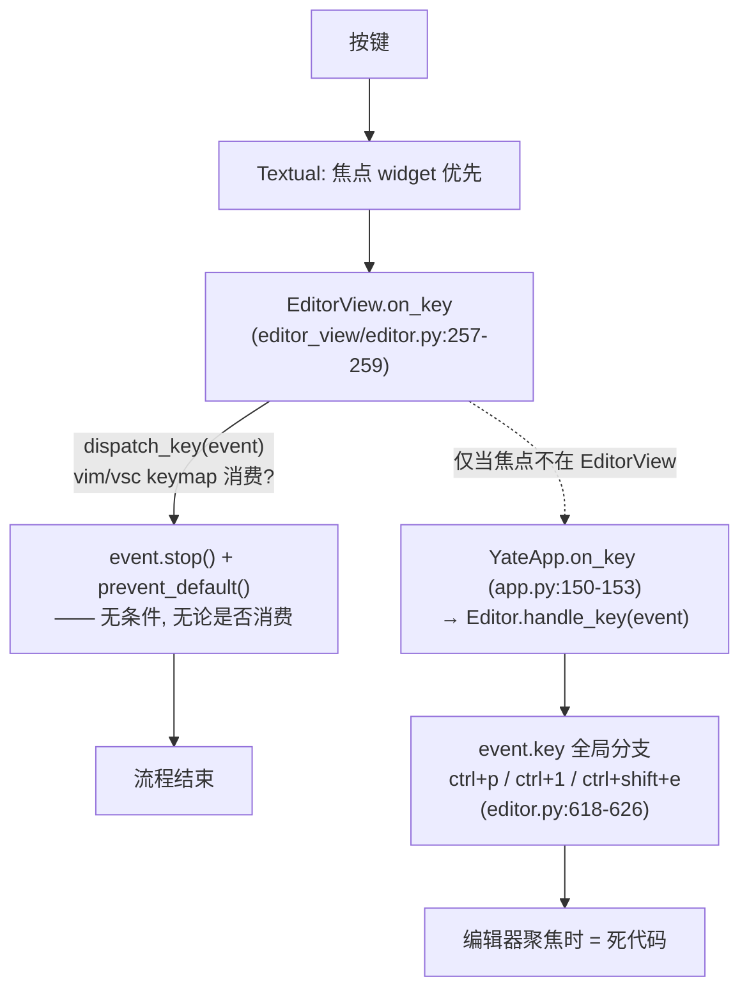

# 方案 B v2 — 按键可达性重构 + Windows 输入通道（真机验证后的重排）

> 状态：**计划（待实施）**；取代 `wt_keybinding_fix_plan.md` SP1–SP3 的后续路线
> 触发：2026-09-26 真机验证结果 —— **vim 键位下仅 ctrl+q 恢复，ctrl+p / ctrl+/ 仍失效**（ctrl+1 失效属预期）
> 前置文档：`../win_keybinding_plan.md`（方案 B 决策）、`../win_keybinding_protocol_plan.md`（旧实施排期，本文重排）、
> `../wt_keybinding_fix_plan.md`（止血切片，部分有效）、`README.md`（SP1–SP5 执行记录）

---

## 一、真机验证结果与新根因

### 1.1 实测结果（用户反馈，vim 键位）

| 键 | vsc（推测/既有） | vim（本次实测） | SP1–SP3 预期 | 结论 |
|---|---|---|---|---|
| ctrl+q | ✅（`\x11` raw 绑定） | ✅ **修复** | ✅ | 唯一按预期修好 |
| ctrl+p | ✅（`\x10` raw 绑定） | ❌ **仍失效** | ✅ | 止血方案未覆盖 vim |
| ctrl+/ | ✅ | ❌ **仍失效** | ✅ | 同上（待取证细分） |
| ctrl+1 | ❌ | ❌ | 预期失效 | 不变，仅方案 B 根治 |

### 1.2 新根因：全局分支在冒泡末端，编辑器聚焦时不可达（主因）

真实事件流（与重构时的假设**相反**）：

- [editor_view/editor.py:257-259](../../../yate/editor_view/editor.py)：`dispatch_key(event)` 后**无条件** `event.stop()`（docstring 自述防二次派发）；
- 因此 `Editor.handle_key` 的 `ctrl+p` / `ctrl+1` / `ctrl+shift+e` 分支**只在焦点位于 explorer 等非编辑器 widget 时可达**；
- keymap 层：vim 无 `\x10` 绑定且 normal/insert 尾部吞键（`vim.py:427-431` / `:185`）→ vim 下 ctrl+p 必死；vsc 有 `\x10` → 活。ctrl+q 在两键位下都有出路 → 用户实测"仅 ctrl+q 修复"与之吻合；
- SP2 的 pilot 守卫没有拦住：`pilot.press("ctrl+p")` 在 vsc 键位走的是 keymap raw 路径而非全局分支，反向演练时注释全局分支守卫仍绿（当时误判为演练通过）——守卫设计缺陷，见 Phase A3。

### 1.3 次因：WT 原生驱动下 ctrl+/ 的到达形态未取证

SP1 修复链是 `event.key=="ctrl+underscore"` → `event_to_raw` → `"\x1f"` → vim `KeyBinding("\x1f")`（`vim.py:113`）。vim 下仍失效说明链上某环在 WT 断裂（Textual **win32 驱动**对 `\x1f` 的命名可能与 XTermParser 不同，或 character 为空导致 raw 推导失败）。需 A2 的真机取证定位。

### 1.4 结论

止血切片（映射表修补）只在"keymap 恰好有对应 raw 绑定"时有效；**架构性修复是让全局和弦不依赖 keymap 是否吞键**（Phase A），`ctrl+1` 这类物理不可达键再上驱动重写（Phase B）。旧计划的 Phase 2（名字层接入派发 + P2.5 vim 冒泡）方向本就正确，本轮为其补上精确机制与顺序。

---

## 二、Phase A — 全局和弦下沉（架构修复，先行，独立可发布）

> 原则：一次按键每层最多消费一次；全局和弦在**分发入口**优先判定，keymap 只处理自己的键；
> 不碰 Textual 驱动，风险最低。预计解决 vim 下 ctrl+p / ctrl+shift+e（大概率也含 ctrl+/，以 A2 取证为准）。

### A1 — 全局和弦检查下沉到 `EditorView.dispatch_key` 入口

- **输入**：`yate/editor.py:554`（`Editor.handle_key`）、`yate/editor_view/editor.py:250-259`（`on_key`/`dispatch_key`）
- **改动**：
  1. `Editor` 新增 `handle_global_chord(key: str) -> bool`：把现有 `ctrl+shift+e` / `ctrl+1` / `ctrl+p` 三个 event.key 分支迁入（L3 横跨多协作者的操作，归属合规）；`handle_key` 保留冒泡路径调用它（非编辑器焦点场景不变）。
  2. `EditorView.dispatch_key` 开头（keymap 派发之前）：`if self._editor_handle_global_chord(event.key): consumed=True` —— 经构造注入的 `Callable[[str], bool]`（R3：组件不 import `yate.editor`，用具体回调）。
  3. `on_key` 改为**消费才 stop**：`if self.dispatch_key(event): event.stop(); event.prevent_default()`；`dispatch_key` 返回 `bool`。未消费（keymap 未映射且非全局和弦）→ 不 stop，冒泡到 `App.on_key`（`TOGGLE_KEYS` / `alt+shift+p` 等 App 级职责）。
  4. **R10 二次派发校验**：keymap 已消费的键必须 stop（A1.3 已保证）；冒泡只发生在"该键无人消费"时，App 层 `handle_key` 内部对同一 event 至多消费一次 —— 单一路径，无双重执行。
- **验收**：vim 键位 + 焦点在编辑器：ctrl+p 开面板、ctrl+shift+e 聚焦文件树、ctrl+1 聚焦编辑器（kitty 终端）；vsc 全部不回归；`tests/test_architecture.py` 13 用例全绿。
- **测试**：`test_dispatch_guards.py` 重写（见 A3）；全量 pytest + pyright。

### A2 — ctrl+/ 的 vim 路径取证与修复（P0 探针先行）

- **输入**：真机脚本阶段一输出（`verify_matrix.ps1`，WT 下 ctrl+/ 的字符码/修饰键）；如仍不足，用 `YATE_TRACE=1` + A1 的 `unmapped key` debug 日志取 `event.key` 实际值
- **分支处置**（按取证结果择一）：
  - 到达 `event.key == "ctrl+underscore"` 但 keymap 未命中 → 查 `EditorView.dispatch_key` 的 raw 推导顺序（`editor_view/keys.py` 的 `event_to_raw(event.key, event.character)`，若 `character` 已是 `"\x1f"` 应短路命中）；
  - Textual win32 驱动给出**其它名字**（如 `ctrl+oem_2` 之类）→ `textual_key_to_raw` 增补该名字映射（SP1 同款表项）；
  - 根本没产生 key event → 记录为 Phase B 输入（win32-input-mode 才能救）。
- **验收**：WT 真机 vim 键位 ctrl+/ 切换成功（或明确归入 Phase B 清单）。

### A3 — 守卫重建（弥补 SP2 演练缺陷）

- **输入**：`tests/test_dispatch_guards.py`
- **改动**：
  1. **单元级**：直接构造 `Editor`（headless，仿 `tests/test_vim_keymap.py` 的 fake editor 模式）断言 `handle_global_chord("ctrl+p") is True` 且 `open_file_palette` 被调——不依赖事件冒泡；
  2. **集成级**：pilot 守卫显式设 **vim 键位**（启动后 `handle_raw_key("\x1f")` 切换或构造时指定），焦点置于 `EditorView` 后 `press("ctrl+p")` 断言面板打开——只有 A1 落地后此测试才可能绿，即守卫与修复同步生效；
  3. **反向演练重做**：注释 `handle_global_chord` 的 ctrl+p 行 → 上述两个测试都必须变红 → 还原。**演练结果（红）必须记录在提交信息里**。
- **验收**：`pytest tests/test_dispatch_guards.py -q` 全绿且演练可复现红色。

### A4 — 文档与收尾

- `SP5_gates_matrix.md` 真机矩阵按 Phase A 后的复测结果回填；`review.md` IKH1RA 条目补记"vim 下仍失效→Phase A"段；本文件勾选状态；issue 回复草稿改写（解释两层根因）。
- **可发布点**：`v0.3.1`（Phase A 单独成版，不含驱动改动）。

---

## 三、Phase B — Windows 输入通道重写（方案 B 主体，仅剩 ctrl+1 类键的理由）

> 重排自 `win_keybinding_protocol_plan.md`（P0–P9），锚点已按分层重构校准（见该文件头部 2026-09-26 校准表）。
> Phase A 落地后重新评估：若 vim/vsc 下除 ctrl+1 外全部可用，Phase B 的用户价值 = `ctrl+1`/`alt+digit` 等
> 无 legacy 编码键 + `:keys` 排障面板，可按需求热度决定是否启动。

| 步骤 | 内容 | 关键锚点（重构后） | 验收 |
|---|---|---|---|
| B1 | `yate/keyproto/` L0 子包：`KeyChord`（vk/修饰/字符）、`legacy.py`（C0 编解码，吸收 `editor_view/keys.py` 两张表）、`aliases.py`（canonical 名归一） | 新包，不 import yate 上层 | 单测全覆盖；pyright 0 |
| B2 | `YateWindowsDriver`：基于 Textual `Win32Driver` 子类/复制改造，读 `dwControlKeyState` 合成完整 chord；探测终端是否声明 win32-input-mode（`CSI ... ; modifiers ; vk ; keydown-u`） | `textual/drivers/win32.py` 为参照 | WT 下 ctrl+1 事件到达且 `event.key` 命名稳定 |
| B3 | 注入：`YateApp` 类属性 `driver_class`（`app.py:31` 附近）+ `App.get_driver` 覆盖；事件进入既有派发（A1 的入口），不绕过 R10 | `yate/app.py` | pilot 全量回归绿 |
| B4 | 配置 `key_protocol = auto\|win32-input\|kitty\|legacy`（`yate/config.py:50` `_KNOWN_OPTIONS`）+ 手册 + `:keys` 面板（`yate/diagnostics.py`） | 旧计划 P5/P7 | 真机矩阵三项全 ✅ 含 ctrl+1 |
| B5 | 真机矩阵复测 + 发布 `v0.4.0` | — | — |

---

## 四、架构合规自检（Phase A 新增代码逐条对照）

- [ ] 依赖方向：`EditorView` 经 `Callable[[str], bool]` 回调消费全局和弦判定（R3），不 import `yate.editor`；`Editor` 不反向 import `editor_view`（L3→L2 既有构造注入方向）；
- [ ] 状态归属：全局和弦判定是"横跨多协作者的操作"→ `Editor`（L3），不入 `EditorSession`（L1）、不入组件；
- [ ] 无新增 `Protocol` / `TYPE_CHECKING` / `Any`（R2/R6）；命名无 `*Host/*Ops/*Delegate`；
- [ ] R10 重述修订：改"**消费才 stop**"语义并同步 `architecture-boundaries.md`（R10 原文"未被消费的键不得冒泡"与本方案冲突——未消费键**必须**冒泡，禁止的是"已消费仍冒泡造成二次派发"；规则文件随 A1 提交一并更新）；
- [ ] pyright strict 零诊断；`tests/test_architecture.py` 13 用例全绿。

## 五、风险与回滚

- A1 触碰全局按键主路径，回归面大 → A3 守卫先行（红）→ A1 实现（绿）一次提交内完成；出问题 revert 单 commit；
- "消费才 stop"可能让此前被 EditorView 无条件吞掉的键漏到 App 层产生新行为（如 vim 下未映射可打印字符冒泡进 App）→ `dispatch_key` 对可打印字符维持吞键（编辑器语义），仅**不可打印且未映射**的键冒泡，边界写进 A1 测试；
- ctrl+/ 若取证归属 Phase B（驱动层丢失），Phase A 验收标准降级为"vsc/vim 双键位 ctrl+p、ctrl+shift+e、ctrl+q 全通"，ctrl+/ 移交 B4 矩阵。
