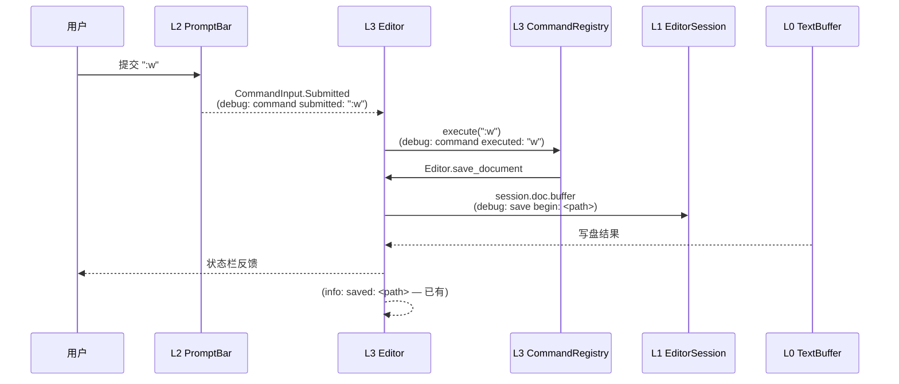

# 计划：分层日志增强（issue IKIN1Z）

## 一、背景

Gitee issue [IKIN1Z](https://gitee.com/jermaine/yate/issues/IKIN1Z) 要求：按照架构图，为不同层级自上而下、**尤其是层级间的交互**，适当添加日志，方便以后调试。

基础设施已就绪：`yate/logs.py` 的 `tracing` 服务（L0 叶子，stdlib `logging` 封装），默认关闭；开启后写 `~/.yate/data/logs/yate-YYYYMMDD-HHMMSS-<pid>.log`，格式 `%(asctime)s %(levelname)-7s %(name)s: %(message)s`。开关来源：`YATE_TRACE` / `YATE_TRACE_LEVEL` 环境变量优先，yaterc 的 `yate_trace` / `yate_trace_level` 兜底，默认级别 DEBUG。

分支：`enh/logging-for-layers`（worktree `D:\Programming\yate-logging-layers`）。该分支同时承载 keybinding 修复工作（Phase A/B，见 `.trae` 下 keybinding 状态文档），**本计划只处理日志增强，不改动 keybinding 相关代码路径**。

### 现状盘点（merge master 后实测）

全仓 37 条 `log.*` 调用，分布 9 个文件：

| 层 | 文件 | 条数 | 已覆盖内容 |
|---|---|---|---|
| L4 | `yate/cli.py` | 4 | 启动、rc 文件、config errors |
| L3 | `yate/editor.py` | 15 | 开/关/存 tab、quit、LSP/终端 shutdown、unmapped key |
| L3 | `yate/services/extensions.py` | 5 | 扩展加载/卸载/失败 |
| L0 | `yate/editor_lsp/manager.py` | 6 | server 启停、失败 |
| L0 | `yate/editor_lsp/client.py` | 1 | 读循环崩溃 |
| L0 | `yate/keyproto/driver_windows.py` | 2 | Windows chord 记录 |
| L0 | `yate/editor_term/pty_proc.py` | 1 | PTY 回调失败 |
| L0 | `yate/services/fonts.py`、`trust.py` | 3 | 广播失败、信任提示 |

**缺口**：L4 `app.py` 零日志；L3 的 `actions.py` / `commands.py` / `completion.py` / `prompt_completion.py` / `diagnostics.py` 零日志；**L2 `editor_view/*` 全部零日志**；L1 `session.py` / `registries.py` / `keymaps/registry.py` 零日志；L0 `editor_core` / `config.py` / `editor_syntax` / workspace 零日志。

## 二、目标与非目标

**目标**：一份 trace 文件即可自上而下还原一次操作链（按键 → 派发 → 状态变更 → 落盘/LSP），层间交互点有统一风格的记录。

**非目标**：不改任何控制流与行为；不做 TUI 内日志查看器（直接看日志文件）；不引入结构化日志库（stdlib `logging` 足够）；不动 `crash` 服务。

## 三、设计原则

1. **纯观察点**：只新增 `log = tracing.get_logger(__name__)` 与 `log.*` 语句；不改函数签名、控制流、返回值。
2. **风格合规**（python-coding-style.md §4.6）：消息用 `%` 惰性占位符；**禁止** `log.*(f"...")`；每模块顶部一次 logger 创建；无 print。
3. **级别语义约定**（全计划统一）：

| 级别 | 语义 | 示例 |
|---|---|---|
| `debug` | 决策点、状态转换、层间调用出入参摘要 | "action dispatched: %s"、"pane focused: %s" |
| `info` | 生命周期里程碑（成功发生一次的事） | "split created"、"document attached: %s" |
| `warning` | 可恢复失败、降级、跳过 | "hover ignored: server not ready" |
| `error`/`exception` | 异常路径（沿用现状，已有覆盖，不新增级别滥用） | — |

4. **热路径纪律**：`render()`、每帧刷新、每次按键的全量记录一律禁止；按键链路只记**决策点**（模式切换、keymap 未命中已由 `editor.py:699` 覆盖、补全弹窗开/关）；LSP 高频通知（diagnostics publish）只记摘要（计数/版本），不记全文。
5. **依赖方向**：`yate/logs.py` 是 L0 叶子，L2/L3/L4 向下 import 合规，不触碰 R2/R3/R4/R11；不新增 Protocol、`TYPE_CHECKING`、`Any`。
6. **消息风格**：与 `cli.py` / `editor.py` 既有风格一致——小写英文短句开头 + 关键参数（logger name 已携带模块路径，消息内不再重复模块名；跨层场景用 `from=`/`to=` 表述时以模块名为值）。

## 四、架构设计

### 观察点分布（新增后）

```mermaid
flowchart TD
    subgraph L4["L4 外壳"]
        APP["app.py YateApp<br/>mount/compose/主题切换/事件转发"]
    end
    subgraph L3["L3 调度"]
        ED["editor.py Editor<br/>(已有15条，补 execute_action 入口)"]
        ACT["actions.py ActionRegistry"]
        CMD["commands.py CommandRegistry"]
        CMP["completion.py / prompt_completion.py"]
        DIA["diagnostics.py"]
    end
    subgraph L2["L2 组件"]
        PANES["panes.py PaneHost/PaneManager"]
        CHROME["chrome.py TabBar/Breadcrumbs"]
        EXP["explorer.py ExplorerTree"]
        PBAR["commandline.py CommandInput/PromptBar"]
        TERM["terminal.py TerminalView/Panel"]
        POP["completion.py CompletionPopup"]
    end
    subgraph L1["L1 会话与模型"]
        SES["session.py 窗格树纯操作"]
        REG["registries.py 注册表"]
        KMR["keymaps/registry.py KeymapSet"]
    end
    subgraph L0["L0 叶子"]
        CORE["editor_core buffer/document/search"]
        LSP["editor_lsp client 请求/响应"]
        CFG["config.py 加载结果"]
        SYN["editor_syntax 回退决策"]
    end
    LOGS["logs.py tracing<br/>单文件汇聚 ~/.yate/data/logs/"]

    APP -->|"生命周期/转发"| ED
    ED -->|"execute_action"| ACT
    ED -->|":"命令"| CMD
    ED --> CMP
    LSP -->|"publish 通知"| DIA
    ACT --> SES
    PANES --> SES
    APP & ED & ACT & CMD & CMP & DIA & PANES & CHROME & EXP & PBAR & TERM & POP & SES & REG & KMR & CORE & LSP & CFG & SYN --> LOGS
```

### 一条操作链的期望日志形态（以 `:w` 保存为例）



### 分层观察点矩阵（新增）

| 层 | 文件 | 观察点 | 级别 |
|---|---|---|---|
| L4 | `app.py` | App `on_mount`（模式、主题）、主题切换、转发给 Editor 的事件类别（resize/paste 等非按键事件）、`App.quit` | debug/info |
| L3 | `actions.py` | `execute` 成功派发（action 名）、注册表装载（`populate` 计数） | debug/info |
| L3 | `commands.py` | `execute` 进入（命令名+参数摘要）、未命中/参数错误 | debug/warning |
| L3 | `completion.py` | 补全流程状态机转换：请求发出/到达/过滤后条数/接受/取消 | debug |
| L3 | `prompt_completion.py` | 提示条补全候选来源切换 | debug |
| L3 | `diagnostics.py` | publish 到达（server、计数）、清理 | debug |
| L2 | `panes.py` | `PaneManager`/`PaneHost`：leaf 创建/销毁、焦点转移、attach/detach | debug/info |
| L2 | `chrome.py` | TabBar 激活/关闭转发、Breadcrumbs 重建 | debug |
| L2 | `explorer.py` | 树节点展开/选中后发起 `open_path` 回调 | debug |
| L2 | `commandline.py` | CommandInput 模式进入/退出、PromptBar 提交 | debug/info |
| L2 | `terminal.py` | Panel 显示/隐藏、View attach/detach PTY | debug/info |
| L2 | `completion.py`（popup） | 弹窗显示/隐藏及触发原因 | debug |
| L1 | `session.py` | 文档 open/close、窗格树操作（split/close/move：`replace_node`/`remove_node` 调用方入口）、active leaf 切换 | debug/info |
| L1 | `registries.py` | action/command 注册与覆盖（同名覆盖记 warning） | debug/warning |
| L1 | `keymaps/registry.py` | KeymapSet 激活切换 | debug |
| L0 | `editor_core/buffer.py` | 缓冲区新建/重大变更标记（`mark_content_changed` 汇总行数变化） | debug |
| L0 | `editor_core/search.py` | 查询发起与命中数 | debug |
| L0 | `config.py` | yaterc 文件发现与加载完成（来源、错误数） | info/warning |
| L0 | `editor_lsp/client.py` | 请求发出（method、id）、响应/错误到达（method、耗时）、notify 发出 | debug |
| L0 | `editor_syntax` | 语法后端回退决策（tree-sitter → fallback） | debug/info |

> 明确**不加**：`editor_view/statusbar.py` 与 `editor_view/editor.py` 的渲染路径（每帧热路径）；`keymaps/vim.py`/`base.py` 的每次按键记录（决策点已在 L3 `handle_key` 层覆盖）；`logs.py` 自身。

## 五、实施步骤

### Phase 0 — worktree 准备（本计划起草时已完成 2/3）

1. [x] `git worktree add --track -b enh/logging-for-layers D:\Programming\yate-logging-layers origin/enh/logging-for-layers`
2. [x] `git -C D:\Programming\yate-logging-layers merge master --no-edit` → 已合并 `108f763`（readonly-option 等），零冲突。
3. [x] 在 worktree 内准备解释器：`.venv` 已创建并 `pip install -e .`。
4. [x] 提交本计划文档（`docs(plans): draft layered logging plan for issue IKIN1Z`）。

验收：基线 `pytest tests/ -q` = **1251 passed, 7 skipped**（首跑 `test_new_file_and_folder_from_explorer` 为 pilot timing 偶发失败，单跑通过、全量重跑全绿）。

### Phase A — L4 外壳（app.py）

文件：`yate/app.py`。
1. 模块顶部 `log = tracing.get_logger(__name__)`（import `yate.logs.tracing`）。
2. 观察点：`on_mount`（info: app mounted, mode/主题摘要）、主题注册/切换（debug）、`action_quit` 类外壳动作（debug）、非常规事件转发入口（debug，仅 resize/paste 等类别名，不记内容全文）。

验收：pyright 零诊断；`YATE_TRACE=1` 冒烟时日志出现 `yate.app` 记录。

### Phase B — L3 表与流程模块

文件：`yate/actions.py`、`yate/commands.py`、`yate/completion.py`、`yate/prompt_completion.py`、`yate/diagnostics.py`；`yate/editor.py` 仅补 `execute_action` 入口一条 debug（"action: %s"），其余不动。
1. 每文件顶部 logger；`populate`/`register_commands` 装载完成各记一条 info（计数）。
2. `execute` 通道：进入记 debug（名称 + 参数摘要）；`commands.py` 参数解析失败记 warning。
3. `completion.py` 状态机：trigger/fetch/accept/cancel 四类转换各一条 debug（含候选数）。
4. `diagnostics.py`：publish 到达记 debug（server 名 + 条数）。

验收：pyright 零诊断；单元测试全绿；补全流程冒烟（`textual-pilot-smoke` 场景）日志链完整。

### Phase C — L2 组件

文件：`yate/editor_view/panes.py`、`chrome.py`、`explorer.py`、`commandline.py`、`terminal.py`、`completion.py`。
1. 每文件顶部 logger（L2 向下 import `yate.logs` 合规，不触碰 R3）。
2. 只记**构造/挂载/焦点/显隐/提交/转发**等低频事件（矩阵第四节），渲染路径零改动。
3. TabBar 激活/关闭回调、Explorer `open_path` 回调入口记 debug（含目标路径）。

验收：pyright 零诊断；架构测试 13 用例全绿；Textual pilot 冒烟正常。

### Phase D — L1 会话与模型

文件：`yate/session.py`、`yate/registries.py`、`yate/keymaps/registry.py`。
1. `session.py`：open/close 文档（info/debug）、窗格树操作入口（split/close/focus：记录 `replace_node`/`remove_node` 前后的 leaf 计数）、active leaf 切换（debug）。
2. `registries.py`：`register` 命中同名覆盖记 warning；装载计数 info。
3. `keymaps/registry.py`：KeymapSet 切换记 debug。

验收：pyright 零诊断；`tests/test_session*.py` 全绿。

### Phase E — L0 补口

文件：`yate/editor_core/buffer.py`、`search.py`、`yate/config.py`、`yate/editor_lsp/client.py`、`yate/editor_syntax`（回退决策处）。
1. `config.py`：yaterc 来源与错误数（info/warning）——注意 config.py 属 R4 守卫面，仅 import `yate.logs`，合规。
2. `buffer.py`：仅生命周期与 `mark_content_changed` 汇总（debug，带行列数），**不加**在逐字符写路径。
3. `client.py`：`request` 发出（method、id）与响应/错误到达（method、耗时 ms）debug；notify 高频路径只记类型不计载荷。

验收：pyright 零诊断；`test_editor_core.py`、`test_tracing.py` 全绿。

### Phase F — 防回归与门禁

1. 新增守卫测试（追加到 `tests/test_architecture.py`）：`test_no_fstring_log_calls` —— Grep 全仓 `log\.(debug|info|warning|error|exception|critical)\(f["\']`，命中即失败（守护 §4.6 惰性格式化约定）。执行前先全仓验证当前无命中，若有先修正为 `%` 风格。
2. 门禁：`python -m pyright yate/ tests/ tools/` 零诊断；`python -m pytest tests/ -q` 全绿；架构测试 14 用例全绿。
3. 冒烟（textual-pilot-smoke）：`YATE_TRACE=1` 驱动一次“打开文件 → 输入 → `:w` → 补全 → split → quit”，读回日志文件核对各层记录齐全且顺序符合操作链。
4. 提交策略：每 Phase 独立 commit（`feat(logging): add trace logs to <layer>` / `test(architecture): guard lazy log formatting`），不做大杂烩提交。
5. 文档回填：本文件 §八 记录每 Phase 实测数字与偏离项。

## 六、风险与对策

| 风险 | 对策 |
|---|---|
| 热路径日志拖慢渲染/按键 | 矩阵明确排除渲染路径；debug 级别 + 惰性 `%`；冒烟对比开启前后按键延迟无肉眼可感差异 |
| L2 组件误 import 上层 | 只 import `yate.logs`（L0）；架构测试自动拦截 |
| 与 keybinding 在途工作冲突 | 本计划不碰 `keymaps/vim.py`/`base.py`/`keys.py`/`keyproto` 的控制流；文件级冲突由主代理按 Phase 串行处理 |
| 日志过密淹没关键信息 | 遵循级别语义表；同一点位只在状态转换时记一次，不在循环内重复 |
| 测试环境无 `YATE_TRACE` 时行为变化 | 默认关闭路径本就零输出（NullHandler）；观察点为纯新增语句，无控制流改动 |

## 七、架构合规自检

- [x] 依赖方向全部向下（`yate.logs` 为 L0 叶子），无 R1–R11 违规
- [x] 不新增 Protocol / `TYPE_CHECKING` / `Any` / `# type: ignore`
- [x] 观察点全部为纯新增 log 语句，不改控制流与函数签名
- [x] 新按键路径零改动（R10 无涉）
- [x] pyright strict 零诊断、pytest 全绿、架构测试全绿

## 八、校准记录（实施后回填）

实施日期：2026-09-26。

### 实测数字

| 项 | 计划前 | 计划后 |
|---|---|---|
| `log.*` 调用 / 涉及文件（yate/） | 37 条 / 9 文件 | 97 条 / 24 文件（实测 Grep） |
| pyright strict | 0 诊断 | 0 诊断（每 Phase 均复验） |
| pytest | 1251 passed, 7 skipped | **1252 passed, 7 skipped**（+1 守卫测试） |
| 架构测试用例 | 13 | 14（新增 `test_log_calls_use_lazy_percent_formatting`） |

### 分 Phase commit

| Phase | commit | 内容 |
|---|---|---|
| 0 | `970de77` + `548a25c` | 计划文档 + merge master |
| A | `cc24677` | L4 app.py：mount/unmount、主题设置与降级、key fallback、quit 经注册表 |
| B | `f575211` | L3 actions/commands 装载计数、`run_command` 派发与未命中、`execute_action` 未命中、completion 状态机 |
| C | `2a6e712` | L2 panes/chrome/explorer/commandline/terminal |
| D | `4fd005f` | L1 session/registries（覆盖警告）/keymaps select |
| E | `06d99a9` | L0 buffer/search/config/lsp client+manager/tree-sitter 回退 |
| F | （本提交） | 守卫测试 + 文档回填 |

### 与计划的偏离项（含理由）

1. **`diagnostics.py` 未加日志**：勘察发现它是 `yate --diag` 的一次性环境报告模块，无运行时流量；计划第三节矩阵把"LSP publish 到达"放在该模块属假设错误。运行时观察点改落在 `editor_lsp/manager.py::handle_notification`（摘要记录 uri 文件名 + 条数）。
2. **`prompt_completion.py` 未加日志**：纯函数模块（每次 Tab 键计算候选），无状态机；交互点由 L2 `PromptBar` 的 activate/submit 日志覆盖。
3. **`Editor.execute_action` 未做"进入即记 debug"**：它是每次按键派发的热路径（hjkl 等全部经过），违反设计原则 4；改为只记**未命中**（`action not found: %s`，罕见且有键表排障价值）。
4. **Breadcrumbs rebuild、CompletionPopup widget 的 show/close 未记**：前者纯渲染路径，后者与 L3 controller 的 popup shown/closed 日志是同一状态转换（避免双重记录）。
5. **LSP 响应未实现"耗时 ms"**：避免为计时引入 `_req_times` 状态表；`request -> (id=N)` 与 `response <- (id=N)` 两行的日志时间戳之差即为耗时，零新增状态。
6. **app.py 的"resize/paste 事件转发"观察点不存在**：`app.py` 实际没有此类处理器，改为记录 `on_key` fallback（未消费键路由）与 `on_unmount`。
7. **计划外小项**：`notify()` 与 server→client request 各记一条 debug，但 `textDocument/didChange`（逐键）与 `publishDiagnostics`（manager 侧摘要）显式静默，防高频刷屏。

### 冒烟证据（Phase F.3，临时脚本已删除）

`YATE_TRACE=1` + pilot 驱动"打开文件 → 输入 XYZ → `:w`（真实提示条路径）→ `:split` → quit"：14/14 断言 PASS，38 条记录，操作链完整可读：

```
23:55:38,631 DEBUG yate.config: yaterc loaded: sources=[] errors=0
23:55:38,651 DEBUG yate.app: theme set: mocha
23:55:38,660 DEBUG yate.session: session open: ...\notes.txt (1 docs)
23:55:38,660 INFO  yate.editor: opened: ...\notes.txt
23:55:38,661 DEBUG yate.editor_view.panes: pane host attached
23:55:38,662 INFO  yate.actions: builtin actions populated: 65
23:55:38,662 INFO  yate.commands: builtin commands registered: 44
23:55:38,700 INFO  yate.app: app mounted: theme=mocha version=0.2.5
23:55:39,044 DEBUG yate.editor_view.commandline: prompt activate: mode=command
23:55:39,217 DEBUG yate.editor_view.commandline: prompt submit: mode=command value='w'
23:55:39,217 DEBUG yate.editor: command: w (args='')
23:55:39,220 INFO  yate.editor: saved: ...\notes.txt
23:55:39,325 DEBUG yate.editor: command: split (args='')
23:55:39,326 INFO  yate.editor_view.panes: pane split (horizontal): new leaf=2 doc=...\notes.txt
23:55:39,401 DEBUG yate.app: quit via registry
23:55:39,402 INFO  yate.editor: quit (force=False)
```
