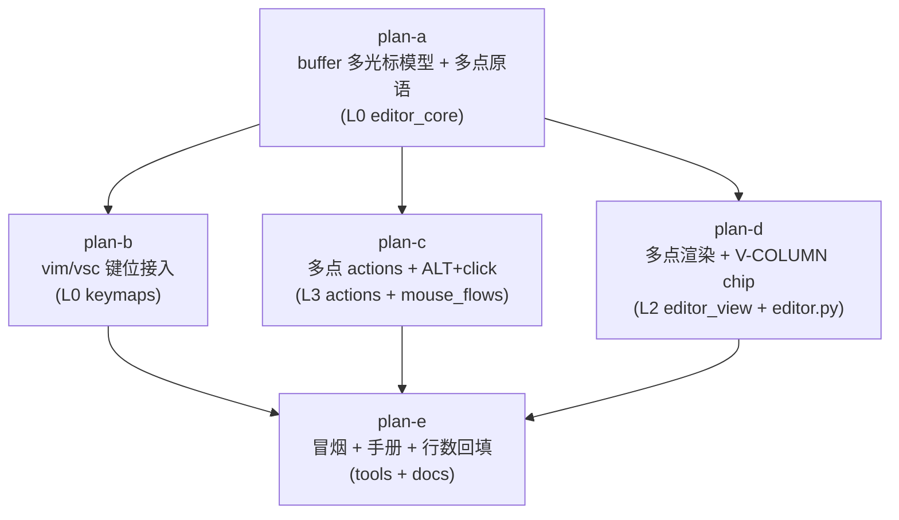
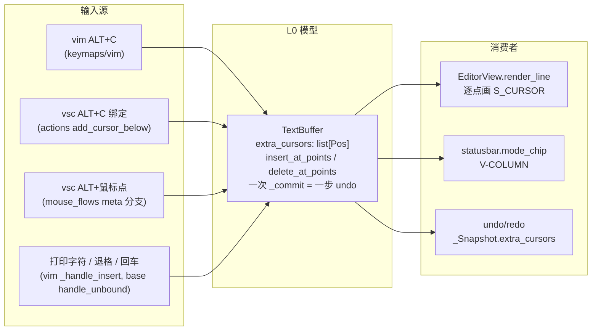
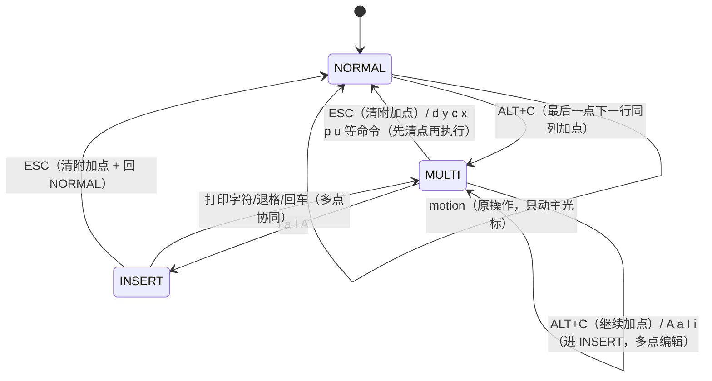

# multi-cursor 总纲（issue IKKJHH：多光标模式）

> 分支 `feat/multi-cursor`（worktree `yate-multi-cursor`，基线 master `5d0c9ea`）。
> 本文是子计划索引与执行波次的唯一调度依据；各子计划自包含，执行者只读
> 自己名下的子计划 + 本总纲。
>
> **本任务废弃列模式、重新设计多光标模式。** 前序分支 `feat/vim-column-mode`
> （11 个提交未合入，worktree 已恢复于 `D:\Programming\yate-vim-column-mode`）
> 是只读参考，行号引用一律以 master（本 worktree）为准；引用废弃分支代码时
> 显式标注提交号。
>
> **调度依据声明**：本目录下 `*-plan-a..e` 五个子计划是唯一调度依据，
> 执行者只读本总纲与这五个子计划。

## 一、目标

1. **多光标状态模型（L0）**：`TextBuffer` 支持附加光标点集合
   （`extra_cursors: list[Pos]`，空 = 常规单光标），多点插入/退格以**一次
   undo 步**协同生效；undo/redo 快照完整恢复点集合。
2. **vim 键位**：NORMAL 下 `ALT+C` 在最后一个光标点的下一行同列添加光标
   （可重复按）；`h/j/k/l/w/b` 等 motion 保持原单光标操作；`i/a/I/A` 进入
   INSERT 后打印字符/退格/回车在**所有点**协同编辑；`ESC` 清除所有附加
   光标（INSERT 下先清点再回 NORMAL）。
3. **vsc 键位**：`ALT+鼠标点` 添加光标（可多次点击叠加）；`ALT+C` 快捷键
   与 vim 对齐（添加光标）；有附加光标时打印字符/退格/回车多点协同；
   方向键保持原单光标操作；`ESC` 清除附加光标；普通（无 Alt、无 Shift）
   左键点击清除附加光标。
4. **状态栏**：多光标激活时 chip 显示 `V-COLUMN`（沿用废弃分支 `e3d076e`
   的文案与显示时机语义，master 上等价重建）；键位标签其余部分不变。
5. **渲染**（L2）：附加光标点在各自行画光标块（`S_CURSOR`），主光标渲染
   与滚动跟随（`reveal_cursor`）行为不变。
6. **废弃列模式**：本分支基于 master，**无删除动作**（master 没有列模式
   代码）；采纳/排除清单见 §六。

## 二、非目标

- **多点选区**（每个附加点各自的 anchor / 拖拽多点选择）：V1 点是裸光标
  （`Pos`），不带选区；废弃分支的块选（block flag + anchor/cursor 双角）
  整体排除。
- **多点 bracket 自动补全/跳过**：`type_char` 的配对逻辑是单点 affordance，
  多点插入不走 `type_char`（直接走多点原语），无配对。
- **多点回车自动缩进**：V1 多点回车只插 `"\n"`（各行缩进规则不逐点计算，
  登记为已知限制）。
- **多点 tab 的 tab-stop 精确对齐**：多点时每点插入固定缩进单位
  （`use_spaces` 为 `" " * tab_width`，否则 `"\t"`）。
- **多点 operators / paste / x / u / o / O**：NORMAL 下这些命令一律先清除
  附加光标再按单光标原语义执行（见 plan-b 的"清点规则"）。
- **方向键/词移动移动所有光标**：保持原操作（只动主光标），issue 原文。
- **VS Code 的 Ctrl+D（add selection to next match）、Alt+Shift+方向列
  选择**：不做；master 键名管道的 alt+shift 缺口**不移植**（见 §四根因 2）。
- **非 Windows 终端的 ALT+C 投递验证**：legacy 终端（无 yate 驱动的记录
  路径与帧路径）依赖 Textual 对 `ESC+c` 的 ESCAPE_DELAY 合成，属已知限制，
  不阻塞（Windows 是本任务目标环境）。

## 三、备选方案与否决理由

| 方案 | 内容 | 裁决 |
|---|---|---|
| A. `TextBuffer` 增加 `extra_cursors: list[Pos]`，多点原语也放 `buffer.py`，undo 快照扩展 | 光标/选区/undo 的既有汇聚点都在 buffer，多点编辑天然是单光标 mutation 的推广；`snapshot()/commit()` 公共事务接口（`yate/editor_core/buffer.py:209-215`）正是为"多行编辑一个逻辑操作"设计的（SearchEngine 先例，`buffer.py:203-207`） | **采纳** |
| B. 独立 `editor_core/cursors.py` 会话对象包住 TextBuffer | 引入双状态源（`buffer.cursor` vs 会话点集），与废弃分支总纲 §三否决方案 B 的"双源状态必然漂移"同理；且多点插入必须复用 buffer 的插入/删除/undo 内部，跨模块切割反而增加耦合面 | 否决 |
| C. 多光标状态放 L3 flows | 键处理链路在 L0 keymap（vim `_handle_insert` / base `handle_unbound`）就分叉，L3 拦截太晚；keymap（L0）无法 import L3 | 否决（分层不可行） |
| D. 附加点带 anchor（多点选区一步到位） | `_Snapshot`、`set_cursor`、渲染、鼠标全部要处理 N×2 状态，V1 复杂度翻倍；issue 交互设计只要求"添加光标 + 多点输入" | 否决，登记非目标 |
| E. 沿用块标志 + `I/A` 逐行插入（废弃分支路线） | 正是被手工验证否决的路线：块标志与 anchor/cursor 双状态强耦合（任何 `set_cursor(select=False)` 清 anchor 即块死，见 §四根因 3/4），undo/寄存器/打字分支都要块感知，评审 W1/W2/W3 三轮返工仍留 S2 已知限制 | 否决（本任务的直接动因） |
| F. `ALT+C` 被占用时的备选键（issue 预案） | 调研证实 `\x1bc` 在 vim/vsc 两张绑定表均未占用（见 §四根因 5），无需备选 | 无需启用 |

## 四、调研关键事实与根因分析（文件:行号，master 现状）

### 1. 按键事件管道（ALT+C / 字符 / ESC / 方向键的完整送达链路）

**链路 A — Windows Terminal + win32-input-mode 帧路径**：

```
按下 Alt+C
→ YateWindowsDriver 已写 \x1b[?9001h（yate/keyproto/driver_windows.py:279）
→ WT 把整键编码为帧 CSI Vk;Sc;Uc;Kd;Cs;Rc_（vk=0x43, state=ALT_BITS）
→ ChordEventMonitor.run 读记录 → 字符流 → Win32FrameStream.feed
  （driver_windows.py:216）→ frame_to_key_name（keyproto/frames.py:159-181）
  → 非 nav 键且有 alt → chord_to_key_name（keyproto/aliases.py:32-54）
  → 事件名 "alt+c" → deliver(Key("alt+c", character="c"))
→ App → EditorView.on_key（yate/editor_view/editor.py:214-223，单次派发 R10）
→ Editor.handle_key（yate/editor.py:550-654）：无 L3 拦截命中
  （alt+shift+p/s、ctrl+shift+e、ctrl+1、ctrl+p、TOGGLE_KEYS、nul_keys
  均不含 alt+c；yate/editor.py:584-644）
→ event_to_raw("alt+c", "c")（editor.py:647）→ textual_key_to_raw
  （keyproto/legacy.py:135-140 alt 分支）→ "\x1b" + "c" = "\x1bc"
→ handle_raw_key → keymaps.active.handle_key（editor.py:656-669）
```

**链路 B — conhost/记录路径**：`record_key_override`
（`driver_windows.py:80-102`）：vk=0x43 ∈ `_CHORD_VKS`（字母表，
`driver_windows.py:66-77`）且有 alt → 合成 `Key("alt+c")`，其余同上。
两链路在 Windows 上**确定送达**，raw 键均为 `"\x1bc"`；
`parse_key("<alt-c>")` = `"\x1b" + "c"`（`keymaps/base.py:128-129`）。

**普通字符 / ESC / 方向键**（现状即通，无改动）：
- 打印字符：帧/记录路径字符流 → Textual → `event_to_raw` 首分支原样返回
  （`legacy.py:84-90`）→ vsc `handle_unbound`（`keymaps/base.py:334-347`）
  / vim `_handle_insert`（`keymaps/vim.py:283-286`）→ `type_char`。
- ESC：raw `"\x1b"`；vim NORMAL `yate/keymaps/vim.py:423-425`、INSERT
  `:257-261`、visual `:296-301`；vsc 绑定 `<esc>` → action `clear_selection`
  （`yate/keymaps/vsc.py:79`、`yate/actions.py:99`）。
- 方向键：`_ARROW`（`vim.py:54-59`）/ vsc `<up>` 等绑定（`vsc.py:54-57`），
  raw `\x1b[A..D`，两条路径均通。

**已实测的 Textual 8.2.8 解析探针**（`textual._xterm_parser` 直喂，本计划
调研执行，2026-10-10）：

| 输入 | 结果 |
|---|---|
| `\x1b[1;4A`（alt+shift+↑） | `Key('alt+shift+up')` |
| `\x1b[<8;10;5M`（SGR 左键+Alt） | `MouseDown(button=1, meta=True)` |
| `\x1b[<0;10;5M`（无修饰） | `MouseDown(button=1, meta=False)` |
| `\x16`（Ctrl+V 裸字节） | `Key('ctrl+v', '\x16')` |

### 2. 列模式键盘路径失效的根因（对照废弃分支提交）

**根因 2.1（vim 入口不可达）：Windows Terminal 默认键位占用 Ctrl+V。**
WT 默认配置把 `ctrl+v` 绑定到终端自身的 paste 动作；被终端拦截的键
**不会**编码成 win32-input-mode 帧、也不产生记录——yate 在主目标环境
（WT，驱动文档 `D:\Programming\yate.wiki\win-keybinding-protocol-plan.en.md`
以 WT 实测帧为设计基准）永远收不到 vim 列模式的入口键 `Ctrl+V`
（废弃分支 `b222f22` 绑定 `parse_key("<ctrl-v>")="\x16"`，单测全绿但真机
不可达）。conhost 上 `\x16` 可达，但用户手工验证环境是 WT。
**这就是"键盘操作在 vim 下不起作用"的第一根因，也是本设计改用 ALT+C
的直接依据**（issue 原文"如被占用换其他键"的预案启用）。

**根因 2.2（vsc alt+shift+方向在 master 上两处断点）：**
- 断点一：`event_to_raw` 无映射——`_MOD_ARROWS`
  （`keyproto/legacy.py:38-43`）没有 `("alt","shift")` 行，
  `event_to_raw("alt+shift+up")` 返回 `None`，键在
  `editor.py:648-653` 作为 unmapped 被丢弃（探针证实 Textual 能解析出
  `alt+shift+up` 事件名，断在 name→raw）。
- 断点二：`parse_key` 产出错序列——`<alt-shift-up>` 走 shift 分支
  （`keymaps/base.py:111-127`）把 `\x1b[1;2A` 再加 ESC 前缀，绑成
  `"\x1b\x1b[1;2A"`（双 ESC 错序列，不等于真实终端的 `\x1b[1;4A`）。
  废弃分支 `55e7823` 曾补齐这两处（`_MOD_ARROWS` alt+shift 行 +
  `KEY_ALIASES` 4 条 + parse_key 组合分支）。
- **裁决：不移植**——新交互设计不再需要 alt+shift+方向键（vsc 用
  ALT+鼠标 + ALT+C），master 保持现状，缺口登记为已知限制；移植未经
  真机验证的管道反而引入废弃分支 §九.1 记录过的"合成拦截破坏既有单字符
  绑定"风险面。

**根因 2.3（issue 1"只有 VSC 下按住 ALT+鼠标起作用"）：块标志寄生在
anchor 的存活期上。** 废弃分支 `fbf7ad0`/`aec6da9` 的列选择 =
`anchor` + `block` 标志；而 `set_cursor(pos, select=False)` 清 anchor
（master `yate/editor_core/buffer.py:286-289`），`drop_visual()` 后 vim
模式的任何 motion/命令都会走 select=False → anchor=None → 块立即消失。
vsc 下拖拽过程本身可见（用户判据"起作用"），vim 下拖完一按键就没。

**根因 2.4（issue 3"选中后无法输入"）：打字路径与块状态机强耦合。**
废弃分支的打印字符走 `type_char` 的 `has_block_selection` 分支
（`git show feat/vim-column-mode:yate/editor_core/buffer.py`，type_char
块分支调 `replace_block`），任何块标志滞留/丢失都让打字走错分支——
plan-a 被迫枚举全部 anchor 写点做"保块卫生"，评审 W1/W2 仍为此返工
（总纲 §九.5）。新设计以显式点集合 + 独立多点原语
（`insert_at_points`/`delete_at_points`）取代块分支，`type_char` 完全
不动，此类耦合整体消失。

### 3. 鼠标链路（ALT+点击加光标的注入点）

`EditorView.on_mouse_down`（`yate/editor_view/editor.py:258-271`）
→ 构造注入的 `handle_mouse`（`:407-415` 由 `Editor.make_view` 传
`partial(self._on_view_mouse, leaf_id)`）→ `Editor._on_view_mouse`
（`yate/editor.py:671-676`）→ `MouseFlows.handle_view_mouse`
（`yate/flows/mouse_flows.py:39-54`，先过 support_mouse 闸门）→
`_on_down`（`:65-78`）：vim 模式先 `drop_visual()`（`:69-70`），
然后 `set_cursor(pos, select=event.shift)`。

注入点：**`MouseFlows._on_down`** 增加 meta 分支（探针证实 Textual 8.2.8
把 SGR 修饰位 8（Alt）映射为 `event.meta`；废弃分支总纲 §九.4 同一结论）
——仅 vsc（非 VimKeymap）且 `event.meta` 时 `add_cursor_at(pos)` 并
**不启动拖拽**（点击语义，非选择）；普通左键点击（非 shift）清除附加光标。
support_mouse 双闸门（`mouse_flows.py:41-45` + `YateApp.on_event`）自动
覆盖新路径，不新增派发点（R10/IKJRFK）。

### 4. 多光标状态模型与 undo 快照

- 单光标 + 单锚点：`cursor`（`buffer.py:75`）、`anchor: Pos | None`
  （`:76`）；`set_cursor`（`:276-291`）是选择/清除唯一汇聚点。
- undo：`_Snapshot(lines, cursor, anchor)`（`:44-48`）、
  `_snapshot`/`_restore`/`_commit`（`:164-201`）、公共事务接口
  `snapshot()/commit()`（`:209-215`，bulk-edit 先例 SearchEngine）。
- `insert_text`（`:311-323`）自带 snapshot/commit，不能逐点调用；
  `_apply_text`（`:325-339`）与 `_delete_range`（`:301-309`）是不带
  undo 记账的底层原语——多点协同以它们为积木、**一次** `_commit`。
- `type_char`（`:356-423`）不动；多点插入走新原语，无配对语义。
- `buffer.py` 820 行，已在体量豁免名单
  （`tests/test_architecture.py:231-236` `SIZE_EXEMPT_FILES`；规则
  `architecture-boundaries.md` §三.7）；改动后由 plan-e 回填行数。
- 非活动窗格 `ViewState`（`yate/session.py:237-243`）只有 cursor/anchor
  两字段——附加点集合是 **buffer（文档）状态**而非窗格状态，分屏同文档
  时各 pane 渲染同一份点集合，`ViewState` 无需扩展。

### 5. ALT+C 可用性核查（结论：空闲，直接采用）

- vim 绑定表（`keymaps/vim.py:118-189`）：无 `"\x1bc"`；`_handle_normal`
  的硬编码分支（`:419-640`）无 alt+c 处理，未绑定键被吞（`:636-640`）。
- vsc 绑定表（`keymaps/vsc.py:38-118`）：无 `"\x1bc"`（已有
  `<alt-backspace>`、`<alt-d>`、`\x1b[1;3A/B` 三处 alt 系键，互不冲突）。
- L3 `Editor.handle_key` 无 alt+c 拦截（见 §四.1 链路 A）。
- 风险：legacy 终端上 ESC 与 'c' 快速连按会被 Textual 合成为 alt+c
  （`ESCAPE_DELAY` 重发，`textual/_xterm_parser.py:176-198`）；Windows
  下 yate 驱动的记录路径直接拦截 `ALT+C` 记录（`record_key_override`），
  不经过该合成，风险仅限非 Windows 环境（非目标）。

### 6. vim 状态机与 vsc 键位接入点

- `handle_key` 按 mode 路由（`vim.py:194-222`）：INSERT →
  `_handle_insert`（`:255-287`）、VISUAL/VISUAL_LINE → `_handle_visual`、
  其余 → `_handle_normal`（`:419-640`）。多光标不新增 VimMode 枚举值——
  激活状态即 `buf.extra_cursors` 非空（避免 `mode_chip` 映射表、
  `drop_visual`、全部 mode 判断的连锁改动；chip 文案由 buffer 状态决定，
  见 plan-d）。
- vsc 是无模式 `Keymap`，`handle_key` 基类直查绑定表（`base.py:327-332`），
  未绑定打印字符走 `handle_unbound`（`base.py:334-347`）——多点分支加在
  这一个函数里即覆盖 vsc 全部打印字符（vim 的 INSERT 有自己的分支，
  plan-b 分别接入）。

### 7. 状态栏

`mode_chip(prompt, keymaps)`（`yate/editor_view/statusbar.py:32-52`）：
prompt 优先 → vim mode 映射 → 兜底 `"VSC"`。多光标 chip 需要读 buffer，
签名扩为 `mode_chip(prompt, keymaps, buf)`；调用方两处：
`StatusBar.refresh_status`（`:99`，有 `self.session`）与
`Editor.mode_label`（`yate/editor.py:785-791`，冒烟脚本经它断言）。
`V-COLUMN` 显示优先级：prompt 之后、vim 映射之前——多光标激活时无论
键位/模式都显示 `V-COLUMN`（沿用废弃分支 `e3d076e` 的文案约定，
颜色取 `t.mode_visual_bg`）。

## 五、子计划索引与执行波次

| 波次 | 子计划 | 独占文件（产品 / 测试） | 依赖 |
|---|---|---|---|
| wave-1 | `multi-cursor-buffer-model-plan-a.md` | `yate/editor_core/buffer.py`；`tests/test_editor_core.py` | 无 |
| wave-2 | `multi-cursor-keymaps-plan-b.md` | `yate/keymaps/base.py`、`yate/keymaps/vim.py`、`yate/keymaps/vsc.py`；`tests/test_vim_keymap.py`、`tests/test_vsc_keymap.py`、`tests/test_key_notation.py` | a |
| wave-2 | `multi-cursor-actions-mouse-plan-c.md` | `yate/actions.py`、`yate/flows/mouse_flows.py`；`tests/test_action_table.py`、`tests/test_app_mouse.py` | a |
| wave-2 | `multi-cursor-render-chip-plan-d.md` | `yate/editor_view/editor.py`、`yate/editor_view/statusbar.py`、`yate/editor.py`；`tests/test_app_render.py`、`tests/test_mode_chip.py`（新） | a |
| wave-3 | `multi-cursor-smoke-docs-plan-e.md` | `tools/smoke_test/scenarios/`（新增场景）、`yate/docs/manual.en.md`、`yate/docs/manual.zh.md`、`.trae/rules/architecture-boundaries.md`（行数回填） | a、b、c、d |

**波次纪律**：同一波内文件互不重叠，可并行下发（wave-2 按 subagent-workflow
2~3 个一批：`{b,c}` + `{d}`）；波次间串行，上一波全部验收命令退出码 0
才进入下一波；每波收尾跑一次该波相关测试 + pyright 定向回归。



### 数据流（实现后的多光标状态流）



### 多光标模式状态机（vim 侧）



## 六、"废弃列模式"在本分支的具体含义

基线是 master（`5d0c9ea`），master 上没有列模式代码，**无删除动作**。
对废弃分支（`feat/vim-column-mode`）参考实现的处理清单：

**采纳（等价重建）**
1. `V-COLUMN` chip：文案（全大写约定，总纲 §九.6）与"列类状态激活时
   显示"的时机语义（来源 `e3d076e`；本任务改为多光标激活触发，重实现于
   plan-d，不移植其代码）。
2. 鼠标 Alt 通道走 `event.meta`（Textual 8.2.8 SGR bit 8），**不用**
   `event.alt`（属性不存在；来源：废弃分支 §九.4 实测）。
3. 冒烟场景经 `Editor.mode_label()` 断言 chip 的做法（`e3d076e` 的
   `tools/smoke_test/scenarios/vim_advanced.py` 模式）。

**明确排除（执行者不得去挖这些行为）**
1. 块选模型全套：`block` 标志、`begin_block_selection`、
   `block_region`、`selected_block_text`、`yank_block`、`delete_block`、
   `insert_block`、`replace_block`（来源 `fbf7ad0`）——与 anchor/cursor
   双状态强耦合，是三个手工验证问题的共同根源。
2. `VimMode.VISUAL_BLOCK` 及 Ctrl+V 入口（来源 `b222f22`）——入口键在
   WT 不可达（§四.2 根因 2.1）。
3. `select_block_left/right/up/down` 动作与 vsc `<alt-shift-*>` 绑定
   （来源 `2dc3015`）及 alt+shift 管道修复（`55e7823`）——新设计不需要，
   master 管道缺口登记已知限制。
4. 鼠标 Alt+**拖拽**列选择（来源 `aec6da9`）——新交互是 ALT+**点击**加
   光标，点击不启动拖拽。
5. 块感知剪贴板（cut/copy/paste 的 block 分支，来源 `2dc3015`）。
6. `_Snapshot`/`set_cursor` 的保块分支——undo 快照扩展只加
   `extra_cursors` 字段，`set_cursor` 语义不动。

## 七、架构边界核对（全任务）

- **R4**：`keymaps/*` 多点分支只读写 `TextBuffer`（L0→L0），不引入
  `editor_view` 导入。
- **R10（一次派发）**：全部新键路径复用既有 `EditorView.on_key →
  Editor.handle_key → keymap.handle_key` 单次派发；鼠标复用
  `_forward_mouse` 单次转发，support_mouse 闸门自动覆盖 meta 点击。
- **R2/R6/R8**：不新增 Protocol、TYPE_CHECKING、EventBus；光标点传
  `Pos`（内建元组），无新回调别名（`test_callable_aliases_use_type_statements`
  面不触碰）。
- **R11**：`mouse_flows.py` 的 `editor_view` 导入是存量冻结面
  （`UI_FROZEN_FILES`），无新增登记。
- **R12**：新日志走模块级 `log = tracing.get_logger(__name__)`，惰性
  `%` 占位符（buffer.py 已有；新增调用同规）。
- **命名守卫**：无 `*Host/*Ops/*Controller` 新增；`mode_chip` 保持纯函数。
- **体量豁免**：`editor_core/buffer.py`、`keymaps/vim.py` 修改后按
  §三.7 回填规则文本行数（plan-e 统一完成；`SIZE_EXEMPT_FILES` 集合
  本身不变）。
- **`tests/test_architecture.py` 不需要新增守卫用例**（上述条款无新触碰
  面）；每个子计划验收含 `pytest tests/test_architecture.py -q` 回归，
  确认 28 用例持续全绿。

## 八、全局风险与回滚

| 风险 | 缓解 |
|---|---|
| 多点插入的行号漂移（多点含 `\n` 时前面点的插入使后面的点 row 失效） | plan-a 原语按 (row, col) **降序**处理（同行列大先插入），并去重相邻同位点；用例钉住三行三点 + 含换行插入 |
| `extra_cursors` 越界（undo/redo/外部改写后点落在已缩短的行） | `_restore` 与 `set_cursor` 同规 clamp；`insert_at_points`/`delete_at_points` 入口 clamp；plan-a 用例覆盖越界点静默 clamp |
| 主光标选区与多光标叠加（有 selection 又加点） | 进入多光标（add_cursor_below / add_cursor_at / meta click）前清主选区（anchor=None）；用例钉住 |
| ALT+C 在 legacy 终端与 ESC+'c' 连按歧义 | Windows 两条驱动路径不经过 Textual 的 ESC+合成（记录路径 chord 拦截、WT 帧路径结构化）；登记为非 Windows 已知限制 |
| 多点渲染与行尾块光标（`cursor_col == len(line)`）交互 | plan-d 复用主光标的 `cells.append(" ")` 行尾块逻辑逐点处理；`render_line` 快照用例覆盖行尾点 |
| `mode_chip` 签名变化的调用方遗漏 | 全仓仅 2 处调用（`statusbar.py:99`、`editor.py:791`），plan-d 逐一改并新增 `tests/test_mode_chip.py` |
| 行数增长触发体量评审 | `buffer.py`/`vim.py` 已豁免，plan-e 回填规则文本行数 |
| 回滚 | 每个子计划独立成 commit（`feat(editor-core): ...` 等）；单波回滚 `git revert <该波 commit>`，波次间无交叉文件，互不牵连 |

## 九、总门禁（wave-3 收尾，主代理执行）

```powershell
.venv\Scripts\python.exe -m pyright yate/ tests/ tools/
.venv\Scripts\python.exe -m pytest tests/ -q
.venv\Scripts\python.exe -m pytest tests/test_architecture.py -q
.venv\Scripts\python.exe -m tools.smoke_test run --no-color
```

退出码 0 后按 `task-orchestration.md` 回填文档、提交。手工验证（无
自动化替代，Windows Terminal 内 `python -m yate`）：

1. **vim 键位**：NORMAL 按 `ALT+C` 两三次 → 出现多个光标、chip 显示
   `V-COLUMN`；按 `i` 输入文字 → 所有点同步插入；`ESC` → 回 NORMAL 且
   附加点消失、chip 复原；`j/k/h/l/w/b` 始终只动主光标。
2. **vsc 键位**：`ALT+点击` 多处 → 各处出现光标；直接打字 → 多点同步；
   Backspace → 多点同步删除；方向键只动主光标；`ESC` 清点；普通左键
   点击清点并移动光标；`Ctrl+Z` 一步撤销整段多点编辑。
3. **回归**：单光标打字/退格/换行/undo 与改动前一致；vim 各模式、vsc
   快捷键无回归（冒烟 107 场景基线 + plan-e 新增 2 个多光标场景）。

## 十、执行记录（2026-10-10，闭环收尾回填）

### 波次执行与提交

| 波次 | 子计划 | 提交 | 结果 |
|---|---|---|---|
| 方案 | 总纲 + 5 子计划 | `85b5079` `docs(plan)` | — |
| wave-1 | plan-a（buffer 多光标模型） | `5607a13` `feat(editor-core)` | 16 新用例全绿 |
| wave-2 | plan-b（vim/vsc 键位接入） | `30bd333` `feat(keymaps)` | 15 新用例全绿 |
| wave-2 | plan-c（多点 actions + ALT+点击） | `a0a9a98` `feat(actions)` | 10 新用例全绿 |
| wave-2 | plan-d（多点渲染 + V-COLUMN chip） | `4ebbe8f` `feat(editor-view)` | 9 新用例全绿 |
| wave-3 | plan-e（冒烟 + 双语手册 + 行数回填） | `7ca2c87` `docs(manual)` | 2 场景 37 checks；全量冒烟 109/109 |
| 迭代 | 评审 W-1/W-2 修复 | `e1e8a72` `fix(editor-core)` | 恢复被误删的 S40 测试尾段 + 补 2 个边界用例 |

### 执行中的裁决与偏离（均已实测取证）

1. **plan-b**：计划 2 处断言笔误按实测语义修正（`insert_at_points` 在点之前
   插入）；`_handle_insert` 方向键按计划括号限定**不清点**（与 NORMAL motion
   自洽），`\t`/`\x1b[3~`/ctrl-w/ctrl-u 清点。
2. **plan-c**：`clear_selection` action 改名 `_clear_selection` 并先清附加点；
   `_on_down` 次序按计划代码块执行（`buffer_pos_from_mouse` 判 None 提前）。
3. **plan-d**：测试辅助函数改用 Textual 8.x 的 `Strip` 直接迭代（`Strip.segments`
   属性不存在）；`mode_chip` 全仓 9 处 `mode_chip(` 出现逐一核对，生产调用方
   2 处全部适配。
4. **plan-e**：手册实际路径为 `yate/resources/manual.*.md`（计划误写
   `yate/docs/`，按仓库实况执行）；冒烟鼠标合成用 `pilot.click(..., meta=True)`
   （与 plan-c 用例同口径）；行数回填按 `splitlines()` 口径实测
   （`vim.py` 1178、`buffer.py` 994）。
5. **评审修复（`e1e8a72`）**：W-1 plan-d 插入渲染用例时误删
   `test_doc_search_enter_flushes_pending_query_immediately` 末尾三行，已按
   master 原文恢复；W-2 补「列 0 合并上一行」「文档末行行尾 no-op」两个边界
   用例。5 项 S 级建议按 minor 登记不阻塞（见评审记录）。

### 收尾门禁实测（主代理执行，2026-10-10）

| 命令 | 结果 | 退出码 |
|---|---|---|
| `pyright yate/ tests/ tools/` | 0 errors, 0 warnings, 0 informations | 0 |
| `pytest tests/ -q` | 全绿（评审复核实测 2107 passed 量级） | 0 |
| `pytest tests/test_architecture.py -q` | 28 passed | 0 |
| `pytest tests/ --cov=yate --cov-branch --cov-fail-under=75` | TOTAL **91.50%** | 0 |
| `python -m tools.smoke_test run --no-color` | **109/109 scenarios, 1323/1323 checks** | 0 |

评审（code-review-expert 剧本）结论：无 blocker；2 项 major（W-1/W-2）已全部
修复并复核，5 项 minor 按 S 级登记不阻塞。评审记录：
[`.trae/reviews/2026-10-10-multi-cursor.md`](../../reviews/2026-10-10-multi-cursor.md)。
手工验证项（Windows Terminal 交互冒烟，总纲 §九清单）待用户执行。
