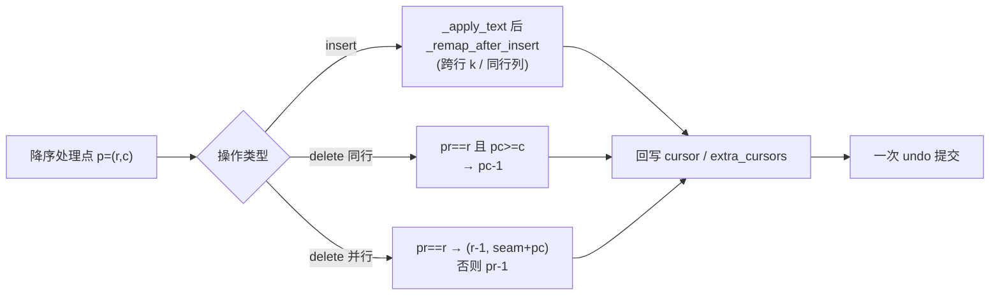
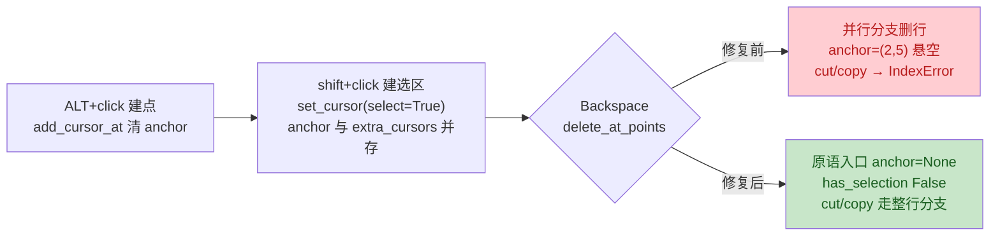

# multi-cursor 评审修复方案（PR !70 AI 队友评审）

> 来源评审记录：第二轮 [.trae/reviews/2026-10-10-pr70-multi-cursor-ai-review.md](../reviews/2026-10-10-pr70-multi-cursor-ai-review.md)
> （Gitee note 51507419：1 阻断 + 2 改进）；第三轮
> [.trae/reviews/2026-10-10-pr70-multi-cursor-selection-ai-review.md](../reviews/2026-10-10-pr70-multi-cursor-selection-ai-review.md)
> （Gitee note 51515103：1 阻断 + 3 改进，§七）。执行分支：`feat/multi-cursor`
> （worktree，续作复用其 `.venv`）。

## 一、目标与非目标

**目标**

1. **M1（阻断）**：`insert_at_points` / `delete_at_points` / `delete_forward_at_points`
   三个多点原语在后续操作使行号/列号平移时，重映射已记录的 `new_pos`，
   附加光标不再漂移；补钉住坐标的测试。
2. **O1（改进）**：`add_cursor_below` 语义核实（结论见 §三）——不改行为，
   docstring 注明不变量。
3. **O2（改进）**：`mouse_flows._on_down` 提取 `adds_point` 局部变量，行为零变化。

**非目标**

- 不做回写去重：重映射后两点收敛到同一位置时 `extra_cursors` 允许出现重复——
  `_multi_points()` 读取时去重，渲染端重复 range 同格同 id 无害，undo 恢复路径
  本就允许该形态（首轮 S-2 已登记）。保持最小改动。
- 不动首轮登记的 S-1/S-3/S-4/S-5（不在本轮评审范围）。
- 不改键位、动作、渲染与手册。

## 二、事实清单（调研取证）

- `yate/editor_core/buffer.py:626-706` 三个原语：降序处理保护未处理源位置，
  `new_pos` 只写不重映射。复现：三点 `(0,0)(1,0)(2,0)` 插 `"\n"`，
  附加光标回写 `(2,0)(3,0)`，正确 `(3,0)(5,0)`——评审 M1 属实。
- 同行列漂移（机器人未覆盖）：`"ABCDE"` 点 `(0,3)`+`(0,5)` 退格，
  `(0,5)` 记录 `(0,4)` 后 `(0,3)` 再删一格，`(0,4)` 失效（越界到 `len("ABD")` 之外）——
  **机器人的 `_shift_recorded`（只平行号）不足以修复 M1**。
- 渲染端直接消费原始 `extra_cursors`
  （`yate/editor_view/editor.py:387,565`），漂移位置会画出错位光标块，印证 high 风险。
- `add_cursor_below`（`buffer.py:312-327`）目标点行号 = 最低点行号 + 1，
  严格大于全部现存点行号（`_multi_points()` 已 clamp+去重）→ 重复结构上不可达。
- `yate/flows/mouse_flows.py:74,86`：`event.meta and not isinstance(keymap, VimKeymap)`
  重复计算两次，O2 属实。
- 既有测试基面：`tests/test_editor_core.py::TestMultiCursor` 19 例；
  其中 `test_insert_at_points_descending_order_with_newline` 只断言行内容、未断言坐标
  （正是 M1 漏网原因），不得改动其函数体（首轮 W-1 教训），新增独立用例。

## 三、备选方案与否决理由

**M1 重映射策略**

- **方案 A（采纳）：逐操作精确重映射**。每个原语在自己的操作分支后内联重映射
  `new_pos`，规则由该操作对文档的确切效应推导（见 §四规则表）；插入的重映射逻辑
  最复杂（跨行/同行 × 单行/多行文本 4 象限），抽为模块级纯函数 `_remap_after_insert`。
- 方案 B（否决）：机器人建议的统一 `_shift_recorded(new_pos, r, c, delta)` 只平移行号，
  无法处理同行列平移（事实清单第 2 条反例），照抄会留下半修状态。
- 方案 C（否决）：改为升序处理 + 重映射未处理源位置——对称问题同样要重映射，
  且推翻既有降序设计与其 19 例测试基面，改动面更大。
- 方案 D（否决）：内容标记追踪（sentinel 字符）——侵入文本内容，污染 undo 快照
  与 LSP 同步，复杂度不成比例。

**O1**

- 机器人建议的去重检查（否决）：目标行严格大于全部现存点行号，检查永不触发，
  属死分支且成为分支覆盖永久空洞。
- 采纳：docstring 注明「目标行 = 最低点行 + 1，故无需去重」的不变量说明。

**重映射正确性要点（降序处理下的不变量）**

- `insert_at_points`：处理到 `(r,c)` 时已记录键的行号 `pr ≥ r`；同行的 `pc > c`。
- `delete_at_points` 并行（`(r,0)` 并入上一行）：已记录键 `pr ≥ r`
  （同行 `(r,c0>0)` 与更下行先处理）；`pr == r` 的点随行内容并入 `(r-1, seam+pc)`，
  `pr > r` 上移一行。连接点自身记录的 `(r-1, seam)` 由后续同行操作的重映射接管。
- `delete_forward_at_points` 并行（`(r,len)` 并入下一行）：已记录键 `pr ≥ r+1`；
  `pr == r+1` 并入 `(r, c+pc)`，`pr > r+1` 上移一行；自身记录 `(r, c)` 同理由
  后续同行操作接管。

## 四、分步实施

### 步骤 1：M1 — buffer.py 重映射 + 钉点测试

输入：§二事实与 §三方案 A 规则表。改动文件：

- `yate/editor_core/buffer.py`
  - 新增模块级纯函数 `_remap_after_insert(new_pos: dict[Pos, Pos], pos: Pos, parts: list[str]) -> None`：
    对已记录 `(pr, pc)`：`pr < r` 或（`pr == r` 且 `pc < c`）→ 不变；`pr > r` →
    `(pr+k, pc)`；`pr == r` 且 `k == 0` → `(r, pc + len(parts[0]))`；
    `pr == r` 且 `k > 0` → `(r+k, pc - c + len(parts[-1]))`（`k = len(parts) - 1`）。
    `insert_at_points` 每次 `_apply_text` 后调用。
  - `delete_at_points`：同行删除分支后 `pr == r and pc >= c → (r, pc-1)`；
    并行分支后 `pr == r → (r-1, seam+pc)`、否则 `pr → pr-1`（else 形态，
    避免不可达分支造成覆盖空洞）。
  - `delete_forward_at_points`：同行删除分支后 `pr == r and pc > c → (r, pc-1)`；
    并行分支后 `pr == r+1 → (r, c+pc)`、否则 `pr → pr-1`。
  - 三个原语 docstring 各补一句重映射说明；`add_cursor_below` docstring 注明
    O1 不变量。
- `tests/test_editor_core.py`：新增 6 例（不动既有函数体），全部断言
  `cursor` / `extra_cursors` 坐标与 `lines`：
  1. `test_insert_at_points_newline_remaps_recorded_positions`——机器人原始复现：
     三点插 `"\n"` → `(1,0)/(3,0)/(5,0)`；
  2. `test_insert_at_points_remaps_recorded_row_on_same_row_split`——同行两点插
     `"X\nY"`，先行记录随后续同行分裂下移一行；
  3. `test_delete_at_points_remaps_same_row_recorded_column`——同行两点退格，
     先记录列号随删除左移（`(0,4)→(0,3)`）；
  4. `test_delete_at_points_join_remaps_recorded_points`——并行 + 同行 + 下行三点
     组合，覆盖 `pr == r` 与 `pr > r` 两支；
  5. `test_delete_forward_at_points_join_remaps_recorded_points`——同行 + 并行 +
     下下行组合，覆盖 `pr == r+1`、`pr > r+1` 与同行接管并行自身记录；
  6. `test_delete_forward_at_points_remaps_same_row_recorded_column`——同行两点前删。

输出：`pytest tests/test_editor_core.py -q` 全绿（新增 6 例通过、既有 19 例不回归）；
`pytest tests/test_editor_core.py --cov=yate/editor_core --cov-branch --cov-report=term-missing`
中 buffer.py 新增分支无 missing。

验收命令（worktree 内）：

```powershell
.venv\Scripts\python.exe -m pytest tests/test_editor_core.py -q
.venv\Scripts\python.exe -m pyright yate/editor_core/buffer.py
```

提交：`fix(editor-core): remap recorded multi-point positions after shifts`

### 步骤 2：O2 — mouse_flows.py 提局部变量

输入：`yate/flows/mouse_flows.py:65-87`。改动：`_on_down` 提取
`adds_point = event.meta and not isinstance(keymap, VimKeymap)`，
分支条件与 `self._dragging = not adds_point` 复用；行为零变化，
既有鼠标测试（`tests/test_mouse_flows.py` 等）回归即验收。

验收命令：

```powershell
.venv\Scripts\python.exe -m pytest tests/test_mouse_flows.py -q
.venv\Scripts\python.exe -m pyright yate/flows/mouse_flows.py
```

提交：`refactor(flows): extract adds_point local in mouse down`

### 步骤 3：收尾门禁 + 文档回填

- 全量门禁（worktree `.venv`，先自证沙箱
  `.venv\Scripts\python.exe -c "import yate; print(yate.__file__)"` 指向 worktree）：

```powershell
.venv\Scripts\python.exe -m pyright yate/ tests/ tools/
.venv\Scripts\python.exe -m pytest tests/ -q
.venv\Scripts\python.exe -m pytest tests/test_architecture.py -q
.venv\Scripts\python.exe -m pytest tests --cov=yate --cov-branch --cov-report=term-missing --cov-fail-under=75
.venv\Scripts\python.exe -m tools.smoke_test run --no-color --fail-only
```

- 回填本方案 §五执行记录与评审记录处置列（M1/O1/O2 落地结果），
  提交 `docs(plans): backfill the multi-cursor review fix results`。

## 五、执行记录（收尾回填）

- 步骤 1：**完成**（commit `30f82e4`）。`_remap_after_insert` + 三原语重映射落地；
  新增 7 例测试（计划 6 例 + 计划外 1 例空文本卫语句），`tests/test_editor_core.py`
  全绿（exit 0）；pyright `buffer.py` + `test_editor_core.py` 0 诊断。
- 步骤 2：**完成**（commit `5d3c83a`）。`adds_point` 局部变量提取，行为零变化；
  `test_app_mouse.py` / `test_support_mouse.py` / `test_action_table.py` 全绿（exit 0）；
  pyright `mouse_flows.py` 0 诊断。
- 步骤 3（全量门禁，worktree `.venv` 沙箱自证指向 worktree）：

| 命令 | 结果 | 退出码 |
|---|---|---|
| pyright yate/ tests/ tools/ | 0 errors, 0 warnings, 0 informations | 0 |
| pytest tests/ -q | 全绿 | 0 |
| pytest tests/test_architecture.py -q | 28 passed | 0 |
| pytest tests --cov=yate --cov-branch --cov-fail-under=75 | TOTAL 92%（91.54%），达标 | 0 |
| tools.smoke_test run --no-color --fail-only | 109/109 场景、1323/1323 checks | 0 |

- 偏离记录（均附实测依据）：
  1. `_remap_after_insert` 落地为两分支形态（`pr > r` 平行 / 否则同行右移），
     未实现方案规则表的 `pr < r`、`pc < c` 守卫与 `k>0 且 pr == r` 象限——
     降序不变量下三者不可达（多行文本的返回位置必在编辑行之下，同行记录只来自
     单行文本），保留即死分支 + 覆盖空洞（首轮 W-2 同型问题）；行为与规则表等价，
     buffer.py 分支覆盖实测无新增空洞（92%，缺行均为未触碰的既有分支）。
  2. 三个原语统一「先重映射已记录项、后记录本点位置」的次序：并行/前删分支若先记录，
     本点位置会被本操作二次平移（实施细化，方案未显式写明次序）。
  3. 计划外新增 `test_insert_at_points_empty_text_is_noop`：首轮 W-2 登记过的
     空 text 卫语句覆盖缺口，本次顺手闭合。
  4. 计划 §四第 4/5 例由三点扩为四点组合：一并覆盖「并行操作自身记录的位置
     被后续同行操作接管」路径（该路径经手工推演确认存在，原三点场景不经过）。

### 第二轮：专家复审处置（2026-10-10）

代码复审（逐分支推演 + 归纳证明 + 门禁实测）结论为 MINOR ISSUES：M1 重映射算术
正确、重映射与记录次序正确、四项偏离登记获认可；另报 1 WARNING + 2 建议，
经用户确认后全部处置：

1. WARNING（体量豁免登记失真）→ 修复。§三.7 正式豁免枚举原缺
   `editor_core/buffer.py`，且行数停在 994（复审实际 1051）。已将 buffer.py
   列入规则文本正式名单（1051 行，文本模型/撤销/多点原语单一职责）并同步口径
   注记；`SIZE_EXEMPT_FILES` 已含该键，无需改。核对更正：复审报告称"规则文本
   两处均未更新"部分过时——994 复测注记已在（合并后核验），真实缺口是正式
   枚举缺失与修复后行数过期。
2. 建议（`_remap_after_insert` else 分支写死 `r`）→ 修复。改用 `(pr, pc +
   len(parts[0]))`：降序不变量下 `pr == r` 恒成立，行为零变化，消除对
   "不变量永不被侵蚀"的隐性耦合。
3. 建议（连续 join 重映射链路无测试）→ 修复。补 2 例：
   `test_delete_at_points_consecutive_joins_fold_join_records` 与
   `test_delete_forward_at_points_consecutive_joins_fold_join_records`——
   第一个 join 的接缝记录被第二个 join 再次折叠/接管（backspace `pr == r`
   折叠、forward `pr == r+1` 折叠），期望值经手工推演验证。

复审后全量门禁复跑（worktree，含 master 合并 `dfaebca` 后状态）：

| 命令 | 结果 | 退出码 |
|---|---|---|
| pyright yate/ tests/ tools/ | 0 errors, 0 warnings, 0 informations | 0 |
| pytest tests/ --cov=yate --cov-branch --cov-fail-under=75 | 全绿，TOTAL 92%（91.56%），buffer.py 保持 99% | 0 |

复审报告曾建议的拆分路线（多点原语拆 `editor_core/multi_cursor.py`）未采纳：
本轮按"登记豁免"处置，拆分属结构性立项，与首轮对该建议的否决理由一致。

## 六、风险与回滚

| 风险 | 缓解 |
|---|---|
| 重映射规则在尖锐场景（相邻点、多点收敛、`(0,0)`/末行 no-op 混合）出错 | §四 6 例钉点 + 既有 19 例回归 + 冒烟 `vim_multi_cursor_ops` / `vsc_multi_cursor_mouse`；规则表逐象限手工推演过 |
| 并行分支自身记录位置依赖后续同行操作接管，理解成本高 | docstring 与行内注释写明不变量（降序下已记录键行号下界） |
| undo 快照路径受影响 | 不触碰 `_snapshot`/`_restore`；`test_undo_restores_extra_cursors_clamped_after_shrink` 等既有用例回归背书 |

回滚：三笔提交各自独立可 `git revert`；步骤 1 与步骤 2 无文件交集。



## 七、第三轮：PR !70 AI 队友评审（note 51515103）

> 来源：[.trae/reviews/2026-10-10-pr70-multi-cursor-selection-ai-review.md](../reviews/2026-10-10-pr70-multi-cursor-selection-ai-review.md)（2026-10-10 登记）。

### 7.1 目标与非目标

**目标**

1. **M2（阻断）**：选区与附加光标并存时，三个多点原语在删行后留下悬空
   `anchor`，`cut`/`copy` 经 `selected_text()`/`yank_selection()` 对越界行取索引
   抛 `IndexError`。修复：三原语入口显式清除主选区，把「选区轴与附加光标轴
   互斥」不变量从进入瞬间（`add_cursor_at`/`add_cursor_below`）贯穿到编辑期；
   补崩溃路径回归用例。
2. **O3（改进）**：`_remap_after_insert` docstring 末句改写为准确描述
   （重映射对象是更早迭代的记录项），纯注释零行为。
3. **O4（改进）**：`actions.py` 的 `newline`/`delete_backward`/`delete_forward`
   三元 lambda 落具名函数；`add_cursor_below` 返回值统一 None。行为零变化
   （`registry.execute` 契约本就丢弃 handler 返回值，`registries.py:65-71`）。
4. **O5（改进）**：`keymaps/vim.py` 的 `<alt-c>` help 条目补 help-only 注释，
   纯注释零行为。

**非目标**

- 不给 `cut`/`copy`/`selected_text` 加守卫或 clamp：M2 从状态制造处根治后
  悬空 anchor 不再存在，消费口防御属掩盖（见 7.3 否决）。
- 不改多点模式下的 `cut`/`copy` 语义（无选区时整行操作的现状行为保持）。
- 不动 mouse_flows 点击分支（shift+click 建选区不清 `extra_cursors` 是
  合理交互：点收拢由 plain click 分支负责）。

### 7.2 事实清单（第三轮调研取证）

- 并存可达：`yate/flows/mouse_flows.py:82-84`——非 meta 的 shift+click 走
  `set_cursor(pos, select=True)` 只设 `anchor`（`buffer.py:369-371`），不清
  `extra_cursors`；ALT+click 建点后 shift+click 即两轴并存。
- 原语不清 anchor：`yate/editor_core/buffer.py:649/681/723` 三个原语区间内
  无任何 `self.anchor` 赋值（Grep 全量取证）；`delete_at_points` 并行分支
  （`:700-711`）删行只重映射 `new_pos`。
- 崩溃链：`has_selection()`（`buffer.py:281`）只比 `anchor != cursor`；
  `selected_text()`（`:295-300`）直接索引 `self.lines[r1]` 无 clamp；
  `yank_selection()`（`:921-922`）同路径；`actions.py:148/165` 的 cut/copy
  仅判 `has_selection()`。复现：三行文档、三点 `(0,0)(1,0)(2,0)`、
  `anchor=(2,5)`、`delete_at_points()` → 行 2/1 被删剩 1 行 →
  `Ctrl+X` → `lines[2]` IndexError。
- undo 联动：`_snapshot`/`_restore`（`buffer.py:194-203`）记录并恢复
  anchor——清 anchor 必须在 `_snapshot()` 之前，否则 undo 复活悬空选区。
- O3：`_remap_after_insert` docstring 末句（`buffer.py:74-75`）与
  `insert_at_points` 循环（`:672-675`，`_apply_text` 得 recorded → remap →
  写入 `new_pos[pos]`）表述歧义。
- O4：`actions.py:36-63` 三个三元 lambda；`:119-123` `add_cursor_below`
  返回 bool；同文件 `cut`/`copy`（`:136-171`）/`_clear_selection`（`:125-127`)
  为具名函数范式。plan-c §五风险表（`multi-cursor-plans/multi-cursor-actions-mouse-plan-c.md:162`）
  预设：「若超 100 列或评审认为难读，落成模块级 `_newline(ctx)` 函数」。
  `registry.execute`（`registries.py:65-71`）丢弃 handler 返回值——
  `test_action_table.py:276` 的 `is True` 断言的是注册存在性，O4 无连带改动。
- O5：`keymaps/vim.py:171-174` help 条目无注释；`:458-460` `_handle_normal`
  硬编码 `if key == "\x1bc"` 分支（带行为注释）。
- 测试基面：`tests/test_editor_core.py::TestMultiCursor`（`:1331` 起，
  `_buffer()` 三行样本），上轮后共 19+9+2 例全绿。

### 7.3 备选方案与否决理由

**M2 修复点**

- **方案 A（采纳）：三原语入口清 anchor**。在 `_ensure_writable()` 之后、
  `_snapshot()` 之前各加一行 `self.anchor = None`。不变量在状态制造处闭环，
  一次修复覆盖全部现有与未来消费者（cut/copy/delete_selection/渲染）；
  undo 快照记录的是清后状态，不复活悬空选区。
- 方案 B（否决）：cut/copy 加 `has_extra_cursors()` 守卫——只堵两个消费口，
  悬空 anchor 状态本身仍在（渲染端 `selected_rows` 等同样可触达），
  防御点错位。
- 方案 C（否决）：`selected_text()`/`yank_selection()` 行号 clamp——掩盖
  状态腐烂，治标不治本。

**O4 形态**

- 采纳：populate 内具名函数 `_newline` / `_delete_backward` /
  `_delete_forward` / `_add_cursor_below`（与既有 `cut`/`copy`/
  `_clear_selection` 同风格；plan-c 写"模块级"与"与 cut/copy 同风格"并举，
  跟随现实范式落 populate 内）。
- 否决：仅给 add_cursor_below 加 `-> None` 包装而保留三个三元 lambda——
  评审指出的可读性问题未解决，半修。

**M2 状态流**



### 7.4 分步实施

#### 步骤 1：M2 — buffer.py 三原语入口清 anchor + 回归用例

改动文件：

- `yate/editor_core/buffer.py`：`insert_at_points` / `delete_at_points` /
  `delete_forward_at_points` 在 `self._ensure_writable()` 之后、
  `points = self._multi_points()` 之前插入 `self.anchor = None`；
  三个原语 docstring 各补一句选区互斥说明。
- `tests/test_editor_core.py`（`TestMultiCursor` 内新增 2 例，不动既有用例）：
  1. `test_delete_at_points_clears_stale_anchor_before_join`——评审原始崩溃
     路径：三点 + 手工设 `anchor=(2,5)`，backspace join 后断言
     `anchor is None`、`selected_text() is None`、`yank_selection()` 正常返回
     整行文本（修复前此调用 IndexError）；
  2. `test_multi_point_primitives_clear_selection_anchor`——设 anchor 后分别
     调 `insert_at_points` 与 `delete_forward_at_points`（并行删行路径），
     断言 anchor 被清，钉住三原语入口统一不变量。

验收：

```powershell
.venv\Scripts\python.exe -m pytest tests/test_editor_core.py -q
.venv\Scripts\python.exe -m pyright yate/editor_core/buffer.py tests/test_editor_core.py
```

提交：`fix(editor-core): clear stale selection anchor at multi-point entry`

#### 步骤 2：O3 — _remap_after_insert docstring 改写

改动：`yate/editor_core/buffer.py:74-75` 末句改为
"Remaps entries recorded by *earlier* loop iterations; the caller writes
*pos*'s own entry right after."（与循环实际次序一致）。纯注释。

验收：步骤 1 的 pytest 命令回归全绿。提交：
`docs(editor-core): clarify insert remap docstring wording`

#### 步骤 3：O4 — actions.py 具名函数

改动：`yate/actions.py` editing 区块 def 前置 `_newline` / `_delete_backward`
/ `_delete_forward`（`ctx: ActionContext` 注解、返回 None、内部 if/else 分派
多点原语或单光标方法）；selection 区块 `_add_cursor_below` 丢弃 bool 返回。
四个 reg 调用改传具名函数，描述文案不变。

验收：

```powershell
.venv\Scripts\python.exe -m pytest tests/test_action_table.py -q
.venv\Scripts\python.exe -m pyright yate/actions.py
```

提交：`refactor(actions): name the multi-cursor dispatch handlers`

#### 步骤 4：O5 — vim.py help-only 注释

改动：`yate/keymaps/vim.py:171` KeyBinding 上方加两行注释：help-only 条目、
真实分发在 `_handle_normal` 硬编码 `\x1bc` 分支（NORMAL 静默）。纯注释。

验收：`pytest tests/test_vim_keymap.py -q`（如文件名不符则跑 keymaps 相关
测试文件）全绿。提交：`docs(keymaps): mark alt-c help entry as help-only`

#### 步骤 5：收尾门禁 + 文档回填

全量门禁（worktree `.venv`）：

```powershell
.venv\Scripts\python.exe -m pyright yate/ tests/ tools/
.venv\Scripts\python.exe -m pytest tests/ -q
.venv\Scripts\python.exe -m pytest tests/test_architecture.py -q
.venv\Scripts\python.exe -m pytest tests --cov=yate --cov-branch --cov-report=term-missing --cov-fail-under=75
.venv\Scripts\python.exe -m tools.smoke_test run --no-color --fail-only
```

回填本 §7.5 执行记录与第三轮评审记录处置列，提交：
`docs(plans): backfill the multi-cursor round-3 review results`

### 7.5 执行记录（收尾回填）

- 步骤 1（M2）：**完成**（commit `370bbd5`）。三原语入口（`_ensure_writable`
  后、`_snapshot` 前）统一 `self.anchor = None` + 三处 docstring 互斥说明；
  新增 2 例回归用例（崩溃路径 + insert/forward 入口清理），`tests/test_editor_core.py`
  全绿（exit 0），pyright `buffer.py` + `test_editor_core.py` 0 诊断。
- 步骤 2（O3）：**完成**（commit `5ca3b34`）。docstring 末句改写，回归全绿。
- 步骤 3（O4）：**完成**（commit `ffd4c9a`）。`_newline` / `_delete_backward` /
  `_delete_forward` / `_add_cursor_below` 具名函数落地，`test_action_table.py`
  全绿（exit 0），pyright `actions.py` 0 诊断。
- 步骤 4（O5）：**完成**（commit `77e823a`）。help-only 注释落地，
  `test_vim_keymap.py` 全绿（exit 0）。
- 步骤 5（全量门禁，worktree `.venv` 沙箱自证指向 worktree）：

| 命令 | 结果 | 退出码 |
|---|---|---|
| pyright yate/ tests/ tools/ | 0 errors, 0 warnings, 0 informations | 0 |
| pytest tests/ -q | 2111 passed, 9 skipped | 0 |
| pytest tests/test_architecture.py -q | 28 passed | 0 |
| pytest tests --cov=yate --cov-branch --cov-fail-under=75 | TOTAL 92%（91.54%），buffer.py 99%（缺行均为既有未触分支），达标 | 0 |
| tools.smoke_test run --no-color --fail-only | 109/109 场景、1323/1323 checks | 0 |

- 偏离记录：无实质偏离。一处实施细化：`insert_at_points` 的 `self.anchor = None`
  落在空文本 no-op 检查**之后**（仍在方案写明的 `_ensure_writable` 后、
  `_multi_points` 前区间内）——空插入零副作用，不清理状态。

### 7.6 风险与回滚

| 风险 | 缓解 |
|---|---|
| 原语入口清 anchor 改变既有用例预期（undo 恢复/选区交互） | 既有 30 例 TestMultiCursor 回归 + 2 例新用例；`_snapshot` 在清后拍摄，undo 语义自洽 |
| O4 具名函数改动触碰动作表注册面 | `test_action_table.py` 既有断言（含 `execute is True` 注册存在性）回归；行为零变化 |
| 清 anchor 后多点模式下 cut/copy 语义被质疑 | 非目标明确：保持无选区整行操作现状；互斥不变量与 `add_cursor_at` docstring 既有声明一致 |

回滚：四个修复提交各自独立可 `git revert`；步骤 1-4 文件交集仅 buffer.py
（步骤 1/2，纯注释可合并回滚）。

## 八、第四轮：PR !70 AI 队友评审（note 51515577）

> 评审记录：[2026-10-10-pr70-multi-cursor-doc-hygiene-ai-review.md](../reviews/2026-10-10-pr70-multi-cursor-doc-hygiene-ai-review.md)
> （3 个可维护性改进项 O6/O7/O8，无阻断，low 风险；用户指令明确"按建议逐项
> 修正 → 回填 → 单笔提交"，指令链即为批准，简化闭环不设 NotifyUser 环节。）

### 8.1 目标与非目标

目标：
1. O6：规则文本两处 `buffer.py` 豁免登记行数按实测回填；
2. O7：`delete_forward_at_points` docstring 超长单行折行（≤88 列）；
3. O8：`mouse_flows.py` else 分支补 vim meta-click 意图注释。

非目标：任何行为变更（三项均为纯文档/注释）；§五 的 994/1051 历史执行
记录保留不改。

### 8.2 事实清单（第四轮调研取证）

- `buffer.py` 实测 `splitlines()` = 1061（评审时点；master 合并 `eaa5dbc`
  + 第三轮 docstring 修正后）——机器人报的 948 基于 master 合并前快照，
  同样失真；规则文本 `:181` 登记的 1051 亦为过时值。
- `buffer.py:735`「remapped through each later deletion …」一段挤成
  ~150 列超长单行，核实属实（第三轮编辑继承的既有长行）。
- `mouse_flows.py:81-84` else 分支：vim 模式 meta-click 因 `meta=True`
  落入不加也不清点路径（与首轮 S-3 已知非目标一致），无注释说明，核实属实。
- O7 折行使 `buffer.py` 增一行 → 修正后复测定稿 1062（splitlines 口径）。

### 8.3 分步实施（机械修正，单笔提交）

1. O6：`architecture-boundaries.md` 正式名单（1051→终态 1062）与口径
   注记（追加第四轮复测链 1061→O7 折行 +1→1062）；
2. O7：docstring 该句折为三行，最长 81 列；
3. O8：else 分支头部补两行注释（采纳机器人措辞）；
4. 覆盖改动面验证 + 回填本节 + 单笔提交。

### 8.4 执行记录（收尾回填）

- O6：**完成**。正式名单与口径注记两处按终态 1062 回填（评审时点 1061、
  O7 折行增一行）；评审记录 O6 处置列同步终态表述。
- O7：**完成**。折为三行，最长 81 列；`buffer.py` 由 1061 → 1062 行。
- O8：**完成**。两行注释落地（vim 多光标仅来自 ALT+C、meta-click 有意
  保持单光标）。
- 验证（覆盖改动面）：

| 命令 | 结果 | 退出码 |
|---|---|---|
| pyright yate/editor_core/buffer.py yate/flows/mouse_flows.py | 0 errors, 0 warnings, 0 informations | 0 |
| pytest tests/test_editor_core.py tests/test_app_mouse.py tests/test_support_mouse.py tests/test_architecture.py | 193 passed, 1 skipped | 0 |

- 偏离记录：O6 登记数字未按评审时点 1061 定稿，而是按 O7 折行后的终态
  1062——规则 §三.7 要求"修改文件时须同步更新行数"，O7 增行后 1061 立即
  失真；口径注记保留 1061 复测链以留痕。

### 8.5 风险与回滚

| 风险 | 缓解 |
|---|---|
| 行数登记与后续演进再失真 | 口径注记保留复测链（994→1051→1061→1062），后续复核有据 |
| 纯注释改动影响行为 | 零：pyright + 相关测试回归全绿 |

回滚：单笔提交可整体 `git revert`。
