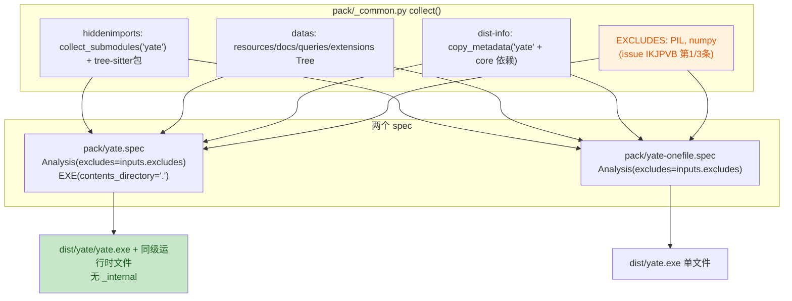
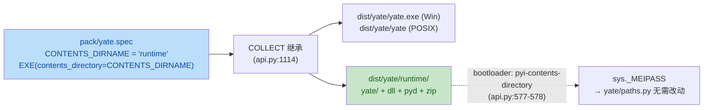

# pack-bundle-layout-plan（issue IKJPVB：打包产物瘦身 + 单目录扁平布局）

> 任务关键字：新 issue IKJPVB《ENH - 打包ISSUE和优化》
> 分支 / worktree：`enh/pack-bundle-layout` / `../yate-pack-bundle-layout`
> 状态：执行中（本文档为唯一事实来源，实时回填）

## 一、目标与非目标

### 目标（issue 原文两条）

1. **Pillow 不再进包**：单目录构建里 `PIL/` 占 13.1 MiB / 60.6 MiB（21.6%），
   却在运行时从未被 yate 使用——必须从打包依赖中检测出来并移除。
2. **单目录构建不再出现 `_internal`**：入口程序 `yate.exe` 与其余运行时文件同级。
3. **单文件构建同样做依赖检测与移除**（issue 第三段）。

### 非目标

- 不改动 `yate/` 产品源码，不改运行时行为（纯构建期变更）。
- 不追砍 `libcrypto-3.dll` / `libssl-3.dll`（5.9 MiB）——它们由 stdlib
  `_ssl` / `_hashlib` 带入，删除风险大于收益（见 §五 风险 R3）。
- 不改 CHANGELOG（由 `python -m tools.changelog generate` 从提交历史生成，
  手改会被 `tools.changelog check` 判为陈旧）。

## 二、事实取证（`文件:行号` / 实测）

| # | 事实 | 证据 |
|---|---|---|
| F1 | 两个 spec 的 `Analysis(excludes=[])` 均为空 | `pack/yate.spec:55`、`pack/yate-onefile.spec:64` |
| F2 | 单目录产物布局为 `dist/yate/{yate.exe, _internal/…}` | 实测 `Get-ChildItem dist/yate`（基线构建） |
| F3 | `_internal` 由 PyInstaller ≥6 的 `contents_directory` 默认值产生；传 `"."` 即退回旧式扁平布局，`COLLECT` 从 `EXE` 继承该值 | `.venv/Lib/site-packages/PyInstaller/building/api.py:448`（默认 `"_internal"`）、`:501-508`（`""`/`"."` → `None`）、`:1114`（`COLLECT` 继承）、`:1186`（`dest_path` 拼接） |
| F4 | `PIL` 由 `pygments.formatters.img` 的 `try: from PIL import …` 拖进图 | `build/yate/xref-yate.html`（探针溯源：PIL.Image ← … ← `pygments.formatters.img` ← `pygments` ← `rich.*`/`textual.*`）；`warn-yate.txt:19,41-43` |
| F5 | yate 从不 import PIL：全仓唯一引用在图标生成脚本，且是动态 import | `tools/pack/icon.py:26,60`（`importlib.import_module`）；`pyproject.toml:95`（`build` extra 注释明确"构建可执行程序时不需要它"） |
| F6 | 排除 PIL 运行时安全：`pygments.formatters.img` 用 `try/except ImportError` 包裹 | `.venv/Lib/site-packages/pygments/formatters/img.py:21-25` |
| F7 | 基线体积（本 worktree，含 24 个 grammar 包）：`_internal` 共 **60.6 MiB / 334 文件**，其中 `PIL/` **13.1 MiB / 7 文件** | 基线构建实测（`python -m PyInstaller --noconfirm --clean --distpath dist --workpath build pack/yate.spec`，退出码 0，`dist\yate\yate.exe --version` → `yate 0.2.9`） |
| F8 | `pyinstaller>=6.0` 已是 `build` extra 的下限，能力覆盖 F3 | `pyproject.toml:95` |
| F9 | `pack/` 不在 pyright 的 include 范围（`include = ["yate","tools","tests"]`），因此构建期脚本不受 pyright strict 门禁约束 | `pyproject.toml:100-107` |

## 三、备选方案与否决理由

### 3.1 「移除依赖」的实现方式

| 方案 | 结论 | 理由 |
|---|---|---|
| **A. 共享常量 `EXCLUDES` + 两个 spec 显式传给 `Analysis(excludes=…)`** | **采纳** | 与现有 `pack/_common.py` "共用步骤集中一次收集" 的设计一致（F9：`pack/` 不参与 pyright，改动面小）；清单与理由集中一处、两处构建同源生效，避免"只修一个 spec"的历史错位（正是 `pack/_common.py` 存在的理由） |
| B. 每个 spec 各写一份 `excludes=[...]` | 否决 | 两份清单必然漂移；违背 `_common.py` 的共享设计 |
| C. 写 PyInstaller hook（`hookspath`）做深度裁剪 | 否决 | 需要额外 hook 文件 + `hiddenimports` 联动，收益仅是省下 `pygments.formatters.img` 自身几十 KB；复杂度不划算 |
| D. 拆掉 pygments 依赖（`--exclude-module pygments`） | 否决 | pygments 是 `rich`/`textual` 的真实依赖（traceback 高亮等），误删会破运行时；issue 只点名 PIL |
| E. 每次构建跑一次"未用模块检测"自动生成 excludes | 否决 | 无可靠静态判据（PyInstaller 只能报 *missing*，无法证明 *unused*）；会把构建变成不确定过程。可用证据是 xref/warn 产物，取证后固化清单（即方案 A） |

### 3.2 「去掉 `_internal`」的实现方式

| 方案 | 结论 | 理由 |
|---|---|---|
| **A. `EXE(contents_directory=".")`** | **采纳** | PyInstaller 官方开关（F3），`COLLECT` 自动继承；bootloader 与 `sys._MEIPASS` 逻辑随之切回旧式扁平布局，无需自研后处理 |
| B. 构建后把 `_internal/*` 搬到 `dist/yate/` 再删空目录 | 否决 | 需在 spec 里写文件系统后处理逻辑，跨平台（win/linux）易碎；且 PyInstaller 的增量检查与产物校验会与之打架 |
| C. 改用 onefile 规避 | 否决 | onefile 每次启动解包、启动慢且更易被杀软拦（`pack/yate-onefile.spec:19-21` 已记录该权衡），不是"更扁平"的正解 |

## 四、分步实施计划

统一验收命令（在 worktree 根、PowerShell、`.venv\Scripts\python.exe` 解释器下执行）：

```powershell
.venv\Scripts\python.exe -m pyright yate/ tests/ tools/
.venv\Scripts\python.exe -m pytest tests/ -q
.venv\Scripts\python.exe -m pytest tests/test_architecture.py -q
```

| 步 | 输入 | 改动文件 | 输出 | 验收命令 |
|---|---|---|---|---|
| S1 | F1、F5、F6 | `pack/_common.py` | `EXCLUDES` 常量 + `SpecInputs.excludes` 字段 | `.venv\Scripts\python.exe -m pytest tests/test_pack_spec.py -q` |
| S2 | F2、F3、F8 | `pack/yate.spec` | `Analysis(excludes=inputs.excludes)`；`EXE(contents_directory=".")` | 同上 + 真实构建（见 S6） |
| S3 | issue 第三段 | `pack/yate-onefile.spec` | `Analysis(excludes=inputs.excludes)` | 同上 + 真实构建（见 S6） |
| S4 | S1-S3 的契约 | `tests/test_pack_spec.py`（新建） | 静态守卫：`_common.EXCLUDES` 含 `PIL`；两 spec 的 `Analysis` 均传 excludes 且非空字面量；单目录 spec 的 `EXE` 传 `contents_directory="."` | `.venv\Scripts\python.exe -m pytest tests/test_pack_spec.py -q` |
| S5 | issue 语义 | `README.md`、`README.zh.md` | 构建章节补"扁平布局"与"排除 Pillow/numpy"说明（双语同步） | 人工核对双语同义 |
| S6 | 全部 | 无（仅验证） | 单目录 + 单文件各一次真实构建，记录前后体积/文件数/布局 + `--version` 冒烟 | 见 §六 实测记录 |

S4 说明：守卫测试**不导入 PyInstaller**（`build` extra 不在 CI 的 dev 依赖里），
改为 `importlib` 直接加载 `pack/_common.py`（其顶层不 import PyInstaller）
+ `ast` 静态解析两个 spec，避免给 CI 引入新依赖。

## 五、风险清单与回滚

| # | 风险 | 缓解 | 回滚 |
|---|---|---|---|
| R1 | 排除 PIL 后运行时 `ImportError` | F6 已证 `pygments.formatters.img` 捕获 `ImportError`；F5 已证 yate 自身零引用；S6 用真实 exe `--version` + 启动冒烟验证 | 还原 S1 的 `EXCLUDES` 一行 |
| R2 | **已实证并已修复（见 §7.8）**：Windows 因 `.exe` 后缀而幸免，但 POSIX 上 exe 即 `dist/yate/yate`，与内置 `yate/` 包数据目录同名，`COLLECT.assemble` 的 `os.makedirs` 会抛 `SystemExit`（PyInstaller `api.py:1189-1194`） | 落地为平台条件式 `contents_directory="." if sys.platform == "win32" else "_internal"`（`api.py:529-532` 证明 `.exe` 仅在 `is_win or is_cygwin` 追加）；`tests/test_pack_spec.py` 钉住该三元形状 | 还原为 `contents_directory="."` 即回到缺陷态（守卫会红） |
| R3 | 诱人的 `libcrypto/libssl`（5.9 MiB）未砍 | 明确列为非目标；它们来自 stdlib ssl 栈，删除会波及 `hashlib`/LSP 相关路径 | — |
| R4 | 旧版 PyInstaller（<6.0）不识别 `contents_directory` | `build` extra 已锁 `pyinstaller>=6.0`（F8），该参数自 6.0 引入 | — |

整体回滚：`git revert` S1-S5 各自的提交（每步单独提交，便于定点回滚）。

## 六、流程图



```mermaid
sequenceDiagram
    participant U as 用户
    participant PS as pack/pack.ps1
    participant PY as PyInstaller
    participant C as pack/_common.py
    U->>PS: .\pack\pack.bat
    PS->>PY: -m PyInstaller pack/yate.spec
    PY->>C: import _common; collect(SPECPATH)
    C-->>PY: SpecInputs(excludes=[PIL, numpy], ...)
    PY->>PY: Analysis(excludes=...) → 无 PIL 依赖图
    PY->>PY: EXE(contents_directory=".") → 扁平 COLLECT
    PY-->>PS: dist/yate/yate.exe
    PS->>PS: Test-Path 产物 + 可选 --version 冒烟
```

## 七、执行记录（回填）

### 7.1 基线（改动前，worktree 内实测）

`python -m PyInstaller --noconfirm --clean --distpath dist --workpath build pack/yate.spec`（退出码 0，耗时 ~32 s）：

| 指标 | 基线值 |
|---|---|
| 单目录整包体积 | **68.4 MiB** |
| 文件数 | 341（`_internal` 334 + `yate.exe` 1 + 其它 6） |
| 布局 | `dist/yate/{yate.exe, _internal/…}` |
| `PIL/` | **13.1 MiB / 7 文件** |
| `_elementtree.pyd` | 132 KiB（由 PIL 侧引入） |
| 冒烟 | `dist\yate\yate.exe --version` → `yate 0.2.9 …`，退出码 0 |

### 7.2 S1-S3 + S6 实测（提交 `527a65c`）

单目录（`--distpath dist_new`，退出码 0，耗时 ~26 s）：

| 指标 | 基线 | 改后 | 变化 |
|---|---|---|---|
| 整包体积 | 68.4 MiB | **54.8 MiB** | **-13.5 MiB（-19.8%）** |
| 文件数 | 341 | **327** | -14 |
| 顶层结构 | `yate.exe` + `_internal/` | `yate.exe` + 54 个同级目录 + 65 个同级文件 | **`_internal` 消失** |
| `PIL/` | 存在 | **不存在**（`Test-Path dist_new\yate\PIL` → `False`） | 已移除 |
| `_elementtree.pyd` | 存在 | 不存在 | 随 PIL 一并消失 |
| 冒烟 | 通过 | `dist_new\yate\yate.exe --version` → `yate 0.2.9 …`，退出码 0 | 通过 |

单文件（issue 第三段）：

| 指标 | 基线（临时把 excludes 置空构建） | 改后 | 变化 |
|---|---|---|---|
| `dist*/yate.exe` | 26.6 MiB | **19.5 MiB** | **-7.1 MiB（-26.7%）** |
| 冒烟 | — | `--version` → `yate 0.2.9 …`，退出码 0 | 通过 |

> **验收环境：`win32`。** 上表全部数字只覆盖 Windows 构建。POSIX 侧的
> 平铺布局缺陷直到 §7.8 的第二轮审核才被发现并修掉——Windows 恰是唯一
> 不暴露该缺陷的平台（见 §五 R2），"在 Windows 上构建成功"不构成跨平台结论。

基线构建方式说明：单文件基线是**临时**把 `pack/yate-onefile.spec` 的 `excludes` 改回 `[]`
构建一次后立即还原（未提交），以保证与改后同环境、同版本、可直接比较。

### 7.3 步骤状态

- S1 `pack/_common.py`：`EXCLUDES = ("PIL", "numpy")` + `SpecInputs.excludes` → 完成（提交 `527a65c`）
- S2 `pack/yate.spec`：`excludes=inputs.excludes` + `EXE(contents_directory=".")` → 完成（提交 `527a65c`）
- S3 `pack/yate-onefile.spec`：`excludes=inputs.excludes` → 完成（提交 `527a65c`）
- S4 `tests/test_pack_spec.py`：10 个静态守卫 → 完成（提交 `9730874`）
- S5 `README.md` / `README.zh.md` 双语说明 + 订正过期的"约 16 MB" → 完成（提交 `d7f6a22`、`d25b111`）
- S6 真实构建与冒烟：完成（数字见 §7.2，最终代码复测见 §7.5）

### 7.4 子代理执行情况（如实记录）

| 成员 | 名下文件 | 落盘结果 | 主代理复核 |
|---|---|---|---|
| `pack-spec-tests` | `tests/test_pack_spec.py` | 有产出（214 行） | `pytest tests/test_pack_spec.py -q` → 10 passed；`pyright` → 0 errors。主代理另修一处 pyright `reportUnknownArgumentType`（`len()` 收到 `tuple[Unknown, ...]`）与 docstring 里的体积数字（60.6 → 68.4 MiB） |
| `pack-readme-docs` | `README.md`、`README.zh.md` | 有产出（双语各 3 段） | diff 复核通过；其上报的两项待裁决（过期"约 16 MB"、中文译法）由主代理改完并回执 |
| `pack-review` | 只读评审 | **有产出（延迟到达）**：首轮两次探活无回信，主代理按 §五.3 判死并自行评审（§7.6）；成员在团队回收后补发完整报告，报出 1 blocker + 3 major + 4 minor | 主代理逐条独立复核（§7.8），**blocker 属实并已修复**；报告本身是有效产出，"零产出"的初判按 §五.4 规则修正 |

### 7.5 最终代码复测（提交态）

以最终提交重新构建 `pack/yate.spec`（退出码 0）：`dist\yate\yate.exe` 存在、
`dist\yate\_internal` **不存在**、327 文件 / 54.8 MiB、`--version` 退出码 0
（与 §7.2 一致）。构建产物与临时探针脚本已清理，工作区仅剩方案文档的未提交回填。

### 7.6 审核结论（主代理自评，round 1）

对 `master...HEAD` 全量 diff 逐文件核对：

| 严重度 | 数量 | 说明 |
|---|---|---|
| blocker | 0 | — |
| major | 0 | — |
| minor | 2（已修） | ① `pack/_common.py` 注释里的"PIL 占 60.6 MiB 中的一部分"未写清 60.6 MiB 只是 `_internal` 目录、整包是 68.4 MiB，易误导；② `pack/yate.spec` docstring 折行被新插入段打断 |

排除项运行时安全性复核：`pygments/formatters.img` 的 PIL 导入在 `try/except ImportError`
内（`img.py:21-25`），yate 全仓零 PIL 静态引用（唯一引用 `tools/pack/icon.py` 为动态
import 且不在冻结入口内），最终产物 `--version` 冒烟通过 → 排除安全。

### 7.7 全量门禁（主代理亲跑，退出码 0）

| 门禁 | 结果 |
|---|---|
| `python -m pyright yate/ tests/ tools/` | **0 errors, 0 warnings, 0 informations** |
| `python -m pytest tests/ -q` | **1918 passed, 8 skipped**（4:11） |
| `python -m pytest tests/test_architecture.py -q` | **22 passed** |
| `python -m pytest tests --cov=yate --cov-branch --cov-fail-under=75` | **91.26%**（13126 语句 / 928 missing / 4368 分支 / 427 missing），阈值 75% 达标 |
| `python -m pytest tests/test_pack_spec.py -q` | 10 passed |

> 注：`pack/` 不在 `pyproject.toml` 的 pyright `include` 范围内（F9），其正确性由上述
> 真实构建 + `tests/test_pack_spec.py` 静态守卫共同覆盖。

### 7.8 第二轮审核（`pack-review` 报告 + 主代理复核，round 2）

评审成员在回收后补发完整报告：**1 blocker / 3 major / 4 minor**。主代理逐条独立复核：

| # | 严重度 | 结论 | 处置 |
|---|---|---|---|
| 1 | blocker | **属实**：`contents_directory="."` 在 POSIX 上使单目录构建必然失败 | 采纳方案 A，见下 |
| 2 | major | 属实：§五 R2 的乐观判断被推翻，且 S6 只验了 Windows | R2 已改写为实证结论；§7.2 加"验收环境 win32"警示 |
| 3 | major | 属实：守卫只钉字面量 `"."`，A 方案下会变红 | 守卫重写为三元形状断言（§7.9） |
| 4 | major | 属实：README quick-ref `~16 MB` 与正文 19.5 MiB 自相矛盾 | 已订正为 `~20 MB`（提交 `d25b111`） |
| 5 | minor | `numpy` 条目当前空转（构建环境未装 numpy） | `_common.py` 注释补"防御性"说明 |
| 6 | minor | 裸 `next()` 让守卫失败退化为 `StopIteration` | 改为带说明的 assert（`_functions` / `_returned_call`） |
| 7 | minor | 只查属性名不查宿主 | **不改**：keyword 改名会先被 `collect()` 守卫拦下，且"不绑死中间变量名"与本轮修复方向一致 |
| 8 | minor | `60.6 MiB`（`_internal` 口径）与 `68.4 MiB`（整包）并存易误读 | `_common.py` 注释注明口径 |

**blocker 的独立复核证据**（主代理亲读 PyInstaller 6.22.3 源码，非引用报告）：

- `building/api.py:529-532`：`.exe` 后缀在 `if is_win or is_cygwin:` 分支内追加
  → POSIX 上 exe 基名就是 `yate`，落在 `dist/yate/yate`；
- `building/api.py:1183-1194`：`EXECUTABLE` 走 `join(self.name, dest_name)`，
  其它走 `join(self.name, contents_directory or "", dest_name)`，随后
  `os.makedirs(dest_dir, exist_ok=True)`，捕获 `FileExistsError` 后
  `raise SystemExit("... there already exists a file at that path!")`
  → 数据项 `yate/resources` 要求 `dist/yate/yate/` 是目录，与 exe 撞名即中断；
- Windows 幸免的原因正是产物里 `yate`（目录）与 `yate.exe`（文件）并存。

**修复（方案 A，评审与主代理一致选定）**：`contents_directory="." if sys.platform == "win32" else "_internal"`。
`sys` 早已在 `pack/yate.spec:35` import，零新增依赖；POSIX 分支落在 PyInstaller 默认值上，
可单点回滚。否决的 B（改 exe 基名）会波及 `pack/pack.sh:107` 的 `artifact="dist/yate/yate"`、
`README.md:290` / `README.zh.md:307` 的产物承诺；C（改数据前缀）破坏 `yate.paths.package_root()` 语义。

### 7.9 平台条件式落地与守卫重写

四处联动修改（`pack/yate.spec` 三处 + `tests/test_pack_spec.py` 一处），按"两处文件编辑
连续完成、中间不跑任何命令"的协议执行，随后统一跑门禁：

1. `pack/yate.spec:81` → `contents_directory="." if sys.platform == "win32" else "_internal"`；
2. `pack/yate.spec` 行内注释 → 补平台限定与撞名原因；
3. `pack/yate.spec` 模块 docstring → 由"无条件平铺"改为"Windows 平铺 + POSIX 保留 `_internal`"；
4. `tests/test_pack_spec.py` → 守卫重写为四段断言：关键字必须显式存在 / 必须是
   `ast.IfExp` / `ast.unparse(test) == "sys.platform == 'win32'"` / `body == "'.'"` 且
   `orelse == "'_internal'"`；docstring 如实标注局限——**只证形状、不证分支语义**，
   POSIX 真实行为需一次 Linux 构建，CI 不具备该能力。

负向演练（主代理用真实守卫函数 + 内存合成 AST，5 组）：

| 输入形态 | 结果 |
|---|---|
| `contents_directory="." if sys.platform == "win32" else "_internal"` | ACCEPTED |
| `contents_directory="."`（修复前形态） | REJECTED：`must be a sys.platform conditional, got Constant` |
| `contents_directory="_internal"` | REJECTED：同上 |
| 两分支对调 | REJECTED |
| 删掉 `contents_directory` | REJECTED：`the one-folder build lost its layout choice` |

A 方案不改变 Windows 产物行为，故 §7.2 的体积/文件数/冒烟数字**无需复测**；
`README.md:290` / `README.zh.md:307` 承诺的 `dist/yate/yate` 在 A 下重新成立。

---

# 第二轮：统一布局与内容目录改名（issue note_51452120）

> 需求来源：issue IKJPVB 评论 note_51452120（Jermaine007，2026-10-06 08:19:31，
> 经 Gitee API 读取；网页版需登录才可见）。
> 原文：
>
> > 入口 `yate.exe` 和 `_internal` 其他文件平级
> > 由于在 Linux 下无法实现，保持 Windows 和 Linux 一致，只需要改 `_internal`
> > 名字，设计一个较好统一的 layout。
>
> 状态：已完成（2026-10-06；本文档为唯一事实来源，实测与偏离记录见 §9.2）

## 八、需求解读与目标

### 8.1 解读（这决定了实现形态，务必先对齐）

第一轮把 Windows 单目录产物做成**平铺**（`contents_directory="."`），POSIX 只能保留
PyInstaller 默认的 `_internal/`——两平台布局分叉。评论明确放弃平铺、改为
**两平台同一套布局**，手段是给内容目录换一个体面的名字：

```
dist/yate/                     <- 两平台顶层目录（不变）
├── yate.exe  /  yate          <- 入口（POSIX 无后缀，故 exe 独占顶层）
└── runtime/                   <- 统一命名的内容目录（原 _internal/）
    ├── yate/…                 <- yate 包数据（resources/docs/extensions…）
    ├── base_library.zip、python3xx.dll、*.pyd、tree-sitter 二进制…
```

要点：

1. **Windows 也回到内容目录结构**——平铺（`contents_directory="."`）在两平台上不再使用；
2. 目录名不得与 exe 基名 `yate` 相同，否则 `COLLECT` 撞名中断（F3 同款缺陷）；
3. 内容目录名变化**不影响运行时**：`yate/paths.py` 只认 `sys._MEIPASS`，
   而 PyInstaller 自己把 `_MEIPASS` 指向该内容目录（`api.py:577-578` 写
   `pyi-contents-directory <name>` TOC 选项）——已取证。

### 8.2 目标 / 非目标

目标：

- G1 单目录构建在 **Windows 与 POSIX 布局完全一致**（同一 exe 位置 + 同一内容目录名）；
- G2 内容目录名脱离 PyInstaller 默认的 `_internal`，取一个跨平台中性、体面、不与
  exe 基名冲突的名字；
- G3 布局契约有静态守卫钉住（目录名被改回 `_internal` / `"."` / `yate` 时守卫变红）；
- G4 三个打包脚本与 README 双语同步新布局，脚本对内容目录做存在性校验（布局漂移
  在脚本层就报错，而不是等用户拿到手）。

非目标：

- 不改 `yate/` 产品源码、不改运行时行为（`paths.py` 天然无关，见 F13）；
- 不改 onefile 产物（无内容目录概念，`test_exe_call_when_onefile_spec_parsed_omits_contents_directory`
  继续守着）；
- 不动 `pack.sh` / `pack.ps1` / `pack.bat` 的产物顶层路径（`dist/yate/…` 不变，只增加一层校验）；
- 不追砍 `libcrypto/libssl`（沿用 §一 非目标与 §五 R3）。

## 九、第二轮事实取证

| # | 事实 | 证据 |
|---|---|---|
| F10 | `contents_directory` 只允许**单层目录名**：`""`/`"."` = 平铺，`".."` 或含 `/`、`\` 直接 `SystemExit`，**其它任意名称合法** | `.venv/Lib/site-packages/PyInstaller/building/api.py:501-508` |
| F11 | 默认值 `"_internal"`，`COLLECT` 从 `EXE` 继承 | `api.py:448`、`api.py:1114` |
| F12 | 撞名条件只有一种：内容目录名 == exe 基名。`EXECUTABLE` 恒落在 `join(name, dest)`，其余落 `join(name, contents_directory, dest)` | `api.py:1183-1189` |
| F13 | 运行时资源定位与目录名解耦：bootloader 收到 `pyi-contents-directory <name>`，`sys._MEIPASS` 指向它；`yate/paths.py` 只读 `sys._MEIPASS` | `api.py:577-578`；`yate/paths.py:38-49` |
| F14 | 全仓唯一内容目录取值点是 `pack/yate.spec:92`；AST 守卫 4 处（docstring 2 处 + 断言 2 处）；README 双语各 1 段承诺"没有 `_internal`" | `search_content` 全仓检索（`_internal` / `contents_directory` / `dist/yate` 三轮，见 §9.1 影响面清单） |
| F15 | 三个打包脚本只校验 **exe 本身**（`pack.ps1:133`、`pack.sh:123`），无任何布局/内容目录断言 | `pack/pack.ps1:100-135`、`pack/pack.sh:94-126` |
| F16 | `tests/` 中除 `test_pack_spec.py` 外无打包布局断言（`test_paths.py` 只 monkeypatch `_MEIPASS`） | 全仓检索确认 |

### 9.1 影响面清单（改名必改 / 复核 / 不改）

| 类别 | 位置 |
|---|---|
| 必改 | `pack/yate.spec`（docstring `:8-19`、行内注释 `:84-91`、取值 `:92`）；`tests/test_pack_spec.py`（模块 docstring `:11-15`、守卫 `:443-468`）；`README.md:317-325`；`README.zh.md:329-335` |
| 复核措辞 | `pack/pack.ps1:8,107,153,185`、`pack/pack.sh:6,101,141,174`（路径不变，提示语可补内容目录） |
| 不改 | `pack/yate-onefile.spec`、`pack/_common.py`（`_MEIPASS` 语义与目录名解耦）；`CHANGELOG*` 与 `yate/resources/changelog.*`（历史条目）；`.trae/documents/dist-copy-plan.md:61`（陈旧示意，登记不回改） |
| 本轮新增 | `pack/pack.ps1`、`pack/pack.sh` 各加一处内容目录存在性校验（F15） |

## 十、第二轮方案选型

### 10.1 布局形态

| 方案 | 结论 | 理由 |
|---|---|---|
| **A. 两平台统一 `runtime/` 内容目录** | **采纳** | 评论直接要求"保持 Windows 和 Linux 一致，只需要改 `_internal` 名字"；F10/F12 证明除撞名外无其它约束 |
| B. Windows 平铺 / POSIX `runtime/` | 否决 | 正是评论否决的形态（布局继续分叉）；且第一轮已证明平铺在 POSIX 不可行 |
| C. 只在 POSIX 上改名，Windows 保持平铺 | 否决 | 同 B，且要维护两份分支语义 |
| D. 构建后把内容目录搬到顶层再改名 | 否决 | 第一轮已否决（文件后处理与 PyInstaller 增量检查打架，见 §3.2 B） |
| E. 改 exe 基名（如 `yate-bin`）换平铺空间 | 否决 | 波及 `pack.sh:101` / `README` 产物承诺与用户习惯；用户已明确放弃平铺 |

### 10.2 目录命名

| 候选 | 结论 | 理由 |
|---|---|---|
| **`runtime`** | **采纳** | 与仓库既有措辞（README "runtime files"）一致；跨平台中性；F10 合法；≠ `yate`（F12 无撞名）；短、无 `_` 私有暗示，比 `_internal` 体面 |
| `lib` | 否决 | 语义偏窄（内含 `.pyd`/`.zip`/`.dll`），且与 Unix 系统目录名撞概念 |
| `yate-runtime` | 否决 | 父目录已是 `yate/`，语义重复、冗长 |
| `_yate` | 否决 | 沿用下划线私有暗示，观感仍贴近默认 `_internal`，未解决"体面"诉求 |
| `_internal`（保持默认） | 否决 | 评论点名要换掉的名字 |

### 10.3 契约落点

`contents_directory` 只属单目录构建（onefile 用不到），因此常量落在
`pack/yate.spec` 顶层而非 `pack/_common.py`——放 `_common.py` 会给 `SpecInputs`
加一个 onefile 不消费的字段，与守卫
`test_spec_when_parsed_reads_every_spec_input_field`（两 spec 必须读全部字段）
直接冲突。命名沿用 `CONTENTS_DIRNAME`，`EXE(contents_directory=CONTENTS_DIRNAME)`。



## 十一、第二轮分步实施计划

验收命令（同 §四，在 worktree 根、PowerShell、`.venv\Scripts\python.exe` 下执行）：

```powershell
.venv\Scripts\python.exe -m pytest tests/test_pack_spec.py -q
.venv\Scripts\python.exe -m pyright yate/ tests/ tools/
.venv\Scripts\python.exe -m pytest tests/ -q
.venv\Scripts\python.exe -m pytest tests/test_architecture.py -q
.venv\Scripts\python.exe -m pytest tests --cov=yate --cov-branch --cov-fail-under=75
.venv\Scripts\python.exe -m PyInstaller --noconfirm --clean --distpath dist --workpath build pack/yate.spec
```

| 步 | 输入 | 改动文件 | 输出 | 验收命令 |
|---|---|---|---|---|
| S7 | F10-F12、§10 | `pack/yate.spec` | `CONTENTS_DIRNAME = "runtime"` + `EXE(contents_directory=CONTENTS_DIRNAME)`；docstring/行内注释改为"跨平台统一布局"并写明选名理由与回滚方式；删除 `sys.platform` 三元（`sys` 因 SPECPATH 段仍需 import） | `pytest tests/test_pack_spec.py -q` |
| S8 | G3 | `tests/test_pack_spec.py` | 替换 `test_exe_call_when_onefolder_spec_parsed_scopes_flat_layout_to_windows` 为：`test_exe_call_when_onefolder_spec_parsed_uses_the_named_contents_directory`（断言 `contents_directory` 是 `ast.Name(id="CONTENTS_DIRNAME")`，即不再是平台条件式）+ `test_contents_dirname_when_onefolder_spec_parsed_is_a_cross_platform_runtime_dir`（断言：单个字符串字面量赋值 / 非 `""` `"."` `".."` / 非 `_internal` / ≠ exe 基名 `yate` / 无路径分隔符 / `isidentifier()`）；同步模块 docstring；保留 onefile 无该开关的守卫 | 同上 + 负向演练（5 组形态） |
| S9 | G4、F15 | `pack/pack.ps1`、`pack/pack.sh`、`README.md`、`README.zh.md` | 两脚本在 one-folder 分支加内容目录存在性校验（`dist\yate\runtime` / `dist/yate/runtime`，缺失即报错退出）；README 双语把"Windows 平铺 / POSIX `_internal`"改写为统一布局并说明原因 | `python -m py_compile pack/yate.spec` exit 0；人工核对双语同义 |
| S10 | 全部 | 无（仅验证） | Windows 真实构建：exe 存在、`dist/yate/runtime/yate/resources/app.tcss` 存在、`dist/yate/_internal` 不存在、体积/文件数、`--version`（必要时 `--diag`）冒烟 | 退出码 0（数字回填 §9.2） |
| S11 | 全部 | 门禁 | pyright + 全量 pytest + 架构测试 + 覆盖率 → 0 诊断 | 见上 |

**子代理分工**：S8（`tests/test_pack_spec.py`）与 S9 的 README 双语部分
（`README.md` / `README.zh.md`）文件互不重叠，按 `subagent-workflow.md` 并行下发；
`pack/*.spec` 与 `pack/pack.*` 属构建期核心契约，由主代理直接改（成员不得改 `yate/`，
且这几处的正确性靠真实构建背书）。

## 十二、第二轮风险与回滚

| # | 风险 | 缓解 | 回滚 |
|---|---|---|---|
| RK1 | **POSIX 无本机验证**（本机 win32，CI 也不打 POSIX 包） | F10/F12/F13 已从 PyInstaller 源码证明：单层名合法、除撞名外无约束、且 `≠ yate` 无撞名；守卫钉住形状与取值；真实 Linux 构建的人工动作登记为遗留项 | — |
| RK2 | Windows 布局变化（平铺 → 多一层 `runtime/`），与第一轮 issue 原文"平铺"诉求相反 | 依据是评论的显式取舍；README 双语写明原因；改回只需把 `CONTENTS_DIRNAME` 设为 `"."`（仅 Windows 可用，POSIX 会撞名失败） | 还原 S7 的常量一行 |
| RK3 | 用户已分发的旧布局（平铺）无法原地升级 | 属预期：布局是打包产物契约，非运行期兼容面；README 说明"整目录一起拷贝" | — |
| RK4 | bootloader 不识别 `pyi-contents-directory` | exe 与 bootloader 同批产出；`build` extra 已锁 `pyinstaller>=6.0`（F8），该选项自 6.0 引入 | — |
| RK5 | 脚本新增校验在旧产物目录上误报（复用 `dist/` 且未 clean） | 脚本本身以 `--clean` 构建，校验紧跟构建之后；误报只会提前暴露布局漂移 | — |

### 9.2 第二轮执行记录

#### 步骤状态

| 步 | 内容 | 状态 | 提交 |
|---|---|---|---|
| S7 | `pack/yate.spec`：`CONTENTS_DIRNAME = "runtime"` + `EXE(contents_directory=CONTENTS_DIRNAME)`，docstring 与行内注释改为跨平台统一布局 | 完成 | `0e30a38` |
| S8 | `tests/test_pack_spec.py`：删除平台三元守卫，改为「引用常量」+「常量取值合法」两个用例（14 passed） | 完成 | `3914673` |
| S9a | `pack/pack.ps1` / `pack/pack.sh`：从 spec 读 `CONTENTS_DIRNAME`，单目录构建缺内容目录即失败 | 完成 | `106e47c` |
| S9b | `README.md` / `README.zh.md`：双语改写为统一布局，并说明为何不平铺 | 完成 | `dcf1f72` |
| S10 | Windows 真实构建复测 | 完成（数字见下） | — |
| S11 | 全量门禁 | 完成（数字见下） | — |

#### 真实构建实测（提交态，win32）

`python -m PyInstaller --noconfirm --clean --distpath dist --workpath build pack/yate.spec`
→ `Build complete!`，退出码 0：

| 指标 | 第一轮（Windows 平铺） | 第二轮（统一 `runtime/`） |
|---|---|---|
| 顶层结构 | `yate.exe` + 54 目录 + 65 文件（平铺） | **`yate.exe` + `runtime/`（仅两项）** |
| `dist/yate/runtime` | — | **存在**（`Test-Path` → `True`） |
| `dist/yate/_internal` | 不存在 | **不存在**（`Test-Path` → `False`） |
| 文件数 | 327 | **327** |
| 整包体积 | 54.8 MiB | **54.8 MiB** |
| `dist/yate/runtime/PIL` | 不存在 | **不存在** |
| `runtime/yate/resources/app.tcss` | — | **存在**（资源定位链完好） |
| `--version` 冒烟 | 退出码 0 | 退出码 0（`yate 0.2.9 …`） |
| `--diag` 冒烟 | 未跑 | 退出码 0，`prefix = …\dist\yate\runtime`（**实证 `sys._MEIPASS` 指向内容目录**，F13 成立） |

体积与文件数不变符合预期：`contents_directory` 只决定落盘位置，不改变收集内容。

#### 守卫负向演练（主代理亲跑，7 组，全部 REJECTED）

用真实守卫 + 临时改写 `pack/yate.spec` 的方式演练（演练脚本置于仓库外，结束后
`spec restored: True`，字节级还原；`git diff --stat pack/yate.spec` 为空）：

| 输入形态 | 结果 |
|---|---|
| `contents_directory="."`（平铺字面量） | REJECTED（引用守卫） |
| `contents_directory="." if sys.platform == "win32" else "_internal"`（旧三元） | REJECTED（引用守卫） |
| `CONTENTS_DIRNAME = "_internal"` | REJECTED（取值守卫） |
| `CONTENTS_DIRNAME = "yate"`（撞 exe 基名） | REJECTED（取值守卫） |
| `CONTENTS_DIRNAME = ""` | REJECTED（取值守卫） |
| `CONTENTS_DIRNAME = "lib/x"`（多级路径） | REJECTED（取值守卫） |
| 删掉 `contents_directory` 关键字 | REJECTED（引用守卫） |

#### 全量门禁（主代理亲跑，退出码全 0）

| 门禁 | 结果 |
|---|---|
| `python -m pyright`（include 含 `pack`） | **0 errors, 0 warnings, 0 informations** |
| `python -m pytest tests/ -p no:cacheprovider` | **1922 passed, 8 skipped**（4:11） |
| `python -m pytest tests/test_architecture.py tests/test_pack_spec.py -p no:cacheprovider` | **36 passed**（22 架构 + 14 打包守卫） |
| `python -m pytest tests --cov=yate --cov-branch --cov-fail-under=75` | **91.26%**（13126 语句 / 928 missing / 4368 分支 / 427 missing），阈值 75% 达标 |
| `python -m py_compile pack/yate.spec` | 退出码 0 |

#### 子代理执行情况（如实记录）

| 成员 | 名下文件 | 落盘结果 | 主代理独立复核 |
|---|---|---|---|
| `pack-spec-guards` | `tests/test_pack_spec.py` | 有产出（-34/+241） | 重跑 `pytest tests/test_pack_spec.py` → **14 passed**；`pyright tests/test_pack_spec.py` → **0 errors**；7 组负向演练（主代理亲跑）全部 REJECTED。主代理另做一处可读性修正：列表推导中 `and`/`or` 混合的推导条件补显式括号（原写法语义正确，但易误读优先级） |
| `pack-readme` | `README.md`、`README.zh.md` | 有产出（双语各 1 段布局改写 + quick-ref 行同步） | diff 逐句复核：两语种语义一致，无残留"Windows 平铺 / `_internal`"的当前时态表述，未引入体积数字，未声称已验证 Linux 构建；成员未越界改其它文件 |

两名成员均未修改 `yate/` 产品源码（分工明确排除）。

#### 遗留与人工动作（如实登记）

| # | 事项 | 原因 |
|---|---|---|
| L1 | **POSIX 真实构建仍未执行**：需在 Linux 上跑一次 `pack/pack.sh`，确认 `dist/yate/{yate, runtime/}` 布局与启动 | 本机 win32、CI 不打 POSIX 包；已有 F10/F12/F13 源码级证据 + 静态守卫，但源码推理不等于真实构建（RK1） |
| L2 | `pack/pack.sh` 的新校验**未做 shell 语法实测**：本机无 bash（`Get-Command bash` 无结果），已人工核对 `sed` 提取式 | 环境限制；建议在 L1 的 Linux 构建时顺带验证 |
| L3 | 在 issue IKJPVB 回执本轮取舍：放弃平铺、统一为 `runtime/`，并说明 POSIX 撞名根因 | 人工动作（issue 侧） |
| L4 | `.trae/documents/dist-copy-plan.md:61` 的 `_internal/` 布局示意已陈旧 | 历史计划文档，按"只追加不改写"原则不回改（§9.1） |

#### 与计划的偏离

- **S9 实现细节校准**：计划原文写"两脚本加内容目录存在性校验"，实现改为**从 spec 正则读取**
  `CONTENTS_DIRNAME` 而非在脚本里硬编码 `runtime`——避免"spec 改名、脚本校验旧名"的漂移
  （与 `_common.EXCLUDES` 单一事实源同构）。范围未变，仅实现更严。
- **S8 演练组数**：计划写 5 组，实际演练 7 组（多覆盖"多级路径"与"删掉关键字"两种）。