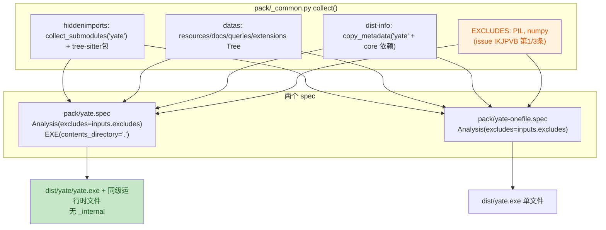

# pack-bundle-layout-plan（issue IKJPVB：打包产物瘦身 + 单目录扁平布局）

> 任务关键字：新 issue IKJPVB《ENH - 打包ISSUE和优化》
> 分支 / worktree：`enh/pack-bundle-layout` / `../yate-pack-bundle-layout`
> 状态：执行中（本文档为唯一事实来源，实时回填）

## 一、目标与非目标

### 目标（issue 原文两条）

1. **Pillow 不再进包**：单目录构建里 `PIL/` 占 13.1 MiB / 60.6 MiB（21.6%），
   却在运行时从未被 yate 使用——必须从打包依赖中检测出来并移除。
2. **单目录构建不再出现 `_internal`**：入口程序 `yate.exe` 与其余运行时文件同级。
3. **单文件构建同样做依赖检测与移除**（issue 第三段）。

### 非目标

- 不改动 `yate/` 产品源码，不改运行时行为（纯构建期变更）。
- 不追砍 `libcrypto-3.dll` / `libssl-3.dll`（5.9 MiB）——它们由 stdlib
  `_ssl` / `_hashlib` 带入，删除风险大于收益（见 §五 风险 R3）。
- 不改 CHANGELOG（由 `python -m tools.changelog generate` 从提交历史生成，
  手改会被 `tools.changelog check` 判为陈旧）。

## 二、事实取证（`文件:行号` / 实测）

| # | 事实 | 证据 |
|---|---|---|
| F1 | 两个 spec 的 `Analysis(excludes=[])` 均为空 | `pack/yate.spec:55`、`pack/yate-onefile.spec:64` |
| F2 | 单目录产物布局为 `dist/yate/{yate.exe, _internal/…}` | 实测 `Get-ChildItem dist/yate`（基线构建） |
| F3 | `_internal` 由 PyInstaller ≥6 的 `contents_directory` 默认值产生；传 `"."` 即退回旧式扁平布局，`COLLECT` 从 `EXE` 继承该值 | `.venv/Lib/site-packages/PyInstaller/building/api.py:448`（默认 `"_internal"`）、`:501-508`（`""`/`"."` → `None`）、`:1114`（`COLLECT` 继承）、`:1186`（`dest_path` 拼接） |
| F4 | `PIL` 由 `pygments.formatters.img` 的 `try: from PIL import …` 拖进图 | `build/yate/xref-yate.html`（探针溯源：PIL.Image ← … ← `pygments.formatters.img` ← `pygments` ← `rich.*`/`textual.*`）；`warn-yate.txt:19,41-43` |
| F5 | yate 从不 import PIL：全仓唯一引用在图标生成脚本，且是动态 import | `tools/pack/icon.py:26,60`（`importlib.import_module`）；`pyproject.toml:95`（`build` extra 注释明确"构建可执行程序时不需要它"） |
| F6 | 排除 PIL 运行时安全：`pygments.formatters.img` 用 `try/except ImportError` 包裹 | `.venv/Lib/site-packages/pygments/formatters/img.py:21-25` |
| F7 | 基线体积（本 worktree，含 24 个 grammar 包）：`_internal` 共 **60.6 MiB / 334 文件**，其中 `PIL/` **13.1 MiB / 7 文件** | 基线构建实测（`python -m PyInstaller --noconfirm --clean --distpath dist --workpath build pack/yate.spec`，退出码 0，`dist\yate\yate.exe --version` → `yate 0.2.9`） |
| F8 | `pyinstaller>=6.0` 已是 `build` extra 的下限，能力覆盖 F3 | `pyproject.toml:95` |
| F9 | `pack/` 不在 pyright 的 include 范围（`include = ["yate","tools","tests"]`），因此构建期脚本不受 pyright strict 门禁约束 | `pyproject.toml:100-107` |

## 三、备选方案与否决理由

### 3.1 「移除依赖」的实现方式

| 方案 | 结论 | 理由 |
|---|---|---|
| **A. 共享常量 `EXCLUDES` + 两个 spec 显式传给 `Analysis(excludes=…)`** | **采纳** | 与现有 `pack/_common.py` "共用步骤集中一次收集" 的设计一致（F9：`pack/` 不参与 pyright，改动面小）；清单与理由集中一处、两处构建同源生效，避免"只修一个 spec"的历史错位（正是 `pack/_common.py` 存在的理由） |
| B. 每个 spec 各写一份 `excludes=[...]` | 否决 | 两份清单必然漂移；违背 `_common.py` 的共享设计 |
| C. 写 PyInstaller hook（`hookspath`）做深度裁剪 | 否决 | 需要额外 hook 文件 + `hiddenimports` 联动，收益仅是省下 `pygments.formatters.img` 自身几十 KB；复杂度不划算 |
| D. 拆掉 pygments 依赖（`--exclude-module pygments`） | 否决 | pygments 是 `rich`/`textual` 的真实依赖（traceback 高亮等），误删会破运行时；issue 只点名 PIL |
| E. 每次构建跑一次"未用模块检测"自动生成 excludes | 否决 | 无可靠静态判据（PyInstaller 只能报 *missing*，无法证明 *unused*）；会把构建变成不确定过程。可用证据是 xref/warn 产物，取证后固化清单（即方案 A） |

### 3.2 「去掉 `_internal`」的实现方式

| 方案 | 结论 | 理由 |
|---|---|---|
| **A. `EXE(contents_directory=".")`** | **采纳** | PyInstaller 官方开关（F3），`COLLECT` 自动继承；bootloader 与 `sys._MEIPASS` 逻辑随之切回旧式扁平布局，无需自研后处理 |
| B. 构建后把 `_internal/*` 搬到 `dist/yate/` 再删空目录 | 否决 | 需在 spec 里写文件系统后处理逻辑，跨平台（win/linux）易碎；且 PyInstaller 的增量检查与产物校验会与之打架 |
| C. 改用 onefile 规避 | 否决 | onefile 每次启动解包、启动慢且更易被杀软拦（`pack/yate-onefile.spec:19-21` 已记录该权衡），不是"更扁平"的正解 |

## 四、分步实施计划

统一验收命令（在 worktree 根、PowerShell、`.venv\Scripts\python.exe` 解释器下执行）：

```powershell
.venv\Scripts\python.exe -m pyright yate/ tests/ tools/
.venv\Scripts\python.exe -m pytest tests/ -q
.venv\Scripts\python.exe -m pytest tests/test_architecture.py -q
```

| 步 | 输入 | 改动文件 | 输出 | 验收命令 |
|---|---|---|---|---|
| S1 | F1、F5、F6 | `pack/_common.py` | `EXCLUDES` 常量 + `SpecInputs.excludes` 字段 | `.venv\Scripts\python.exe -m pytest tests/test_pack_spec.py -q` |
| S2 | F2、F3、F8 | `pack/yate.spec` | `Analysis(excludes=inputs.excludes)`；`EXE(contents_directory=".")` | 同上 + 真实构建（见 S6） |
| S3 | issue 第三段 | `pack/yate-onefile.spec` | `Analysis(excludes=inputs.excludes)` | 同上 + 真实构建（见 S6） |
| S4 | S1-S3 的契约 | `tests/test_pack_spec.py`（新建） | 静态守卫：`_common.EXCLUDES` 含 `PIL`；两 spec 的 `Analysis` 均传 excludes 且非空字面量；单目录 spec 的 `EXE` 传 `contents_directory="."` | `.venv\Scripts\python.exe -m pytest tests/test_pack_spec.py -q` |
| S5 | issue 语义 | `README.md`、`README.zh.md` | 构建章节补"扁平布局"与"排除 Pillow/numpy"说明（双语同步） | 人工核对双语同义 |
| S6 | 全部 | 无（仅验证） | 单目录 + 单文件各一次真实构建，记录前后体积/文件数/布局 + `--version` 冒烟 | 见 §六 实测记录 |

S4 说明：守卫测试**不导入 PyInstaller**（`build` extra 不在 CI 的 dev 依赖里），
改为 `importlib` 直接加载 `pack/_common.py`（其顶层不 import PyInstaller）
+ `ast` 静态解析两个 spec，避免给 CI 引入新依赖。

## 五、风险清单与回滚

| # | 风险 | 缓解 | 回滚 |
|---|---|---|---|
| R1 | 排除 PIL 后运行时 `ImportError` | F6 已证 `pygments.formatters.img` 捕获 `ImportError`；F5 已证 yate 自身零引用；S6 用真实 exe `--version` + 启动冒烟验证 | 还原 S1 的 `EXCLUDES` 一行 |
| R2 | 扁平布局下产物与 `yate.exe` 同级，可能出现同名覆盖（PyInstaller 对 `EXECUTABLE` 与 `BINARY` 目标同名会报错而非静默覆盖） | S6 真实构建会立刻暴露；构建日志保留 | 还原 S2 的一行 |
| R3 | 诱人的 `libcrypto/libssl`（5.9 MiB）未砍 | 明确列为非目标；它们来自 stdlib ssl 栈，删除会波及 `hashlib`/LSP 相关路径 | — |
| R4 | 旧版 PyInstaller（<6.0）不识别 `contents_directory` | `build` extra 已锁 `pyinstaller>=6.0`（F8），该参数自 6.0 引入 | — |

整体回滚：`git revert` S1-S5 各自的提交（每步单独提交，便于定点回滚）。

## 六、流程图



```mermaid
sequenceDiagram
    participant U as 用户
    participant PS as pack/pack.ps1
    participant PY as PyInstaller
    participant C as pack/_common.py
    U->>PS: .\pack\pack.bat
    PS->>PY: -m PyInstaller pack/yate.spec
    PY->>C: import _common; collect(SPECPATH)
    C-->>PY: SpecInputs(excludes=[PIL, numpy], ...)
    PY->>PY: Analysis(excludes=...) → 无 PIL 依赖图
    PY->>PY: EXE(contents_directory=".") → 扁平 COLLECT
    PY-->>PS: dist/yate/yate.exe
    PS->>PS: Test-Path 产物 + 可选 --version 冒烟
```

## 七、执行记录（回填）

- 基线（改动前，worktree 内实测）：`_internal` **60.6 MiB / 334 文件**；
  `PIL/` **13.1 MiB / 7 文件**；布局 `dist/yate/{yate.exe, _internal/}`；
  冒烟 `dist\yate\yate.exe --version` → `yate 0.2.9 yet another terminal editor (Textual based)`，退出码 0。
- 待回填：S1-S6 各自的实测数字、审核结论、偏离记录。