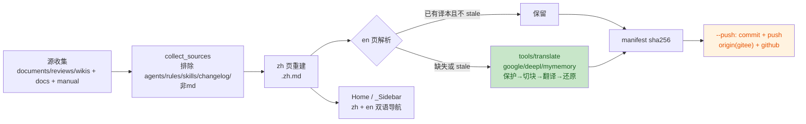

# pack-wiki 计划：tools.pack 新增 wiki 生成器 + 内置翻译工具（双语项目 Wiki）

> 任务来源：用户需求「在 tools.pack 加新的子模块 `python -m tools.pack wiki`，生成 wiki 到同级 `${repo}.wiki`」；
> 批准轮修订：**不做外部 translate-cmd 钩子，直接在 `tools/` 下实现内置翻译工具**（免费在线 API）。
> 分支 `feat/pack-wiki`（worktree `../yate-pack-wiki`）。

## 一、目标与非目标

**目标**

1. `tools/translate.py`：内置翻译工具（`python -m tools.translate`），免费在线 API，markdown 感知；
2. `tools/pack/` 新增子模块 `wiki.py`，`python -m tools.pack wiki` 子命令（沿用 `icon` / `rosters` 的单模块 + CLI 注册模式），缺失译本直接调 `tools/translate`；
3. 收集四类 md 源，输出双语页面到 `<repo>/../yate.wiki`（gitee/github wiki 仓库布局）；
4. 生成 `Home.md`（中文，默认落地页）、`Home.en.md`、`_Sidebar.md`（中文）、`_Sidebar.en.md`，链接全部可解析；
5. `--push` 选项：wiki 仓库本地 commit 后推送 `origin`（gitee）与 `github` 两个 remote。

**非目标**

- 不引入第三方翻译 SDK 依赖（仅标准库 `urllib.request`）；
- 不修改源文档内容；wiki 页面是生成物，源文档仍是唯一事实来源；
- 机器译文质量定位为"可用初稿"，en 页落盘为缓存，后续可人工润色（工具不覆盖非空译本）；
- 本任务闭环内**不执行 push**（纪律约束），推送由用户显式进行。

## 二、现状事实（2026-09-29 实测）

| 事实 | 位置/数字 |
|---|---|
| `tools/pack` 单模块模式：`icon.py` / `rosters.py`，`cli.py:build_parser` 注册子命令 | `tools/pack/cli.py:31` |
| `.trae/documents` md 共 103 篇（根 42 + 7 个子目录 61），非 md 4 个（roster.svg、3 个探针脚本）不收 | 实测 |
| `.trae/reviews` 23 篇、`.trae/wikis` 2 篇（本次重命名后路径） | 实测 |
| `yate/docs` 8 篇 = 4 对双语（extensions/lsp/themes/yaterc）；`yate/resources` 有 `manual.zh.md` + `manual.en.md`；`changelog.*.md` 按需求排除 | 实测 |
| **需补英文译本的中文文档：128 篇，合计 1.4 MB** | 实测 |
| `d:\Programming\yate.wiki` 已存在：git 仓库、`master` 分支、origin 已指向 gitee wiki、仅一个 `Home.md` 占位页 | 实测 |
| 本任务在 worktree 运行时仓库目录名为 `yate-pack-wiki`，**默认 target 不能按目录名推导** | 约束 |

## 三、选型与否决理由

1. **翻译提供方（免费在线 API 对比，针对 1.4 MB 存量）**：

   | API | 密钥 | 配额 | 大陆可达 | 质量 | 结论 |
   |---|---|---|---|---|---|
   | Google gtx（`translate.googleapis.com/translate_a/single`，非官方端点） | 无 | 无硬限额，按 IP 限速 | 需代理（`HTTPS_PROXY` 生效，`urllib` 原生支持） | 好 | **默认** |
   | DeepL Free API | 免费注册 key（`DEEPL_API_KEY`） | 50 万字符/月，存量约 1.4M 字符不够一次全量 | 可达 | 最好 | 备选 |
   | MyMemory | 无 | 匿名 ~1000 词/天、单查询 500 字符 | 可达 | 一般 | 无代理兜底 |

   否决：Bing/百度（要 key 或令牌流程脆弱）、外部 `--translate-cmd` 钩子（用户明确要求内置）。
   供应商 `--provider google|deepl|mymemory` 显式选择，默认 `google`；请求节流 `--delay`（默认 0.5s）+ 失败重试 3 次退避。
2. **markdown 保护**：机翻直接打整篇会毁掉代码块/链接/表格。策略—— fenced code block 整块跳过；行内代码、链接 URL、表格分隔线用占位 token 保护后翻译、还原；标题/列表/引用正常翻译；超长段按句切块（google ≤1200 字符/请求，mymemory ≤450，deepl 走批量接口）。
   否决：整篇直接丢给 API（格式必坏）；按行翻译（上下文断裂，术语不一致）。
3. **页面命名**：统一 `<name>.zh.md` / `<name>.en.md` 成对后缀（与 `yate/docs` 既有双语对惯例一致）。
   否决：zh 不加后缀、只给 en 加（zh/en 链接生成逻辑分叉，Sidebar 需两套规则）。
4. **默认 target 推导**：`git remote get-url origin` 的 basename 去 `.git` + `.wiki`（worktree 下同样得到 `yate.wiki`）。
   否决：仓库目录名推导（worktree 场景错误）；写死路径（不可移植）。
5. **落盘布局（需求 2 的解释）**：以 `.trae` 为基准，深度 1 的文件（`documents/x.md`、`reviews/x.md`、`wikis/x.md`）→ wiki 根；深度 ≥2 保持子目录（`documents/<plans>/x.md` → `<plans>/x.md`）。即根目录约 67 篇 + 7 个 plans 子目录。
   否决：保留 `documents/`、`reviews/` 等顶层目录名（使"无子目录→根目录"条款落空，且目录名对 wiki 读者无意义）。**此解释若与用户意图不符，批准时指出即可，改动只在 collect 一处函数。**
6. **导航**：`Home.md` / `_Sidebar.md` 为中文（gitee/github wiki 的默认落地页文件名必须是 `Home.md`），`Home.en.md` / `_Sidebar.en.md` 平行英文版；Sidebar 分节（指南 / 架构笔记 / 重构计划 / 计划集 / 评审记录）。
   否决：每页正文注入语言切换条（修改生成内容、幂等判定复杂，v1 不做）。
7. **幂等规则**：zh 页每次从源全量重建；en 页非空不覆盖（`--force` 才重译）；`.translation-manifest.json`（wiki 仓库根）记录 zh 源 sha256，源变化而 en 未更新 → 报 stale。`--check` 发现 missing/stale 退出码 1（可作门禁）。

## 四、收集与落盘映射（验收对照表）

| 源 | 处理 | wiki 落点 |
|---|---|---|
| `.trae/documents/*.md`（42） | zh 源重建 | `<name>.zh.md`（根） |
| `.trae/documents/<plans>/**/*.md`（61） | 保持子目录 | `<plans>/<name>.zh.md` |
| `.trae/reviews/*.md`（23） | zh 源重建 | `<name>.zh.md`（根） |
| `.trae/wikis/*.md`（2） | zh 源重建 | `<name>.zh.md`（根） |
| `yate/docs/<topic>.zh.md` + `.en.md`（4 对） | 双语直拷 | 同名落盘 |
| `yate/resources/manual.zh.md` + `manual.en.md` | 双语直拷 | 同名落盘 |
| `changelog.*.md`、documents 内非 md | 排除 | — |
| 全部 zh 页 | 内置翻译工具补 en | `<name>.en.md` |

页面总量预期：zh 133 + en 133 + Home/_Sidebar ×2 + manifest。

## 五、分步实施

### Wave A：翻译工具 + wiki 生成器（worktree 内）

独占文件：`tools/translate.py`（新）、`tools/pack/wiki.py`（新）、`tools/pack/cli.py`、`tools/pack/__init__.py`（docstring）、`tests/test_translate.py`（新）、`tests/test_pack_wiki.py`（新）。

`tools/translate.py` 规格：

```
python -m tools.translate FILE... [--provider google] [--sl zh] [--tl en]
                   [--delay 0.5] [--out DIR]   # 缺省 stdout（单文件） / 原名写 out
```

- 结构：`Provider` 具体类（`GoogleGtx` / `DeepLFree` / `MyMemory`）各实现 `translate(chunks) -> list[str]`；HTTP 仅用 `urllib.request`（30s 超时，`HTTPS_PROXY` 原生生效）；
- markdown 管线：`protect()`（代码块/行内代码/URL/表格线 → 占位 token）→ 按句切块 → provider → `restore()`；
- 网络 seam：provider 的 HTTP 调用收口到可 monkeypatch 的 `_fetch`，测试零网络。

`tools/pack/wiki.py` 规格：

```
python -m tools.pack wiki [--target DIR] [--provider google] [--delay 0.5]
                          [--check] [--force] [--push]
```

- `collect_sources(repo_root) -> dict[str, Path]`：按 §四收集；
- `build_pages(...)`：写 zh 页；en 缺失/stale → 调 `tools.translate`（`--force` 才重译 stale）；双语源直拷；
- `render_home(...)` / `render_sidebar(...)`：双语导航，链接用**相对当前页目录、不带 `.md` 后缀**的 wiki 链接形态（gitee/github 双兼容）；
- `load_manifest` / `store_manifest`：sha256 清单；
- `push_wiki(...)`：`git add -A` → commit → `push origin master`；`github` remote 缺失则 `git remote add github https://github.com/BigThxBrigde/yate.wiki` 再 push；
- 输出沿 `tools.pack` 现状用 `print`（CLI 工具，非 yate 运行时日志，不涉及 R12）。

验收命令（Wave A 退出条件）：

```
.venv\Scripts\python -m pyright yate/ tests/ tools/          # 零诊断
.venv\Scripts\python -m pytest tests/test_translate.py tests/test_pack_wiki.py -q   # 全绿
```

测试面（tmp_path 造假源树 + monkeypatch `_fetch`）：三个 provider 的响应解析与错误路径、占位保护/还原往返、切块边界、收集范围与排除、根/子目录落盘规则、双语对直拷、en 不覆盖与 --force、manifest stale 判定、Home/_Sidebar 生成与链接目标存在性、--check 退出码；push 用 monkeypatch 断言命令序列，不打网络。

### Wave B：存量翻译 + 首跑生成

```
.venv\Scripts\python -m tools.pack wiki --provider google   # 缺失 en 全部走在线翻译
```

- 1.4 MB ≈ 数百个请求 × 0.5s 节流 ≈ 十分钟量级；需代理环境（用户侧确认）；
- 验收：zh 133 页 + en 133 页 + Home/_Sidebar ×2 落盘；`python -m tools.pack wiki --check` 退出码 0；
- 若 google 不可达：`--provider mymemory` 兜底（慢，分多轮跑，en 缓存保证断点续译）；或用户提供 `DEEPL_API_KEY` 走 `--provider deepl`（分月配额多次跑）。

### Wave C：审核与收尾

- code-review-expert 评审（pyright/pytest/架构测试/覆盖率 + wiki 产物链接抽查 + 译文抽样）；
- wiki 仓库本地提交两笔：`docs: regenerate wiki from sources`、`docs: add english translations`（**不 push**）；
- yate 仓库按 `git-commit-message.md` 提交（`feat(tools): add markdown translator`、`feat(tools): add wiki generator submodule` 等，逐波分笔）；
- 本计划文档回填真实数字与偏离记录。

## 六、风险与回滚

| 风险 | 缓解 |
|---|---|
| google gtx 在无代理环境不可达 | `--provider` 三选一；mymemory 无代理兜底；错误信息明确提示 |
| 非官方端点失效/限流 | 重试退避；provider 抽象可加新端点；en 缓存已译部分不回退 |
| 机翻质量不佳 | 定位"可用初稿"；en 页是普通文件，人工润色后工具永不覆盖 |
| 机翻破坏 markdown 格式 | 保护管线 + 测试覆盖往返一致性；抽查产物 |
| gitee/github 子目录页与相对链接渲染差异 | 链接统一"页相对 + 无 .md 后缀"双兼容形态；验收含本地链接解析 |
| 覆盖 `yate.wiki` 现有 `Home.md`（占位页） | 仅一句欢迎语，git 历史可回滚 |
| worktree 下 target 推导错误 | §三.4 用 origin URL basename；测试覆盖 |
| 回滚 | yate 仓库 revert 对应提交；yate.wiki 仓库 `git revert`；均单提交粒度 |

## 七、流程图



## 八、执行记录（收尾回填）

（待回填：各波实测数字、偏离记录、提交哈希）
