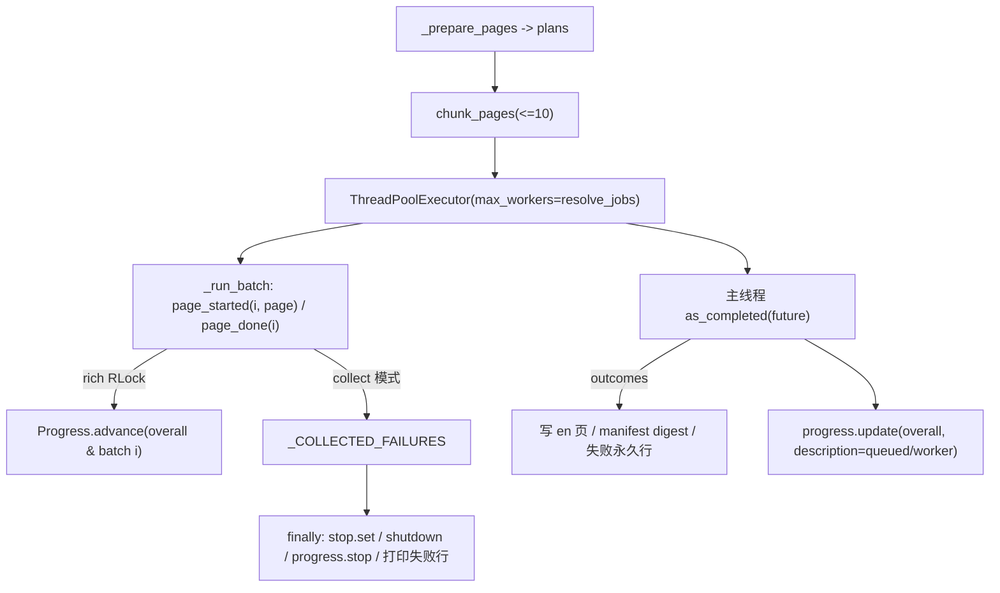

# pack wiki 进度实时刷新修复方案（issue IKJPEK 评论）

> **来源记录**（`doc-conventions.md` §二.2 要求记录 ↔ 方案互链）：
> [2026-10-06-pack-wiki-progress-skill-review.md](../reviews/2026-10-06-pack-wiki-progress-skill-review.md)
> —— 本方案 §6.9/§6.10 的三轮审查发现、实测证据与逐条状态均登记在该记录中；
> [2026-10-05-pr56-pack-wiki-parallel-ai-review.md](../reviews/2026-10-05-pr56-pack-wiki-parallel-ai-review.md)
> —— 前序 PR !56 的 AI 队友评审（其 P1–P4 由本方案 §6.7 R-03…R-06 落地）。
>
> 分支：`fix/pack-wiki-progress-refresh`（worktree：仓库同级目录 `../yate-pack-wiki-progress`）
> Issue：<https://gitee.com/jermaine/yate/issues/IKJPEK> 评论
> [`note_51450440`](https://gitee.com/jermaine/yate/issues/IKJPEK#note_51450440)（2026-10-05 22:42:11 +08:00）
> 状态：**方案已批准，执行中**（无人值守时段，`task-orchestration.md` §二 第 5 条）

## 一、问题（用户评论原文与根因）

> **每个batch的任务进度不会实时更新进度，只有0到100，需要实时刷新进度**

### 1.1 现象

`python -m tools.pack wiki --translate-cmd ...` 并行翻译时，每个 batch 的进度行在
整批翻译完成前**始终停在 0%**，整批结束后瞬间跳到 100%；总体进度行同理。
单页耗时 ~14-22 s、`BATCH_SIZE = 10`，故一行可能静止 ~200 s 才跳变。

### 1.2 根因（取证：`tools/pack/wiki.py`）

`_translate_pending()` 用 `as_completed()` **按批**消费
`Future[list[_PageOutcome]]`：页级结果只在整批 future 完成后才被主线程遍历，
`progress.advance(overall)` / `progress.advance(batch_tasks[index])` 均在遍历
outcomes 时逐页调用 —— 即推进时机被批边界锁死。worker 只跑
`translate_via_cmd`，不触碰进度对象。

### 1.3 附带兑现的文档承诺

`README.md` / `README.zh.md` 的 wiki 段落均写明进度条"显示当前页名与整体进度"，
但批行描述恒为 `batch i/n`，**当前页名从未显示**——本轮一并兑现（issue 原始要求
亦含"正在执行的任务"）。该承诺的更早出处见
[wiki-translate-progress-plan.md](wiki-translate-progress-plan.md) 的进度条段落。

## 二、目标与非目标

### 目标

1. **页级实时推进**：批行与总体行在**每页完成时立即 +1**，不再批末跳变；
2. **当前页名**：批行描述实时显示正在翻译的页（经 markup 转义，页名含方括号
   不炸 `MarkupError`）；
3. **不变式保持**：写盘、失败永久行、错误传播与 `Ctrl+C` → 130 路径仍**只由主
   线程**负责；worker 仅多触碰一个线程安全的进度对象。

### 非目标

- 不修 PR !56 评审登记的 P1–P4（错误码精度、`_emit_mode` 全局竞态、判定重复）：
  用户本次只要求进度刷新，P3 涉及失败行收尾，另案登记；
- 不改 `BATCH_SIZE`（issue 硬要求每批 ≤ 10 篇）与 `CPU × 2` 并发上限；
- 不改非 TTY（重定向 / CI）下 rich 不渲染的既有行为。

## 三、备选方案与否决理由

| 方案 | 结论 | 理由 |
|---|---|---|
| **B. worker 页级回调直接推进 rich 进度**（选定） | ✅ 采纳 | 探针实测（rich `Progress` 内部 `RLock` 保护 `update`/`advance`）：批仍在运行时批行 `completed` 已推进到 1、2，最终计数精确；改动集中在 `wiki.py` 单文件，`Ctrl+C` 路径不动 |
| A. worker → `queue.Queue` → 主线程 drain（`wait(timeout=)` 轮询） | ❌ 否决 | 保留"仅主线程触碰终端"的严格不变式，但要重写 `as_completed` 主循环、重验 `Ctrl+C` 竞态与队列关闭语义，收益不匹配风险 |
| C. 每页一个 task 行 | ❌ 否决 | 162 页 → 162 行，终端噪声爆炸，违反"稀疏优于密集" |
| D. 缩小 `BATCH_SIZE` 到 1 | ❌ 否决 | 直接违反 issue 硬要求"每批最多 10 篇"，且批调度开销放大 |

### 3.1 探针实测依据

`_probe_progress.py`（一次性，已删除）：2 个线程各推进 3 页、每页 `sleep(0.05)`，
快照 `(batch, completed)` 序列为 `[(2,0),(1,0),(1,1),(2,1),(2,2),(1,2)]`
—— 批运行中即见推进；`final overall = 6`、两批各 `3`，计数精确无重复。

## 四、实施计划

工作目录均为 worktree 根，解释器 `.venv\Scripts\python.exe`。

### S1 · `tools/pack/wiki.py`（核心）

1. 新增 `_ProgressBoard`（dataclass：`progress` / `overall` / `batch_tasks` /
   `batch_count` / `total_pages` / `workers` / `queued`），三个方法：
   - `page_started(index, page)`：批行描述改为
     `batch {i}/{n} · {escape(page.en_target)}`（页名转义）；
   - `page_done(index)`：批行 `advance(1)` + 总体行
     `update(advance=1, description=...)`，两行同时移动；
   - `batch_finished()`：主线程扣减 `queued` 并刷新总体行文案；
2. `_run_batch(...)` 增参 `index` 与 `board`：每页**开始前**调 `page_started`、
   **完成后**调 `page_done`（失败页同样推进，总数闭合）；两个回调与翻译同处一个
   `try`，异常一律作为 outcome 值回主线程；
3. `_translate_pending(...)`：主循环**移除**页级 `progress.advance`（改由 board
   负责），`queued` 计数改为 `board.batch_finished()`；submit 循环改为遍历
   `batch_tasks` 的键，使"批号 → 任务行"映射只有一处来源（消除索引错位）；
4. 更新 `_ProgressBoard` / `_run_batch` / `_translate_pending` 与模块 docstring：
   如实描述"只有主线程触碰终端与文件系统；页级进度由 worker 经 rich 锁推进"，
   并更正存量 docstring 中"异常逃出会让 future 永久 pending"的错误前提
   （实测 `_WorkItem.run` 必 `set_exception`）。

验收：

```powershell
.venv\Scripts\python.exe -m pyright tools/pack/wiki.py
.venv\Scripts\python.exe -m pytest tests/test_pack_wiki.py tests/test_pack_wiki_errors.py tests/test_pack_wiki_parallel.py -q
```

### S2 · `tests/test_pack_wiki_parallel.py`（回归钉）

1. `test_batch_progress_advances_page_by_page_while_a_batch_runs`：注入真实
   `Progress`，fake 翻译在每次调用开始时快照总体行与批 1 行的 `completed`；
   断言第 2 页开始时两者已 ≥ 1，收尾断言各行 completed 之和 == `PAGE_COUNT`
   且不超 total；
2. `test_concurrent_workers_keep_the_progress_rows_consistent`：`jobs=2` + Barrier
   证明真并发，断言无丢页 / 无重复计数；
3. `test_failed_page_still_advances_the_progress_rows`：一页失败仍推进（总数
   闭合），钉住 docstring 承诺；
4. `test_batch_row_names_the_page_in_flight_and_escapes_markup`：断言批行描述含
   转义后的页名、渲染结果还原为字面量（静默吞名风险）；
5. `test_batch_row_survives_a_closing_markup_tag_in_the_page_name`：`bracket[/x]`
   夹具（`skipif win32`），覆盖唯一会真抛 `MarkupError` 的形态。

验收：

```powershell
.venv\Scripts\python.exe -m pytest tests/test_pack_wiki_parallel.py -q
```

### S3 · 文档回填与收尾

- 本方案 §六 执行记录、真实门禁数字；
- `README.md` / `README.zh.md`：进度条描述与实现对齐（页名 + 页级实时推进）；
- 全量门禁（§五）与提交（不推送）。

## 五、验收门禁（收尾由主代理亲自跑）

| 命令 | 通过标准 |
|---|---|
| `.venv\Scripts\python.exe -m pyright yate/ tests/ tools/` | 0 errors |
| `.venv\Scripts\python.exe -m pytest tests/test_pack_wiki.py tests/test_pack_wiki_errors.py tests/test_pack_wiki_parallel.py -q` | 全绿 |
| `.venv\Scripts\python.exe -m pytest tests/test_architecture.py -q` | 22 passed |
| `.venv\Scripts\python.exe -m pytest tests/ -q` | 全绿 |
| `.venv\Scripts\python.exe -m pytest tests/ --cov=yate --cov-fail-under=75` | ≥ 75% |
| `.venv\Scripts\python.exe -m pytest tests/test_pack_wiki*.py --cov=tools.pack.wiki --cov-report=term` | 本轮改动在 `tools/`，`--cov=yate` 对其零信号，故补 tools 侧数字（实测 **95%**） |

## 六、执行记录（2026-10-05，主代理亲自执行与复核）

### 6.1 交付

| 提交 | 内容 |
|---|---|
| `20ff035` | `fix(pack)`：页级回调 `_progress_reporter()` + `_run_batch` 新回调 + 主循环移除批末 advance |
| `73c8cb2` | `tests(pack)`：两条回归用例（页级推进判别力 / 页名与 markup 转义） |
| `95ab4fa` | `docs(pack)`：中英 README 对齐 + 删除死参数 + 本文回填 |
| （审核轮） | `fix(pack)`：`_progress_reporter` → `_ProgressBoard`（键来源单一、回调入 try、总体行文案同步实时） |
| （审核轮） | `tests(pack)`：批次行断言、并发一致性、失败页计数、`[/x]` markup 用例 |
| （审核轮） | `docs(pack)`：README 措辞再收紧 + §四/§五/§六/§七 与实现对齐 |

### 6.2 门禁实测（worktree 沙箱，退出码均 0）

> 下表为**历史快照**，非当前值；最新门禁数字见 §6.10。

| 命令 | 结果 |
|---|---|
| `pyright yate/ tests/ tools/` | `0 errors, 0 warnings, 0 informations` |
| `pytest tests/test_pack_wiki.py tests/test_pack_wiki_errors.py tests/test_pack_wiki_parallel.py` | **65 passed** in 11.44s |
| `pytest tests/test_architecture.py` | **22 passed** in 3.45s |
| `pytest tests/ --cov=yate --cov-fail-under=75` | **1845 passed, 8 skipped** in 450.90s；覆盖率 **91.27%**（阈值 75%） |

### 6.3 偏离计划（含实测依据）

1. **S2 的驱动方式改为公开入口**：计划写"测试直接驱动 `_prepare_pages` +
   `_translate_pending`"，实测 pyright strict **启用 `reportPrivateUsage`**
   （6 errors：`"_prepare_pages" 是专用的…`、`list[object]` 不可赋给
   `Sequence[_PagePlan]`）。改为经公开 `wiki.run()` 驱动、注入显示对象靠
   `monkeypatch.setattr(wiki, "Progress", factory)`（模块级符号，既有测试同款
   规避手法），用例语义与判别力不变。
   （评审成员曾报告"直调私有函数 pyright 0 errors"，与主代理实测相反；其
   结论基于改造后的代码版本，未复现旧版本，**以主代理实测为准**。）
2. **删除 `_translate_pending` 的 `progress` 注入参数**：因偏离 1，该参数在生产
   与测试两侧都无调用方，成为死参数，已移除（避免签名腐化），docstring 同步
   删去对应说明。
3. **README 措辞两轮收紧**：初版加"交互式终端"限定；审核轮按实测去掉
   "全部实时刷新"这类无条件表述。第 3 轮再修正一次：非 TTY 下 rich **仍会在
   `Live.stop()` 渲染一次最终帧**（主代理复核探针：`translating 25/25 … 100%`
   + 3 个批行，排在逐批行之后），故措辞为"不实时刷新，结束时打印一次最终
   进度条"（评审 R-18）。

### 6.4 负向演练（判别力实证）

| 轮次 | 演练 | 结果 |
|---|---|---|
| 首轮·改造前 | 抽掉 `page_done` 的 `progress.advance` | `test_batch_progress_advances_page_by_page…` 失败：`assert 0 == 1` |
| 首轮·改造后 | 同上 | 同样失败（驱动方式改为公开入口后再验一次） |
| 审核轮 | 只推进总体行、抽掉批行 `advance` | 用例 1 **与**并发用例同时失败（原实现漏判，已闭合） |
| 审核轮 | `page_done` 置 no-op | 首轮用例失败（与上表同类） |

### 6.5 审核结论（首轮，主代理自查）

- 主代理逐条核对 `architecture-boundaries.md` §五 与 `python-coding-style.md`
  §五：无新 `Protocol` / `TYPE_CHECKING` / `Any`，`tools/` 沿用既有 `print`
  约定（非 `yate/` 的 R12 tracing 范围），docstring 散文式且引用路径正确；
- 计数三路径复核：翻译失败页**推进**、worker 抛异常页**不推进**、`stop` 提前
  break 后未开始的页**不推进**；
- `Ctrl+C` 路径未变：两条中断用例在全量中通过。

### 6.6 子代理评审（两轮只读评审，**非零产出**）

> 更正：本节首版曾记为"两名成员零产出"，系主代理在下述报告送达前误判判死；
> 两份报告实际均已产出并被采纳（见 §6.7 处置表）。

- `reviewer-impl`（`tools/pack/wiki.py`）：0 CRITICAL / 2 WARNING / 6 SUGGESTION。
  关键取证：rich **15.0.0** 的 `Progress.advance`/`update` 只在 `Progress._lock`
  内改内存字段、不触发渲染，终端写入只发生在 rich 自己的刷新线程；
  `_RefreshThread.run` 无 `try/except`（渲染异常会冻结显示）；`_WorkItem.run`
  必 `set_exception`（"future 永久 pending"前提错误）。
- `reviewer-tests`（测试 / README / 方案）：0 CRITICAL / 3 WARNING + README 承诺
  过度 / 6 SUGGESTION。关键实测：变异"只推进总体行"时两条新用例仍全绿（漏判）；
  `bracket[name]` 在 rich 下是**静默吞名**而非 `MarkupError`，抛错需 `[/`
  （Windows 文件名不可达）；非 TTY 运行中 rich 零渲染。

### 6.7 审核轮处置表

| # | 来源 | 级别 | 问题 | 处置 |
|---|---|---|---|---|
| 1 | impl | WARNING | `page_started` 在 `try` 外，异常逃出会绕过 `stop.set()` 与取消逻辑 | ✅ 已修：回调入 `try`，异常统一走 outcome 通道；键来源单一（submit 遍历 `batch_tasks`） |
| 2 | impl | WARNING | 两次 `advance` 非原子 / 进度异常被误报为翻译失败 | ◑ 部分修：键来源单一后该路径仅在 rich 缺陷时可达；(ii) 独立失败语义**登记为遗留**（新增告警通道属过度防御） |
| 3 | impl | SUGGESTION | 总体行文案仍按批刷新，与实时条自相矛盾 | ✅ 已修：`_ProgressBoard._description()` 由 `page_done` 实时刷新 |
| 4 | impl | SUGGESTION | 失败页 / 异常页计数无测试覆盖 | ✅ 已修：`test_failed_page_still_advances_the_progress_rows` |
| 5 | impl | SUGGESTION | "future 永久 pending"前提错误；markup 故障模式描述不准 | ✅ 已修：两处 docstring 改写为实测事实 |
| 6 | tests | WARNING | 批次行 `completed` 无任何断言（变异实证漏判） | ✅ 已修：用例 1 增断言批行 + 收尾 completed 之和/total 上界；变异复验失败 |
| 7 | tests | WARNING | 方括号夹具故障模式描述错误 | ✅ 已修：docstring 改为"静默吞名 / `[/` 抛错"，并新增 `[/x]` 用例（`skipif win32`） |
| 8 | tests | WARNING | 方案文档与实现脱节 6 处 | ✅ 已修：§四 用例名与参数、§五 补 tools 覆盖率、§1.3 行号引用、§六 本节 |
| 9 | tests | WARNING | README 过度承诺（非 TTY 无实时条、总体行文字批粒度） | ✅ 已修：文案按实测改写（中英同步）；总体行文字问题同 #3 |
| 10 | tests | SUGGESTION | `refresh()` 依赖 live 已 start（失败因果难读） | ✅ 已修：加 `assert progress.live.is_started` |
| 11 | impl | SUGGESTION | `_translate_pending([])` → `max_workers=0` → `ValueError`（存量，生产已挡） | ⏸ 登记遗留（改动超本轮范围） |

### 6.8 第二轮修复：`Ctrl+C` 堆栈治理（2026-10-06）

**用户报告**：`wiki --translate-cmd` 运行中按 `Ctrl+C` 后，终端被 `KeyboardInterrupt`
堆栈刷屏（同一页重复 4 次），最后才出现 `tools.pack: interrupted`。

**根因（两层，均实测取证）**：

1. 控制台的 `Ctrl+C` 广播到**整个进程组**，`tools.translate` 子进程与它启动的
   `codebuddy-code` 一起收到，于是子进程打印
   `KeyboardInterrupt` traceback，退出码 `3221225786`
   （`0xC000013A` = `STATUS_CONTROL_C_EXIT`）；
2. 父进程 `_run_translate` 只把"非零退出"当**单页翻译失败**，于是把整段
   traceback 当作 detail 打进 `error[WIKI-0201]`，并且**继续翻页** —— 用户已经
   中断，却还要为余下每一页各打印一条错误。

**方案（备选与否决）**：

| 备选 | 结论 | 理由 |
|---|---|---|
| **A. 子进程干净退出 + 父进程识别中断码**（选定） | ✅ | 两处各改一处，语义正确：`tools.translate` 捕获 `KeyboardInterrupt` → 一行提示 + 退出码 130；`wiki._run_translate` 把中断码（130 / `0xC000013A` / 有符号形式 / `-SIGINT`）**转为 `KeyboardInterrupt`**，复用既有的 `outcome.error` → `stop.set()` → 取消队列 → CLI 130 通道，不新增状态字段 |
| B. 父进程过滤 detail 文本（截断 traceback） | ❌ 否决 | 只治表象：仍然逐页失败、仍然跑完全部页面，用户仍等几分钟 |
| C. 父进程改用 `CREATE_NEW_PROCESS_GROUP` 隔离子进程 | ❌ 否决 | 只屏蔽单页子进程的 Ctrl+C，`tools.translate` 与 `codebuddy-code` 之间的中断仍在；且跨平台分支复杂 |

**实施**：

1. `tools/translate/cli.py`：`main` 捕获 `KeyboardInterrupt` → stderr 一行
   `wiki-translate: interrupted` + 返回 **130**（无堆栈）；`SystemExit`（argparse
   用法错误）不受影响。
2. `tools/pack/wiki.py`：新增 `_INTERRUPT_EXIT_CODES`，`_run_translate` 命中即
   `raise KeyboardInterrupt`（`from None` 语义：不是翻译失败）；`translate_via_cmd`
   与 `_run_translate` docstring 同步。
3. README 的 `Ctrl+C` 说明不变（中英早已承诺"干净退出 130、无调用堆栈"，本轮兑现）。

**验收**：新增 3 组用例（中断码 → `KeyboardInterrupt` 且不打印 `error[WIKI-0201]`；
中断后不再翻页且 CLI 返回 130；`tools.translate` 侧 130 且无 `Traceback`）
+ 全量门禁。

**实施结果（2026-10-06）**：

- `tools/translate/cli.py`：`main` 整体包进 `try`，`except KeyboardInterrupt` →
  stderr 一行 `wiki-translate: interrupted` + 返回 **130**；
- `tools/pack/wiki.py`：新增 `_INTERRUPT_EXIT_CODES = {130, 0xC000013A,
  0xC000013A - 2**32, -2}`（常量注释说明 Windows / POSIX / 自守护 translators
  三种来源），`_run_translate` 命中即 `raise KeyboardInterrupt`；
- 测试：`test_pack_wiki_errors.py` 参数化 4 个中断码；`test_pack_wiki_parallel.py`
  加"整轮中止且不刷错误"与"CLI 130"两条；`test_tools_translate.py` 加"130 且无
  `Traceback`、不写 `OUT`"一条。实测 **89 passed, 1 skipped**（`[/x]` 用例在
  Windows 跳过）。

**端到端取证**（一次性探针，已删除）：真实子进程 + 独立控制台组 + 真
`CTRL_BREAK_EVENT`，实测 **returncode = 3221225786（= `0xC000013A`，
`STATUS_CONTROL_C_EXIT`）** —— 与用户日志中的 rc 完全一致，确认该码即控制台
中断的退出码，纳入识别集合。（该探针未复现 traceback：`CTRL_BREAK` 走
`SIGBREAK`，Python 默认直接终止；用户的 traceback 来自 `tools.translate` 收到
`CTRL_C` → `SIGINT` → 默认 handler，与其日志一致。复现 `CTRL_C_EVENT` 需把它
发给前台进程组，会波及本机会话，故不做。）

### 6.9 `python-code-review` skill 审查轮（2026-10-06 起，循环迭代）

**审查框架来源**：`code-review-expert` 剧本要求先加载 `python-code-review` skill。
master 已提供跟踪版（`.trae/skills/python-code-review/`），本轮直接使用；此前本会话
曾按 `skill-creator` 在 `.codebuddy/skills/` 建过一份副本，该副本已删除，
**`.trae/skills/` 下的 skill 未作任何改动**（用户明确要求不改动 skills）。
本轮沉淀的项目特定审查经验（权威规则源、四层陷阱、门禁命令、迭代纪律、变异
纪律）记录在本方案与评审记录中，供后续审查直接引用。

**第 1 轮结论**：0 CRITICAL / 7 WARNING / 3 SUGGESTION，全部登记到
[legacy-issues.md](../../reviews/legacy-issues.md)（编号 R-01…R-11，含描述、
影响范围、状态）。其中 R-01 为**本轮修复自身引入**的缺陷，经探针实证：

```text
(completed, description shows) per page start:
  completed=0 description=-1 delta=1
  completed=1 description=0  delta=1
  completed=2 description=1  delta=1
final: completed=3 description='translating 3/3 page(s) · 0 batch(es) queued · 1 worker(s)'
```

根因：`_description()` 作为**实参**在 `update(overall, advance=1, ...)` 之前
求值（`_ProgressBoard.page_done`），读到推进前的计数；只有批末
`batch_finished()` 才把文案追平。R-03…R-07 为 PR !56 登记但未处置的原有缺陷，
本轮一并落地修复。

> 登记落点：本轮发现按 `doc-conventions.md` §二登记在独立评审记录
> [2026-10-06-pack-wiki-progress-skill-review.md](../../reviews/2026-10-06-pack-wiki-progress-skill-review.md)，
> `legacy-issues.md` 只保留指针与流程风险（R-11）。

### 6.10 第 3 轮（只读评审子代理）与最终门禁（2026-10-06）

**第 2 轮**（主代理审查自己的重构）：发现 `_PageState.COPIED` 与
`has_en_source` 参数无调用方（死成员，R-12，已删）；登记 R-13（退出码 130 的
语义约定，接受并文档化）。

**第 3 轮**（只读评审子代理，0 CRITICAL / 5 WARNING / 2 SUGGESTION）：

| # | 问题 | 处置 |
|---|---|---|
| R-14 | `needs_translation` 生产零调用方，而重构为其新增哨兵常量 | ✅ docstring 如实标注调用面 + 登记 |
| R-15 | `finally` 注释"绝不阻塞中断路径"被实测证伪（CPython 在 teardown join 池线程，实测 0.6s→3.1s） | ✅ 注释改为实测事实；真要立即退出（daemon worker / `os._exit`）超出本轮范围，登记为遗留 |
| R-16 | R-05 只修了一半：`_emit_mode` 恢复在 drain **之后**，晚到消息进队列无人再取（探针 `residue after run: 1`） | ✅ 改为**先恢复串行策略再 drain**，晚到消息自行写 stderr（变异验证变红） |
| R-17 | `test_a_late_worker_failure_is_not_dropped` 恒真（只断言队列 API，与"能否到终端"无关） | ✅ 改为在真实 drain 之后注入上报，断言 stderr 可见 + 队列为空（变异验证变红） |
| R-18 | README"重定向时只有逐批行"与实测不符（非 TTY 结束时仍打印一次最终进度条） | ✅ 中英 README 与 §6.3 第 3 条按实测改写 |
| R-19 / R-20 | 方案门禁计数过期、`wiki.py:837` 行号引用失效 | ✅ §6.2 标注为历史快照 + 指向本节；行号改为按函数引用 |

第 3 轮同时复核了两项关键结论：`_translation_state()` 重构与重构前**逐分支等价**
（全组合核对）；`page_done` 两步更新在 2 线程 × 6000 次压测下 `lag samples: 0`。

**最终门禁（主代理亲自跑，退出码 0）**：

| 命令 | 结果 |
|---|---|
| `pyright yate/ tests/ tools/` | `0 errors, 0 warnings, 0 informations` |
| `pytest tests/test_pack_wiki.py tests/test_pack_wiki_errors.py tests/test_pack_wiki_parallel.py tests/test_tools_translate.py` | **93 passed, 1 skipped**（`skipif win32`） |
| `pytest tests/ --cov=yate --cov-fail-under=75` | 全绿；覆盖率 **91.26%** |
| `pytest tests/test_architecture.py` | **22 passed** |

**遗留限制**（非缺陷，已登记）：真实 TTY 目验缺位（无人值守会话无法投递
SIGINT / 目验）；自定义 hook 吞掉中断时的退出延迟（R-15）；分支落后 master
（R-11，待用户决策）。

### 6.11 第 4 轮（确认性审查）：代码收敛（2026-10-06）

第 3 轮的 5 WARNING + 2 SUGGESTION 修复经独立复核**全部属实且被变异锁定**
（回退即变红），未引入新缺陷。四场景探针（正常 / 全失败 / 中途 interrupt /
worker 抛异常）终态自洽：失败行"恰好一次"、队列残留 0、`_emit_mode` 末值 `print`。

第 4 轮唯一 WARNING 是**四轮皆遗漏的结构性缺陷**：

| # | 问题 | 处置 |
|---|---|---|
| R-21 | `global _emit_mode; _emit_mode = "collect"` 与 `progress.start()`、`ThreadPoolExecutor(...)` 都在 `try:` **之前**；任一抛异常则 `finally` 不执行 → 策略永久停在 `"collect"`，此后进程内任何翻译失败都被塞进无人读取的队列（静默报错） | ✅ 全部 fallible setup 移入 `try`，`pool` 判空；因该缺陷无法从外部激活性测试，补 **AST 结构性守护**（断言安装语句与 `start()` 位于 `try` 体内） |
| R-22 | 同一条失败消息两种渲染（collect 走 rich 有 ANSI 高亮、串行走裸 print） | ✅ 排空时 `highlight=False` |
| R-23 | 新用例的失败桩含永不触发的分支（fixture 只有 1 页） | ✅ 换成诚实的成功桩 |
| R-24 | 队列是模块级且从不在入口清空，drain 后残留会被下一次 `run()` 打印 | ✅ 进入时先排空一次 |
| R-25 | `--translate-all` 无 `--translate-cmd` 时为空操作，README 未说明、无用例 | ✅ 中英各补半句 + 提示行用例 |
| R-26 | `§6.11` 引用悬空、索引计数与逐轮汇总不符、R-11 在编号表缺号 | ✅ 补本节、计数校正为 13 WARNING / 13 SUGGESTION、概览表补 R-11 说明 |
| R-27 | R-10「接受」理由缺实测依据（不可重入与跨 run 串味仍未解决） | ✅ 登记补注 |

**最终门禁（主代理亲自跑，退出码 0）**：

| 命令 | 结果 |
|---|---|
| `pyright yate/ tests/ tools/` | `0 errors, 0 warnings, 0 informations` |
| `pytest tests/ --cov=yate --cov-fail-under=75` | **1861 passed, 9 skipped**；覆盖率 **91.27%** |
| `pytest tests/test_architecture.py` | **22 passed** |
| `pytest`（wiki 四文件）`--cov=tools.pack.wiki --cov=tools.translate` | **96 passed, 1 skipped**；tools 侧 **94%** |

**收敛结论**：代码修复层面收敛（第 1 轮 7 条 WARNING → 第 4 轮 0 条新增；
R-21 为四轮皆遗漏的结构性缺陷，非回归）。过程性风险与已接受项见评审记录
§七 与 [legacy-issues.md](../../reviews/legacy-issues.md)。

## 七、风险与回滚

| 风险 | 缓解 | 回滚 |
|---|---|---|
| worker 触碰 rich 进度对象 → 观感撕裂（**非崩溃**：写侧持 `Progress._lock`、渲染侧持 `Live._lock`，是**两把不同的锁**，一帧可能取到某行已进、另一行未进的快照） | rich 15.0.0 源码取证 + 探针实测；并发用例 `test_concurrent_workers_keep_the_progress_rows_consistent` 钉住"无丢页/无重复计数" | `git reset --hard master` |
| 回调重复推进导致进度超 100% | S1 第 3 步移除主循环 advance；用例断言各行 completed 之和 == 总页数且不超 total | 同上 |
| 页名含 `[` 触发 `MarkupError` | `rich.markup.escape` + S2 方括号夹具 | 同上 |
| 无人值守时段真实 TTY 目验缺位 | 非 TTY 下 rich 不渲染，属既有行为；页级推进由注入断言覆盖 | 同上 |

回滚路径：单分支 `fix/pack-wiki-progress-refresh`，`git reset --hard master`
或删除分支/worktree。

## 八、数据流（改动后）



不变式：写盘、永久行、`Ctrl+C` 传播仍只在主线程（`W2` / `FIN` 两条边）。
