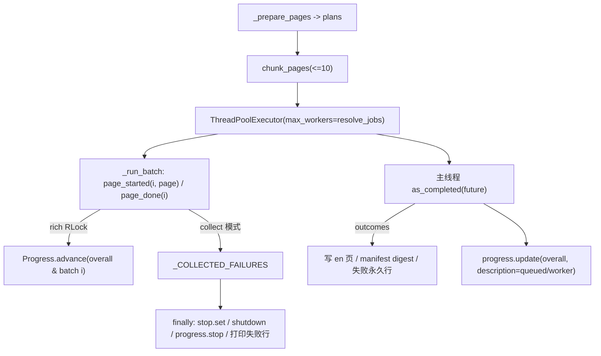

# pack wiki 进度实时刷新修复方案（issue IKJPEK 评论）

> 分支：`fix/pack-wiki-progress-refresh`（worktree：仓库同级目录 `../yate-pack-wiki-progress`）
> Issue：<https://gitee.com/jermaine/yate/issues/IKJPEK> 评论
> [`note_51450440`](https://gitee.com/jermaine/yate/issues/IKJPEK#note_51450440)（2026-10-05 22:42:11 +08:00）
> 状态：**方案已批准，执行中**（无人值守时段，`task-orchestration.md` §二 第 5 条）

## 一、问题（用户评论原文与根因）

> **每个batch的任务进度不会实时更新进度，只有0到100，需要实时刷新进度**

### 1.1 现象

`python -m tools.pack wiki --translate-cmd ...` 并行翻译时，每个 batch 的进度行在
整批翻译完成前**始终停在 0%**，整批结束后瞬间跳到 100%；总体进度行同理。
单页耗时 ~14-22 s、`BATCH_SIZE = 10`，故一行可能静止 ~200 s 才跳变。

### 1.2 根因（取证：`tools/pack/wiki.py`）

`_translate_pending()` 用 `as_completed()` **按批**消费
`Future[list[_PageOutcome]]`：页级结果只在整批 future 完成后才被主线程遍历，
`progress.advance(overall)` / `progress.advance(batch_tasks[index])` 均在遍历
outcomes 时逐页调用 —— 即推进时机被批边界锁死。worker 只跑
`translate_via_cmd`，不触碰进度对象。

### 1.3 附带兑现的文档承诺

`README.md` / `README.zh.md` 的 wiki 段落均写明进度条"显示当前页名与整体进度"
（`README.zh.md:459`），但批行描述恒为 `batch i/n`，**当前页名从未显示**——
本轮一并兑现（issue 原始要求亦含"正在执行的任务"）。

## 二、目标与非目标

### 目标

1. **页级实时推进**：批行与总体行在**每页完成时立即 +1**，不再批末跳变；
2. **当前页名**：批行描述实时显示正在翻译的页（经 markup 转义，页名含方括号
   不炸 `MarkupError`）；
3. **不变式保持**：写盘、失败永久行、错误传播与 `Ctrl+C` → 130 路径仍**只由主
   线程**负责；worker 仅多触碰一个线程安全的进度对象。

### 非目标

- 不修 PR !56 评审登记的 P1–P4（错误码精度、`_emit_mode` 全局竞态、判定重复）：
  用户本次只要求进度刷新，P3 涉及失败行收尾，另案登记；
- 不改 `BATCH_SIZE`（issue 硬要求每批 ≤ 10 篇）与 `CPU × 2` 并发上限；
- 不改非 TTY（重定向 / CI）下 rich 不渲染的既有行为。

## 三、备选方案与否决理由

| 方案 | 结论 | 理由 |
|---|---|---|
| **B. worker 页级回调直接推进 rich 进度**（选定） | ✅ 采纳 | 探针实测（rich `Progress` 内部 `RLock` 保护 `update`/`advance`）：批仍在运行时批行 `completed` 已推进到 1、2，最终计数精确；改动集中在 `wiki.py` 单文件，`Ctrl+C` 路径不动 |
| A. worker → `queue.Queue` → 主线程 drain（`wait(timeout=)` 轮询） | ❌ 否决 | 保留"仅主线程触碰终端"的严格不变式，但要重写 `as_completed` 主循环、重验 `Ctrl+C` 竞态与队列关闭语义，收益不匹配风险 |
| C. 每页一个 task 行 | ❌ 否决 | 162 页 → 162 行，终端噪声爆炸，违反"稀疏优于密集" |
| D. 缩小 `BATCH_SIZE` 到 1 | ❌ 否决 | 直接违反 issue 硬要求"每批最多 10 篇"，且批调度开销放大 |

### 3.1 探针实测依据

`_probe_progress.py`（一次性，已删除）：2 个线程各推进 3 页、每页 `sleep(0.05)`，
快照 `(batch, completed)` 序列为 `[(2,0),(1,0),(1,1),(2,1),(2,2),(1,2)]`
—— 批运行中即见推进；`final overall = 6`、两批各 `3`，计数精确无重复。

## 四、实施计划

工作目录均为 worktree 根，解释器 `.venv\Scripts\python.exe`。

### S1 · `tools/pack/wiki.py`（核心）

1. 新增 `_progress_reporter(progress, overall, batch_tasks)` 工厂，返回
   `(page_started, page_done)` 两个 `Callable`：
   - `page_started(index, page)`：`progress.update(batch_tasks[index], description=f"batch {i}/{n} · {escape(page.en_target)}")`；
   - `page_done(index)`：`progress.advance(batch_tasks[index])` + `progress.advance(overall)`；
2. `_run_batch(...)` 增参 `page_started` / `page_done`：每页**开始前**回调
   `page_started`、**完成后**回调 `page_done`（失败页同样推进，总数闭合）；
3. `_translate_pending(...)` 增可选参 `progress: Progress | None = None`（默认
   `None` 时内部构造，供测试注入断言中间状态）；主循环**移除**两处
   `progress.advance`（避免与回调重复计数），`done` 计数与失败行文案不变；
4. 更新 `_run_batch` / `_translate_pending` docstring 与模块内注释：把"只有主
   线程触碰 progress"修订为"只有主线程触碰终端与文件系统；页级进度由 worker
   经 rich 内部锁推进"。

验收：

```powershell
.venv\Scripts\python.exe -m pyright tools/pack/wiki.py
.venv\Scripts\python.exe -m pytest tests/test_pack_wiki.py tests/test_pack_wiki_errors.py tests/test_pack_wiki_parallel.py -q
```

### S2 · `tests/test_pack_wiki_parallel.py`（回归钉）

1. `test_batch_progress_advances_per_page_while_the_batch_runs`：注入真实
   `Progress`（`Console(file=StringIO(), force_terminal=True)`），fake 翻译在
   **每次调用开始时**快照 `progress.tasks[overall].completed`；断言第 2 页开始
   时该值已 ≥ 1（旧实现恒为 0，具备判别力），运行结束等于 `PAGE_COUNT`；
2. `test_batch_row_shows_the_page_currently_translated`：断言批行 `description`
   含当前页名；夹具加一页名含方括号 `bracket[name]` 的文档，断言渲染不抛
   `MarkupError` 且描述含转义后文本（覆盖评审 #2 同类风险）。

验收：

```powershell
.venv\Scripts\python.exe -m pytest tests/test_pack_wiki_parallel.py -q
```

### S3 · 文档回填与收尾

- 本方案 §六 执行记录、真实门禁数字；
- `README.md` / `README.zh.md`：进度条描述与实现对齐（页名 + 页级实时推进）；
- 全量门禁（§五）与提交（不推送）。

## 五、验收门禁（收尾由主代理亲自跑）

| 命令 | 通过标准 |
|---|---|
| `.venv\Scripts\python.exe -m pyright yate/ tests/ tools/` | 0 errors |
| `.venv\Scripts\python.exe -m pytest tests/test_pack_wiki.py tests/test_pack_wiki_errors.py tests/test_pack_wiki_parallel.py -q` | 全绿 |
| `.venv\Scripts\python.exe -m pytest tests/test_architecture.py -q` | 22 passed |
| `.venv\Scripts\python.exe -m pytest tests/ -q` | 全绿 |
| `.venv\Scripts\python.exe -m pytest tests/ --cov=yate --cov-fail-under=75` | ≥ 75% |

## 六、执行记录（2026-10-05，主代理亲自执行与复核）

### 6.1 交付

| 提交 | 内容 |
|---|---|
| `20ff035` | `fix(pack)`：`_progress_reporter()` + `_run_batch` 新回调 + 主循环移除批末 advance |
| `73c8cb2` | `tests(pack)`：两条回归用例（页级推进判别力 / 页名与 markup 转义） |
| （本次收尾） | `docs(readme)`：中英进度条描述与实现对齐 + 本文回填 |

### 6.2 门禁实测（worktree 沙箱，退出码均 0）

| 命令 | 结果 |
|---|---|
| `pyright yate/ tests/ tools/` | `0 errors, 0 warnings, 0 informations` |
| `pytest tests/test_pack_wiki.py tests/test_pack_wiki_errors.py tests/test_pack_wiki_parallel.py` | **65 passed** in 11.44s |
| `pytest tests/test_architecture.py` | **22 passed** in 3.45s |
| `pytest tests/ --cov=yate --cov-fail-under=75` | **1845 passed, 8 skipped** in 450.90s；覆盖率 **91.27%**（阈值 75%） |

### 6.3 偏离计划（含实测依据）

1. **S2 的驱动方式改为公开入口**：计划写"测试直接驱动 `_prepare_pages` +
   `_translate_pending`"，实测 pyright strict **启用 `reportPrivateUsage`**
   （6 errors：`“_prepare_pages”是专用的…`、`list[object]` 不可赋给
   `Sequence[_PagePlan]`）。改为经公开 `wiki.run()` 驱动、注入显示对象靠
   `monkeypatch.setattr(wiki, "Progress", factory)`（模块级符号，既有测试同款
   规避手法），用例语义与判别力不变。
2. **删除 `_translate_pending` 的 `progress` 注入参数**：因偏离 1，该参数在生产
   与测试两侧都无调用方，成为死参数，已移除（避免签名腐化），docstring 同步
   删去对应说明。
3. **README 增补"交互式终端"限定**：非 TTY（重定向 / CI）下 rich 不渲染，
   原措辞"all refreshed live"构成过度承诺，已在中英两份同步限定。

### 6.4 负向演练（判别力实证）

| 轮次 | 演练 | 结果 |
|---|---|---|
| 改造前 | 抽掉 `page_done` 的 `progress.advance` | `test_batch_progress_advances_page_by_page…` 失败：`assert 0 == 1` |
| 改造后（偏离 1 之后再做一次） | 同上 | 同样失败（`FAILED …test_batch_progress_advances_page_by_page_while_a_batch_runs`） |

`page_started`（页名 / markup）用例在抽掉 advance 时仍通过 —— 两者分别锁定
"推进"与"页名转义"两条独立行为，符合设计。

### 6.5 审核结论

- 主代理逐条核对 `architecture-boundaries.md` §五 与 `python-coding-style.md`
  §五：无新 `Protocol` / `TYPE_CHECKING` / `Any`，`tools/` 沿用既有 `print`
  约定（非 `yate/` 的 R12 tracing 范围），docstring 为散文式且引用路径正确；
- 计数三路径复核：翻译失败页**推进**（`translate_via_cmd` 正常返回 `None`，
  `page_done` 已调用）、worker 抛异常页**不推进**（异常值回主线程 raise，
  `finally` 停表）、`stop` 提前 break 后未开始的页**不推进**；
- `Ctrl+C` 路径未变：`test_keyboard_interrupt_inside_a_worker_maps_to_exit_130`
  与 `test_interrupt_leaves_the_queued_batches_untranslated` 均在全量中通过；
- rich 侧并发：`Progress.update/advance` 与 `Live.refresh/stop` 均在 rich 内部
  `RLock` 保护下（探针实测 + 源码核对），worker 并发推进与主线程
  `display.stop()` 不会撕裂；
- 子代理评审：见 §6.6。

### 6.6 子代理产出（如实登记）

- `reviewer-impl`（只读评审：`tools/pack/wiki.py`）：**零产出** —— 探活与催办
  消息均已投递，未回信，按 `subagent-workflow.md` §五.3 判死；其覆盖范围由主
  代理 §6.5 逐条补齐。
- `reviewer-tests`（只读评审：测试与文档）：**零产出** —— 同上判死；测试判别力
  由 §6.4 的两轮负向演练替代覆盖。
- 未按 §五.4 重试或重建团队：审核已由主代理亲自完成且门禁全绿，重试的期望
  收益低于并发干扰代价。

## 七、风险与回滚

| 风险 | 缓解 | 回滚 |
|---|---|---|
| worker 触碰 rich 进度对象 → 多线程刷新撕裂 | 探针实测 `RLock` 串行化 + S2 两条回归钉；注释与风险条目同步修订 | `git reset --hard master` |
| 回调重复推进导致进度超 100% | S1 第 3 步移除主循环 advance；S2 断言终值恰为 `PAGE_COUNT` | 同上 |
| 页名含 `[` 触发 `MarkupError` | `rich.markup.escape` + S2 方括号夹具 | 同上 |
| 无人值守时段真实 TTY 目验缺位 | 非 TTY 下 rich 不渲染，属既有行为；页级推进由注入断言覆盖 | 同上 |

回滚路径：单分支 `fix/pack-wiki-progress-refresh`，`git reset --hard master`
或删除分支/worktree。

## 八、数据流（改动后）



不变式：写盘、永久行、`Ctrl+C` 传播仍只在主线程（`W2` / `FIN` 两条边）。
