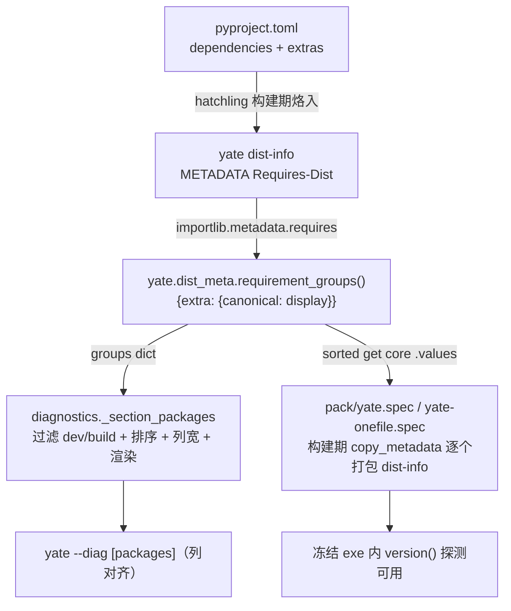

# PR #47 评审修复方案（pr47-review-fixes）

> 来源：[评审记录](../reviews/2026-10-03-pr47-ai-review.md) ← Gitee PR #47
> AI 队友审查（[note_51433486](https://gitee.com/jermaine/yate/pulls/47#note_51433486_conversation_191338572)）。
> 分支：`fix/diag-package-sync`；本方案为该 PR 的追加修复，随 PR 一并合并。
> 依据 plan-before-execute §一判据 1/2（改动 ≥3 文件、涉及运行时与构建期两侧）落盘。

## 一、目标与非目标

**目标**

1. 修复改进项 1：`[packages]` 节列宽按**渲染展示名**计算
   （遍历 `groups[group].values()`），消除"展示名长于规范名"时的冒号错位，
   并附对齐守卫测试（修复前失败、修复后通过）。
2. 修复改进项 2：两 spec 的 core 依赖 dist-info 清单从
   `importlib.metadata.requires("yate")` 构建期自动派生，删除
   `("pyperclip", "textual")` 手写清单；为此把 Requires-Dist 解析抽取为
   stdlib-only 叶子模块 `yate/dist_meta.py`，运行时（diagnostics）与
   构建期（spec）共用同一实现——不新增双维护点。

**非目标**

- 不改 `_SKIPPED_EXTRAS`（dev/build 组不进报告，维持 issue IKJJFI 用户决策）；
- 不动 spec 的 ts 循环（ts extras 仍按 `find_spec` 逐个打包，行为不变）；
- 不改 pack.ps1（上一轮已修，与本评审无关）；
- 不给 `requirement_groups()` 加 dist 参数（唯一消费者是 yate 自身，YAGNI）；
- 不在 spec 中加"core 组为空则告警"（构建环境缺 yate 时
  `collect_submodules("yate")` 已先硬失败，静默降级路径到不了）；
- 不改渲染缩进形态（2 空格标签 / 4 空格明细保持不变）。

## 二、备选方案与否决理由

### 改进项 1（列宽）

- **A. 宽度遍历 `.values()`（采纳）**：一行改动，语义即"按渲染集合取 max"，
  与审查者建议一致。
- B. 渲染改用规范名（键）：改渲染侧显示内容，`Foo_Bar` 之类会显示成
  `foo-bar`，丢元数据声明形态；且 `_package_version()` 探测按声明名更稳。
  否决。
- C. 每组独立列宽：组间错位，视觉更乱（现设计是全节一根对齐线）。否决。

### 改进项 2（spec 派生）

- **A. 抽取叶子模块 `yate/dist_meta.py`，两侧共用（采纳）**：正则与解析逻辑
  单一来源；spec 只 import stdlib-only 模块（`re` + `importlib.metadata`），
  构建期不拉起 editor/textual 导入链；spec 经 sys.path 注入的 PROJECT_ROOT
  与 editable 安装均可解析。
- B. spec 直接 `from yate.diagnostics import _REQ_DIST_RE, _REQ_EXTRA_RE`：
  跨模块引私名；且 `diagnostics.py` 顶层 `from yate.editor import Editor`
  会把整个 editor/textual 导入链拖进 spec 执行期——为两个正则不值得。否决。
- C. spec 内复制两枚正则（注释互指）：清单派生了，解析逻辑却成
  diagnostics + 两 spec 三处副本，恰是本评审要消灭的双维护。否决。
- D. 审查者原片段（`split(";")[0].strip().split()[0]` + `"extra ==" not in r`）：
  **实测证伪**（探针 2026-10-03）——对本仓库真实元数据
  `'textual>=8.0'` 取名得 `'textual>=8.0'`（copy_metadata 必败）；
  无空格 marker `extra=='ts'` 漏过滤。方向保留，实现换正则。否决。

## 三、数据流



## 四、分步实施

> 每步独立提交；提交信息按 `git-commit-message.md`（英文，PowerShell
> here-string）。工作目录：worktree `D:\Programming\yate-diag-package-sync`。

### 步骤 1：登记与方案文档（批准后先行提交）

- **输入**：本方案 + 评审记录（均已落盘待提交）。
- **改动文件**：`.trae/documents/pr47-review-fixes-plan.md`（本文件）、
  `.trae/reviews/2026-10-03-pr47-ai-review.md`。
- **输出**：两笔 `docs` 提交（`docs(plan)` / `docs(reviews)`）。
- **验收**：`git log --oneline -2` 可见；文档内相对链接可达。

### 步骤 2：抽取 `yate/dist_meta.py`（`refactor(diag)` 提交）

- **输入**：`yate/diagnostics.py:56-60`（两个正则常量）与
  `yate/diagnostics.py:440-449`（解析循环）。
- **改动文件**：
  - 新建 `yate/dist_meta.py`（L0 叶子，仅 stdlib：`re` +
    `importlib.metadata`）：迁入 `_REQ_DIST_RE` / `_REQ_EXTRA_RE`
    （`#:` 文档注释），新增公共函数
    `requirement_groups() -> dict[str, dict[str, str]]`——解析
    `requires("yate")` 为 `{extra: {canonical: display}}`，无标记条目入
    `core`；`requires()` 返回 `None` 时返回 `{}`；无前置发行名的畸形条目
    跳过（hatchling 输出恒合法，防御性）。模块 docstring 声明双重消费者。
  - `yate/diagnostics.py`：删除两个正则常量与解析循环，
    `_section_packages()` 改调 `requirement_groups()`；`_SKIPPED_EXTRAS` /
    排序 / 空组过滤 / 渲染留在原处（显示策略归 diagnostics）。
  - `tests/test_diagnostics.py`：3 处
    `patch("yate.diagnostics.importlib_metadata.requires", ...)` 改指
    `yate.dist_meta.importlib_metadata.requires`
    （`version` 探测仍由 diagnostics 的 `_package_version` 发起，其
    patch 目标不变；共涉及
    `test_packages_section_parses_controlled_requirements` /
    `test_packages_section_without_requires_metadata_is_empty` /
    `test_packages_section_without_core_requirements_renders_extras_only`）。
- **输出**：行为等价重构（清单渲染逐字节不变）。
- **验收**：
  - `python -m pytest tests/test_diagnostics.py -q` → 27 passed；
  - `python -m pyright yate/ tests/ tools/` → 0 errors；
  - `python -m pytest tests/test_architecture.py -q` → 22 passed
    （新根模块 stdlib-only，不触碰任何守卫白名单）。

### 步骤 3：列宽修复（`fix(diag)` 提交）

- **输入**：`yate/diagnostics.py` `_section_packages()` 宽度行；
  评审记录改进项 1；探针实测（旧列位 `{11, 12}` / 新 `{12, 12}`）。
- **改动文件**：
  - `yate/diagnostics.py`：
    `width = max(len(name) for group in ordered for name in groups[group].values())`
  - `tests/test_diagnostics.py`：新增
    `test_packages_section_column_alignment_uses_display_names`——
    受控需求 `["textual>=8.0", "Foo__Bar>=1.0; extra == 'ts'"]`
    （展示名 `Foo__Bar` 8 > 规范名 `foo-bar` 7），断言全部明细行
    `": "` 列位唯一；版本探测仍 patch
    `yate.diagnostics.importlib_metadata.version`。
- **输出**：对齐缺陷修复 + 守卫测试。
- **验收**：
  - `python -m pytest tests/test_diagnostics.py -q` → 28 passed
    （新测试在修复前代码上失败、修复后通过，执行时代理须先跑一次
    负向演练再改代码，与 code-review-fixes 惯例一致）；
  - `python -m pyright yate/ tests/ tools/` → 0 errors。

### 步骤 4：spec 构建期派生（`fix(pack)` 提交）

- **输入**：评审记录改进项 2；`pack/yate.spec:82-91` /
  `pack/yate-onefile.spec:89-98`（同构追加段）。
- **改动文件**：`pack/yate.spec`、`pack/yate-onefile.spec`（同构修改）：
  - sys.path 守卫块之后追加
    `from yate.dist_meta import requirement_groups`（须在 PROJECT_ROOT
    入 `sys.path` 之后 import，附注释说明 spec 执行顺序约束）；
  - core 循环替换为：
    ```python
    yate_datas = copy_metadata("yate")
    # Core dependencies derive from yate's own dist metadata (same parser
    # as yate.diagnostics): whatever pyproject lists without an extra
    # marker ships its dist-info, so a new core dep never needs a spec edit.
    for _core_pkg in sorted(requirement_groups().get("core", {}).values()):
        yate_datas += copy_metadata(_core_pkg)
    ```
  - 段落注释同步（`pyperclip` 举例改为"派生自元数据"表述）。
- **输出**：本仓库行为等价（派生结果恰为 `pyperclip`, `textual` 排序），
  新增 core 依赖零 spec 改动。
- **验收**：
  - `python -m py_compile pack/yate.spec pack/yate-onefile.spec` → exit 0
    （pack/ 不在 pyright include 内，语法门禁靠 py_compile + 真实构建）；
  - 快速派生探针（临时脚本，验后删除）：assert 派生结果 ==
    `["pyperclip", "textual"]`。

### 步骤 5：全量门禁 + 冻结冒烟 + 回填

- **输入**：步骤 2-4 的全部改动。
- **验收命令**：
  - `python -m pytest tests/ -q` → 全绿（预期 1574 passed, 7 skipped）；
  - `python -m pyright yate/ tests/ tools/` → 0 errors；
  - `python -m pytest tests/test_architecture.py -q` → 22 passed；
  - `pack\pack.ps1 -SkipChangelog` 重建 + `dist\yate\yate.exe --diag`
    冒烟：exit 0，`[packages]` core 行显示 `pyperclip` / `textual` 真实
    版本（非 "not installed"）且列对齐——同时证明 spec 派生在构建期生效、
    dist-info 仍完整打入。
- **输出**：评审记录复选框勾选 + 提交号回填；方案文档回填执行记录
  （实测数字、偏离若有）；推送更新 PR #47。

## 五、风险与回滚

| 风险 | 缓解 | 残余风险 |
|---|---|---|
| patch 目标迁移漏改（步骤 2） | 同一提交内改齐 3 处；pytest 即刻暴露 | 低 |
| pack/ 不在 pyright include，spec 类型/语法错误逃逸 | py_compile + 真实重建双重门禁 | 低 |
| 构建环境 yate 未安装导致派生为空 | `collect_submodules("yate")` 已先硬失败，不会静默出包 | 极低 |
| `copy_metadata` 按声明名解析失败 | 声明名与现硬编码串完全一致（`pyperclip`/`textual`），且 importlib.metadata 做 PEP 503 规范名匹配 | 极低 |
| 新根模块触碰架构守卫 | `dist_meta.py` stdlib-only：不涉 Protocol/TYPE_CHECKING/log/App 句柄，22 用例复跑确认 | 低 |

回滚：各步独立提交，`git revert` 对应提交即可；无数据/格式迁移，
diagnostics 输出形态除列对齐修复外逐字节不变。

## 六、执行记录（2026-10-03 回填）

按步骤 1-5 全部完成，提交序列（`fix/diag-package-sync`）：
`28f4588` docs(plan) → `fc5dd06` docs(reviews) → `2696aa1`
refactor(diag) 抽取 `yate/dist_meta.py` → `c9c8348` fix(diag) 列宽 →
`736c637` fix(pack) spec 派生 → 本次回填 docs。

实测门禁（worktree）：

- `pytest tests/` → **1575 passed, 7 skipped**（全绿；含新增对齐守卫
  `test_packages_section_column_alignment_uses_display_names` 1 例，较方案
  预期 1574 多 1 系前序会话基线记录口径偏差，硬门槛为全绿）；
- `pyright yate/ tests/ tools/` → **0 errors, 0 warnings, 0 informations**；
- `pytest tests/test_architecture.py -q` → **22 passed**；
- `py_compile pack/yate.spec pack/yate-onefile.spec` → exit 0；
- 派生探针：`sorted(requirement_groups().get("core", {}).values())` ==
  `['pyperclip', 'textual']`（临时脚本验后删除）；
- 冻结重建（`pack\pack.ps1 -SkipChangelog`）+ `dist\yate\yate.exe --diag`
  冒烟：exit 0，`[packages]` 节 core 行 `pyperclip 1.11.0` /
  `textual 8.2.8`、ts 行版本正常（dist-info 完整打入，spec 派生构建期
  生效），全部明细行 `": "` 列位唯一（列 22 对齐）。

步骤 3 负向演练：仅加测试时新用例失败（列位 `{11, 12}`，exit 1），修复后
28 passed（exit 0）。

偏离记录（1 项，已披露）：步骤 2 顺带将 `tests/test_diagnostics.py` 中
`_EXTRA_MARKER_RE` 注释里失效的 `diagnostics._REQ_EXTRA_RE` 引用同步改为
`dist_meta._REQ_EXTRA_RE`（纯注释、同文件一致性修正）。

验证过程更正：门禁复跑时一次误将 cwd 留在主仓（跑成 master 测试集），
已识别并以 worktree cwd 全量重跑为准；另 pyproject `addopts` 已含 `-q`，
命令行再传 `-q` 叠成 `-qq` 会抑制 pytest 摘要行（排查记录）。
