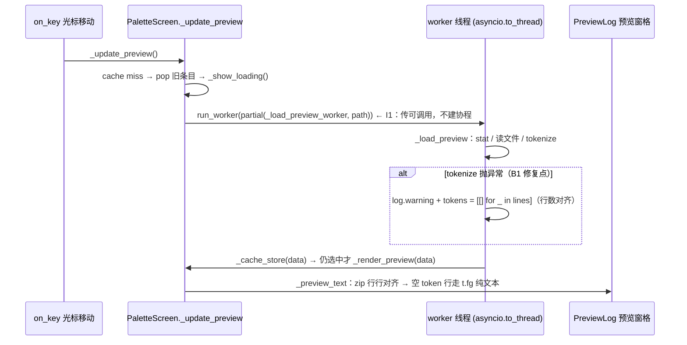

# PR !60 评审修复方案（ctrlp-preview review fixes）

- **来源**：[2026-10-07-pr60-ctrlp-preview-ai-review.md](../reviews/2026-10-07-pr60-ctrlp-preview-ai-review.md)
  （PR !60 第一轮 AI 队友评审，⛔ 1 阻断 B1 + ⚠️ 1 改进 I1，均已核实属实）。
- **执行场**：复用既有 worktree `D:/Programming/yate-ctrlp-preview`
  （分支 `feat/ctrlp-preview`，起点 HEAD `2e138a8`，工作区干净；`.venv` 已存在并自证
  `import yate` 指向本 worktree，遵守 task-orchestration §二.1"续作任务复用、不得重建"）。
- **提交纪律**：每步产物单独提交，只提交不推送（task-orchestration §二）。

## 一、目标与非目标

**目标**

1. B1：tokenize 异常降级后预览仍按纯文本渲染全部行（不再全空白）；
2. I1：`_update_preview` 向 `run_worker` 传可调用对象（`partial`），不提前创建协程；
3. 两条回归测试锁定上述行为（`tests/test_palette_preview.py` 13 → 15 条）；
4. 全量门禁通过并回填实测数字。

**非目标**

- 不动预览的正常渲染路径、缓存策略、worker 线程切分；
- 不重构 `_PreviewData` 结构或 `_preview_text` 的组装逻辑；
- 不处理评审未登记的事项（如 `test_pack_wiki_parallel` 存量失败）；
- 不推送分支、不改 PR 描述。

## 二、备选方案与否决理由

### B1（tokenize 异常 → 预览空白）

| 备选 | 内容 | 裁决 |
|---|---|---|
| A（采纳） | except 块内 `tokens = [[] for _ in lines]`，把行数不变量补齐在**根因处**（`_PreviewData` 的不变量即 tokens 行与 lines 行对齐） | 最小改动；直接兑现 `palette.py:416-417` 注释已声明的设计意图；正常路径零影响 |
| B（否决） | `_preview_text` 改按 `enumerate(data.lines)` + 按下标查 tokens | 改动渲染主路径，让所有调用方为一条异常路径买单；且 `_preview_text` 的文档语义（token 列裁剪到行宽）会被混入长度对齐职责 |
| C（否决） | `zip_longest` 渲染 | tokens 比 lines 长时会多渲染空行，语义反向不清晰；且掩盖了"降级路径应产出对齐 payload"这一数据层责任 |

### I1（run_worker 传协程表达式）

| 备选 | 内容 | 裁决 |
|---|---|---|
| A（采纳） | `partial(self._load_preview_worker, path)` + 顶部 `from functools import partial` | 与同文件 `on_mount` 既有先例（`palette.py:525-530` 传 `self._index_files` + 泄漏注释）完全一致；Textual 接受可调用对象并自行调度 |
| B（否决） | 改传 `self._load_preview_worker`（裸方法引用）+ 另设路径参数通道 | 破坏 `_load_preview_worker(path)` 的现有签名，牵连缓存/渲染逻辑 |
| C（否决） | 顶层 async 包装函数 | 新增模块级符号只为绕开 partial，无收益（违反"能用函数实现的就不造类"的对偶——能用 partial 就不造包装函数） |

## 三、修复后数据流

## 四、分步实施

> 以下命令均在 worktree 目录（`D:/Programming/yate-ctrlp-preview`）以其 `.venv` 执行；
> 行号基于起点 HEAD `2e138a8`。

### 步骤 1 — B1 修复（`yate/editor_view/palette.py`）

- **输入**：`_load_preview` 的 except 块（`:412-418`）。
- **改动**：except 块在 `log.warning` 后补 `tokens = [[] for _ in lines]`，
  并把注释改为如实描述（"对齐为空 token 行，`zip` 走纯文本渲染"）。
- **输出**：降级 payload 满足 `len(data.tokens) == len(data.lines)` 不变量。
- **验收**：步骤 3 的 `test_preview_renders_plain_lines_when_tokenize_fails` 通过。

### 步骤 2 — I1 修复（`yate/editor_view/palette.py`）

- **输入**：stdlib 导入组（`:15-20`）与 `_update_preview` 的 `run_worker` 调用（`:354-357`）。
- **改动**：
  - 导入组按字母序补 `from functools import partial`（`dataclasses` 与 `itertools` 之间）；
  - `:354-357` 改为 `partial(self._load_preview_worker, path)`，附与 `:525-530`
    同款的泄漏注释。
- **输出**：`run_worker` 收到可调用对象，调用时刻不再创建协程。
- **验收**：步骤 3 的 `test_update_preview_passes_worker_callable` 通过。

### 步骤 3 — 回归测试（`tests/test_palette_preview.py`）

- **输入**：既有测试基建（`_Host` / `_palette` / `_preview_plain` / `wait_until`，
  Pilot 无头驱动模式）。
- **改动**：追加 2 条用例（13 → 15）：
  1. `test_preview_renders_plain_lines_when_tokenize_fails`：monkeypatch
     `yate.editor_view.palette.tokenize_document` 抛 `RuntimeError`（补丁打在 palette
     模块命名空间——`palette.py:30` 是 from-import，补丁须落在使用方模块）；
     Pilot 打开文件、`wait_until` 缓存填充后断言 `_preview_plain(screen)` 包含
     `ALPHA_SOURCE` 的首行内容（`"def hello():"`）——即降级渲染了真实行而非空白。
  2. `test_update_preview_passes_worker_callable`：`pilot.pause()` 后 monkeypatch
     `PaletteScreen.run_worker` 为记录器（此时 `on_mount` 的索引 worker 已完成，
     不受影响），驱动光标切到未缓存文件触发 `_update_preview`，断言捕获的首个位置参数
     `callable(...)` 且 `asyncio.iscoroutine(...) is False`（实为绑定 `partial`）。
- **验收命令**：`.venv\Scripts\python.exe -m pytest tests/test_palette_preview.py -q`
  → 15 passed。

### 步骤 4 — 全量门禁（收尾由主代理亲跑）

| 门禁 | 命令 | 通过标准 |
|---|---|---|
| 类型 | `.venv\Scripts\python.exe -m pyright yate tests tools` | 0 errors |
| 单测+架构 | `.venv\Scripts\python.exe -m pytest tests/ -q` | 全绿（已知存量例外：`test_pack_wiki_parallel` 环境性失败，master 同样失败、与本分支零改动面，如实登记不拦截） |
| 覆盖率 | `.venv\Scripts\python.exe -m pytest tests --cov=yate --cov-branch --cov-report=term-missing --cov-fail-under=75` | ≥ 75%（`pyproject.toml:124` 记载口径） |
| 冒烟 | `.venv\Scripts\python.exe -m tools.smoke_test --scenario palette_preview`（入口名执行时以 `tools/smoke_test/cli.py` 实际为准） | 场景全过 |

架构守卫 `tests/test_architecture.py`（22 例）包含在 pytest 全量内。

### 步骤 5 — 回填与收尾

- 本文档回填：各门禁真实数字（前后对比）、偏离记录（如有）、冒烟结论；
- 状态表（§六）更新为终态。

## 五、风险与回滚

| 风险 | 缓解 |
|---|---|
| monkeypatch `run_worker` 干扰 `on_mount` 的索引 worker | 补丁在 `pilot.pause()` 之后进行，`on_mount` 已执行完毕；monkeypatch 自动还原 |
| `tokenize_document` 补丁落错命名空间导致补丁不生效 | 明确补 `yate.editor_view.palette.tokenize_document`（from-import 的使用方侧），测试若未触发即暴露（断言空白失败可见） |
| `test_pack_wiki_parallel` 存量失败干扰判读 | 与 master 行为对照（存量环境问题，记忆与本分支前轮均已登记），单列不拦截 |
| 协程补丁后 worker 行为变化 | `partial` 只是延迟协程创建，Textual 对 callable 的调度与协程等价；`test_preview_follows_cursor` 等既有 13 条用例全量回归兜底 |

**回滚**：分支未推送，worktree 内 `git reset --hard 2e138a8` 可整体回退到评审基准。

## 六、状态表（已回填，2026-10-07）

| 步骤 | 状态 | 结果/偏离 |
|---|---|---|
| 1 B1 修复 | ✅ 完成 | `palette.py` except 块补 `tokens = [[] for _ in lines]`，注释改为如实描述（"对齐空 token 行，zip 仍遍历每行走 t.fg 纯文本"） |
| 2 I1 修复 | ✅ 完成 | stdlib 组补 `from functools import partial`；`_update_preview` 的 `run_worker` 实参改 `partial(self._load_preview_worker, path)` + 同款泄漏注释 |
| 3 回归测试 | ✅ 完成 | `tests/test_palette_preview.py` 13 → 15，目标文件 **15 passed** |
| 4 全量门禁 | ✅ 完成 | 数字见 §八 |
| 5 回填收尾 | ✅ 完成 | 本文 §六/§八 即回填产物 |
| 6 TERM=dumb 加固复跑（用户追加） | ✅ 完成 | 根因 rich dumb-terminal 门控；`cc4ebd6` 测试加固；全量 1976 passed, 0 failed，见 §八 |

## 七、提交计划（只提交不推送）

| 序 | 内容 | 消息 |
|---|---|---|
| 1 | 评审记录登记 | `docs(reviews): register the pr 60 first ai review round` |
| 2 | 本方案 | `docs(plans): add pr 60 review fixes plan` |
| 3 | 两处修复 + 2 条回归测试 | `fix(palette): keep plain-line preview when tokenizing fails` |
| 4 | 门禁结果回填 | `docs(plans): record pr 60 review fix gate results` |

## 八、实测结果（收尾回填，2026-10-07）

执行场自证：worktree `.venv` `import yate` →
`D:\Programming\yate-ctrlp-preview\yate\__init__.py`（沙箱指向本 worktree）。

| 门禁 | 命令 | 实测结果 | 判定 |
|---|---|---|---|
| 目标测试 | `python -m pytest tests/test_palette_preview.py -q` | **15 passed** | ✅ |
| 类型 | `python -m pyright yate tests tools` | **0 errors, 0 warnings, 0 informations**（两轮均测） | ✅ |
| 单测+架构 | `python -m pytest tests/ --tb=no` | 首轮 **1 failed, 1975 passed, 9 skipped**（301.63s）；加固复跑（合并覆盖率，见下）**1976 passed, 9 skipped，0 failed**（461.62s） | ✅ |
| 覆盖率 | `python -m pytest tests --cov=yate --cov-branch --cov-report=term-missing --cov-fail-under=75` | 加固复跑 TOTAL **91.40%**（13313 stmts / 4432 branches，branch mode），gate 75% reached（首轮 91.41% 的 0.01pp 差异源于原失败用例修复后多执行了一个分支） | ✅ |
| 冒烟 | `python -m tools.smoke_test run --scenario palette_preview_renders --scenario palette_preview_truncates --scenario palette_preview_disabled` | renders 13/13 · truncates 9/9 · disabled 12/12 → **3/3 场景，34/34 checks，exit 0**（1.49s） | ✅ |

**"唯一失败"的根因与加固（2026-10-07 用户追加闭环）**：
`tests/test_pack_wiki_parallel.py::test_batch_row_names_the_page_in_flight_and_escapes_markup`
首轮在本仓 agent 环境与 master 检出（`D:/Programming/yate`，`7ab124a`）同样失败，
当时登记为"存量环境问题"；经根因定位，**两处失败同源且与代码无关**——

1. Trae agent shell 导出 **`TERM=dumb`**（另有 `CI=true`）；
2. 测试的 `Console(file=stream, force_terminal=True, width=120)` 只压住 `is_terminal`，
   rich 的 `Live.refresh()` 还有一道独立门：`is_terminal and not is_dumb_terminal`
   （rich `live.py:269`），而 `is_dumb_terminal` 直接读宿主环境
   `TERM ∈ {"dumb", "unknown"}`（rich `console.py:986-988`）；
3. 于是 `TERM=dumb` 下 `progress.refresh()` 是**确定性静默 no-op**，
   `stream.getvalue()` 恒为 `''`，`assert "bracket[name].en.md" in ''` 必败；
   用户手动在正常终端跑则通过。

**对照实证**（同一 worktree、同一 venv、同一用例）：`TERM=dumb` → FAILED；
移除 `TERM` → passed。

**加固**（`cc4ebd6`，测试专用、零行为面）：`_live_display` 的 Console 注入
`_environ={"TERM": "xterm-256color"}`（rich 为测试提供的注入口），使 Live 渲染
与宿主环境解耦。加固后 `TERM=dumb` 下该用例、整个
`test_pack_wiki_parallel.py`（25 passed, 1 skipped）、全量 pytest 均绿——
上表"加固复跑"数字即产自 agent 环境。架构守卫 `tests/test_architecture.py`
22 例含于 1976 passed 内。

**审核结论**（task-orchestration §二.5）：改动面小（2 文件，+67/-2），按
code-review-expert 剧本由主代理亲自评审并如实标注：依赖方向（仅 L2 + stdlib import）、
日志惰性 `%` 占位（R12）、`except Exception` 附 `noqa: BLE001` 且记日志降级、
pyright strict 零诊断、测试走既有 Pilot 基建——无 blocker / major。

**偏离记录**（均为执行细节，非设计变更）：

1. 冒烟命令按计划预注"以 `tools/smoke_test/cli.py` 实际为准"核实出两处差异：
   需要 `run` 子命令；场景名为三个具名场景（`palette_preview_renders/_truncates/_disabled`），
   不存在聚合名 `palette_preview`。
2. 门禁数字采集发现：`pyproject.toml` `addopts = "-q"` 与命令行显式 `-q` 叠加成
   `-qq`，会吞掉 pytest 末尾的 `N failed, M passed` 统计行——采集数字时应省略显式 `-q`。
3. 计划 §四 步骤 4 的命令模板省略了显式 `-q` 后即为实测命令，无其他偏离。
4. （用户追加闭环）首轮登记的"存量环境问题"经根因定位为宿主 `TERM=dumb`
   触发 rich dumb-terminal 门控，已以测试加固根治（`cc4ebd6`）；登记口径由
   "存量不拦截"升级为"已根治并全绿复跑"，见 §八"根因与加固"。
