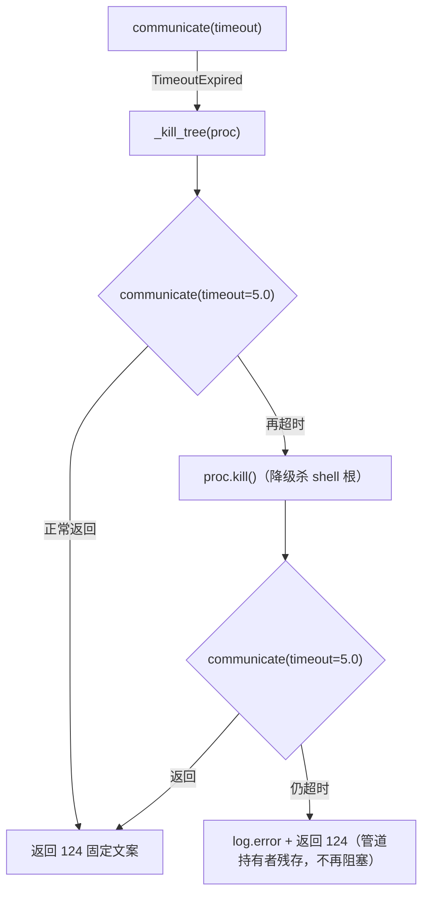

# PR !64 评审修复方案（pr64-test-perf-review-fixes）— 2026-10-08

> 来源评审：[PR !64 note 51468217](https://gitee.com/jermaine/yate/pulls/64#note_51468217_conversation_191486229)
> （AI 队友"PR观察者"，正文经 Gitee API 取回）；评审记录：
> [2026-10-08-pr64-test-perf-ai-review.md](../reviews/2026-10-08-pr64-test-perf-ai-review.md)。
> 复用 worktree `D:\Programming\yate-test-perf`（分支 `enh/test-perf`，其 `.venv` 沙箱已就绪，
> 自证：`.venv\Scripts\python.exe -c "import yate; print(yate.__file__)"` 指向本 worktree）。

## 一、目标与非目标

**目标**：按评审建议修复 1 个阻断项 + 2 个改进项，门禁全绿，仅提交不推送。

**非目标**：不重排 PR !64 既有 3 个提交；不改冒烟场景；不处理评审未提出的
`Path.iterdir/is_dir/is_symlink` 全局 stub（该 seam 为本文件既有惯例，评审未点名）。

## 二、备选方案与否决理由

### B1（阻断）`yate/services/shell.py` 超时兜底第二次 `communicate()` 无界

评审建议：`communicate(timeout=5.0)` + 二次超时降级 `proc.kill()`。

- ✅ 采纳评审建议，并在 `proc.kill()` 之后的最终收尸再包一层 `timeout=5.0`：
  `kill()` 只杀 shell 根，孙进程仍握管道时无界 `communicate()` 依旧可能挂死，
  最终收尸同样必须有界；输出本就丢弃（超时结果只带固定文案），丢弃即安全。
- 否决「直接丢弃输出、不收尸」：`Popen` 未收尸会残留僵尸并由解释器兜底回收，
  且错过异常路径的日志取证；有界收尸 + `log.error` 更干净。
- 否决「把 5.0 做成参数」：无调用方需要调它，YAGNI；常量内联 + 注释说明即可。

### M2（改进）`tests/test_app_manual.py::test_manual_command_selects_language` 固定 `return_value` 丢失路由守卫

评审建议：改 `side_effect` 捕获 `(kind, lang)` 并断言。

- ✅ 采纳：stub 记录调用参数后仍返回 `MANUAL_DOC_FIXTURE`（保留渲染提速收益），
  断言 `calls == [("manual", expected_lang)]`，`expected_lang` = 命令参数原样
  （`bogus` 透传）。`bogus→en` 的归一化在真实 `load_doc_markdown` 内部
  （`manual.py:65-67`），本用例 mock 了它，故断言"命令原样转发语言参数"这一层路由。
- 否决「side_effect 内复刻 bogus→en 归一化再断言 en」：在测试里复刻被测逻辑是恒真
  断言温床（先例：#31 轮 R-17 教训）；归一化归 `load_doc_markdown` 自身单元行为。

### M3（改进）`tests/test_workspace_filter.py` 全局 monkeypatch `pathlib.Path.stat/read_text` 侵入面过大

评审建议：收窄到 `ws._dir_ignores` 等更具体的 seam。

- ✅ 采纳：删除全局 `Path.stat` / `Path.read_text` stub（连同 `raise_long_path_error`
  与 `import os`），改为 `monkeypatch.setattr(Workspace, "_dir_ignores", stub)`
  直接返回空表——与原 stub 经 `OSError` 分支产生的"每目录无 ignore 文件"语义等价，
  但不再触碰 `pathlib` 全局。
- 否决「patch `Path.stat` 但按路径过滤」：仍留在全局 seam 上，路径匹配逻辑脆弱。

## 三、分步实施计划

| 步 | 改动文件 | 输出 | 验收命令 |
|---|---|---|---|
| S1 | `yate/services/shell.py` | 超时路径：`communicate(timeout=5.0)` → 降级 `proc.kill()` → 有界收尸（失败 `log.error`）；新增 `tracing` 模块 logger（R12） | `.venv\Scripts\python.exe -m pytest tests/test_shell.py -q` |
| S2 | `tests/test_shell.py` | 新增钉桩用例 `test_run_shell_bounds_the_drain_when_the_tree_survives_the_kill`：stub `Popen` + no-op `_kill_tree`，钉住"第二次 `communicate` 必须带 timeout"（负向：去掉 timeout 时 stub 抛 `AssertionError`） | 同上 |
| S3 | `tests/test_app_manual.py` | `test_manual_command_selects_language` 改 `side_effect` 捕获 + 断言路由 | `.venv\Scripts\python.exe -m pytest tests/test_app_manual.py -q` |
| S4 | `tests/test_workspace_filter.py` | 删 `raise_long_path_error` 与 `import os`；1500 级链 walk 用例改 stub `Workspace._dir_ignores`；docstring/注释同步 | `.venv\Scripts\python.exe -m pytest tests/test_workspace_filter.py -q` |
| S5 | 收尾门禁（主代理亲自跑） | pyright / pytest / 架构 / 覆盖率 | 见 §五 |

提交切分（每步一笔，不推送）：`fix(shell)`（S1+S2）→ `refactor(tests)`（S3+S4）→
`docs(reviews)`（评审记录 + README 索引）→ `docs(plan)`（本方案 + 回填）。

## 四、B1 超时路径时序

## 五、风险与回滚

- **风险 1**：S1 改动超时路径，真实子进程用例 `test_run_shell_timeout_kills_the_grandchild_process`
  覆盖正常杀树路径；钉桩用例覆盖杀树失败路径。二者都跑，行为回归风险低。
- **风险 2**：S4 改 stub 层级后 1500 级链用例语义变化——只少了"ignore 文件不存在"的
  stat/read，walk 的过滤分支输入不变（`_is_ignored` 收到空表）。
- **回滚**：各提交独立，`git revert` 单笔即可；不触碰 master。

## 六、批准记录

用户指令「登记评论到 reviews 下，复用 worktree 和分支，按评论的建议修复」
（2026-10-08）即本方案的批准依据：方案 = 评审建议的逐条落地，无超范围设计。

## 七、执行记录（收尾回填，2026-10-08）

| 步 | 结果 |
|---|---|
| S1+S2（fix(shell)） | ✅ 提交 `6578714`：两段排水均有界（5s）+ 降级 `proc.kill()` + `log.error` 取证；钉桩用例落位；负向演练通过（临时还原无界写法，钉桩用例变红后还原） |
| S3（manual 路由） | ✅ 提交 `c733fcb`：`side_effect` 捕获 `(kind, lang)`，断言原样透传（对评审建议的细化：bogus→en 归一化在被 mock 的真实 loader 内部，不在测试里复刻——#31 轮 R-17 恒真断言先例） |
| S4（workspace seam） | ✅ 提交 `c733fcb`：全局 `Path.stat/read_text` stub 换为 `Workspace._dir_ignores` 空表 stub，删 `raise_long_path_error` 与 `import os` |
| 门禁 | pyright `yate/ tests/ tools/` **0 errors**；pytest 全量 **1998 passed / 9 skipped**（基线 1997 + 1 钉桩）；架构 **25 passed**；覆盖率 **91.35%**（≥75%） |
| 性能核对 | 用户质疑 fix 拖慢全量（141.28s → 187.09s）。A/B 实测（stash 前后 `test_shell.py --durations`）：杀树用例基线 2.35s / 有 fix 1.08s，超时用例两侧 0.34s——**零回退**；187s 系门禁并发（全量 pyright + 两轮 pytest 同窗）所致墙钟膨胀，run1 141.28s 与计划记录的 143.9s 基线吻合 |
| 偏离 | 无超范围改动；M1 处置按 §二 否决理由细化（非偏离） |

关联：评审记录 [2026-10-08-pr64-test-perf-ai-review.md](../reviews/2026-10-08-pr64-test-perf-ai-review.md)
（README 索引 #39 已登记）。
