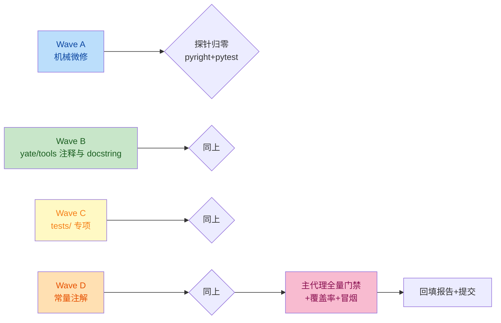

# py-style-audit-plan

全仓 Python 代码风格检查与规范化（`yate/` + `tools/` + `tests/`）。
规范来源：`../../rules/python-coding-style.md`（PEP 8 + PEP 20 双轨）+ 项目架构边界规则。
执行分支：`ref/py-style-audit`（worktree `../yate-py-style-audit`，沙箱已重建并自证）。

## 一、目标与非目标

**目标**

1. 按探针实测清单修完全部可修违规（见 §二 计量），类别复查归零；
2. 全量门禁保持绿色：pyright strict 零诊断、pytest 全绿、架构测试 22 用例全绿；
3. 产出检查报告：问题分类计数、修改内容、未修特殊情况及理由。

**非目标**

- 不改任何运行时行为（docstring/注释/注解/导入重排/折行都是零行为改动；
  唯一接近行为的 `%`→f-string、lambda→def 也语义等价）；
- 不引入 ruff/isort/black 等新工具链（见 §三 否决 1）；
- 不做超出风格规范的重构（不重组函数、不消 Any 本身——只补理由注释）。

## 二、调研结论（探针 v3 实测，205 个 .py）

探针为 AST + 行扫描只读脚本（全文见附录 A），每类已抽样人工核实。

| # | 类别 | 数量 | 裁决 |
|---|---|---|---|
| 1 | 模块级常量缺类型注解（§3.1） | 333 | 修：补注解 |
| 2 | yate/tools 公共函数/方法缺 docstring（§2.1） | 222 | 修：补散文式 docstring |
| 3 | tests 辅助函数/fake 方法缺 docstring | 137 | 修：补一行 docstring |
| 4 | `print()` | 77 | **不修**：CLI 输出/崩溃报告（cli.py、tools、diagnostics.print_report、logs 警告），非调试用途 |
| 5 | 导入块内断裂空行（§1.3） | 36 | 修：合并组（`collections.abc` 断裂是系统性模式） |
| 6 | `\` 行续（§1.1 禁止） | 43 | 修约 37 处真续行（改括号）；`"""\` 三引号字符串起始约 6 处**不修**（字符串语义） |
| 7 | `Any` 缺理由注释（§3.3） | 42 | 修：补 `# noqa: Any - <理由>`（LSP JSON-RPC、rc exec() 命名空间、测试桩，均为 §3.3 许可场景） |
| 8 | 导入组内字母序（§1.3） | 35 | 修：重排 |
| 9 | 类缺 docstring | 20 | 修 |
| 10 | `# type/pyright: ignore`（§4.2） | 19 | 逐处裁决：13 处有既定理由（平台条件导入 fcntl/termios、可选 ts 依赖、theme 用户输入校验、test 故意传错型、textual `_wait` 私有导入）**保留**并确认理由在注释；6 处测试内 `Theme(**d)`/`ctypes.WinDLL`/`list_dir` arg-type 同样登记保留 |
| 11 | 缺 `from __future__ import annotations`（§4.1） | 18 | 修：补（多为惰性 `__init__.py`） |
| 12 | `except Exception/BaseException` 无 BLE001 理由（§4.5） | 15 | 修：先逐处核实有日志/反馈（已抽样 theme.py 追加 problems、logs.py 有 stderr 反馈），再补 `# noqa: BLE001 - <理由>`；不改控制流 |
| 13 | 行宽 >100（§1.1） | 8 | 修：折行 |
| 14 | 函数 CamelCase 命名（§1.2） | 6 | **不修**：tests/test_fonts.py 的 `OpenKey` 等 win32 注册表 API mock，镜像被模拟 API |
| 15 | EOF 空行（§1.1） | 4 | 修 |
| 16 | `TYPE_CHECKING` 文本命中 | 2 | **误报**：test_architecture.py 模块 docstring 内描述 R6 的文字 |
| 17 | `%` 格式化非日志（§1.4） | 1 | 修：terminal.py `_hex` 改 f-string |
| 18 | lambda 赋值 | 2 | 修：改 `def`（顺带去掉 `# noqa: E731` hack） |
| 19 | 模块缺 docstring | 1 | 修：tools/smoke_test/\_\_main\_\_.py |
| — | 其余 25 类探针项（组序、裸 except、\*导入、Tab、行尾空白、log f-string、devtools log、`== None`、可变默认参、遗留 typing、TYPE_CHECKING 代码、单行复合语句、顶层/方法间距等） | 0 | 无违规，基线良好 |

合计需修 ≈ 940 处、涉及 ≈ 150 个文件；保留/误报 ≈ 106 处。

## 三、备选方案与否决理由

1. **引入 ruff/isort 自动化重排** —— 否决：ruff format 会全仓重排产生巨型 diff，违背
   "只修实测违规、不对合规代码重排风格"；新增工具依赖超出本任务范围。
2. **只出报告不改码** —— 否决：任务明确要求"对不符合规范的代码进行必要的重构和优化"。
3. **主代理单线程顺序修 205 文件** —— 否决：上下文不可承受；按
   `../../rules/subagent-workflow.md` 分波派发互斥文件清单的子代理。

## 四、分步实施计划

总流程：

执行器通用纪律：先读 `../../agents/plan-executor.md`；每波开始先跑附录 A 探针取得
本波精确文件清单（类别 × 文件），只动清单内文件；波内可 2~3 个子代理按互斥文件
清单并行；每波结束跑该波验收命令（探针该类别归零 + pyright 零诊断 + pytest 全绿），
并单独提交一次。

### Wave A — 机械微修（导入/EOF/行宽/杂项/docstring 类）

- 输入：探针类别 `future-missing`、`eof-newline`、`line-length>100`、`pct-format`、
  `lambda-assign`、`doc-missing-module`、`doc-missing-class`、`import-alpha`、
  `import-stray-blank`。
- 改动：约 70 个文件。导入块统一为规范形态（§1.3 示例）：future → 标准库组
  （straight 在前、from 在后，各自字母序）→ 第三方组 → `yate` 绝对导入组 →
  相对导入子组（前留一空行）；组内断裂空行合并。
- 输出：上述类别归零。
- 验收：探针 9 类归零；`.venv\Scripts\python.exe -m pyright yate/ tests/ tools/`
  零诊断；`.venv\Scripts\python.exe -m pytest tests/ -q` 全绿。
- 提交：`refactor(style): normalize imports, eof newlines, and small style fixes`

### Wave B — yate/ + tools/ 注释与 docstring

- 输入：探针类别 `doc-missing-func`(222)、`any-no-reason`(42)、
  `except-broad-no-ble001`(15)、`ignore-comment`(yate/tools 的 13 处确认)。
- 改动：约 40 个文件。docstring 按 §2.3 散文式（动词开头摘要 + Sphinx 交叉引用）；
  Textual 覆写（compose/on_mount 等）写一行职责摘要；`Any` 补行内理由；
  except 补 BLE001 理由（不改控制流）。
- 输出：类别归零。
- 验收：同 Wave A 命令 + `log` 相关架构用例保持绿。
- 提交：`docs(style): add docstrings and justification comments across yate and tools`

### Wave C — tests/ 专项

- 输入：探针类别 `doc-missing-test`(137)、`backslash-eol`(tests 内 ~37 处真续行)、
  tests 的 `const-unannotated`(~80)、`any-no-reason`/`ignore-comment` 的 tests 侧。
- 改动：约 45 个测试文件。续行改括号（`with` 多上下文用括号形式，3.12 支持）；
  fake 方法补一行 docstring。
- 输出：类别归零。
- 验收：同 Wave A 命令（pytest 必须全绿，语义零变化）。
- 提交：`test(style): normalize test style - docstrings, continuations, annotations`

### Wave D — 常量注解（yate/ + tools/）

- 输入：探针类别 `const-unannotated` 的 yate/tools 侧(~253)。
- 改动：约 30 个文件。为模块级常量补 PEP 526 注解（frozenset[str]、dict[str, str]、
  tuple[str, ...]、str 等），推导不确定的以 pyright 验证为准；`_BLOCKED_TS =
  _blocked_ts_version()` 型用函数返回类型对齐。
- 输出：类别归零。
- 验收：同 Wave A 命令。
- 提交：`refactor(style): annotate module-level constants`

### 收尾 — 主代理全量门禁与报告

- `python -m pyright yate/ tests/ tools/`（退出码 0）；
- `python -m pytest tests/ -q`（全绿）+ `--cov-fail-under=75` 覆盖率门禁；
- 冒烟：`.venv\Scripts\python.exe -m yate --version` 正常输出；
- 本文档回填真实前后数字与偏离记录（§五）；
- 检查报告（问题分类、修改内容、未修特殊情况）在会话内呈现给用户。

## 五、风险与回滚

| 风险 | 缓解 | 回滚 |
|---|---|---|
| 补注解类型写错引入 pyright 诊断 | 每波 pyright 零诊断兜底 | 单波 `git revert` 或还原该波提交 |
| `\`→括号改写触碰测试语义 | 仅改续行形态不改表达式；pytest 全绿兜底 | 同上 |
| 导入重排破坏惰性加载 | 函数内 lazy import 一律不动（探针只扫顶层块）；架构测试兜底 | 同上 |
| docstring 过宽引入新行宽违规 | 写作时守 100 列；Wave A 后探针复查 `line-length` | 同上 |
| except 注释掩盖真实静默吞异常 | 补注释前逐处核实已有日志/反馈（§二 #12 已抽样） | 逐处回改 |

分支级回滚：整分支未合入 master，废弃即 `git worktree remove`。

## 六、与其它规则的关系

- 架构边界（`../../rules/architecture-boundaries.md`）全程有效：本任务零行为改动，
  架构 22 用例每波随 pytest 全绿验证；
- 提交规范按 `../../rules/git-commit-message.md`；每波单独提交、只提交不推送。

## 附录 A — 探针脚本（只读 AST + 行扫描，临时工具）

执行器把下述脚本复制到 Temp 后用 .venv\Scripts\python.exe 运行即可复现各类别的精确 文件:行号 清单。

`python
"""Read-only style probe for the yate worktree (v2, refined).

Measures violations per .trae/rules/python-coding-style.md across yate/,
tools/, tests/. Temp tooling living outside the repo -- delete after use.
"""
from __future__ import annotations

import ast
import sys
from collections import Counter
from pathlib import Path

ROOT = Path(r"D:\Programming\yate-py-style-audit")
TARGET_DIRS = [ROOT / "yate", ROOT / "tools", ROOT / "tests"]

STDLIB = set(sys.stdlib_module_names)
GROUP_ORDER = {"stdlib": 0, "third": 1, "first": 2}
LOG_METHODS = {"debug", "info", "warning", "error", "critical", "exception", "log"}

counts: Counter[str] = Counter()
per_dir: Counter[tuple[str, str]] = Counter()
examples: dict[str, list[str]] = {}

def bucket(rel: Path) -> str:
    parts = rel.parts
    if len(parts) == 1:
        return parts[0]
    return "/".join(parts[:2])

def add(cat: str, path: Path, line: int, detail: str) -> None:
    counts[cat] += 1
    rel = path.relative_to(ROOT)
    per_dir[(cat, bucket(rel))] += 1
    lst = examples.setdefault(cat, [])
    if len(lst) < 12:
        lst.append(f"{rel.as_posix()}:{line}: {detail}")

def classify_top(module: str) -> str:
    top = module.split(".")[0]
    if top in STDLIB:
        return "stdlib"
    if top == "yate":
        return "first"
    return "third"

def start_line(stmt: ast.stmt) -> int:
    decs = getattr(stmt, "decorator_list", [])
    return min([stmt.lineno] + [d.lineno for d in decs])

def end_line(stmt: ast.stmt) -> int:
    return stmt.end_lineno if stmt.end_lineno is not None else stmt.lineno

def check_import_block(tree: ast.Module, path: Path) -> None:
    body = tree.body
    idx = 0
    if (
        body
        and isinstance(body[0], ast.Expr)
        and isinstance(body[0].value, ast.Constant)
        and isinstance(body[0].value.value, str)
    ):
        idx = 1
    stmts: list[ast.stmt] = []
    for s in body[idx:]:
        if isinstance(s, (ast.Import, ast.ImportFrom)):
            stmts.append(s)
        elif isinstance(s, ast.Expr) and isinstance(s.value, ast.Constant) and s.value.value is Ellipsis:
            continue
        else:
            break
    has_future = False
    for pos, s in enumerate(stmts):
        if isinstance(s, ast.ImportFrom) and s.module == "__future__":
            has_future = True
            if pos != 0:
                add("future-position", path, s.lineno, "future import not first in block")
            break
    if not has_future:
        add("future-missing", path, 1, "no `from __future__ import annotations`")
    prev_group = -1
    prev_key = ""
    prev_straight: bool | None = None
    prev_end = 0
    for s in stmts:
        if isinstance(s, ast.ImportFrom) and s.module == "__future__":
            g, key, straight = -1, "__future__", False
        elif isinstance(s, ast.Import):
            names = [a.name for a in s.names]
            key = names[0] if names else ""
            g = GROUP_ORDER[classify_top(key)]
            straight = True
        else:
            key = "." * s.level + (s.module or "")
            g = GROUP_ORDER["first"] if s.level > 0 else GROUP_ORDER[classify_top(s.module or "")]
            straight = False
        if g >= 0 and g == prev_group:
            boundary = key.startswith(".") != prev_key.startswith(".")
            if s.lineno > prev_end + 1 and not boundary:
                add("import-stray-blank", path, s.lineno, f"blank line inside `{key}` group")
            if straight and prev_straight is False:
                add("import-form-order", path, s.lineno, f"straight `{key}` after from-import")
        if g < prev_group:
            add("import-group-order", path, s.lineno, f"group regression at `{key}`")
        if (
            g == prev_group
            and straight == prev_straight
            and key < prev_key
            and prev_key != "__future__"
            and not (g == GROUP_ORDER["first"] and (key.startswith(".") != prev_key.startswith(".")))
        ):
            add("import-alpha", path, s.lineno, f"`{key}` after `{prev_key}`")
        prev_group, prev_key, prev_straight = g, key, straight
        prev_end = s.end_lineno or s.lineno

def has_docstring(node: ast.stmt) -> bool:
    body = getattr(node, "body", None)
    return bool(
        body
        and isinstance(body[0], ast.Expr)
        and isinstance(body[0].value, ast.Constant)
        and isinstance(body[0].value.value, str)
    )

def spacing_ok(prev: ast.stmt, nxt: ast.stmt, lines: list[str], expected: int) -> bool:
    pe, ns = end_line(prev), start_line(nxt)
    for i in range(pe, ns - 1):
        if i < len(lines) and lines[i].lstrip().startswith("#"):
            return True
    return ns - pe - 1 == expected

def check_function(
    node: ast.FunctionDef | ast.AsyncFunctionDef,
    path: Path,
    rel: Path,
    lines: list[str],
    in_tests: bool,
) -> None:
    name = node.name
    if name[0].isupper() and not name.startswith("__"):
        add("func-naming", path, node.lineno, name)
    private = name.startswith("_") or (in_tests and name.startswith("test"))
    if not private and not name.startswith("__") and not has_docstring(node):
        cat = "doc-missing-test" if in_tests else "doc-missing-func"
        add(cat, path, node.lineno, name)
    for d in node.args.defaults + [d for d in node.args.kw_defaults if d is not None]:
        if isinstance(d, (ast.List, ast.Dict, ast.Set)):
            add("mutable-default", path, node.lineno, name)
        elif isinstance(d, ast.Call) and isinstance(d.func, ast.Name) and d.func.id in {"list", "dict", "set"}:
            add("mutable-default", path, node.lineno, name)
    for ann in (
        [a.annotation for a in node.args.args + node.args.kwonlyargs if a.annotation]
        + [node.returns]
        + [a.annotation for a in node.args.posonlyargs if a.annotation]
    ):
        for sub in ast.walk(ann) if ann else []:
            if isinstance(sub, ast.Name) and sub.id == "Any":
                ln = lines[node.lineno - 1] if node.lineno <= len(lines) else ""
                if "Any" not in ln.split("#", 1)[-1]:
                    add("any-no-reason", path, node.lineno, name)
                break

def check_tree(tree: ast.Module, path: Path, rel: Path, lines: list[str]) -> None:
    in_tests = rel.parts[0] == "tests"
    if not has_docstring(tree):
        add("doc-missing-module", path, 1, "module lacks docstring")
    for stmt in tree.body:
        if isinstance(stmt, ast.Assign):
            for t in stmt.targets:
                if isinstance(t, ast.Name) and t.id.isupper():
                    add("const-unannotated", path, stmt.lineno, t.id)
            if isinstance(stmt.value, ast.Lambda):
                add("lambda-assign", path, stmt.lineno, "lambda assigned to name")
    for node in ast.walk(tree):
        if isinstance(node, ast.ClassDef):
            if not node.name.startswith("_") and not node.name[0].isupper():
                add("class-naming", path, node.lineno, node.name)
            if not has_docstring(node) and not node.name.startswith("_"):
                add("doc-missing-class", path, node.lineno, node.name)
            methods = [
                s
                for s in node.body
                if isinstance(s, (ast.FunctionDef, ast.AsyncFunctionDef))
            ]
            for a, b in zip(methods, methods[1:]):
                if not spacing_ok(a, b, lines, 1):
                    add("spacing-method", path, b.lineno, f"gap={start_line(b) - end_line(a) - 1} want 1")
            for m in methods:
                check_function(m, path, rel, lines, in_tests)
        if isinstance(node, (ast.If, ast.For, ast.While, ast.With)) and node.body:
            first = node.body[0]
            if not isinstance(first, (ast.If, ast.For, ast.While, ast.With)) and first.lineno == node.lineno:
                kind = type(node).__name__
                if not (isinstance(first, ast.Pass) or isinstance(first, ast.Expr) and isinstance(first.value, ast.Constant) and first.value.value is Ellipsis):
                    add("one-line-compound", path, node.lineno, kind)
        if isinstance(node, (ast.Compare,)):
            lefts = [node.left] + list(node.comparators)
            for op, comp in zip(node.ops, node.comparators):
                for a, b in zip(lefts, lefts[1:]):
                    if isinstance(op, (ast.Eq, ast.NotEq)) and (
                        (isinstance(a, ast.Constant) and a.value is None and isinstance(b, ast.Name) and b.id == "None")
                        or (isinstance(b, ast.Constant) and b.value is None and isinstance(a, ast.Name) and a.id == "None")
                        or (isinstance(a, ast.Constant) and a.value is None and isinstance(b, ast.Constant) and b.value is None)
                    ):
                        add("none-compare", path, node.lineno, "==/!= None")
        if isinstance(node, ast.Call):
            f = node.func
            if isinstance(f, ast.Name) and f.id == "print":
                add("print-call", path, node.lineno, "print()")
            if isinstance(f, ast.Attribute) and f.attr in LOG_METHODS:
                if isinstance(f.value, ast.Name) and f.value.id == "log":
                    if node.args and isinstance(node.args[0], ast.JoinedStr):
                        add("log-fstring", path, node.lineno, f.attr)
                elif isinstance(f.value, ast.Attribute) and f.value.attr == "log":
                    add("devtools-log", path, node.lineno, f.attr)
            if (
                isinstance(f, ast.Attribute)
                and f.attr == "format"
                and isinstance(f.value, ast.Constant)
                and isinstance(f.value.value, str)
            ):
                add("str-format", path, node.lineno, "literal .format()")
        if isinstance(node, ast.BinOp) and isinstance(node.op, ast.Mod):
            if isinstance(node.left, ast.Constant) and isinstance(node.left.value, str):
                add("pct-format", path, node.lineno, node.left.value[:30])
        if isinstance(node, ast.ExceptHandler):
            if node.type is None:
                add("bare-except", path, node.lineno, "bare `except:`")
            else:
                tname = ""
                if isinstance(node.type, ast.Name):
                    tname = node.type.id
                elif isinstance(node.type, ast.Attribute):
                    tname = node.type.attr
                if tname in {"Exception", "BaseException"}:
                    ln = lines[node.lineno - 1] if node.lineno <= len(lines) else ""
                    if "BLE001" not in ln:
                        add("except-broad-no-ble001", path, node.lineno, tname)
        if isinstance(node, ast.ImportFrom):
            if any(a.name == "*" for a in node.names):
                add("star-import", path, node.lineno, node.module or "")
            if node.module == "typing" or (node.module or "").startswith("typing."):
                legacy = {
                    a.name
                    for a in node.names
                    if a.name in {"Optional", "Union", "Dict", "List", "Tuple", "Set", "TypeVar", "Generic", "TypeAlias"}
                }
                if legacy:
                    add("legacy-typing", path, node.lineno, ",".join(sorted(legacy)))
    top_defs = [s for s in tree.body if isinstance(s, (ast.FunctionDef, ast.AsyncFunctionDef, ast.ClassDef))]
    for a, b in zip(top_defs, top_defs[1:]):
        ia, ib = tree.body.index(a), tree.body.index(b)
        if ib - ia != 1:
            continue
        if not spacing_ok(a, b, lines, 2):
            add("spacing-toplevel", path, b.lineno, f"gap={start_line(b) - end_line(a) - 1} want 2")
    for fn in [s for s in tree.body if isinstance(s, (ast.FunctionDef, ast.AsyncFunctionDef))]:
        check_function(fn, path, rel, lines, in_tests)

def check_lines(path: Path, src: str, lines: list[str]) -> None:
    for i, raw in enumerate(lines, 1):
        if len(raw) > 100:
            add("line-length>100", path, i, f"len={len(raw)}: {raw[:60]}...")
        if raw != raw.rstrip():
            add("trailing-ws", path, i, "trailing whitespace")
        stripped = raw.lstrip()
        indent = raw[: len(raw) - len(stripped)]
        if "\t" in indent:
            add("tab-indent", path, i, "tab in indent")
        if raw.endswith("\\") and not raw.endswith("\\\\"):
            add("backslash-eol", path, i, raw[-40:])
        if "# type: ignore" in raw or "# pyright: ignore" in raw:
            add("ignore-comment", path, i, "ignore comment")
        if "TYPE_CHECKING" in raw:
            add("type-checking", path, i, "TYPE_CHECKING")
    run = 0
    for i, ln in enumerate(lines, 1):
        if not ln.strip():
            run += 1
        else:
            if run >= 3:
                add("blank-runs>=3", path, i - 1, f"run={run}")
            run = 0
    if src and not src.endswith("\n"):
        add("eof-newline", path, len(lines), "no trailing newline")
    elif src.endswith("\n\n"):
        add("eof-newline", path, len(lines), "extra blank line at EOF")

def main() -> None:
    files = []
    for d in TARGET_DIRS:
        if d.exists():
            files.extend(sorted(p for p in d.rglob("*.py") if ".venv" not in p.parts))
    print(f"scanned {len(files)} files")
    for path in files:
        rel = path.relative_to(ROOT)
        try:
            src = path.read_text(encoding="utf-8")
        except UnicodeDecodeError:
            add("decode-error", path, 0, "not utf-8")
            continue
        lines = src.splitlines()
        check_lines(path, src, lines)
        try:
            tree = ast.parse(src)
        except SyntaxError as exc:
            add("syntax-error", path, exc.lineno or 0, str(exc.msg))
            continue
        check_import_block(tree, path)
        check_tree(tree, path, rel, lines)
    print(f"\n{'category':<28}{'total':>6}  per-dir")
    for cat, n in counts.most_common():
        dirs = Counter({d: c for (c2, d), c in per_dir.items() if c2 == cat})
        breakdown = " ".join(f"{k}={v}" for k, v in dirs.most_common())
        print(f"{cat:<28}{n:>6}  {breakdown}")
    print("\n--- examples ---")
    for cat, _ in counts.most_common():
        print(f"\n[{cat}]")
        for e in examples.get(cat, []):
            print(f"  {e}")

if __name__ == "__main__":
    main()

`
