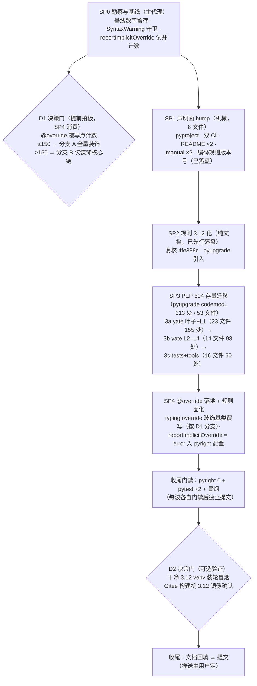

# Python 最低版本升级方案（总纲）：3.10.x → 3.12.x

> 状态：**方案（未执行）** · 2026-09-25 起草，同日拆分为总纲 + 5 个波次子计划。
> 目标：把 `requires-python` 下限从 3.10 提到 3.12。**核心动机是运行时性能收益**
> （3.11 ~1.25× 均值提速 + 3.12 再 +5%，零代码改动免费获得），次要是落地 3.12 语法现代写法
> （`typing.override`、PEP 604 `X | None`、PEP 695 指引），**全程零行为变更、零回退**。
> **唯一规范来源：本目录**——本总纲管全局（证据 / 风险 / 波次 / 约定 / 校准），
> 各 `plan_SP*.md` 是对应波次的执行任务书（独占文件清单 + 验证命令 + 门禁）。冲突时以总纲为准。

## 〇、子计划索引

| 子计划 | 波次 | 性质 | 前置 | 交付 |
|---|---|---|---|---|
| [plan_SP0.md](plan_SP0.md) | 勘察与基线 | 只读勘察（主代理，串行前置） | — | @override 落点清单 + 计数（供 D1）+ 基线数字回填本文校准记录；**不提交** |
| [plan_SP1.md](plan_SP1.md) | 声明面 bump | 机械改 8 文件 | SP0 | commit `chore(project): raise python floor to 3.12`；**性能收益自此全额生效** |
| [plan_SP2.md](plan_SP2.md) | 规则 3.12 化与工具引入 | 纯文档（修订已先行落盘） | SP1 | 复核 commit `docs(rules)`（4fe388c）+ pyupgrade 就位 |
| [plan_SP3.md](plan_SP3.md) | PEP 604 存量迁移 | pyupgrade codemod ×3 子批 | SP2 | commit `refactor(types): adopt PEP 604 unions across the codebase` |
| [plan_SP4.md](plan_SP4.md) | `typing.override` 落地 | 手工装饰（按 D1 分支） | SP3 + D1 | commit `refactor(types): annotate overrides with typing.override` |

决策门：**D1** 在 SP0 末拍板（SP4 消费）；**D2** 收尾可选验证（见 §三波次图）。

## 一、现状盘点（2026-09-25 实测证据）

| # | 事实 | 证据 |
|---|---|---|
| F1 | 声明下限 3.10：`requires-python = ">=3.10"`、pyright `pythonVersion = "3.10"` | [pyproject.toml](../../../pyproject.toml#L10) L10 / L47 |
| F2 | 开发 venv 实跑 **Python 3.13.2** —— 已高于 3.12，venv 无需重建 | `.venv\Scripts\python.exe -V` |
| F3 | 3.12 移除项全仓零命中：无 `distutils`、`typing.io/re`、`utcnow`、`get_event_loop`、`asyncore`/`asynchat`/`smtpd`/`imp`、`shutil.rmtree(onerror=)`、`randrange` 浮点实参、已移除的 unittest 别名（`assertEquals`/`makeSuite` 等）、无 `sys.version_info` 版本分流 shim | 全仓 grep（yate/tests/tools） |
| F4 | 类型现代写法候选接近零：无 `TypeVar` / `Generic` / `TypeAlias` / `typing.Self` / `StrEnum` 实体用法（命中全为散文或关键字表）；仅 1 处 `IntEnum`（editor_lsp/client.py:152，无需动） | 全仓 grep |
| F5 | **无 `Protocol` 实体类**（唯一命中 `LspProtocolError` 是普通异常类命名）；无 PEP 695 `type` 别名候选 | 全仓 grep |
| F6 | `@override` 适用面 ≈ 55 处基类覆写方法（`on_*` / `compose` / `render` / `watch_*` / `key_*` / 常见 dunder），分布 17 个 yate 文件；tests/tools 另有少量 | grep 计数（yate/） |
| F7 | `asyncio.wait_for` 共 38 处（yate 6 处在 editor_lsp，其余在 tests） | grep |
| F8 | 下限声明散布非代码文件：pyproject（2 处）、`.github/workflows/test.yml`（3.11）、`.workflow/test.yml`（Gitee Go，3.11）、README.md / README.zh.md、resources/manual.{en,zh}.md、`.trae/rules/python-coding-style.md` §开头 | grep `3\.10|3\.11` |
| F9 | `asyncio.timeout`（3.11+）/ `itertools.batched`（3.12）/ `tomllib`（3.11）**均无落地场景**：yaterc 解析是手写 parser；`wait_for` 迁移到 `asyncio.timeout` 属语义重构（取消时机与嵌套语义有差异），零收益 | grep + config.py 现状 |
| F10 | pyupgrade `--py312-plus` 可重写目标：旧式泛型 `Dict[`/`List[`/`Tuple[`/`Set[` 与 `TypeAlias` **0 处**；**5 处 `Union[`**（[session.py](../../../yate/session.py#L267) L267、[keymaps/base.py](../../../yate/keymaps/base.py#L168) L168/L232、[pty_proc.py](../../../yate/editor_term/pty_proc.py#L31) L31、[test_key_notation.py](../../../tests/test_key_notation.py#L440) L440）+ 308 处 `Optional[`（F11）——PEP 604 codemod 目标面 | 全仓 grep + pyupgrade 能力对照 |
| F11 | `Optional[` 全仓 **308 处 / 53 文件**（yate 37 文件 248 处；tests 9 文件 38 处；tools 7 文件 22 处）；**无引号形态 `Optional["..."]`**，pyupgrade 重写面均匀无特例 | grep 逐文件计数（2026-09-25 实测） |

## 二、风险与防护

| 风险 | 评估 | 防护 |
|---|---|---|
| 3.12 移除/弃用 API 命中存量代码 | **极低**（F3 已证零命中） | 波次一保留 `compileall -W error::SyntaxWarning` 守卫，防无效转义等 SyntaxWarning 潜伏 |
| 依赖在 3.12 的可用性 | 低：`textual>=8.0`（现装 8.2.8）官方支持 3.12+；py-tree-sitter 保持 `<0.26` 上限**不动**（其 0.26 的 Windows wheel 有 python313.dll 堆损坏问题，与本升级无关，见 pyproject 注释） | 决策门 D2：干净 3.12 venv 装轮验证 |
| CI（GitHub 3.11 腿 + Gitee Go 3.11）与新下限矛盾 | **必须处理**（F8） | SP1 把两条流水线升到 3.12；Gitee 公共构建机若无 3.12 镜像则触发 D2 拍板 |
| `reportImplicitOverride` 开启后诊断面失控 | 中（F6 只是模式计数，含 dunder 后真实数可能更高） | 勘察步（SP0）先试开并**精确计数**，超阈值（>150）走 D1 分支 B |
| 既有 flaky pilot 用例干扰门禁判定 | 中（本会话已加固 3 处，全量 5 次 3 败的教训） | 每波门禁 = pyright 0 + pytest **连续两次**全量全绿 + 冒烟全绿；偶发先单独复跑 ×3 再定性 |

**回退策略**：四个波次（声明面 / 规则化 / PEP 604 迁移 / @override）各自独立提交；四波均零行为变更，
任一波 git revert 单提交即完整回退，互不牵连。SP3 子批内失败按**文件级**回退（`git checkout -- <file>`）复跑。

## 三、波次与依赖

### 性能收益评估（升级核心动机，2026-09-25 补充）

数据来源：外部迁移对照建议（转述 CPython 官方基准与 What's New，非本仓实测）。
关键结论：**绝大部分收益是运行时层面的免费提速，不需要任何代码改动**——这正是把
下限 bump（SP1）作为独立首波的价值：波次一落地，性能收益即全额生效。

| 收益点 | 官方数字（转述） | 对 yate 的相关性 |
|---|---|---|
| CPython 3.11 整体提速 | 比 3.10 平均快 10–60%，标准套件约 **1.25×** | **全额受益**：yate 全量代码随解释器升级免费获得 |
| 3.12 整体再优化 | 约 **+5%**（PEP 709 推导式内联、BOLT 优化） | **全额受益**，同上 |
| 列表推导式（PEP 709 内联） | 微基准最高 2×，实际代码约 11% | **高度相关**：yate 的热路径是推导式密集型——`editor_syntax/regex_backend` 逐行高亮扫描、`editor_term/emulator` 渲染循环、`editor_core` 搜索/文档操作 |
| asyncio 性能改进 | 部分基准可达 **75%** | **高度相关**：yate 是重 asyncio 应用（Textual 事件循环、editor_lsp 38 处 `wait_for`、editor_term pty 读写、补全流程），LSP 往返与终端吞吐直接受益 |
| `isinstance`（runtime-checkable Protocol） | 2–20× | **无增量**（F5：本仓无 Protocol 实体类） |
| `tokenize` 模块（PEP 701） | 最高 64% | **无直接增量**（yate 高亮是自研 regex 引擎，不走 tokenize） |

**注意事项（如实记录）**：有测试称 3.12 冷启动略慢于 3.10（`python -c "pass"` 量级 ~25ms，
源于增强的 AST 错误定位等）。对 yate 影响可忽略：交互式 TUI 一次会话以分钟计，25ms 一次性成本
不构成感知差异；打包 exe（tools/pack）的启动感知同样不受影响。

**与"不迁移项"的关系**：`asyncio.wait_for` → `asyncio.timeout` 维持不动——asyncio 的提速
来自解释器/事件循环本身（升级即得），与 API 形态无关；迁移该 API 的唯一收益是写法风格，
语义重构风险依旧为零收益（F7/F9 判定不变）。

### 不迁移项（明确记录，防过度工程）

- `asyncio.wait_for` → `asyncio.timeout`：38 处，多数被测试直接断言，迁移属语义重构，无收益 → **不动**（F7/F9）。
- `asyncio.gather(..., return_exceptions=True)` → `TaskGroup`（manager.py:668/674/680、client.py:325/330
  关停路径）：TaskGroup 异常时取消兄弟任务并抛 ExceptionGroup，而此处**刻意** return_exceptions
  吞错让任务自行清理（2026-09-25 专项复核）→ 迁移即改行为 → **不动**。
- `asyncio.ensure_future(coro)` → `create_task`（manager.py:358、client.py:361）：3.12 未弃用，
  两者在运行循环内行为等价，仅风格差异、零收益 → **不动**。
- 推导式（PEP 709）：**零迁移项**——内联是解释器行为，升级即自动提速；全 yate 包无
  `for …: .append/extend()` 手工循环可转换形态（multiline grep 实测零命中，模式有效性已验证）。
- `Optional[X]` → `X | None`：**原列为本项，2026-09-25 拍板推翻**——§3.2 规则全面翻转，
  迁移工作独立成 SP3 批次（313 处含 Union），不再是"不迁移项"。
- `from __future__ import annotations`：**保留**（与 PEP 695 兼容，规则 R 不变；本仓无 PEP 695 候选，F5）。
- `tomllib` / `StrEnum` / `itertools.batched`：无候选（F4/F9）→ 零改动；`typing.Self` 存量无候选（F4），
  仅作 §3.2 新代码指引，无迁移动作。

### 工具化策略评估（2026-09-25 二批修订，依据外部迁移对照建议）

外部建议的通用做法是 `pyupgrade --py312-plus` 全仓重写 + 门禁验证。评估结论随 §3.2 规则翻转而演进：

1. **PEP 604 迁移：pyupgrade 由"不采纳"转正为 SP3 指定 codemod**。`Optional[X]`/`Union[X, Y]`
   → `X | Y` 是机械等价重写（313 处，F10/F11），人工逐处改写无增值；迁移后由门禁验证兜底。
2. **仍禁止裸跑**：不带 `--keep-percent-format` 时 pyupgrade 会把 `'%s' % x` 重写为 f-string，
   违反 §4.6 日志惰性求值规则。SP3 统一命令：
   `.venv\Scripts\pyupgrade.exe --py312-plus --keep-percent-format <files...>`。
3. **`@override` 不在语法重写工具能力内**：继承链语义判断（该方法是否真覆写某基类方法）
   无类型信息做不了；`action_*` 分派不得装饰、Textual `on_*` 必须装饰的边界只有类型检查器能划
   → SP4 保持闭环：pyright `reportImplicitOverride` 试开出精确工单（工具定位）→ 主代理逐条落位
   （pyright 只诊断不重写，无现成 codemod）→ 门禁验证（pyright 0 + pytest ×2 + 冒烟）。

pyupgrade 为一次性 codemod，**不进 dev extras**（避免为已完成的一次性迁移固化依赖）；
安装与使用记录随 SP3 执行日志留痕。

## 四、执行约定

1. **顺序**：SP0 → D1 → SP1 → SP2 → SP3（3a→3b→3c 串行）→ SP4 → D2 → 文档回填（本文校准记录 +
   `review.md` 无关条目不动）→ 推送由用户定。**每波独立提交**，前一波门禁全绿才开下一波。
2. **门禁**（每波收尾，主代理统一跑；命令见各 plan 文件）：pyright 全仓 0 诊断；
   `pytest tests/ -q` 连续两次全绿（已知 flaky 单独复跑 ×3 定性）；
   `python -m tools.smoke_test run --fail-only` exit 0（冒烟不并发）。
   例外：SP2 纯文档波降级为 pytest 单跑；SP3 各子批次批级验证为 pyright 0 + pytest 单跑。
3. **任务书授权**：SP1 机械改文件、SP3 各子批（工具 codemod + 批级验证）可交子代理并行/串行执行，
   任务书直接引用对应 plan 文件（已含独占文件清单 + 验证命令 + 报告要求）；
   SP4 `@override` 波动面大，倾向主代理以 `reportImplicitOverride` 诊断清单为工单逐文件处理。
4. **提交**（四个 commit，均为零行为变更，可单波 revert）：
   - SP1 `chore(project): raise python floor to 3.12`
   - SP2 `docs(rules): modernize python coding style for 3.12`（**已先行提交**，4fe388c）
   - SP3 `refactor(types): adopt PEP 604 unions across the codebase`
   - SP4 `refactor(types): annotate overrides with typing.override`

## 五、校准记录

- 2026-09-25（起草阶段复核）：按外部迁移对照建议（`pyupgrade --py312-plus` 工具化路线）逐项实测，
  结论落为「工具化策略评估」小节；新增 F10，5 处 `Union[` 收编入计划，
  F3 证据面扩充（`asyncore`/`asynchat`/`smtpd`/`imp`、`rmtree(onerror=)`、`randrange` 浮点均 0 命中）。
- 2026-09-25（二批修订）：**拍板 §3.2 全面切换 `X | None`**（推翻此前"Optional 保留"约定），
  波次重切为 SP0→D1→SP1→SP2→SP3→SP4（四提交）；新增 F11（`Optional[` 308 处/53 文件逐文件实测，
  无引号形态）；工具化策略评估改写——pyupgrade（`--keep-percent-format`）转正为 SP3 指定 codemod，
  `@override` 仍走 pyright 工单闭环；SP2 规则修订与 SP1 版本号行**已先行落盘**
  （python-coding-style.md §适用范围/§1.2/§1.3/§2.3/§3.2/§3.5/§五清单，
  architecture-boundaries.md 经核查无关联不动）；门禁为纯文档波/子批次定义降级例外。
- 2026-09-25（三批补充）：**性能收益确立为升级核心动机**（文档头 + §三新增「性能收益评估」节，
  外部官方基准转述数据逐项映射 yate 相关性：推导式内联 × regex/emulator 热路径、asyncio 提速 ×
  LSP/pty/补全；isinstance/tokenize 两项经核查对 yate 无增量，如实标注）；冷启动 +25ms 风险
  评估为可忽略；`wait_for`→`timeout` 不迁移判定经性能视角复核后维持。
- 2026-09-25（四批专项复核）：按性能视角全量排查推导式与 asyncio 迁移候选，结论全部落入
  「不迁移项」——①推导式 PEP 709 为解释器行为，零迁移（yate 包无 `for…append/extend` 可转换
  循环，multiline grep 零命中且模式有效性已验证）；②`gather(return_exceptions=True)` 关停路径
  迁 TaskGroup 会改行为（manager.py:668/674/680、client.py:325/330）；③`ensure_future` ×2
  （manager.py:358、client.py:361）与 `create_task` 等价零收益。波次结构不变，无新增批次。
- 2026-09-25（五批拆分）：按仓库既有 `app-layering-refactoring-plans/`（总纲 + 分计划）惯例，
  单文件方案拆为本目录（README 总纲 + plan_SP0…plan_SP4），内容无损迁移，链接深度
  `../../` → `../../../`；**修正 SP1 文件计数 9 → 8**（pyproject 的 2 处声明点此前被误计为 2 文件）；
  SP2 修订已先行落盘（4fe388c）的事实显式写入 plan_SP2。
- （实施时回填：SP0 计数、基线数字、D1/D2 拍板结果、偏离项）
