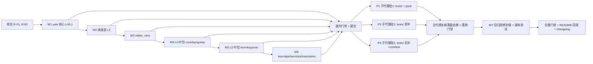

# python-code-review 修复方案（83 项评审登记处置）

> **实施状态**：✅ 已实施 —— 2026-10-05 全量核对：文档自述与代码产物一致。
- **用户指令（2026-10-03）**：全部登记项均尝试修复，即使来源标注"不修"；仅核实后确实无法修复的保留记录不处理；修复完成后回填全部已修 issue。
- **分支 / worktree**：`fix/python-code-review` @ `<worktree>`（沙箱已自证指向本 worktree）。
- **基线门禁实测**（`2c124a7`）：pyright `yate/ tests/ tools/` → 0 errors；`pytest tests/ -q` → 全绿。

## 一、目标与非目标

**目标**
1. 对 R-01…R-83 逐条**先核实、后修复**：子代理 finding 必须由主代理读码复核属实才动代码；核实不成立（误报）或与硬性架构规则冲突的，在处置表中登记理由后跳过（预期仅 R-19，与 R10 直接冲突）。
2. 行为变更类修复（R-09/R-10/R-20/R-33/R-34/R-57/R-58/R-60/R-61/R-20 等）必须伴随回归用例。
3. 收尾全量门禁：pyright strict 零诊断 + pytest 全绿 + `tests/test_architecture.py` 通过 + 覆盖率 `--cov-fail-under=75`；评审记录 README 速览表回填闭环状态。

**非目标**
- 不做评审未登记的重构（8 组件主题订阅收敛 R-31、滚动条主题助手 R-26、pack spec 去重 R-66 等仅按登记范围实施，不扩大）。
- 不升级 Textual / tree-sitter，不改动 R-42 之外的两表共享结构（R-42 采用"emulator 复用 legacy codec"最小方案）。

## 二、备选方案与否决理由

| 方案 | 否决理由 |
|---|---|
| 全部 83 项由主代理串行完成 | tools/ 与 tests/ 文件互不重叠，可按 subagent-workflow 并行下发；全部串行无谓拉长周期（否决并行部分，yate/ 仍由主代理亲自改——子代理禁改产品源码） |
| 派子代理并行修改 `yate/` | 违反 subagent-workflow §一.3（子代理不得改产品源码），不可行 |
| 对 SUGGESTION 级只登记不修 | 用户指令明确"不管有没有标明不修复都要修"，否决 |
| R-19 按 R10 之外的方式"修复"（让未消费键冒泡） | 违反架构规则 R10（一次按键只派发一次），属于**无法修复**项，保留现状并登记 |

## 三、执行波次（文件互斥；每波完成即单独提交并跑波内验收）



### W1 yate 核心 L4/L1（主代理）
- 文件：`yate/dist_meta.py`（R-01）、`yate/config.py`（R-02/R-03）、`yate/cli.py`（R-04/R-05）、`yate/logs.py`（R-06）、`yate/session.py`（R-07/R-08）。
- 验收：`.venv\Scripts\python.exe -m pyright yate/` → 0；`.venv\Scripts\python.exe -m pytest tests/test_config.py tests/test_crash.py tests/test_session*.py tests/test_diag*.py -q` → 全绿。

### W2 调度层 L3（主代理）
- 文件：`yate/document_flows.py`（R-09/R-10 收敛点/R-14/R-15）、`yate/commands.py`（R-10/R-11）、`yate/prompt_completion.py`（R-09 对齐口径）、`yate/completion.py`（R-12/R-13）、`yate/shell_flows.py`（R-16）、`yate/diagnostics.py`（R-17）、`yate/window_flows.py`（R-18）。
- 关键决策：R-09/R-10 的相对路径与 `~` 展开**统一收敛到 `document_flows._open_document` 入口**一次完成（`expanduser` + workspace root 相对化），`_edit` / `_diff` / `_submit_open` 全部走该入口，避免三处各改口径漂移。
- 验收：pyright `yate/` 0；`pytest tests/test_command_path_args.py tests/test_completion_popup.py tests/test_diff_integration.py tests/test_shell.py -q` 全绿。

### W3 editor_view（主代理）
- 文件：`yate/editor_view/palette.py`（R-20/R-29）、`editor.py`（R-21/R-22）、`terminal.py`（R-23）、`diffview.py`（R-24/R-25）、`scrollbars.py` + 三组件（R-26）、`chrome.py`（R-27）、`completion.py`（R-28）、`manual.py`（R-30）、8 组件 + `theme.py`（R-31）。R-19 登记"依 R10 不修"。
- 验收：pyright `yate/` 0；`pytest tests/test_palette.py tests/test_diffview.py tests/test_terminal*.py tests/test_manual.py -q` 全绿；`pytest tests/test_architecture.py -q` 全绿（T1/T2 守卫不回归）。

### W4 L0：editor_core / editor_lsp / editor_syntax（主代理）
- 文件：`yate/editor_lsp/manager.py`（R-32/R-34/R-36）、`protocol.py`（R-35）、`yate/editor_core/buffer.py`（R-33/R-37）、`ts_backend/languages.py`（R-38）。
- 关键决策：R-34 UTF-16 换算加 BMP-only 快速路径（`line.isascii()` 或预扫），避免 ASCII 热路径回归性能；新增回归用例放 `tests/test_lsp.py`。
- 验收：pyright 0；`pytest tests/test_lsp.py tests/test_editor_core.py -q` 全绿（含新增 R-33/R-34 用例）。

### W5 L0：editor_term / keyproto（主代理）
- 文件：`yate/editor_term/emulator.py`（R-39/R-40/R-41/R-42/R-46）、`pty_proc.py`（R-43）、`shells.py`（R-44）、`yate/keyproto/frames.py`（R-45）。
- 关键决策：R-42 让 emulator 键→终端序列路径复用 `keyproto.legacy.textual_key_to_raw`（L0→L0 边，docstring 明文许可），删除本地 `_MOD_ARROWS` 漂移副本；R-39 增量解码器持有于 emulator 实例。
- 验收：pyright 0；`pytest tests/test_terminal*.py tests/test_keyproto.py -q` 全绿。

### W6 keymaps / services / extensions（主代理）
- 文件：`yate/keymaps/vim.py`（R-57/R-60/R-61）、`yate/keymaps/base.py`（R-63）、`yate/services/workspace.py`（R-59/R-62）、`yate/services/extensions.py`（R-64）、`yate/extensions/python_lsp.py`（R-58）、`yate/extensions/csharp_highlight.py`（R-65）。
- 关键决策：R-57/R-61 的 vim 语义修复必须先以真实 vim 行为为准核实（`d2dd` 删 2 行、visual 下 `"v` 进寄存器等待），新增回归用例锁死；R-58 按 `os.name != "nt"` 选 posix。
- 验收：pyright 0；`pytest tests/test_vim*.py tests/test_keymaps*.py tests/test_workspace.py tests/test_python_lsp_ext.py -q` 全绿。

### P1 tools/ + pack/（子代理批 1，acceptEdits；主代理复核）
- 成员 1（独占 `tools/smoke_test/**`、`tools/changelog/**`）：R-47/R-48/R-49/R-50/R-51/R-52/R-53。
- 成员 2（独占 `tools/pack/**`、`tools/release/**`、`pack/`）：R-54/R-55/R-56/R-66。
- 验收（主代理重跑）：pyright `tools/` 0；`pytest tests/test_smoke*.py tests/test_pack*.py tests/test_release*.py tests/test_changelog*.py -q` 全绿。

### P2/P3 tests/（子代理批 2，acceptEdits；主代理复核）
- 成员 3（独占 `tests/conftest.py`、`tests/test_app_textual.py`、`tests/test_command_path_args.py`、`tests/test_completion_popup.py`、`tests/test_action_table.py`、`tests/test_clipboard.py`、`tests/test_key_notation.py`、`tests/test_diff_integration.py`）：R-67/R-68/R-69/R-70/R-71/R-72/R-73/R-75/R-77（R-69/R-70/R-71 的共享 helper 落 conftest.py，归本成员独占，避免与他人冲突）。
- 成员 4（独占 `tests/test_lsp.py`、`tests/test_cli.py`、`tests/test_editor_core.py`、`tests/test_terminal.py`、`tests/test_pty_proc.py`、`tests/test_trust.py`、`tests/test_pack_wiki.py`、`tests/test_screensaver.py`）：R-74/R-76/R-78/R-79/R-80/R-81/R-82/R-83。
- 验收（主代理重跑）：pyright `tests/` 0；`pytest tests/ -q` 全绿；test_app_textual 主题泄漏修复后全件顺序执行无级联失败。

### W7 回归用例补强（主代理）
- 随各波落地的用例外，统一核对：R-33（最后一行 p）、R-34（非 BMP 行）、R-57/R-61（vim count/寄存器）、R-58（Windows 反斜杠）、R-59（2048 边界中文）、R-20（单结果 Down 不执行）、R-40（OSC 中断转义）均有锁定用例；缺则在对应测试文件补。

## 四、处置表（逐条结论回填处）

**实际执行记录（2026-10-03 闭环）**：

| 组 | 条目 | 处置 | 落点 |
|---|---|---|---|
| 不修 | R-19 | 与架构规则 R10 直接冲突，无法修复，保留现状（核实记录见评审文档） | — |
| 修复 | R-01…R-08 | ✅ 已修（`90ad524`；`Document.resolved_path` 缓存涉及 `editor_core/document.py`，W1 文件清单偏离，已按计划 §五记录） | W1 |
| 修复 | R-09…R-18 | ✅ 已修（`5a25613`；路径展开收敛于 `DocumentFlows.resolve_input_path`，`:sp` 的"当前文件目录"语义不受影响） | W2 |
| 修复 | R-20…R-31（除 R-19） | ✅ 已修（`11b4a9d`；R-31 以 `theme.attach/detach` 助手收敛 9 处订阅样板，setattr 显式意图先例同 `apply_slim_scrollbars`；editor.py 原有实例方法 `apply_scrollbar_theme` 一并收敛为模块级助手） | W3 |
| 修复 | R-32…R-38 | ✅ 已修（`22ca26e`；UTF-16 换算带 `isascii()` 快速路径，`OpenDocState` 增持 `doc` 引用供收方向换算） | W4 |
| 修复 | R-39…R-46 | ✅ 已修（`c8293d9`；R-42 经 `keyproto.legacy.modified_key_sequence` 共享表，emulator 本地漂移副本删除） | W5 |
| 修复 | R-57…R-65 | ✅ 已修（`5c51180`；R-57/R-61 为行为变更，`test_vim_keymap.py` 原 `test_visual_quote_then_v_exit_does_not_leak_the_wait_state` 锁定的是缺陷行为，已按新语义改写为 `test_visual_quote_then_v_names_the_register`） | W6 |
| 修复 | R-47…R-56, R-66 | ✅ 已修（子代理 tools-fixer 落盘，`ad7619a`；含新 `tools/_util.py`、`pack/_common.py`） | P1 |
| 修复 | R-67…R-73, R-77 | ✅ 已修（子代理 tests-fix-a 落盘，`bea5e6a`；共享助手收敛至 `tests/conftest.py`） | P2 |
| 修复 | R-74…R-76, R-78…R-83 | ✅ 已修（子代理 tests-fix-b 落盘，`036073b`） | P3 |
| 回归用例 | R-20/R-32/R-33/R-34/R-39/R-40/R-42/R-57/R-58/R-59/R-61 | ✅ 锁定（主代理 `c07b9b5` + `867acea`；LSP 私有助手访问按 `test_workspace_filter` 先例加文件级 pyright pragma） | W7 |

**门禁实测（收尾，主代理亲跑）**：
- `pyright yate/ tests/ tools/ pack/` → **0 errors, 0 warnings**；
- `pytest tests/ -q --cov=yate --cov-fail-under=75` → **全绿，覆盖率 91.26%**；
- `pytest tests/test_architecture.py -q` → **22 passed**。

**偏离记录**：
1. 分支上出现一笔计划外 `1852fc5 Merge branch 'master'`（子代理违规执行 git 操作；带入内容为用户在 master 新增的规则提交 `3fe93c6`——100 次请求上限续作硬规则，内容合法予以保留）。
2. tests-fix-a 首轮约 5 分钟零落盘（探活已发、未判死），后续正常产出全部 9 个名下文件；未触发重建。
3. **R-72 评审记录误标文件**：`test_app_textual.py:429/231` 实际不含硬编码防抖 sleep；真实目标是 `tests/test_diffview.py:231/429`（不在任何成员独占清单）。由主代理接手修复（`wait_until` 轮询替代两处 `asyncio.sleep`），见 `b0d1a3c` 之前的 test_diffview 提交。
4. **R-81 现状偏离**：wiki 的 missing/stale 列表产品侧用 `print()` 落 **stdout**（`tools/pack/wiki.py`），并非任务书假设的 stderr；tests-fix-b 按实际行为断言 stdout。若要求报告走 stderr 属产品改动，登记为后续产品评审项。
5. **R-79 衍生产品侧遗留**：trust 加载把 U+FFFD 乱码行当相对路径按 cwd 解析进信任集合（tests-fix-b 实测发现）；本次按评审记录仅删除断言，产品侧行为登记为后续评审项。
6. 其余按计划执行，无范围/阈值偏离。

## 五、风险清单与回滚

| 风险 | 缓解 / 回滚 |
|---|---|
| R-34 UTF-16 换算影响全部 LSP 消息路径 | BMP 快速路径 + 真实 pyright-langserver 冒烟（现有 test_lsp 假服务端矩阵）+ 独立 commit，可单独 revert |
| R-33/R-57/R-61 改变用户可见 vim 行为 | 先核实真实 vim 语义，用例锁死后实现；独立 commit |
| R-42 删除 emulator 本地表后键序列漂移 | `tests/test_terminal.py` 再导出契约用例兜底；先跑全量 terminal 用例再提交 |
| R-62 ignore 缓存引入过期条目 | 缓存键含 (path, mtime)；`tests/test_workspace.py` 全量回归 |
| R-31/R-26/R-69/R-70/R-71 横向重构触碰多文件 | 每项独立 commit；架构测试 T1/T2 与 pyright 逐波把关 |
| 子代理零产出（历史踩坑） | spawn 配置显式 acceptEdits、spawn 与探活同回合闭合、批大小 2、只认落盘结果；判死后改主代理直接执行，不重建团队 |
| 波次间类型联动（如 `open_path_async` 返回值改动） | 每波全量 pyright 把关；跨波签名变更集中在 W2 一次定形 |

回滚路径：每波独立 commit，任一波门禁不绿即 revert 该波提交后重设计；master 不受影响（全程在 worktree 分支）。

## 六、收尾门禁（主代理亲自跑，退出码 0 才算闭环）

```powershell
.venv\Scripts\python.exe -m pyright yate/ tests/ tools/
.venv\Scripts\python.exe -m pytest tests/ -q --cov=yate --cov-fail-under=75
.venv\Scripts\python.exe -m pytest tests/test_architecture.py -q
```

收尾动作：shutdown 子代理 → 删团队 → 全量门禁 → 回填本方案"处置表"真实结果与偏离记录 → 回填 `.trae/reviews/README.md` 速览表与轮次总表 → 按 `git-commit-message.md` 分波提交（只提交不推送）。
