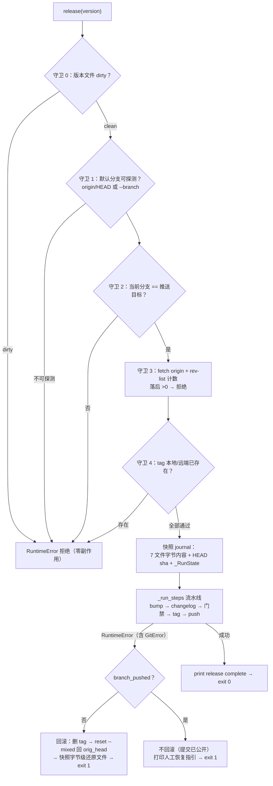

# Release 工具加固方案：前置守卫 + 自动回滚

> 状态：**实施中**（核心代码已暂存，测试与门禁未做）· 2026-09-26 起草。
> 背景：v0.2.5 发布实操暴露 release 工具三类风险——中途失败无回滚、
> 不校验当前分支、不校验远端同步（详见 §一现状）。
> 目标：非 master 不执行、落后远端不执行、失败自动回滚到发布前状态。
> 唯一规范来源：本文档。

## 一、现状（2026-09-26 实测证据）

| # | 事实 | 证据 |
|---|---|---|
| F1 | v0.2.5 发布时工具在第二 bump 处崩溃，`__init__.py` 留半成品 bump，需手工 `git checkout --` 恢复 | 会话实操记录 |
| F2 | dirty 检查只覆盖 `yate/__init__.py`，其余文件未提交照样跑；当前分支完全不校验，feature 分支也能打 tag | [cli.py](../../tools/release/cli.py) 旧版 release() |
| F3 | 落后远端直到最后 push 才 non-fast-forward 失败，此时 bump/changelog 提交与 tag 已落本地，恢复需人工 rebase + 重生成 + 重打 tag | 同上 + v0.2.5 实操 |
| F4 | `origin/HEAD` 引用缺失时默认分支探测失败（v0.2.5 踩坑），但该失败原发生在 push 阶段（所有变更之后） | `_default_branch()` 返回 None 的时机 |
| F5 | **已暂存 WIP**（编译通过）：gitdata 增 `current_branch()`；cli 增 `_RunState` / `current_branch` / `assert_in_sync`（fetch + behind 计数）/ `_local_tag_exists` + `assert_tag_available`（本地 `rev-parse` + 远端 `ls-remote`）/ `_snapshot_texts` / `_run_steps`（流水线抽出，记录 tag_created/branch_pushed）/ `_abort_with_rollback`；`release()` 重写为守卫前置 + try/回滚 | git 暂存区 diff（cli.py +gitdata 联动） |
| F6 | `main()` 已有 `except RuntimeError → exit 1` 出口，守卫拒绝信息直接可用，无需改 | [cli.py](../../tools/release/cli.py#L462-L471) |
| F7 | 既有测试基线：`_default_branch` 真 git 仓用例 ×2、`files_dirty` 真 git 仓用例 ×2、monkeypatch 用例 ×2（含 `test_release_aborts_without_detectable_branch`——新版守卫前置后该用例消息不变、仍应在首个变更前失败，预期兼容） | [test_release_tool.py](../../tests/test_release_tool.py) |

## 二、设计

**关键设计决策**：

1. **守卫全只读**：G0–G4 任一拒绝时，树、历史、tag、远端全部未动——回滚机制只服务于流水线中途失败（G4 之后）。
2. **快照而非 diff**：直接存 7 个目标文件的字节内容（`_VERSION_FILES` 1 个 + `_CHANGELOG_FILES` 6 个），还原即写回；`reset --mixed` 只回退分支指针与索引，不碰工作区，两者配合保证字节级复原且不吞并发改动。
3. **branch_pushed 后不回滚**：分支已上远端，reset 会制造分叉，比失败本身更糟——降级为打印两条人工指令（补推 tag / 废弃发布）。
4. **GitError 归一**：fetch/push 失败均为 `gitdata.GitError(RuntimeError)` 子类，单层 `except RuntimeError` 全兜住。
5. **dry-run 不进 journal**：守卫在 dry-run 下跳过分支/远端/tag 三项（不 fetch），仅保留版本文件 dirty 与默认分支探测，行为与旧版兼容。

## 三、剩余步骤（WIP 已含 §一 F5 全部代码）

| 步 | 动作 | 输入 | 输出 | 验收 |
|---|---|---|---|---|
| S1 | 补测试：守卫组 ×4——错分支拒绝 / 落后远端拒绝 / tag 本地已存在拒绝 / tag 远端已存在拒绝（真 git 仓 + `ls-remote` 打本地 bare origin） | F5 守卫函数 | test_release_tool.py 新用例 4 个 | 新用例全绿；被拒场景 `git log` 计数不变（零副作用断言） |
| S2 | 补测试：回滚组 ×3——门禁失败回滚（monkeypatch `gate_check` 抛错）/ 版本测试失败回滚 / branch_pushed 后跳过回滚（fake push 分支成功、tag 失败） | `_abort_with_rollback` | 新用例 3 个 | 回滚后 HEAD == orig_head、tag 不存在、7 文件字节相等；跳过分支打印指引且不 reset |
| S3 | 补测试：dry-run 零变更冒烟（守卫放宽路径） | `release(dry_run=True)` | 1 个用例 | exit 0 且仓库无新提交、无 tag |
| S4 | 门禁 | — | — | `pyright tools/ tests/` 0；`pytest tests/test_release_tool.py -q` 全绿；`pytest tests/ -q` 全量全绿 |
| S5 | 提交 | S1–S4 产物 | 单 commit `feat(tools): add pre-flight guards and rollback to release tool` | `git status` 干净；不推送由用户定 |
| S6 | 文档回填 | 实测数字 | 本文校准记录补条目 | 与 §五清单一致 |

## 四、测试矩阵（新增 8 用例 + 存量 6 用例回归）

| 用例 | 手段 | 断言核心 |
|---|---|---|
| refuses on wrong branch | 真仓 checkout `dev`，`--branch master` | RuntimeError 含 `checked out on`；提交数不变 |
| refuses when behind remote | origin 多 1 提交，本地未拉 | RuntimeError 含 `behind origin`；fetch 已发生但零变更 |
| refuses on existing local tag | 预建 `v999.0.0` | RuntimeError 含 `already exists locally` |
| refuses on existing remote tag | bare origin 预建 tag | RuntimeError 含 `already exists on origin` |
| rollback on gate failure | monkeypatch `gate_check` → RuntimeError | tag 删净、HEAD 复原、文件字节相等 |
| rollback on version-test failure | monkeypatch `run_version_tests` → 非 0 | 同上 |
| rollback skipped after push | fake `git_push`：分支成功、tag 抛错 | 不 reset；stderr 含 `recover manually` |
| dry-run zero mutation | `release("999.0.0", dry_run=True)` | exit 0；log/tag/文件三不变 |

## 五、风险与防护

| 风险 | 评估 | 防护 |
|---|---|---|
| `ls-remote` 对真实远端网络依赖（测试环境） | 低 | 测试 origin 用本地 bare 仓路径（`file://` 或直接路径），离线可跑 |
| 回滚还原与用户并发改动冲突 | 中（用户在流水线跑时改了 changelog 文件） | 快照覆盖前不做检测，但 changelog 文件本属工具管辖；文档注明"流水线运行期间不要改工作区" |
| fetch 失败（离线）误伤本地可完成的 `--no-push` 发布 | 中 | 现版守卫对 `--no-push` 仍 fetch；如实测碍事，S4 后把 `assert_in_sync` 收进 `not no_push` 分支（登记待定项，不预设） |
| 存量用例兼容（F7） | 低 | `test_release_aborts_without_detectable_branch` 消息未变；S4 全量回归兜底 |

## 六、不做什么（防过度工程）

- 不做 stash 级完整工作区快照（只快照工具管辖的 7 个文件）；
- 不做 tag 的远端删除回滚（远端 tag 仅在 `ls-remote` 守卫中出现，流水线不推远端 tag 失败后的删远端属人工决策）；
- 不引入外部库（shutil/os 字节读写 + gitdata 足够）。

## 七、校准记录

- 2026-09-26 起草：F5 所列核心代码已暂存（未提交），S1–S6 待执行；起草时已核实编译通过、导入无残留 `Optional`（§3.2 合规）、`main()` 出口兼容。
- （执行时回填：测试数、门禁数字、偏离项）
