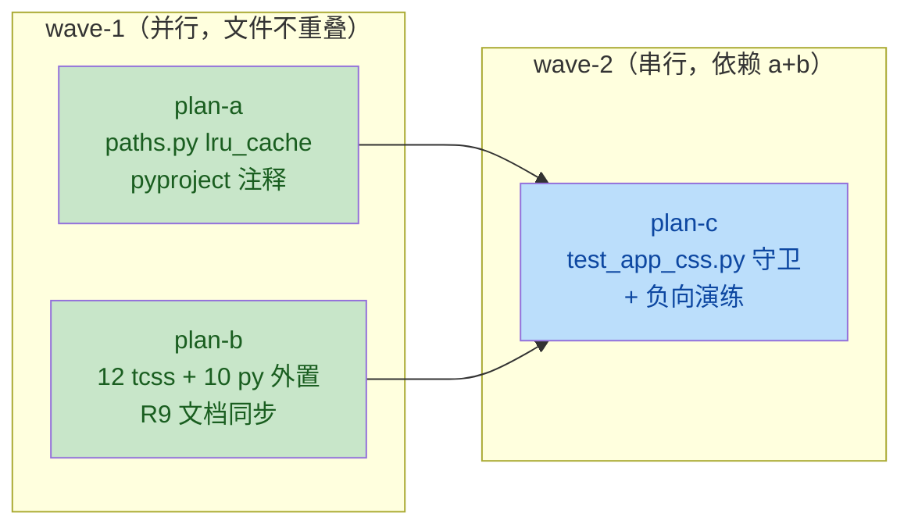
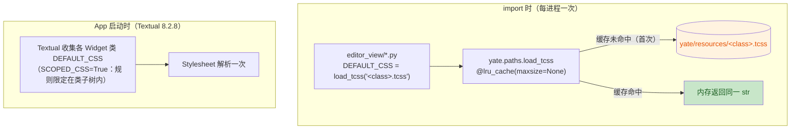

# remove-inline-default-css 总纲（issue IKJHPH）

> **实施状态**：✅ 已实施 —— 2026-10-05 全量核对：文档自述与代码产物一致。
> 分支：`enh/remove-inline-default-css`（worktree `../yate-remove-inline-default-css`，独立 `.venv` 已自证指向本 worktree）

## 一、目标与非目标

**目标**（对应 issue 三点）：

1. py 文件不再内联 CSS 字面量——`yate/` 下所有 widget 类的 `DEFAULT_CSS`
   全部改为经 `yate.paths.load_tcss` 从打包资源装载；
2. 样式统一放在 `yate/resources/` 下（每个 widget 类一个 `<class>.tcss`，
   与既有 `app.tcss` / `screensaver.tcss` 同目录、同装载通道）；
3. 性能：`load_tcss` 增加 `functools.lru_cache`——每个样式表每进程至多读盘一次，
   重复消费从内存取。

**非目标**：

- 不合并为单一 `yate.tcss`（否决理由见 §三）；
- 不修改任何 CSS 规则内容（纯搬运；搬运中发现的可疑规则只登记不改）；
- 不改 `editor_view/manual.py` 的 markdown 手册加载方式（非 tcss 资源）；
- 不手改 `CHANGELOG.md`（由 `python -m tools.changelog` 生成）。

## 二、关键调研事实（文件:行号）

- 内联 `DEFAULT_CSS` 共 **12 个 widget 类 / 13 处**（`commandline.py` 与
  `terminal.py` 各含 2 个类），分布于 10 个文件，全部在 `editor_view/`：

  | 类 | 位置 | 依赖类作用域？ |
  |---|---|---|
  | `CommandInput` | `yate/editor_view/commandline.py:74` | 否（仅自身） |
  | `PromptBar` | `yate/editor_view/commandline.py:207` | **是**（样式化子组件 `Static` / `CommandInput`） |
  | `CompletionPopup` | `yate/editor_view/completion.py:80` | 否 |
  | `EditorView` | `yate/editor_view/editor.py:142` | 否 |
  | `ExplorerTree` | `yate/editor_view/explorer.py:64` | 部分（`&` 嵌套引用组件上下文） |
  | `MarkdownDocScreen` | `yate/editor_view/manual.py:179` | **是**（`#doc-*` 子 id、`MarkdownTable`） |
  | `_OverlayScreen` | `yate/editor_view/modals.py:30` | 部分（`.hint` 无类型前缀） |
  | `PaletteScreen` | `yate/editor_view/palette.py:81` | **是**（`#palette-*` 子 id） |
  | `PaneHost` | `yate/editor_view/panes.py:424` | **是**（`.pane-box` / `.pane-sep-*` 无类型前缀） |
  | `StatusBar` | `yate/editor_view/statusbar.py:57` | 否 |
  | `TerminalView` | `yate/editor_view/terminal.py:77` | 否 |
  | `TerminalPanel` | `yate/editor_view/terminal.py:389` | **是**（样式化子组件 `TerminalView`） |

- Textual 8.2.8 的 `DEFAULT_CSS` 默认**按 widget 类作用域收窄**：
  `dom.py::_get_default_css` 中 `scoped = base.__dict__.get("SCOPED_CSS", True)`
  ——每个类的样式规则被限定在该类子树内。
- 既有迁移先例：`yate/editor_view/screensaver.py:101`
  `DEFAULT_CSS = load_tcss("screensaver.tcss")`（本次照搬该模式）。
- `yate/paths.py:54` `load_tcss` 已存在，无缓存；
  fail-fast 契约：不可读资源抛 `RuntimeError`。
- 打包自动收集（新增 tcss 零配置）：
  `pyproject.toml:111-116`（hatchling 整包收集包内非 Python 文件）、
  `pack/yate.spec:93` 与 `pack/yate-onefile.spec:101`
  （`(pkg_path("resources"), "yate/resources")` 整目录）。
- 测试引用面：`tests/test_explorer.py:370-379` 断言 `ExplorerTree.DEFAULT_CSS`
  的**内容子串**——`DEFAULT_CSS` 仍是字符串属性，搬运后不受影响；
  `tests/test_app_css.py` 守卫 `app.tcss` 模式，本次扩展它（见 plan-c）。
- `yate/docs/` 双语手册无 tcss / DEFAULT_CSS 引用，无需同步。
- 冒烟通道：`python -m tools.smoke_test run --fail-only`。

## 三、备选方案与否决理由

| 方案 | 结论 | 理由 |
|---|---|---|
| **A. 每 widget 类一个 tcss + `load_tcss` 缓存（采纳）** | 采纳 | 与 `screensaver.tcss` 先例同构；完整保留 Textual 类作用域语义；12 次读盘只发生在 import 时每进程一次，`lru_cache` 后重复消费零 IO |
| B. 合并单一 `yate.tcss` 挂 `App.CSS` | **否决** | 会把 `DEFAULT_CSS` 的类作用域降级为全局样式：`PaneHost` 的 `.pane-box` / `.pane-sep-*`（无类型前缀）将泄漏到全应用；`TerminalPanel` 对子组件 `TerminalView` 的样式会与 `TerminalView` 自身块冲突。语义改变 = 行为回归风险 |
| C. 单物理文件 + 自定义分段标记，内存切分后按类分发 | **否决** | 自造解析格式，复杂度换不到收益——两种方案每进程都只读盘一次；"Simple is better than complex" |
| D. 维持现状（内联字面量） | **否决** | 即 issue 要解决的问题：py 内嵌 CSS 无编辑器语法高亮、pyright/AST 工具面混入样式文本 |

## 四、子计划索引与执行波次

| 波次 | 子计划 | 独占文件清单 | 验收 |
|---|---|---|---|
| wave-1 | [plan-a 加载器缓存](remove-inline-default-css-plan-a.md) | `yate/paths.py`、`pyproject.toml` | pyright 零诊断 + 全量 pytest |
| wave-1 | [plan-b 组件 CSS 外置](remove-inline-default-css-plan-b.md) | 12 个新建 `yate/resources/*.tcss`、10 个 `yate/editor_view/*.py`、`.trae/rules/architecture-boundaries.md`（R9 引用行） | pyright 零诊断 + 全量 pytest + 导入冒烟 |
| wave-2 | [plan-c 守卫测试](remove-inline-default-css-plan-c.md) | `tests/test_app_css.py` | pytest + 守卫负向演练 |

wave-2 依赖说明：plan-c 的 AST 守卫扫描 `yate/**` 全部 `DEFAULT_CSS` 赋值——
plan-b 未完成前扫描必红；缓存用例（`a is b`）依赖 plan-a 的 `lru_cache`。

## 五、装载机制（Mermaid）

## 六、风险清单与回滚

| 风险 | 缓解 | 回滚 |
|---|---|---|
| CSS 搬运时缩进/空行差异 | tcss 存去缩进文本；CSS 解析器对缩进不敏感；`test_explorer.py` 断言的是内容子串，不受影响 | 逐笔 commit `git revert` |
| `_OverlayScreen` 带前导下划线 | 资源名去下划线 `overlay-screen.tcss`，加载以字符串为键，无关联 | 同上 |
| `lru_cache` 跨测试泄漏状态 | 缓存值为不可变 `str`，无可变全局状态；缺文件路径抛 `RuntimeError` 不入缓存（异常不缓存） | plan-c 独立回滚 |
| 打包遗漏新 tcss | 已核实 hatchling 整包收集 + 两个 PyInstaller spec 整目录收集 `yate/resources` | — |
| 视觉回归 | CSS 内容逐字节等价（仅去缩进 + 文件头注释）；审核阶段跑 `tools.smoke_test` + pilot 冒烟 | 同上 |

## 七、架构边界核对

- 依赖方向：`editor_view/*`（L2）import `yate.paths`（L0）= 向下依赖，合规；
  不触碰 R1-R6、R10-R12；R9 的 statusbar 行号引用由 plan-b 同步更新。
- 新增交互：无（仅 import 时函数调用，非跨模块消息）。
- 守卫落点：本任务守卫放 `tests/test_app_css.py`（资源打包约定），
  不新增 `tests/test_architecture.py` 用例（分层边界未变）。
