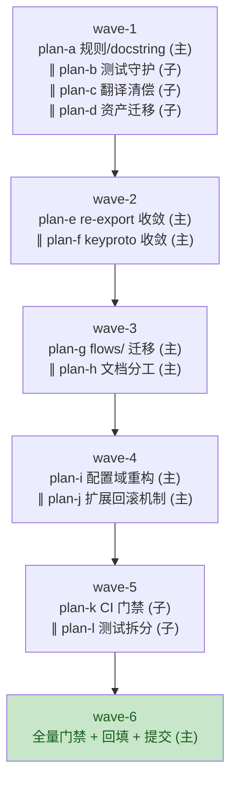
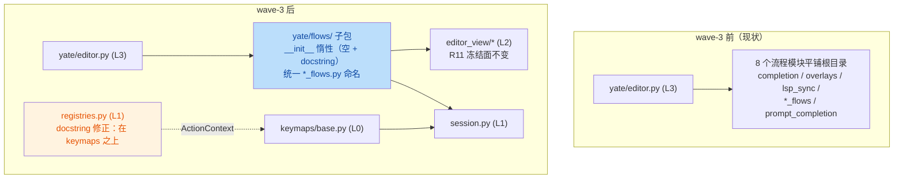

# 仓库架构评审修复方案（repo-audit-fixes-plan）

> 来源评审：[`.trae/reviews/2026-10-07-repo-architecture-audit.md`](../reviews/2026-10-07-repo-architecture-audit.md)
> （A1–A20：0 Critical / 8 Major / 9 Minor / 3 Suggestion）。
> 规范来源：[`../rules/architecture-boundaries.md`](../rules/architecture-boundaries.md)、
> [`../rules/plan-before-execute.md`](../rules/plan-before-execute.md)、
> [`../rules/doc-conventions.md`](../rules/doc-conventions.md)、
> [`../rules/subagent-workflow.md`](../rules/subagent-workflow.md)。
> 本方案落盘于 worktree 分支 `ref/repo-audit-fixes`；**未经批准不进入实施**。

---

## 一、调研事实清单（2026-10-08 实测取证）

评审记录的证据已逐条复核，其中 **5 处与现状不符或需修正**，处置决策以本清单为准：

| # | 评审原判 | 实测事实 | 对决策的影响 |
|---|---|---|---|
| F1 | A5-②："`tools.changelog check` 需新增 `--require-zh` 门禁" | `--require-zh` **已存在**（`tools/changelog/cli.py:13-15, 206-207, 296`），只是 CI 未启用；但其语义是**全部区段**（含未发布）缺翻译即失败（`_missing_zh` 基于 `entries` 全历史，`cli.py:90-93, 197`），与评审建议的"已发布强制、未发布警告"不符 | 本轮动作改为：① 清偿存量；② **修改** `--require-zh` 语义为 released-only（未发布区段降级为警告，与 `check` 的 staleness 门禁语义对齐，`cli.py:169-177` 已是 released-only）；③ CI 启用 |
| F2 | A5：`[缺中文]` 40+ 条 | 属实（未发布 + v0.2.9 区段 36+ 处，grep 输出截断，实测 40+；注意：grep 模式需按字面量处理方括号） | 维持清偿动作 |
| F3 | A3：`session.py:16` 声称 "L0-only dependencies" 但 `editor_core` 与 `services.workspace` "均非 L0 清单成员" | **评审误报**：`editor_core`、`services/*`、`config` 均在 [`../rules/architecture-boundaries.md`](../rules/architecture-boundaries.md) §一 L0 清单内，`session.py:30-34` 的依赖（`yate.config` / `yate.editor_core` / `yate.logs` / `yate.services.workspace`）**全部**是 L0 清单成员，docstring 声明成立 | session.py **不改**；A3 仅处理 registries.py 侧（该半条属实：`registries.py:19` import `keymaps.base`，而 `keymaps/base.py:17` import `yate.session`，registries 实际在 keymaps 之上） |
| F4 | A13："速览 #5（2026-09-26 '扩展 setup 半注册' 已修）与 A13 并存，需核对 `55e1055` 修复范围" | `55e1055`（2026-10-01）是 **ConPTY 句柄串行化修复**（`yate/editor_term/pty_proc.py` + `tests/test_pty_proc.py`），与扩展半注册**无关**；`services/extensions.py:6-9` docstring 仍声明"不保证回收"，`ExtensionAPI` 未记录注册动作，`load_file` except 分支只清 `sys.modules`（`extensions.py:519-525`） | A13 确认未机制化，本轮**做**；且 registries 无 `unregister`（`registries.py:40-96`）、Keymap 无 `remove_binding`（`keymaps/base.py:235-273`），需新增 |
| F5 | A11 行数清单：regex_backend 1097 / vim 1013 / diffview 901 | 评审后继续增长：`regex_backend.py` **1225**、`keymaps/vim.py` **1107**、`editor_view/diffview.py` **1035**（其余实测一致：config 924 / editor 907 / buffer 871 / editor_term/emulator 856 / editor_lsp/manager 818；logs.py 686 仍在"明确不拆"清单）；tests 侧 8 个 ≥1000 行（test_app_textual 5222 / vim_keymap 1663 / editor_core 1305 / lsp 1249 / config 1184 / changelog_tool 1079 / diffview 1064 / ts_backend 1029） | A11 更紧迫；行数登记以本清单为准 |

其余核实通过（与评审一致）：A1 五包 re-export 与消费方（`session.py:31`、`services/extensions.py:41,48`、`editor_view/statusbar.py:19-20`、`editor.py:34-36`、`lsp_sync.py:20-21`、`document_flows.py:27-28`、`completion.py:19-21`、`prompt_completion.py:13`、`commands.py:14`、`editor_view/terminal.py:24`、`editor_view/chrome.py:18`、`editor_view/editor.py:22` 等 yate 内 13 处 + tests 15 处 + 插件文档示例 `yate/docs/extensions.en.md:307`）；A2（`keyproto/__init__.py:16-17` 声明、`driver_windows.py:33-36` 两个私有模块 `textual._xterm_parser` / `textual.drivers._writer_thread`（评审写"三个"，`windows_driver` 不带下划线，笔误）与 `:55` `yate.logs`）；A4（两条流水线 grep `pyright` 零命中）；A6（dev/ts 两组 26 条逐行重复，`pyproject.toml:24-53` vs `:57-88`）；A7/A8/A10/A14/A15/A16/A17 证据全部属实（A15 补充：`.trae/documents` 内 4 项资产无任何文档引用，`tests/test_keyproto.py:117` 注释引用 `win32im_probe.py` 路径需随迁移更新）。

**环境事实**：worktree venv 为 Python 3.13 + pip 24.3.1（`pip --version` 实测）。

---

## 二、目标与非目标

### 目标

1. A1–A20 中 17 条"本轮做"项全部落地（处置见 §三），规则与实现偏差清零；
2. pyright strict 零诊断、`pytest tests/ -q` 全绿、架构守护全绿——**每一波**验收硬门槛；
3. 每条行为改动有对应测试；规则文本修订（A1/A3/A11/A18）与代码同步；
4. CI 补齐 pyright 门禁与 Python 3.13 腿，中文翻译缺翻译门禁落地。

### 非目标

- A12 插件事件订阅 API（新功能开发，本轮不做，见 §三）；
- A19 `editor_sprites/chars/` 合并（评审建议维持现状，登记即可）；
- A11 中 8 个超阈值文件的**代码级拆分**（regex_backend / vim.py 等，登记豁免名单+判定标准，拆分另行立项）；
- flows/ 迁移中不改任何行为逻辑（纯移动 + import 调整）；
- 不引入 Protocol / TYPE_CHECKING / 公共类型层 / EventBus（红线见 §七）。

---

## 三、逐条处置决策（A1–A20）

| # | 处置 | 波次 | 理由（含选型指针） |
|---|---|---|---|
| A1 | **做**——路线 (b')：成文例外 + editor_lsp 定向收敛 | wave-2 | 选型论证见 §四.1 |
| A2 | **做** | wave-2 | `yate.logs` 依赖选"豁免注明"（改回 stdlib logging 反而违反 R12 统一 tracing）；textual 私有 API 收敛到薄适配模块 |
| A3 | **做**（仅 registries 侧，最低成本方案②） | wave-1 | session.py 半条为评审误报（F3）；规则文本同步修订 |
| A4 | **做**（GitHub 侧 lint job；Gitee 侧注释说明） | wave-5 | 评审建议 Gitee 构建机限制下只保留 GitHub 执行 |
| A5 | **做**（两步：清偿 wave-1 / 门禁 wave-5） | wave-1, 5 | 清偿量大（40+ 条），独立子代理并行；门禁语义先修正（F1）再启用 |
| A6 | **做**（守护测试路线）；PEP 735 迁移**缓做** | wave-1 | venv pip 24.3.1 < 25.1，PEP 735 需升级 pip 且改 CI 安装语法（`pip install --group`），风险/收益不匹配；守护测试消除唯一实际危害（版本漂移） |
| A7 | **做** | wave-5 | 纯移动 + import 调整，行为零变化；独立子代理执行避免与产品改动互相干扰 |
| A8 | **做** | wave-4 | 单一选项表放 config.py（L0），apply 映射留在 commands.py（L3 不能反向） |
| A9 | **做** | wave-4 | 与 A8 同文件域（config.py），必须同一执行者同子计划 |
| A10 | **做**（并入 flows/ 迁移） | wave-3 | 见 §四.2 |
| A11 | **做**（规则条款 + 豁免名单）；代码拆分**缓做** | wave-1 | 本轮核心问题是"阈值空转"；三个文件在评审后继续增长（F5），拆分需独立立项防回归 |
| A12 | **不做**（登记缓做：插件事件订阅属新功能开发） | — | 评审已定性为能力面扩展；应在独立功能任务中按 architecture-boundaries §四 既定机制（回调列表）设计，不塞进修复轮 |
| A13 | **做**（机制化半注册回收） | wave-4 | F4 确认未机制化且 55e1055 与此无关；快照-恢复式回滚设计见子计划 |
| A14 | **做**（Linux 3.13 腿）；macOS 腿**不做** | wave-5 | venv 已在 3.13 实跑（环境事实），tree-sitter `<0.26` 上界已 pin 3.13 堆损坏问题；macOS 用户群需求未证 |
| A15 | **做** | wave-1 | 资产无文档引用（除 `tests/test_keyproto.py:117` 注释），迁移零风险 |
| A16 | **做**（分工成文 + 来源声明；不强行合并内容） | wave-3 | manual 是应用内离线阅读硬需求，不能删；docs 为站外权威，两处互注来源声明消除"重叠无人认领" |
| A17 | **做** | wave-1 | tests/README.md 说明"按行为组织"约定 + 7 个无同名测试模块的间接覆盖映射 |
| A18 | **做**（接入清单写入规则） | wave-1 | 评审明确不建议共享 context 类型（公共类型层红线） |
| A19 | **不做**（登记：维持现状，角色数 >40 再评估） | — | 评审建议原文维持现状 |
| A20 | **做**（登记豁免 + A8 后复核） | wave-1, 4 | editor.py:769-840 的 `:set` 后端 setter 随 A8 表驱动部分收敛；复核后若仍 >800 行则登记豁免名单 |

---

## 四、备选方案与否决理由

### 4.1 A1：re-export 规则二选一

**否决路线 (a)——全面禁止 re-export**：把全部消费方改为子模块路径 import。否决理由：
1. 五个包的 re-export 已构成**插件公共 API 契约**——插件手册明文示例
   `from yate.editor_syntax import LangSpec`（`yate/docs/extensions.en.md:307` / `extensions.zh.md:281`），路线 (a) 破坏存量用户插件与文档承诺；
2. 改动面 ~30 处（yate 13 + tests 15 + docs 2），机械但全部是负收益；
3. 唯一实质缺陷（`import yate.editor_lsp` 连带加载 818 行 `manager.py`）只需定向修复，无需全量铺开。

**采用路线 (b')——成文例外 + 定向收敛**：
- `architecture-boundaries.md` §三.5 修订为三层表述：① 包 `__init__.py` 默认惰性；② UI/服务包（`editor_view` / `services`）禁止 re-export（现状惯例成文化）；③ 纯 L0 叶包（`editor_core` / `editor_syntax` / `editor_term` / `keymaps`）允许**有限** re-export 作为插件公共 API 面，须在 `__init__.py` docstring 注明例外理由；
- **定向收敛**：`editor_lsp/__init__.py` 停止 re-export `LspManager`（818 行重模块是唯一惰性违规者），保留 client 轻量符号（`Completion` / `Diagnostic` / `ServerConfig` 等纯数据类）；消费方 8 处改 `from yate.editor_lsp.manager import LspManager`；
- 与规则文本的协调：§三.5 原文"不 re-export 子模块符号"改为上述三层表述，并在五个 `__init__.py` 各加一行例外注明——**规则修订与代码同一子计划落地**，不存在"两套做法"窗口期。

### 4.2 flows/ 迁移（评审 §六）：做

**否决"不做、仅统一命名"**：只改后缀不搬家会把 A10 的收益锁死在命名层，根目录 23 个 `.py` 平铺的层次失真问题（3.2 主要扣分点）依旧；且改后缀本身就要动 import 面，搬运的边际成本接近于零。**否决"拆 logs.py 一并做"**：评审已论证 logs.py 三服务内聚，维持。**采用迁移**：评审已核查改动面（editor.py 10 个 import + 2 处同层互引 + 4 处测试），无 editor_view 反向引用，不制造新依赖方向；`flows/__init__.py` 保持惰性（空 + docstring）；外部以 `yate.overlays` 等路径 import 的破坏面在 0.2.9 阶段最小。合规要点：同步修订规则 §一 L3 清单、R11 冻结文件清单、`tests/test_architecture.py` 的 `UI_FROZEN_FILES` 键路径与文档内 docstring 引用（`yate/editor_view/diffview.py:68`、`tools/smoke_test/scenarios/*.py` 注释、`window_flows.py:21`、`document_flows.py:26` 等实测 24 处）。

### 4.3 A6：PEP 735 vs 守护测试

PEP 735（`[dependency-groups]`）否决：venv pip 24.3.1（<25.1），两条 CI 均需升级 pip 且安装语法变为 `pip install --group dev`，Gitee Go 构建机 pip 版本不可控；收益仅是消除 26 行重复。**采用守护测试**：`tests/test_dependency_groups.py` 用 stdlib `tomllib` 解析 pyproject，断言 ts 组每条（含版本约束）在 dev 组中逐字出现——消除唯一实际危害（ts 升级 dev 漏改导致 `.[dev]` 类型检查与 ts 后端版本漂移）。PEP 735 登记缓做（待 pip 基线 ≥25.1 后另行评估）。

### 4.4 A5 门禁语义

否决"CI 直接开现有 `--require-zh`"：语义是全历史缺翻译即失败，未发布区段每条新提交都会挂 CI，门禁会立刻被绕过或关闭。**采用**：`_missing_zh` 拆为 released/unreleased 两桶（`_build_segments` 已返回带 version 的 `release_segments`），`--require-zh` 改为 released 强制 + unreleased 打印警告，与 `check` staleness 门禁的 released-only 语义（`cli.py:169-177`）一致。

### 4.5 A11/A20：拆分 vs 豁免登记

否决"本轮拆 regex_backend / vim.py"：两者合计 2332 行核心逻辑（tokenizer / motion / operator），拆分是高风险重构，与"评审修复"的任务性质不符，且需要独立方案先行（plan-before-execute 判据 3/4）。**采用**：规则补"超阈值处置"条款（豁免名单 = 单一职责长文件 + 登记理由；拆分判定 = 多职责混合型必拆），8 个文件全部登记并注明理由；editor.py（A20）在 A8 表驱动落地后复核行数，仍超则留在豁免名单。

---

## 五、执行波次总览

执行者约定（subagent-workflow §一.3）：改 `yate/` 产品源码的子计划执行者 = **主代理亲自**；tests / tools / pack / .github / .trae / 文档类可派子代理（2~3 个一批并行，硬上限 6）。

| 波次 | 子计划 | 执行者 | A 条目 | 独占文件域 |
|---|---|---|---|---|
| wave-1 | plan-a 规则与 docstring 修订 | 主代理 | A3, A11, A18, A20(登记) | `.trae/rules/architecture-boundaries.md`, `yate/registries.py` |
| wave-1 | plan-b 测试守护与覆盖说明 | 子代理 | A6, A17 | `tests/test_dependency_groups.py`(新), `tests/README.md`(新) |
| wave-1 | plan-c 中文翻译清偿 | 子代理 | A5-① | `tools/changelog/zh_overrides.json`, `CHANGELOG.zh.md`(generate 刷新) |
| wave-1 | plan-d 文档资产迁移 | 子代理 | A15 | `.trae/documents/fancy-sym-plans/`, `.trae/documents/keybinding-fix-wt-plans/`, `tools/probes/`(新), `.trae/assets/`(新), `tests/test_keyproto.py:117` 注释 |
| wave-2 | plan-e re-export 成文例外与收敛 | 主代理 | A1 | 5 个包 `__init__.py`, `editor_lsp` 消费方 8 处, `tests/test_architecture.py`, `tests/test_lsp.py`, 规则 §三.5 |
| wave-2 | plan-f keyproto 层级收敛 | 主代理 | A2 | `yate/keyproto/*`(3 文件), `tests/test_keyproto.py` 新用例, 规则 keyproto 描述 |
| wave-3 | plan-g flows/ 子包迁移与命名统一 | 主代理 | A10, §六 | `yate/flows/`(新), 根目录 9 文件移动, `yate/editor.py`, `tests/` 4 处 import, `tests/test_architecture.py`, 规则 §一/R11 |
| wave-3 | plan-h 用户文档分工成文 | 主代理 | A16 | `yate/docs/*.md`(README 新增 + themes 双语), `yate/resources/manual.en/zh.md` |
| wave-4 | plan-i 配置域重构（选项表 + 拆分） | 主代理 | A8, A9, A20(复核) | `yate/config.py`, `yate/yaterc.py`(新), `yate/commands.py`, `yate/prompt_completion.py`(wave-3 后为 `yate/flows/prompt_completion.py`), `yate/editor.py`, 相关 tests |
| wave-4 | plan-j 扩展半注册机制化 | 主代理 | A13 | `yate/services/extensions.py`, `yate/registries.py`, `yate/keymaps/base.py`, `tests/test_extensions.py`, `tests/test_registries.py` |
| wave-5 | plan-k CI 门禁补齐 | 子代理 | A4, A14, A5-② | `.github/workflows/test.yml`, `.workflow/test.yml`, `tools/changelog/cli.py` + `segments.py`, `tests/test_changelog_tool.py` |
| wave-5 | plan-l 巨型测试文件拆分 | 子代理 | A7 | `tests/test_app_textual.py`, 拆出的 `tests/test_app_*.py`(新) |
| wave-6 | 收尾（无子计划） | 主代理 | 全量门禁 + 文档回填 + CHANGELOG + 提交 | `.trae/documents/**` 回填, `CHANGELOG*` |



依赖说明：wave-2 → wave-3 串行（plan-e 与 plan-g 都动 `editor.py` / flows 模块 import 面）；wave-3 → wave-4 串行（plan-i 的 `prompt_completion.py` 路径依赖 plan-g）；wave-1 plan-c → wave-5 plan-k 串行（`--require-zh` 启用前必须清偿完毕）；其余同波内文件互不重叠，可并行。

---

## 六、模块交互与架构变动图



触发的边界条款与守卫（`tests/test_architecture.py`）：
- **plan-e**：规则 §三.5 文本修订（非 R 条款变更，惰性语义成文化）；新增守卫用例 `test_editor_lsp_package_root_is_light`（包根不 import `manager`）；
- **plan-g**：R11（冻结文件清单键路径迁移）、§一 L3 清单；既有用例 `test_collaborators_keep_widget_coupling_frozen` / `test_flow_modules_hold_no_app_handle` 的路径面同步更新；
- **plan-i**：R4（config.py / yaterc.py 均在 `UI_FREE_PACKAGES` 守卫面，拆分后守卫列表补 `yaterc.py`）；
- **plan-j**：L1 共享模型新增 `unregister` / `remove_binding`（注册表公开 API，无新依赖边，无 R 条款变更）。

---

## 七、红线自检

- **Protocol / TYPE_CHECKING / Any / `# type: ignore`**：全部子计划不新增；plan-i 的 `SetOption` 是配置专属 dataclass（非协议、非公共类型层，audit A8 已注明合规）；plan-f 适配模块对 textual 私有符号使用**具名导入**而非 Any；
- **包 `__init__` 惰性**：`flows/__init__.py` 空 + docstring；plan-e 的例外路径与修订后的 §三.5 文本同步落地（§四.1）；`yaterc.py` 为模块拆分，不涉及包根；
- **pyright strict 零诊断**：每波验收命令均含 `python -m pyright yate/ tests/ tools/`（wave-1/5 涉及 tools/tests 的子计划同样全量）；
- **新增行为必有测试**：plan-b（依赖组一致性）、plan-e（包根轻量守卫）、plan-f（适配模块冒烟 + 层级守卫）、plan-i（选项表完整性 + `_set` 表驱动行为）、plan-j（回滚三态：新增回收 / 覆盖恢复 / 无副作用）、plan-k（released-only 门禁语义）——详细用例见各子计划；
- **subagent 边界**：wave-1/5 的四个子计划均不改 `yate/`（plan-c 触碰 `CHANGELOG.zh.md` 属根级文档、plan-k 触碰 `tools/`，均合规）。

---

## 八、风险清单与回滚路径

| # | 风险 | 影响 | 缓解 | 回滚 |
|---|---|---|---|---|
| R1 | plan-g 迁移遗漏外部引用（扩展生态以 `yate.overlays` import） | 用户插件 ImportError | 迁移前全仓 grep 24 处引用清单（§四.2）；CHANGELOG 破坏性变更条目 + docs 同步 | `git revert` 单提交；或临时在 `yate/flows/__init__` 外保留旧路径垫片模块（不推荐，违反惰性） |
| R2 | plan-i config 拆分漏改消费方 | 启动崩溃 | 拆分后 grep `yate.config` 全量核对 35 处（§调研已列）；pyright strict 未解析符号必报错 | 恢复 `yaterc.py` 符号在 config.py 的兼容 re-export（模块级，不违反包根惰性）再逐步清理 |
| R3 | plan-j 回滚机制误伤内建注册（覆盖语义恢复错误） | 内建 action/command/键绑定丢失 | 快照-恢复设计（记录被覆盖前值）；三态测试用例；内建表加载发生在扩展之前、扩展不覆盖内建为常规场景 | 回滚 = 删除 recording 机制，恢复 docstring 声明（文档约定回退） |
| R4 | plan-c 翻译质量/术语不一致 | 文档观感 | 以 `tools/changelog/zh_overrides.json` 存量术语为准（"扩展/键映射/工作区"）；逐条过 `zh-commit` 校验 | JSON 单文件回退 |
| R5 | plan-l 拆分漏搬测试或夹带行为修改 | 覆盖缺口 | 铁律：纯移动，`pytest tests/test_app_textual.py tests/test_app_*.py -q` 前后用例数一致；diff 审查禁止改断言 | 单提交回退 |
| R6 | plan-k pyright CI 在 runner 上拉取 npm 失败 | CI 红灯假阳性 | `pyright --version` 预热步（runner 自带 node）；失败时暂改为 `--outputjson` 排查，不关闭门禁 | revert workflow 提交 |
| R7 | 3.13 腿暴露 Textual/tree-sitter 兼容问题 | CI 红灯 | venv 已在 3.13 实跑全套测试（环境事实）；tree-sitter `<0.26` 上界已 pin | matrix 移除 3.13 include 并在 workflow 注明原因 |
| R8 | 波次并行时 Textual pilot timing 偶发失败 | 误判回归 | subagent-workflow §三.3：先重跑确认；wave-5 两个子代理验收命令限定各自子集，全量回归归 wave-6 | 重跑 |

---

## 九、执行就绪清单（各波验收命令汇总）

统一形态：PowerShell，解释器 `.venv\Scripts\python.exe`，基准为仓库根。每条命令退出码 0 为通过。

```powershell
# ---- 通用（每波必跑）----
.venv\Scripts\python.exe -m pyright yate/ tests/ tools/
.venv\Scripts\python.exe -m pytest tests/ -q
.venv\Scripts\python.exe -m pytest tests/test_architecture.py -q

# ---- wave-1 plan-a（A3/A11/A18）----
# 上述通用命令即可（registries docstring + 规则文本，无行为变化）

# ---- wave-1 plan-b（A6/A17）----
.venv\Scripts\python.exe -m pytest tests/test_dependency_groups.py -q

# ---- wave-1 plan-c（A5-①）----
.venv\Scripts\python.exe -m tools.changelog check
# stats 行 missing zh translation(s) 必须为 0

# ---- wave-1 plan-d（A15）----
# 通用命令 + 引用完整性（人工确认旧路径 grep 零命中）：
#   Select-String -Path **\*.md -Pattern "fancy-sym-plans/roster.svg","keybinding-fix-wt-plans"

# ---- wave-2 plan-e（A1）----
.venv\Scripts\python.exe -c "import yate.editor_lsp, sys; assert 'yate.editor_lsp.manager' not in sys.modules"
.venv\Scripts\python.exe -m pytest tests/test_architecture.py tests/test_lsp.py -q

# ---- wave-2 plan-f（A2）----
.venv\Scripts\python.exe -m pytest tests/test_keyproto.py -q

# ---- wave-3 plan-g（A10 + flows 迁移）----
.venv\Scripts\python.exe -m pytest tests/test_architecture.py tests/test_app_textual.py tests/test_explorer.py tests/test_changelog_view.py tests/test_prompt_completion.py -q

# ---- wave-3 plan-h（A16）----
# 纯文档：misc-rules 豁免；人工核对双语成对（docs README + themes 双语 + manual 来源声明）

# ---- wave-4 plan-i（A8/A9/A20）----
.venv\Scripts\python.exe -m pytest tests/test_config.py tests/test_action_table.py tests/test_prompt_completion.py tests/test_app_textual.py -q
# editor.py 行数复核：(Get-Content yate\editor.py).Count

# ---- wave-4 plan-j（A13）----
.venv\Scripts\python.exe -m pytest tests/test_extensions.py tests/test_registries.py tests/test_keymap_set.py -q

# ---- wave-5 plan-k（A4/A14/A5-②）----
.venv\Scripts\python.exe -m pytest tests/test_changelog_tool.py -q
.venv\Scripts\python.exe -m tools.changelog check --require-zh   # 语义修正后本地可复现 CI

# ---- wave-5 plan-l（A7）----
.venv\Scripts\python.exe -m pytest tests/test_app_textual.py tests/test_app_explorer.py tests/test_app_terminal.py tests/test_app_panes.py tests/test_app_find.py -q

# ---- wave-6（主代理收尾）----
# 通用三条 + 手工冒烟：
.venv\Scripts\python.exe -m yate --help
.venv\Scripts\python.exe -m tools.smoke_test --help
```

---

## 十、子计划索引

子计划落盘于 [`repo-audit-fixes-plans/`](repo-audit-fixes-plans/overview.md)（总纲）：

- wave-1：[`repo-audit-fixes-rules-docstring-plan-a.md`](repo-audit-fixes-plans/repo-audit-fixes-rules-docstring-plan-a.md)（主代理）·
  [`repo-audit-fixes-tests-guard-plan-a.md`](repo-audit-fixes-plans/repo-audit-fixes-tests-guard-plan-a.md)（子代理）·
  [`repo-audit-fixes-changelog-zh-plan-a.md`](repo-audit-fixes-plans/repo-audit-fixes-changelog-zh-plan-a.md)（子代理）·
  [`repo-audit-fixes-assets-plan-a.md`](repo-audit-fixes-plans/repo-audit-fixes-assets-plan-a.md)（子代理）
- wave-2：[`repo-audit-fixes-reexports-plan-b.md`](repo-audit-fixes-plans/repo-audit-fixes-reexports-plan-b.md) ·
  [`repo-audit-fixes-keyproto-plan-b.md`](repo-audit-fixes-plans/repo-audit-fixes-keyproto-plan-b.md)（均主代理）
- wave-3：[`repo-audit-fixes-flows-package-plan-c.md`](repo-audit-fixes-plans/repo-audit-fixes-flows-package-plan-c.md) ·
  [`repo-audit-fixes-docs-split-plan-c.md`](repo-audit-fixes-plans/repo-audit-fixes-docs-split-plan-c.md)（均主代理）
- wave-4：[`repo-audit-fixes-config-options-plan-d.md`](repo-audit-fixes-plans/repo-audit-fixes-config-options-plan-d.md) ·
  [`repo-audit-fixes-extension-rollback-plan-d.md`](repo-audit-fixes-plans/repo-audit-fixes-extension-rollback-plan-d.md)（均主代理）
- wave-5：[`repo-audit-fixes-ci-plan-e.md`](repo-audit-fixes-plans/repo-audit-fixes-ci-plan-e.md)（子代理）·
  [`repo-audit-fixes-test-split-plan-e.md`](repo-audit-fixes-plans/repo-audit-fixes-test-split-plan-e.md)（子代理）

缓做/不做登记：A12（插件事件订阅——独立功能任务，按 architecture-boundaries §四回调列表机制另行方案先行）；A19（维持现状，`editor_sprites/chars/` 角色数 >40 再评估合并）；A6-PEP735（待 pip 基线 ≥25.1）；A11 代码拆分（regex_backend / vim.py / diffview 等待独立立项）。
