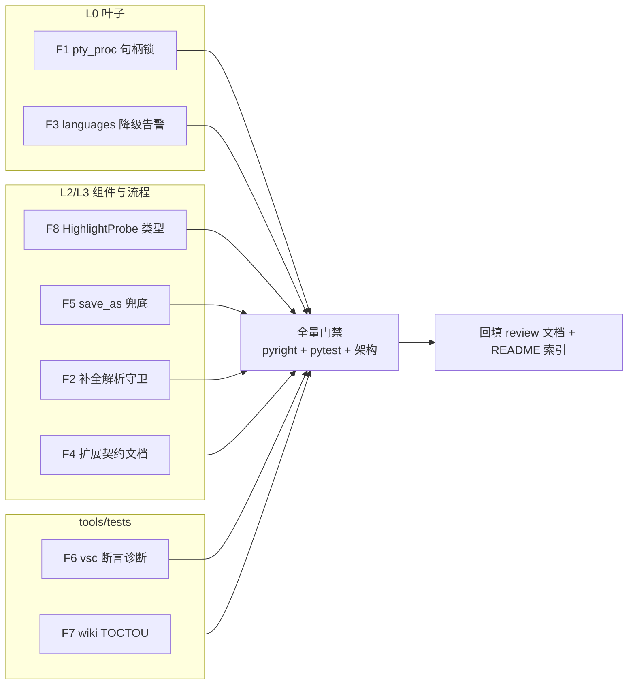

# reviews-open-issues-fixes-plan（reviews 未闭环问题核实与修复）

> 来源：Gitee Issue [IKJFMO](https://gitee.com/jermaine/yate/issues/IKJFMO)
> 「修复 .trae/reviews/ 下所有 review 文档列出的各个问题：1. 先核实是否存在，或者已经修复，
> 或者无效（代码的变更和重构后造成的）；2. 修复存在的 issues」。
> 核实基准：2026-10-01 当前代码。索引基线：`.trae/reviews/README.md` §一（15 条未闭环项）+
> `legacy-issues.md`（3 条 2026-10-01 登记的权衡项）。

## 一、目标与非目标

**目标**

1. 对 README §一 15 条未闭环项逐条核实当前状态（仍存在 / 已被后续重构修复 / 处置决定仍有效）；
2. 修复核实后仍然成立的条目（7 组代码修复，见 §三 F1–F7）；
3. 回填各 review 文档与 README 索引的处置状态，使索引恢复"无未核实条目"。

**非目标**

- `ctrl+1` Phase B 自建输入通道（win-keybinding-plan.md，特性级工作量，另行排期）；
- PB5 三终端矩阵人工复测（需真机，非代码项）；
- Gitee Go 3.12 流水线实测（需 Gitee 基础设施触发，非本地代码项）；
- `legacy-issues.md` 3 条 2026-10-01 登记的权衡项（文档自身明确"当前不修复，触发条件出现再评估"）；
- 已标记 ⏸ 不修 / 📌 记录保留条目的翻案（核实后确认处置依据仍成立，维持原决定）。

## 二、核实结论总表

### 2.1 修复类（🔧，核实仍成立 → 本轮修）

| # | 出处 | 问题 | 核实证据（2026-10-01） | 修复 |
|---|---|---|---|---|
| F1 | 2026-09-26-full-project-review #1 | ConPTY 句柄跨线程关闭竞态 | `pty_proc.py:600` `write` 读 `_in_write` 无锁；`:608` `resize` 读 `_hpc` 无锁（`_hpc_lock` 只在 `_close_pty:565` 使用）；`:623` `close` 关闭 `_in_write`/`_out_read` 无锁——TOCTOU 窗口全部仍在 | F1 |
| F2 | 同上 #2 | 补全 worker 残余异常静默 | `manager.py:443` try 只兜 `LspError/OSError/CancelledError`；`:445-453` `_unwrap_completion`/`_parse_completion_item` 在 try 外，畸形响应异常沿 `_worker`（`completion.py:165` 无 try/except）被 `exit_on_error=False` 抑制 | F2 |
| F3 | 同上 #3 | 高亮降级零日志 | 部分改善：`languages.py:151/161` 已有 `log.debug`（追踪模式可见）；但 review 要求的 warning 级 + 按语言去重未做——正常会话仍无感知 | F3 |
| F4 | 同上 #4 | 扩展 setup 半注册 | `extensions.py:419-430` teardown 仅捕获成功注册的 hook；注册表回滚不存在——按 review"最低成本方案"以契约文档化落地 | F4 |
| F5 | 2026-09-29-pr37 #1 | `_submit_save_as` read_only 恢复无兜底 | `document_flows.py:332-340` 恢复仅在 `except (OSError, UnicodeError)` 分支；未预期异常（如 `set_root`/`refresh_tree` 抛错）标志残留解锁态 | F5 |
| F6 | 2026-09-29-pr38 #1 | 重复 raw key 断言无诊断信息 | `test_vsc_keymap.py:24` 仍是 `assert len(keys) == len(set(keys))` | F6 |
| F7 | 2026-10-01-pack-wiki #2 | `_collect_bilingual` TOCTOU | `wiki.py:170` 收集期 `exists()` 判定、`:523-524` `run()` 直接 `read_bytes()` 无 OSError 兜底 | F7 |
| F8 | 2026-09-25-recheck #2 | `HighlightProbe.doc` 宽泛类型 | `editor_view/editor.py:65` `doc: object`；`:152` `_hl_doc: object = None` 均未收紧 | F8 |

### 2.2 已被后续重构修复（核实后销项，不再改码）

| # | 出处 | 问题 | 销项证据 |
|---|---|---|---|
| — | 2026-09-26-full-project-review #5 | `editor.py` 组装过载（1323 行） | editor-split 后 `editor.py` 822 行；组装已拆模块级工厂 `_build_models`/`_build_widgets`/`_build_pane_stack`，`_build_models` docstring 自证（`editor.py:73` "Module-level factory (review 20260926 #5)"） |
| — | 同上 #6 | 失败路径断言偏弱 | `test_app_textual.py:3931-3956` `:wq` 失败已断言 `is_running` + `doc.modified` + 文本保留 + `"save failed"` 消息；`:4095`/`:4135` 另有 unsaved/save failed 消息断言；`test_action_table.py:163-199` 覆盖 cut/copy 有选区/无选区两分支 |

### 2.3 维持原处置（核实决定依据仍成立，不改码）

| # | 标记 | 核实结论 |
|---|---|---|
| 2026-09-16 #（kitty ctrl+digit） | ⏸ | `vsc.py:110` 仍绑 `<ctrl-1>`；物理层修复依赖 Phase B，维持暂缓 |
| 2026-09-24 #（Windows `os.replace`） | ⏸ | `document.py:235` 实现未变，错误路径安全取舍不变 |
| 2026-09-26-py312（Gitee Go 3.12 镜像） | 👀 | `.workflow/test.yml` 存在，运行与否属 Gitee 侧，维持观察 |
| 2026-09-27-pr26（输入线程宽 except 残余建议） | 👀 | 崩溃根因已修（`b21ff37`）；残余建议与 stock 复刻基线张力仍在，维持"待与上游对齐"评估 |
| 2026-09-27-ui-refine（explorer 切主题全量 refresh） | ⏸ | `explorer.py:297-313` `_apply_theme` 仍调 `refresh_tree()`；已收敛为组件自持（R13），性能决定维持挂起 |
| 2026-09-27-ui-refine（scrollbars 复刻上游） | 📌 | `tests/test_scrollbars.py` 在位，记录保留 |
| 2026-09-27-keybinding（PB5 三终端人工复测） | 🔧 | 人工项，非本轮可完成 |
| 2026-09-29-pr35（配对扫描无上限） | ⏸ | 与已批准偏离 #8 的无界扫描语义绑定，维持不修 |
| 2026-09-30-pr40（handler 工厂内定义） | ⏸ | `logs.py:674` 仍为工厂内类（textual 懒加载约束），维持不修 |

## 三、分步实施计划

分支：`fix/reviews-open-issues`（自 master）。



### F1 ConPTY 句柄锁统一（P1）

- **输入**：review 建议"扩展 `_hpc_lock` 覆盖 `_in_write`/`_out_read`，write/resize/close 统一持锁、锁内快照→判空→调用"。
- **改动文件**：`yate/editor_term/pty_proc.py`、`tests/test_pty_proc.py`（+2 用例）。
- **做法**：`_hpc_lock` 由 `Lock` 改 `RLock`（`close` → `_close_pty` 存在嵌套获取）并更名 `_handle_lock`；
  `write`/`resize`/`close` 持锁内快照句柄到局部变量再判空调用；`read_loop` 每轮持锁快照
  `_out_read`（阻塞 ReadFile 无法持锁——Windows 固有限度，注释说明）；`_start` 失败清理路径在
  线程未启动期执行，无需持锁。
- **输出**：退出竞态窗口收窄为"快照后句柄被关"单一余量（handle 复用类未定义行为消除主路径）。
- **验收**：`python -m pytest tests/test_pty_proc.py -q` 全绿；新增
  `test_write_after_close_is_noop` / `test_resize_after_close_is_noop`。

### F2 补全解析异常守卫（P1）

- **改动文件**：`yate/editor_lsp/manager.py`、`tests/test_lsp.py`（+1 用例）。
- **做法**：`request_completion` 解析段（`_unwrap_completion` / `_parse_completion_item` 循环）
  包 `try/except Exception`（`noqa: BLE001` + `log.exception`，理由：畸形服务器响应不得炸掉
  补全 worker）→ `return []`。选 manager 侧而非 `_worker` 全包：定点于"服务器响应解析"，
  不掩盖 `_worker` 其余逻辑的真实缺陷（review 两案取窄）。
- **验收**：新增用例——伪造 raw 使解析抛错 → `request_completion` 返回 `[]` 不抛。

### F3 高亮降级 warning 一次（P1）

- **改动文件**：`yate/editor_syntax/ts_backend/languages.py`、`tests/test_syntax_engine.py`（+1 用例）。
- **做法**：模块级 `_DEGRADED_WARNED: set[str]`；`_load_builtin` 两条失败路径改为
  首次 `log.warning`（去重），成功加载时从集合移除（允许下次失败再报）；保留现有 debug 行。
- **验收**：caplog 断言首次 warning、二次不重复、恢复后可再报。

### F4 扩展半注册契约文档化（P2，最低成本案）

- **改动文件**：`yate/services/extensions.py`（模块 docstring）、`yate/docs/extensions.en.md`、
  `yate/docs/extensions.zh.md`（双语同步，doc-conventions §三）。
- **做法**：明示契约——"`setup` 中途抛异常时，抛出前注册的 action/command 不保证回收，
  扩展作者应在注册全部能力前完成可能失败的前置校验"。不实现注册表快照/回滚
  （review 彻底方案，成本高、触发面窄）。

### F5 save_as read_only 兜底恢复（Low）

- **改动文件**：`yate/document_flows.py`、相应测试文件（+1 用例）。
- **做法**：`_submit_save_as` 加 `saved` 标志 + `finally`：`if locked and not saved: buf.read_only = True`；
  消息分支保持现状；docstring 记录契约（成功保持解锁 = vim `:sav` 语义，任何失败恢复锁定）。
- **验收**：monkeypatch `doc.save` 抛 `RuntimeError` → 断言 `read_only` 恢复 `True`。

### F6 重复 raw key 断言诊断（Low）

- **改动文件**：`tests/test_vsc_keymap.py`。
- **做法**：按 review 给定形态改 `Counter`，失败输出点名重复键；通过状态不变。

### F7 wiki TOCTOU 兜底（Low）

- **改动文件**：`tools/pack/wiki.py`、`tests/test_pack_wiki.py`（+1 用例）。
- **做法**：`run()` 读 `page.en_source.read_bytes()` 包 `try/except OSError` → 按缺失页
  走翻译路径（review 修法原文）；测试覆盖"收集后删除 en 源 → run() 不崩溃"。

### F8 HighlightProbe 精确类型（Low）

- **改动文件**：`yate/editor_view/editor.py`。
- **做法**：`doc: object` → `doc: Document | None`；`_hl_doc: object = None` →
  `Document | None = None`。**偏离记录**：review 原文称 probe 字段"可写 `Document` 不必
  Optional"，但其前提 `_hl_doc` 必须先非空——`highlight_probe()` 可在任何时刻调用
  （含首遍前的 None 态），pyright strict 下 `Document | None` 才是诚实且零诊断的形态，
  仍远精于 `object`；身份断言用例不受影响。

### 收尾

1. 全量门禁：`python -m pyright yate/ tests/ tools/` 零诊断；
   `python -m pytest tests/ -q` 全绿；`python -m pytest tests/test_architecture.py -q` 22 用例通过。
2. 回填文档：`2026-09-25-recheck-supplement.md`（F8 勾选）、`2026-09-26-full-project-review.md`
   （F1–F4 处置 + #5/#6 销项证据）、`2026-09-29-pr37-editor-split.md`（F5）、
   `2026-09-29-pr38-vscode-keymap.md`（F6）、`2026-10-01-pack-wiki-round3-review.md`（F7）、
   `README.md` §一/§二表状态同步。
3. 提交（英文 conventional commit，`fix(reviews): ...` 或分主题多个提交）。

## 四、备选方案与否决理由

| 决策点 | 备选 | 否决理由 |
|---|---|---|
| F2 位置 | `_worker` 全体包 except（review 案 A） | 宽兜底会掩盖 `_show_items`/状态机的真实缺陷；manager 解析段是已知唯一畸形源，窄捕获更可观测 |
| F8 probe.doc | `doc: Document` + `highlight_probe` 内 assert 窄化 | probe 在首遍前可合法返回 None 态快照，assert 会把合法调用变成崩溃 |
| F1 范围 | 长期建议 #3：ctypes 句柄收敛 RAII 类 | 大重构，超出本轮"修 review 条目"范畴；锁统一已消除主要 TOCTOU，RAII 留作长期优化 |
| F4 方案 | ExtensionContext 注册快照/回滚（review 彻底案） | 触发面窄（用户 setup 中途抛错）、实现侵入注册表；最低成本文档化即满足 review 建议 |
| 范围 | 顺带做 ctrl+1 Phase B | 特性级工程（win-keybinding-plan.md 已有专案），混入修复轮会膨胀风险 |

## 五、风险与回滚

| 风险 | 缓解 | 回滚 |
|---|---|---|
| pty_proc 并发改动引入回归 | 单线程语义不变（RLock 无竞争差异）；`test_pty_proc.py` 624 行既有覆盖 + 2 条新用例；终端面板手动冒烟 | revert 单提交 |
| manager 宽 except 掩盖 bug | `log.exception` 全量落 trace（YATE_TRACE=1 可查）；返回 `[]` 与既有 LspError 路径语义一致 | revert 单提交 |
| languages warning 噪音 | 按语言去重 + 成功后复位，单语言至多一次 | revert 单提交 |
| 文档回填遗漏 | §三收尾清单逐项核对 README §一 15 行 | 文档可独立修正 |

## 六、验收命令（PowerShell）

```powershell
.venv\Scripts\python.exe -m pyright yate/ tests/ tools/
.venv\Scripts\python.exe -m pytest tests/test_pty_proc.py tests/test_lsp.py tests/test_syntax_engine.py tests/test_vsc_keymap.py tests/test_pack_wiki.py -q
.venv\Scripts\python.exe -m pytest tests/ -q
```
