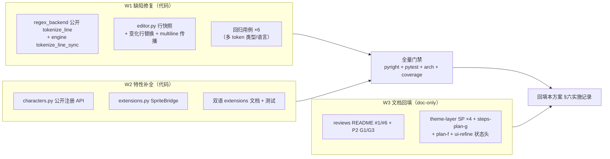

# reviews-plans-full-sweep-plan（reviews + plans 全量清查与未闭环项修复）

> 来源：用户指令「查看一遍所有文档，reviews + 所有的 plans，把所有的 issue 都修复了」。
> 清查范围：`.trae/reviews/` 28 份文档（索引 `README.md` §一 + `legacy-issues.md`）与
> `.trae/documents/` 全部计划文档（含各子计划目录 overview）。核实基准：2026-10-01 worktree 代码。
> 前序整改轮：`reviews-open-issues-fixes-plan.md`（F1–F8 已闭环，16 commits 在本分支）。

## 一、目标与非目标

**目标**

1. 全量清查 reviews + plans 中所有未闭环条目，逐条给出核实证据与处置；
2. 修复两类真实遗留：行尾 token 边界漂移抖动（F1）、`api.sprites` 扩展注册（F2）；
3. 回填全部过期文档状态头与索引行（F3），使 reviews/plans 无「状态与实际不符」条目；
4. 维持既有 ⏸/📌 决策（有证据支撑，不静默翻案）。

**非目标**

- DAP 支持（`dap-support-plan.md` Phase 1 从未启动，子系统级特性 roadmap，非缺陷，另行排期）；
- PB5 三终端人工复测（conhost / VS Code 需真机，非代码项）、Gitee Go 3.12 流水线触发（基础设施项）；
- `legacy-issues.md` 3 条 2026-10-01 权衡项（触发条件未出现）与 `Leaf→Window` 改名（独立一轮）；
- highlight 方案 Step 4 tree-sitter 增量 parse（可选性能优化，非缺陷；行级替换已消除抖动）；
- README §一 中已核实维持的 ⏸/📌/👀 条目翻案（见 §二.3）。

## 二、清查总表（逐条核实证据）

### 2.1 修复类（本轮做）

| # | 出处 | 问题 | 核实证据（2026-10-01） | 处置 |
|---|---|---|---|---|
| F1 | `highlight-comment-flicker-plan.md:3`（❌ 未实施）+ `typing-flicker-debounce-plan.md:11-13` | 全语言**所有 token 类型**行尾边界漂移抖动：debounce 窗口内行尾字符显示默认前景色（注释/关键字/字符串/数字/decorator 全受影响） | 全仓 0 匹配 `_hl_line_snapshot` / `_hl_ml_states` / `tokenize_line` / `_highlight_incremental`；前置防抖已落地（`editor_view/editor.py:115` `_HIGHLIGHT_DEBOUNCE_S=0.08`，`:321` `_tokens_for` 仅有整版 stale 复用） | W1 |
| F2 | `fancy-sym-plan.md:545-547` §九.1「待实施」+ `screensaver-extension-api-plan.md`（方案已落盘 `1bd6975`） | `api.sprites` 扩展注册未实现：代码无 `register_character` / SpriteBridge（`services/extensions.py` 0 匹配） | 内置名册 `editor_sprites/characters.py` 仅有导入期注册；扩展桥先例 `LspExtensionBridge` 等在位 | W2 |
| F3 | reviews/plans 文档状态过期批次（明细见 §四 W3） | 索引/状态头与实际执行状态不符：README §一 #1/#6（Phase B 已落地仍写「待启动」）、P2 总纲 G1/G3、theme-layer SP0–SP3 状态头 ⏳、`steps-plan-g.md:3`、`plan-f.md:3`、`ui-refine-plan.md:6` | 见 §四 W3 逐条 | W3 |

### 2.2 特性 roadmap（非缺陷，不并入本轮）

| 条目 | 出处 | 维持理由 |
|---|---|---|
| DAP 支持 | `dap-support-plan.md:3`（❌ 未实施） | 子系统级新特性（Phase 1 未启动），任何评审未将其列为缺陷；`diag-command-plan.md:8` 已按「无 dap 节」设计 |

### 2.3 维持原处置（核实决定依据仍成立，不改码）

| 条目 | 标记 | 证据 |
|---|---|---|
| kitty `ctrl+digit`（README #1/#6） | ✅ 已被 Phase B 覆盖 | `keybinding-fix-wt/overview.md:32`「Phase B 主体完成（PB1–PB6）」；`keyproto/driver_windows.py:276` 启用 win32-input-mode；PB6 探针实证 `ctrl+1 → [49;2;0;1;40;1_`；应用层 pilot 断言在位（`tests/test_dispatch_guards.py:35-49`）；PB4 已改写双语 manual 终端兼容性节。仅剩 conhost/VS Code 物理层不可达（PB4 文档已标注），归 PB5 人工矩阵 |
| Windows `os.replace`（README #2） | ⏸ | `document.py` 实现未变，错误路径安全取舍不变（上轮核实） |
| Gitee Go 3.12 镜像（README #4） | 👀 | 基础设施观察项 |
| 输入线程宽 except 残余（README #7） | 👀 | 与 stock 复刻基线张力仍在，待与上游对齐 |
| explorer 切主题全量 refresh（README #8） | ⏸ | `explorer.py` `_apply_theme` 频率可接受（上轮核实） |
| scrollbars 复刻上游（README #9） | 📌 | `tests/test_scrollbars.py` 在位 |
| PB5 三终端人工复测（README #10） | 🔧 | 人工项；`steps-plan-g.md` 执行状态表 PB5 行 ⏳ |
| 配对扫描无上限（README #11） | ⏸ | 与已批准偏离 #8 绑定 |
| handler 工厂内类（README #14） | ⏸ | textual 懒加载约束（上轮核实） |
| legacy 3 条权衡项 | ⏸ | `legacy-issues.md:10-23`，触发条件未出现 |
| `Leaf→Window` 改名 | ⏸ | `app-layering-refactoring-pane-model-to-session-plan-g.md:248` 独立一轮 |

## 三、备选方案与否决理由

| 决策点 | 选中 | 否决 |
|---|---|---|
| F1 实施范围 | 只做 Step 1/2/3/5（行级 regex 替换 + 快照 + multiline 传播 + 测试） | Step 4 ts 增量 parse：可选性能优化（0.6ms vs 3.4ms worker 完成时间），不消除额外抖动，引入 Parser/Tree 生命周期管理风险 → 登记维持 |
| F1 快照重建落点 | 沿用原方案：`_tokens_for` version 落后分支内重建，提取独立方法 `_rebuild_tokens_on_edit` | 在 worker 内做：跨线程改 UI 状态，违反现有 debounce 单写者模型 |
| F2 是否纳入本轮 | 纳入（方案文档已就绪、改动面有界、来源为评审登记的待实施项） | 排期另行：用户指令为「全部修复」，可闭环项不留待办 |
| 文档回填方式 | 按实际执行状态照实回填 + 注记日期 | 只改 README 索引不动各文档：状态源头仍错，下次清查重蹈 |

## 四、分步实施计划

分支：`fix/reviews-open-issues-fixes`（现有 worktree，16 commits 之上续作）。解释器：worktree 内 `.venv\Scripts\python.exe`。

W1 与 W2 文件零交集可并行；W3 doc-only 可并行。

### W1 — F1 行级同步精确着色（规范来源：`highlight-comment-flicker-plan.md` §Implementation Steps）

- **独占文件**：`yate/editor_syntax/regex_backend.py`、`yate/editor_syntax/engine.py`、`yate/editor_view/editor.py`、`tests/test_app_textual.py`。
- **Step 1** `regex_backend.py`：新增公开 `tokenize_line(line, filetype, state=0) -> tuple[list[Token], int]`（`lang_for` 为 None 时返回 `([], state)`；pattern 缓存已有 `@lru_cache` `_code_line_pattern:427`，直接复用）。不新增 `Optional`/裸 `except`（原方案示例代码按现行规范改写：`X | None`、异常捕获须具体类型或附理由）。
- **Step 2** `engine.py`：新增 `tokenize_line_sync(line, filetype, multiline_state=0)` 转发 regex backend。
- **Step 3** `editor.py`（核心，锚点：`:151-161` `_hl_*` 状态、`:321-349` `_tokens_for`、`:364-368` 状态快照传递）：
  - 新增 `_hl_line_snapshot: tuple[str, ...] | None`、`_hl_ml_states: tuple[int, ...] | None`；
  - version 落后分支提取 `_rebuild_tokens_on_edit(row)`：逐行快照比对 → 未变化行复用旧 token，变化行起 regex 同步 tokenize 至 multiline 状态归零；行数剧变（>5 行增删）退化为现 stale 复用；重建结果回写 `_hl_tokens` 与双快照；
  - worker 完成回调（`_highlight_later`）保存行快照 + multiline 状态序列；doc/filetype 切换清空。
- **Step 5** 测试（`test_app_textual.py`，既有高亮用例区 `:353-:504` 旁）：keyword/string/number/decorator 行尾编辑边界即时更新 ×4、C block comment 行尾 ×1、光标移动命中快照复用 ×1。
- **验收**：`.venv\Scripts\python.exe -m pytest tests/test_app_textual.py -q` 全绿；`python -m pyright yate/ tests/` 0 诊断；textual-pilot-smoke 抽查 .py 行尾编辑无脱色帧。

### W2 — F2 `api.sprites` 扩展注册（规范来源：`screensaver-extension-api-plan.md`，以其文件清单为准）

- **独占文件**：`yate/editor_sprites/characters.py`（公开 `register_character` / `unregister_character`，提取 `_validate_one`）、`yate/services/extensions.py`（`SpritesExtensionBridge`：`register` / `unregister` / `names`，异常穿透由 loader 捕获成扩展错误消息）、`yate/docs/extensions.en.md` + `yate/docs/extensions.zh.md`（双语同步新增章节：帧格式/约束/示例/teardown 清理）、`tests/test_editor_sprites.py`（注册/重名拒绝/校验失败/unregister 用例）、`.trae/documents/fancy-sym-plan.md` §九.1 状态回填。
- **验收**：`python -m pytest tests/test_editor_sprites.py -q` 全绿；pyright 0 诊断；双语文档同时更新（硬约束）。

### W3 — F3 文档状态回填（doc-only，各条注记「2026-10-01 回填」）

| 文件 | 回填内容 | 证据 |
|---|---|---|
| `.trae/reviews/README.md` §一 | #1 行 → ✅ 已修（Phase B win32-input-mode 覆盖 WT，legacy 终端限制已由 PB4 文档标注）；#6 行 → Phase B 主体完成，仅剩 PB5 人工矩阵（并入 #10） | 本方案 §二.3 |
| `code-review-fix-plans/P2-subplans/overview.md:76` | G1 行 → 已被 keybinding-fix-wt 取代处理（ctrl+/ 修复 + ctrl+1 Phase B 落地） | `wt-keybinding-fix-plan.md:179` |
| 同上 `:78` | G3 行 → ✅ N30 已由 theme-layer-refactor 落地（config.py 回调注入） | `theme-layer-refactor-plans/overview.md:3`；`config.py:241-242` |
| `theme-layer-refactor-plans/` SP0–SP3 四文件 `:3` | 状态头 ⏳ 待实施 → ✅（2026-09-26 实施并回填） | 同上 overview:3 + 245-248 状态表 |
| `keybinding-fix-wt/keybinding-fix-wt-steps-plan-g.md:3` | 状态头「Phase A 执行中 / Phase B 待启动」→「Phase A ✅ / Phase B 主体 ✅，仅剩 PB5 真机矩阵 ⏳」 | overview:32-40 |
| `keybinding-fix-wt/keybinding-fix-wt-key-reachability-plan-f.md:3` | 补终态注记：Phase A/B 已完成（根因假设证伪与实际执行见 steps-plan-g） | overview:30-33 |
| `ui-refine-plan.md:6` | 状态「待实施」→ ✅ 已实施（2026-09-27 分支交付，评审记录 `2026-09-27-ui-refine.md`） | 评审记录 §结论 |

- **验收**：逐文件人工核对链接可达（相对路径），无代码门禁。

### W4 — 收尾

1. 全量门禁：`.venv\Scripts\python.exe -m pyright yate/ tests/ tools/` 0 诊断 → `python -m pytest tests/ -q` 全绿 → `python -m pytest tests/test_architecture.py -q` 22 用例 → coverage ≥ 75% → textual-pilot-smoke 冒烟；
2. 本方案 §六回填实施记录（真实结果与偏离）；
3. 分步提交（英文 conventional，PowerShell 多 `-m`，只 commit 不 push）：W1 `fix(syntax): eliminate end-of-line token flicker via row-level regex retokenization`；W2 `feat(extensions): expose api.sprites for custom screensaver characters`；W3 `docs(reviews): backfill executed statuses across review and plan documents`。

## 五、风险与回滚

| 风险 | 缓解 / 回滚 |
|---|---|
| `_tokens_for` 重建逻辑回归（高亮错色/性能回退） | 独立方法 + 6 条新用例 + 既有高亮用例（`test_app_textual.py:353/391/504/4642`）全量回归；行数剧变走旧路径兜底；出问题 revert 单 commit |
| multiline 状态重建在超大文件上慢 | 限从首个变化行向后至状态归零（原方案实测 2.2μs/行）；>5 行增删退化为 stale 复用 |
| sprites 注册破坏既有名册/白名单时序 | 重名一律拒绝（沿 `_validate` 规则）；启动白名单警告降级为已知噪音（方案已明示）；仅新增 API 不改既有导入期注册路径 |
| pyright strict 新代码类型不达标 | 不引入 `Any` / `type: ignore`；快照/状态用具体元组类型；不达标签不入 |
| 文档回填与事实不符 | 每条附证据链接，回填前二次核对 |

## 六、实施记录（2026-10-01 回填）

- [x] W1 F1 行级精确着色：**已落地**（commit `fa71064`）。
  `EditorView` 新增 `_hl_line_snapshot` / `_hl_ml_states` 双快照（单写者纪律，
  与每次 `_hl_tokens` 赋值一并写入）与 `_rebuild_tokens_on_edit`：逐行 diff
  快照、复用未变行、从首个变化行同步重 tokenize 直至 multiline 状态与记录态
  重新一致；行数增删 >5 退化为 stale 复用兜底，异常行 `log.debug` 降级。
  `regex_backend.tokenize_line` / `engine.tokenize_line_sync` 提供行级入口；
  worker 侧 `_tokenize_with_states` 在 tokenize 时线程化 multiline 状态。
  `test_app_textual.py` 新增 6 条用例（keyword/string/number/decorator/
  C 块注释/快照复用），既有 `test_edit_keeps_colors_instead_of_flashing`
  断言更新为 `syn_function`（resync 后 `xdef` 不再是 keyword）。
  **偏离记录**：安全复用停点由原方案示例的「state == 0」改为
  「threaded state == 记录态且越过最后变化行」——原条件在提前闭合
  multiline 构造（如 C 块注释提前结束）时会错误复用后续行。
- [x] W2 F2 api.sprites：**已落地**（commit `2ac19ed`）。
  `characters.py` 增 `_EXTENSION_NAMES` / `register_character`（重名
  ValueError）/ `unregister_character`（内置名拒删、未知名 KeyError）；
  `services/extensions.py` 增 `SpriteExtensionBridge`（register/unregister/
  names，frames 归一化 `Sequence[Sequence[str]]`→tuple）与
  `ExtensionAPI.sprites` property；双语手册同步新增 §4.9 屏保精灵章节；
  `test_editor_sprites.py` 新增 16 条用例（注册 12 + 桥 4）。
  **偏离记录**：帧类型首轮实现为单帧 tuple，pyright 报 15 处诊断后改为
  `Sequence[Frame]` + 桥侧归一化（子代理自报，主代理独立复跑 41 passed 复核）。
- [x] W3 F3 文档回填：**已完成**（8 处，随本文件所在提交落盘）。
  `reviews/README.md` 速览 #1/#6 行与 §二 2026-09-16 / IKH1RA 行 →
  ✅ 已回填注记；`code-review-fix-plans/P2-subplans/overview.md` G1/G3 行
  回填终态与相对链接；theme-layer SP0-SP3 四份子计划状态头 ⏳→✅；
  `keybinding-fix-wt-steps-plan-g.md` 状态头（Phase A ✅ / Phase B 主体 ✅，
  仅剩 PB5 真机矩阵 ⏳）与 `keybinding-fix-wt-key-reachability-plan-f.md`
  终态补注；`ui-refine-plan.md` 状态头 →✅。
- [x] W4 门禁数字（2026-10-01 实测）：pyright `0 errors, 0 warnings,
  0 informations`；pytest 全量 **1523 passed / 7 skipped**（exit 0）；
  架构守护 **22 passed**；coverage **90.87%**（≥ 75% 门槛达标）；
  textual-pilot-smoke 冒烟 **PASS**——.py 行尾编辑（`x = 42`→`x = 423`、
  注释行追加 ` ok`）在 debounce 窗口内 SVG 帧中新字符即携带 token 色
  （数字 `#fab387` / 注释 `#6c7086`，与基线 token 色一致，无默认前景色
  脱色帧；临时脚本与截图已清理）；`tools.smoke_test run` **89/89 场景、
  932/932 checks、exit 0**。
