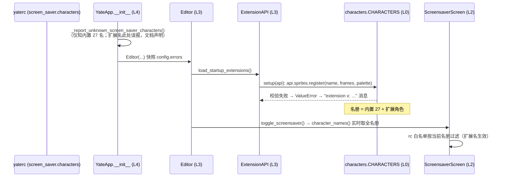

# 屏保精灵注册开放给扩展（`api.sprites`）方案

> 来源：feat/fancy-sym 评审长期建议第 1 条，用户指令"暴露可以给外部挂载，需要详细说明文档"。
> 顺带把三条长期建议补登记进主方案（§九）。

## 一、目标与非目标

**目标**：
1. L0 注册表新增公开 `register_character` / `unregister_character`（带与 import 期同规则的校验）；
2. L3 `ExtensionAPI` 新增 `api.sprites` bridge（`register` / `unregister` / `names`），
   扩展即可在 `setup(api)` 里挂载自定义屏保角色，混入游行队与 rc 白名单；
3. 双语 `extensions.en/zh.md` 新增详细章节（帧格式、半块渲染规则、约束、完整示例、
   错误行为、白名单时序注意点、teardown 清理）；
4. 主方案补登记三条长期建议（§九），第 1 条标记本轮完成；
5. 门禁保持 pyright 0 诊断 + pytest 全绿。

**非目标**：
- 不新增内置示例扩展文件（`yate/extensions/` 自动加载面保持不变；文档内给完整示例）；
- 不改 `tools.pack rosters`（它只渲染内置阵容，扩展角色不进 SVG）；
- 不动 changelog / yaterc 双语（遵循"更新文档"单独指示惯例；本次只交付扩展说明文档与主方案回填）；
- 不支持"替换内置角色"以外的高级行为（重名注册一律拒绝，见备选表）。

## 二、关键事实（取证）

- `ExtensionAPI` bridge 先例：`LspExtensionBridge` / `HighlightExtensionBridge` /
  `SyntaxExtensionBridge`（[extensions.py:86-221](../yate/services/extensions.py)）；
  语法 bridge 靠抛异常让 loader 捕获成 `extension <name>: <error>` 消息——sprites 沿用。
- 扩展加载点 [editor.py:1533](../yate/editor.py)（Editor 构造后）；
  白名单启动校验在 `YateApp.__init__`（更早）→ **时序缺口**：rc 白名单引用扩展角色
  必然先收到一条启动警告（banner 此刻只知道内置 27 名）。
  消解：`toggle_screensaver` 已按当前注册表实时过滤（扩展名可用、生效），
  启动警告降级为已知噪音，文档明示。
- L0 校验逻辑在 `characters.py::_validate`（帧数 ≥2、几何一致、调色板覆盖），
  提取 `_validate_one(name, sprite)` 供注册复用。
- `ScreensaverScreen.__init__` 经 `character_names()` 取名册；`_next_name` 从洗牌袋
  取名——注册发生在扩展加载期（任何屏保产生之前），袋与名册天然包含扩展角色。

## 三、备选方案与否决理由

| 决策点 | 选中 | 否决 |
|---|---|---|
| 重名注册 | `ValueError`（拒绝，避免静默顶替内置角色） | 覆盖式替换——内置名被扩展偷换不可观测；先 unregister 再 register 可表达显式替换 |
| 校验位置 | L0 `register_character` 内（与 `_validate` 共用 `_validate_one`） | bridge 层复制规则——两处规则必漂移 |
| bridge 形态 | `SpriteExtensionBridge`（对齐 highlight/syntax 先例，`api.sprites.register`） | 顶层 `api.register_character`——API 面扁平化，与既有分组风格不一致 |
| 白名单误报 | 保持启动校验 + 文档声明注意点 | 校验后移到扩展加载后——banner 快照在 Editor 构造期已完成，错误将整体丢失；撤回已报错误——快照不可变，无效 |
| teardown 清理 | 提供 `unregister_character`，文档建议 teardown 调用 | 不提供——扩展热重载会累积幽灵名字 |
| 示例交付 | 文档内完整示例代码 | 打包内置示例扩展——扩大默认加载面，非必要 |

## 四、注册时序（Mermaid）

## 五、分步实施计划

### Step 1 — L0 注册 API
- **文件**：`yate/editor_sprites/characters.py`
  - 提取 `_validate_one(name: str, sprite: Sprite) -> None`（`_validate` 循环体）；
  - `register_character(name: str, frames: Frame, palette: Palette) -> None`：
    名为非空 str；组 `Sprite` 后 `_validate_one`；重名 `ValueError`；
  - `unregister_character(name: str) -> None`：缺失 `KeyError`；
  - docstring 声明帧格式与约束（与文档一致）。
- **文件**：`tests/test_editor_sprites.py`：注册成功（可被 `get_character` 取到）、
  重名拒绝、缺帧/几何参差/调色板缺键各自拒绝、unregister 后再注册可行。
- **验收**：`pyright`（两文件）0 诊断；`pytest tests/test_editor_sprites.py -q` 全绿。
- **提交**：`feat(sprites): public register/unregister character API`

### Step 2 — L3 bridge
- **文件**：`yate/services/extensions.py`
  - `SpriteExtensionBridge`：`register(name, frames, palette)` / `unregister(name)` /
    `names() -> list[str]`，docstring 含帧格式速览与约束；
  - `ExtensionAPI.sprites` property。
- **文件**：`tests/test_extensions.py`（既有扩展 API 测试风格）：`api.sprites.register`
  后 `api.sprites.names()` 含新名、非法帧经 loader 变 `extension x: ValueError...`、
  `unregister` 循环。
- **验收**：pyright（两文件）0 诊断；`pytest tests/test_extensions.py -q` 全绿。
- **提交**：`feat(extensions): expose screensaver sprite registration via api.sprites`

### Step 3 — 详细说明文档 + 主方案回填
- **文件**：`yate/docs/extensions.en.md` / `.zh.md` 新章节 "Screensaver characters"：
  - 帧格式（等长字符串行、单字符调色板键、`.` 透明）与调色板（`"#rrggbb"`）；
  - 半块渲染规则：2 像素行/文本行、`▀`/`▄`/`█` 组合、文本行数 = `ceil(像素行/2)`、
    宽度 = 像素列数（1 像素 = 1 列）、尺寸建议（适配 24 行终端）；
  - 约束（≥2 帧、几何一致、调色板覆盖）与 `ValueError` → 扩展加载失败消息；
  - 完整示例扩展（注册 + teardown 注销）；
  - 白名单时序注意点（启动警告无害、toggle 时生效）与 `api.sprites.names()` 自检。
- **文件**：`.trae/documents/fancy-sym-plan.md` 新 §九：登记三条长期建议，
  第 1 条标记本轮落地（提交号回填）。
- **验收**：全量 `pyright yate/ tests/ tools/` 0 诊断 + `pytest tests/ -q` 全绿。
- **提交**：`docs(extensions): document the screensaver sprite registration API`

## 六、风险与回滚

- **全局可变注册表**：注册表从 import 期冻结变为运行时可变——`_validate()` 仍在
  import 期守护内置数据；扩展注册走同一校验；yate 单进程单屏保，无并发写。
- **白名单误报**：既有行为，仅文档声明；不影响功能（toggle 实时过滤）。
- **回滚**：三个提交独立，`git revert` 逐个回退；无数据迁移。

## 七、自我校验

- [x] 步骤含输入/文件/输出/验收命令；无模糊步骤
- [x] 架构合规：L0 注册 API 纯逻辑无 UI；L3 bridge 只依赖 L0；无新 Protocol /
      TYPE_CHECKING；R4 不受影响（extensions.py 本就允许 import L0 叶子）
- [x] 四特性：健壮性（校验复用 + 错误隔离进 loader）、可维护性（单处规则 + 详细文档）、
      性能（注册仅发生一次，无热路径）、扩展性（本轮即扩展点本身）
- [x] Mermaid 时序图覆盖注册→产生全链路
