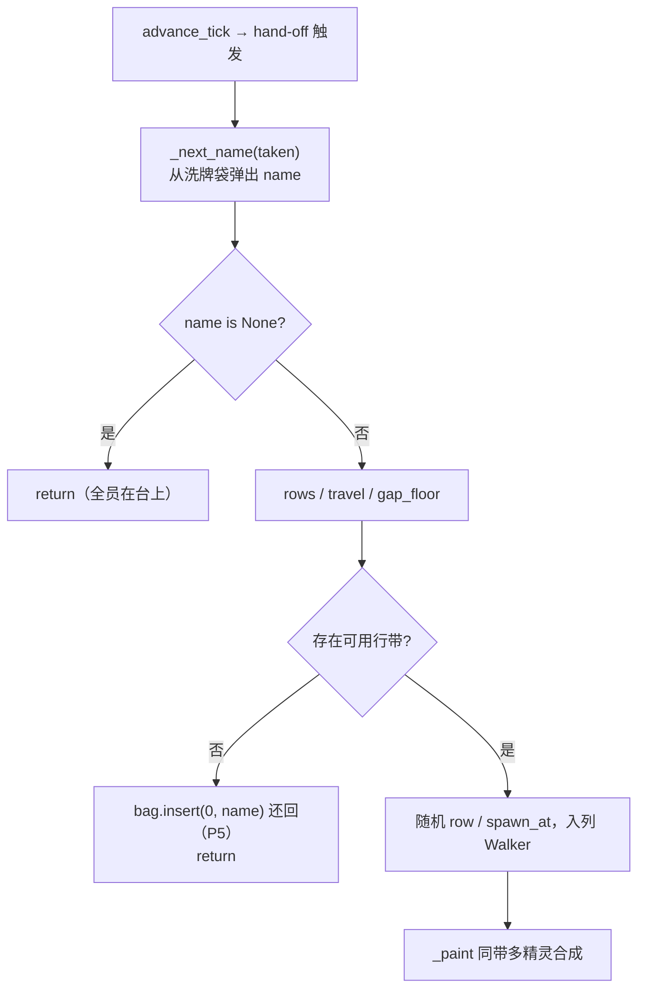
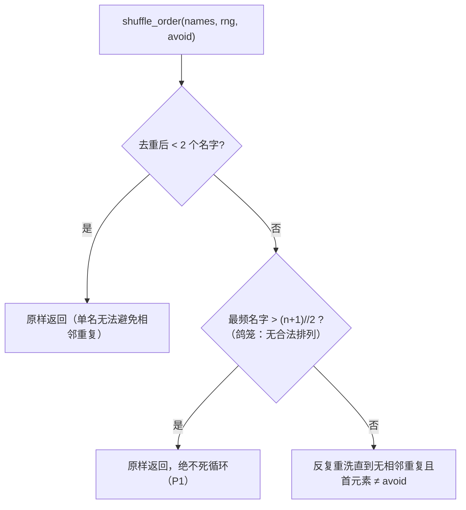

# screensaver 分支评审 P1–P7 修复方案

> **实施状态**：✅ 已实施 —— 2026-10-05 全量核对：文档自述与代码产物一致。
> 用户指令"生成修复计划，然后修复 P1-P7"即为范围批准；本文档将修法落盘为可验收步骤。

## 一、目标与非目标

**目标**：修复评审 P1–P7 全部 7 项，每项可独立验证；全量门禁保持
pyright strict 0 诊断 + pytest 全绿。

**非目标**：
- 不更新 changelog / yaterc 双语文档（遵循用户"更新文档"单独指示的惯例）；
- 不改 `alt+shift+p` 既有行为（P6 只处理新增的 `alt+shift+s`）；
- 不动 roster 数据组织（评审"长期建议"第 3 条，明确维持现状）。

## 二、逐项修法与否决理由

| # | 选中方案 | 否决的备选 |
|---|---|---|
| P1 | 双保险：① `ScreensaverScreen.__init__` 对 `characters` 去重（`dict.fromkeys` 保序）；② `shuffle_order` 增鸽笼守卫：最频名字数 > `(n+1)//2` 时无解，直接原样返回，绝不死循环 | 仅屏保侧去重——`shuffle_order` 是公共函数，未来调用方仍可触发；循环上限兜底——返回含相邻重复的半成品违反函数契约 |
| P2 | `IdleTracker.due(threshold)` 改用构造注入的 clock 取当前时刻，删 `now` 参数；app.py 随之删 `import time` | 保留双时钟入口——poke/due 两钟可静默错位，API 冗余 |
| P3 | `on_mouse_move` 补 `event.prevent_default()`，与 `on_key` 对称（R10 完整语义） | 维持现状——隐藏的默认行为差异 |
| P4 | `_row_is_available` 局部变量 `behind` → `tail_gap`（实义：走者尾部领先产生列的距离） | —— |
| P5 | 行带不可用拒绝产生时 `self._bag.insert(0, name)` 把名字还回袋首（该名从未展示，下次交接优先重试） | 先选行带后取名——`gap_floor = upper × (width + w_new)` 依赖新精灵宽度，循环依赖；用最宽精灵做保守 floor 会误杀合法产生；不修——名字被烧掉，轮换序漂移 + `_last_name` 污染 |
| P6 | 把 `alt+shift+s` 拦截块移到 `prompt_bar.active_mode` 早退（editor.py:683-686）之后：命令行输入时按键冒泡给 Input，不再触发屏保；正常模式路径顺序不变 | 连 `alt+shift+p` 一起移——改存量行为，超范围；不修——输入命令时弹屏保是真实 UX 缺陷 |
| P7 | 提取 `YateApp._report_unknown_screen_saver_characters()`，`__init__` 一行调用；docstring 记录"roster 只在 shell 层可知"的分层理由 | 让 config.py 认识 roster——破坏 config 不依赖 sprite 包的既定决策（app.py 注释已声明） |

## 三、修复后决策流（Mermaid）

## 四、分步实施计划

### Step 1 — P1（独立提交）
- **改动文件**：`yate/editor_sprites/characters.py`（+`Counter` 导入、鸽笼守卫、docstring 修订）、
  `yate/editor_view/screensaver.py`（`__init__` 去重一行）、`tests/test_editor_sprites.py`
  （+`test_shuffle_order_unsalvageable_multiset_returns_as_is`，与既有 shuffle 测试同风格）。
- **验收**：`.venv\Scripts\python.exe -m pyright`（三文件）0 诊断；
  `pytest tests/test_editor_sprites.py tests/test_screensaver.py -q` 全绿。
- **提交**：`fix(sprites): make shuffle_order total for unsalvageable multisets`

### Step 2 — P2–P5（独立提交）
- **改动文件**：`yate/services/idle_tracker.py`（due 签名）、`yate/app.py`（调用点 + 删 `import time`）、
  `tests/test_idle_tracker.py`（3 用例改单钟驱动）、`yate/editor_view/screensaver.py`（P3/P4/P5 三处）。
- **验收**：pyright（四文件）0 诊断；`pytest tests/test_idle_tracker.py tests/test_screensaver.py -q` 全绿。
- **提交**：`refactor(screensaver): tighten tracker clocking and spawn bookkeeping`

### Step 3 — P6–P7（独立提交）
- **改动文件**：`yate/editor.py`（拦截块下移 + 注释补一句）、`yate/app.py`（提取私有方法）。
- **验收**：全量 pyright 0 诊断 + 全量 pytest 全绿。
- **提交**：`fix(editor): keep alt+shift+s out of command-line editing`

### Step 4 — 收尾
- 全量门禁：`.venv\Scripts\python.exe -m pyright yate/ tests/ tools/` +
  `.venv\Scripts\python.exe -m pytest tests/ -q`（基线 1344 passed / 7 skipped + 1 新用例 = 1345）。
- 报告实测数字；文档四件套与主方案回填等用户单独指示。

## 五、风险与回滚

- **P2 签名变更**：全仓唯一产品调用点 app.py:283（已 grep 取证），测试同步改；风险低。
- **P6 块下移**：alt+shift 组合无 raw 字节形式，keymap 路由不可达（keyproto.legacy 只映射
  单修饰 alt），命令行模式下按键冒泡后不会再触发屏保——行为闭环已论证。
- **P5 行为变化**：无测试断言轮换顺序；拒绝时名字还袋属纯收益。
- **回滚**：三个提交各自独立，`git revert <hash>` 即可逐个回退；涉及产品文件 5 个 + 测试 2 个。

## 六、自我校验

- [x] 每步含输入/文件/输出/验收命令
- [x] 架构合规：characters.py / idle_tracker.py 均为 L0 纯逻辑（Counter 为 stdlib）；
      P7 为 L4 私有方法，无新增跨层导入；不触 R2/R6/R10/R12/R13
- [x] 四特性：健壮性（P1/P5）、可维护性（P2/P4/P7）、性能（无热路径变化）、扩展性（shuffle_order 契约补全）
- [x] 备选方案与否决理由已列
