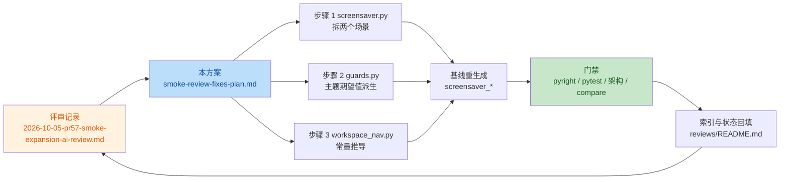

# 冒烟扩充评审整改方案（smoke-review-fixes）

> **实施状态**：🔄 方案已落盘，执行中。
> 评审记录：[2026-10-05-pr57-smoke-expansion-ai-review.md](../reviews/2026-10-05-pr57-smoke-expansion-ai-review.md)（Gitee PR !57，note 51450178）。
> 实测数字见 §六。

## 一、目标与非目标

### 1.1 目标

1. 销账 **B1（阻断）**：`screensaver.py` 里两个 app 共用 `rows` 造成的死存储，
   并让第一个 app 重新进入不变量扫描范围。
2. 销账 **M1（改进）**：`guards.py` 把主题清单快照（`8` / `"frappe"`）钉成断言
   期望值，改为从注册表派生。
3. 销账 **M2（改进）**：`workspace_nav.py` 的循环上限 `12` 改为由产品常量
   `MIN_FRACTION` / `RESIZE_STEP` 推导的命名常量。
4. 把三个既有场景的基线与统计数字同步到新事实，并让 `compare` 复核通过。

### 1.2 非目标

- 不改 `yate/` 产品源码（三项均为测试侧问题）。
- 不改 `tools/smoke_test/harness.py`（不变量扫描时机问题属另一议题，见 §五 注）。
- 不动 M1 之外的清单耦合：`:set` 选项列表的补全断言只覆盖 `set re` / `set theme=`
  两例，不扩写成全量矩阵。
- 不重排、不重写三个场景文件，只做定点修改（禁止顺手重构）。

## 二、现状盘点（实测，2026-10-05，HEAD `5b93a4c`）

| 事实 | 实测值 / 依据 |
|---|---|
| 分支同步 | `origin/enh/smoke-test-scenarios` 与本地一致（领先 0 提交） |
| B1 死存储 | `screensaver.py:149` 被 `screensaver.py:169` 整体覆盖；`snapshot_svg` 固定写同一 `shot.svg`（`harness.py:174-178`），app 1 的行物理不可回收 |
| 不变量只覆盖最后一个 app | `harness.py:445` 取 `current_app()`（`_apps[-1]`） |
| M1 硬编码 | `guards.py:240` `Check("theme_candidates", 8, ...)`；另有 `:246` `"set theme=frappe"`、`:250` `"frappe"` |
| 主题真实 API | `theme.available()`（`yate/editor_view/theme.py:475`，= `sorted(THEMES)`）；**评审建议的 `theme.names()` 不存在** |
| 当前清单 | `len(theme.THEMES) == 8`，`available()[0] == "frappe"` |
| M2 魔法数字 | `workspace_nav.py:245` `for _ in range(12)` |
| resize 常量 | `MIN_FRACTION = 0.12`、`RESIZE_STEP = 0.08`（`yate/session.py`）；`ceil((0.5-0.12)/0.08) = 5` |

## 三、备选方案与否决理由

| 方案 | 内容 | 裁决 |
|---|---|---|
| **A1（采纳）B1：拆成两个场景** | `screensaver_disabled_message` 保留给 `enable=False`；新增 `screensaver_bad_roster_message` 承载角色表全非法分支 | ✅ 采纳。死存储直接消失（每个场景只有一次赋值）；app 1 重新被不变量扫描；每个场景单 app，与全仓 104 个场景的形态一致。代价：场景数 103 → 104，多 1 份基线、约 +1.3s |
| A2 | 按评审建议「只保留最后一个 app 的快照，并加注释说明」 | ❌ 否决：把缺陷写成注释，app 1 仍逃过不变量扫描；注释解释的是一个本可以删掉的行为 |
| A3 | 按评审建议「合并两个 app 的 `svg_rows`」 | ❌ **不可行**：`snapshot_svg` 两次写同一个 `shot.svg`，app 1 的行在第二次截图时已被覆盖，无从合并；即便强行按 y 混并，两块屏幕的行也会互相污染，基线失去意义 |
| A4 | 用 `harness` 的 `_apps` 全量做不变量扫描 | ❌ 否决：改 `harness.py` 属 §1.2 非目标，且会波及全部 104 个场景的判定基准 |
| B1 | M1：只把 `8` 改成 `len(theme.available())` | ❌ 否决：`"set theme=frappe"`（`:246`）与 `"frappe"`（`:250`）是同一缺陷类，只改计数会留下同样的噪音源。评审只点名了最显眼的一处 |
| B2 | M1：用 `theme.available()` 派生三处期望值 | ✅ 采纳。断言对象从"清单内容"回到"补全行为"：`theme_candidates` 比候选数与注册表一致，`first_value` / `theme_applied` 比首个候选与最终生效主题 |
| C1 | M2：提一个命名常量 `12`，注释写"够用即可" | ❌ 否决：仍是字面量，步长变更后照样假阴性 |
| C2 | M2：由 `MIN_FRACTION` / `RESIZE_STEP` 推导 | ✅ 采纳。产品常量变了，次数自动跟着变 |



## 四、工作分支

评审对象是 PR !57 的源分支本身（`enh/smoke-test-scenarios`，本地与 origin 同步），
整改必须落到该分支才能被 PR 看到。故**沿用现有 worktree** `../yate-smoke-scenarios`
及其 `.venv`（`task-orchestration.md` §二.1「续作任务先 `git worktree list` 复用
现有 worktree（含其已有 `.venv`，不得重复新建）」）；不另开 worktree、不重建沙箱。

**偏离说明**：常规「新任务」应新建 worktree + 分支，本次不新建，理由是这轮整改
是同一 PR 的续作（PR 未合并、改动尚未进入 master），换 worktree 只会多出一份无
意义的分支与一份 290MB 虚拟环境。

## 五、分步实施计划

三个步骤按文件独占切成三份，**并行下发子代理**（`subagent-workflow.md`：
显式 `bypassPermissions`，各 1 个文件，写盘互不重叠）。接线与基线由主代理做。

### 步骤 1 —— `tools/smoke_test/scenarios/screensaver.py`（销账 B1）

- 改动：把 `_screensaver_disabled_message` 拆成
  `_screensaver_disabled_message`（app 1：`ScreenSaverConfig(enable=False)`）与
  `_screensaver_bad_roster_message`（app 2：`characters=("no-such-sprite",)`）；
  各自只调用一次 `snapshot_svg`，各自 `return ScenarioResult(...)`。
  `SCENARIOS` 注册表相应变成 3 条，模块 docstring 同步。
- 保留：`_screensaver_toggle_key` **一行不动**。
- 验收：
  ```powershell
  .venv\Scripts\python.exe -m tools.smoke_test run --scenario screensaver_toggle_key --scenario screensaver_disabled_message --scenario screensaver_bad_roster_message --no-color
  ```
  → 3/3 场景 PASS、exit 0；`.venv\Scripts\python.exe -m pyright
  tools/smoke_test/scenarios/screensaver.py` → 0 诊断。

### 步骤 2 —— `tools/smoke_test/scenarios/guards.py`（销账 M1）

- 改动：`import` 增加 `from yate.editor_view import theme`（若尚未导入）；三处
  期望值改为派生——`theme_candidates` 比 `len(theme.available())`，`first_value`
  比 `f"set theme={theme.available()[0]}"`，`theme_applied` 比
  `theme.available()[0]`；收尾仍复位为 `mocha`（既有 `theme_restored` 断言不动）。
  同步更新该场景 docstring：把"实测行为"段落里的 `frappe` 字面量表述改为
  "排序后的第一个主题"。
- 验收：
  ```powershell
  .venv\Scripts\python.exe -m tools.smoke_test run --scenario prompt_tab_completion --no-color
  ```
  → PASS、exit 0；pyright 0 诊断。

### 步骤 3 —— `tools/smoke_test/scenarios/workspace_nav.py`（销账 M2）

- 改动：模块常量区新增
  ```python
  #: ``ctrl+w`` ``-`` presses needed to drive the active pane from an even
  #: share down to :data:`yate.session.MIN_FRACTION`, plus two presses of
  #: slack for the step that is clamped by the guard.
  _MAX_SHRINK_PRESSES: int = math.ceil((0.5 - MIN_FRACTION) / RESIZE_STEP) + 2
  ```
  （`import math`、`RESIZE_STEP` 一并从 `yate.session` 导入），循环改用该常量。
- 验收：
  ```powershell
  .venv\Scripts\python.exe -m tools.smoke_test run --scenario pane_resize_chords --no-color
  ```
  → PASS、exit 0；pyright 0 诊断。

> **注**：`_MAX_SHRINK_PRESSES` 取 `+2` 余量，是因为最后一次 `-` 会被最小比例
> 钳制（0.5 − 5×0.08 = 0.10 < 0.12），实际需要第 6 次才触发告警；余量 2 次
> 保证钳制行为变化时仍能触发，属于刻意冗余，已在注释中写明。

### 步骤 4 —— 主代理集成：基线与统计

```powershell
.venv\Scripts\python.exe -m tools.smoke_test snapshot --quiet --no-color --scenario screensaver_disabled_message --scenario screensaver_bad_roster_message --scenario prompt_tab_completion --scenario pane_resize_chords
.venv\Scripts\python.exe -m tools.smoke_test run --coverage --no-color
.venv\Scripts\python.exe -m tools.smoke_test compare --no-color --quiet
```

预期：`screensaver_bad_roster_message.json` 新增；`screensaver_disabled_message.json`
减少 3 条检查；`prompt_tab_completion.json` 与 `pane_resize_chords.json` **内容不变**
（期望值改写后算出的字面量与原来相同）——若这两份基线出现 diff，说明派生写法与
原值不等，必须查清再继续。其余 100 份基线零改动。

### 步骤 5 —— 门禁（主代理亲自跑）

```powershell
.venv\Scripts\python.exe -m pyright yate/ tests/ tools/
.venv\Scripts\python.exe -m pytest tests/ --cov=yate --cov-fail-under=75
.venv\Scripts\python.exe -m pytest tests/test_architecture.py -q
```

### 步骤 6 —— 文档回填与提交

1. `.trae/reviews/2026-10-05-pr57-smoke-expansion-ai-review.md` §五状态表回填
   提交号（文档在步骤 0 已落盘，此处只补状态与实测）。
2. `.trae/reviews/README.md`：速览表新增 #29 行、评审轮次总表新增一行。
3. `.trae/documents/smoke-test-expansion-plan.md` §7.1 数字校正
   （场景 103 → 104、检查数按实测回填）。
4. `.trae/skills/textual-pilot-smoke/SKILL.md` 的场景分组不变（拆场景不新增模块）。
5. 提交（每步一笔，只 commit 不 push）：
   `docs(reviews)` 登记 → `test(smoke)` × 3（三处修复）→
   `chore(smoke)` 基线 → `docs(reviews)` 状态与索引回填。

## 六、风险与回滚

| 风险 | 概率 | 影响 | 缓解 | 回滚 |
|---|---|---|---|---|
| 拆场景导致 103 → 104，方案文档 / SKILL 数字过期 | 高（必然） | 低 | 步骤 6 统一回填，实测数字为准 | — |
| `prompt_tab_completion` 派生值与原字面量不等 → 基线 diff | 低 | 中 | 步骤 4 明确要求"这两份基线必须零 diff"，出现即停查 | 改回字面量并重新评审 M1 |
| 拆出的新场景被 `--skip-slow` 误跳过 | 低 | 低 | 新场景不设 `slow` | — |
| `RESIZE_STEP` 推导值偏小导致触发不到告警（假阴性回归） | 低 | 中 | `+2` 余量 + 注释写明钳制行为 | 调大余量并在注释中改依据 |
| 三个子代理并行改同一模块致冲突 | 低 | 高 | 文件独占（每人一文件），接线与基线由主代理做 | 判死成员由主代理代做 |
| 场景变多导致全量冒烟超时 | 低 | 低 | 新场景 +1.3s，总耗时约 90s，仍远低于 60s/场景预算 | 给新场景标 `slow` |

## 七、执行记录

（待回填：真实场景数 / 检查数 / 覆盖数字、pytest / pyright / 架构门禁实测、
基线 diff 情况、子代理存活与零产出情况、偏离计划的校准理由。）
