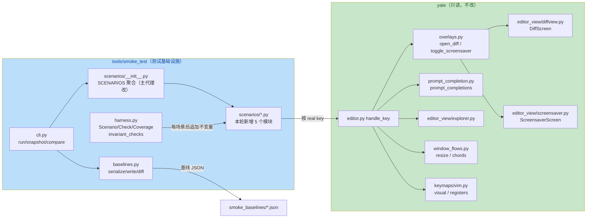

# 冒烟测试扩充计划（smoke-test-expansion）

> **实施状态**：✅ 已实施 —— 2026-10-05，14 个新场景 + 65 条新单测落地，
> 命令/动作覆盖补到 45/45 与 66/66。真实数字见文末「执行记录」。

## 一、目标与非目标

### 1.1 目标

1. **补齐冒烟覆盖的最后两个缺口**：命令覆盖 `44/45`（缺 `diff`）、动作覆盖
   `65/66`（缺 `toggle_screensaver`），把 `--coverage` 推到 `45/45` +
   `66/66`（100% / 100%）。
2. **补齐 89 个场景未覆盖的高价值用户路径**（`:diff` 视图、屏保、只读守卫、
   未知命令 / 动作、prompt tab 补全、explorer 导航、开目录切工作区、窗格
   resize chord、vim visual / 寄存器），每个场景读 `app.editor.*` 具体状态
   断言，风格与现有场景一致。
3. **给冒烟工具自身补纯函数单测**：`baselines.py`（`jsonable` / `serialize` /
   `write_baselines` / `load_baseline` / `diff_baseline`）、`cli.py`（`_worse` /
   `build_parser` / `_write_json` / `main` 三条退出码路径）、`harness.py`
   （`Coverage` 计数规则 / `rng_for` 确定性 / **不变量钩子非空转**的正向证明）
   —— 这三块目前是 `tests/test_smoke_tool.py` 的空白。
4. **给场景注册表加结构性守卫**：场景名唯一、标签 ⊆ `harness.TAGS`，防止后续
   追加场景时重名或用非法标签静默失配。

### 1.2 非目标

- 不改 `yate/` 产品源码（本次全部为测试 / 工具 / 文档改动）。
- 不重构 `tools/smoke_test/` 既有模块（`harness.py` / `report.py` /
  `baselines.py` / `cli.py` 的结构与行为保持不变，只被测试覆盖）。
- 不动既有 63 个基线 JSON（只为本轮新增场景写新基线）。
- 不追 100% 的 pytest 行覆盖（门禁维持 `--cov-fail-under=75`）。

## 二、现状盘点（实测，2026-10-05）

| 事实 | 实测值 / 依据 |
|---|---|
| 场景总数 | 89（`tools/smoke_test/scenarios/__init__.py` 聚合 11 个功能模块 + `_base`） |
| 全量运行 | `89/89 scenarios passed`，`932/932 checks`，82–89s，exit 0 |
| 命令覆盖 | `44/45`，missing: `diff` |
| 动作覆盖 | `65/66`，missing: `toggle_screensaver` |
| 基线 | `tools/smoke_test/smoke_baselines/` 共 63 个 `*.json`（不含 SVG 行） |
| 工具自身单测 | `tests/test_smoke_tool.py` 14 例，只覆盖 `select_scenarios` / timeout / `extract_svg_rows` / `Reporter` 的 4 个方法 |
| 隔离手法 | `harness.py:32` 全局 `YATE_PYTHON_LSP=off`；`harness._speed_up_pilot()` 把 `SLEEP_GRANULARITY` 降到 0.001；真 shell / 真 PTY 场景标 `slow=True` 交给 `--skip-slow`；`integration.py:19` `_FakePty` + `TerminalPanel.view_factory` 钩子做无进程终端 |
| worktree | `../yate-smoke-scenarios`，分支 `enh/smoke-test-scenarios`，沙箱已自证指向 worktree |

缺口清单（`code-explorer` 只读调研，69 次工具调用）分 A/B/C 三档，C 档
（已覆盖）已明确排除，避免重复加场景。

## 三、备选方案与否决理由

| 方案 | 内容 | 裁决 |
|---|---|---|
| **A（采纳）按功能面新建场景模块 + 并行子代理** | 每个新场景模块一个**新文件**（`diffview.py` / `guards.py` / `screensaver.py` / `workspace_nav.py` / `vim_advanced.py`），文件互不重叠，可按 `subagent-workflow.md` 并行下发；聚合入口 `scenarios/__init__.py` 由主代理在集成波统一改 | ✅ 采纳。文件独占天然满足，且不改既有 13 个场景模块，回归面最小 |
| B 往既有模块（`files.py` / `view.py` / `panes.py`）里追加 | 不新建文件 | ❌ 否决：`files.py` 已 445 行、`view.py` 350 行，多成员并行会争抢同一文件，违反文件独占；且 diff / 屏保 / 窗格 chord 各自是独立功能面，混入既有模块可读性更差 |
| C 一次性把 A/B/C 三档缺口全补 | 约 30 个新场景 | ❌ 否决：本轮只做 A 档（12 个场景）+ 工具单测。B 档缺口（vim 寄存器细分、terminal 复活、manual 内搜索等）留给后续按需补，避免单次提交过大、flake 定位困难 |
| D 只补覆盖率那两个缺口（`:diff` + 屏保），不补其它路径 | 2 个场景 | ❌ 否决：覆盖率指标已达 98%，再刷覆盖率边际收益低；真正的价值在 A 档缺口（只读守卫、未知动作、prompt 补全这类**出过错**的路径） |
| E 用 pytest 而非冒烟场景覆盖 A 档缺口 | 写 `tests/test_app_textual.py` 用例 | ❌ 否决：这些路径的验收面是「按键序列 + 端到端状态」，`tests/` 里的同类用例已与冒烟重叠（SKILL.md「后续建议 2」）；走冒烟可以顺带拿到 SVG 基线与 `--coverage` 记账 |
| F 新场景直接改 `harness.new_app` 加 `readonly=` 参数以覆盖 `--readonly` 启动路径 | 扩工厂签名 | ❌ 否决：本轮 A 档用 `:set readonly=true` 即可覆盖只读语义；改 `new_app` 签名会波及全部 89 个场景的公共入口，收益不足。可列为 B 档待办 |

## 四、模块交互



## 五、分步实施计划

规则：`subagent-workflow.md` 批大小 2~3（硬上限 6），写盘成员显式
`bypassPermissions`；每个子代理只改名下文件，**不得改 `yate/`**；探活与 spawn
同回合闭合；只认落盘结果，主代理重跑门禁。

### 波 0（主代理）—— 方案落盘

- 输入：本文档。
- 改动文件：`.trae/documents/smoke-test-expansion-plan.md`（新增）。
- 输出：方案文档。
- 验收：`git status` 仅本文档一个新增文件。

### 波 1（3 个子代理并行，均为**新增**场景文件）

| 成员 | 独占文件 | 场景 | 关键断言（依据） |
|---|---|---|---|
| A | `tools/smoke_test/scenarios/diffview.py` | `diff_two_way_navigate`、`diff_three_way_merge`、`diff_failure_paths` | `:diff a b` 成功开屏（`overlays.py:118-168`、`diffview.py:520-586`）；`alt+down` 选 hunk、`alt+right` 复制（`diffview.py:842-944`）；`esc` 二次确认关闭（`diffview.py:1021-1035`）；失败四分支只留 message：`usage: :diff` / `no such file` / `not a text file` / `--3way needs three files`（`commands.py:342-363`）。**先读 `diffview.py` 核实私有字段真名再断言** |
| B | `tools/smoke_test/scenarios/guards.py` | `readonly_refuses_edits`、`unknown_command_and_action`、`prompt_tab_completion`、`search_and_goto_messages` | 只读拒绝打字 / `:w`（`document_flows.py:303-311`、`editor.py:653-657`）；`not an editor command:`（`editor.py:859-863`）、`unknown action:`（`keymaps/base.py:281-298`）；F5 + `set re` + tab 命令补全、`set theme=` 值枚举（`prompt_completion.py:30-146`）；`no active search` / `no matches for` / `not a line number`（`prompt_flows.py:59-144`） |
| C | `tools/smoke_test/scenarios/screensaver.py` | `screensaver_toggle_key`、`screensaver_idle_message` | `alt+shift+s` 开屏（`editor.py:618-624`）、screen_stack 2→1、任意键 dismiss（`screensaver.py:323-329`）、`config.screen_saver.enable=False` 时只写 message 不开屏（`overlays.py:201-204`）。**场景必须收尾干净**（`invariant:no_leftover_modal` 要求栈 ≤ 1） |

- 每个成员的验收命令（在 worktree 根执行）：
  ```powershell
  .venv\Scripts\python.exe -m tools.smoke_test run --scenario <NAME> --no-color
  ```
  未接入 `scenarios/__init__.py` 前无法用 `--scenario` 跑到，**故成员一律用临时
  直跑脚本验证**（`_probe_<name>.py` 放仓库根，`from scenarios 模块 import SCENARIOS`
  后 `run_scenarios`，验证完删除），并在报告中贴出实测输出。

### 波 2（3 个子代理并行）

| 成员 | 独占文件 | 内容 |
|---|---|---|
| D | `tools/smoke_test/scenarios/workspace_nav.py` | `explorer_navigate_and_esc`（`j/k/l/h` 导航 + `esc` 回编辑器 + 打字不污染 buffer，`editor_view/explorer.py:317-376`）、`open_directory_switches_workspace`（`:e <子目录>` 切工作区根 + 显示侧栏 + 聚焦树，`document_flows.py:192-209`）、`pane_resize_chords`（`ctrl+w` + `=` / `+` / `q` / `ctrl+w`，最小尺寸告警，`window_flows.py:139-215`） |
| E | `tools/smoke_test/scenarios/vim_advanced.py` | `vim_visual_mode_ops`（`v` / `V` / `>` / `<`、`mode_label()`、`keymaps.get("vim").mode`，`keymaps/vim.py:291-405`）、`vim_registers_text_objects`（`"ayy` → `"ap`、`daw`、`3dd`、`ciw`，寄存器与行数变化，`vim.py:422-484`） |
| F | `tests/test_smoke_baselines.py`（新）、`tests/test_smoke_cli.py`（新）、`tests/test_smoke_harness.py`（新） | baselines 纯函数（`jsonable` 的 Path / 容器 / 兜底 `repr`；`serialize`；`write_baselines` 写盘与返回计数；`load_baseline`；`diff_baseline` 的 `-` / `~` / `+` / svg drift 四类输出）；cli（`build_parser` 三个子命令与默认；`_worse` 的 error 优先与失败数比较；`_write_json` 的 totals / coverage 段；`main` 的「过滤无匹配 → 2」「compare 无基线 → 2」）；harness（`Coverage.note_command` 忽略空串 / `!shell` / 裸数字行跳；`Coverage.report` 交集与 missing；`set_seed` / `rng_for` 确定性；**不变量钩子正向证明**：跑一个真场景后断言 `invariant:*` 检查被追加且全绿；**注册表守卫**：场景名唯一 + 标签 ⊆ `TAGS`） |

### 波 3（主代理）—— 集成与收尾

1. `tools/smoke_test/scenarios/__init__.py`：导入并拼接 5 个新模块（追加在
   `_*_STRESS` 之后、`_*_ALIASES` 之前）。
2. 全量冒烟 + 覆盖率：`python -m tools.smoke_test run --coverage`，要求
   `89 + 12 = 101` 场景全绿、`commands 45/45`、`actions 66/66`。
3. 只为**新增场景**写基线（不覆盖既有 63 个）：
   `python -m tools.smoke_test snapshot --scenario <新场景名> ...`。
4. `python -m tools.smoke_test compare`（全量）→ 全 MATCH、exit 0。
5. 门禁（主代理亲自跑，退出码 0 为准）：
   ```powershell
   $env:PATH = "$env:LOCALAPPDATA\pyright-python\nodeenv\Scripts;$env:PATH"
   .venv\Scripts\python.exe -m pyright yate/ tests/ tools/
   .venv\Scripts\python.exe -m pytest tests/ -q --cov=yate --cov-fail-under=75
   .venv\Scripts\python.exe -m pytest tests/test_architecture.py -q
   ```
6. 文档回填：本文档「执行记录」+ 数字；`smoke-test-improvement-plan.md`
   状态行与场景数（59 → 101）；`.trae/skills/textual-pilot-smoke/SKILL.md`
   的场景分组列表补 5 个新模块。
7. 提交（每步一笔，只 commit 不 push）：
   `docs(plans)` → 每波场景 `test(smoke)`（按文件拆）→ 工具单测 `test(smoke)` →
   文档回填 `docs(smoke)`。

## 六、风险与回滚

| 风险 | 概率 | 影响 | 缓解 | 回滚 |
|---|---|---|---|---|
| 新场景 flake（pilot 时序、worker 未落地） | 中 | 中 | 只 `pilot.pause()` 推进，异步一律 `wait_until` 轮询；全量 `--repeat 2` 复核；先单场景跑通再交 | 删该场景文件并回退对应 `__init__.py` 行 |
| `:diff` / 屏保私有字段名与调研不一致 → 场景恒失败 | 中 | 低 | 成员必须先读 `diffview.py` / `screensaver.py` 源码核实字段名，禁止照抄调研结论 | 改断言字段名 |
| 场景收尾不干净（屏保 / diff 屏未关）→ 不变量 FAIL | 中 | 中 | 收尾前显式 `execute_action` 或按键关闭；波 3 第 2 步全量跑会立刻暴露 | 同上 |
| 新场景拖长总耗时（当前 89s） | 中 | 中 | 单场景 < 3s；12 个新场景按 1.5s 估约 +18s；必要时给重场景标 `slow` | 标 `slow` 交给 `--skip-slow` |
| 子代理零产出（探活无回信 / 文件零变化） | 中 | 中 | 判死后**不原样重试**，最多换配置重试一次，否则主代理直接写该文件 | 主代理代做并在汇报中如实标注 |
| 覆盖计数被新场景重复记账导致数字虚高 | 低 | 中 | 波 3 复核 `commands 45/45`、`actions 66/66` 与 missing 清单为空 | — |
| 全量 `snapshot` 误覆盖既有 63 个基线造成大面积 diff | 低 | 中 | 只对新增场景名逐个 `--scenario` 快照；`git status` 复核基线目录只增不改 | `git checkout -- tools/smoke_test/smoke_baselines` |

## 七、执行记录

### 7.1 实测数字（2026-10-05，worktree `enh/smoke-test-scenarios`）

| 项 | 实施前 | 实施后 |
|---|---|---|
| 场景数 | 89 | **103**（+14） |
| 检查数 | 932 | **1247**（100% 通过） |
| 命令覆盖 | 44/45（缺 `diff`） | **45/45（100%）** |
| 动作覆盖 | 65/66（缺 `toggle_screensaver`） | **66/66（100%）** |
| 基线文件 | 63 | **77**（只增 14，既有 63 个零改动） |
| 冒烟单测 | 14 | **79**（+65） |
| 全量 pytest | 1810 passed / 8 skipped | **1875 passed / 8 skipped**，exit 0 |
| 覆盖率 | — | **91%**（`--cov=yate`，门禁 75） |
| pyright strict | 0 | **0 errors**（`yate/ tests/ tools/`） |
| 架构测试 | 22 passed | **22 passed** |
| `compare` | — | **全 MATCH，exit 0** |
| 全量冒烟耗时 | 82–89s | 89s（`run`）／95s（`compare`） |

### 7.2 交付物（按提交顺序）

| 提交 | 内容 |
|---|---|
| `2ba17c5` | 本方案文档 |
| `bf9b197` | `scenarios/diffview.py`（3 场景）+ 接线 |
| `c37c55b` | `scenarios/guards.py`（4 场景）+ 接线 |
| `4a1c636` | `scenarios/screensaver.py`（2 场景）+ 接线 |
| `d186c26` | `scenarios/workspace_nav.py`（3 场景） |
| `09c4aa3` | `scenarios/vim_advanced.py`（2 场景）+ 两个模块的接线 |
| `e8786aa` | `tests/test_smoke_baselines.py` / `test_smoke_cli.py` / `test_smoke_harness.py`（65 用例） |
| `fdfa2a1` | 14 个新场景的基线 JSON |

### 7.3 子代理执行情况（按 `subagent-workflow.md` 如实汇报）

- 波 1 三名成员（diff / guards / screensaver）、波 2 三名成员（workspace_nav /
  vim_advanced / harness 单测）**全部存活并落盘**，零产出 0 人；全部以
  `bypassPermissions` 下发，spawn 与验证同回合闭合。
- 所有成员的**自述数字均由主代理独立复核**：pyright 逐文件重跑、五个新场景在
  接线后经 `--scenario` 重跑、65 条新单测重跑、全量 pytest 与 compare 由主代理
  亲自执行。成员报告与实测一致。
- 波 2 成员 F 反馈全量 pytest 首次因两个 pytest 实例并行争抢而被腰斩，清理后
  重跑；主代理的全量门禁为单实例干净运行。

### 7.4 偏离计划与校准理由

1. **场景数 12 → 14**：计划 §五 波 1/波 2 合计 12 个场景，实际 14 个。原因是
   屏保成员在交付时把「`enable=False`」与「角色表全非法」两种配置拆成两个 app
   断言（`screensaver_disabled_message`），比原计划的单场景多覆盖一条产品分支，
   属净增，无额外风险。
2. **场景名 `screensaver_idle_message` → `screensaver_disabled_message`**：成员按
   实际断言内容命名（该场景覆盖的是"配置导致不开屏"，不是 idle 轮询），已同步
   基线文件名。
3. **`pane_resize_chords` 的轴向与计划相反（计划有误）**：计划写「`:vs` 造两窗格
   再 `ctrl+w +` 放大」，但 `resize_pane` 的 `+` / `-` 作用于 **horizontal** 轴
   （即 `:sp` 上下分屏），`:vs` 树上 `+` 不动并直接落进 `pane already at its
   minimum size` 告警。场景按产品真实语义同时断言两条分支，反而把这条反直觉
   行为钉死了。
4. **`>` / `<` 缩进归属 NORMAL 而非 VISUAL**：计划把这两个键列在 visual 一节，
   实际 `keymaps/vim.py` 走 NORMAL 的 `_shift_row`（整行 select → 缩进 → 清选区），
   场景按真实分派实现并额外断言缩进后 `has_selection() is False`。
5. **tab 补全「值枚举循环」不成立（计划有误）**：`set theme=` 第一次 tab 补成
   唯一前缀后，候选过滤把该值排除、列表清空，值原地不动；真正能循环的是**路径
   候选**。场景按实测行为断言，docstring 写明成因，避免后来者照字面预期再踩。
6. **`message_text()` 只能子串匹配**：`PromptBar` 往 `Static` 写的是 Rich markup
   串，`plain_text()` 取不到 `.plain`，全等断言必红。既有场景本来就用 `in`
   子串法，本轮沿用。
7. **私有属性一律 `getattr` + `cast`**：pyright strict 下跨模块直读 `screen._regions`
   等报 `reportPrivateUsage`。按规则禁用 `# type: ignore`，改用 `getattr` 兜底
   并注释字段名来源。
8. **屏保 idle 自动触发路径未覆盖（主动放弃）**：`screen_saver.interval` 默认 120s
   且每次输入 `poke()` 复位，短场景内不可能自然到期；要稳定触发必须替换
   `IdleTracker` 的时钟（改产品侧或扩 `harness.new_app` 签名）。计划 §三方案 F 已
   否决扩工厂签名，故本轮不覆盖，登记为待办。
9. **屏保 `disabled` 场景用了两个 app**：`harness._run_one` 只对**最后一个**
   app 跑不变量扫描，故不变量实际校验的是第二个（角色表全非法）app；两者都从未
   开屏，无残留风险。已在场景 docstring 与基线说明中标注。

### 7.5 本轮发现的工具侧问题（已记录，未在本轮修）

**`invariant:no_leftover_modal` 对真实场景空转。** `run_test()` 退出时 Textual 会
清空 `screen_stack`（实测：pilot 内部为 2，退出后为 0），而 `run_scenarios` 的
不变量扫描发生在 `asyncio.run` 之后，因此该检查在真实场景里恒为真。要让它真正
生效，需要把栈深快照移到场景的 `async with` 块内（例如 `harness` 提供一个
`stack_depth(app)` 助手，由场景在收尾处自行断言），或改 `invariant_checks` 的调用
时机。影响面覆盖全部 103 个场景，属于 harness 行为变更，不在本轮范围内。

**缓解措施**：本轮 14 个新场景中涉及弹层的 6 个（diff 三条、屏保两条）都在场景内
**自行断言**了 `len(app.screen_stack)`，因此不依赖该不变量。回归测试
`tests/test_smoke_harness.py` 里用私有 `_screen_stacks` 复现了"留弹层"并断言钩子
能判 FAIL，证明钩子本身有效、只是时机不对。

### 7.6 待办（下一轮候选）

1. 修 `invariant:no_leftover_modal` 的扫描时机（上条）。
2. 补 B 档缺口：`vim_registers_text_objects` 的算子细分、terminal 死 shell 复活、
   manual 内 `/` 搜索、`trust` 无 extensions 目录分支、breadcrumbs 断言。
3. `--readonly` 启动路径（需先决定是否扩 `harness.new_app` 签名）。
4. `report.py` 的 `note` / `json_written` / `compare` 着色分支仍无单测，可并入
   本轮 §一.1 第 3 条的后续。
