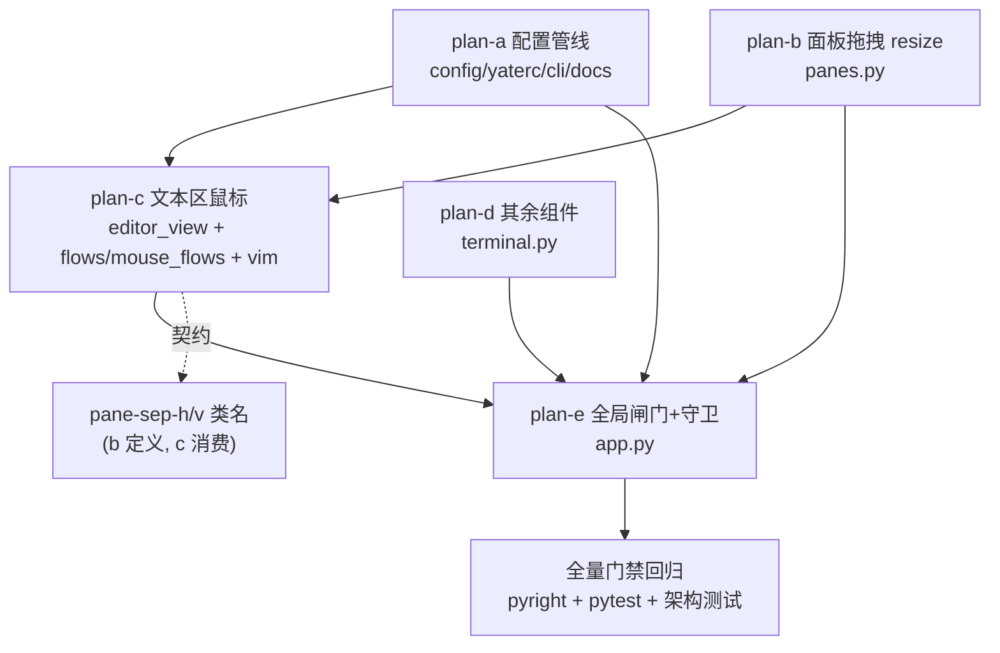

# support-mouse 总纲（Gitee issue IKJRFK：全面支持鼠标操作）

主任务：为 yate 开放全面鼠标操作——不管 vsc/vim keymap 都可用；yaterc 新增
`support_mouse` 布尔开关（禁用时完全不响应任何鼠标交互）；支持单击、双击、
拖拽框选（含面板拖拽 resize）；tabbar / explorer / statusbar / terminal /
命令行 / 滚动条 / 缓冲区文本区全部有对应鼠标响应。

方案由 5 个子计划组成，落盘于本目录；本文是总纲（唯一波次调度依据）。

## 一、调研结论（全部为 worktree 内实证，行号以 HEAD f8d0aa9 为准）

### 配置管线

- 选项白名单 `KNOWN_OPTIONS`：`yate/config.py:34-38`；`YateConfig` 字段
  `yate/config.py:122-173`；`:set` 选项表 `SET_OPTION_SPECS`
  `yate/config.py:259-309`（布尔解析器 `_parse_bool_option` 已存在
  `yate/config.py:250-252`，复用即可）。
- rc 提取 `_extract_options`：`yate/yaterc.py:552` 起；布尔样板照
  `show_hidden` 分支（`yate/yaterc.py:619-626`）；`load_config`
  `yate/yaterc.py:127-190`；CLI 装载（N30 回调注入）`yate/cli.py:319-323`；
  resolved 启动日志 `yate/cli.py:344-349`；`YateApp.__init__` 收 config
  `yate/app.py:85-100`。
- 双语手册选项表：`yate/docs/yaterc.en.md:65-87`（zh.md 成对）。

### 现有鼠标面

- TabBar 点击切标签：`yate/editor_view/chrome.py:119-128`（`on_mouse_down`
  命中 `_regions` 后 `event.stop()`）。
- 滚动条：`meta={"@mouse.down": ...}` 保留 Textual 拖拽语义
  `yate/editor_view/scrollbars.py:60-74`，内建 grab/滚动无需改动。
- 终端仅转发滚轮：`yate/editor_view/terminal.py:268-276`；`TerminalView`
  `can_focus = True`（`yate/editor_view/terminal.py:72-75`）但无点击聚焦。
- 屏保 MouseMove 响应：`yate/editor_view/screensaver.py:323-335`（存量保留）。
- **文本区零鼠标实现**：`EditorView`（`yate/editor_view/editor.py:123`，
  ScrollView 子类）无任何 `on_mouse_*` handler；全仓 `MouseDown` 消费点仅
  chrome.py:119 一处。
- keymaps 与鼠标零关联，也不存在禁用机制——现状是"没有鼠标通路"而非"被禁用"。

### 文本区坐标与选区映射要素

- 渲染几何：`render_line` 以 `y + scroll_offset.y` 定位缓冲行
  （`yate/editor_view/editor.py:625`），横向自管 `scroll_col`
  （editor.py:167/681），文本窗口起点 = `_gutter_w()`
  （editor.py:612/681）。
- 反向映射已存在：`cell_to_char`（`yate/editor_view/theme.py:780-790`，
  tab/宽字符感知）——鼠标 x → 字符列无需新算法。
- 光标/选区写入路径：`TextBuffer.set_cursor(pos, select=False)`
  （`yate/editor_core/buffer.py:327-342`，clamp+anchor 语义完备，keymap
  也走它）；`anchor/cursor` 即选区状态（buffer.py:292-321）；键盘选区
  （shift+方向 / v 模式）最终都落到 `set_cursor(..., select=True)`。
  **鼠标应复用同一条路径**，不要另立选区状态。
- 词边界纯函数已有：`_is_word` / `prev_word_start` / `word_end`
  （`yate/editor_core/buffer.py:46-79`）——双击选词只差一个
  `word_span` 组合函数。
- vim 模式机：`VimMode` enum、`self.mode`（`yate/keymaps/vim.py:98`），
  visual 进入 `vim.py:586-593`；缺一个"点击退出 visual"的公开方法。

### 窗格模型与分隔条形态

- 分隔条**不是独立 widget**：`PaneHost._build`（`yate/editor_view/panes.py:489-501`）
  用 `Vertical/Horizontal` 容器嵌套叶子，分隔线是子 widget 的 CSS 边框类
  `pane-sep-h`（border-bottom）/ `pane-sep-v`（border-right）
  （`yate/resources/pane-host.tcss:15-20`，只挂在每对的前一个子上）。
- 键盘 resize：`PaneManager.resize`（`yate/editor_view/panes.py:381-404`）+
  `find_axis_split`（`yate/session.py:356-374`）；常量 `MIN_FRACTION=0.12` /
  `RESIZE_STEP=0.08`（`yate/session.py:230-233`）；fraction 应用回 widget 树
  `PaneHost.apply_sizes`（`yate/editor_view/panes.py:552-569`）。

### Textual 8.2.8 运行时事实（.venv 实装核验）

- `Click.chain`：连续点击计数，2=双击 3=三击（`textual/events.py:641,674`）；
  chain 由 `App.on_event` 在 MouseUp 时合成（`textual/app.py:4086-4117`）。
- 拖拽捕获：`Widget.capture_mouse()` / `release_mouse()`
  （`textual/widget.py:4614/4624`）——捕获后 MouseMove 持续送达捕获 widget。
- **App.on_event 是未转发鼠标事件的唯一转发点**（`textual/app.py:4060-4082`
  `self.screen._forward_event(event)`）——这就是 `support_mouse=false`
  全局闸门的落点；yate 的 `YateApp.on_event` 已覆写该钩子
  （`yate/app.py:223-235`）。
- Tree 内建点击选中（`textual/widgets/_tree.py:1453 _on_click`）、Input 内建
  点击定位光标——explorer 与命令行的点击行为免费获得。
- Pilot 测试面：`mouse_down` / `mouse_up` / `click` / `double_click` /
  `hover`（`textual/pilot.py:100,147,192,251,349`）；move 步骤用
  `_post_mouse_events`（pilot.py:383，即公开方法共用的底层机制）。
- 终端模拟器**无鼠标跟踪**（`yate/editor_term/` 内 grep 1000/1002/1006 零
  命中）：终端内的程序从不申请鼠标事件，yate 侧点击/滚轮无捕获冲突。

## 二、目标与非目标

### 目标

1. `support_mouse` 配置项全链路：yaterc → `YateConfig` → `:set` 表 →
   双语手册 → 启动日志。
2. 缓冲区文本区：单击移光标（含 gutter 点击钳到列 0）、左键拖拽框选、
   双击选词、三击选行、shift+点击扩展选区、点击聚焦/激活窗格。
3. vim 模式协同：normal/visual/insert 下点击与选择语义正确（visual 点击
   退出回 NORMAL；insert 点击保持 INSERT；拖拽=字符选区）。
4. 面板拖拽 resize：分隔条边框按住拖动，fraction 实时更新（钳在
   `MIN_FRACTION`）。
5. 其余组件：terminal 点击聚焦；explorer 点击打开（内建）；命令行点击
   （内建）；tabbar/滚动条/屏保现状保留。
6. `support_mouse=false` 全局闸门：App 层单一入口丢弃一切 MouseEvent。
7. 架构守卫：新增 flows 模块登记 + 闸门守卫用例。

### 非目标

- statusbar / breadcrumbs 点击动作（展示性元素，无交互语义；点击落空即
  设计行为，issue 的"对应鼠标响应"以"可点击区域均有语义或明确落空"满足，
  理由见 plan-d §二）。
- TabBar 双击关闭、中键关闭标签。
- 终端内应用的鼠标转发（DECSET 1000/1002/1006）：模拟器不支持，申请侧
  也不存在。
- diffview 弹层内的鼠标增强。
- 光标样式（鼠标悬停变十字等）与悬停提示。
- 拖拽时的边缘自动滚动（光标钳制已保证不出界）。

## 三、默认值与禁用语义（定案）

- **默认 `True`**：鼠标支持是纯增量能力；Textual 应用默认开鼠标是生态
  惯例；关闭是 vim 老手/ssh 场景的显式 opt-out。
- **禁用语义 = 完全静默**：`YateApp.on_event` 在 Textual 转发前丢弃一切
  `MouseEvent`（含内建 widget 的滚动条拖拽、Tree 点击、屏保 MouseMove、
  terminal 滚轮）。理由：
  1. "禁用时不响应任何鼠标交互"最直读的实现就是零事件到达；
  2. Textual 内建 widget（ScrollBar/Tree/Input）的鼠标处理在框架内部，
     逐组件闸门既盖不全又要在每个组件埋检查；
  3. 单一入口 = 一处守卫 + 一条守卫测试。
  代价：滚轮翻 terminal 历史等辅助交互一并禁用——由 rc 作者显式选择，可接受。

## 四、子计划索引与波次表

| 子计划 | 主题 | 独占文件（yate/ 下） | 波次 |
|---|---|---|---|
| `support-mouse-config-plan-a.md` | `support_mouse` 配置管线 | `config.py` `yaterc.py` `cli.py` `docs/yaterc.en.md` `docs/yaterc.zh.md` | wave-1 |
| `support-mouse-pane-resize-plan-b.md` | 面板拖拽 resize | `editor_view/panes.py` | wave-1 |
| `support-mouse-text-area-plan-c.md` | 文本区鼠标 + keymap 协同 | `editor_view/editor.py` `flows/mouse_flows.py`（新）`editor.py` `keymaps/vim.py` `editor_core/buffer.py` `tests/test_architecture.py`（登记） | wave-2 |
| `support-mouse-components-plan-d.md` | 其余组件鼠标 | `editor_view/terminal.py` | wave-2 |
| `support-mouse-gate-plan-e.md` | 全局闸门 + 架构守卫 + 收尾 | `app.py` `tests/test_architecture.py`（守卫） | wave-3 |

波次规则：

- **wave-1：plan-a ∥ plan-b**（文件零重叠，可并行）。
- **wave-2：plan-c ∥ plan-d**（文件零重叠；plan-c 依赖 plan-a 的
  `config.support_mouse` 字段与 plan-b 的 `pane-sep-h/v` 类名契约；
  plan-d 独立）。
- **wave-3：plan-e**（依赖 a/b/c/d 全部验收通过；`tests/test_architecture.py`
  在 wave-2 由 plan-c、wave-3 由 plan-e 先后触碰，分波无冲突）。
- 每波全部子计划验收命令退出码 0 才进入下一波；波次一经批准不得执行中
  重排，调整须回填本文并附实测依据。

### 依赖关系图



## 五、全局风险清单

| 风险 | 影响 | 缓解 | 回滚 |
|---|---|---|---|
| 坐标映射错位（gutter/横向 scroll_col/宽字符） | 点击落点偏差 | 复用 `cell_to_char`（theme.py:780）与既有渲染要素（同源同式）；plan-c 用例覆盖 gutter/tab/宽字符边界 | 单提交还原 editor_view/editor.py + flows/mouse_flows.py |
| 拖拽事件被子 widget 吞掉 | resize/选区失灵 | 实证 App.on_event 转发链（textual/app.py:4060-4082）+ `capture_mouse` 语义；plan-b/c 各有 pilot 用例 | 见各子计划回滚 |
| vim 状态机被鼠标打乱 | visual/insert 语义漂移 | 状态迁移收敛为 `VimKeymap.drop_visual` 单方法；缓冲操作全部走 `set_cursor` 既有语义 | 还原 vim.py 单方法 |
| 闸门误伤（屏保/滚动条） | 禁用态行为争议 | 语义定案"完全静默"（本文 §三）；plan-e 守卫用例钉死 | 还原 app.py on_event |
| 架构守卫回归 | 合并阻塞 | plan-c 登记 UI_FROZEN_FILES；`MouseFlows` 无 App 句柄（§三.8 清单逐项过） | 登记与代码同提交 |
| 每次MouseMove全量refresh_ui的开销 | 大文件拖拽卡顿 | `lsp.notify_edit` 版本守卫（`yate/editor_lsp/manager.py:379-385` no-op when unchanged）、`doc_shown_later` 早退（`yate/flows/lsp_sync.py:66-74`），与键盘路径同成本；如实测仍卡，降级为仅 `status_bar.refresh_status()`（plan-c 备选步骤） | 备选步骤二选一 |

## 六、统一验收命令（每子计划的收尾门禁）

```powershell
.venv\Scripts\python.exe --version             # 确认 .venv（3.12）
.venv\Scripts\python.exe -m pyright yate/ tests/ tools/
.venv\Scripts\python.exe -m pytest tests/ -q
.venv\Scripts\python.exe -m pytest tests/test_architecture.py -q
```

- pyright strict 零诊断（pyproject `[tool.pyright]` include 全仓）。
- pytest 全绿；架构测试无违规（合并阻塞项）。
- 纯文档步骤（手册表格）按 `misc-rules.md` §三豁免测试，但随所在子计划
  的代码步骤一并走全量门禁（混合变更不可豁免）。
