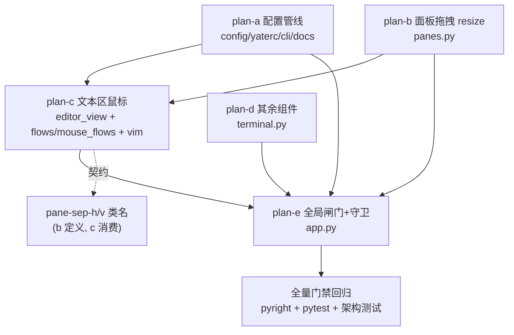

# support-mouse 总纲（Gitee issue IKJRFK：全面支持鼠标操作）

主任务：为 yate 开放全面鼠标操作——不管 vsc/vim keymap 都可用；yaterc 新增
`support_mouse` 布尔开关（禁用时完全不响应任何鼠标交互）；支持单击、双击、
拖拽框选（含面板拖拽 resize）；tabbar / explorer / statusbar / terminal /
命令行 / 滚动条 / 缓冲区文本区全部有对应鼠标响应。

方案由 5 个子计划组成，落盘于本目录；本文是总纲（唯一波次调度依据）。

## 一、调研结论（全部为 worktree 内实证，行号以 HEAD f8d0aa9 为准）

### 配置管线

- 选项白名单 `KNOWN_OPTIONS`：`yate/config.py:34-38`；`YateConfig` 字段
  `yate/config.py:122-173`；`:set` 选项表 `SET_OPTION_SPECS`
  `yate/config.py:259-309`（布尔解析器 `_parse_bool_option` 已存在
  `yate/config.py:250-252`，复用即可）。
- rc 提取 `_extract_options`：`yate/yaterc.py:552` 起；布尔样板照
  `show_hidden` 分支（`yate/yaterc.py:619-626`）；`load_config`
  `yate/yaterc.py:127-190`；CLI 装载（N30 回调注入）`yate/cli.py:319-323`；
  resolved 启动日志 `yate/cli.py:344-349`；`YateApp.__init__` 收 config
  `yate/app.py:85-100`。
- 双语手册选项表：`yate/docs/yaterc.en.md:65-87`（zh.md 成对）。

### 现有鼠标面

- TabBar 点击切标签：`yate/editor_view/chrome.py:119-128`（`on_mouse_down`
  命中 `_regions` 后 `event.stop()`）。
- 滚动条：`meta={"@mouse.down": ...}` 保留 Textual 拖拽语义
  `yate/editor_view/scrollbars.py:60-74`，内建 grab/滚动无需改动。
- 终端仅转发滚轮：`yate/editor_view/terminal.py:268-276`；`TerminalView`
  `can_focus = True`（`yate/editor_view/terminal.py:72-75`）但无点击聚焦。
- 屏保 MouseMove 响应：`yate/editor_view/screensaver.py:323-335`（存量保留）。
- **文本区零鼠标实现**：`EditorView`（`yate/editor_view/editor.py:123`，
  ScrollView 子类）无任何 `on_mouse_*` handler；全仓 `MouseDown` 消费点仅
  chrome.py:119 一处。
- keymaps 与鼠标零关联，也不存在禁用机制——现状是"没有鼠标通路"而非"被禁用"。

### 文本区坐标与选区映射要素

- 渲染几何：`render_line` 以 `y + scroll_offset.y` 定位缓冲行
  （`yate/editor_view/editor.py:625`），横向自管 `scroll_col`
  （editor.py:167/681），文本窗口起点 = `_gutter_w()`
  （editor.py:612/681）。
- 反向映射已存在：`cell_to_char`（`yate/editor_view/theme.py:780-790`，
  tab/宽字符感知）——鼠标 x → 字符列无需新算法。
- 光标/选区写入路径：`TextBuffer.set_cursor(pos, select=False)`
  （`yate/editor_core/buffer.py:327-342`，clamp+anchor 语义完备，keymap
  也走它）；`anchor/cursor` 即选区状态（buffer.py:292-321）；键盘选区
  （shift+方向 / v 模式）最终都落到 `set_cursor(..., select=True)`。
  **鼠标应复用同一条路径**，不要另立选区状态。
- 词边界纯函数已有：`_is_word` / `prev_word_start` / `word_end`
  （`yate/editor_core/buffer.py:46-79`）——双击选词只差一个
  `word_span` 组合函数。
- vim 模式机：`VimMode` enum、`self.mode`（`yate/keymaps/vim.py:98`），
  visual 进入 `vim.py:586-593`；缺一个"点击退出 visual"的公开方法。

### 窗格模型与分隔条形态

- 分隔条**不是独立 widget**：`PaneHost._build`（`yate/editor_view/panes.py:489-501`）
  用 `Vertical/Horizontal` 容器嵌套叶子，分隔线是子 widget 的 CSS 边框类
  `pane-sep-h`（border-bottom）/ `pane-sep-v`（border-right）
  （`yate/resources/pane-host.tcss:15-20`，只挂在每对的前一个子上）。
- 键盘 resize：`PaneManager.resize`（`yate/editor_view/panes.py:381-404`）+
  `find_axis_split`（`yate/session.py:356-374`）；常量 `MIN_FRACTION=0.12` /
  `RESIZE_STEP=0.08`（`yate/session.py:230-233`）；fraction 应用回 widget 树
  `PaneHost.apply_sizes`（`yate/editor_view/panes.py:552-569`）。

### Textual 8.2.8 运行时事实（.venv 实装核验）

- `Click.chain`：连续点击计数，2=双击 3=三击（`textual/events.py:641,674`）；
  chain 由 `App.on_event` 在 MouseUp 时合成（`textual/app.py:4086-4117`）。
- 拖拽捕获：`Widget.capture_mouse()` / `release_mouse()`
  （`textual/widget.py:4614/4624`）——捕获后 MouseMove 持续送达捕获 widget。
- **App.on_event 是未转发鼠标事件的唯一转发点**（`textual/app.py:4060-4082`
  `self.screen._forward_event(event)`）——这就是 `support_mouse=false`
  全局闸门的落点；yate 的 `YateApp.on_event` 已覆写该钩子
  （`yate/app.py:223-235`）。
- Tree 内建点击选中（`textual/widgets/_tree.py:1453 _on_click`）、Input 内建
  点击定位光标——explorer 与命令行的点击行为免费获得。
- Pilot 测试面：`mouse_down` / `mouse_up` / `click` / `double_click` /
  `hover`（`textual/pilot.py:100,147,192,251,349`）；move 步骤用
  `_post_mouse_events`（pilot.py:383，即公开方法共用的底层机制）。
- 终端模拟器**无鼠标跟踪**（`yate/editor_term/` 内 grep 1000/1002/1006 零
  命中）：终端内的程序从不申请鼠标事件，yate 侧点击/滚轮无捕获冲突。

## 二、目标与非目标

### 目标

1. `support_mouse` 配置项全链路：yaterc → `YateConfig` → `:set` 表 →
   双语手册 → 启动日志。
2. 缓冲区文本区：单击移光标（含 gutter 点击钳到列 0）、左键拖拽框选、
   双击选词、三击选行、shift+点击扩展选区、点击聚焦/激活窗格。
3. vim 模式协同：normal/visual/insert 下点击与选择语义正确（visual 点击
   退出回 NORMAL；insert 点击保持 INSERT；拖拽=字符选区）。
4. 面板拖拽 resize：分隔条边框按住拖动，fraction 实时更新（钳在
   `MIN_FRACTION`）。
5. 其余组件：terminal 点击聚焦；explorer 点击打开（内建）；命令行点击
   （内建）；tabbar/滚动条/屏保现状保留。
6. `support_mouse=false` 全局闸门：App 层单一入口丢弃一切 MouseEvent。
7. 架构守卫：新增 flows 模块登记 + 闸门守卫用例。

### 非目标

- statusbar / breadcrumbs 点击动作（展示性元素，无交互语义；点击落空即
  设计行为，issue 的"对应鼠标响应"以"可点击区域均有语义或明确落空"满足，
  理由见 plan-d §二）。
- TabBar 双击关闭、中键关闭标签。
- 终端内应用的鼠标转发（DECSET 1000/1002/1006）：模拟器不支持，申请侧
  也不存在。
- diffview 弹层内的鼠标增强。
- 光标样式（鼠标悬停变十字等）与悬停提示。
- 拖拽时的边缘自动滚动（光标钳制已保证不出界）。

## 三、默认值与禁用语义（定案）

- **默认 `True`**：鼠标支持是纯增量能力；Textual 应用默认开鼠标是生态
  惯例；关闭是 vim 老手/ssh 场景的显式 opt-out。
- **禁用语义 = 完全静默**：`YateApp.on_event` 在 Textual 转发前丢弃一切
  `MouseEvent`（含内建 widget 的滚动条拖拽、Tree 点击、屏保 MouseMove、
  terminal 滚轮）。理由：
  1. "禁用时不响应任何鼠标交互"最直读的实现就是零事件到达；
  2. Textual 内建 widget（ScrollBar/Tree/Input）的鼠标处理在框架内部，
     逐组件闸门既盖不全又要在每个组件埋检查；
  3. 单一入口 = 一处守卫 + 一条守卫测试。
  代价：滚轮翻 terminal 历史等辅助交互一并禁用——由 rc 作者显式选择，可接受。

## 四、子计划索引与波次表

| 子计划 | 主题 | 独占文件（yate/ 下） | 波次 |
|---|---|---|---|
| `support-mouse-config-plan-a.md` | `support_mouse` 配置管线 | `config.py` `yaterc.py` `cli.py` `docs/yaterc.en.md` `docs/yaterc.zh.md` | wave-1 |
| `support-mouse-pane-resize-plan-b.md` | 面板拖拽 resize | `editor_view/panes.py` | wave-1 |
| `support-mouse-text-area-plan-c.md` | 文本区鼠标 + keymap 协同 | `editor_view/editor.py` `flows/mouse_flows.py`（新）`editor.py` `keymaps/vim.py` `editor_core/buffer.py` `tests/test_architecture.py`（登记） | wave-2 |
| `support-mouse-components-plan-d.md` | 其余组件鼠标 | `editor_view/terminal.py` | wave-2 |
| `support-mouse-gate-plan-e.md` | 全局闸门 + 架构守卫 + 收尾 | `app.py` `tests/test_architecture.py`（守卫） | wave-3 |

波次规则：

- **wave-1：plan-a ∥ plan-b**（文件零重叠，可并行）。
- **wave-2：plan-c ∥ plan-d**（文件零重叠；plan-c 依赖 plan-a 的
  `config.support_mouse` 字段与 plan-b 的 `pane-sep-h/v` 类名契约；
  plan-d 独立）。
- **wave-3：plan-e**（依赖 a/b/c/d 全部验收通过；`tests/test_architecture.py`
  在 wave-2 由 plan-c、wave-3 由 plan-e 先后触碰，分波无冲突）。
- 每波全部子计划验收命令退出码 0 才进入下一波；波次一经批准不得执行中
  重排，调整须回填本文并附实测依据。

### 依赖关系图



## 五、全局风险清单

| 风险 | 影响 | 缓解 | 回滚 |
|---|---|---|---|
| 坐标映射错位（gutter/横向 scroll_col/宽字符） | 点击落点偏差 | 复用 `cell_to_char`（theme.py:780）与既有渲染要素（同源同式）；plan-c 用例覆盖 gutter/tab/宽字符边界 | 单提交还原 editor_view/editor.py + flows/mouse_flows.py |
| 拖拽事件被子 widget 吞掉 | resize/选区失灵 | 实证 App.on_event 转发链（textual/app.py:4060-4082）+ `capture_mouse` 语义；plan-b/c 各有 pilot 用例 | 见各子计划回滚 |
| vim 状态机被鼠标打乱 | visual/insert 语义漂移 | 状态迁移收敛为 `VimKeymap.drop_visual` 单方法；缓冲操作全部走 `set_cursor` 既有语义 | 还原 vim.py 单方法 |
| 闸门误伤（屏保/滚动条） | 禁用态行为争议 | 语义定案"完全静默"（本文 §三）；plan-e 守卫用例钉死 | 还原 app.py on_event |
| 架构守卫回归 | 合并阻塞 | plan-c 登记 UI_FROZEN_FILES；`MouseFlows` 无 App 句柄（§三.8 清单逐项过） | 登记与代码同提交 |
| 每次MouseMove全量refresh_ui的开销 | 大文件拖拽卡顿 | `lsp.notify_edit` 版本守卫（`yate/editor_lsp/manager.py:379-385` no-op when unchanged）、`doc_shown_later` 早退（`yate/flows/lsp_sync.py:66-74`），与键盘路径同成本；如实测仍卡，降级为仅 `status_bar.refresh_status()`（plan-c 备选步骤） | 备选步骤二选一 |

## 六、统一验收命令（每子计划的收尾门禁）

```powershell
.venv\Scripts\python.exe --version             # 确认 .venv（3.12）
.venv\Scripts\python.exe -m pyright yate/ tests/ tools/
.venv\Scripts\python.exe -m pytest tests/ -q
.venv\Scripts\python.exe -m pytest tests/test_architecture.py -q
```

- pyright strict 零诊断（pyproject `[tool.pyright]` include 全仓）。
- pytest 全绿；架构测试无违规（合并阻塞项）。
- 纯文档步骤（手册表格）按 `misc-rules.md` §三豁免测试，但随所在子计划
  的代码步骤一并走全量门禁（混合变更不可豁免）。

## 七、执行与评审回填（2026-10-08）

### 提交清单（enh/support-mouse）

| commit | 内容 |
|---|---|
| `0b8a919` | docs(plans)：本目录 6 份方案文档 |
| `b87ab80` | feat(config)：support_mouse 配置管线（plan-a） |
| `0aa1e3a` | feat(panes)：分隔条拖拽 resize（plan-b） |
| `0e4b217` | feat(editor)：文本区鼠标与选区 + MouseFlows + vim drop_visual（plan-c） |
| `248fe81` | feat(terminal)：终端点击聚焦 + explorer 哨兵（plan-d） |
| `b711b36` | feat(app)：support_mouse 全局闸门 + 架构守卫（plan-e） |

### 执行偏离（汇总，均已在子计划记录）

- plan-a：`yate/commands.py` 增 `_apply_support_mouse`（计划外文件）——既有守卫
  `test_set_option_specs_cover_all_dispatched_options` 钉死 `SET_OPTION_SPECS` 与
  `commands.SET_APPLY` 键集合 1:1，不加 apply 条目既有测试必失败。
- plan-b：pilot 多字符 press 需逐字符；用例 6 前置补 `ctrl+w h` 聚焦被点窗格
  （Textual click-to-focus 框架行为）。
- plan-c：`word_span` 改 `_is_word` 直推回退（`prev_word_start` 会跳过词间空格，
  违背自身测试语义）；拖拽测试 move 显式 `button=1`；双击 offset 修正。
- plan-e：禁用态用例经 `app.post_message` 注入（pilot 鼠标助手实证绕过
  `App.on_event`，textual/pilot.py:463）；点击 offset 对齐 plan-c 口径。

### 评审结论（code-review-expert，2026-10-08）

**可合并，无 blocker / major。** 门禁实测：pyright 0 诊断；pytest 全绿
（1 skip）；架构测试 26 passed；覆盖率 branch 模式 91.45%（≥75）；冒烟
`tools.smoke_test run` 107/107 场景 1286/1286 checks。重点疑点全部给出
实证结论（分隔条坐标/fraction 换算正确、坐标映射与渲染同源、vim 联动、
闸门顺序必要、capture 互斥、reconcile 失效路径无害、R10 合规）。
已知疑点定案：`test_close_command_closes_active_pane` 偶发失败为**既有
flaky**（reconcile 与渲染回调竞争窗口，master 同样可复现，本次改动未触碰
该调用链且新代码用非严格 `views.get` 刻意避开）。

### 评审修复（随本次提交落地）

- W1：架构规则文档同步——§一 L3 清单补 `mouse_flows.py`；§六 计数 25→26、
  表补第 26 行守卫、R11 条目补 `flows/mouse_flows.py`、新增 support_mouse
  闸门条目。
- S1：`PaneHost.on_mouse_move` 增 `event.button != 1` 校验（与其它 handler
  风格一致），拖拽测试注入同步 `button=1`。
- S3/S4：删除 `mouse_flows.py` 未使用的模块级 `log`；去掉 `len(self._drag) != 4`
  恒 False 的冗余防御。
- S5：测试侧 Textual 私有 API（`_post_mouse_events` /
  `_get_mouse_message_arguments`）登记收口注释（8.2.8 实证，升级需同步）。

### 遗留待办（评审 minor / suggestion，不阻塞合并）

- S2：双击/三击选区后 vim 处于 NORMAL + 有选区，operator 按 mode 分派
  而非 selection（`d` 不会删除选词）——与 gvim"双击进 visual"直觉相悖，
  属语义打磨；如要做需给 VimKeymap 加 `enter_visual` 公开方法，另行小计划。
- S6：panes.py 拒绝分支测试缺口——horizontal 轴分隔拖拽、非左键 down、
  hit 未命中、零位移 move，及 mouse_flows 双击空白的 `end <= start` 分支；
  主链路已覆盖（mouse_flows 86% / panes 87% / editor_view editor 85%），
  后续补测即可。

### python-code-review 修复（2026-10-08，第二轮框架评审）

6 维度结构化评审结论 LOOKS GOOD（0 CRITICAL / 0 WARNING / 4 SUGGESTION），
按用户指令逐条处置：

1. **已修（capture-on-consume）**：`EditorView.on_mouse_down` 改为派发
   消费后才 `capture_mouse()` + stop；未消费（空缓冲 pos=None）不再捕获，
   事件按 R10 放行。此前"先捕获后派发"靠 MouseUp 兜底释放，现语义同步。
2. **已修（LEFT_BUTTON 常量）**：左键魔数 `1` 散布 5 处，收敛为
   `yate/editor_view/editor.py` 的模块级 `LEFT_BUTTON`（L2 包内定义；
   mouse_flows 经既有 `yate.editor_view.editor` 冻结导入面引用，
   panes.py / terminal.py 为同包引用，零新增 UI_FROZEN_FILES 登记、
   零环——editor.py 不 import panes/terminal）。
3. **已修（MouseFlows 签名收缩）**：删除注入后未使用的 `session` /
   `_message` 参数与属性（计划原定"pyright 报则收缩"未触发，本轮评审
   升级为主动收缩），构造降为 3 参；`_build_pane_stack` 接线同步。
4. **事实纠偏后撤回（classes 子串匹配）**：原建议把
   `"pane-sep-v" in self.classes` 改为 `split()` token 集合——实施后
   3 个测试立即失败，实证 Textual 8.2.8 的 `Widget.classes` 本就是
   **frozenset**（成员即精确 token，无子串误伤），原实现正确。
   已回退，仅在 `_is_pane_border` 留一行实证注释防未来误改。

门禁复跑：pytest 全绿（2042 passed / 1 skip）、pyright 0 诊断、
架构测试 26 passed。教训登记：评审建议中关于第三方 API 形态的假设
（此处 `classes` 类型）必须先实证再改码。

### TRAE-code-review 处置（2026-10-08，第三轮框架评审）

双验证代理交叉验证（3 候选证伪 1、保留 2 minor，含 mermaid 概览图），
按用户指令「Fix All Issues」全部修复：

1. **已修（拖拽标志滞留）**：`MouseFlows.handle_view_mouse` 的
   `support_mouse` 闸门早退分支补 `self._dragging = False`——拖拽进行中
   `:set support_mouse off` 后闸门关闭，MouseUp 不再进入 `_on_up`，
   原实现会把 `_dragging` 永久置 True；重开开关后首条 MouseMove 会凭空
   延续选区。现在闸门关闭即清态。
2. **已修（MouseUp 按键门）**：`PaneHost.on_mouse_up` 补
   `event.button != LEFT_BUTTON` 早退，与 `on_mouse_move` 的按键门对齐——
   左键拖拽分隔条时松开其它键（chording）不得提前终止拖拽（提前
   `release_mouse()` 会让后续左键 MouseMove 丢失捕获）。

门禁复跑：pytest 全绿、pyright 0 诊断、架构测试 26 passed。

### Gitee PR#66 评审处置（2026-10-08，第四轮 · Gitee AI review bot，note 51471140）

1 阻断项 + 3 改进项；阻断项经 R10 条款文本与 Textual 8.2.8 源码双重实证
为误报，按用户指令「证伪 + 回归测试」处置：

1. **阻断项证伪（on_mouse_down 未消费不转发 → 称 R10 违规）**：R10 条款
   本义是"一次按键只派发一次"——防同一事件二次派发，条款文本针对
   `on_key`（键事件无条件 stop，EditorView docstring："stopped whether or
   not the key was consumed"）；鼠标通路的 R10 同类项在 `_forward_mouse`
   docstring 明文定义为"stop only the events the dispatcher consumed"——
   未消费不 stop 即放行。裸 `return` 不吞事件：Textual 8.2.8 `MouseDown`
   为 `bubble=True`（textual/events.py:581），派发后未 stop 自动冒泡到
   父级（textual/message_pump.py:833-839），事件到达 PaneHost（plan-b
   分隔条拖拽测试走同一条裸 return 冒泡路径，端到端实证）。评审建议的
   `else: _forward_mouse(event)` 会把同一 MouseDown 二次派发给 MouseFlows
   （对同一事件+状态确定性再返回 False），才是违反"一次事件只派发一次"
   的写法。处置：逻辑不动；未消费分支补冒泡语义注释（editor.py）；
   新增回归测试 `test_unconsumed_press_bubbles_to_pane_host` 钉死"未消费
   恰好冒泡一次到 PaneHost、光标不动、无二次派发"（support_mouse=False
   门 + pilot.click 屏级注入制造未消费路径；spy 用类级 patch——Textual
   派发按 cls.__dict__ MRO 查 handler，实例级 patch 不生效）。
2. **改进项 1 采纳（坐标映射一致性测试）**：新增
   `test_mouse_click_maps_columns_after_horizontal_scroll`（scroll_col=3：
   cell = x − gutter + scroll_col，含滚动后 gutter 点击钳 0）与
   `test_mouse_click_maps_rows_after_vertical_scroll`（scroll_offset.y=5：
   row = y + scroll_offset.y）——渲染/反算同源几何（gutter 两档宽度、
   行列滚动偏移）端到端钉死；`_gutter_w` 无 border 额外偏移的疑问由
   既有 _GUTTER=6 口径用例（scroll 0）与新用例（滚动后）共同覆盖。
3. **改进项 2 不改（_on_move 全量刷新）**：评审自认"当前实现成本与键盘
   移动同阶，属于可接受的设计权衡"；总纲 §五 风险表已登记降级备选
   （仅 status_bar 刷新），无实测卡顿数据不触发。
4. **改进项 3 引用既有 S2**（双击/三击选区后 vim operator 按 mode 分派，
   `d` 不删选词）：上轮「遗留待办」S2 已登记"另行小计划"，处置不变。

门禁复跑：pyright 0 诊断；pytest 全绿（2046 passed / 1 skip，2047
collected）；架构测试 26 passed。

### code-review-expert 复核（2026-10-08，第五轮 · 评审第四轮处置提交）

结论 LOOKS GOOD（0 CRITICAL / 0 WARNING / 2 SUGGESTION）。门禁实测全绿：
pyright 0 诊断；pytest 2047 collected 全点 + 1 skip；架构测试 26 passed；
覆盖率 branch 模式 91.39%（≥75）；冒烟 107/107 场景 1286/1286 checks。
重点核对（类级 patch 机理、未消费路径制造、注释与滚动状态确定性、
登记数字一致性）全部经源码实证成立。两条 SUGGESTION 均采纳落地：

1. **派发计数 spy 补强**：`test_unconsumed_press_bubbles_to_pane_host`
   增 `MouseFlows.handle_view_mouse` spy（仅计 MouseDown；MouseUp 亦经
   `_forward_mouse` 通路，须过滤）断言"恰好派发一次"——原
   `len(calls)==1` 只能证伪"事件被吞"，钉不住 re-dispatch 变体（门关闭
   下二次派发无副作用仍绿）；接线依据 `Editor._on_view_mouse` 经
   `self.mouse_flows.handle_view_mouse(...)` 运行时属性查找（editor.py），
   实例级 patch 生效。补反向用例
   `test_consumed_press_does_not_reach_pane_host`：消费即 stop 半边，
   PaneHost spy 计数为 0（`_forward_mouse` docstring 契约双向钉死）。
2. **模块 docstring 补新测试面**：追加未消费冒泡契约与滚动坐标映射两类
   用例的自描述。

复跑门禁：pytest 全绿（本文件 14 用例）、pyright 0 诊断。

### Gitee PR#66 评审处置（2026-10-08，第六轮 · review bot 第二轮，note 51475815）

1 阻断项 + 3 改进项：

1. **已修（_on_up 按键门，阻断项成立）**：`MouseFlows._on_up` 补
   `event.button != LEFT_BUTTON` 早退，与 `_on_move` / 第三轮
   `PaneHost.on_mouse_up` 修复对齐——左键拖拽选区期间松开其它键
   （chording）不得清掉 `_dragging` 提前终止拖拽。同提交覆盖评审未
   点名的同型遗漏：`EditorView.on_mouse_up` 的 `release_mouse()` 原为
   无条件调用，非左键 MouseUp 会提前丢失 capture（第三轮登记的同一
   失败机理"后续左键 MouseMove 丢失捕获"），现按左键门放行。回归测试
   `test_right_button_up_during_drag_keeps_drag_alive`：左键按下进入
   拖拽 → 右键 MouseUp → 左键 MouseMove 继续扩选 → 左键 MouseUp 收尾，
   断言选区完整（旧实现此测试失败）。
2. **改进项 1 采纳（word_span EOL 边界测试）**：`tests/test_editor_core.py`
   增 `test_word_span_at_eol_boundary`（`word_span("hello", 5) == (5, 5)`），
   显式钉死 col == len(line) 精确边界（守卫 `0 <= col < len(line)` 的
   半开区间语义）。
3. **改进项 2 不改（_get_mouse_message_arguments 私有 API）**：既有收口
   注释已登记"verified on 8.2.8; revisit on upgrades"，与
   `keyproto/textual_internals.py` 同一 containment 纪律；try/except
   回退需手工复制 kwargs 构造——升级破坏时同样报错（TypeError），无净
   安全收益还掩盖契约漂移；pyproject 已固定 textual 版本，升级 PR 必然
   触及该测试文件。
4. **改进项 3 不改（_on_move 全量刷新）**：与第四轮同题，§五风险表已
   登记"与键盘移动同阶"结论与降级备选，无实测卡顿数据不触发。

门禁复跑：pyright 0 诊断；pytest 全绿（test_shell 超时击杀用例首跑
遇调度时序 flaky，单文件与全量复跑均绿，与本次改动无关）；架构测试
26 passed。
