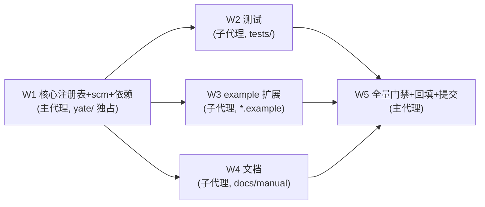

# syntax-langs-plan（issue IKJLTB：扩展内置语法高亮）

来源 issue：<https://gitee.com/jermaine/yate/issues/IKJLTB>
worktree：`../yate-syntax-langs`，分支 `enh/syntax-langs`（沙箱已重建并自证：
`.venv\Scripts\python.exe -c "import yate; print(yate.__file__)"` 指向 worktree）。

## 一、目标与非目标

### 目标

1. **内置 tree-sitter 高亮**：用 tree-sitter 语法包 + 打包 `queries/*.scm` 内置
   issue 列出的语言：csharp、rust、javascript、typescript、c、cpp、html、css、
   toml、go、powershell、java、json、lua、make、xml、xaml、php、ruby、markdown、
   sql、yaml、zig（perl 见"偏离"一节）。
2. **regex 回退注册**：为 regex 注册表目前缺失的语言（csharp、html、css、
   powershell、lua、make、xml、xaml、perl、php、ruby、sql、zig）补 `LangSpec`，
   使无 `[ts]` 依赖时仍有着色，且建立"后缀 → 语言名"映射（ts 后端的
   `resolve()` 依赖它，`languages.py:286-317`）。
3. **example 扩展**：在 `yate/extensions/` 提供 5 个 `.py.example` 模板，
   演示通过扩展系统支持 dos batch、ini、fsharp、git（gitignore/gitconfig）、
   diff 的语法高亮。
4. **打包与文档**：PyInstaller 收集清单、双语手册 FAQ、扩展文档同步更新。

### 非目标

- 不实现 tree-sitter **injections**（markdown 行内元素、html 内嵌 js/css 的
  跨语法着色不做，登记为已知限制）；
- 不动 `Document.filetype` 的后缀推导逻辑（`Makefile` 等无后缀文件的
  自动识别不做，仍可用 `:set filetype=`）；
- 不解除 py-tree-sitter `<0.26` 上界（Windows 堆损坏防护保留，
  `pyproject.toml:36-41`）。

## 二、调研结论（关键事实）

| 事实 | 证据 |
|---|---|
| ts 内置仅 python/bash 两条 | `yate/editor_syntax/ts_backend/languages.py:80-83` |
| 新增语言 = 4 处"填表"：`BUILTIN_PACKS` + `queries/<name>.scm` + extras + `_TS_PACKAGES` | `languages.py:160-182`、`pack/_common.py:36-40`、`pyproject.toml:35-44` |
| `resolve()` 要求语言名来自 regex 注册表 `LangSpec.name` | `languages.py:293-297` |
| `api.highlight.register` 会 `prefer_regex` 钉死 regex 后端 | `yate/services/extensions.py:163-164` |
| **csharp 现由捆绑扩展 `csharp_highlight.py` 以 regex 钉住** | `yate/extensions/csharp_highlight.py:80-96` |
| 22/23 语言有 PyPI 语法包；`tree-sitter-perl` 不存在 | pip index 实测（2026-10-04） |
| xaml 可复用 `tree_sitter_xml` 模块（`_load_builtin` 只调 `module.language()`） | `languages.py:169-170` |
| `LangSpec.mode` 支持 code/json/markdown/config | `regex_backend.py:43` |
| `test_builtin_packs_ship_a_query_file` 自动校验每个新 scm 存在 | `tests/test_ts_backend.py:383-386` |
| 子代理不得改 `yate/` 产品源码 → 23 个 scm 由主代理亲自写 | `subagent-workflow.md` §一.3 |

### PyPI 语法包实测版本（pip index versions，2026-10-04）

c 0.24.2、cpp 0.23.4、c-sharp 0.23.5、rust 0.24.2、javascript 0.25.0、
typescript 0.23.2、html 0.23.2、css 0.25.0、toml 0.7.0、go 0.25.0、
powershell 0.26.4、java 0.23.5、json 0.24.8、lua 0.5.0、make 1.1.1、
xml 0.7.0、php 0.24.1、ruby 0.23.1、markdown 0.5.1、sql 0.3.11、
yaml 0.7.2、zig 1.1.2、fsharp 0.3.12（仅 example 用，不进 extras）。
**perl：PyPI 无语法包**（tree-sitter-perl 404）。

## 三、备选方案与否决理由

1. **perl 的 tree-sitter 化**
   - ❌ 自行编译 shared lib 随包分发：跨平台构建成本高，违背"内置=填表"的
     轻量模式；
   - ❌ 引入第三方 wheel 源：不可信来源，不进内置表；
   - ✅ **perl 走 regex 后端**（新 LangSpec，pl/pm 后缀），偏离 issue 清单并
     如实登记；后续上游出包后按既有 4 处填表即可补上。
2. **csharp 与既有捆绑扩展的冲突**
   - ❌ 保留 `csharp_highlight.py`：其 `api.highlight.register` 会把 `cs`
     `prefer_regex` 钉死，ts 永远不生效，与 issue 目标直接冲突；
   - ✅ **删除 `csharp_highlight.py`**，csharp 改为内置（regex LangSpec +
     ts pack + scm），同步迁移其测试。
3. **markdown 行内着色**
   - ❌ 用 ts markdown 替换 regex 后束手旁观（行内全灰，比现状差）；
   - ✅ markdown.scm 只做块级（标题/围栏代码块/引用/链接/代码 spans），
     行内强调不做并在文档登记限制；regex 后端仍保留 markdown 词表作为
     依赖缺失时的回退。
4. **example 扩展用 tree-sitter 还是 regex**
   - ini/diff/git 无 PyPI 语法包，fsharp/batch 有无皆次要；
   - ✅ fsharp example 用 `api.syntax.register_tree_sitter`（演示 ts 通道，
     `tree-sitter-fsharp` 用户自装）；batch/ini/git/diff example 用
     `api.highlight.register`（LangSpec 声明式通道），覆盖两种扩展 API。
5. **`.tsx` 单独映射 tsx grammar**
   - ❌ `tree_sitter_typescript.language_tsx()` 需要改 `_load_builtin` 加
     特例，收益低；
   - ✅ `.tsx` 暂用 typescript grammar（jsx 节点不着色），登记限制。

## 四、分步实施计划

### W1 核心注册表与依赖（主代理）

- 输入：本方案 §二事实清单。
- 改动文件：
  - `yate/editor_syntax/regex_backend.py`：新增 13 条
    `register_language(...)`（csharp/html/css/powershell/lua/make/xml/xaml/
    perl/php/ruby/sql/zig，含后缀映射：`cs/csx`、`html/htm`、`css/scss/less`、
    `ps1/psm1/psd1`、`lua`、`mak/mk`、`xml`、`xaml`、`pl/pm`、`php`、`rb`、
    `sql`、`zig`）；
  - `yate/editor_syntax/ts_backend/languages.py`：`BUILTIN_PACKS` 扩至
    python/shell + 22 条新映射（csharp→tree_sitter_c_sharp、xaml→
    tree_sitter_xml、其余同名对应）；
  - 新建 23 个 `yate/editor_syntax/ts_backend/queries/*.scm`
    （csharp/rust/javascript/typescript/c/cpp/html/css/toml/go/powershell/
    java/json/lua/make/xml/xaml/php/ruby/markdown/sql/yaml/zig；捕获名仅用
    `DEFAULT_CAPTURE_MAP` 已有集合，`languages.py:90-114`）；
  - `pyproject.toml`：`ts` 与 `dev` extras 各加 22 个语法包；
  - `pack/_common.py`：`_TS_PACKAGES` 加 22 个模块名；
  - 删除 `yate/extensions/csharp_highlight.py`。
- 输出：依赖装齐后逐包探针脚本通过（每个 BUILTIN_PACKS 条目真实
  load + 对样例文本产出 token）。
- 验收命令：
  - `.venv\Scripts\python.exe -m pip install -e ".[dev]"`
  - 探针脚本（临时，验证后删除）：遍历 `BUILTIN_PACKS` 断言
    `resolve()` 非 None 且 tokenize 样例非空。

### W2 测试（子代理可承接，文件独占 `tests/`）

- `tests/test_ts_backend.py`：新语言 skipif + 每语言 1 条代表性高亮断言
  （keyword/comment/string 至少各一），迁移/删除 csharp_highlight 相关用例；
- `tests/test_highlight.py`：新 regex LangSpec 的回退断言；
- `tests/test_extensions.py`：如有 csharp 扩展加载用例则迁移；
- 验收命令：`.venv\Scripts\python.exe -m pytest tests/ -q`

### W3 example 扩展（子代理可承接，文件独占 `yate/extensions/` 新增 `*.example`）

- 新建 5 个模板（仿 `yatesh_syntax.py.example` / 现 csharp_highlight 结构，
  不自动加载）：
  - `batch_syntax.py.example`：`.bat/.cmd`，LangSpec（rem 注释、echo 等
    keyword、`%VAR%`）；
  - `ini_syntax.py.example`：`.ini/.cfg`，LangSpec `config` mode（演示
    覆盖内置 regex 注册）；
  - `fsharp_syntax.py.example`：`api.syntax.register_tree_sitter` +
    `tree-sitter-fsharp`；
  - `git_syntax.py.example`：`.gitignore/.gitconfig`，LangSpec `config`；
  - `diff_syntax.py.example`：`.diff/.patch`，LangSpec（`+++`/`---`/`@@`
    行内可着色的部分）。
- 验收：临时脚本把 example 去掉 `.example` 后注册成功且 tokenize 样例
  非空（验证后删除临时文件）。

### W4 文档（子代理可承接，文件独占 docs/manual）

- `yate/docs/extensions.en.md` / `.zh.md`：§4.7/4.8 语言清单同步；
- `yate/resources/manual.en.md` / `manual.zh.md`：FAQ"支持哪些语言"清单
  （manual.zh.md:1171-1192 一带）；
- `yate/docs/themes.*.md` 不动（SYNTAX_KINDS 未变）。

### W5 收尾（主代理，必做）

- 全量门禁：
  - `.venv\Scripts\python.exe -m pyright yate/ tests/ tools/`（零诊断）
  - `.venv\Scripts\python.exe -m pytest tests/ -q`（全绿）
  - `.venv\Scripts\python.exe -m pytest tests/test_architecture.py -q`
  - `.venv\Scripts\python.exe -m pytest tests/ -q --cov=yate --cov-fail-under=75`
- 方案文档回填真实结果与偏离记录；
- 按 `git-commit-message.md` 分步提交（只提交不推送）。

## 五、执行波次与子代理调度

- W2/W3/W4 文件互不重叠，可 2~3 个一批并行（`acceptEdits` 显式指定）；
- `yate/` 产品源码（W1 的注册表与 23 个 scm）按规则由主代理亲自写；
- 成员判死/零产出即改主代理直做，不阻塞主线。

## 六、风险清单与回滚

| 风险 | 缓解 |
|---|---|
| 个别语法包与 py-tree-sitter 0.25 ABI 不兼容（powershell 0.26.4 等新包） | W1 探针逐包实测；不兼容者从 BUILTIN_PACKS/extras 摘除并留 regex 回退（回滚 = 删一行映射 + scm） |
| scm 节点名与实际 grammar node-name 不符 → Query 构造失败降级 regex | 探针脚本对每语言断言 query 加载成功 + token 非空；失败即修 scm |
| 新增 22 包使 `[ts]` 安装体积/时长上升 | 各包均为小型预编译 wheel（合计约 20MB 量级），可接受；如超预期回填数据再议 |
| markdown 块级着色观感差 | 文档登记限制；不满足时可整体摘除该条映射（单点回滚） |
| 删除 csharp_highlight 影响冻结版扩展收集 | `pack/_common.py` 的 extensions Tree 自动跟随目录内容，无需改 spec |
| 回滚路径 | 整体回滚 = `git revert` 本任务提交；语言级回滚 = 删对应 `BUILTIN_PACKS` 条目（regex LangSpec 保留即回到纯 regex 现状） |

## 七、登记的偏离（对 issue 原文的校准）

1. **perl 不做 ts 化**（PyPI 无语法包），regex 兜底；issue 清单其余 23 项全做。
2. **markdown/ts 行内 injections 不做**，块级着色 + 文档登记限制。
3. **ini 同时存在于内置（regex）与 example**：example 演示扩展覆盖内置的
   能力，而非新增能力。
4. csharp 从"捆绑 regex 扩展"迁移为"内置 ts + regex 回退"，删除旧扩展文件。

## 八、执行记录（收尾回填）

- [ ] W1 结果（探针逐包数字）
- [ ] W2/W3/W4 成员存活与产出
- [ ] W5 门禁实测（pyright / pytest / 架构 / 覆盖率，含退出码）
- [ ] 偏离记录（如有新增）
