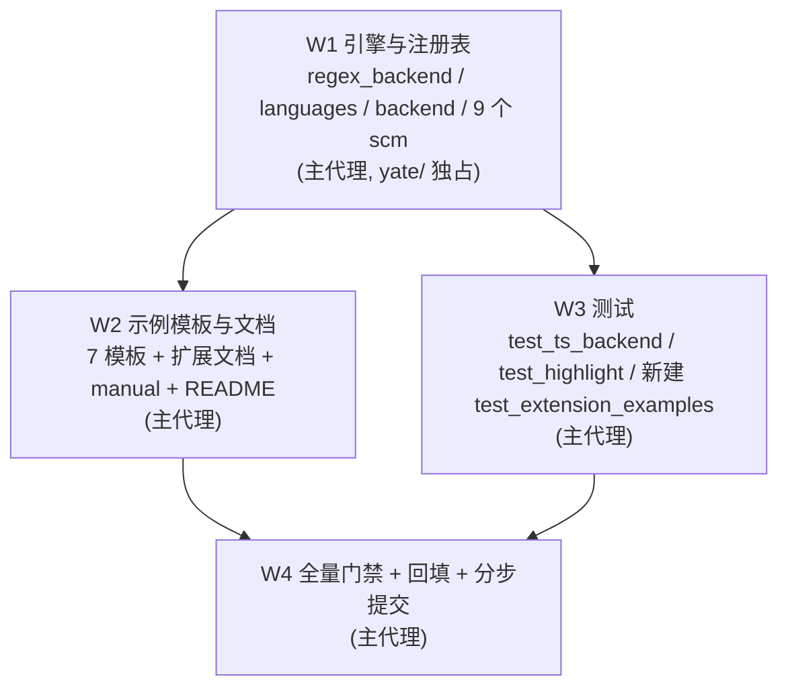

# syntax-langs-review-fixes-plan（修复 `2026-10-04-syntax-langs.md` 所列 issues）

来源评审：[`../reviews/2026-10-04-syntax-langs.md`](../reviews/2026-10-04-syntax-langs.md)（issue
IKJLTB 分支 `enh/syntax-langs` 评审，结论 MINOR ISSUES：0 CRITICAL / 5 WARNING / 若干 SUGGESTION）。
worktree：`../yate-syntax-langs`，分支 `enh/syntax-langs`（**续作任务，复用既有 worktree 与其
`.venv`**；沙箱自证 `.venv\Scripts\python.exe -c "import yate; print(yate.__file__)"` →
`D:\Programming\yate-syntax-langs\yate\__init__.py`）。评审 §一 记载 **W3 验收未执行**，
本方案一并补上。

## 一、目标与非目标

### 目标

1. 修掉评审 §二 G1–G8（查漏补缺）与 §三 H1–H10（六维度发现）中**可在现有实现内闭环**的问题；
2. 补两道静态守护（G4）+ 一批回归用例，锁死"文档/示例承诺"与"引擎能力"的边界；
3. 补做 W3 遗留验收（`*.py.example` 可加载、注册成功、tokenize 非空），并把它固化成测试，
   消除"模板完全不在任何质量门禁内"（H8）这一零防线；
4. 保持门禁全绿：pyright 零诊断 + pytest 全绿 + 架构测试 22 passed + 覆盖率 ≥75。

### 非目标

- 不新增语言、不新增 tree-sitter 语法包、不解除 `<0.26` 上界；
- 不给 `api.syntax.register_tree_sitter` 补"grammar 失败仍保留 regex 回退"——评审 H8 判定
  该承诺不成立，选择**改正文档**而非改实现语义（理由见 §三.7）；
- 不为 SCSS/LESS 引入 tree-sitter grammar（PyPI 无 `tree-sitter-scss`/`-less`），只修正
  路由（不再误用 CSS grammar）；
- 不做 markdown 行内 injections、`.tsx` 单独 grammar（同上游方案 §一 非目标）。

## 二、调研结论（关键事实，含实测）

| 事实 | 证据 |
|---|---|
| 评审文件在 worktree 内，不在主仓 | `../yate-syntax-langs/.trae/reviews/2026-10-04-syntax-langs.md`；主仓 `git worktree list` → `D:/Programming/yate-syntax-langs [enh/syntax-langs]` |
| 沙箱已装 **24 个语法包**（xml 兼 xaml），`tree_sitter` 0.25.2 未被 `_BLOCKED_TS` 拦截 | `.venv\Scripts\python.exe -m pip list`；`languages.py:37-67` |
| 唯一**没有**语法包的是 perl（按设计走 regex），以及 5 个 example 涉及的 `tree_sitter_fsharp` | `pyproject.toml` extras、`pack/_common.py:36-62` |
| `fsharp` 验收客观不可执行（`tree-sitter-fsharp` 未装） | 评审 §一 W3；`load_language_from_grammar` 缺包时 `raise ValueError`（`languages.py:285-288`） |
| `@builtin` 未登记 → `kind is None` → `continue` 丢弃 | `languages.py:123-149`、`backend.py:68-71` |
| `SYNTAX_KINDS` 确有 `builtin` / `heading` / `emphasis` | `tokens.py:29-44` |
| `heading` / `emphasis` 两个映射键在 `queries/` 内零使用 | `markdown.scm:8-13` 标题用 `@keyword`；`grep @heading\|@emphasis queries/` 零命中 |
| `scss`/`less` 与 `css` 共享同一 spec（`spec.name == "css"`），而 `resolve()` 用 `spec.name` 查表 | `regex_backend.py:452-458`、`languages.py:328-334` |
| 评审 H8 关于"注册失败仍留 regex 回退"的判断成立 | `register_language(LangSpec(name=key), ...)` 在 `load_language` **成功之后**（`languages.py:244-255`） |
| 同 span 双捕获的胜负由 `dict(cursor.captures(...))` 键序决定 | `backend.py:157-159` `sorted` 稳定 + 无二级排序键 |
| `:set filetype=` 候选现有 62 键 + 28 名（去重约 77 项），两处全量 join | `commands.py:274`、`editor.py:823`；截断写法见 `diagnostics.py:329-332` |
| `fsharp` 模板的 `_CAPTURE_MAP={"identifier": "function"}` 是死配置 | 查询无 `@identifier` 捕获；`DEFAULT_CAPTURE_MAP` 亦无 `identifier` |
| `Path('.gitignore').suffix == ''` → `Document.filetype` 落 `plaintext` | 前导点文件名无后缀（评审 G3 实测） |

## 三、备选方案与否决理由

1. **G1（markdown 围栏语言标签）**
   - ❌ 把 `markdown.scm:17` 的 `@builtin` 改成 `@function.builtin`：值同为 `builtin` kind，
     但捕获名语义变成"内建函数"，与"围栏代码块的语言标签"无关；
   - ✅ 在 `DEFAULT_CAPTURE_MAP` 补 `"builtin": "builtin"`（`SYNTAX_KINDS` 有 `builtin`），
     并由 G4 的静态测试把"scm 捕获名必须已登记"固化为不变式。
2. **G2（heading/emphasis 死映射）**
   - ❌ 删 `heading`：`markdown.scm` 的 `atx_h*_marker` / `setext_h*_underline` 明明有节点可用；
   - ✅ 标题标记改 `@heading`（`SYNTAX_KINDS["heading"] = syn_keyword`，**配色不变**，只改
     契约名）并同步 `tests/test_ts_backend.py:297` 断言；`emphasis` 反之——块级 markdown
     语法包无行内节点，无 scm 会用，**从映射表删除**避免"看起来支持、实际无效"。
3. **G5（scss/less 路由）**
   - ❌ 在 ts 侧加"仅 regex"名单：需要 `resolve()` 反向知道 regex 侧的意图，多一层耦合；
   - ✅ 把 `scss` / `less` 拆成独立 `LangSpec`（`name="scss"` / `name="less"`）：`resolve()`
     查不到 `BUILTIN_PACKS` 条目自然降级 regex，扩展键不变（文档口径无需改）。
4. **H2（`@` 一律当 decorator）/ H3（`$(VAR)` 不认）**
   - ❌ 改 `_IDENT_RE` 允许 `-`/`@` 起步：会连带影响全部 28 条 spec 的词表匹配；
   - ✅ 给 `LangSpec` **加开关**（`at_sigil` / `paren_vars`），只在需要它的 spec 上开启；
     `api.highlight.spec(**kwargs)` 直通 `LangSpec`，扩展作者同享，并同步双语字段表。
5. **H5（同 span 双捕获胜负靠字典序）**
   - ❌ 删掉宽捕获兜底（`c.scm:51` 等 8 处 `(field_identifier) @property`）：tree-sitter 查询
     **无法表达"不是调用"**（无否定谓词），删了 `obj.field` 就彻底不上色；
   - ❌ 靠 pattern 书写顺序：py-tree-sitter 的 `captures()` 返回的 dict 键序无跨版本契约；
   - ✅ 在 `backend.py::_tokens_for_row` 加**显式二级排序键**（kind 优先级表），
     docstring 写实 tie-break 规则，并加确定性单测。scm 不动。
6. **H8（示例模板零门禁）**
   - ❌ 把 `.py.example` 纳入 `pyproject.toml` 的 `include` + pyright：模板里是**故意**的
     教学代码（含"演示用"死配置），纳入静态检查会与 §一 非目标打架；
   - ✅ 新增 `tests/test_extension_examples.py`：`ast.parse` 全部模板（挡住语法腐化）+
     以桩 `ExtensionAPI` 真实执行 `setup()` 并断言注册成功、`tokenize_document` 非空
     （`fsharp` 用 `skipif` 因缺语法包，`yatesh` 需 `.so` 亦 skip）——这同时补上 W3 验收。
7. **W3 遗留验收（fsharp 无法执行）**
   - ❌ 把 `tree-sitter-fsharp` 塞进 `[ts]` extras：方案 §三.4 明确 example 只演示通道、
     不进内置表；
   - ✅ 模板 docstring 改为**如实**说明"缺依赖/查询非法 = 扩展加载失败并记入
     `record.error`，不会静默回退纯文本"（H8-1），测试用 `skipif` 表达"未装即跳过"。

## 四、分步实施计划

### W1 引擎与注册表（主代理，`yate/` 独占）

- 输入：本方案 §二 事实清单。
- 改动文件与逐条 issue：

| 文件 | 改动 | 对应 issue |
|---|---|---|
| `yate/editor_syntax/regex_backend.py` | `LangSpec` 增 `at_sigil` / `paren_vars` / `hyphenated_idents` 三开关并在 `_spec()` 贯通；`_tokenize_code_line` 按 `at_sigil` 把 `@name` 发 `property`；`_code_line_pattern` 增 `\$\([^)\n]*\)` 与连字符标识符分支 | H2、H3、H10-5 |
| 同上 | perl 补 `func_def_words={"sub"}`；`_PERL_KEYWORDS` 去重字面量；perl/ruby 内置函数从 `keywords` 移入 `builtins`；删除不可达词条（`_LUA_TYPES.function` / `_PS_TYPES.switch` / `_PHP_TYPES.static`,`callable`）；SQL 大小写展开提为具名常量 `_SQL_KEYWORDS_ALL` 等 | H1、H10-1/2/3/4 |
| 同上 | `css` / `scss` / `less` 拆三条独立 spec（键不变、名字分离）；`xaml` 补 `_XAML_TYPES` 元素词表 | G5、G6 |
| 同上 | `make` 删死项 `-include` 并开启 `paren_vars` | H3 |
| `yate/editor_syntax/ts_backend/languages.py` | `DEFAULT_CAPTURE_MAP` 补 `"builtin": "builtin"`、删死键 `emphasis`；`_load_builtin` 的 `except` 补 `log.debug(..., exc)` | G1、G2、H4 |
| `yate/editor_syntax/ts_backend/backend.py` | 加 kind 优先级表 + 排序二级键，docstring 写实 tie-break | H5 |
| `queries/markdown.scm` | 标题标记 `@keyword` → `@heading` | G2 |
| `queries/xaml.scm` | 头部加"与 xml.scm 保持同步"说明行 | H6 |
| `queries/html.scm` | 删 `:17` 冗余子集（与 `:14` 产生完全相同区间） | H7-4 |
| `queries/php.scm` | 探针确认节点名后补插值串捕获 | H7-2 |
| `queries/yaml.scm` | 探针确认后补引号 key 捕获，与无引号 key 视觉一致 | H7-3 |

- 输出：每条改动都有对应回归用例（W3），门禁零诊断。
- 验收命令：
  - `.venv\Scripts\python.exe -m pytest tests/test_highlight.py tests/test_ts_backend.py -q`
  - 探针（临时脚本，验证后删除）：`php` 插值串、`yaml` 引号 key、`markdown` 围栏
    info_string 三处节点名逐个断言。

### W2 示例模板与文档（主代理，`yate/` 独占）

- 改动文件：
  - `yate/extensions/batch_syntax.py.example`：删 docstring 里"labels"（引擎无 label/goto 处理）；
  - `yate/extensions/diff_syntax.py.example`：删死项 `"GIT"` 与大小写重复的 `"binary"`；
  - `yate/extensions/fsharp_syntax.py.example`：docstring 改为如实说明加载失败语义；
    删死配置 `_CAPTURE_MAP`（改为注释说明"新增映射写这里"）；
  - `yate/extensions/git_syntax.py.example`：docstring 更正 `.gitignore` 无后缀，
    需手工 `:set filetype=gitignore`；
  - `yate/services/extensions.py`：`register_tree_sitter` docstring 更正"最小 regex 回退"承诺；
  - `yate/docs/extensions.en.md` / `.zh.md`：删 `%VAR%` 承诺；`LangSpec` 字段表补 3 个新开关；
    §4.7 措辞与实现对齐；
  - `yate/resources/manual.en.md` / `manual.zh.md`：`--setup-defaults` 的"两个扩展示例"→
    7 个（batch/diff/example_ext/fsharp/git/ini/yatesh）；FAQ 语言清单与"除 JSONC、INI、
    Perl 外"口径保持自洽；zh 侧模板清单补 `fsharp_syntax.py.example`；
  - `README.md` / `README.zh.md`：修 "everything above plus Python/Shell" 的自相矛盾与
    Perl 误列（改按"25 种（除 JSONC、INI、Perl）"口径）；
  - `yate/commands.py` / `yate/editor.py` / `yate/diagnostics.py`：共用截断助手
    （H9）。
- 验收命令：`.venv\Scripts\python.exe -m pyright yate/ tests/ tools/`；
  `.venv\Scripts\python.exe -m pytest tests/test_docs.py -q`（若存在文档一致性用例）；
  `rg` 类核对：文档里不再出现 `%VAR%`、`两个扩展示例`。

### W3 测试（主代理，`tests/` 独占）

- 改动文件：
  - `tests/test_ts_backend.py`：新增
    `test_bundled_queries_only_use_registered_captures`（静态扫 `queries/*.scm` 非注释行的
    `@name` ⊆ `DEFAULT_CAPTURE_MAP`，**不依赖任何 grammar 包**）、
    `test_builtin_packs_match_packaging_manifests`（`BUILTIN_PACKS` ≡ `pack/_common.py`
    `_TS_PACKAGES` ≡ `pyproject.toml` 的 `ts` / `dev` extras）、同 span tie-break 确定性单测、
    markdown `heading` 断言同步；
  - `tests/test_highlight.py`：`test_sql_keywords_are_case_insensitive` 改用大写 SQL
    （真正打到大小写展开推导，删掉推导即红）；补 perl `sub` 函数名、perl/ruby `@` sigil、
    make `$(VAR)`、scss/less 不落 CSS grammar 的回退断言；
  - `tests/test_extension_examples.py`（新建）：模板 `ast.parse` + 桩 API 执行 `setup()`
    + `tokenize_document` 非空（补 W3 验收）。
- 验收命令：`.venv\Scripts\python.exe -m pytest tests/ -q`。

### W4 收尾（主代理，必做）

- 全量门禁：
  - `.venv\Scripts\python.exe -m pyright yate/ tests/ tools/`
  - `.venv\Scripts\python.exe -m pytest tests/ -q`
  - `.venv\Scripts\python.exe -m pytest tests/test_architecture.py -q`
  - `.venv\Scripts\python.exe -m pytest tests/ -q --cov=yate --cov-fail-under=75`
- 回填本方案 §六 执行记录（真实数字 + 偏离）+ 修正评审 G8 的失效行号指针；
  在评审记录里补本方案的反向链接（`doc-conventions.md` §二.2 要求双向链接）；
- 按 `git-commit-message.md` 分步提交（**只提交不推送**）。

## 五、执行波次与子代理调度

**子代理调度说明（显式偏离记录）**：本轮可委派面按 `subagent-workflow.md` §一.3 只有
`tests/`，而 W3 的断言全部依赖 W1 尚未定稿的实现细节（新增 `LangSpec` 开关、tie-break
规则、scm 改动），并行会读到未定稿代码；W1/W2 全在 `yate/` 下，子代理不得修改。
故按 §一 总则保留主代理兜底路径，**W1–W4 由主代理亲自执行**，不派发成员、不建团队。

## 六、风险与回滚

| 风险 | 缓解 |
|---|---|
| 拆 `scss`/`less` 后 `available_filetypes()` 候选集变化，打破既有补全断言 | 已实测：键（`scss`/`less`）不变，仅新增 2 个语言名；`test_available_includes_keys_and_names` 无候选数断言，未受影响 |
| `LangSpec` 加字段影响 `api.highlight.spec(**kwargs)` 与 `test_architecture` 静态断言 | 字段有默认值；pyright + 架构测试双门禁拦截（实测 0 诊断 / 22 passed） |
| scm 改动（php/yaml/markdown）节点名与实际 grammar 不符 → Query 构造失败降级 regex | 改前跑探针枚举真实节点名（`encapsed_string` / `double_quote_scalar` / `single_quote_scalar` / `info_string`）；改后 25 个 pack 全部 load + query 成功，逐语言样例用例仍绿 |
| tie-break 优先级表可能与某语言既有观感冲突 | 优先级只对**完全同 span** 生效，不改嵌套关系；已比对 25 语言样例输出（含 json `property` vs `string`、c/js 方法调用） |
| 示例测试用桩 API 执行 `setup()`，桩与真实 `ExtensionAPI` 漂移 | 用**真实** `ExtensionAPI`（仅上下文为 MagicMock），签名漂移由 pyright 拦截；实测 pyright 0 诊断 |
| 回滚路径 | 语言级 = 还原单条 scm；字段级 = 还原 `LangSpec` 三开关；整轮 = `git revert` 本任务提交 |

## 七、逐条处置对照（评审 G1–G8 / H1–H10）

| 编号 | 处置 | 落点 |
|---|---|---|
| G1 | ✅ 修 | `DEFAULT_CAPTURE_MAP` 补 `"builtin": "builtin"`；`markdown.scm` 围栏语言标签实测得到 `builtin` token |
| G2 | 🟡 部分（有意偏离） | `heading` 改为**真被使用**（`markdown.scm` 标题标记 + 同步测试断言）；`emphasis` **保留**而非删除——实测除 `emphasis` 外还有 10 个键（`attribute` / `escape_sequence` / `keyword.*` / `type.definition` …）同样未被任何内置 scm 使用，它们是扩展作者 grammars 的保留词表，删掉会破坏上游约定。改为在映射表上方写实这一点，并加注释 |
| G3 | ✅ 修（4 处） | 删 `%VAR%` 承诺（en/zh）；"两个扩展示例"→7 个（en/zh）；README 双语口径改为"除 JSONC、INI、Perl 外"；`git_syntax.py.example` 更正 `.gitignore` 无后缀、需手工 `:set filetype=gitignore`。另修 zh 手册模板清单漏 `fsharp` |
| G4 | ✅ 修 | 新增 `test_bundled_queries_only_use_registered_captures`（静态扫 scm，**不依赖 grammar 包**）与 `test_builtin_packs_match_packaging_manifests`（`BUILTIN_PACKS` ≡ `ts` extra ≡ `pack/_common.py::_TS_PACKAGES`，`dev` 为超集） |
| G5 | ✅ 修 | `scss`/`less` 拆成独立 `LangSpec`（`_css_family()`），键不变；实测 `available_for("css")` 为真而 `scss`/`less` 为假 |
| G6 | 🟡 部分（有意偏离） | 只补 `xaml` 的 `_XAML_TYPES`（60 个 WPF/UWP 常用元素）；`xml` 不补——XML 标签集开放，编一份词表只会给出**错误**的期望，方案 §一.2 的"仍有着色"由注释/属性值/实体已满足 |
| G7 | ✅ 修 | 用例补大写 SQL（`SELECT` / `FROM` / `COUNT`），删掉大小写展开推导即红 |
| G8 | ✅ 修 | `syntax-langs-plan.md` §二 的失效行号改为按用例名定位 |
| H1 | ✅ 修 | perl `func_def_words={"sub"}`，实测 `sub foo {` → `function foo` |
| H2 | ✅ 修 | `LangSpec.at_sigil` 开关，perl/ruby/powershell 开启（实测 `@items`/`@ivar`/`@rest` → `property`），python 仍为 `decorator`；双语字段表已补 |
| H3 | ✅ 修 | 删死项 `-include`；新增 `LangSpec.paren_vars`，make 开启，实测 `$(OS)` → `property` |
| H4 | ✅ 修 | `except Exception as exc` + `log.debug("tree-sitter load error for %s: %s", ...)`，探针确认坏 query 仍降级不崩 |
| H5 | ✅ 修（方案内偏离） | 走"代码层确定性 tie-break"而非删 scm 宽捕获：`_KIND_PRECEDENCE` / `_KIND_RANK` + 排序二级键，docstring 写实；新增顺序无关性单测。**未动 scm**——tree-sitter 查询无否定谓词，`obj.field` 无法与调用区分 |
| H6 | ✅ 修 | `xaml.scm` 头加"与 xml.scm 保持同步"说明 |
| H7 | 🟡 3/4 | php 补 `encapsed_string`（实测 `"a $name b"` 上色）；yaml 补引号 key（实测 `"key"` → `property`）；html 删真子集重复行；**`sql.scm` 数值未修**——`tree-sitter-sql 0.3.11` 只有单一 `(literal)` 节点同时覆盖字符串与数值，语法层面无法区分，登记为已知限制 |
| H8 | ✅ 修（6 项） | 4 个模板的 docstring/词表更正；fsharp 死配置 `_CAPTURE_MAP` 清空并注释说明用途；`services/extensions.py` 更正"最小 regex 回退"承诺；**新增 `tests/test_extension_examples.py`**（7 模板 `ast.parse` + 4 个声明式模板真实注册并断言 tokenize 非空 + 模板清单与手册计数对齐）——模板自此进入门禁 |
| H9 | ✅ 修 | 抽 `format_filetype_candidates(limit=12)`，`commands.py` / `editor.py` / `diagnostics.py` 三处复用（原来 `diagnostics.py` 内联、另两处全量 join） |
| H10 | ✅ 修（5/6） | perl 重复字面量去除；perl/ruby 内置函数移入 `builtins`（ruby `each` 移出 keywords）；不可达词条删除（lua/ps/php 共 4 个）；SQL 大小写展开提为 `_SQL_*_ALL` 具名常量；CSS 连字符属性经 `hyphenated_idents` 修复（`font-size` 整体着色，数值仍正常）。**php `#` 行注释 / powershell `<# #>` 块注释未做**——`LangSpec` 只有单个 `line_comment` 与 `block_comment` 字段，兼得需新增第二组字段，收益低于成本，登记待办 |

## 八、执行记录（2026-10-04 回填）

### 探针（改前/改后各跑一次，验证后删除）

- 节点名实测：`php` → `encapsed_string` / `string_content`；`yaml` → 引号 key 是
  `flow_node > double_quote_scalar`（**无** `string_scalar` 子节点，故现有 pattern 覆盖不到）；
  `markdown` → `info_string > language`。
- 改后 25 个 `BUILTIN_PACKS` 全部 load + `ts.Query` 构造成功，逐条断言通过（含 markdown
  `heading`/`builtin`、php 插值串、yaml 引号 key、json 同 span、html 标签、scss/less 不落
  CSS grammar、坏 query 降级）。
- 探针脚本（`_probe_nodes.py` / `_probe_verify.py`）与其输出已删除。

### W1 引擎与注册表

- 改动：`regex_backend.py`（3 个 `LangSpec` 开关 + perl/ruby/xaml/scss/less/make 词表 +
  SQL 具名常量 + 4 处不可达词条）、`languages.py`（`builtin` 映射 + 异常 debug）、
  `backend.py`（`_KIND_PRECEDENCE` tie-break）、5 个 scm。

### W2 示例模板与文档

- 改动：4 个模板 docstring/词表 + `batch` 启用 `at_sigil`（`@echo off` 原本被当装饰器，
  由新测试暴露）+ `yatesh` docstring 转 raw string（原 docstring 触发 `SyntaxWarning:
  invalid escape sequence '\p'`，由新测试暴露）；`services/extensions.py` docstring；
  `extensions.en/zh.md`（删 `%VAR%`、补 3 个字段表行、SCSS/LESS 口径）；
  `manual.en/zh.md`（7 个模板、FAQ 口径、zh 补 fsharp）；`README.md` / `README.zh.md`；
  `commands.py` / `editor.py` / `diagnostics.py`（H9 共用助手）。

### W3 测试

- `tests/test_ts_backend.py`：+4 用例（捕获名不变式、打包清单一致、markdown 两个捕获名、
  同 span 顺序无关、scss/less 名称分离），markdown 样例断言同步为 `heading` + `builtin`。
- `tests/test_highlight.py`：+9 用例（perl `sub`、`print` builtin、at_sigil 三语言 + python
  反例、make `$(VAR)` + 死项、css 连字符、scss/less 复用、词表无死项、候选截断），
  `test_sql_keywords_are_case_insensitive` 补大写断言（G7）。
- `tests/test_extension_examples.py`（新建，12 用例）：**补上评审 §一 W3 无法手工执行的验收**。

### W4 门禁实测（主代理亲自跑，worktree 沙箱）

| 门禁 | 命令 | 结果 |
|---|---|---|
| pyright strict | `python -m pyright yate/ tests/ tools/` | **0 errors, 0 warnings, 0 informations**，EXIT=0 |
| pytest 全量 | `python -m pytest tests/` | **1740 passed, 8 skipped in 234.39s**，EXIT=0（基线 1718/7 → +22 用例 +1 skip[fsharp]） |
| 架构测试 | `python -m pytest tests/test_architecture.py` | **22 passed**，EXIT=0 |
| 覆盖率 | `python -m pytest tests/ -q --cov=yate --cov-fail-under=75` | **91.20%**（≥75），EXIT=0 |

### 偏离汇总

1. G2 只改 `heading`、保留 `emphasis`（连同其余 10 个未用键）作为扩展 grammars 的保留词表；
2. G6 只补 xaml 词表，xml 不补（开放标签集，词表会给出错误期望）；
3. H5 走代码层 tie-break，scm 宽捕获保留（查询语言无法表达"非调用"）；
4. H7 的 `sql.scm` 数值着色未做（grammar 只有单一 `literal` 节点）；
5. H10 的 php `#` 行注释 / powershell `<# #>` 块注释未做（需第二组注释字段）；
6. **子代理未派发**：可委派面只有 `tests/`，其断言依赖 W1 未定稿实现；W1/W2 全在
   `yate/`（`subagent-workflow.md` §一.3），故 W1–W4 由主代理执行。
7. 遗留：`_gate_pytest.txt`（本轮门禁输出，未跟踪）因删除命令审批超时未能清掉，
   **未纳入任何提交**，需后续 `Remove-Item` 或提示用户删除。
